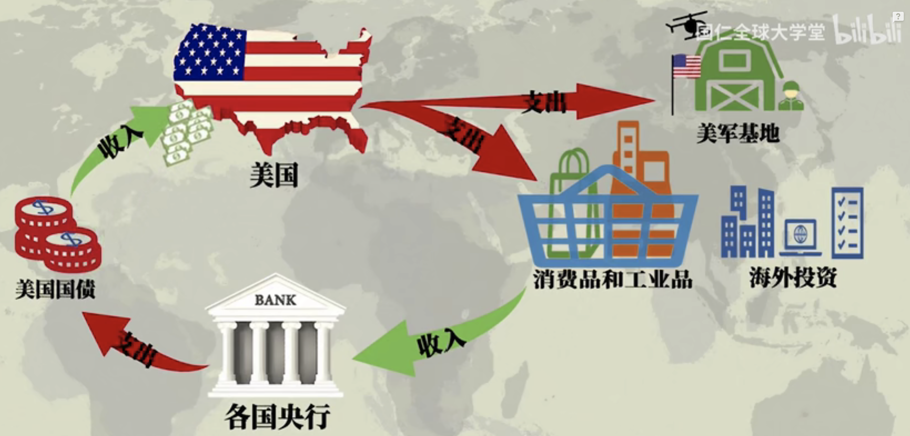

- 把主流西方经济学家们类比于西方宗教的教士们，可以说非常精髓
- 有一种观点是现代社会科学尤其是经济学管理学等构建的学术体是新时代的全新宗教形式，这观点在欧美蛮流行的
-
-
- 
- 只要人们相信美国国债具有价值，人们通过持有它，来认为自己很富有。他们相互之间可以交易这个借据，他们持续接受这些借据。那么上图的逻辑就可以实现
- 对于美国而言，需要解决的是国债的到期偿还问题。作为最大债权人，这个弹性就可以比较大了。
-
-