- 流计算 在 大数据处理计算模式的位置
	- 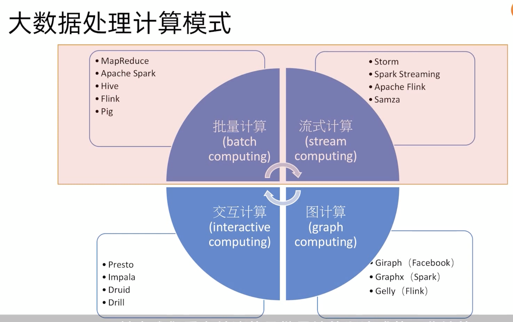
- 流计算与批计算对比
	- 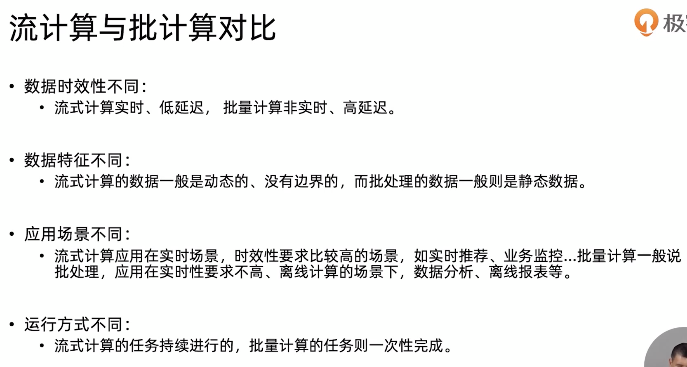
- 流计算将成为主流？
	- 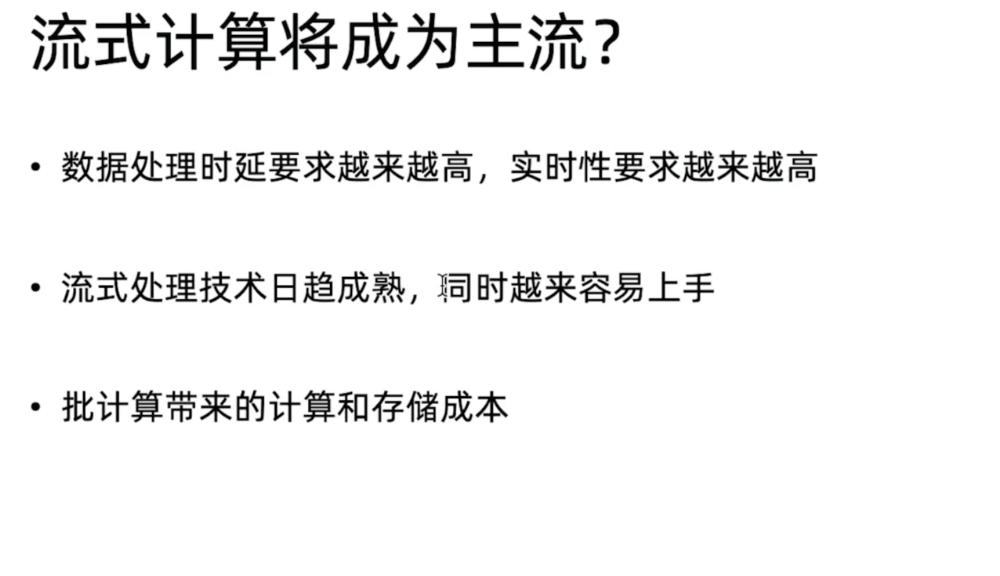
- 适合流计算的场景
	- 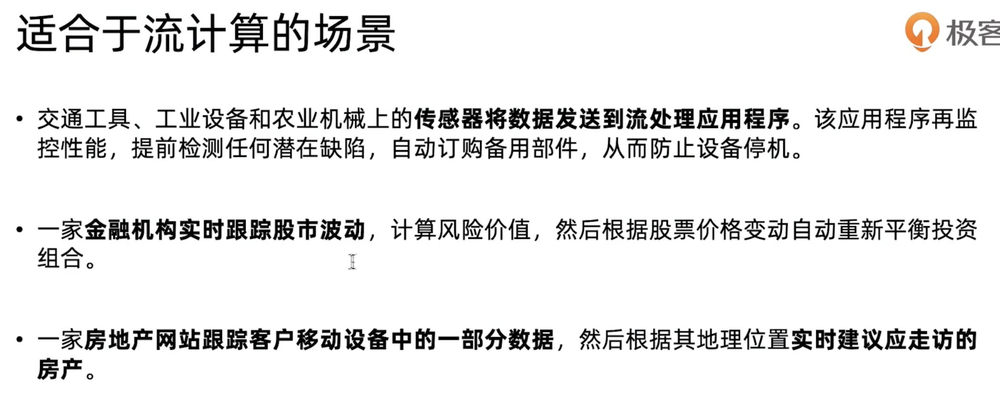
	- 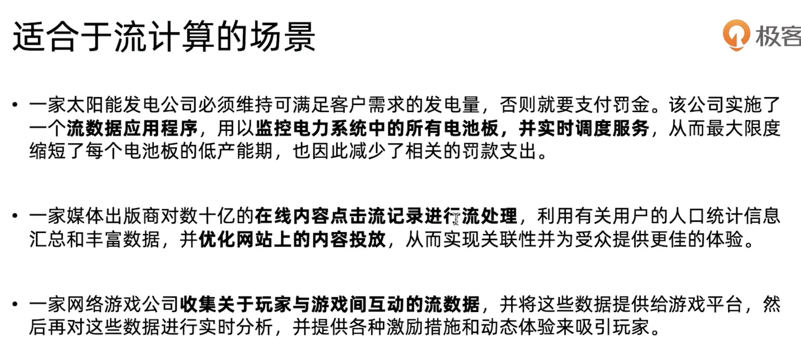
- Flink作为流计算框架的优势
	- 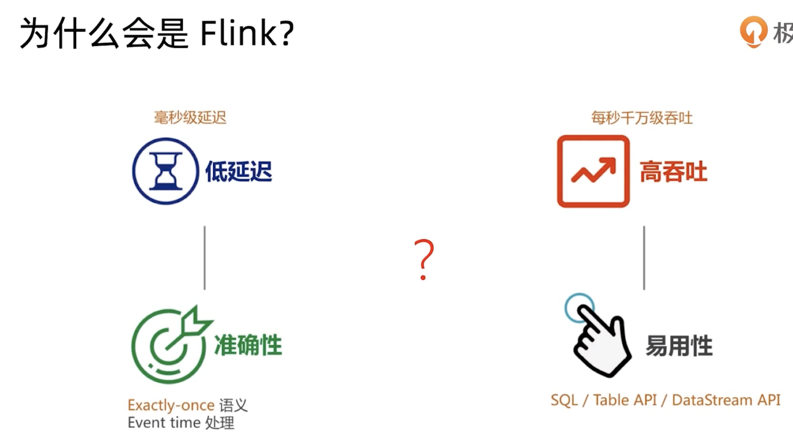
	- 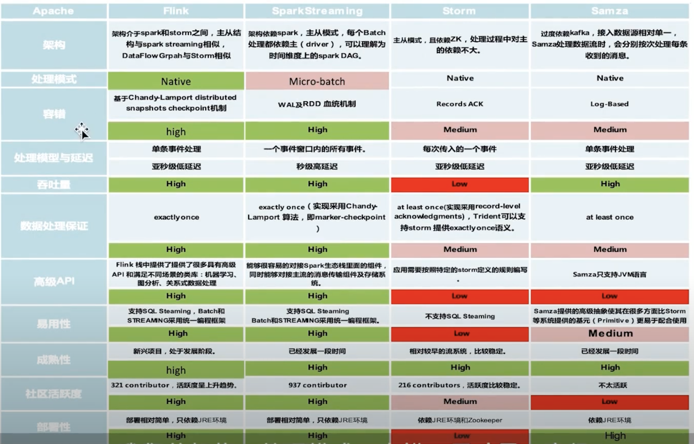
- Flink
	- 发展历史
		- 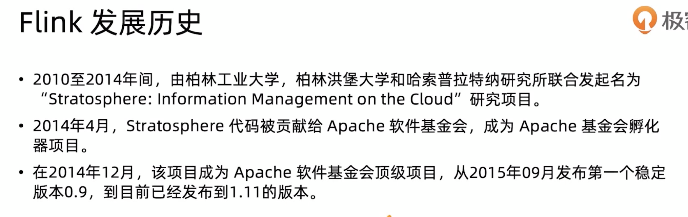
		- 学术项目的工业化
	- 应用场景
		- 实时监控的分析预警
		- 实时报表
		- 流数据分析 协助决策或个性化推荐
		- 实时数据仓库的实时数据清洗等
	- 核心特性
		- 统一数据处理组件栈
			- 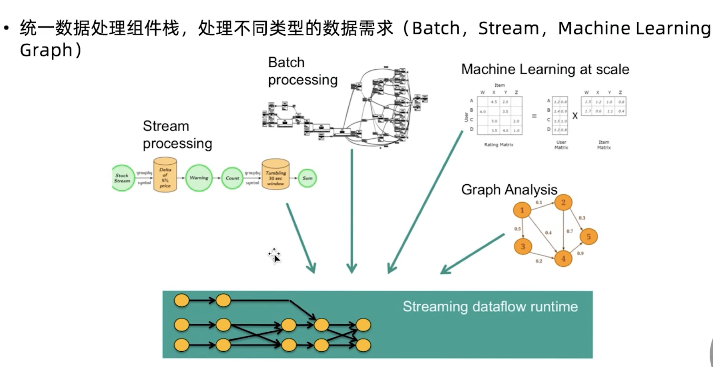
		- 支持多种时间概念
			- 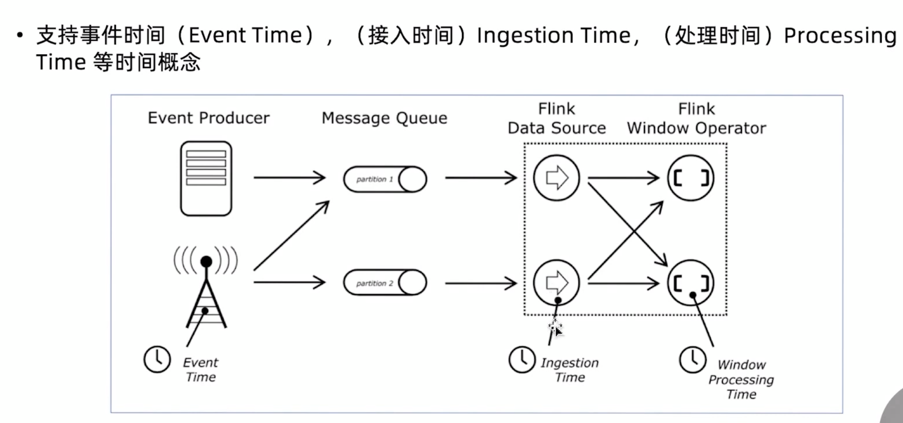
		- 数据一致性的保证
			- 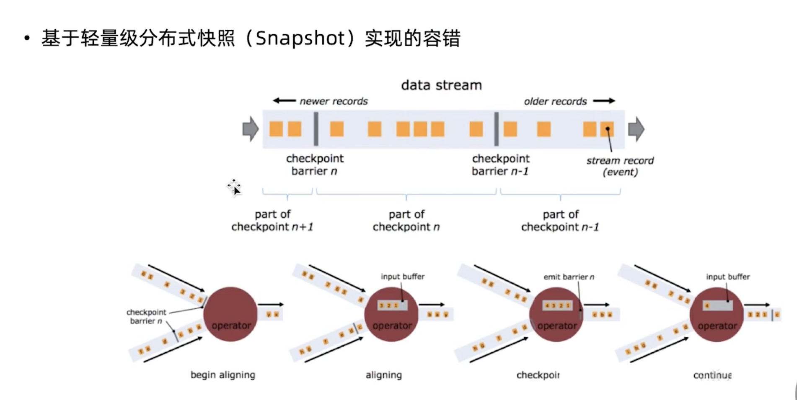
		- 支持有状态计算
			- 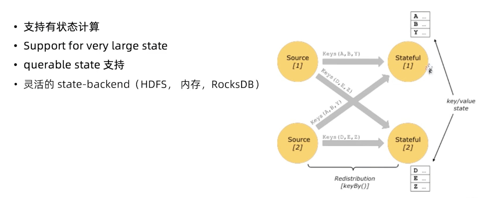
		- 支持高度灵活的窗口计算
			- 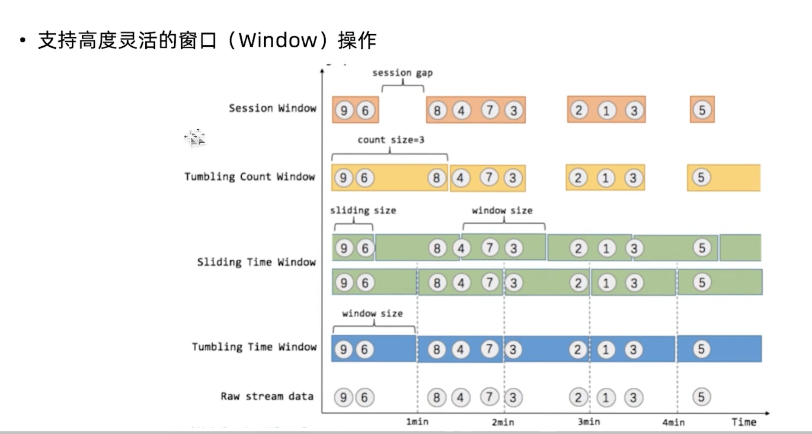
		- 带反压的连续流模型
			- 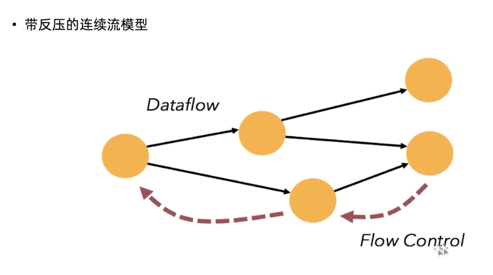
		- 独立的内存管理
			- 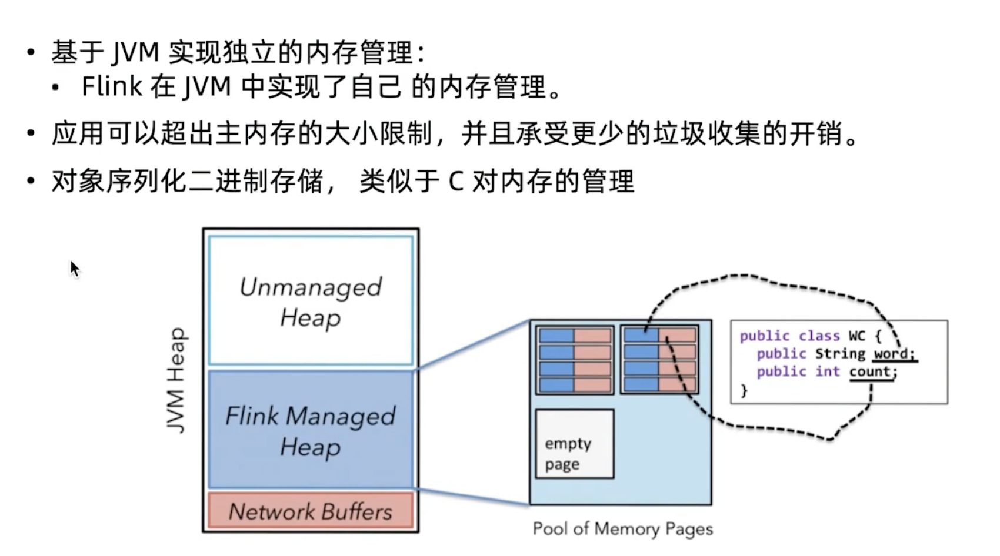
	- 集群架构
		- 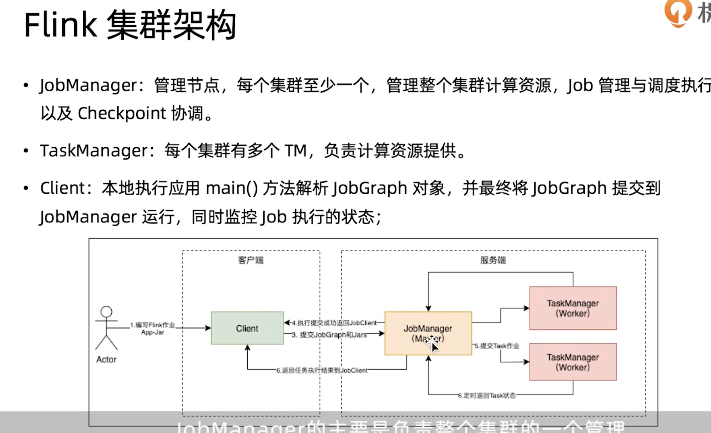
		-
	-
		-
		-
-