- 内存问题 一些总结
	- 总结主要涉及三个方面
		- 知识/信息
			- 虚拟内存、malloc、栈内存
		- 验证知识/信息 是否真实的策略
			- 直接找到所关心内存地址，打印出有用的内存信息，验证猜想
			- 加hook，打印出有用信息，验证猜想
		- 一些常用的、帮助快速验证的工具
			- pmap
				- 内存地址信息查看
			- gdb
				- 调试，也能打印出有用的内存信息
				- 有一些增强的扩展能力，能便于排查更多问题，例如
			- LD_PRELOAD
	- 虚拟内存与物理内存
		- 问题
			- 内存很宝贵，给操作系统上每个进程直接分配物理内存，资源占用较大。（目前一般服务器的内存可以做得很大，该问题相对不严重）
			- 一个进程有可能不小心写了另一个进程的内存，安全如何得到保障。
		- 故有了虚拟内存，解决了多个进程如何安全、高效访问同一个物理内存的问题。
			- 虚拟内存的出现对内存使用做好了隔离，每个进程拥有独立的、连续的、统一的虚拟地址空间
			- 虚拟内存使得操作系统可以给进程分配超过当前所剩物理内存的内存，通过磁盘与内存来回传送数据的方式，物理内存只保存活动区域。
	- Linux 四级页表
	  id:: 61dacb70-e9fa-4719-b6df-21f552b558c6
		- 为了减少虚拟内存映射表的内存占用，很多操作系统使用多级页表的方式节省内存。
			- 这种多级结构的方式使得没有使用的内存不用分配页表项。
		- 【如何验证虚拟内存所对应的物理内存？】
			- 可以用内核扩展模块等方式获取。
	- 进程的内存布局
		- linux 上的可执行文件的格式是 elf
			- elf 是一个静态文件，这个静态文件由不同的分节组成，我们这里叫它 section，在运行时，部分跟运行时相关的 Section 会被映射到进程的虚拟地址空间中，比如图中的代码段和数据段。
			- 除了这部分静态的区域，进程启动以后还有大量动态内存消耗区，比如栈、堆、mmap 区。
			- 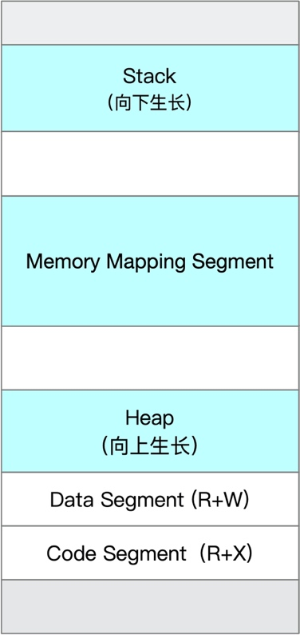{:height 341, :width 145}
			-
			- 【如何查看进程内存瓜分情况】
				- 可以用pmap来确认
	- libc 内存管理原理探究
		- 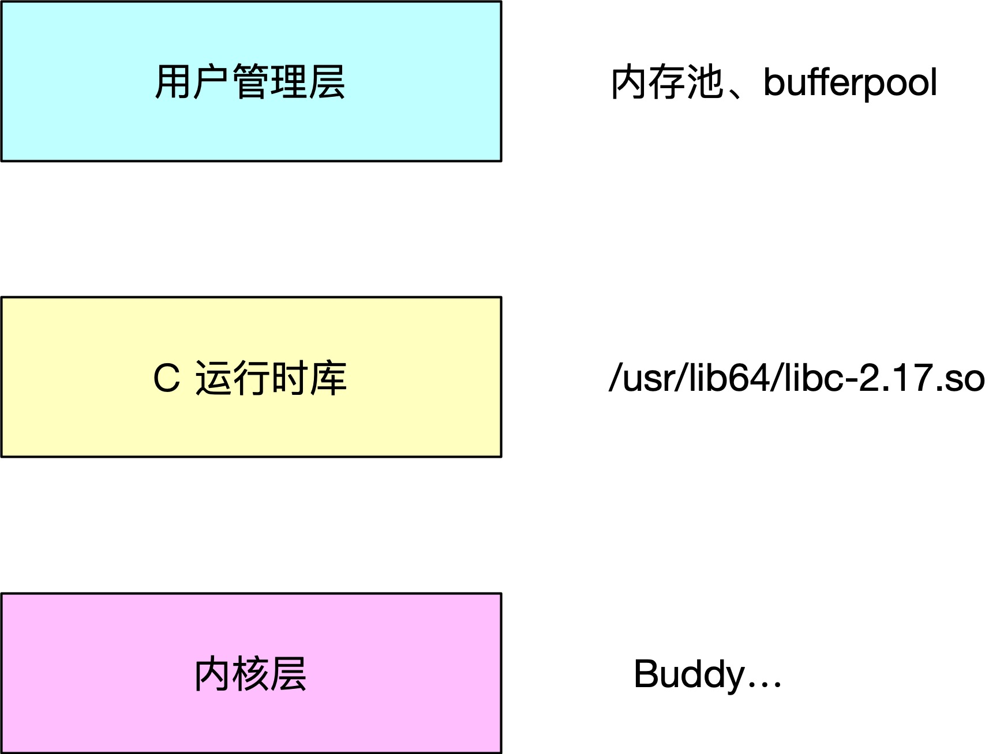{:height 278, :width 312}
		- 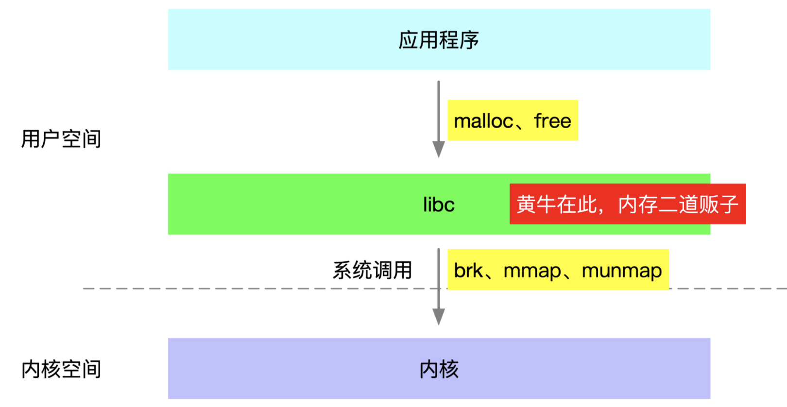{:height 247, :width 424}
		- 为什么有了这些系统调用，还需要 libc 再封装一层呢？
			- 一个主要原因因为系统调用很昂贵，而内存的申请释放又特别频繁，所以 libc 采取的的方式就是批量申请，然后作为内存的黄牛二道贩子，慢慢零售给后面的应用程序。
			- 第二个原因是为了编程上的统一，比如有些时候用 brk，有些时候用 mmap，不太友好，brk 在多线程下还需要进行加锁，用一个 malloc 就很香。
	- Linux 内存分配器
		- 
		- 这些内存分配器致力于解决两个问题：
			- 多线程下锁的粒度问题，是全局锁，还是局部锁还是无锁。
			- 第二个问题是小内存回收和内存碎片问题，比如 jemalloc 在内存碎片上有显著的优势。
	- ptmalloc 的核心概念
		- Arena
			- Arena 的出现首先用来解决多线程下全局锁的问题，它的思路是尽可能的让一个线程独占一个 Arena，同时一个线程会申请一个或多个堆，释放的内存又会进入回收站，Arena 就是用来管理这些堆和回收站的。
			- Arena 会尽量让一个线程独占一个锁，那如果我有几千个线程，会生成几千个 Arena 吗？
				- 显然是不会的，所有跟线程有关的瓶颈问题，最后都会走到 CPU 核数的限制这里来，分配区的个数也是有上限的，64 位系统下，分配区的个数大小是 cpu 核数的八倍，多个 Arena 组成单向循环链表。
			- 【如何做Arena信息的验证】
				- 我们可以写个代码来打印 Arena 的信息。它的原理是对于一个确定的程序，main_arena 的地址是一个位于 glibc 库的确定的地址，我们在 gdb 调试工具中可以打印这个地址。也可以使用 ptype 命令来查看这个地址对应的结构信息，如下图所示。
					- 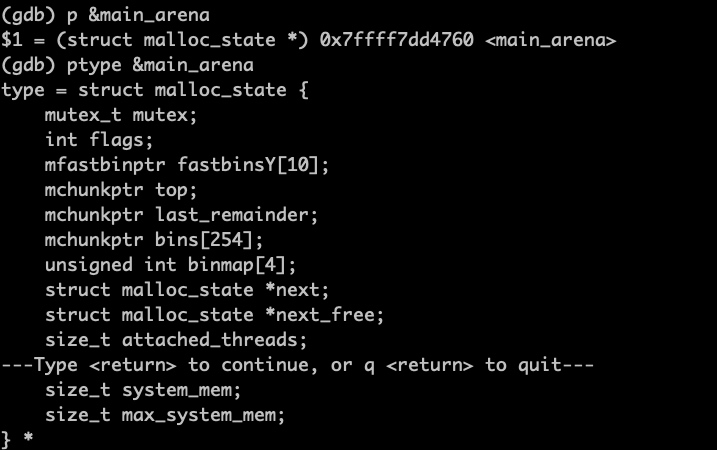
				- 有了这个基础，我们就可以写一个 do while 来遍历这个循环链表了。我们把 main_arena 的地址转为 malloc_state 的指针，然后 do while 遍历，直到遍历到链表头。
		- 为什么还要区分一个主分配，一个非主分配区呢
			- 主分配区只有一个，它还有一个特权，可以使用靠近 DATA 段的 Heap 区，它通过调整 brk 指针来申请释放内存。
				- 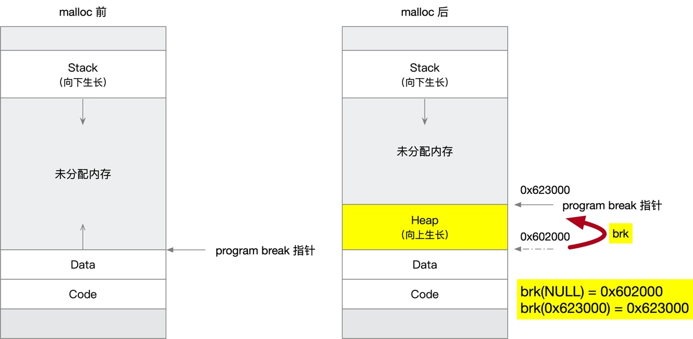
			- 非主分配区，它想要内存时就使用 mmap 批发大块内存（64M）作为子堆（Sub Heap），然后在慢慢零售给上层应用。
				- 一个 64M 用完，再开辟一个新的，多个子堆之间也是使用链表相连，一个 Arena 可以有多个子堆。
				- 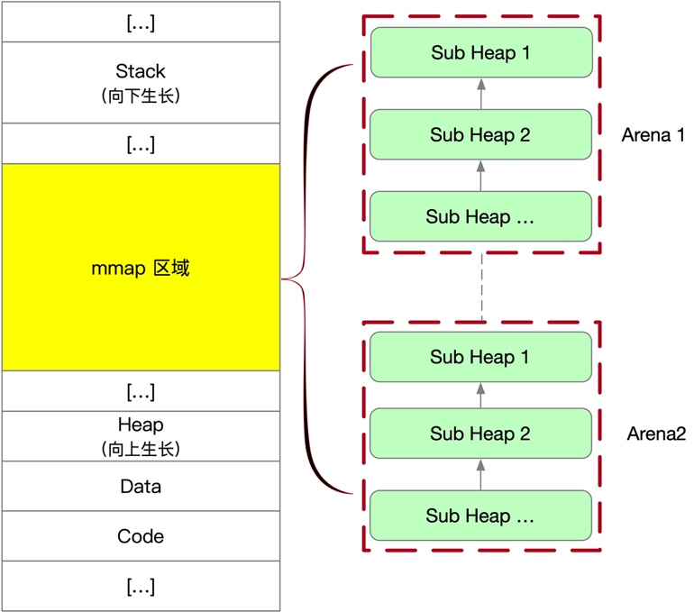{:height 454, :width 457}
		- Heap
			- heap 用来表示大块连续的内存区域。
				- 主分配区的 heap 没有什么好讲的，我们这里重点看「非主分配」的子堆（也称为模拟堆），前面提到过，非主分配批发大块内存进行切割零售的。
					- 那如何理解切割零售这句话呢？它的实现也非常简单，先申请一块 64M 大小的不可读不可写不可执行（PROT_NONE）的内存区域，需要内存时使用 mprotect 把一块内存区域的权限改为可读可写（R+W）即可，这块内存区域就可以分配给上层应用了。
					- 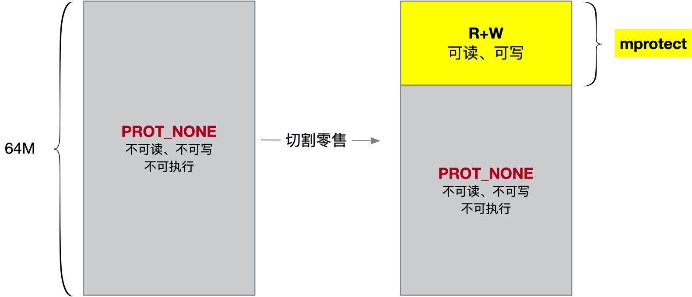
					- 【如何验证】
						- pmap查看
						- 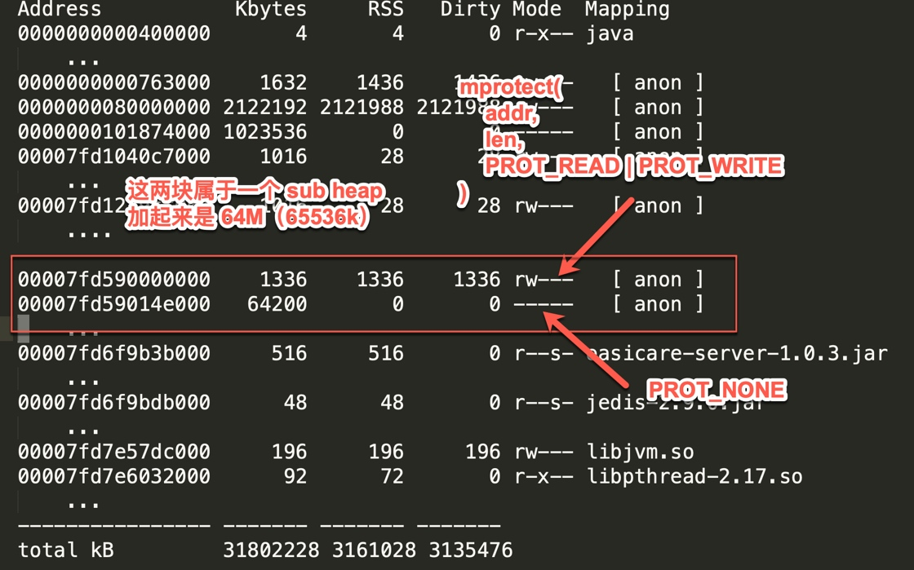
		- Chunk
			- chunk 是 glibc 中内存分配的基础单元。
				- 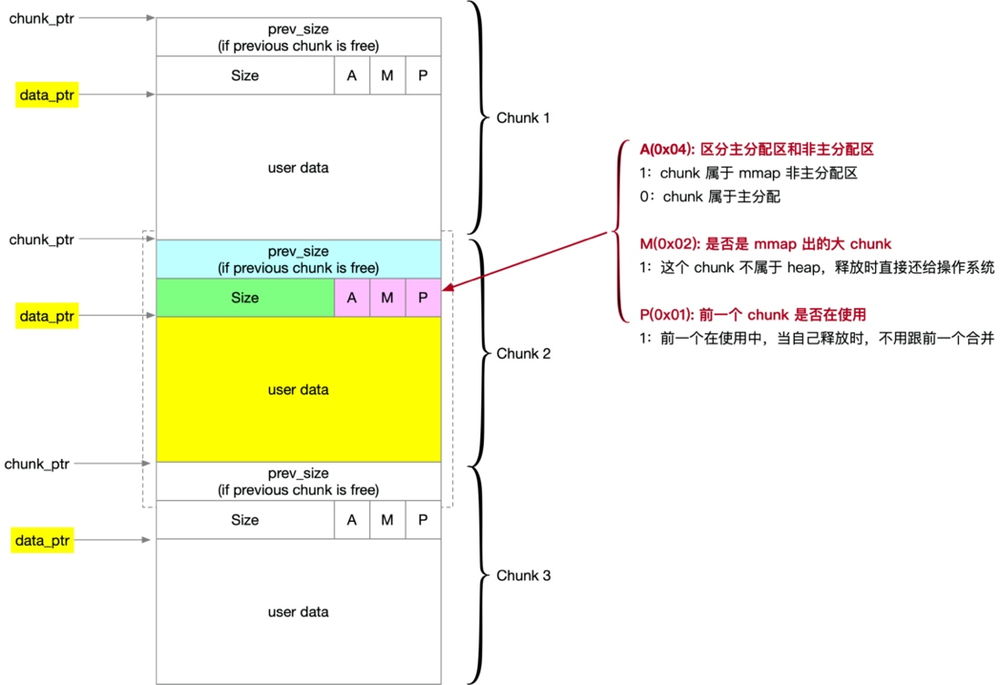
				- 【如何验证chunk的存储内容】
					- gdb查看
						- 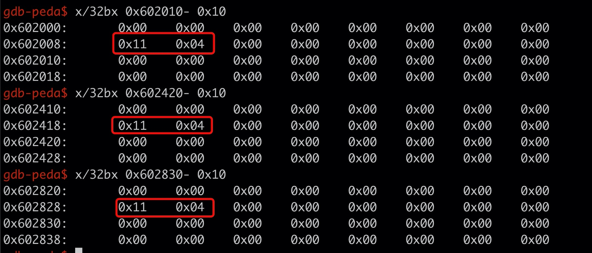
		- Bins
			- 小块内存的回收站 Bins。
			- 内存的回收站分为两大类，第一类是普通的 bin，一类是 fastbin。
				- fastbin 采用单向链表，每条链表的中空闲 chunk 大小是确定的，插入删除都在队尾进行。
				- 普通 bin 根据回收的内存大小又分为了 small、large 和 unsorted 三种，采用双向链表存储，它们之间最大的区别就是它们存储的 chunk 块的大小范围不一样。
					- 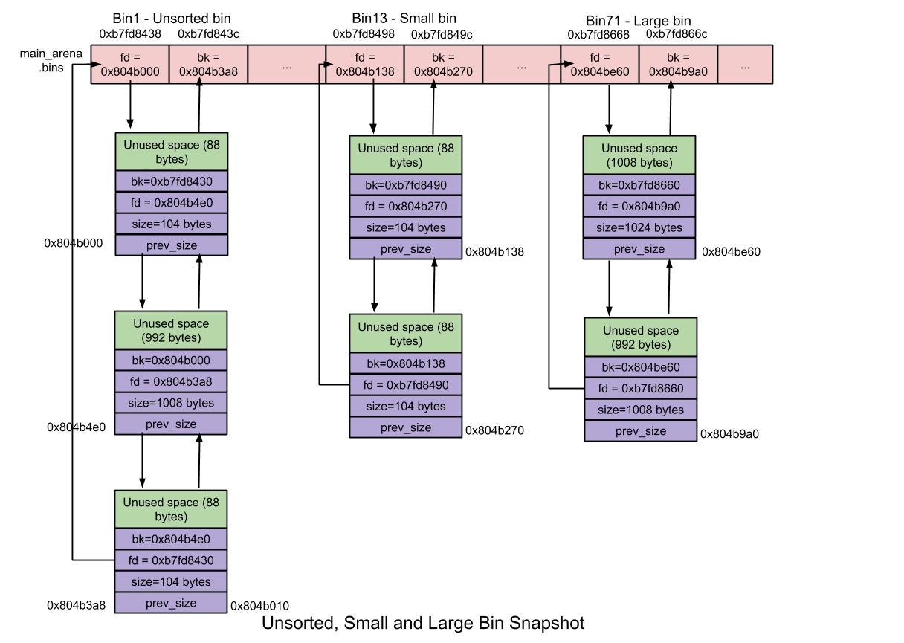
	- 内存的申请与释放
		- 大块内存申请没有特别多可以讲的，直接 mmap 系统调用申请一块，释放的时候也直接还给操作系统。
		- 小块内存的申请就复杂很多了，原则就是先在 chunk 回收站中找，找到了是最好，就直接返回了，不用再去向内核申请。
			- 
	- 栈内存
		- LInux 中默认的栈内存大小是 8M，然后外加 4K 的保护区，这 4k 的保护区不可读不可写不可执行，当真有栈越界时可以更早的发现，尽快 fast fail。
			- 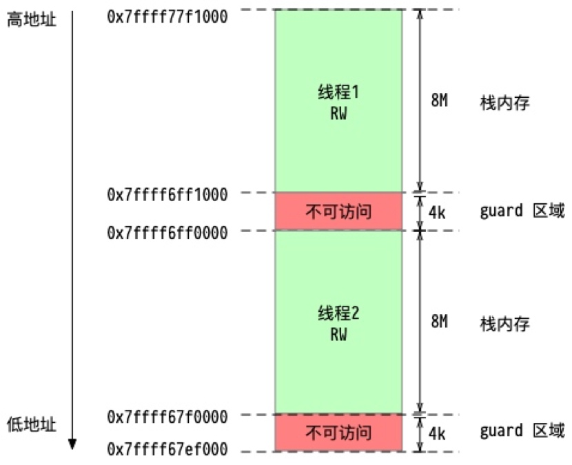
		- 【如何验证】
			- pmap验证
				- 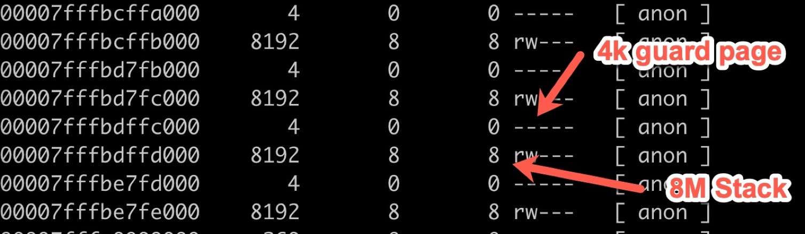
		-