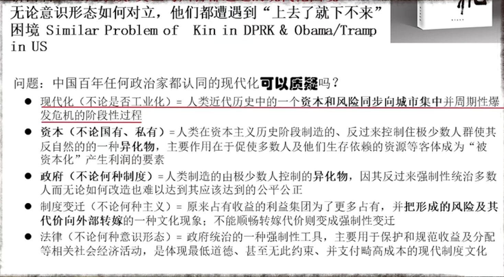

- 现代化 与 成本转嫁
	- 
	- 辩证看待
-
- 善良可以是提升自己能力的动力
-
- 中国的房子，买的是城市发展过程的周边的配套，买的是公共福利的一种
- 政府通过土地出让金的方式，获得资金以后，大量地用于城市建设与公共支出的补充
- 大家在房子中间不断的溢价，从另外一个维度上讲，对于公共设施，这是后进者对于前进者的一种补充。这是一种理论上的说法。
	- 💡公共设施的投入，其中的一种回报方式？
		- 前进者是指？
			- 最初买房的人
				- 在公共设施发展过程中，有一段时间没有享受到完善的公共设施
		- 后进者是指？
			- 后面接盘高溢价的房子的人
				- 为完善的公共设施买单，补偿前进者没有享受完善公共设施的时间？
		- 问题在于
			- 公共设施的投入成本是
				- 政府的土地出让金，土地出让金来自于原土地所有者以及全体公民权益
				- 来自于财政支出
				- 来自于最初在周边生活的公民的时间成本
			- 公共设施的受益者是公共设施建设完成后，依赖于公共设施的公民、产业
			- 后进者接盘的房子溢价，会远远高于前进者的补偿。
			- 后进者接盘的房子溢价，