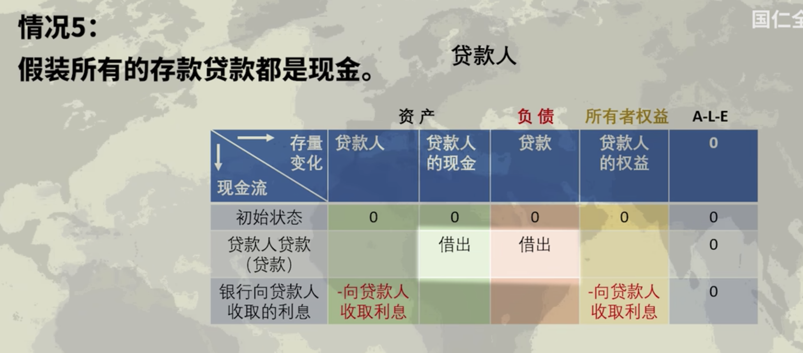

- 如果我们的钱仅仅是从富人那里借来的，就压根没有货币被创造出来，不制造债务就创造不出货币
- 银行在借出贷款的时候造出货币，这创造了存款，他们通过创造存款来创造货币
-
- 银行如何通过贷款来创造存款和货币
-
- 克鲁格曼的非货币经济学
	- 因为银行只是中介，所以货币于经济无关紧要
-
- 英格兰银行说银行并不是贷出银行存款，作为一个货币中介在运行，与其说银行借出放在他们那里的存款，不如说贷款创造了存款
	- 在现代经济中，大多数货币以银行存款的形式存在
	- 但这些银行存款是如何产生的往往被误解：银行存款的产生的主要方式是通过商业银行的贷款。
		- 每当银行发放贷款时，它同时在借款人的银行账户中创造相应的存款，从而创造新的货币
	- 今天，货币是如何创造的事实与一些经济学教科书中的描述不同
		- 银行不是在家庭储蓄时接收存款，然后将其贷出，而是银行通过放贷创造存款
		- 在正常情况下，中央银行不会固定流通中的货币数量，中央银行的基础货币也不会靠“货币乘数”创造更多的贷款和存款
-
- 明斯基系统（Minsky Software）
	- 史蒂夫基恩教授团队开发的一款软件，用于对国民经济进行可视化建模，其目的是为了比主流宏观经济模型更准确，因为主流模型没有适当地包括债务和银行业务
	- 明斯基系统将系统动力学和货币模型引入经济学，使用复式记账法来生成资金流动模型
		- 复式记账法
			- 每笔交易必须记录两次，每一行的总和必须为零
				- 一次是资金的来源，一次是资金的目的地
		- 所有账户都需按资产、负债、权益进行归类
			- 资产：别人欠你的东西
			- 负债：你欠别人的东西
			- 权益：资产与负债的差额
		- 一个人的资产就是另一个人的负债
		- 所有资产和负债的总和，即对他人的债权，是零
	- 几种情况
		- 情况1：储户先存钱，贷款人再借钱？
			- 
		- 情况2：银行直接从准备金中贷款给贷款人？
			- 
		- 情况3：贷款人先贷款再存款？
			- 
			- 
		- 情况4：现实中的货币经济学
			- 
			- 
			- 关于“必须有准备金才能借贷”的想法，并不是银行实际运作的方式，银行无法如此运作
			- 只有所有贷款都用现金支付，银行才能“用准备金贷款”
		- 情况5：假装所有的存款贷款都是现金
			- 
			- 
			- 
			- 
- 商业银行与贷款者之间的关系，同样适用于央行与商业银行之间
	- 央行与商业银行间的关系
		- 常见误解：
			- 央行通过控制央行的准备金数量来决定经济中的贷款和存款数量，即所谓的“货币乘数”方法
		- 实际操作：
			- 与存款和贷款之间的关系一样，央行存款准备金和商业银行贷款之间的关系通常以与一些经济学教科书中描述的相反方式运作。
			- 商业银行首先根据可获得的有利可图的贷款机会来决定贷款的数量，能否有利可图取决于央行设定的利率。这些借贷决定了商业银行系统创造了多少银行存款。银行存款的数量反过来又影响到银行要持有多少央行的货币储备以满足公众的提款、向其他银行付款、满足监管的流动性要求。然后，在正常情况下，准备金由央行按需提供。
			- 因此，对基础货币的需求是银行发放贷款和创造广义货币的结果，而不是原因。
			- 广义货币由银行存款（商业银行给家庭和公司的欠条）和货币（央行的欠条）组成。
		- 详见英格兰银行发布的论文：Money creation in the modern economy
- 宏观经济学中一些错误的重要“常识”
	- 例子：
		- S=I 储蓄等于投资
		- 银行是金融中介（贷款源于存款）
		- 储蓄是可贷资金市场的供给
		- 货币是基于基础货币创造出来的
		- 货币需求和货币供给决定利率
	- 为何这个错误至关重要？
	- 左右经济的金融部门被隐形了。
	-
	-
	-
	-
	-
	-