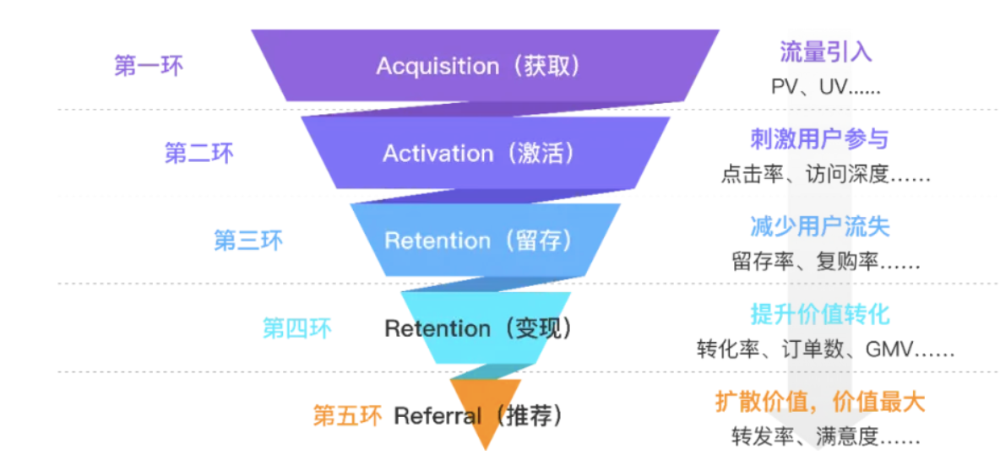
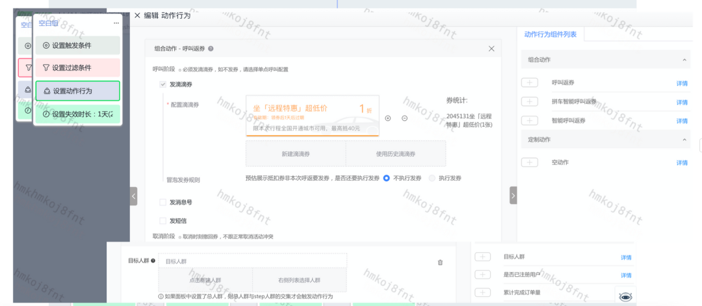

- [[平台]]到底有什么价值
	- https://mp.weixin.qq.com/s/6gV1VX8s-4TEQhfInmmedA
	- 用户增长的核心引擎就是公司内部的运营系统
		- 传统的滴滴运营系统都是由业务驱动，业务向产品提供打法需求，产品进行汇总整理，再传达给研发部门，研发部门是纯粹的运营工具人，运营需要什么，研发就做什么。最多也就只是产品的纯粹翻译而已。
		- 美团经过多年各种场景的历练，内部已经形成了比较成熟的运营系统，能够借鉴历史经验，用自动化的运营工具来帮助公司开拓新的业务领域。
	- 技术和平台的价值只有在充分竞争的市场才能体现出来，否则只会被老板们当成公司内的成本中心而已。
	- 运营的基本方法论无非是 AARRR
		- 
		- 可以看到不同的单词代表了大致上的不同子领域，每个子领域会关注几个业务的核心指标。有了这些指标之后，通过使用运营工具，达成公司整体数据的提升。
		- 在竞争状态下，目标和路线要对，速度也要比对手快，至少要和竞品公司差不多，否则永远追在别人后面跑的公司是没有前途的。
	- 所有的运营活动都需要是数据驱动的，所以数据本身在运营平台中占有举足轻重的作用，互联网公司内的数据中台大部分工作都是为运营来服务的
		- 我们可以举一些例子：用户画像系统，人群/圈人系统，实时/离线活动计算系统
		- 每个系统都需要混合在线、离线的多种计算、存储技术栈，如 mysql，redis on rocksdb，hbase，hive，flink，hudi 等，将这些技术栈组合成为运营的数据平台，并对业务透明，提供统一的 API 和负责接入的 UI 平台。
			- 最终要达成的目标是，80% 的数据需求都可以在分钟~小时内完成。
		- 业务方在使用数据平台时，只要关注对应领域是否有其所关注的相应指标即可，没有的话也可以很快开发完成。对于业务来说，有数据需求只要找数据团队就行了。
		- 在数据之上，业务需要有能随意编排活动的能力，说白了就是一套可视化工作流系统，在不同的公司有不同的落地方式
			- 
			- 就是一套可配置的可视化工作流系统，不同类型的活动只要运营在平台上简单的进行拖拽，就可以完成一个活动的配置。
			- 不同运营场景对应的打法无非是工作流节点的排列不太一样罢了。
				- 阿里的人经常说的所谓商业能力，其实就是固定下来的某个领域的工作流，比如订单履约、客诉处理等等各种业务场景，都沉淀到了平台上，业务和研发只要看看流程和定制点，马上就能知道公司内的业务是怎么流转的。