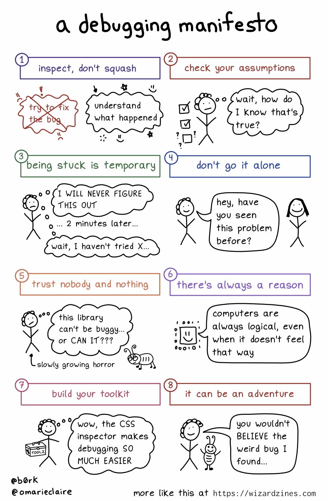

- c++20 和 webassembly 的定位是类似的，就是可以利用大量的遗留代码，可以直接 include 进来编译到同进程使用，而不需要进行 ffi 来使用遗留代码
	- 新写的代码使用 c++20 而不是 rust，是因为 c++20 可以直接 include c++98，而 rust 则需要利用 c 作为桥梁，而不能直接 include c++ 代码.
	- 出发点应该是遗留代码和成熟工具（比如 clangd/clang-tidy)的利用，而不是为了“性能”。
	- 把各种遗留代码，移植到web平台，加上协同办公的能力，就是商业上的价值
-
- A Debugging Manifesto
	-  
	  id:: 6328759a-a18c-4a8c-8e1e-b89781e35144
	-