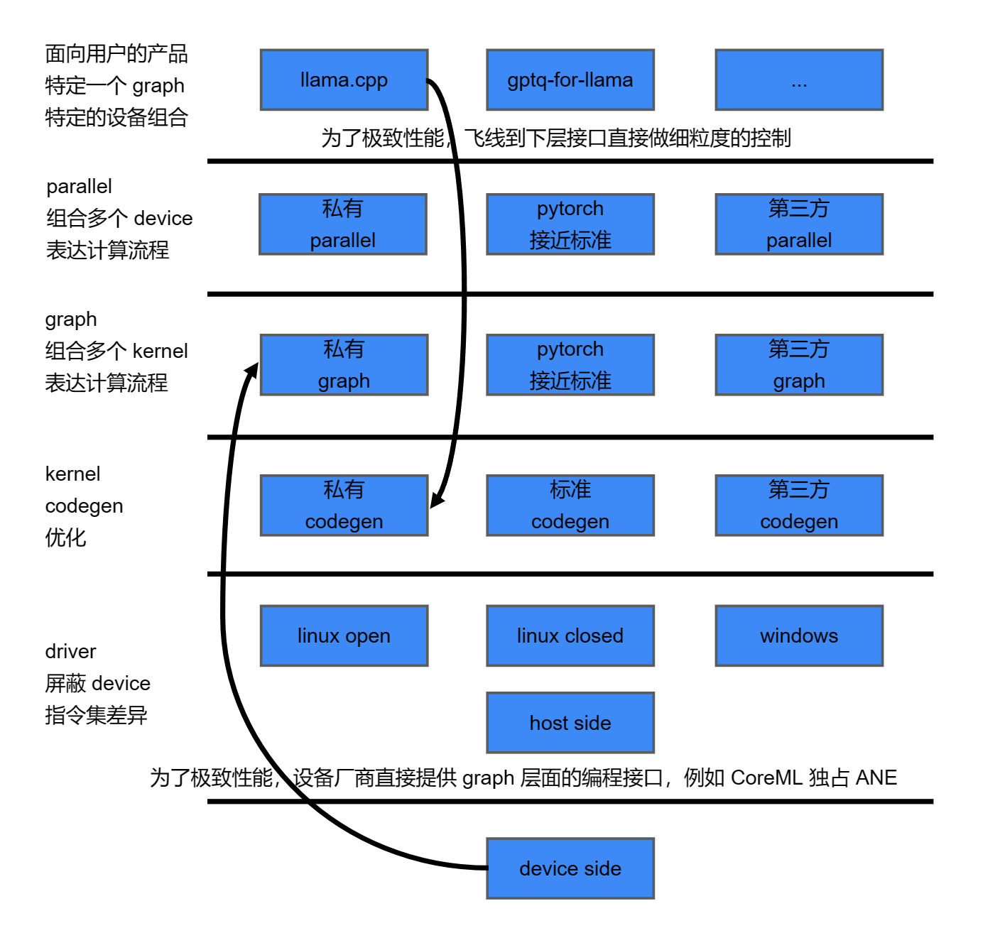

- 为什么 ML 技术栈给人这么混乱的感觉
	- 
	- 为什么 ML 技术栈给人这么混乱的感觉
		- 名词混淆：当我们说 api 的时候，是指 driver 提供给 codegen 来 launch kernel 的接口，还是 pytorch 写 tensor graph 的接口？这些都是 api 。特别是设备厂商不是提供一个层次的 api，而是同时提供了多个层的 api
		- 技术复用：当驱动都内嵌了 llvm 的时候，编译可能发生在各个层次上，但是可能复用相同的技术
		- 飞线：每一层都希望自己能做好自己的工作，比如 triton 理应屏蔽 amd/nvidia 的差异，让用户不用写 cuda 也能生成高性能的 kernel。事实上就是每一层都有bug，都有性能问题。上层的产品为了极致的性能，会倾向于直接和特定硬件的最底层私有接口绑定，跳过这些兼容中间层。而底层的硬件厂商也希望提供尽可能高层的 api 接口，例如 ANE 只能通过 CoreML 来编程。
	- 有了上面这个 map 有两个好处
		- 对于图中的一个指定方块，我们可以聚焦的学习这个方块对上对下提供了什么。比如 amd linux open source driver。对于这个块，它实际上对上一层 kernel codegen 提供的设施是什么？它实际上给下一层的 amd cdna/rdna2/rdna3 各种 gen 的 gpu 发的是什么？
		- 对于一个模糊的技术名词，比如 vulkan spir-v。它实际上在这个 map 上是处于哪个位置？提供的是什么价值。然后才是怎么使用，什么时候使用。
	- layering is good, only if:
		- when each layer capability is stable: it is bad when new hardware come out with new capability, and realize the layers above can not use it.
		- when each layer is high quality in terms of bug and performance, and provide debugging facility: it is bad when it is supposed to work but actually only sort of works given particular commit tag combination
	- ditch layers to gain advantage:
		- apple silicon: apple want innovate on hardware, so it provide CoreML to directly combine cpu/gpu/ane. provide a complete private stack from a device provider.
		- llama.cpp: pytorch is slow because it trys to be generic. llama.cpp only support llama, it can go down the tech stack as needed, and optimize the specific device combination (intel cpu + nvidia gpu)
	- making tools for human:
		- prefabricated component: often over-promise, failed to deliver the expectation
		- brand new tech: marginally better, a lot of investment, hard to sell the migration cost
		- improve existing tech, but for green field: can work, but who cares when start a new green field
		- improve legacy code: impossible, or impossible to lower the cost, always takes huge human effort
	- compared to write tools for GPT-4. Serve the lord of AI, for a world without Human Reuse.
	-