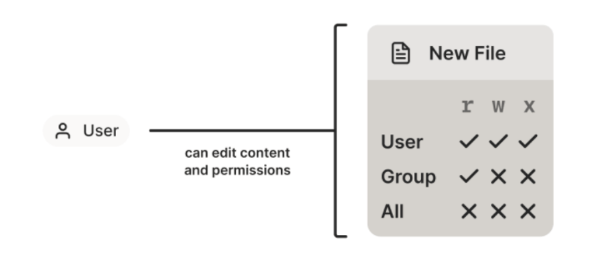
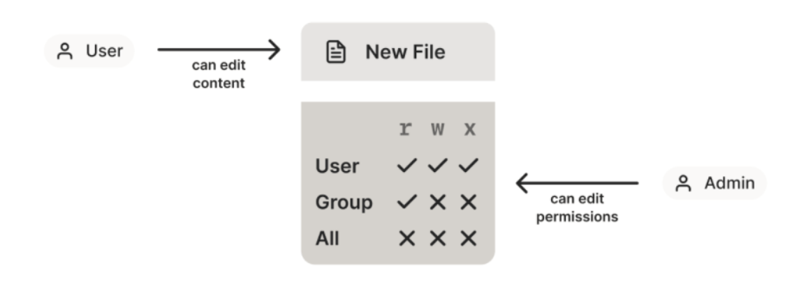

- [[鲁布·戈德堡装置]]（Rube Goldberg Device）
	- 鲁布·戈德堡机械（Rube Goldberg machine）是一种被设计得过度复杂的机械组合，以 迂回曲折的方法去完成一些其实是非常简单的工作，例如倒一杯茶，或打一只蛋等等。 设计者必须计算精确，令机械的每个部件都能够准确发挥功用，因为任何一个环节出错 ，都极有可能令原定的任务不能达成。
-
- 写给工程师：关于[[证书]]（[[certificate]]）和公钥基础设施（[[PKI]]）的一切（SmallStep, 2018）
  collapsed:: true
	- 来源：https://arthurchiao.art/blog/everything-about-pki-zh/
	- [[证书]]和 [[PKI]] 的目标其实很简单：**将名字关联到公钥**（bind names to public keys）。
	- **加密方式的演进**：
		- ```
		  MAC         最早的验证消息是否被篡改的方式，发送消息时附带一段验证码
		  |          双方共享同一密码，做哈希；最常用的哈希算法：HMAC
		  |
		  \/
		   Signature   解决 MAC 存在的一些问题；双方不再共享同一密码，而是使用密钥对
		  |
		  |
		  \/
		   PKC         公钥加密，或称非对称加密，最常用的一种 Signature 方式
		  |          公钥给别人，私钥自己留着；
		  |          发送给我的消息：别人用 *我的公钥* 加密；我用我的私钥解密
		  \/
		   Certificate   公钥加密的基础，概念：CA/issuer/subject/relying-party/...
		    |          按功能来说，分为两种
		    |
		    |---用于 *签名*（签发其他证书） 的证书
		    |---用于 *加解密* 的证书
		  ```
	- **证书（certificate）相关格式及其关系**（沉重的历史负担）：
	  collapsed:: true
		- ```
		  最常用的格式   |      信息比 X.509 更丰富的格式       |       其他格式
		  - mTLS 等常用        Java 常用            微软常用
		                     .p7b .p7c          .pfx .p12
		  - X.509 v3            PKCS#7               PKCS#12        SSH 证书    PGP 证书     =====>  证书格式
		      \                 |                    /                                           （封装格式，证书结构体）
		       \                |                   /
		        \               |                  /
		         \              |                 /
		          \-------------+----------------/
		                        |
		                       ASN.1 （类似于 JSON、ProtoBuf 等）                          =====>  描述格式
		                        |
		          /-------------+----------------\
		         /              |                 \
		        /               |                  \
		       /                |                   \
		      /                 |                    \
		   DER                 PEM                                                         =====>  编码格式
		  二进制格式           文本格式                                                             （序列化）
		  .der            .pem .crt .cer
		  ```
	- 文末的总结：
		- 公钥加密系统使计算机能在网络上看到对方（”see” across networks）:
			- 如果我有公钥，就能“看到”你有对应的私钥，但我自己是无法使用这个私钥的。
			- 如果还没有对方的公钥，就需要证书来帮忙。证书将公钥和私钥拥有者的名字（name）相关联， 它们就像是计算机和代码的驾照。
			- 证书权威（CA）用它们的私钥对证书进行签名，对这些绑定关系作出担保，它们就像是车管局（DMV）
			- 如果你出示一张车管局颁发的驾照，脸长得也和驾照上的照片一样，那别人就可以认为你就是驾照上这个人（名字）。 同理，如果你是唯一知道某个秘钥的 entity，你给我的证书也是从我信任的某个 CA 来的，那我就认为证书中的 name 就是你。
		- 现实中，
			- 大部分证书都是 X.509 v3 证书，用 ASN.1 格式定义，通常序列化为 PEM-encoded DER。
			- 相应的私钥通常表示为 PKCS#8 objects，也序列化为 PEM-encoded DER。
			- 如果你用 Java 或微软的产品，可能会遇到 PKCS#7 and PKCS#12 封装格式。
		- 加密领域有**沉重的历史包袱**，使当前的这些东西学起来、用起来非常让人沮丧，这比一项技术因为太难而不想学更加令人沮丧。
		- PKI 是使用公钥基础设施时涉及到的所有东西的统称：names, key types, certificates, CAs, cron jobs, libraries 等。
			- Web PKI 是浏览器默认使用的 PKI。Web PKI CA 是**受信但不可靠**的（trusted but not trustworthy）。
			- Internal PKI 是用户自己构建和维护的 PKI。需要它是因为 Web PKI 并不是针对 internal 使用场景设计的， Internal PKI 更易于自动化和扩展，并且能让用户控制很多细节，例如 naming and certificate lifetime
			- 建议公网上使用 Web PKI，内网使用自己的 internal PKI （例如，[use TLS](https://smallstep.com/blog/use-tls.html) 来替代 VPN）。
			- Smallstep Certificate Manager 使构建 internal PKI 非常简单。
		- 要获得一个证书，需要命令和生成证书。建议 name 用 SAN：
			- DNS SANs for code and machines
			- EMAIL SANs for people
			- 如果这些都不能用，就用 URI SAN
		- **秘钥类型（key type）**是很大一个主题，但几乎不重要：你可以随便修改秘钥类型， 而且实际上加密本身（crypto）并不是 PKI 中最弱的一环。
		- 要从 CA 获取一个证书，需要提交一个 CSR 并证明申请者的身份（identity）。 使用生命周期较短的证书和 passive revocation。 自动化证书续期过程。不要禁用 certificate path validation。
		- 最后还是那句话：**证书和 PKI 将名字关联到公钥**（bind names to public keys）。 其他都是细节。
			-
-
- 基于角色的访问控制（RBAC）：演进历史、设计理念及简洁实现（Tailscale, 2021）
	- 来源：
		- https://arthurchiao.art/blog/rbac-as-it-meant-to-be-zh/
	- 开头
		- 大部分人都听说过**基于角色的访问控制**（role-based access control, RBAC）以及它 的后继演进版**基于属性的访问控制**（attribute-based access control, ABAC）， 但我们经常**==遗忘或不懂得欣赏其中的伟大思想==**。
		- 大部分如今**==常见的 RBAC 系统都经过了某种程度的简化==**，因此比最初的设计要弱一些。 而本文想要说明，只要**==回到 RBAC 最初的设计==**，我们就能构建一个 [真正的 RBAC/ABAC 安全模型](https://tailscale.com/kb/1018/acls/) ，它比你能见到的那些系统更**==简单而强大==**，而且不管网络规模大还是小，它都能适用。
	- 1 从 DAC 到 MAC
		- 1.1 DAC（Discretionary Access Control）（自主访问控制）：各文件 owner 自主设置文件权限
			- 设计
				- 如下图所示，在 DAC 中 **==object owner==** 有权**==设置该 object 的访问权限==**。
					- 
				- DAC：通过授予 individuals/groups 以 read/write/execute 权限， object (file) 的创建者能完全控制该 object 的内容和权限。
				- 例如
					- **==在 Unix 系统中，设置 file permission==**（“模式”，这也是 `chmod` change mode 的来历） 就能授予别人 `读/写/执行` 这个文件的权限。
					- 在 Google Doc 中，点击 share 按钮能授予权限。
			- 使用场景：普通用户的文件权限控制
				- **==军方==**不怎么喜欢 DAC，因为这种方式中，**==合规性很难保证，机密文件很容易被恶意 reshare 出去==**。
				- 但在**==普通用户==**场景中，这种方式还是很常用也很合理的。
		- 1.2 MAC（强制访问控制）：（强制由）专门的 admin 设置文件权限
			- >注意：不要把 MAC (mandatory access control) 与网络术语 “MAC address” 中的 MAC (media access address) 搞混了，二者没有任何关系，只是碰巧缩写相同。
			- 设计：DAC 基础上引入专门的 admin 角色
				- MAC (Mandatory access control) **==对 DAC 做了增强==**。如下图所示， 由 **==administrator==**（管理员）或 **==administrative rule==**（管理员级别的规则） 来**==定义 rules==**。
					- 
				- MAC：文件 owner 只能设置一个文件 type，这个 type 包含了哪些==权限是由 admin 或 policy 设置的==。 用户能编辑文件内容，但无法修改文件权限。
				- 因此在 MAC 模型中，**==一个人做某些事情的 能力是无法再分享给其他人==**的，从而避免了文件被 reshare 的问题。
			- 例子：TCP/UDP 端口号
				- **==MAC 很难解释==**，因为在实际中很少看到它，甚至看到了之后，你都不觉得它是“访问控制”。
				- Wikipedia 给了一个很好的例子：TCP 或 UDP 端口号。当你占用了一个 local port 之后（假设没设置 [SO_REUSEADDR](https://man7.org/linux/man-pages/man7/socket.7.html)）， 这台机器上的其他任何人就都无法再用这个端口号了 —— 不管他们是什么级别的特权用户。 这里，**==端口范围不可重叠这一条件，就是强制性的==**（mandatory）。
			- 适用场景：文档/系统访问控制
				-
-