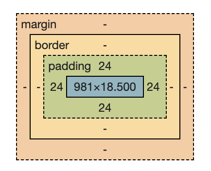

- css盒子模型
	- 盒子模型是 CSS 的一个基本概念，它定义了元素如何在页面上占据空间
	- 盒子模型由四个部分组成：
		- 内容（content）、
		- 内边距（padding）、
		- 边框（border）
		- 外边距（margin）
		- {:height 287, :width 321}
	- 如果你设置了元素的 `padding`，即使元素没有内容，`padding` 仍然会影响元素在页面上的空间占用。这就是为什么你会看到一个没有内容但设置了 `padding` 的 `<aside>` 元素在页面上创建了空间。
-