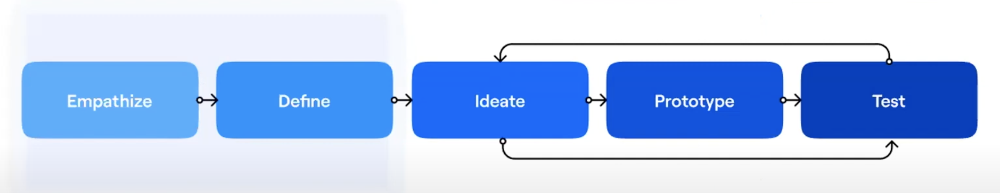

- Powering product teams to test, learn and act rapidly
	- Product development at Maze (Our process)
		- The Four Big Risks
			- Value Risk
				- Product managers
				- Whether customers will buy it or users will choose to use it.
			- Usability Risk
				- Product disigners
				- Whether users can figure out how to use it.
			- Feasibility Risk
				- Engineering
				- Whether our engineers can build what we need with the time, skills and technology we have
			- Business viability risk
				- Business
				- Whether this solution also works for the various aspects of our business/
		- Usability Risk
			- minimalize the usability risk
			- 
			- empathize, define, ideate, prototype, test
				- 移情、定义、构思、原型、测试
			- how we collect data and conduct ongoing testing to reduce the risk to release better outcomes.
		- Types
			-
- Attitudinal, Beha
-
-