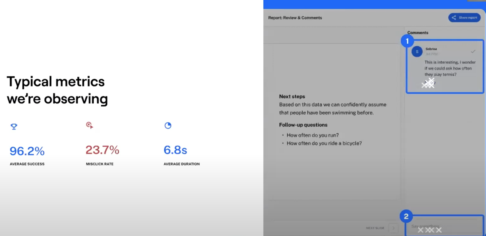
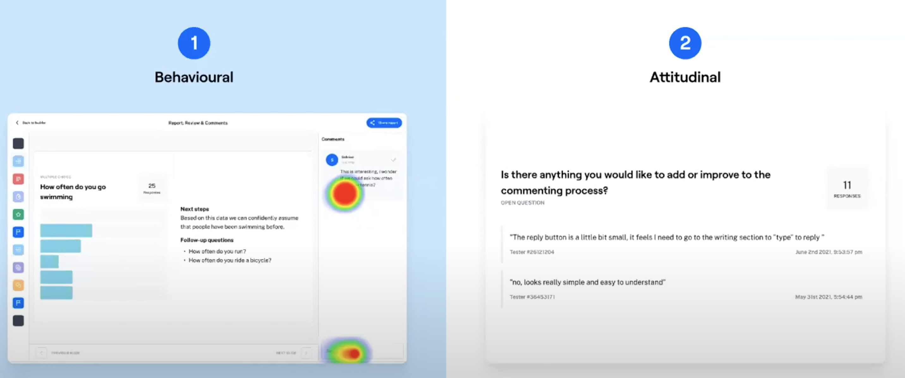
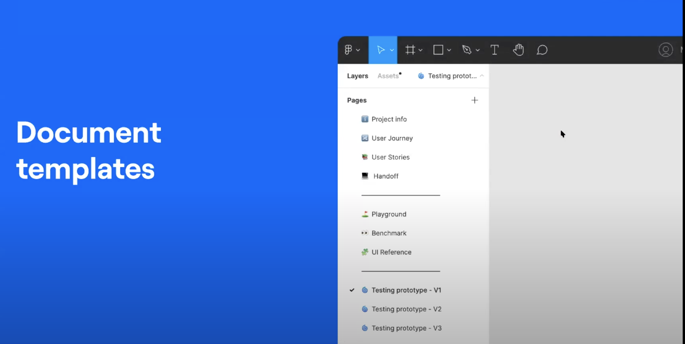
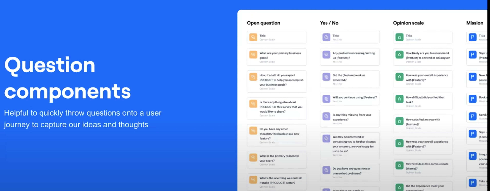
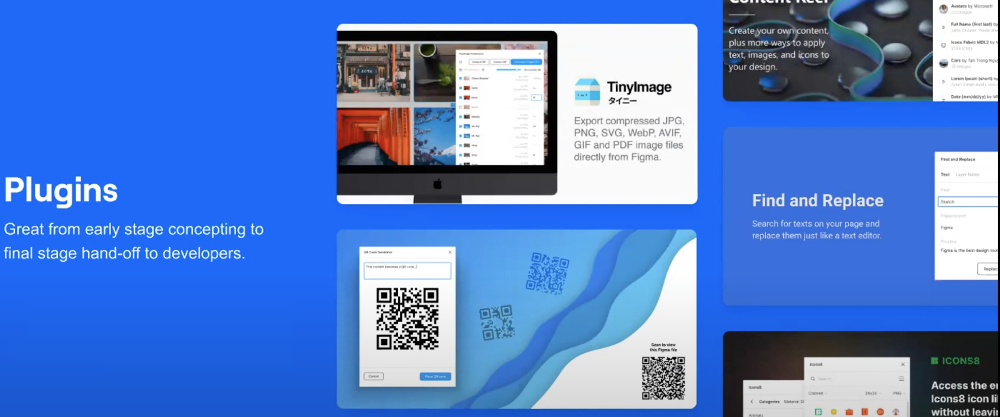

- Powering product teams to test, learn and act rapidly
	- {{video https://www.youtube.com/watch?v=6V7t3Th_XLg&list=PLXDU_eVOJTx4b06OGKg6XqnK66skErN8i&index=33}}
	- Product development at Maze (Our process)
		- The Four Big Risks
			- Value Risk
				- Product managers
				- Whether customers will buy it or users will choose to use it.
			- Usability Risk
				- Product disigners
				- Whether users can figure out how to use it.
			- Feasibility Risk
				- Engineering
				- Whether our engineers can build what we need with the time, skills and technology we have
			- Business viability risk
				- Business
				- Whether this solution also works for the various aspects of our business/
		- Usability Risk
			- minimalize the usability risk
			- 
			- empathize, define, ideate, prototype, test
				- 移情、定义、构思、原型、测试
			- how we collect data and conduct ongoing testing to reduce the risk to release better outcomes.
		- Types of Data
			- 
			- Attitudinal
				- 态度数据
			- Behavioral
				- 行为数据
		- Research Methods
			- 
			- Generative research
				- What problem might we solve
				- 从生成式研究开始，可以帮助我们深入了解用户，了解他们的需求和挑战。它也会给我们一个问题的答案，我们可以解决什么问题
			- Evaluative research
				- How well is our solution working
				- 我们跟进评估研究，帮助我们检查我们提出的解决方案是否符合。
				- 为了做到这一点，我们尝试在整个设计过程中进行多次测试结合多种技术和产品。
			- 你要记住研究不是一次性的。当我们开始一个新项目时，它会贯穿于整个产品过程中。
			- 我们尽量获取尽可能多的数据，所以我们在Amplitude和Hotjar中分析行为。我们尝试通过Zoom采访我们的客户，在此期间我们通常会问问题，然后让他们在FigJam中重现一些步骤，这使用户能够更好地回忆一些步骤。我们还进行初步发现调查，以回答更广泛的问题，或者我们进行跨团队头脑风暴会议。我喜欢这个环节。然后我们在Figma中做各种概念，并使用Maze远程测试它们。这使我们能够快速发现可用性问题并在过程中进行更改，而不必等到整个大原型准备好或实施。这不仅加快了开发时间，还减少了可用性风险，提升了产品质量。
		- Understanding the Problem
			- 每当我们开始一个新项目时,我们都会与团队举行研讨会,回顾我们拥有的数据和见解,并真正定义我们要解决的问题。一旦得到团队的认同,我们就会进入构思和原型制作阶段,创意阶段的迭代过程就开始了。为此,我们用一个问题陈述来框定这个挑战,并产生一系列"我们如何（HMW（How Might We））"作为创意生成的跳板。
		- Iterative Process
			- 我们开始的一个问题是:我们如何帮助用户用Maze报告中的数据讲述更好的故事?
			- 构建原型的主要目标是在创建真正的产品之前测试设计和产品创意,因此您的产品成功与您是否进行了测试直接相关。
				- 这实际上是一个何时测试的问题,而不是是否测试的问题,因为当产品上市并且人们开始使用时,它就会被测试。
			- 正如我们所看到的,
				- 在草图阶段的初期,我们处于"可能是什么"的发散阶段。
				- 随着时间的推移,它会转变为"应该是什么",
				- 最终变成"将会是什么",
				- 因为我们开始缩小范围,确定我们最终要发布的解决方案。
				- 
				-
			- Sketching Concepts
				- 
				- Quick and easy way to translate high-level design concepts into a tangible and testable artifact
					- 将高级设计概念转换为有形且可测试的工件的快速简便方法
				- 在测试这些想法时,我们主要寻求态度数据,以帮助我们快速确定产品方向。将这些作为主持会议来运行也是有益的,以收集更多微妙的反应,当人们开始审查这些概念时,我们可以深入研究或探讨这些反应。我们尝试尽可能独特地呈现这些概念,因为有时草图可能无法真正传达草图中包含的所有内容。
			- Concept Testing
				- 
				- Goal
					- Determine most valuable solution for solving user needs
						- 确定解决用户需求的最有价值的解决方案。
				- 我的意思是,这样做的目的是确定解决用户需求的最有价值的解决方案。一些示例问题可能是:
					- 你对这个概念的第一印象是什么?
					- 你有多大可能使用这样的概念?
					- 你喜欢或不喜欢这个概念的什么?
					- 这个概念在你的工作流程中有多大用处?
				- 我们从发现过程和理解问题空间中了解到一般的痛点或需求。但我们试图利用这些作为激励,找出哪些想法值得追求。根据我们在这里收集到的反应,并不意味着我们立即朝那个方向发展,但它确实有助于促进我们将专注的特性的优先级排序。
				- 所以在呈现概念时，无论是有主持还是无主持的，最好先框定你要展示的概念，并附上一些该功能可能带来的关键好处。
			- Wireframe Prototyping
				- 
				- 一旦我们收集了这些反馈，并开始确定一个方向，我们会将这些带回团队，以便开始讨论我们的方法，并以此为基础创建用户旅程。
				- 这涉及到绘制出我们希望测试的功能的关键领域，或者构建一个端到端的体验。
				- 在这个阶段，我们主要关注功能方面，即我们期望的正常使用路径，包括标题、按钮和线框图。
			- Wireframe testing
				- 
				- 当我们测试原型的目标是通过多个短周期快速改进，并希望在每次迭代中提高精细度，所以研究目标是确定用户需求是否得到满足以及用户体验是否理想。
				  id:: 66671c48-dad8-4e4c-bcc1-54f2dff71917
				- Goal
					- Determine whether or not the user's needs are being met and whether user experience is ideal
						- 确定用户的需求是否得到满足，用户体验是否理想
				- Example questions
					- How clear was it that you could add context to your slide?
						- 你能在幻灯片中添加背景内容吗?
					- Was there anything challenging or unclear about this process?
						- 在这个过程中有什么挑战或不清楚的地方吗?
				- 我们在评估过去的成功率和退出率等行为数据的同时，也在听取完成任务后的开放性问题中的态度数据。
				- 在这个阶段，一旦所有利益相关者在之前的迭代和设计过程阶段达成一致，我们就会进入高保真阶段。
			- High-fidelity prototyping
				- Aiming to create a prototype that closely resembles the final design of a project.
					- 旨在创建一个原型，非常类似于一个项目的最终设计。
				- Things we're including
					- Visual design
					- Content
					- Interactivity
				- 这意味着所有的界面元素都要考虑到，包括图像资源、图标、排版和内容间距。
				- 大部分或全部出现在这里的内容应该代表最终输出。尽早让你的内容团队参与进来是一个好主意，但我们也看到用户体验文案撰写者在规划用户旅程和交互时提出文本解决方案。我们必须使这些尽可能现实化，我想向你展示这一点，以便我们可以看到这里精细度的逐步提高。所以，我们可以看到对风格质量的关注。
				- 我想关于原型设计的一个要点是，原型工具的使用会根据保真度的不同而改变。
					- 
					- 在低保真的情况下，我们构建一个非常功能性的点击式模拟简单的屏幕到屏幕动画；
					- 在中保真的情况下，我们可以开始将重点转移到屏幕过渡上，以支持简单的模型出现或侧面板；
					- 而对于高保真的情况，我们关注屏幕上元素的编排，所以你可以通过影响比如贝塞尔曲线来模拟不同的语气或情感，比如将一个元素漂浮进来或弹进来。
						- 我们还发现，这些规格在开发人员交接方面非常好，因为它们已经是一对一的，与他们预期的实现方式一致
			- High-fidelity testing
				- Goal
					- Measure usability and identity any issues in a users workflow
						- 衡量可用性并识别用户工作流中的任何问题
				- How we write our tasks（我们如何写任务）
					- Match tasks to research goals
						- 将任务与研究目标相匹配
					- Don't be too specific
						- 不要说得太具体
					- Add a scenario for context
						- 为上下文添加一个场景
				- 当涉及到超高保真测试时，我们的目标是衡量可用性并识别用户流程中的任何问题。
				- 因此，我们发现创建任务时需要非常精确地措辞，尤其是在无人监督的情况下，因为没有任何机会进行后续提问，如果在理解方面有任何偏差的话。
					- 所以当我们编写任务时，需要记住几件事，
						- 其中之一是将任务与您的研究目标匹配，如果您希望验证流程中的特定路径，请确保这些任务保持准确并与当前任务相关，
						- 不要太具体，因为我们不希望他们对他们要寻找的东西产生偏见，所以尽量避免在界面中出现的特定语言。
							- 例如，我们不会说“导航到报告，点击加号按钮并添加内容到您的幻灯片”。因为这会混淆我们试图从中学习的数据，
						- 另一个好的方法是添加场景以提供上下文。
							- 这可能是这样的：“想象一下，您刚刚收到最近maze test的回复，您希望在与利益相关者分享之前总结数据”，然后用简洁的任务进行跟进，比如“访问主要报告”。这有助于将用户置于他们可能最常处于的用户目标和他们最终试图完成的任务的思维模式中
				- 当我们进行这些测试时，我们会让一个内部的利益相关者（可能并不真正属于团队的一部分）来审查这些测试，因为他们通常会帮助我们解决问题或逻辑上的任何问题。
			- Typical metics we're observing
				- 
				- 通常我们可以从中获得很多反馈，因此我们观察的典型指标包括用户成功率、路径成功率等。我们可以看到这里有一个是96%。还有误点击、跳出率（即那些放弃任务的人），如果你也在测量这些指标的话，任务的平均持续时间或完成时间也是一个很好的指标。
				- 这些指标是衡量或优化这些指标的好指示，但需要记住的是，随着过程的推进和保真度的提高，你可能会调整你的指标或成功标准。
					- 在这个例子中，我们给你的一项任务是：“你刚刚收到Sabrina对你报告的评论，你会如何回复她？”我们有一种方法是实际回复，这会生成一个线程。但我们也有另一种方法是创建一个新的聊天。在早期阶段和中保真阶段，我们并不认为这是会出现的问题，但在这个例子中，我们看到有四个用户实际上开始了一个新的评论，这并不是我们希望他们完成的任务。
					- 因此，我们将这些信息反馈给设计师和产品团队，并说：“嘿，我们有这些信息，现在我们需要在非常小的、原子级别上迭代改进，以便用户能更好地理解。”所以我猜当我们看这个的时候，我们有互补的数据。我们有行为数据（Yolo提到的，即他们做了什么），我们也可以跟进更多的态度问题，比如“你想添加或改进评论过程中的什么吗？”我们实际上有这个后续问题，有人说：“回复按钮有点小，感觉我需要去写作区域才能回复。”正如我提到的。
			- Behavioral，Attitudinal
				- 
				- 就像你的产品最终会被测试一样，无论它实际上是在生产环境中的代码，还是在实际到达用户之前通过模拟来运行。这是一个很好的想法，因为在产品真正上线时，几乎没有机会去了解这种类型的数据。
			- Speeding up Your Workflow
				- Document templates
					- 
					- 通过创建一致性，我们能够节省时间，并至少确保所有文档中的每个人都保持一致。
				- Question components
					- 
				- Plugins
					- 
				- 在构建测试和进行迭代过程中，有一些关键点需要注意。
					- 我认为最重要的一点是不要爱上你的第一个想法。
						- 在每个阶段，你都应该主动寻求批评而不是赞扬。
						- 我认为这是一个很好的方法，避免过于依赖你的想法，直到你从用户反馈中获得信心。
					- 我还要强调，为迭代留出时间。
						- 在软件开发中，不得不承认发布的时间可能非常短，我也曾经因为在周期的后期收到反馈而无法有足够的时间来改进解决方案。
						- 因此，我强烈建议尽早并频繁地进行测试，以确保你有足够的时间来完善你的解决方案。
					- 测试真的是一种团队运动。
						- 尽量让整个团队参与进来，我的意思不仅仅是分享学习成果，而是让他们全程参与。
						- 不论是帮助你定义研究目标，还是简单地进行测试的预演，这都有助于保持用户的关注。
					-
				-
				-
				-
				-
				-
-
-