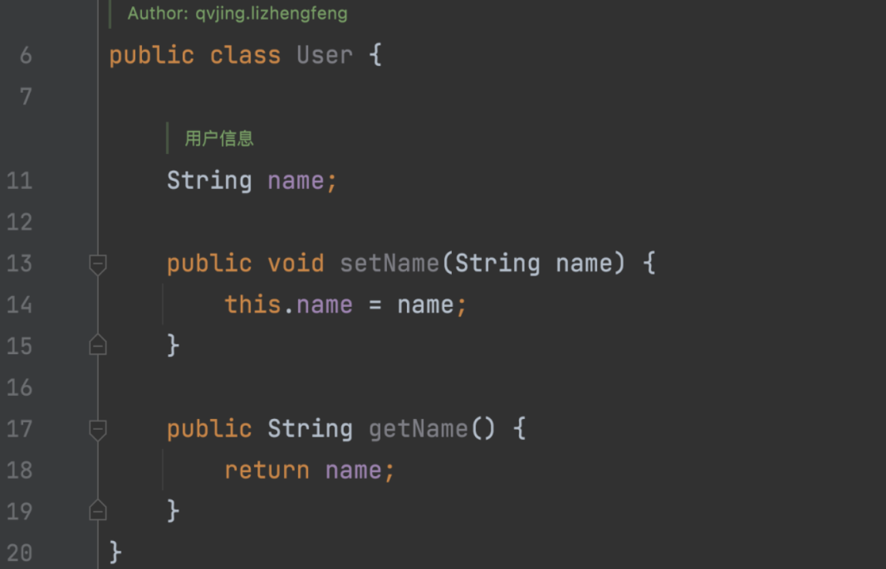

- **Tags**: [[LSP]] [[LSIF]] [[Code Navigation]]
- **语言服务器协议 (Language Server Protocol, [[LSP]])**
	- https://microsoft.github.io/language-server-protocol/overviews/lsp/overview/
	- LSP 是一种协议，用于在客户端（例如，编辑器或集成开发环境）和服务器（提供语言特性支持的工具，如编译器或解析器）之间进行通信。
	- 通过使用 LSP，可以将语言特性的实现与客户端分离，使得一种语言的处理引擎可以为多种客户端提供服务，如语法高亮、代码补全、定义跳转、重命名、代码检查等。
	- 使用 LSP 的好处是，一旦为一种编程语言实现了一个 LSP 服务器，那么任何支持 LSP 的编辑器都可以利用这个服务器提供的语言特性。
		- LSP (Language Server Protocol) 服务器运行的主要是语言分析器，语义解析器，以及其他与特定编程语言相关的工具。这些工具使得 LSP 服务器能理解和分析源代码，以提供如代码自动补全，跳转到定义，查找引用等功能。
- **语言服务器索引格式 (Language Server Index Format, [[LSIF]])**
	- https://microsoft.github.io/language-server-protocol/specifications/lsif/0.4.0/specification/
	- LSIF（language-server-index-format）
		- 是一种用于描述程序信息且遵循LSP规范的语言服务器索引格式，
		- 同时它的查询和存储是支持HTTP协议的，
		- 目前主要用于Code Intelligence领域，并且是该领域非常主流的方案。
	- 通俗的讲，LSIF定义了一种可以响应LSP请求的存储索引格式，该格式将静态代码转换成了图的数据结构。
		- 它也是业界优秀的服务供应商Sourcegraph采用的索引格式方案，语法服务供应商会实现相应的解析器将静态代码转换成对应的索引格式。
		- *最近sourcegraph有一套新的方案：SCIP*
			- https://about.sourcegraph.com/blog/announcing-scip
			- [[SCIP - a better code indexing format than LSIF]]
	- LSIF 索引格式的设计是基于以下几点驱动：
		- 该格式不应暗示使用某种持久化技术
		- 定义的数据应该尽可能接近LSP的建模，便于通过LSP请求交互（生态好）
		- 格式本身不定义任何符号语义，便于跨语言
		- 输入输出格式基于JSON
	- 请求流程：
		- 例子来自：
			- https://mp.weixin.qq.com/s/7ZFezyneFADZ7_unAZWUEg
		- 以一个User.java实例来帮助读者理解LSIF是如何提供服务的，我们将鼠标悬停第14行第16个字符name上，触发textDocument/hover行为。
			- textDocument/hover
				- 当你将鼠标悬停在某个代码元素（例如变量，函数或类）上时，编辑器会向语言服务器发送一个 `textDocument/hover` 请求，请求中包含了当前文件的 URI 和光标的位置。语言服务器会根据这个请求返回相应的悬停信息，例如代码元素的定义，类型信息，文档注释等。
			- 
			- 首先User.java的代码将会转换为如下索引（为了便于阅读，只展示与该行为相关的索引：悬停所在的symbol  range、hover result、method）
				- ```json
				  { 
				    id: 1,             //表示this.name中name的range，即IDE中的坐标
				    type: "vertex", 
				    label: "range", 
				    start: { line: 14, character: 14},
				    end: { line: 14, character: 18} 
				  }
				  {
				    id: 2,            //表示鼠标悬浮在name上的提示信息
				    type: "vertex",
				    label: "hoverResult",
				    result: {
				      contents: [
				        { language: "java", value: "String name \n 用户信息" }
				      ]
				    }
				  }
				  {
				    id: 3,            //表示一个鼠标悬浮提示行为
				    type: "edge", 
				    label: "textDocument/hover",
				    outV: 2, 
				    inV: 1            //输入为id=1的索引,输出为id=2的索引
				  }
				  ```
			- 该次请求的流程如下图：
				- 
	- 一些缺点：
		- 索引大、构建慢
		- 关联复杂，不利于分布式构建
		- 数据结构导致增量效率低
		- 观点来自：
			- https://mp.weixin.qq.com/s/7ZFezyneFADZ7_unAZWUEg
	-
- sourcegraph的实践文章
	- sourcegraph介绍：
		- 专注于 代码智能、代码搜索 的公司
			- https://techcrunch.com/2021/07/13/sourcegraph-raises-125m-series-d-on-2-6b-valuation-for-universal-code-search-tool/
		- GitLab的CEO Sid Sijbrandij曾评价Sourcegraph，“拥有这个世界上最好的查找定义、查找引用和智能代码导航能力。
			- 观点来自：
				- https://mp.weixin.qq.com/s/7ZFezyneFADZ7_unAZWUEg
	- 相关文章：
		- https://docs.sourcegraph.com/code_navigation/explanations/precise_code_navigation
			- 精确的代码导航依赖于 [SCIP](https://github.com/sourcegraph/scip)（SCIP 代码智能协议）和 [LSIF](https://github.com/Microsoft/language-server-protocol/blob/master/indexFormat/specification.md) （语言服务器索引格式）数据来提供预先计算的代码导航。
			- 它提供快速且高度准确的代码导航，但需要定期生成并上传到您的 Sourcegraph 实例。
			- 精确的代码导航是一项可选功能：您尚未上传索引的存储库将继续使用基于搜索的代码导航。
				- 基于搜索的代码导航由 ctags 和 tree-sitter 等工具提供支持
		- https://about.sourcegraph.com/blog/announcing-scip
			- [[SCIP - a better code indexing format than LSIF]]
		- https://about.sourcegraph.com/blog
		- https://about.sourcegraph.com/blog/optimizing-a-code-intel-backend/
		- https://about.sourcegraph.com/blog/part-1-how-sourcegraph-scales-with-the-language-server-protocol
		- https://about.sourcegraph.com/blog/part-2-how-sourcegraph-scales-with-the-language-server-protocol
	-
	-