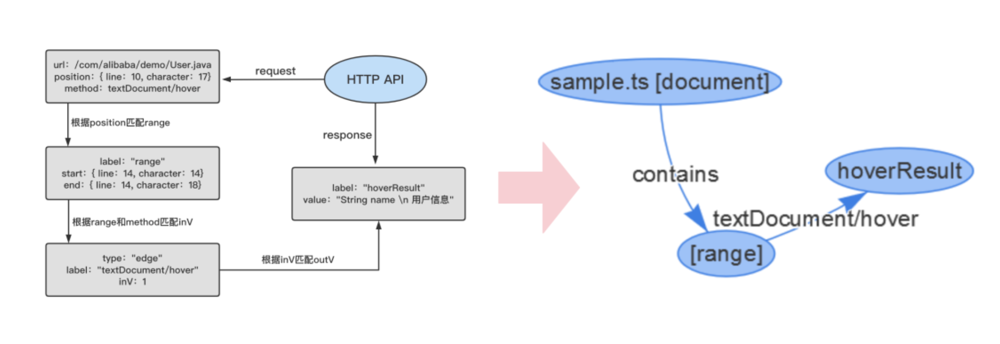

- **Tags**: [[LSP]] [[LSIF]] [[Code Navigation]]
- **语言服务器协议 (Language Server Protocol, [[LSP]])**
	- https://microsoft.github.io/language-server-protocol/overviews/lsp/overview/
	- LSP 是一种协议，用于在客户端（例如，编辑器或集成开发环境）和服务器（提供语言特性支持的工具，如编译器或解析器）之间进行通信。
	- 通过使用 LSP，可以将语言特性的实现与客户端分离，使得一种语言的处理引擎可以为多种客户端提供服务，如语法高亮、代码补全、定义跳转、重命名、代码检查等。
	- 使用 LSP 的好处是，一旦为一种编程语言实现了一个 LSP 服务器，那么任何支持 LSP 的编辑器都可以利用这个服务器提供的语言特性。
- **语言服务器索引格式 (Language Server Index Format, [[LSIF]])**
	- https://microsoft.github.io/language-server-protocol/specifications/lsif/0.4.0/specification/
	- LSIF 是为了解决 LSP 不能在没有运行语言服务器的情况下工作的问题而设计的。
		- 例如，在浏览一个大型代码库或者浏览在线的源代码时，可能无法启动一个完整的语言服务器来提供语言特性。
	- LSIF 是一种数据格式，用于表示预先计算好的语言信息，如定义、引用和文档注释。
		- 通过 LSIF，可以在没有运行语言服务器的情况下提供丰富的语言特性。
	- LSIF（language-server-index-format）
		- 是一种用于描述程序信息且遵循LSP规范的语言服务器索引格式，
		- 同时它的查询和存储是支持HTTP协议的，
		- 目前主要用于Code Intelligence领域，并且是该领域非常主流的方案。
	- 通俗的讲，LSIF定义了一种可以响应LSP请求的存储索引格式，该格式将静态代码转换成了图的数据结构。
		- 它也是业界优秀的服务供应商Sourcegraph采用的索引格式方案，语法服务供应商会实现相应的解析器将静态代码转换成对应的索引格式。
	- LSIF 索引格式的设计是基于以下几点驱动：
		- 该格式不应暗示使用某种持久化技术
		- 定义的数据应该尽可能接近LSP的建模，便于通过LSP请求交互（生态好）
		- 格式本身不定义任何符号语义，便于跨语言
		- 输入输出格式基于JSON
	- 请求流程：
		- 例子来自：
			- https://mp.weixin.qq.com/s/7ZFezyneFADZ7_unAZWUEg
		- 
	- 一些缺点：
		- 观点来自：
			- https://mp.weixin.qq.com/s/7ZFezyneFADZ7_unAZWUEg
			  id:: 650eb20d-62fc-4567-b946-7ac0a7e05d80
		- 索引大、构建慢
		- 关联复杂，不利于分布式构建
		- 数据结构导致增量效率低
	-
- sourcegraph的实践文章
	- sourcegraph介绍：
		- GitLab的CEO Sid Sijbrandij曾评价Sourcegraph，“拥有这个世界上最好的查找定义、查找引用和智能代码导航能力。
			- 观点来自：
				- https://mp.weixin.qq.com/s/7ZFezyneFADZ7_unAZWUEg
			-
	- 相关文章：
		- https://about.sourcegraph.com/blog/part-1-how-sourcegraph-scales-with-the-language-server-protocol
		- https://about.sourcegraph.com/blog/part-2-how-sourcegraph-scales-with-the-language-server-protocol
	-
	-