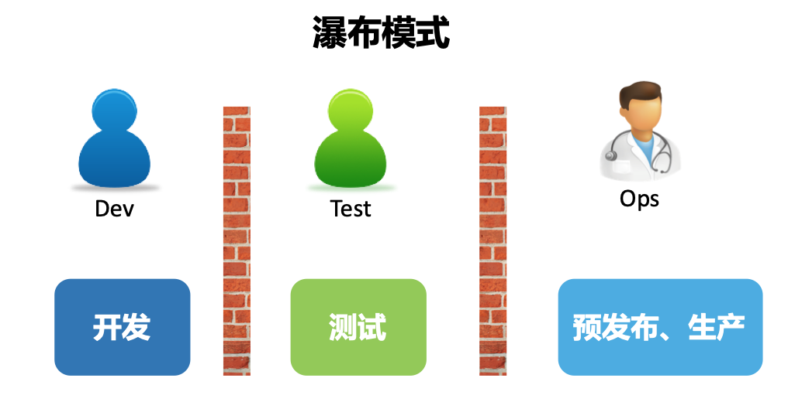
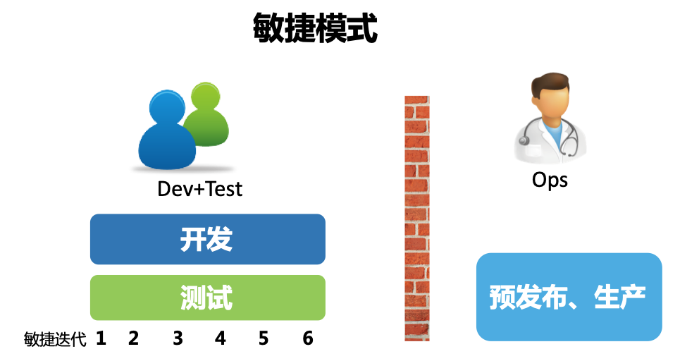
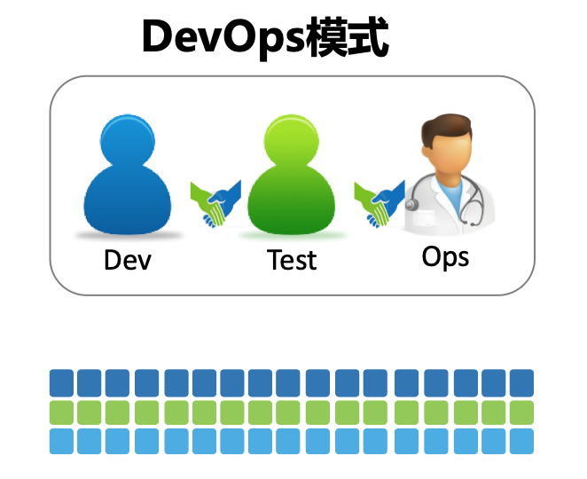
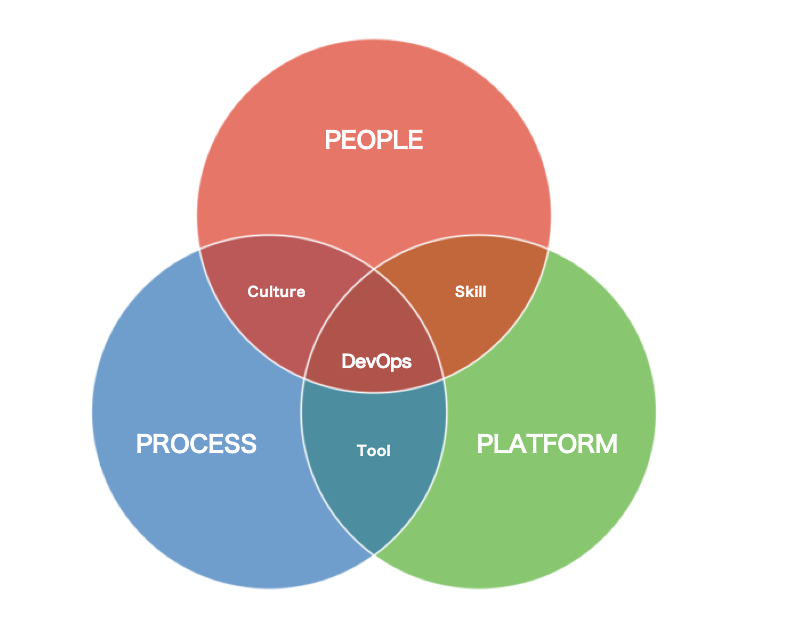

- **TAG:** [[Computer Science]] [[研发效能]]
-
- DevOps实战笔记
	- author：石雪峰
	- **Highlight**
		- DevOps解决什么问题
		  collapsed:: true
			- DevOps定义
				- 来自维基百科
					- DevOps（开发 Development 与运维 Operations 的组合词）是一种文化、一场运动或实践，强调在自动化软件交付流程及基础设施变更过程中，软件开发人员与其他信息技术（IT）专业人员彼此之间的协作与沟通。它旨在建立一种文化与环境，使构建、测试、软件发布得以快速、频繁以及更加稳定地进行。
				- 客观来说，从 DevOps 运动诞生开始，那些先行者们就从来没有试图给 DevOps 下一个官方的定义。
					- 当然，这样做的好处很明显，由于不限定人群和范围，每个人都能从自己的立场来为 DevOps 做贡献，从而使 DevOps 所涵盖的范围越发宽广。
					- 但是，坏处也是显而易见的。随着 DevOps 的不断发展，刚开始接触 DevOps 的人往往不得要领，只见树木不见森林，认知的偏差使得 DevOps 越发地神秘起来。
			- 解决什么问题？
				- 各种模式对比
					- 瀑布式开发模式
					  collapsed:: true
						- 什么样的模式
							- 
							- 瀑布式开发模式将软件交付过程划分成几个阶段，从需求到开发、测试和运维，它的理念是软件开发的规模越来越大，必须以一种工程管理的方式来定义每个阶段，以及相应的交付产物和交付标准，以期通过一种重流程，重管控，按照计划一步步推进整个项目的交付过程。
						- 随着市场环境和用户需求变化的不断加速，这种按部就班的方式有一个严重的潜在问题。
							- 软件开发活动需要在项目一开始就确定项目目标、范围以及实现方式，而这个时间点往往是我们对用户和市场环境信息了解最少的时候，这样做出来的决策往往带有很大的不确定性，很容易导致项目范围不断变更，计划不断延期，交付上线时间不断推后，最后的结果是，即便我们投入了大量资源，却难以达到预期的效果。
					- 敏捷式开发模式
					  collapsed:: true
						- 什么样的模式
							- 
							- 它的核心理念是，既然我们无法充分了解用户的真实需求是怎样的，那么不如将一个大的目标不断拆解，把它变成一个个可交付的小目标，然后通过不断迭代，以小步快跑的方式持续开发。
							- 与此同时，将测试工作从研发末端的一个独立环节注入整个开发活动中，对开发交付的内容进行持续验证，保证每次可交付的都是一个可用的功能集合，并且由于质量内建在研发环节中，交付功能的质量也是有保障的。
							- 敏捷之所以更快，根本原因在于持续迭代和验证节省了大量不必要的浪费和返工。
						- 可是问题又来了，开发和测试团队发现，不管研发的速度变得多快，在软件交付的另一端，始终有一群人在冷冰冰地看着他们，一句“现在没到发布窗口”让多少新开发的功能倒在了上线的门槛上。
					- DevOps 模式
					  collapsed:: true
						- 什么样的模式
							- 
							- 于是，活在墙的另一端的运维团队成了被拉拢的对象。这些在软件交付最末端的团队始终处于一种“背锅”的状态，他们也有改变的意愿，所以 DevOps 应运而生，也就是说，DevOps 最开始想要打破的就是开发和运维之间的对立和隔阂。
							- 在传统模式下，度量开发团队效率的途径就是看开发完成了多少需求。于是，开发为了达成绩效目标，当然也是为了满足业务需求，不断地堆砌新功能，却很少有时间认真思考这些功能的可运维性和可测试性，只要需求状态流转到开发完成就万事大吉了。
							- 而对于运维团队而言，他们的考核指标却是系统的稳定性、可用性和安全性。
							- 于是，预先设立的上线窗口就成了运维团队的自留地，不断抬高的上线门槛也使得开发团队的交付变成了不可能完成的任务，最后，“互相伤害”就成了这个故事注定的结局。
						- 从一开始想要促进开发和运维的协作，团队慢慢发现，其实在整个软件交付过程中，不仅只有开发和运维，业务也是重要的一环。
							- 比方说，如果业务制定了一个不靠谱的需求，那么无论开发和运维怎样协作，得到的终究是一个不靠谱的结果，以及对人力的浪费。可是业务并不清楚用户的真实情况，于是运维团队慢慢转向运营团队，他们需要持续不断地把线上的真实数据和用户行为及时地反馈给需求团队，来帮助需求团队客观评估需求的价值，并及时作出有利于产品发展的调整，这样一来，业务也被引入到了 DevOps 之中，甚至诞生了 BizDevOps 这样一个专门的词汇。
						- 那么，既然沟通协作放之四海皆准，安全也开始积极地参与进来。
							- 安全不再是系统上线发布之后的“定时炸弹”，而是介入到整个软件开发过程中，在每个过程中注入安全反馈机制，来帮助团队在第一时间应对安全风险，那么，对于安全团队来说，DevSecOps 就成了他们眼中的 DevOps。
						- 这样的例子比比皆是，包括职能部门、战略部门等，都纷纷加入其中，使得 DevOps 由最开始的点，扩展为线，再到面，不断发展壮大。
				- 作者的定义：
					- DevOps 是通过平台（Platform）、流程（Process）和人（People）的有机整合，以 C（协作）A（自动化）L（精益）M（度量）S（共享）文化为指引，旨在建立一种可以快速交付价值并且具有持续改进能力的现代化 IT 组织。
					-
					-
		- DevOps的价值：数字化转型时代，DevOps是必选项？
		  collapsed:: true
			- 为什么软件如此重要？
				- 软件慢慢从企业内部的支撑系统和成本中心，变成了企业服务的直接载体和利润中心。
					- 企业通过软件降低运营成本，提升服务水平，而用户在获得便利的同时，也加强了同企业之间的联系。
				- 这本是一件双赢的事情，可问题是，我们所身处的是一个 VUCA 的时代，VUCA 是指易变性（Volatility）、不确定性（Uncertainty）、复杂性（Complexity）和模糊性（Ambiguity），它代表了这个时代的典型特征。
				- 软件交付的效率和质量成了当今企业的核心价值和核心竞争力，所以，任何一家企业，无论是行业巨头还是初创公司，无论是互联网行业还是传统行业，无论是领先者还是颠覆者，都有强烈的意愿去改善自身的软件交付能力，而这恰恰和 DevOps 的理念和诞生背景不谋而合。
				- 引用国家智库的某位领导的话来说，“工业革命消灭了绝大多数的手工业群体，却催生了程序员这个现存最大的手工业群体”。这句话看似危言耸听，但这种开发软件的方式的确存在，其中伴随着大量的效率浪费。
				- 企业内部的软件开发交付效率已经成了一座值得探索挖掘的金矿，效率经济可能成为新的业绩增长点。
			- DevOps 的价值
				- 高效的软件交付方式
					- DevOps 的 4 个结果指标
						- 部署频率：指应用和服务向生产环境部署代码的频率。
						- 变更前置时间：指代码从提交到成功运行在生产环境的时长。
						- 服务恢复时间：指线上应用和服务出现故障到恢复运行的时长。
						- 变更失败率：指应用和服务在生产环境部署失败或者部署后导致服务降级的比例。
					- 四项结果指标，分别代表了软件交付的两个最重要的方面，也就是
						- 交付效率
						- 交付质量
					- 从数据结果中，我们还能得到一个惊人的发现，那就是高效能的组织不仅做到了高效率，还实现了高质量，由此可见，鱼与熊掌可以兼得。
					- 我们在不断提高软件交付效率时，往往是以牺牲质量为代价的，结果做得越多，错得越多，从而陷入进退两难的境地。
					- DevOps 却反其道而行之，它试图通过体系化的研发实践导入、软件架构的整体革新、组织管理理念的不断升级和企业文化的影响塑造，来帮助企业改善整个软件交付过程，在实现高吞吐量的同时保证服务的总体稳定性，从而真正实现又快又好的软件交付目标。
				- 激发团队的创造力
					- 熟悉云计算的同学可能或多或少地了解过容器编排领域的事实标准 Kubernetes 以及它背后的 CNCF 基金会，那么，企业为什么热衷于加入这样的基金会呢？即使要付出一笔不菲的费用也在所不惜，企业这么做的收益究竟是什么？
						- 不可否认，CNCF 是一个非常成功的运营案例，成为会员还能享受白纸黑字上的福利，但是，对于很多中小企业而言，他们的诉求可能不止如此。
						- 很多时候，企业加入这样的组织，也是为了向内部员工表态，我们正和世界上最著名的公司站在同一条起跑线上，关注着同样的问题。这对他们的员工来说，既能起到激励作用，也能增强对企业自身的信心。
					- 对于 DevOps 而言，道理也是同样的，因为说到底，企业的问题都是人的问题，最核心的价值最终都会归结到人身上，所以，单纯关注软件交付的能力而忽视人的感受，结果往往都是片面的。
					- 在企业内部建设 DevOps 工具平台的时候，我也经常在思考这个问题，我们费尽心思通过平台能力建设提升了 5% 的交付效率，即便节省下来的时间只是让员工多休息了一会儿，也是非常有意义的事情。
						- 因为 DevOps 本身也包含了改善软件从业人员的生存状态，提升他们的幸福水平的理念。
				- 实施 DevOps好处
					- 一方面可以通过种种流程优化和自动化能力，改善软件开发团队的工作节奏，
					- 另一方面，也可以让大家关注同一个目标，彼此信任，高效协作，调动员工的积极性和创新能力，从而让整个团队进入一种积极创造价值的状态，而这所带来的影响远非建设一两个工具平台可比拟的。
					- 如果一家企业真的可以通过 DevOps 落地达到以上目标，而只需要多付出 10%～20% 的年终奖，岂不是大大赚到了吗？
				- 如何向老板说明DevOps的价值
					- 核心是，如果你想向谁证明一件事，那么最好的方法就是让他关注的人来替你证明这件事。
					- 计算效率提高带来的成本节省？
						- “现在的测试发布每一次需要一个小时左右。如果DevOps实行后，预计只需要10分钟，节省了50分钟，。。。每天就能省5000-6000块。”
						- 我在公司里面见过很多这样的算术题，你猜怎么样，老板基本没啥感觉，因为什么？计算公式看起来都对，但是没法证明。
						- 所以效率这个事情不像成本，砍掉一半服务器节省3000万，简单直接。
						- 其实如果老板不认为效率是竞争力，想要说服他，很难。
					- 从业务方的交付来说明
						- 一个小建议是，从业务方的交付来说明，因为业务方经常会吐槽交付不给力，那么提升效率解决他们的问题，老板感受会更深刻。
					-
					-
		- DevOps的实施：到底是工具先行还是文化先行？
			- DevOps 文化
				- 机制就是人们愿意做，而且做了有好处的事情。
				- 需要将规则内建于工具之中，并通过工具来指导实践。
				- 这样一来，当团队通过 DevOps 获得了实实在在的改变，那么 DevOps 所倡导的职责共担、持续改进的文化自然也会生根发芽。
			- DevOps 的 3 个支柱
				- 对工具和文化的体系化认知，可以归纳到 DevOps 的 3 个支柱之中，即人（People）、流程（Process）和平台（Platform）。3 个支柱之间两两组合，构成了我们实施 DevOps 的“正确姿势”，只强调其中一个维度的重要性，明显是很片面的。
				- 
				- 人 + 流程 = 文化
				- 流程 + 平台 = 工具
					- 平台的最大意义，就是承载企业内部的标准化流程。
					- 平台上固化的每一种流程，其实都是可以用来解决实际问题的工具。
					- 平台除了有用户量、认可度、老板加持等因素之外，还会有 3 个显著特征。
						- 吸附效应：平台会不断地吸收中小型的工具，逐渐成为一个能力集合体。
						- 规模效应：平台的成本不会随着使用方的扩展而线性增加，能够实现规模化。
						- 积木效应：平台具备基础通用共享能力，能够快速搭建新的业务实现。
		-