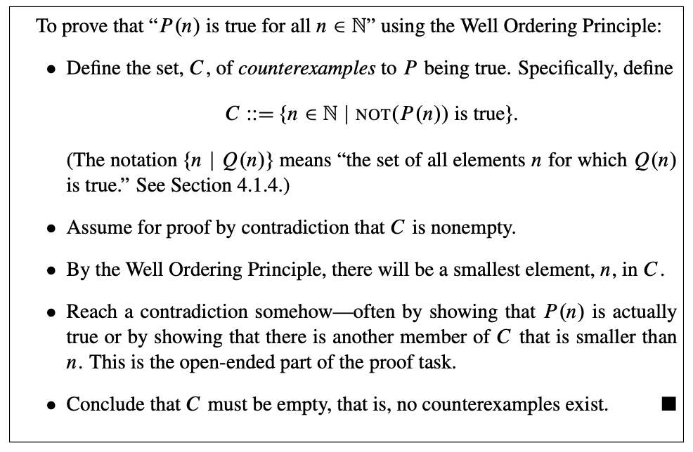

- Video Course
	- 6.042J
		- This subject offers an introduction to discrete mathematics oriented toward computer science and engineering.
	- Quick Summary
		- Fundamental Concepts of Discrete Mathematics (sets, relations, proof methods,… )
			- 离散数学基本概念(集合、关系、证明方法……)
		- Discrete Mathematical Structures (numbers, graphs, trees, counting…)
			- 离散数学结构(数字、图、树、计数……)
		- Discrete Probability Theory
			- 离散型概率理论
	- Proofs
		- A Cool Proof
			- power point
			  collapsed:: true
				- 
					- 
					-
			- elegant and correct
				- --in this case
			- worrisome in general
				- --hidden assumptions
		- Bogus Proof
			- power point
			  collapsed:: true
				- 
				- 
				- 
				-
			- Moral
				- Be sure rules are properly applied.
				- Thoughtless calculation no  substitute for understanding.
-
- Teaching Materials
	- What is a Proof
		- proposition（命题）
		  collapsed:: true
			- A proposition is a statement (communication) that is either true or
			  false.
		- Predicates（谓词）
		  collapsed:: true
			- A predicate can be understood as a proposition whose truth depends on the value
			  of one or more variables.
			- Predicate and function
				- This notation for predicates is confusingly similar to ordinary function notation.
				  If P is a predicate, then P(n) is either true or false, depending on the value of n.
				  On the other hand, if p is an ordinary function, like n2+1, then p(n) is a numerical
				  quantity. Don’t confuse these two!
		- The Axiomatic Method ( 公理化方法 )
		  collapsed:: true
			- axioms（公理）
				- Propositions like these that are simply accepted as true are called
				  axioms
			- proof（证明）
				- A proof is a sequence of logical deductions from axioms and previously proved statements that concludes with the proposition in question.
				- 证明 是指从公理及已被证明的语句，推导出命题结论的一系列逻辑推理过程。
			- There are several common terms for a proposition that has been proved. The different terms hint at the role of the proposition within a larger body of work
				- Important true propositions are called theorems（定理）
				- A lemma（引理） is a preliminary proposition useful for proving later propositions.
				- A corollary（推论） is a proposition that follows in just a few logical steps from a
				  theorem.
			- Euclid’s axiom-and-proof approach（欧几里得的公理-证明方法）, now called the axiomatic method（公理化方法）, remains the foundation for mathematics today.
				- In fact, just a handful of axioms, called the Zermelo-Fraenkel with Choice axioms(ZFC), together with a few logical deduction rules, appear to be sufficient to derive essentially all of mathematics.
		- Our Axioms（我们的公理）
		  collapsed:: true
			- So instead of starting with ZFC, we’re going to take a huge set of axioms as our foundation: we’ll accept all familiar facts from high school math.
				- This will give us a quick launch, but you may find this imprecise specification
				  of the axioms troubling at times.
				- For example, in the midst of a proof, you may start to wonder, “Must I prove this little fact or can I take it as an axiom?”
					- There really is no absolute answer, since what’s reasonable to assume and what requires proof depends on the circumstances and the audience.
					- A good general guideline is simply to be up front about what you’re assuming.
			- Logical Deductions（逻辑推理）
			  collapsed:: true
				- Logical deductions, or inference rules, are used to prove new propositions using
				  previously proved ones.
					- 逻辑推理，或推理规则，是指基于已被证明过的命题来证明新的命题。
				- A fundamental inference rule is modus ponens（假言推理）. This rule says that a proof of P together with a proof that P IMPLIES Q is a proof of Q.
					- 一个基本的推理规则是假言推理，即证明了P并且证明了P IMPLIES Q，就证明了Q。
					- 
						- When the statements above the line, called the antecedents（前件）, are proved, then we can consider the statement below the line, called the conclusion（结论） or consequent（后件）, to also be proved.
						- A key requirement of an inference rule is that it must be sound（有效的）:
							- an assignment of truth values to the letters, P, Q, . . . , that makes all the antecedents true must also make the consequent true.
							- So if we start off with true axioms and apply sound inference rules, everything we prove will also be true
				- There are many other natural, sound inference rules, for example:
					- 
				- As with axioms, we will not be too formal about the set of legal inference rules.
					- Each step in a proof should be clear and “logical”;
					- in particular, you should state what previously proved facts are used to derive each new conclusion.
			- Patterns of Proof（证明的模式）
				- In principle, a proof can be any sequence of logical deductions from axioms and
				  previously proved statements that concludes with the proposition in question.
				- This freedom in constructing a proof can seem overwhelming at first. How do you even start a proof?
					- Here’s the good news: many proofs follow one of a handful of standard templates.
			-
		- Proving an Implication（证明蕴涵）
		  collapsed:: true
			- Propositions of the form “If P, then Q” are called implications.
				- This implication is often rephrased as “P IMPLIES Q.”
			- Examples
				- 
			- There are a couple of standard methods for proving an implication.
				- Method 1
					- In order to prove that P IMPLIES Q:
						-
						  1. Write, “Assume P.”
							- 写，假设P
						-
						  2. Show that Q logically follows.
							- 从逻辑上证明Q
				- There are a couple points here that apply to all proofs:
					- You’ll often need to do some scratchwork while you’re trying to figure out
					  the logical steps of a proof. Your scratchwork can be as disorganized as you
					  like—full of dead-ends, strange diagrams, obscene words, whatever. But
					  keep your scratchwork separate from your final proof, which should be clear
					  and concise.
						- 在考虑证明的逻辑步骤时，通常需要一些准备工作，草稿可以比较混乱，推导不通、图表混乱、词语滥用，都无所谓。而最终的证明跟草稿不一样，证明应当是清晰的、简明的。
					- Proofs typically begin with the word “Proof” and end with some sort of delimiter like ⇤ or “QED.” The only purpose for these conventions is to clarify where proofs begin and end
						- 证明通常以“证明”一词开始，以某种分隔符或“QED”结束。这些约定只是为了明确证明从哪里开始、到哪里结束。
				- Method 2 Prove the Contrapositive（证明逆反命题）
					- An implication (“P IMPLIES Q”) is logically equivalent to its contrapositive
						- 
					- Proving one is as good as proving the other, and proving the contrapositive is sometimes easier than proving the original statement. If so, then you can proceed as follows:
						-
						  1. Write, “We prove the contrapositive:” and then state the contrapositive.
							- 写“我们证明逆反命题：”，然后表述这个逆反命题
						-
						  2. Proceed as in Method 1.
							- 按方法1继续
				-
					-
					-
				-
		- Proving an “If and Only If”（证明当且仅当）
		  collapsed:: true
			- Many mathematical theorems assert that two statements are logically equivalent;
			  that is, one holds if and only if the other does.
				- 很多数学定理声称两个语句是逻辑等价的，即一个语句成立当且仅当另一个语句成立。
			- Here is an example that has been known for several thousand years:
				- Two triangles have the same side lengths if and only if two side lengths and the angle between those sides are the same
			- The phrase “if and only if” comes up so often that it is often abbreviated “iff.”
			- Proving Methods
				- Method 1: Prove Each Statement Implies the Other（证明两个语句相互蕴涵）
					- The statement “P IFF Q” is equivalent to the two statements “P IMPLIES Q” and
					  “Q IMPLIES P.” So you can prove an “iff” by proving two implications:
					-
					  1. Write, “We prove P implies Q and vice-versa.”
						- 写“我们证明P蕴涵Q，反之依然”
					-
					  2. Write, “First, we show P implies Q.” Do this by one of the methods in
					  Section 1.5.（证明蕴涵那一章）
						- 首先，证明P蕴涵Q
					-
					  3. Write, “Now, we show Q implies P.” Again, do this by one of the methods
					  in Section 1.5.（证明蕴涵那一章）
						- 然后，证明Q蕴涵P
				- Method 2: Construct a Chain of iffs（构建iff链）
					- In order to prove that P is true iff Q is true:
						-
						  1. Write, “We construct a chain of if-and-only-if implications.”
							- 我们构建一个当且仅当蕴涵链
						-
						  2. Prove P is equivalent to a second statement which is equivalent to a third
						  statement and so forth until you reach Q.
							- 证明P等价于第二个语句，然后第二个语句等价于第三个语句，以此类推，直到等价于Q
					- This method sometimes requires more ingenuity than the first, but the result can be a short, elegant proof.
					-
		- Proof by Cases（案例证明法）
		  collapsed:: true
			- Breaking a complicated proof into cases and proving each case separately is a common, useful proof strategy
				- 将复杂的证明分解成案例，然后分别证明每一个案例，这是一种常见的、很有用的证明策略。
			- Part of a case analysis argument is showing that you’ve covered all the cases.
				- This is often obvious, because the two cases are of the form “P” and “not P.”
				- 案例分析法需要囊括所有情形
		- Proof by Contradiction（反证法）
		  collapsed:: true
			- In a proof by contradiction（反证法）, or indirect proof（间接证明法）, you show that
				- if a proposition were false, then some false fact would be true.
					- 假如命题是假的，那么相应的虚假事实为真
				- Since a false fact by definition can’t be true, the proposition must be true.
					- 既然虚假事实本身不可能是真的，所以命题一定为真
			- Proof by contradiction is always a viable approach. However, as the name suggests, indirect proofs can be a little convoluted, so direct proofs are generally preferable when they are available
				- 反证法总是一种可行的方法。但是，间接证明法可能有点令人费解，所以如果可以的话最好还是采用直接证明方法。
			- Method: In order to prove a proposition P by contradiction:
				-
				  1. Write, “We use proof by contradiction.”
				-
				  2. Write, “Suppose P is false.”
				-
				  3. Deduce something known to be false (a logical contradiction).
					- 推导得出某些已知的假事实（即逻辑矛盾）
				-
				  4. Write, “This is a contradiction. Therefore, P must be true.”
		- Good Proofs in Practice（数学证明的优秀实践）
		  collapsed:: true
			- One purpose of a proof is to establish the truth of an assertion with absolute certainty（证明的目的之一在于，以绝对的确定性建立关于断言的真相）
				- and mechanically checkable proofs of enormous length or complexity can
				  accomplish this.
				- But humanly intelligible proofs are the only ones that help someone understand the subject.
				- Mathematicians generally agree that important mathematical results can’t be fully understood until their proofs are understood.
				- That is why proofs are an important part of the curriculum.
			- To be understandable and helpful, more is required of a proof than just logical
			  correctness:
				- a good proof must also be clear.
				- Correctness and clarity usually go together;
				- a well-written proof is more likely to be a correct proof, since mistakes are harder to hide.
			- we can offer some general tips on writing good proofs:
				- State your game plan（陈述你的计划）
					- A good proof begins by explaining the general line of reasoning
						- 优秀的证明开头部分通常有一句解释概括性的话
				- Keep a linear flow（保持线性流程）
					- The steps of an argument should follow one another in an intelligible order.
						- 论证的步骤应当以可理解的方式有序进行
				- A proof is an essay, not a calculation（证明是一篇论文，而不是计算）
					- Many students initially write proofs the way they compute integrals. The result is a long sequence of expressions without explanation, making it very hard to follow. This is bad.
					- A good proof usually looks like an essay with some equations thrown in. Use complete sentences。
						- 优秀的证明往往更像是一篇带公式的论文。请使用完整的句子
				- Avoid excessive symbolism（避免过度使用符号）
				- Revise and simplify.（修改，简化）
				- Introduce notation thoughtfully（仔细地介绍符号）
				- Structure long proofs（将长证明结构化）
					- Long programs are usually broken into a hierarchy of smaller procedures
				- Be wary of the “obvious.”（警惕“显然”）
				- Finish. （结束）
					- tie everything together yourself and explain why the original claim follows.
						- 总结一下，解释为什么原命题成立
				-
	- The Well Ordering Principle （良序原理）
		- Every nonempty set of nonnegative integers has a smallest element.
			- 非负整数集中的每个非空子集都有一个最小元素
		- But in fact, it provides one of the most important proof rules in [[discrete mathematics]] （[[离散数学]]）
			- 良序原理是离散数学中最为重要的证据规则之一
		- Well Ordering Proofs（良序证明）
		- Template for Well Ordering Proofs（良序证明模版）
			- More generally, there is a standard way to use Well Ordering to prove that some
			  property, P(n) holds for every nonnegative integer, n. Here is a standard way to
			  organize such a well ordering proof:
				- 
					- 定义C是P为真的反例集合
					- 假设C是非空集进行反证
					- 根据良序原理，一定存在一个最小元素n属于C
					- 得出矛盾——通常是P(n)为真，或者C中存在另一个比n小的元素。这部分取决于具体的证明任务
					- 得出结论，C一定是空集，即不存在反例。
			- Summing the Integers
		- Factoring into Primes（质因数分解）
			- We’ve previously taken for granted the Prime Factorization Theorem（质因数分解定理）, also known as the Unique Factorization Theorem（唯一分解定理） and the Fundamental Theorem of Arithmetic（算术基本定理）, which states that every integer greater than one has a unique expression as a product of prime numbers.
				- 即每一个大于1的整数都能唯一分解成质因数的乘积
			- We’ll prove the uniqueness of prime factorization in a later chapter, but well ordering gives an easy proof that every integer greater than one can be expressed as some product of primes.
		- 良序集合
			- A set of numbers is well ordered when each of its nonempty subsets has a minimum element.
				- 如果一个集合的人以非空子集都有一个最小元素，我们称这个集合是良序的（well ordered）
			- The Well Ordering Principle says that the set of nonnegative integers is well ordered, but so are lots of other sets.（根据良序定理可知，）
				- For example, the set  𝑟ℕ  of numbers of the form  𝑟𝑛 , where  𝑟  is a positive real number and  𝑛∈ℕ .
			-