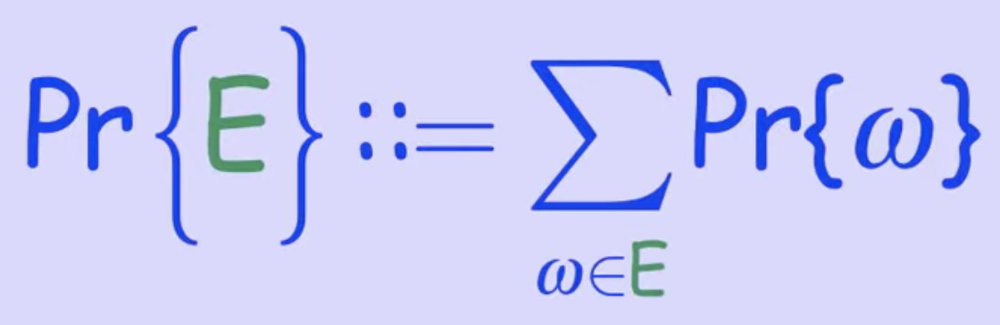
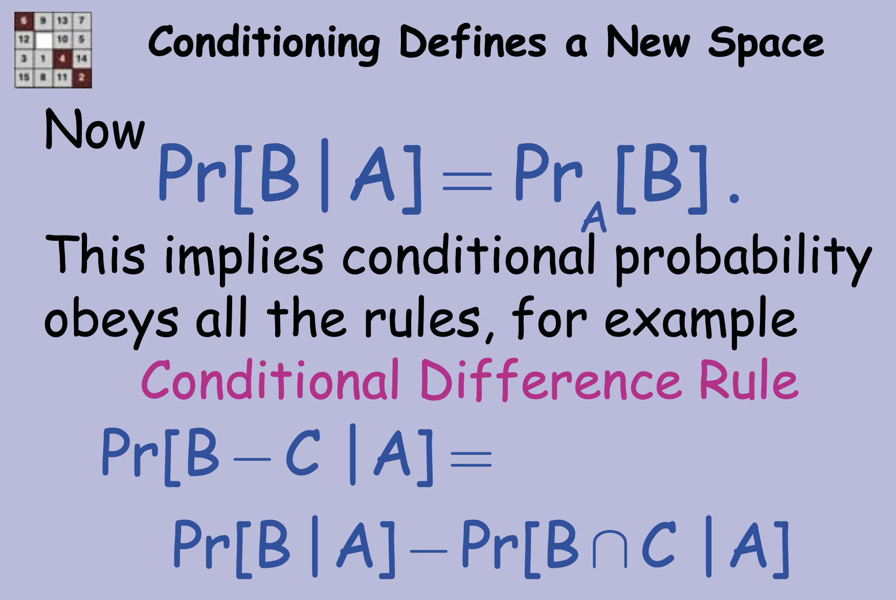
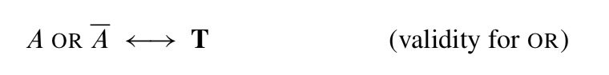
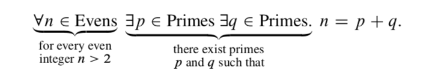

- Video Course
	- 6.042J
		- https://openlearninglibrary.mit.edu/courses/course-v1:OCW+6.042J+2T2019/course/
		- This subject offers an introduction to discrete mathematics oriented toward computer science and engineering.
	- Quick Summary
		- Fundamental Concepts of Discrete Mathematics (sets, relations, proof methods,… )
			- 离散数学基本概念(集合、关系、证明方法……)
		- Discrete Mathematical Structures (numbers, graphs, trees, counting…)
			- 离散数学结构(数字、图、树、计数……)
		- Discrete Probability Theory
			- 离散型概率理论
	- Proofs
		- A Cool Proof
			- power point
			  collapsed:: true
				- 
					- 
					-
			- elegant and correct
				- --in this case
			- worrisome in general
				- --hidden assumptions
		- Bogus Proof
			- power point
			  collapsed:: true
				- 
				- 
				- 
				-
			- Moral
				- Be sure rules are properly applied.
				- Thoughtless calculation no  substitute for understanding.
	- Logic & Propositions
		- IMPLIES
			- power point
			  collapsed:: true
				- 
				- 
				- 
			- Soundness
				- A sound rule preserves truth: if all the antecedents are true in some environment, then so is the conclusion.
			- Soundness & Validity
				- Lemma: A rule is sound iff AND{Antecedents} IMPLIES Conclusion is valid.
		- The Logic of Propositions
			- power point
			- Proving Validity
				- Instead of truth tables, can try to prove valid formulas symbolically using axioms and deduction rules
			- A Proof System
				- Another approach is to start with some valid formulas (axioms) and deduce more valid formulas using proof rules
			- validity checking still inefficient
				- Algebraic & deduction proofs in general are no better than truth tables.
				- No efficient method for verifying validity is known
		- Quantifiers & Predicate Logic
- Probability
	- Intro to Discrete Probability
		- Tree Model
			- Determine the outcomes
				- using a tree of possible steps can help
				  collapsed:: true
					- 
					- 
			- Find Probability
				- Intuition is important but dangerous. Stick with [[4-part method]]:
					- 1. Identify outcomes (trees helps)
					- 2. Identify event (winning)
					- 3. Assign outcome probabilities
					- 4. Compute event probabilities
			- Simplified Monty Hall Tree
				- So the message here is that the tree that you come up with to model the experimental outcomes is really a modeling process. And there may be many models that work to capture a given scenario. And it will often pay off to try to find a simpler tree to make the analysis simpler.
		- Probability Spaces
		  collapsed:: true
			- Sample space:
				- a countable set S whose elements are called outcomes
			- Probability function,
				- Pr: S -> [0, 1], such that
					- {:height 145, :width 321}
			- The purpose of the "tree model" is to figure out which probability space to use:
				- outcomes = leaves of tree
				- outcome probabilities calculated from branch probabilities
			- An event is a subset
				- {:height 65, :width 142}
				- {:height 114, :width 320} 
				  id:: 63f9d31a-1ee1-4688-af61-ad258bd48773
					- Cor: The Sum Rule
					  id:: 63f9d33e-7465-4c53-b64c-14010e441bf3
			- Sum Rule
				- {:height 248, :width 442}
				- {:height 200, :width 445}
			- Discrete Probability（离散概率）
			  id:: 63f9d3e6-64aa-4509-8697-87cba8491e6a
				- Discrete = countable sample space
				- Allows sums instead of integrals
					- （允许用“和”代替“积分”）
			- Derived Rules of Probability
				- Difference Rule
					- {:height 278, :width 418}
				- Inclusion-Exclustion
				  id:: 63f9d529-f255-4846-a31f-a49460885a4e
					- {:height 230, :width 336}
					- {:height 152, :width 332}
				- The Union Bound
				  id:: 63f9d565-fa0a-47df-88e2-b0d11f443d22
					- {:height 155, :width 340}
				- Monotonicity
				  id:: 63f9d583-7bbd-4999-9deb-ae9a838761a4
					- {:height 86, :width 432}
				- Boole's Inequality
				  id:: 63f9d5ce-20a2-46de-8144-ce7fa58f1a82
					- {:height 225, :width 431}
					-
	- Conditional Probability
		- We were reasoning about conditional probability in the way we defined our probability spaces in the first place
		- Product Rule
		  collapsed:: true
			- {:height 301, :width 428}
			- Conditional Probability
				- {:height 241, :width 382}
			- Product Rule for 3
				- {:height 247, :width 376}
		- Conditional Defines a New Space
		  collapsed:: true
			- {:height 255, :width 409}
			- {:height 286, :width 417}
			-
		- Law of Total Probability
		  collapsed:: true
			- Law of reasoning about probability by cases
				- {:height 285, :width 374}
				- {:height 240, :width 366}
			- {:height 229, :width 416}
		- [[Bayes's Theorem
			-
- Teaching Materials
	- What is a Proof
	  collapsed:: true
		- proposition（命题）
		  collapsed:: true
			- A proposition is a statement (communication) that is either true or
			  false.
		- Predicates（谓词）
		  collapsed:: true
			- A predicate can be understood as a proposition whose truth depends on the value
			  of one or more variables.
			- Predicate and function
				- This notation for predicates is confusingly similar to ordinary function notation.
				  If P is a predicate, then P(n) is either true or false, depending on the value of n.
				  On the other hand, if p is an ordinary function, like n2+1, then p(n) is a numerical
				  quantity. Don’t confuse these two!
		- The Axiomatic Method ( 公理化方法 )
		  collapsed:: true
			- axioms（公理）
				- Propositions like these that are simply accepted as true are called
				  axioms
			- proof（证明）
				- A proof is a sequence of logical deductions from axioms and previously proved statements that concludes with the proposition in question.
				- 证明 是指从公理及已被证明的语句，推导出命题结论的一系列逻辑推理过程。
			- There are several common terms for a proposition that has been proved. The different terms hint at the role of the proposition within a larger body of work
				- Important true propositions are called theorems（定理）
				- A lemma（引理） is a preliminary proposition useful for proving later propositions.
				- A corollary（推论） is a proposition that follows in just a few logical steps from a
				  theorem.
			- Euclid’s axiom-and-proof approach（欧几里得的公理-证明方法）, now called the axiomatic method（公理化方法）, remains the foundation for mathematics today.
				- In fact, just a handful of axioms, called the Zermelo-Fraenkel with Choice axioms(ZFC), together with a few logical deduction rules, appear to be sufficient to derive essentially all of mathematics.
		- Our Axioms（我们的公理）
		  collapsed:: true
			- So instead of starting with ZFC, we’re going to take a huge set of axioms as our foundation: we’ll accept all familiar facts from high school math.
				- This will give us a quick launch, but you may find this imprecise specification
				  of the axioms troubling at times.
				- For example, in the midst of a proof, you may start to wonder, “Must I prove this little fact or can I take it as an axiom?”
					- There really is no absolute answer, since what’s reasonable to assume and what requires proof depends on the circumstances and the audience.
					- A good general guideline is simply to be up front about what you’re assuming.
			- Logical Deductions（逻辑推理）
			  collapsed:: true
				- Logical deductions, or inference rules, are used to prove new propositions using
				  previously proved ones.
					- 逻辑推理，或推理规则，是指基于已被证明过的命题来证明新的命题。
				- A fundamental inference rule is modus ponens（假言推理）. This rule says that a proof of P together with a proof that P IMPLIES Q is a proof of Q.
					- 一个基本的推理规则是假言推理，即证明了P并且证明了P IMPLIES Q，就证明了Q。
					- 
						- When the statements above the line, called the antecedents（前件）, are proved, then we can consider the statement below the line, called the conclusion（结论） or consequent（后件）, to also be proved.
						- A key requirement of an inference rule is that it must be sound（有效的）:
							- an assignment of truth values to the letters, P, Q, . . . , that makes all the antecedents true must also make the consequent true.
							- So if we start off with true axioms and apply sound inference rules, everything we prove will also be true
				- There are many other natural, sound inference rules, for example:
					- 
				- As with axioms, we will not be too formal about the set of legal inference rules.
					- Each step in a proof should be clear and “logical”;
					- in particular, you should state what previously proved facts are used to derive each new conclusion.
			- Patterns of Proof（证明的模式）
				- In principle, a proof can be any sequence of logical deductions from axioms and
				  previously proved statements that concludes with the proposition in question.
				- This freedom in constructing a proof can seem overwhelming at first. How do you even start a proof?
					- Here’s the good news: many proofs follow one of a handful of standard templates.
			-
		- Proving an Implication（证明蕴涵）
			- Propositions of the form “If P, then Q” are called implications.
				- This implication is often rephrased as “P IMPLIES Q.”
			- Examples
				- 
			- There are a couple of standard methods for proving an implication.
				- Method 1
					- In order to prove that P IMPLIES Q:
						- 1. Write, “Assume P.”
							- 写，假设P
						- 2. Show that Q logically follows.
							- 从逻辑上证明Q
				- There are a couple points here that apply to all proofs:
					- You’ll often need to do some scratchwork while you’re trying to figure out
					  the logical steps of a proof. Your scratchwork can be as disorganized as you
					  like—full of dead-ends, strange diagrams, obscene words, whatever. But
					  keep your scratchwork separate from your final proof, which should be clear
					  and concise.
						- 在考虑证明的逻辑步骤时，通常需要一些准备工作，草稿可以比较混乱，推导不通、图表混乱、词语滥用，都无所谓。而最终的证明跟草稿不一样，证明应当是清晰的、简明的。
					- Proofs typically begin with the word “Proof” and end with some sort of delimiter like ⇤ or “QED.” The only purpose for these conventions is to clarify where proofs begin and end
						- 证明通常以“证明”一词开始，以某种分隔符或“QED”结束。这些约定只是为了明确证明从哪里开始、到哪里结束。
				- Method 2 Prove the Contrapositive（证明逆反命题）
					- An implication (“P IMPLIES Q”) is logically equivalent to its contrapositive
						- 
					- Proving one is as good as proving the other, and proving the contrapositive is sometimes easier than proving the original statement. If so, then you can proceed as follows:
						- 1. Write, “We prove the contrapositive:” and then state the contrapositive.
							- 写“我们证明逆反命题：”，然后表述这个逆反命题
						- 2. Proceed as in Method 1.
							- 按方法1继续
		- Proving an “If and Only If”（证明当且仅当）
		  collapsed:: true
			- Many mathematical theorems assert that two statements are logically equivalent;
			  that is, one holds if and only if the other does.
				- 很多数学定理声称两个语句是逻辑等价的，即一个语句成立当且仅当另一个语句成立。
			- Here is an example that has been known for several thousand years:
				- Two triangles have the same side lengths if and only if two side lengths and the angle between those sides are the same
			- The phrase “if and only if” comes up so often that it is often abbreviated “iff.”
			- Proving Methods
				- Method 1: Prove Each Statement Implies the Other（证明两个语句相互蕴涵）
					- The statement “P IFF Q” is equivalent to the two statements “P IMPLIES Q” and
					  “Q IMPLIES P.” So you can prove an “iff” by proving two implications:
					- 1. Write, “We prove P implies Q and vice-versa.”
						- 写“我们证明P蕴涵Q，反之依然”
					- 2. Write, “First, we show P implies Q.” Do this by one of the methods in
					  Section 1.5.（证明蕴涵那一章）
						- 首先，证明P蕴涵Q
					- 3. Write, “Now, we show Q implies P.” Again, do this by one of the methods
					  in Section 1.5.（证明蕴涵那一章）
						- 然后，证明Q蕴涵P
				- Method 2: Construct a Chain of iffs（构建iff链）
					- In order to prove that P is true iff Q is true:
						- 1. Write, “We construct a chain of if-and-only-if implications.”
							- 我们构建一个当且仅当蕴涵链
						- 2. Prove P is equivalent to a second statement which is equivalent to a third
						  statement and so forth until you reach Q.
							- 证明P等价于第二个语句，然后第二个语句等价于第三个语句，以此类推，直到等价于Q
					- This method sometimes requires more ingenuity than the first, but the result can be a short, elegant proof.
					-
		- Proof by Cases（案例证明法）
		  collapsed:: true
			- Breaking a complicated proof into cases and proving each case separately is a common, useful proof strategy
				- 将复杂的证明分解成案例，然后分别证明每一个案例，这是一种常见的、很有用的证明策略。
			- Part of a case analysis argument is showing that you’ve covered all the cases.
				- This is often obvious, because the two cases are of the form “P” and “not P.”
				- 案例分析法需要囊括所有情形
		- Proof by Contradiction（反证法）
		  collapsed:: true
			- In a proof by contradiction（反证法）, or indirect proof（间接证明法）, you show that
				- if a proposition were false, then some false fact would be true.
					- 假如命题是假的，那么相应的虚假事实为真
				- Since a false fact by definition can’t be true, the proposition must be true.
					- 既然虚假事实本身不可能是真的，所以命题一定为真
			- Proof by contradiction is always a viable approach. However, as the name suggests, indirect proofs can be a little convoluted, so direct proofs are generally preferable when they are available
				- 反证法总是一种可行的方法。但是，间接证明法可能有点令人费解，所以如果可以的话最好还是采用直接证明方法。
			- Method: In order to prove a proposition P by contradiction:
				- 1. Write, “We use proof by contradiction.”
				- 2. Write, “Suppose P is false.”
				- 3. Deduce something known to be false (a logical contradiction).
					- 推导得出某些已知的假事实（即逻辑矛盾）
				- 4. Write, “This is a contradiction. Therefore, P must be true.”
		- Good Proofs in Practice（数学证明的优秀实践）
		  collapsed:: true
			- One purpose of a proof is to establish the truth of an assertion with absolute certainty（证明的目的之一在于，以绝对的确定性建立关于断言的真相）
				- and mechanically checkable proofs of enormous length or complexity can
				  accomplish this.
				- But humanly intelligible proofs are the only ones that help someone understand the subject.
				- Mathematicians generally agree that important mathematical results can’t be fully understood until their proofs are understood.
				- That is why proofs are an important part of the curriculum.
			- To be understandable and helpful, more is required of a proof than just logical
			  correctness:
				- a good proof must also be clear.
				- Correctness and clarity usually go together;
				- a well-written proof is more likely to be a correct proof, since mistakes are harder to hide.
			- we can offer some general tips on writing good proofs:
				- State your game plan（陈述你的计划）
					- A good proof begins by explaining the general line of reasoning
						- 优秀的证明开头部分通常有一句解释概括性的话
				- Keep a linear flow（保持线性流程）
					- The steps of an argument should follow one another in an intelligible order.
						- 论证的步骤应当以可理解的方式有序进行
				- A proof is an essay, not a calculation（证明是一篇论文，而不是计算）
					- Many students initially write proofs the way they compute integrals. The result is a long sequence of expressions without explanation, making it very hard to follow. This is bad.
					- A good proof usually looks like an essay with some equations thrown in. Use complete sentences。
						- 优秀的证明往往更像是一篇带公式的论文。请使用完整的句子
				- Avoid excessive symbolism（避免过度使用符号）
				- Revise and simplify.（修改，简化）
				- Introduce notation thoughtfully（仔细地介绍符号）
				- Structure long proofs（将长证明结构化）
					- Long programs are usually broken into a hierarchy of smaller procedures
				- Be wary of the “obvious.”（警惕“显然”）
				- Finish. （结束）
					- tie everything together yourself and explain why the original claim follows.
						- 总结一下，解释为什么原命题成立
				-
	- The Well Ordering Principle （良序原理）
	  collapsed:: true
		- Every nonempty set of nonnegative integers has a smallest element.
			- 非负整数集中的每个非空子集都有一个最小元素
		- But in fact, it provides one of the most important proof rules in [[discrete mathematics]] （[[离散数学]]）
			- 良序原理是离散数学中最为重要的证据规则之一
		- Well Ordering Proofs（良序证明）
		- Template for Well Ordering Proofs（良序证明模版）
			- More generally, there is a standard way to use Well Ordering to prove that some
			  property, P(n) holds for every nonnegative integer, n. Here is a standard way to
			  organize such a well ordering proof:
				- 
					- 定义C是P为真的反例集合
					- 假设C是非空集进行反证
					- 根据良序原理，一定存在一个最小元素n属于C
					- 得出矛盾——通常是P(n)为真，或者C中存在另一个比n小的元素。这部分取决于具体的证明任务
					- 得出结论，C一定是空集，即不存在反例。
			- Summing the Integers
		- Factoring into Primes（质因数分解）
			- We’ve previously taken for granted the Prime Factorization Theorem（质因数分解定理）, also known as the Unique Factorization Theorem（唯一分解定理） and the Fundamental Theorem of Arithmetic（算术基本定理）, which states that every integer greater than one has a unique expression as a product of prime numbers.
				- 即每一个大于1的整数都能唯一分解成质因数的乘积
			- We’ll prove the uniqueness of prime factorization in a later chapter, but well ordering gives an easy proof that every integer greater than one can be expressed as some product of primes.
		- 良序集合
			- A set of numbers is well ordered when each of its nonempty subsets has a minimum element.
				- 如果一个集合的人以非空子集都有一个最小元素，我们称这个集合是良序的（well ordered）
			- The Well Ordering Principle says that the set of nonnegative integers is well ordered, but so are lots of other sets.（根据良序定理可知，非负整数集合是良序的，其实还有很多集合也是良序的）
				- For example, the set  𝑟ℕ  of numbers of the form  𝑟𝑛 , where  𝑟  is a positive real number and  𝑛∈ℕ .
			- 在计算机科学领域，良序性往往用来证明计算不会无休止地运行下去。
				- 思路是为计算的各个步骤指定值，随着程序的运行，值越来越小。
				- 如果这些值构成一个良序集合，那么计算就不会无休止执行。
				- 否则，这些表示运算步骤的值的子集就没有最小元素。
			- 注意，有最小元素的集合不一定是良序的
				- 例如，非负有理数集合：
					- 有最小元素0，但是存在没有最小元素的非空子集——比如正有理数。
			-
	- Logic & Propositions
	  collapsed:: true
		- Propositions from Propositions（命题的命题）
		  collapsed:: true
			- we concerned with how propositions are combined and related.
			- propositional variables（命题变量）
				- like propositions, can take on only the values T (true) and F (false).
				- Propositional variables are also called Boolean variables（布尔变量） after their inventor, the nineteenth century mathematician George—you guessed it—Boole.
			- NOT, AND, and OR
				- Mathematicians use the words NOT, AND, and OR for operations that change or combine propositions
				- The precise mathematical meaning of these special words can be specified by truth tables.（真值表）
			- IMPLIES
				- The combining operation with the least intuitive technical meaning is “implies.”
					- {:height 155, :width 281}
				- The truth table for implications can be summarized in words as follows:
					- An implication is true exactly when the if-part is false or the then-part is true.
				- One of our original examples demonstrates an even stranger side of implications.
					- “If pigs fly, then you can understand the Chebyshev bound.”
					- Don’t take this as an insult; we just need to figure out whether this proposition is true or false. Curiously, the answer has nothing to do with whether or not you can understand the Chebyshev bound. Pigs do not fly, so we’re on either line (ft) or line (ff) of the truth table. In both cases, the proposition is true!（猪不会飞，所以对应真值表中的ft行或者ff行，这两种情况下，整个命题都为真）
				- In contrast, here’s an example of a false implication:
					- “If the moon shines white, then the moon is made of white cheddar.”
					- Yes, the moon shines white. But, no, the moon is not made of white cheddar cheese. So we’re on line (tf) of the truth table, and the proposition is false.（是的，月亮是白色的。但是，月亮不是由白色的切达奶酪做成的。我们在真值表的(tf)线上，命题是假的。）
				- False Hypotheses（无效假说）
					- It often bothers people when they first learn that implications which have false hypotheses are considered to be true. But implications with false hypotheses hardly ever come up in ordinary settings, so there’s not much reason to be bothered by whatever truth assignment logicians and mathematicians choose to give them.（当人们第一次得知含有错误假设的暗示被认为是正确的时候，这常常会让他们感到困扰。但错误假设的含义在普通情况下几乎不会出现，所以没有太多理由被逻辑学家和数学家选择给他们的真理分配所困扰。）
					- There are, of course, good reasons for the mathematical convention that implications are true when their hypotheses are false. （当然，有很好的理由来支持数学惯例，即当假设为假时，暗示为真。）
			- If and Only If
				- Mathematicians commonly join propositions in one additional way that doesn’t arise in ordinary speech. （数学家通常用一种普通语言中没有的附加方式来连接命题。）
				- The proposition “P if and only if Q” asserts that P and Q have the same truth value. Either both are true or both are false.（“P当且仅当Q”命题断言P和Q具有相同的真值。要么都是真的，要么都是假的。）
					- {:height 179, :width 235}
			-
		- Propositional Logic in Computer Programs（计算机程序的命题逻辑）
		  collapsed:: true
			- Propositions and logical connectives arise all the time in computer programs.
			- Truth Table Calculation（真值表计算）
				- Simplifying logical expressions has real practical importance in computer science.（在计算机科学领域，简化逻辑表达式具有十分重要的现实意义）
					- Expression simplification in programs like the one above can make a program easier to read and understand.
					- Simplified programs may also run faster, since they require fewer operations.
					- In hardware, simplifying expressions can decrease the number of logic gates on a chip because digital circuits can be described by logical formulas
						- Minimizing the logical formulas corresponds to reducing the number of gates in the circuit. The payoff of gate minimization is potentially enormous: a chip with fewer gates is smaller, consumes less power, has a lower defect rate, and is cheaper to manufacture.
			- Cryptic Notation（符号表示）
				- {:height 243, :width 371}
				- The mathematical notation is concise but cryptic. Words such as “AND” and “OR” are easier to remember and won’t get confused with operations on numbers.
				- We will often use P as an abbreviation for NOT(P), but aside from that, we mostly stick to the words—except when formulas would otherwise run off the page.
			-
				-
		- Equivalence and Validity（等价性和永真性）
		  collapsed:: true
			- Implications and Contrapositives（蕴涵和逆否）
				- A statement of the form “NOT(Q) IMPLIES NOT(P)” is called the contrapositive（逆否命题） of the implication “P IMPLIES Q.”
				- In contrast, the converse（逆命题） of “P IMPLIES Q” is the statement “Q IMPLIES P .”
					- an implication is generally not equivalent to its converse.
				- the AND of the implications is equivalent to the IFF statement.
					- {:height 133, :width 479}
			- Validity and Satisfiability（永真性和可满足性）
				- A valid formula is one which is always true, no matter what truth values its variables may have. The simplest example is
					- P OR NOT(P)
				- You can think about valid formulas as capturing fundamental logical truths.
					- For example, a property of implication that we take for granted is that if one statement implies a second one, and the second one implies a third, then the first implies the third. The following valid formula confirms the truth of this property of implication.
						- 
				- Equivalence of formulas is really a special case of validity.
					- Namely, statements F and G are equivalent precisely when the statement (F IFF G) is valid.
				- validity can also be viewed as an aspect of equivalence.
					- Namely, a formula is valid iff it is equivalent to T.
				- A satisfiable formula is one which can sometimes be true—that is, there is some assignment of truth values to its variables that makes it true.
					- One way satisfiability comes up is when there are a collection of system specifications. The job of the system designer is to come up with a system that follows all the specs. This means that the AND of all the specs must be satisfiable or the designer’s job will be impossible
				- There is also a close relationship between validity and satisfiability: a statement P is satisfiable iff its negation NOT(P) is not valid.
		- The Algebra of Propositions（命题代数）
		  collapsed:: true
			- Propositions in Normal Form（命题范式）
			  collapsed:: true
				- Every propositional formula is equivalent to a “sum-of-products” or disjunctive（析取） form.
					- More precisely, a disjunctive form is simply an OR of AND-terms, where each AND-term is an AND of variables or negations of variables
				- Distributive Law of AND over OR
					- 
				- Distributive Law of OR over AND
					- 
				- The expression (3.6) is a disjunctive form where each AND-term is an AND of every one of the variables or their negations in turn. An expression of this form is called a disjunctive normal form (DNF). （析取范式）
					- 
				- Theorem 3.4.3. Every propositional formula is equivalent to both a disjunctive normal form and a conjunctive normal form.
			- Proving Equivalences（等价性证明）
			  collapsed:: true
				- A check of equivalence or validity by truth table runs out of steam pretty quickly:
					- a proposition with n variables has a truth table with 2^n lines, so the effort required to check a proposition grows exponentially with the number of variables.
				- An alternative approach that sometimes helps is to use algebra to prove equivalence.
					- A lot of different operators may appear in a propositional formula, so a useful first step is to get rid of all but three: AND, OR, and NOT.
					- This is easy because each of the operators is equivalent to a simple formula using only these three.
				- We list below a bunch of equivalence axioms with the symbol “ <--> ” between equivalent formulas. These axioms are important because they are all that’s needed to prove every possible equivalence.
					- 
					- 
					- {:height 49, :width 485}
					- 
				- All of these axioms can be verified easily with truth tables.
				- Theorem 3.4.4. Any propositional formula can be transformed into disjunctive normal form or a conjunctive normal form using the equivalences listed above.(任何命题公式都可以用上面列出的等价公理转换为析取范式或合取范式。)
				- Theorem 3.4.5 (Completeness of the propositional equivalence axioms). Two propositional formula are equivalent iff they can be proved equivalent using the equivalence axioms listed above.（两个命题公式是等价的，当且仅当可以通过上述等价公理证明它们是等价的）
				- it’s important to realize that using the strategy we gave for applying the axioms involves essentially the same effort it would take to construct truth tables, and there is no guarantee that applying the axioms will generally be any easier than using truth tables.（从本质上说，公理法所采用的策略与真值表方法相同，所以不能保证公理法就一定比真值表法简单）
				-
				-
				-
				-
			-
		- The SAT Problem（SAT问题）
		  collapsed:: true
			- Determining whether or not a more complicated proposition is satisfiable is not so easy.
			- The general problem of deciding whether a proposition is satisfiable is called SAT.
			- One approach to SAT is to construct a truth table and check whether or not a T ever appears, but as with testing validity, this approach quickly bogs down for formulas with many variables because truth tables grow exponentially with the number of variables.
			- The general definition of an “efficient” procedure is one that runs in polynomial time, that is, that runs in a number of basic steps bounded by a polynomial in s, where s is the size of an input.
			- Recently there has been exciting progress on SAT-solvers for practical applications like digital circuit verification. These programs find satisfying assignments with amazing efficiency even for formulas with millions of variables. Unfortunately, it’s hard to predict which kind of formulas are amenable to SAT-solver methods, and for formulas that are unsatisfiable, SAT-solvers generally get nowhere.
			- So no one has a good idea how to solve SAT in polynomial time, or how to prove that it can’t be done—researchers are completely stuck.
			- The problem of determining whether or not SAT has a polynomial time solution is known as the “P vs. NP” problem
		- Predicate Formulas（谓词公式）
			- Quantifiers（量词）
				- Specifically, an assertion that a predicate is always true is called a universal quantification（全称量词）,
				- and an assertion that a predicate is sometimes true is an existential quantification（存在量词）.
			- Mixing Quantifiers（混合量词）
				- Goldbach’s Conjecture
					- For every even integer n greater than 2, there exist primes p and q such
					  that n = p + q.
				- we can write Goldbach’s Conjecture in logic notation as follows:
					- 
			- Order of Quantifiers（量词的顺序）
				- Swapping the order of different kinds of quantifiers (existential or universal) usually changes the meaning of a proposition.
			- Variables Over One Domain（变量与域）
				- The unnamed nonempty set that x and y range over is called the domain of discourse, or just plain domain, of the formula.
				- It’s easy to arrange for all the variables to range over one domain.
					- For exam- ple, Goldbach’s Conjecture could be expressed with all variables ranging over the domain N as
						- 
			- Negating Quantifiers（否定量词）
				- {:height 50, :width 481}
				- {:height 47, :width 490}
				- The general principle is that moving a NOT across a quantifier changes the kind of quantifier.
			- Validity for Predicate Formulas（谓词公式的永真性）
				- The idea of validity extends to predicate formulas, but to be valid, a formula now must evaluate to true no matter what the domain of discourse may be, no matter what values its variables may take over the domain, and no matter what interpretations its predicate variables may be given.
				- Another useful example of a valid assertion is
					- 
				- An interpretation like this that falsifies an assertion is called a counter-model to that assertion.（断言的反模式）
		- 整理 TODO
	- Events and Probability Spaces
		- The Birthday Principle（生日原理）
			- Exact Formula for Match Probability
				- There are d n sequences of n birthdays, and under our assumptions, these are equally likely. There are d(d-1)(d-2)(d-3).. (d-(n-1)) length n sequences of distinct birthdays. That means the probability that everyone has a different birthday is:
					- 
					- For n = 95 and d = 365, the value of (16.5) is less than 1/200000, which
					  means the probability of having some pair of matching birthdays actually is more than 1 - 1/200000 > 0.99999.
			- The Birthday Principle
				- 
				- For example, the Birthday Principle says that if you have 27 people
				  in a room, then the probability that two share a birthday is about 0.632. The actual probability is about 0.626, so the approximation is quite good.
				- Among other applications, it implies that to use a hash function that maps n items into a hash table of size d, you can expect many collisions if n^2 is more than a small fraction of d. The Birthday Principle also famously comes into play as the basis of “birthday attacks” that crack certain cryptographic systems.
					- 在其他应用中，它意味着使用一个哈希函数将n个项目映射到大小为d的哈希表中，如果n^2只是稍微大于d，则可以预期会有许多冲突。生日原则也作为破解某些加密系统的“生日攻击”的基础发挥着著名的作用。
			-
				-
		-