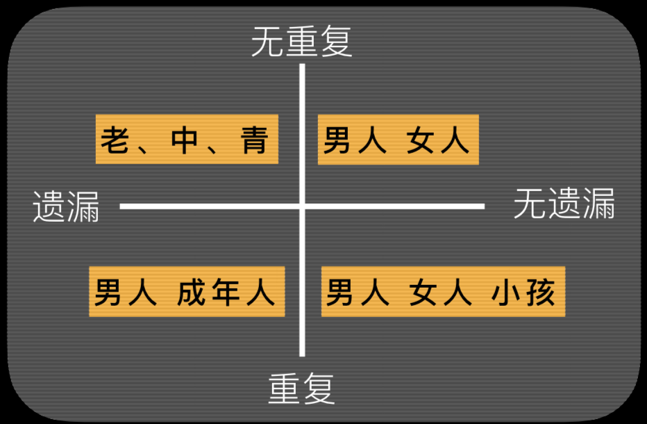
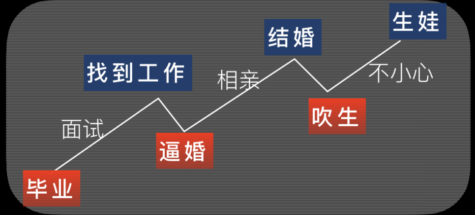
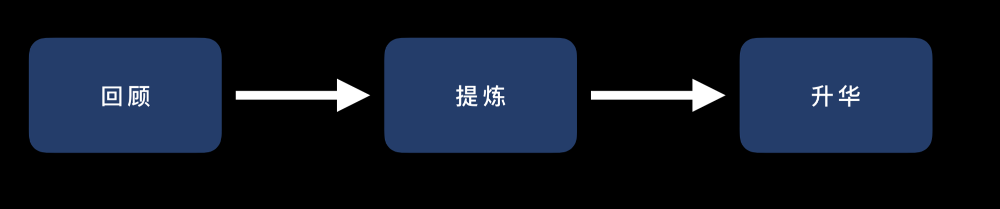
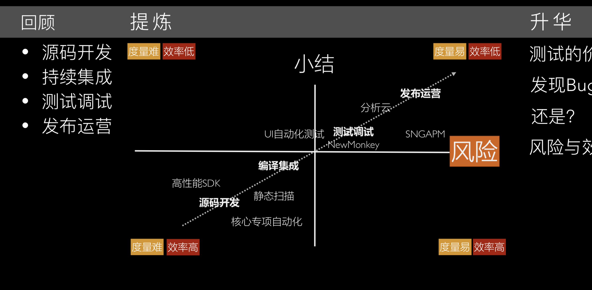

- **TAG:** [[PPT]] [[分享]]
- 收获干货系列
	- 你也有这样的问题
		- 关于内容 - 90%的时间都在打磨内容
			- Level 1 没废话
				- 废话的后果是什么?
					- 讲不完
					- 听众会捉急
					- 下午场的会“犯困”
				- 废话举例
					- 废话1，PPT照着读，一字不漏
					  collapsed:: true
						- 解决方法
							-
							  1. 内容有逻辑
							-
							  2. 闭目试讲
							-
							  3. 只讲重点
					- 废话2，能看明白的就别花时间说
					  collapsed:: true
						- 解决办法:
							-
							  1. 讲重点
							-
							  2. 换成“提问”
					- 废话3，知道的常识不要花时间说
					  collapsed:: true
						- 解决办法:
							-
							  1. 什么人会是你的受众
							-
							  2. 一图胜千言，“这就是流媒体”
					- 废话深水区，枯燥地说概念
					  collapsed:: true
						- 解决办法:
							-
							  1. 案例引出概念与原理
							-
							  2. 结合“工作”中的案例，而非“hello world”的案例
					- 废话深水区，非核心内容的断舍离
					  collapsed:: true
						- 解决办法:
							- 不舍得，就留着PPT，讲的时候直接跳过（听众可以线下交流）
				- 重点
					- 断舍离，讲重点
					- 实际案例才是好故事
					- 有逻辑，心中有图
			- Level 2 记得住
				- 记不住的后果是什么?
					- 听众记不住
					- 自己就会记不住
					- 紧张，看PPT
					- “给予”这个目标没有达成
				- 不记得 举例
					- 不记得1，没内在逻辑结构
					  collapsed:: true
						- 解决办法:
							-
							  1. 你分享的目标是什么?
								- 造句: 我将在 _ 分钟内，通过 _ 个(故事/案例/观点/ 要点)，让听众(理解/欣赏/赞同/反思/⻅识/领 悟)一个(道理/事实/现象/规律/好技术):那就 是) _
									- 💡有点类似[[缆车句]]
					- 不记得2，缺乏开关⻔操作
					  collapsed:: true
						- 解决办法，如何关好⻔?
							-
							  1. 重复
							-
							  2. 升华
					- 不记得3，到哪里了!
					  collapsed:: true
						- 解决方案:
							-
							  1. 开⻔来贯穿，重复出现“开⻔”
							-
							  2. 标题提示， 微服务与单体的先后思考:浏览器和前端技术
				- 重点
					- 逻辑:
						- 时间(因果)
						- 重要性
						- 内在结构
					- 加上开关⻔
					- 珍重你的“标题”，电梯法则
			- Level 3 有启发
				- 没启发的后果是什么?
					- 听众没启发
					- 对你肯定也没有启发，去QCon，你的收益是什么?!
				- 启发的机会，把介绍与灌输变成提个好问题
					- 解决办法:
						-
						  collapsed:: true
						  1. 提个好问题，比How更好的是why
							- 你认为一个适应世界的新操作系统 应该有什么特征，为什么?
							- 安全是其中一个特征，从什么维度 去革新它，为什么?
						-
						  2. 案例+结构化思维去回答它
			- 比去单纯“给予”的价值，“启发”的价值更大
		- 关于设计 - 不要太过分就好
			-
			  1. 浅色调下不要用浅色调的文字
			-
			  2. 要重点说的图和问题，可以放大或者 红框突出
		-
- 没有思维导图等于没有思维
	- 惊喜期:认识思维导图的重要性
		- 写得快
			- 看⼤大局⽽而⾮非细节
			- 左右脑切换的效率
		- 记得住
			- ⾃自⼰己能记得住
			- 听众能记得住
	- 失望期:暴露⾃己缺乏想法
		- 只是引导⽽已
			- 思维导图在引导你探寻事物的内在关联
			- 分类:
				- MECE原则
					- {:height 252, :width 383}
				- 分类进阶:有价值的分类
					- 分类应该给⼈人启发
			- 因果:
				- ⼀波三折
					- {:height 191, :width 380}
				- 推演进阶:惊喜+细节
					- 细节:
						- 数据与图表
						- 代码
						- 流程图
					- 惊喜:
						- 根因的探索
	- 转化期:把思维导图转化成ppt
		- 开关门:
			- 开⻔描述背景，用问题引导思考
				- 开⻔⽤问题引导，设计洞见体验
					- 举例
						- 为什么⼀次让你肾上腺素激增300%的分享，但收获却可以 寥寥⽆几?
						- 当我们在测试⼀个产品的时候，究竟想获得什么?
						- 如果假的东⻄做得很真，那么追求真究竟是为了什么?
			- ⼩关⻔回顾，⼤关⻔升华
				- ⼤关⻔的升华
					- 
					- 回顾 ->提炼 -> 升华
					- 举例
						- 
		- 重点在哪⾥?
			- 从空姐效应到F.A.B
		-