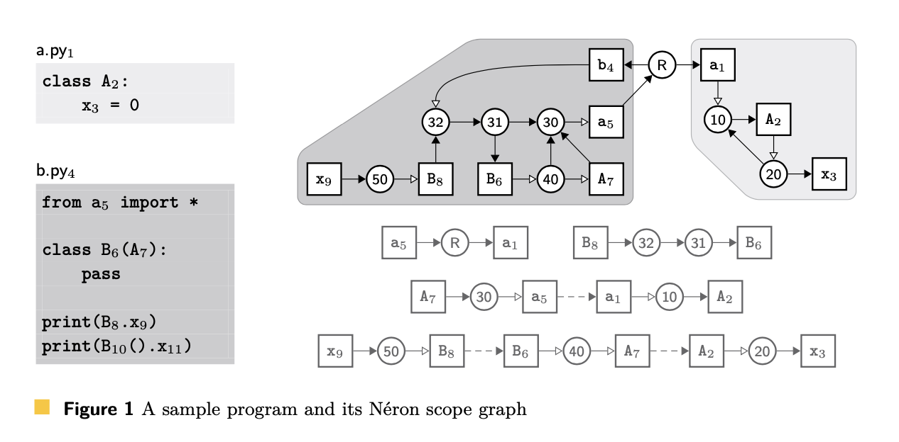
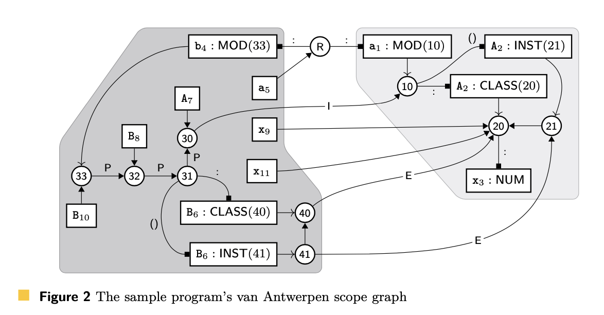
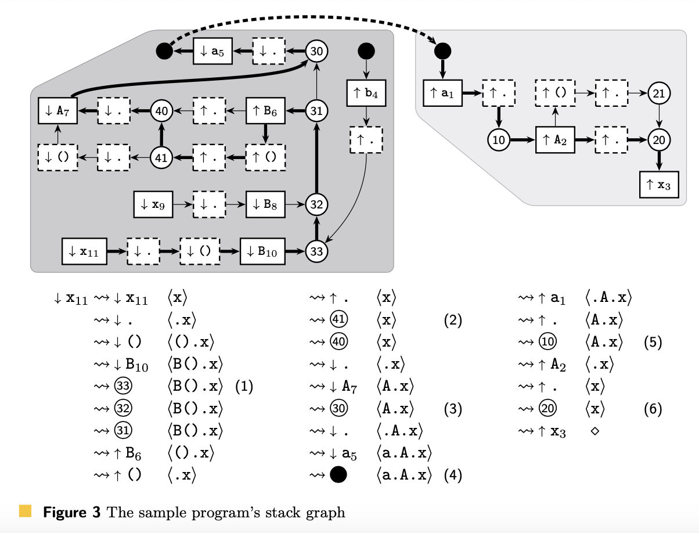
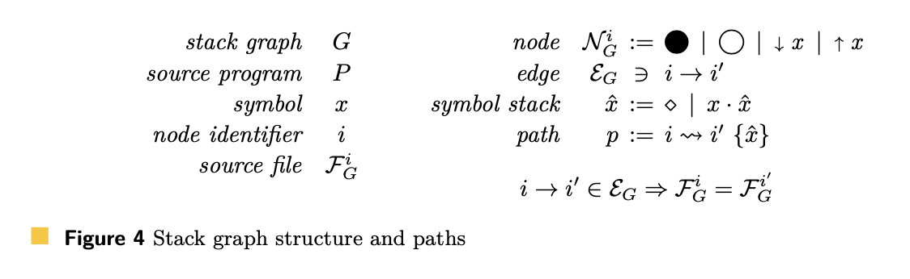
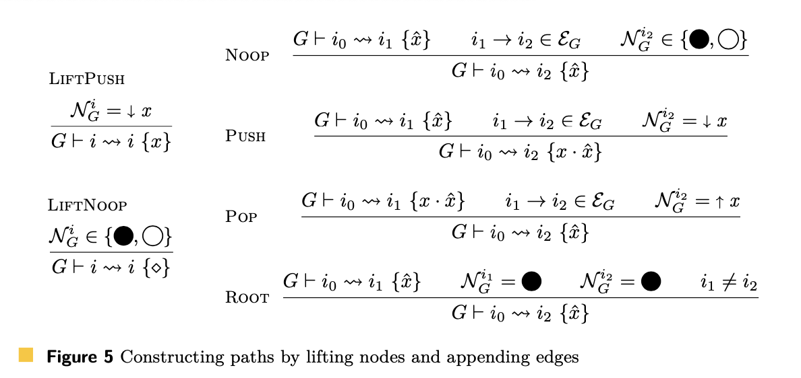

- **Tags**: [[Code Intelligence]] [[Code Navigation]] [[tree-sitter]]
-
- Stack graphs（Name resolution at scale）
	- 来源：
		- https://arxiv.org/pdf/2211.01224.pdf
	- abstact
		- 我们提出了堆栈图，这是Visser等人的范围图框架的扩展。堆栈图支持GitHub的精确代码导航，允许用户在存储库内部和跨存储库导航名称绑定引用。与作用域图一样，堆栈图在图结构中编码有关程序的名称绑定信息，其中路径表示有效的名称绑定。然后通过简单的寻路搜索实现对其定义的引用解析。
		- GitHub拥有数百万个存储库，包含总代码数pb，以数百种不同的编程语言实现，每分钟接收数千次推送。
			- 为了支持这种规模，我们确保图的构造和寻路判断是文件增量的:
				- 对于每个源文件，我们创建一个孤立的子图，而不需要了解程序中的任何其他文件，也不需要看到程序中的任何其他文件。
				- 这让我们消除了重新分析我们已经看到的文件版本的存储和计算成本。
				- 由于大多数提交只更改存储库中文件的一小部分，因此这大大降低了为大型、频繁更改的存储库建立索引的操作成本。
		- 为了处理面向类型的名称查找(需要“暂停”当前查找以解析另一个名称)，我们的名称解析算法维护当前暂停(但仍然挂起)查找的堆栈。
		- 堆栈图可以通过对程序源代码的纯语法分析来构建，使用一种新的声明式图构建语言。
			- 这意味着我们可以为每个存储库提取名称绑定信息，而无需任何包配置，也无需调用任意的、不受信任的、特定于包的构建过程。
	- 1. Introduction
		- 代码编辑器长期以来一直提供诸如代码导航之类的生产力特性，它允许用户查看和导航代码中的结构关系，特别是代码中的名称所引用的实体。
		- 这些特性在像GitHub这样的软件工厂平台上同样有用。
		- 然而，大型软件工厂必须在多个方向上支持完全不同数量级的规模：
			- 存储代码的总量;
			- 一段时间内收到的更改数量;
			- 需要查询历史版本的代码;
			- 同时进行查询的用户数量;
			- 以及支持的编程语言的数量。
		- 我们已经开发了堆栈图来解决这些限制。
			- 堆栈图建立在Visser等人的作用域图框架[17]之上，该框架使用图形符号对编程语言的名称绑定规则进行编码。
				- 与作用域图一样，程序中的每个名称绑定都由相应图中的路径表示。
				- 与作用域图不同，我们的寻路算法维护一个挂起查询堆栈(因此得名)，允许名称绑定依赖于其他中间名称绑定的结果。
			- 堆栈图是文件增量的，这意味着源程序中的每个文件都由一个不相交的子图表示，它们之间没有边交叉。(在查询时创建特殊的虚拟边，以便在文件之间交叉。)
			- 我们可以单独构造每个文件的子图，而无需检查程序中的任何其他文件。
				- 这让我们可以很容易地检测和重用我们已经看到和分析过的文件版本的结果。
				- 由于项目历史中的大多数提交更改了项目中的一小部分文件，因此这大大降低了提供此服务的计算和存储成本。
	- 2. 背景和历史视角
		- 我们从2017年开始研究如何最好地将代码导航功能添加到GitHub。
		- 代码导航在本地编辑器中广泛可用，因此一个吸引人的可能方法是采用任何支持本地编辑器解决方案的技术，并在必要时将其移植到我们的生产网页服务器环境中运行。
			- 然而，与软件工厂（指Github）相比，本地编辑器中的代码导航体验有明显的不同。
				- 与本地编辑器不同，在本地编辑器中，只有单个用户查看单个项目(主要是单个项目代码的当前版本)并与之交互，软件工厂必须支持无限数量的用户同时查看锻造上托管的任何代码的任何历史版本。
				- 此外，除了那些编写和维护代码的用户外，我们还必须支持那些正在探索和浏览代码的用户。
					- 这些探索者经常在代码编写几个月或几年之后查看代码。
					- 这意味着我们必须保持代码导航数据的可用性，并且可以随时查询;或者确保我们可以(快速)根据需求重新生成数据，以响应未来的用户查询。
					- 这导致索引时间与查询时间之间有一个明确的区别，
						- 索引时间是用户将程序或库的新快照“推送”到锻造站的时间，
						- 查询时间是（可能不同的）用户在未来某个时点想要查看或探索那个快照的时间。
		- 我们对索引和查询阶段有着雄心勃勃但冲突的延迟目标。
			- 我们最重要的目标是最小化用户执行代码导航查询和我们在他们的浏览器中显示查询结果之间的延迟[9]。为了实现这一目标，我们必须在索引时间预先计算一些信息。
			- 也就是说，我们不想做过多的预计算工作，以便在每次推送后快速提供代码导航，并且我们不会浪费时间预计算从未被查看的存储库或提交的代码导航数据。
		- 我们的规模也带来了独特的挑战。最明显的是代码的体量：GitHub保存了数PB的代码历史，并且每分钟都接收到数千个新的代码快照。
			- 我们的框架必须是增量的，跳过重新分析我们已经看过的代码的成本，这是至关重要的。
			- 幸运的是，每个项目的历史大部分是冗余的，大多数提交只改变了一小部分文件。
				- 因此，我们特别倾向于文件增量分析，我们可以在索引时间独立分析每个源文件，而无需检查（或访问）项目中的其他文件。
				- [[git]]使用的Merkle树[7]数据模型为每个文件版本提供了一个独特的blob标识符，这只取决于文件的内容。
					- 因为文件的标识符在分析开始之前就可用，我们可以跳过冗余的文件增量工作的存储和计算成本。
		- 最后，GitHub托管了大量编程语言编写的代码。我们希望所有这些语言都能进行代码导航。
			- 对于较少流行语言的长尾支持，GitHub工程师永远不会有成本效益的实施方法。
			- 但必须有一条路径供某人（无论是GitHub工程师还是外部语言社区的成员）为所有存在并正在使用的编程语言添加支持。
		- 正如我们在第5部分详述的，现有的本地编辑器代码导航解决方案不能满足这些限制。在研究现有的学术工作是否能帮助解决这个问题时，我们发现了作用域图([[Scope Graph]])框架[17]，它引入了一种新颖且直观的方法，用图结构编码编程语言的名称绑定语义。
			- 这似乎可能满足我们的语言支持目标：所有特定于语言的逻辑都将隔离到图构建过程中，所有查询都会通过一个在该图结构上操作的独立于语言的算法进行。
			- 然而，我们很快发现，按照最初的描述，作用域图无法满足我们的规模要求。在本节的其余部分，我们将使用一个简单的Python程序作为运行示例，探讨原因。
	- 2.1 Néron scope graphs
		- 
		- 圆形节点表示作用域，
		- 矩形节点表示定义和引用
		- 边（Edge）
			- 将作用域连接到该作用域中定义的每个符号，
			- 并将每个引用连接到应该解析该符号的作用域。
		- 一些说明
			- 作用域R是一个根节点，代表所有Python模块所属的全局命名空间
			- 而a1和b4是在两个文件中定义的模块的定义。
			- 作用域20包含类A的类成员，而从20到x3的边表明x是这些类成员之一。
			- 作用域50代表通过成员访问运算符在第一个print声明中可用的名称
			- 而从x9到50的边表明引用必须相对于这些名称进行解析。
		- 一些说明
			- 作用域之间的边表示嵌套。
				- 例如，Python模块中的顶级定义是顺序评估的，每个名称只在其定义被评估后才可见。
					- 这通过连接作用域30、31和32的边进行建模，这些作用域分别代表在import语句、类定义和第一个print语句之后立即可见的名称。
				- 作用域40包含类B的类成员；它和30之间的边模型了类体内的引用如何可以引用包含词法作用域中的定义。
			- 开放箭头边代表“导入（imports）”，使命名作用域（named scope）的内容在其他地方可用。
				- 例如，40和A7之间的边指定B继承了A的所有类成员，而A2和20之间的边指定作用域20包含类A的类成员。
		- 一些说明
			- 我们还展示了正确解析引用x9到其定义x3的名称绑定路径。
				- 这需要通过导入边解析几个中间引用：
					- 解析B8到类B的定义；
					- A7到其超类；
					- a5到定义该超类的模块。
		- 重要的是，Néron作用域图可以根据每个文件的阴影部分划分为不相交的子图。
			- 除了根节点（这是一个跨所有文件共享的单个节点），每个节点都属于某个文件的子图。
			- 每条边都连接两个属于同一文件的节点，或者连接一个节点到共享的根节点。
			- 在**查询**时，我们必须将作用域图作为一个整体来考虑，因为名称绑定路径可以从一个子图跨到另一个子图。
			- 然而，我们可以在**索引**时间构建每个文件的子图，而无需考虑程序中任何其他文件的内容。
			- 因此，Néron作用域图的构建正好以我们需要的方式进行**文件增量**。
	- 2.2 Van Antwerpen scope graphs
		- 不幸的是，Néron作用域图并不能让我们解析x11，因为它依赖于类型依赖的名称解析（type-dependent name resolution）。
			- 要解析x11，我们必须知道我们从调用B10得到的返回类型，这样我们才能在返回类型的作用域中解析引用。
			- 返回类型将取决于B10解析到什么样的实体，这个我们事先并不知道。
				- 在这个特定的例子中，它解析为一个类定义，所以返回类型是该类的一个实例。
				- 但是它可能解析为一个函数（或任何其他“可调用”实体），由函数体定义的任意返回类型。
		- Van Antwerpen等人[15,13]扩展了作用域图的判断，以支持这种类型的查找。图2显示了我们的示例程序使用这些修改的判断的作用域图。
			- 
		- 我们使用方头边将每个作用域连接到该作用域中的定义。
			- 这些边被标记以指示定义的种类：
				- a : 边 指定在作用域中定义的符号的类型，
				- 而 a () 边 指定在作用域中定义的可调用符号的返回类型。
		- 对于Python类，
			- 我们需要两个标签的边，
				- 因为它们既可以通过名称引用（得到类本身），
				- 也可以被调用（得到类的实例）。
			- 同样，我们为每个类有两个关联的作用域：
				- 一个（20和40）用于类成员，
				- 一个（21和41）用于实例成员。
				- 每对作用域通过一条边连接，模拟类成员也作为实例成员可用的方式。
		- 在van Antwerpen的作用域图中，有路径解析x9和x11到定义x3。
			- 然而，编码这些名称绑定的路径（x9 → 20 → x3 和 x11 → 20 → x3）比我们预期的要短，
			- 因为它们并没有直接编码所有需要的中间查找。
				- 这些中间查找确实发生了，但时间点不同。
					- 在Néron作用域图中，有导入边连接30到a5和a1到10，我们在查询时懒惰地跟踪它们。
					- 在van Antwerpen的作用域图中，我们在图构建时间积极地执行这些中间查找。
						- 当我们在源代码中遇到导入语句时，我们立即解析a5引用。
							- 这样做会将我们带到a1和其连接的作用域10，就像在Néron作用域图中一样。
						- 然后，我们将这个查找结果持久化到图结构中，作为直接连接30和10的I边。
						- 我们执行（并持久化）类似的构建时间查找B的超类引用A7，以及类型引用B8和B10。
		- 虽然我们已经获得了执行类型依赖查找的能力，但我们失去了文件增量性。
			- 积极的中间查找产生的边跨越了文件边界，违反了Néron作用域图的不相交性质。
			- 这种违规并不是表面上的；它强调每个中间查找可能依赖于程序中的任何其他文件。
			- 我们不能完全单独地分析每个文件，因为我们无法预先知道我们可能需要检查哪些其他文件。
			- 更糟糕的是，对其他文件的未来更新可能会使我们创建的子图失效。
				- 在病态情况下，对一个文件的更改可能需要我们为整个程序重新生成作用域图。
	- 3. Stack graphs
		- 堆栈图支持van Antwerpen作用域图的高级类型依赖查找。它们也保留了Néron作用域图的文件增量性，通过在查询时间懒惰地执行中间查找。
			- 我们的关键洞见是在名称解析算法中维护一个当前挂起的中间查找的显式堆栈。
		- 
		- 图3显示了我们示例程序的堆栈图。
			- 不再有共享的单例根节点；
			- 图中可以包含多个根节点，它们由实心圆表示。
			- 定义和引用节点有实线边框。
			- 具有虚线边框的节点是push和pop节点；
				- 我们将在下文中看到它们如何启用类型依赖查找。
				- 我们添加箭头来明确区分定义和pop节点（↑）与引用和push节点（↓）。
		- 我们还突出显示了将x11解析为x3的名称绑定路径，并跟踪该路径的发现过程。
			- 我们从x11到自身的“空”路径开始。
			- 每一步，我们都在路径中添加一个边，并显示路径的当前前沿和当前挂起的查找堆栈。
			- 这个堆栈包含了程序标识符（例如x）表示我们需要解析的名称，以及运算符（例如.）表示解析的定义将如何被使用。
			- 每当我们遇到引用或push节点时，我们将节点的符号预置到堆栈中。
			- 每当我们遇到定义或pop节点时，我们验证堆栈是否以节点的符号开始，并从堆栈中移除它。
			- 最终的名称绑定路径在定义节点结束，并且堆栈为空，表示没有更多的挂起查找，名称绑定路径是完整的。
		- 有几个值得关注的步骤被突出显示。
			- 在步骤(1)中，我们已经用正在解析的完整表达式的表示种下了堆栈。
				- 堆栈的顶部指定我们必须执行的第一个中间查找是解析B10。
				- 路径的前沿指示这个初始查找将在作用域33的上下文中执行，这表示在模块结束时可见的名称。
			- 在步骤(2)中，我们已经解析了B10，并且刚刚弹出了()和.运算符符号来确定当我们调用其定义并对结果执行成员访问时会发生什么。
				- 堆栈仍然包含x，将在接下来被解析。
				- 路径的前沿是41，表明x11将作为B的实例成员被解析。
				- 下一条边将我们带到40，这让我们可以尝试将x11作为类成员解析，
					- 记住类的实例成员包括它的所有类成员。
			- 在步骤(3)中，我们遵循了模拟类继承的边。这样做将更多的符号推到堆栈上，表明我们可能会在A的继承类成员中找到x。
				- 我们的下一步是在路径前沿——作用域30的上下文中解析A7，
					- 这代表了在B的类定义之前立即可见的名称。
			- 在步骤(4)中，我们遵循了表示导入语句的边。堆栈现在描述了我们当前正在查找的任何符号如何可能从模块a导入。
				- 路径的前沿是一个根节点。
					- 根节点是名称绑定路径可以从一个文件跨越到另一个文件的唯一方式：
						- 当我们遇到一个根节点时，我们可以在任何文件中添加一个虚拟边（图3中的虚线边）到任何其他根节点。
			- 在步骤(5)中，我们已经将a5解析为作用域10，这代表了导入模块的定义。
			- 在步骤(6)中，我们已经将A7解析为作用域20，它包含了类A的类成员。
				- 从那里开始，剩下的就是将x11解析为它的定义，x3。
		- 堆栈图的正式定义如图4所示。
			- 
			- 堆栈图G是源程序P的表示，由一组源文件组成。
			- 每个源文件可以解析为一组语法节点。
			- 那些语法节点的一部分代表定义，而不同（不一定是不相交）的语法节点子集代表引用。
			- 符号x是源语言的标识符，代表程序中实体的（部分）名称，或者是像.或()这样的运算符符号。
			- 堆栈图中的每个节点都有一个唯一的节点标识符，并且必须是以下之一：
				- 根节点（实心圆节点），
				- 作用域节点（空心圆节点），
				- push符号节点↓x，
				- 或pop符号节点↑x。
			- NGi表示G中具有节点标识符i的节点。
			- 每个节点只属于一个源文件，标记为FGi。
			- 某些节点属于该文件中的特定语法节点。
				- 如果pop符号节点属于定义的语法节点，那么它就是一个定义节点。
				- 如果push符号节点属于引用的语法节点，那么它就是一个引用。
				- EG表示堆栈图G中的边集合。
					- 堆栈图中的每条边e都是有向的，连接源节点i到汇节点i'。
					- 边只能连接属于同一文件的节点。
			- 判断G ⊢ p表示p是堆栈图G中的有效路径。
				- 路径由起始节点i、结束节点i'和符号堆栈xˆ组成。
				- 如果路径的起始节点是引用节点，结束节点是定义节点，且符号堆栈为空，则路径是完整的。
				- 源程序P中的每个名称绑定都由相应堆栈图G中的完整路径表示。
		- 路径是根据图5中的规则构造的。
			- 
			- 空路径是没有边的路径。它是通过提升(lifting)堆栈图节点创建的。
			- Push符号节点“种子”路径的符号堆栈。
			- Pop符号节点不能被提升为路径。
			- 所有其他节点都会导致一个空的符号堆栈的空路径。
			- 我们可以通过追加任何其起始节点与路径结束节点相同的边来扩展路径。
			- 路径的符号堆栈可能会改变，这取决于边的结束节点。
			- 根节点和作用域节点是“无操作(noops)”，它们不改变符号堆栈。
			- Push符号节点将一个元素前置到符号堆栈上。
			- Pop符号节点充当了“守卫”，要求符号堆栈的顶部匹配节点的符号。
				- 这个符号从符号堆栈中移除。
					- （这就解释了为什么pop符号节点不能被提升为空路径，因为还没有符号堆栈来满足这个约束条件。）
			- 如果路径在根节点结束，我们可以立即通过一个虚拟边将它扩展到堆栈图中的任何其他根节点。
				- （这是路径从一个文件跨越到另一个文件的唯一方式。）
		- 根据这些路径构造的判断，我们可以实现一个跳转到定义的算法：
			- 给定一个源程序和程序中的一个引用，我们想要找到引用解析到的所有定义。
			- 首先，我们构造程序的堆栈图。
			- 然后我们对图进行广度优先搜索，维护一组待处理的路径，从提升引用节点得到的空路径开始。
			- 我们使用固定点循环，通过追加（可能是虚拟的）边到现有的路径来找到新的待处理的路径。在追加边时，我们必须满足图5中路径构造判断的约束，并且要小心检测循环。每当我们遇到一个完整的路径，它的结束节点就标识了引用解析到的一个定义。
		-
		-