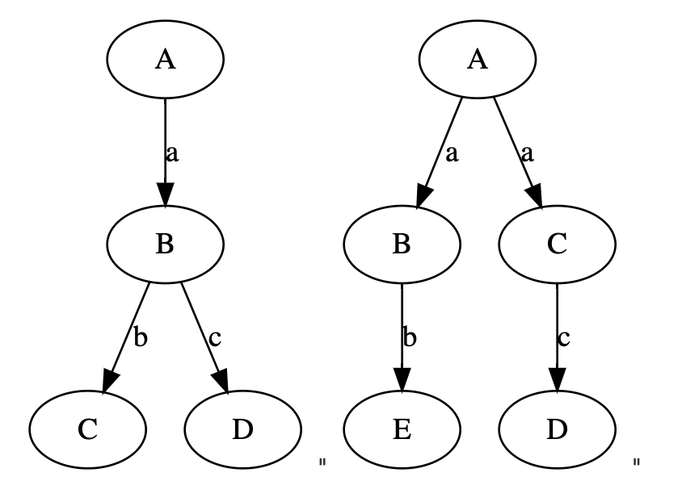
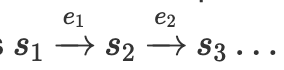
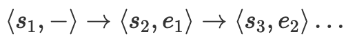

- https://pron.github.io/posts/tlaplus_part2
  collapsed:: true
	- 在第一部分中，我们讨论了TLA+设计的动机、用途以及指导原则。现在，我们将转向研究这种语言的细节。我们将从用于描述计算的静态状态的语言元素开始，即程序的数据和数据操作，这些是计算的基本构建块。我们将这部分TLA+称为数据逻辑。
	- ## **使用数学描述数据和操作**
		- TLA+采用行动的时序逻辑（TLA），来描述计算作为一个离散动态系统，这与使用常微分方程描述连续系统类似。就像常微分方程定义在一个状态空间上，其中变量可以在实数R中取值一样。TLA公式的状态空间是某种逻辑结构（我们将准确了解这意味着什么），该结构包含了TLA变量在任何时间点可以取得的值。在TLA+中，集合构成了这种结构，而描述该结构中元素的逻辑理论基于一阶逻辑和策梅洛-弗兰克尔集合论（ZFC）——普通数学的标准形式。这意味着我们将使用形式数学来描述我们的软件，或者，就目前而言，仅描述它们的数据结构和基本操作。“形式”简单地意味着在一个系统（一个“形式系统”或一个“形式体系”）中工作，该系统具有精确的规则，包括句法规则——如何构建表达式，以及语义规则——表达式的含义。
		- TLA+的这个静态组成部分占据了TLA+语言的大部分，如果你对规格语言和证明助手不熟悉，理解它将教会你在计算机上进行形式数学的所有基本知识。但从理论角度看，这是TLA+中最不有趣且最不重要的部分（TLA，动态组成部分是有趣且必需的部分），尽管从设计和可用性的角度看它很重要，因为它被设计得尽可能简单和熟悉。然而，这也是TLA+中最有争议的方面。这是因为Lamport选择了一个无类型的数学形式主义，而大多数规格语言选择了一个有类型的形式主义。
		- 除了关于正确性或生产力等指标的有争议的声明（无论是辩论的哪一方）之外，大多数人都同意编程语言中的类型具有以下优势：它们帮助编译器（特别是AOT编译器）生成高效的机器代码，并通过提供某种形式的最新文档来帮助组织代码，鼓励对子程序进行合理的关注。它们还辅助工具进行自动完成和自动重构。然而，这些较不具争议的优势对于像TLA+这样的规格语言来说并不适用，因为它不会被编译成可执行文件，而且由于规格说明的长度比程序代码短得多，因此几乎不会从旨在帮助大型程序员团队维护大型代码库的功能中受益。因此，规格语言——或一般的数学——在类型化和无类型形式主义之间的权衡与编程语言的权衡不同，这一点在Lamport和Larry Paulson（证明助手Isabelle的作者）共同且平衡的论文中有很好的覆盖，论文题为《您的规格语言应该是类型化的吗？》
		- Lamport的选择是由他对TLA+预期受众的简单性愿望（正如他所看到的）推动的，即工程师，可能还因为他作为一名经典数学家的背景。集合论具有熟悉而强大的优势，Lamport表示，他确实相信在实践中对工程师来说使用集合论来规定系统更简单。
		- 其他规格语言可能需要类型系统，因为它们用途不仅仅是软件或硬件规格的定义。Lamport写道：
			- 没有充分的理由去写一个像 {1, {2,3}} 这样的集合，而且使其无法写出似乎是个好主意。然而，我发现没有简单的方法可以做到在不同时也使有用的集合无法写出的情况下，使这样的集合无法写出。这意味着，Coq 不简单……这并不意味着 Coq 有什么问题；它只是意味着它不适用于普通工程师。例如，如果你查看一本数学文本，你可能会发现在单一段落中“+”符号被用来表示几个不同的事物。要在 TLA+ 中形式化那个数学，你必须为那些不同的含义使用不同的符号。这会让数学家感到疯狂。Coq 允许你对所有这些使用相同的符号。因此，正如 George Gonthier 将告诉你的，你需要像 Coq 这样的东西来形式化严肃的数学。由于系统构建者和算法设计师不使用那种数学，他们不需要处理像 Coq 这样的语言的复杂性。
		- TLA+ 的静态组成部分是 Lamport 称之为 ZFM 的形式集合论，ZF 代表数学中的 ZF，他在这篇短文中解释了这一点（连同与类型化形式主义的比较）。
		- 逻辑学家可能会发现 TLA+ 的形式主义太普通；甚至可能觉得枯燥。数学家 G.H. Hardy 曾经写道：“‘真正的’数学家的‘真正的’数学……几乎完全是‘无用的’……是那些乏味且基础的部分……不管好坏，都是这些起作用。”但 TLA+ 不是一个用于探索数学秘密或新颖逻辑的工具，而是一个供工程师们用来指定“有效工作”的系统的工具。就普通数学而言，TLA+ 是一个清晰、简单且强大的形式主义，具有方便自然的语法。
		- TLA+ 使用形式数学来指定软件系统。正如你将看到的，它对程序员来说并不像一开始听起来那么可怕。编程是将非正式要求转化为软件的低级形式规格——程序。如果你能够做到这一点，如果你理解为什么你的程序可以工作，或者至少，它应该如何工作，你也可以编写一个高级的数学规格。这只需要一些练习。在《指定系统》的引言中，Lamport写道：
			- 我们使用的数学比你从小接触的数学更加形式化......大多数数学家和科学家编写的数学并不是真正精确的。它在小范围内精确，但在大范围内不精确。每个方程都是一个精确的声明，但你必须阅读伴随的文字才能理解方程之间是如何相关的，以及定理的确切含义是什么。逻辑学家已经开发出了消除这些文字并使数学完全形式化的方法，因此，完全精确......[M]数学家和科学家认为没有文字的形式数学是冗长且乏味的。他们错了。普通数学可以在一个精确的、完全形式化的语言中紧凑地表达。在 DifferentialEquations 模块中定义一个任意微分方程的解只需要大约二十几行......但是很少有规格需要如此复杂的数学。大多数只需要简单应用几个标准的数学概念。
		- 我必须再次提醒你，这不是一个教程，而且覆盖的许多材料并不是编写良好的 TLA+ 规格所必需的。虽然我会介绍基础知识，并希望这篇文章中的示例能让你体验到形式数学规格是什么，以及它与编程的相似之处，但我的重点是 TLA+ 背后的数学理论和设计原则。对于 TLA+ 的好的动手教程，请参考我在第一部分中提到的那些。
	- ## **什么是逻辑？**
		- TLA+ 使用逻辑来指定算法及其数据结构。对于那些数学逻辑可能有些生疏的人来说，这里是一个复习。
		- ### 逻辑基础
			- 形式逻辑、符号逻辑或数学逻辑是一种形式系统或形式主义。它是一种精确的语言，用于讨论事物，或者至少是易于精确的事物。像任何语言一样，它具有语法，可以被视为形成句子的语法规则，以及语义或含义——语言讨论的内容。但是，作为精确的语言，它具有精确的语法和精确的语义。语法定义了如何形成语言中合法（格式良好）表达式的规则，语义通过将这些表达式与精确定义的数学对象连接起来来定义这些表达式的含义。语义使我们能确切地知道语言中任何短语的含义，语法使我们能够以这样一种方式操纵短语，即我们确切地知道其对含义的影响。
			- 逻辑的语法由一些内置的连接词组成——通常是∧表示合取（“和”），∨表示析取（“或”），¬或有时∼表示否定（“不”），⇒或→表示蕴含（“如果-那么”），≡或⇔表示等价（当且仅当，或 iff），一组变量（x，y，...）——我们用来指代对象的名称——以及一个签名，它是一组具有特定元数（符号接受的参数数量）的符号，如 5（0元），=（2元），<（2元），*（2元）或 -（一元负号）。例如，表达式 x∗5<−y∧¬(x<5) 是我举例的逻辑中的一个合法表达式。逻辑还可以有量词，最常见的是全称量词∀（“对于所有”）和存在量词∃（“存在”）。量词通常绑定变量。例如，∀x…，意味着“对于所有这样的对象 x ...”，或∃x…，意味着“存在这样的对象 x ...”。
			- 一个格式良好的表达式称为术语（语言的术语），因此语法通常被认为是所有术语的集合——语言中所有可能的格式良好的表达式。公式是一个布尔值表达式，即一个要么为真要么为假的表达式。在公式中未绑定出现的变量称为自由变量。没有自由变量的公式称为句子或封闭公式。
			- 逻辑也有一个结构，这是逻辑的论域——逻辑所讨论的内容——它为签名提供意义或语义。为逻辑分配一个特定结构称为解释。像 2 这样的 0元符号的含义通常称为常数，而高元符号的含义通常称为关系（例如，小于关系，<）或函数。变量的含义也由结构定义，尽管这里逻辑的“阶”很重要。我们稍后会讨论这个主题，但在一阶逻辑中，变量可以指结构定义的可能值的集合中的任何值；该集合被称为逻辑的宇宙。
			- 模型是语法和语义之间的关系：公式的模型是满足它的结构，即使公式为真的变量值的分配（真实是一个语义属性）。表示“满足”的通常符号是⊨。左边是使右边的公式为真的结构——公式的模型。例如，我们逻辑的结构可以是具有乘法、否定和小于关系的整数集。那么表达式 x<2 的模型可以是 x=−5。所有使公式 A 为真的模型的集合形成其正式语义，通常写作 [[A]]。我将通俗地称这些模型的集合——公式的语义——为公式的模型，并说 x<2 的模型是任何将小于 2 的数字分配给 x 的赋值，或者更简单地说，所有小于 2 的数字。我们可以说这个公式指定了所有小于二的数字。在所有解释下为真的公式被称为有效的，我们写作 ⊨A（左边没有结构）。公式 TRUE 在所有解释下都被满足，而公式 FALSE 则根本没有模型。
			- 各种逻辑运算符以特定方式与模型交互。对于 A∧B ，其模型是 A 的模型与 B 的模型的交集，即 [[A∧B]] = [[A]] ∩ [[B]]。对于 A∨B ，其模型是 A 的模型与 B 的模型的并集，即 [[A∨B]] = [[A]] ∪ [[B]]。对于 ¬A ，其模型是 A 的模型的补集，即 [[¬A]] = [[A]]^c。这些正是我们在维恩图中熟悉的逻辑运算符的定义。
			- 当我们使用逻辑时，我们通常在特定的逻辑理论中工作，该逻辑理论是一组被认为等同于 TRUE 的公式集，称为公理。一个理论的模型是满足该理论所有公理的结构；换句话说，理论描述或规定了一个模型。因此，逻辑通常不是用结构来定义的，而是用理论来定义的，这个理论随后描述了所有合适的结构。例如，皮亚诺公理就是描述自然数及其熟知的算术运算的逻辑理论。我们熟知的自然数及其算术运算，就是皮亚诺算术的一个模型。
			- 当然，一个逻辑公式，甚至整个逻辑理论，在不同的结构上可以有多种解释。例如，公式 x>2 在实数上的模型与在自然数上的模型不同。句子 ∃x.x>0∧∀y.y>0⇒y≥x 在整数上解释为真，但在实数上解释为假。
			- 逻辑通常还有一个演算系统，这是一个从其他表达式推导表达式的句法系统，如自然演绎。如果公式 C 可以通过从公式 A 和 B 应用有限次推理规则得出，我们写作 A, B⊢C，并说 A 和 B 证明了 C 或蕴含了 C，其中 A 和 B 是假设，C 是它们的结果。可证明性是语义真理概念的句法对应物。如果一个公式 A 仅由理论的公理蕴含，没有其他假设，我们写作 ⊢A，并说 A 是一个重言式。如果 ⊢A 而 A 不是一个公理，我们说 A 是一个定理。如果我们想证明定理 A 但还没有做到，我们称 A 为一个命题。
			- 根据大多数逻辑的公理，如果 A, B⊢C，那么 ⊢(A∧B)⇒C，反之亦然。即，A 和 B 蕴含或证明 C 当且仅当 A∧B 蕴含 C。
			- 有两个重要的公理塑造了逻辑的一般性质。第一个称为爆炸原理，它声明对于任何公式 A，⊢¬(A∧¬A)，或等价地 A⊢¬¬A。第二个称为排中律，它声明对于任何公式 A，⊢A∨¬A，或等价地，¬¬A⊢A。拥有这两个公理的逻辑称为经典逻辑或标准逻辑。具有爆炸原理但没有排中律的逻辑称为直觉逻辑或构造逻辑（在此逻辑中，如果 A 被知道不是假的，我们不能得出它必须是真的）。具有排中律但没有爆炸原理的逻辑称为悖论逻辑（在此逻辑中，如果 A 是真的，我们不能得出它可能也不是假的）。构造逻辑和悖论逻辑都有有趣且有用的应用。如果没有这两个公理，我们就没有办法关联否定和肯定的陈述，这相当于根本没有否定的逻辑。TLA+ 中使用的所有逻辑都是经典的。
			- 请注意，在经典逻辑中（但非经典逻辑中不是这样！），存在量词和全称量词可以通过彼此来定义：
				- ∃x.A ≡ ¬∀x.¬A
				  ∀x.A ≡ ¬∃x.¬A
				- 简而言之，我们说 ∃ ≡ ¬∀¬ 和 ∀ ≡ ¬∃¬。
			- 逻辑，就像所有语言一样，表达意义。但是逻辑陈述的意义并不总是完全通过其形式语义来捕捉。逻辑学家戈特洛布·弗雷格指出，逻辑陈述可能具有两种意义：意义和指称（后者有时也称为外延）。例如，句子 3>2 的语义值为 TRUE，因此指向值 TRUE。句子 2>1 也指向值 TRUE，因此与 3>2 等价。然而，这两个句子具有不同的意义，因为它们表达了不同的想法（一个关于 3 和 2 的关系，另一个关于 2 和 1）。意义和指称之间的区别是全面理解所有逻辑（实际上是所有语言）所需的关键哲学观察，并且某些非经典逻辑 — 特别是直觉逻辑 — 可以明确地指涉这两种意义（使用不同的等价概念，一种称为外延的，是关于指称/外延的等价，另一种称为内涵的，可以被视为关于意义的等价）。但我们只处理经典逻辑，所以这一重要的哲学观点没有实际意义。
		- ### 一阶逻辑与其他阶逻辑
			- 一阶逻辑（或称为 FOL）包含所有常规的逻辑连接词（∧, ¬ 等），以及全称量词 ∀ 和存在量词 ∃。在 FOL 中，变量可以代表宇宙中的简单值：如果宇宙是自然数，则变量——无论是自由的还是量化的，即绑定的——代表一个自然数。如果我们想要量化更丰富的结构，如自然数的集合、自然数的函数等，我们需要通过扩展我们的理论将它们加入到宇宙中。
			- 在二阶逻辑（或称为 SOL）中，一个变量可以代表宇宙中的一个元素或一组元素。将这组元素视为一个谓词比较容易；一个谓词 p(x) 为真当且仅当值 x 在集合 p 中。因此，虽然在 FOL 中所有的谓词必须是“常量”并在签名中给出，在 SOL 中我们可以量化它们，并且可以说，例如，∀1x.∃2p.∀1y.p(y)≡(y=x)（符号 ≡ 代表双向蕴含，即当且仅当，我使用下标来区分一阶和二阶量化；通常这种区分从上下文中就能明确），或用话语表达为，“对于任何 x，存在一个谓词 p，对于参数 y 为真当且仅当 y=x”。
			- 类似地，三阶逻辑允许我们量化值的集合的集合等。高阶逻辑，或称为 HOL，允许我们量化任何阶的变量，通常只在类型化的形式主义中使用。类型的最初概念是由伯特兰·罗素准确地创造出来以区分阶次：不同阶次的对象属于不同的类型，即，如果我们的“基础”值属于第一类型，则这些值的集合属于第二类型，集合的集合属于第三类型等。类型在语法上和语义上都具有重要意义：如果 x 和 y 属于不同的类型，那么表达式 x=y 不是假的，而是格式不正确的，意味着它根本不是一个合法的表达式。类似于我上面使用的下标，HOL 中的量词通过类型来区分；我们写 ∃x:T（而不是 ∃Tx），意味着“存在一个类型为 T 的 x”。
			- 逻辑中最重要的定理之一是，在一阶逻辑（仅限一阶逻辑！）中，语义真理和句法可证性是一致的，即 ⊢A 当且仅当 ⊨A，或者说，A 是重言式当且仅当它是有效的。换句话说，如果公式 A 有效——被所有解释（也满足理论的公理）满足——那么它有一个证明，反之亦然。类似地，A⊢B 当且仅当 [[A]]⊨B。这就是哥德尔的完备性定理。然而，请注意，这并不意味着一阶逻辑中的每个句子都可以被证明或反驳。如果你的理论足够丰富，总会有既不能被证明也不能被反驳的句子（在一阶逻辑的情况下，这意味着这样的理论将有多个模型，在某些模型中句子为真，在其他模型中为假）。这是另一个著名结果的后果，即哥德尔的第一不完备性定理。该定理不仅适用于一阶逻辑，而且适用于任何形式主义，因为它是停机定理的直接结果（尽管停机定理是几年后证明的）。
			- 由于 TLA+ 中的“静态”或数据逻辑和时间逻辑仅允许一阶公式，我们可以使用符号 ⊢ 来表示有效性和可证性（除非我们想特别讨论左侧的语义结构）。但是由于第一不完备性定理适用于 ZFC，因此并非每个 TLA+ 句子都可以被证明或反驳。
			- 由于 TLA+ 允许自由变量，我想指出在阅读包含蕴含（⇒）和自由变量的公式时可能会出现的混淆源：公式 x>4 ⇒ x>2 是一个定理，即 ⊢x>4 ⇒ x>2，并且所有对 x 的赋值都满足它，而 ∀x: x>4 ⇒ x>2 也是一个定理。另一方面，虽然 ∀x: x>2 ⇒ x>4 等价于 FALSE，即 ⊢¬(∀x: x>2 ⇒ x>4)，但是公式 x>2 ⇒ x>4 确实有一个模型：它被所有小于或等于2或大于4的数满足。这意味着我们必须知道我们是将 x>2 ⇒ x>4 视为一个命题——等同于询问它是否有效，或者被所有对 x 的赋值满足——在我们的案例中，这不是真的，或者不是，在这种情况下，它指定了一个模型。正如我们上面描述 A⇒B 的模型那样并不有趣，但从语义角度看，命题 ⊢A⇒B 是有意义的：⊢A⇒B 当且仅当 [[A]]⊆[[B]]。
			- 现在，请注意，一个一阶逻辑（FOL）公式的模型，例如 x>2，始终是来自宇宙的一组值（在这个例子中，是所有大于2的数字）。因此，一个FOL公式的模型始终是一个二阶对象。但是，如果一个公式的意义是一个集合，一个二阶对象，那么我们如何写一个通用的公理，例如 ⊢A∨¬A，其中A不代表一个具体的公式，而是任何公式？我们不能写 ∀A.A∨¬A，因为我们不能量化公式（正如我们刚才看到的，公式代表集合，或二阶值），也不能出于同样的原因将它们当作自由变量来处理。答案是我们不这么做。我们说这样的公理是一个公理模式，它指代逻辑中无数个公理，每个可能的公式A各一个。因此，用来写这种模式的语言不是逻辑本身，而是我们逻辑的元逻辑或元语言。
			- 从理论角度来看，这是可以的，但对于机械证明软件来说，这并不令人满意。在证明一个定理时，我们经常需要证明一些中间引理，我们希望能够陈述和证明可以在许多证明中重用的通用引理，这样的通用二阶引理可能非常有用。
			- 因此，一个解决方案是采用高阶逻辑。但保持逻辑为一阶在简单性、模型检查算法、普遍定理（如果我们知道一个公式是一阶的，更容易根据其句法结构陈述关于公式意义的定理）方面有一些优势——最后一个更适用于TLA，即TLA+的时间逻辑部分，我们将在接下来的部分中介绍。但结果表明，我们可以两者兼得。我们可以保持所有公式为一阶，但允许以 A⊢B 的形式编写二阶命题，这些命题本身不是公式（因此它们没有模型）。我们基本上提供了对元语言的访问。这是TLA+采用的解决方案，我们将在关于证明的部分后面看到。
			- 顺便提一下，因为我提到了模型检查，我想借此机会澄清关于模型检查器的某个可能的误解。模型检查器的名字来源于我们刚刚在逻辑上下文中学到的“模型”的定义。它是一个程序，接受一个逻辑结构的描述 M 和一个逻辑公式 φ，检查 M 是否是 φ 的一个模型，或者说 M⊨φ。
			- 除了一阶逻辑（FOL）的理论和实际优势外，它还有一些理论上的缺点。例如，一阶理论有非标准模型（比如，存在具有不可数多个数字的一阶皮亚诺公理的模型）。然而，鉴于TLA+的预期用途和受众，这根本不是一个问题。兰波特（Lamport）写道：“我当然不担心因为工程师实现了一个非标准的整数模型而发生错误。”
	- ## **逻辑公式和表达式**
		- 我们现在将开始学习TLA+的具体内容。如果你熟悉标准的数学符号，你会发现TLA+的语法大部分是直观且易于阅读的。然而，由于TLA+是完全形式化的，每一个表达式的含义都必须被精确定义，没有任何含糊或直觉的余地。这使得描述看起来有些过分执着，但正是这种精确性使得逻辑的机械分析成为可能。因为TLA+是无类型的，并试图模仿熟悉的非正式数学符号，尽管是以正式的方式，其细节对那些通常对证明助手感兴趣但习惯于使用类型化形式主义的人而言，可能具有特别的兴趣。
		- ### 逻辑连接词与量词
			- TLA+的静态数据逻辑是带有等式的一阶逻辑。逻辑常量是 TRUE 和 FALSE。我们使用熟悉的运算符：∧ 代表合取，∨ 代表析取，¬ 代表否定，⇒ 代表蕴含，以及 ≡ 代表等价。∧ 和 ∨ 的优先级相同，因此表达式 a∧b∨c 由于优先级不明确而是一个语法错误，需要使用括号来解决。蕴含的优先级更低，因此 A∧B⇒C 等同于 (A∧B)⇒C。
			- ∃ 和 ∀ 是常规的一阶存在量词和全称量词，用于引入绑定变量。在TLA+语法中，我们在量词后使用冒号 (:) 而不是更常见的单点，用来界定绑定变量的范围，并读作“使得”。例如：
				- ∀x: P(x)⇒∃y: R(x,y)
			- 量词绑定它们的变量在一个“尽可能远”的范围内，即直到一个闭合括号或当前表达式的末尾。因此，∀x: P(x)⇒∃x: Q(x) 是非法的，因为它被解析为 ∀x: (P(x)⇒∃x: Q(x))，因此存在量词引入了变量 x，而该变量已经绑定到全称量词。然而，(∀x: P(x))⇒∃x: Q(x) 是格式正确的。
			- 此外，TLA+还有一些受编程语言启发的特殊构造。构造
				- IF p THEN x ELSE y
			- 其中 p 是某个逻辑谓词，x 和 y 是值，如果 p 是 TRUE，则取值 x，否则取值 y。构造
				- CASE p1→e1 □ … □ pn→en □ OTHER→e
			- 等于某个 ei，该 ei 对应的 pi 为真，如果有的话，否则如果存在 OTHER 子句，则等于 e；如果不存在，表达式的值未定义（我们将在下一节详细说明这意味着什么）。更准确地说：
				- CASE p1→e1 □ … □ pn→en □ ¬(p1∨⋯∨pn)→e
			- 如果有多个谓词为真，表达式的值将是其中之一，但语言不承诺是哪一个。IF/THEN 和 CASE 都是根据我们稍后将看到的 CHOOSE 运算符定义的。
			- 由于在 TLA+ 中，算法和系统的规范是以公式的形式书写的，因此需要一些人体工程学技巧来编写长公式，使其易于阅读。Lamport 在《如何编写长公式》中设计了这样一种方案。它通过对连接词和析取词的对齐来代替括号，如下所示：
				- ```
				  \/ a
				  \/ b /\ c
				       /\ d
				  \/ e
				  ```
			- 其中 a, b, c 和 d 代表任意子公式。注意前缀连接词，它开始了析取和连接的列表。隐含的括号从开始该行的连接词后面的表达式延伸，直到在某个与开头连接词对齐的新行中遇到另一个同类型的连接词。因此，上述表示与以下表示意义相同（在 TLA+ 中也是允许的）：
				- (a)∨((b∧c)∧(d))∨(e)
			- 因此，尽管变量 x 被两个不同的量词绑定，以下形式仍然是良构的，
				- ```
				  \/ ∀ x : P(x)  
				  \/ ∃ x : Q(x)  
				  ```
			- 因为它被解析为
				- ( ∀ x : P(x) ) \\/ ( ∃ x : Q(x) )
		- ### CHOOSE运算符和未定义的含义
			- 在基本运算符的全景中，一个不可或缺的是 CHOOSE，即希尔伯特的ε（epsilon）运算符。
			- CHOOSE x: P(x) — 其中 P(x) 是可能包含 x 的某个谓词 — 等于逻辑讨论领域（即值的宇宙）中满足谓词 P 的某个值，如果存在的话。CHOOSE 遵循以下两条规则：
				- (∃x: P(x)) ≡ P(CHOOSE x: P(x))
				  (∀x: P(x) ≡ Q(x)) ⇒ (CHOOSE x: P(x)) = (CHOOSE x: Q(x))
			- 第一条规则展示了如何以 CHOOSE 来定义量词 ∃（因此也可以定义 ∀）；下一段将解释原因。
			- 第二条规则有时被称为右唯一性或外延性模式，意味着给定等效的谓词，CHOOSE 总是指定相同的值（尽管这个值不是由逻辑决定或可确定的）；尽管选择总是相同的，我们不知道也不关心它是什么，只知道它是满足谓词 P 的某个值。换句话说，CHOOSE 是确定性的，尽管具体选择不是预设的；这在新的 TLA+ 用户中是一个常见的误解。这必须如此，因为在数学中，e = e 对任何表达式 e 成立，因此，(CHOOSE x: P(x)) = (CHOOSE x: P(x)) 无论 P 是什么。
			- 如果没有任何值满足谓词 P，则 CHOOSE x: P(x) 的值是未定义的（*undefined*），这意味着它等于我们值的宇宙中的某个值（我们将在下一节遇到值，但可能的值包括 42、{3, {4, 5}} 或 "hello"），我们无法确定（即在逻辑中证明）。换句话说，“未定义”意味着“我们不知道也不关心。”虽然没有所谓未定义的“值”，但如果我们要给它标注一些符号，一个好的选择可能是 ¯_(ツ)_/¯。
			- 这个定义解释了“未定义”这一非正式概念——它可能意味着没有值——作为未指定（即，有某个值，但我们不知道是哪个）。你可能会觉得这种解释在哲学上有些困扰，但请放心，这对数学的严谨性并无影响。
			- 需要强调的是，尽管 **CHOOSE** 被命名为一个动词——我认为这对程序员来说是一个令人困惑的选择——它并不暗示任何算法，或确实任何动态的过程来找到一个值。它描述的是某物是什么，而不是如何找到它。例如 **CHOOSE x: x ∈ Int ∧ x % 2 = 0** 意味着“某个偶数整数”，而不是“找到一个偶数整数”。这种区别确实主要是哲学上的，但必须提醒程序员，此时我们只是在处理数学定义，而不是某种“运行”的算法。
			- 同样重要的是要记住，**CHOOSE** 只是选择值，它不构造值；你不能 **CHOOSE** 一个在值的宇宙中不存在的值，即其存在没有被逻辑理论的公理假设的值，这一点我将在章节“集合”中介绍。
			- TLA+ 中的 **IF/THEN/ELSE** 和 **CASE** 构造实际上是通过 **CHOOSE** 来定义的：
				- ```
				  IF p THEN e1 ELSE e2       ≜ CHOOSE v: (p ⇒ (v = e1)) ∧ (¬p ⇒ (v = e2)) 
				                             = CHOOSE v: (p ∧ (v = e1)) ∨ (¬p ∧ (v = e2))
				                       
				  CASE p1 → e1 □ … □ pn → en ≜ CHOOSE v: (p1 ∧ (v = e1)) ∨ ⋯ ∨ (pn ∧ (v = en))
				  ```
			- 我们现在可以看到 **CHOOSE** 是多么基础。我们迄今为止看到的所有 TLA+ 构造——除了命题逻辑的联结词之外的量词、**IF/THEN/ELSE** 和 **CASE**——都可以用它来定义。
			- 对于一个值未定义，不必须在其定义中使用 **CHOOSE**。正如我们将在 **CONSTANT** 部分看到的，当特定值无法通过公理和定义确定时，就可能出现未定义的值。
		- ### 定义（Definitions）
			- 定义是 TLA+ 中的主要构建块——事实上几乎是唯一的构建块，另一个则是模块，我们将在第四部分学习它。在非正式地编写定义时，数学家们使用许多不同的、希望是直观的但规定不明确的符号。另一方面，一阶逻辑的简约语言只允许我们以公理的形式编写定义，这可能会比较繁琐。例如，绝对值函数（|⋅|）在一阶逻辑中，假设解释在实数上，会像这样定义：
				- ∀x . x ≥ 0 ⇒ |x| = x
				- ∀x . x < 0 ⇒ |x| = -x
			- 在 TLA+ 中，我们可以用一种类似于熟悉的非正式符号的精确和正式的符号来编写定义。一个定义看起来是这样的：
				- Name ≜ e
			- 其中 **Name** 是我们定义的名称，**e** 是一个 TLA+ 表达式。
			- 定义可以被参数化，在这种情况下它们被称为运算符（我们稍后会讨论 TLA+ 中的数字是什么，但现在让我们假设数字和算术运算符可以使用）：
				- Double(x) ≜ 2 * x
			- 运算符不是函数；函数有其精确的含义，我们稍后将学习二者的区别。运算符可以是二阶的：
				- ApplyTwice(Op(_), x) ≜ Op(Op(x))
			- TLA+ 还支持定义一些符号运算符：
				- a ⪯ b ≜ a % b = 0
			- 与其他一些语言不同，TLA+ 只允许从预定列表的符号中定义符号运算符，其元数、位置（前缀/中缀/后缀）和优先级是固定的。我们可以为运算符参数使用符号名称，如下例中的中缀运算符：
				- Foo(x, y, _ ≺ _) ≜ IF x ≺ y THEN x ELSE y
			- 也允许递归运算符：
				- ```
				  RECURSIVE Fact(_) 
				  Fact(n) ≜ IF n ≤ 1 THEN 1 ELSE n * Fact(n - 1)
				  ```
			- 可以使用 LAMBDA 内联定义匿名运算符，如 ApplyTwice(LAMBDA x: x^2, 3)。
			- 定义的范围是其被定义的模块（我们将在第四部分学习模块），并且定义必须在其使用之前。局部于表达式的定义是用 LET..IN 构造引入的：
				- ```
				  Foo(a, b) ≜ LET x ≜ IF a ≤ b THEN a ELSE b 
				  				y ≜ x * a 
				              IN y * b
				  ```
			- LET 定义可以在任何表达式内进行。
			- 在 TLA+ 中，您不能命名已在作用范围内绑定的变量（或定义），也不允许使用与其他不同元数的运算符名称重载。
			- 名称绑定是通过顶层定义或声明引入的（我所说的声明是指我们稍后将看到的 **CONSTANT** 和 **VARIABLE** 构造），其绑定延伸到其被定义的模块的末尾，通过运算符的参数引入，其作用范围延伸到运算符定义的末尾，通过 **LET** 构造中的定义引入，其延伸到 **IN** 子句中的表达式的末尾，以及通过量化变量引入，其绑定延伸到量词作用域的末尾，如上所述。因此，以下是不允许的：
				- ```
				  x ≜ 3
				  Foo(x) ≜ x + 1
				  ```
			- 这也是不允许的：
				- ```
				  Foo(x) ≜ 
				  	LET Bar(x) ≜ x + 1 
				      IN x * 2
				  ```
			- 但以下是允许的，因为在定义 **Foo** 时 **x** 不在作用域内：
				- ```
				  Foo(x) ≜ x + 1
				  x ≜ 3
				  ```
			- 除非运算符是递归的，在这种情况下，其名称会通过 **RECURSIVE** 声明引入作用域，定义左侧的名称在定义体内尚未进入作用域。这就是为什么我们可以，而且经常写 `x ≜ CHOOSE x: P(x)`。在定义的左右两边使用相同的变量名称没有特殊意义，这等同于 `x ≜ CHOOSE z: P(z)`。
			- 逻辑的值是其结构的对象。正如我们马上会看到的，TLA+中描述算法静态数据的数据逻辑是一种集合论，因此逻辑的所有值都是集合。运算符本身不是值，我们不能对其进行量化。例如，我们不能写：
				- ```
				  ∀C, D, F : (C = D) ⇒ (F(C) = F(D))
				  ```
			- 运算符通过语法替换工作；从实际的角度来看，它们的行为类似于编程语言中的卫生宏，但它们必须计算出一个值。因此，我们不能定义以下运算符，因为 `LAMBDA` 表达式是一个运算符，不是一个值：
				- ```
				  Add(x) ≜ LAMBDA y : x + y
				  ```
			- 然而，这可以通过函数来轻松实现——在逻辑中，函数是值——我们稍后会看到。
			- 从逻辑的角度来看，运算符是二阶对象，或元语言的对象。TLA+允许将它们作为表示二阶对象的自由变量来处理，这是通过我们将在下一部分学习的 `CONSTANT` 构造以及在证明语言中实现的。因此，虽然上述使用对运算符进行量化的表达式是非法的，但其意图可以在 TLA+ 中表达，我们很快就会看到。
			- 尽管 TLA+ 被认为是无类型的，其语法不仅仅是强制其一阶逻辑的格式正确性（在拒绝形式不正确的表达式，如 `A ∧ ∧ B`）。TLA+ 还在语法上强制运算符的元数，并且使用与定义中不同数量的参数的运算符是一个语法错误。在第三部分和第四部分中，我们将看到一些通过 TLA+ 语法强制执行的更多属性，这本质上是通过类型推断机制完成的。
		- ### 自由变量和未解释变量：CONSTANT
			- 值或运算符可以在没有被定义（使用 `≜`）的情况下声明；相反，它们的含义可以通过使用公理来指定。在逻辑中，那些没有直接以其他符号定义，而是通过给定公理来确定它们如何相互作用的符号，通常被称为未解释符号。在第四部分中，我们将看到这些声明也可以被视为输入或参数，当我们学习模块和模块实例化时。
			- 在 TLA+ 中，自由变量/未解释符号使用关键字 `CONSTANT`（或其同义词 `CONSTANTS`）声明，关于它们的假设——即公理化地断言为真的公式——使用关键字 `ASSUME`（或其同义词 `AXIOM`）引入。例如，如果 `P` 和 `Q` 是一些谓词，我们可以写：
				- ```
				  CONSTANTS A, B
				  ASSUME P(A)
				  ASSUME Q(B)
				  ```
			- 假设也可以命名（`ASSUME A1 ≜ …`），以便在证明中引用它们，其中它们被视为公理。实际上，关键字 `AXIOM` 与 `ASSUME` 同义（唯一的小区别是模型检查器 TLC 检查用 `ASSUME` 声明的假设，但不检查用 `AXIOM` 声明的假设，这就是为什么 `ASSUME` 在 TLA+ 规范中更常见）。
			- 从形式逻辑的角度来看，常量只是自由变量。`P(A)` 和 `Q(B)` 是我们关于 `A` 和 `B` 所知道的全部。如果我们在定理中使用 `A`，那么我们必须证明该定理对任何满足 `P(A)` 的值 `A` 都成立。此外，`Q(A)` 或 `F(A)`（对于任何不仅仅用 `P` 定义的运算符 `F`）的值——即任何表达式的值无法从我们关于 `A` 的公理中确定——是未定义的，正如在关于 `CHOOSE` 的部分所解释的那样。
			- 尽管 `CHOOSE x : P(x)` 和 `CONSTANT x ASSUME P(x)` 在初看似乎非常不同——前者讨论某个使得 `P(x)` 成立的 `x` 的值，而后者讨论任何使得 `P(x)` 成立的 `x`——在两种情况下关于 `x` 的定理证明是相同的：我们必须证明对于所有使得 `P(x)` 成立的 `x` 都适用，因为在任何情况下我们对 `x` 除了 `P(x)` 为真之外都一无所知。然而，这两种构造在使用方式上非常不同。`CHOOSE` 可以用在任何表达式中，并使用涉及到量词或运算符参数的变量的谓词，而 `CONSTANT` 可以被实例化为特定的值（我们将在第四部分学习模块时了解如何做到这一点）。
			- 由于常量不仅可以是值，还可以是运算符，所以从技术上讲，它们是自由的二阶变量。原因是我们可以写出类似下面的内容（我们将在讨论证明时引入 `THEOREM` 构造，但它的含义在这里应该是直观的）：
				- ```
				  CONSTANTS C, D, F(_)
				  THEOREM (C = D) ⇒ (F(C) = F(D))
				  ```
			- 这个定理将 `F` 视为任何运算符，即作为一个自由变量，这相当于我们无法在 TLA+ 中编写的量化的二阶公式：
				- ```
				  ∀C, D, F : (C = D) ⇒ (F(C) = F(D))
				  ```
			- 然而，TLA+ 并没有定义这些二阶对象（即运算符）之间的等式关系。编写：
				- ```
				  CONSTANT F(_), G(_)
				  ASSUME F = G
				  ```
			- 是一个语法错误。必须编写 `ASSUME ∀x : F(x) = G(x)`。
			- 常量是 TLA+ 允许我们陈述二阶命题的一种方式，尽管它是一阶逻辑。我们将在关于证明的部分进一步讨论这个话题。
			- “常量”这个名词仅仅意味着声明的值或运算符不是一个随时间变化的临时性质，当指定一个动态系统时。我们将在第三部分学习时间变量，届时我们将学习如何在 TLA+ 中编写算法，但重要的是要记住，在算法执行过程中，时间变量可能会变化，而常量则不会变化；但是，在不同的执行之间，常量的值是可以改变的。
	- ## **集合**
		- 现在我们已经有了核心逻辑，我们引入这种逻辑的话题宇宙，换句话说，就是我们将要使用的逻辑理论。数据逻辑基于 ZFC 集合论，所以 TLA+ 中的所有值从形式上来说都是集合。即使数字 1 也是一个集合，`TRUE` 是一个集合，函数 `tan` 也是一个集合。但正如我们稍后看到的，这些值如何作为集合进行编码是隐藏的，它们的内部结构对我们来说是不可访问的，它们实际上可能根本就不存在，我们可以安全地将它们当作原始值来对待。
		- 在使用集合论时，我们通常使用一阶逻辑。然而，由于宇宙的值是集合，逻辑的表达能力类似于高阶逻辑。实际上，基于 ZFC 的一阶逻辑被认为是（普通）数学的“标准”形式系统。
		- ### 集合基础
			- 逻辑的符号系统（除一阶逻辑的符号外使用的符号）仅包含成员关系运算符 ∈，这是在所有集合上定义的二元关系（即，对于任何集合 a 和 b，a ∈ b 是有定义的），并且该理论基于具有选择公理的 Zermelo-Fraenkel 集合论的公理。然后，我们使用成员关系定义等式关系 =，即 a = b ≜ ∀x : x ∈ a ≡ x ∈ b（外延公理）；因此，等式也定义在所有集合上（由于等式通常被视为逻辑话语宇宙的原始关系而不是由理论定义，外延公理可以被视为定义等式和成员关系之间的关系）。
			- 量词和 CHOOSE 运算符通常会出现在集合的限定中（例如 ∀x ∈ S: …），在这种情况下，它们的定义如下：
				- (∀x ∈ S: P(x))               ≡ (∀x : x ∈ S ⇒ P(x))
				  (∃x ∈ S: P(x))               ≡ (∃x : x ∈ S ∧ P(x))
				  CHOOSE x ∈ S: P(x) = CHOOSE x : x ∈ S ∧ P(x)
			- 接下来，我们使用集合论的公理指定我们宇宙中存在哪些集合。为了使这更精确（并将所有内容联系起来），回想一下声明某个对象 S — 在我们的案例中，一个集合 — 满足某个属性 P 存在，即 ∃S: P(S)，可以使用选择来完成：P(CHOOSE S: P(S))。以下公理都可以理解为这种形式——即，它们假设 ∃S: P(S) 对于某个谓词 P——只是它们引入了替代写 CHOOSE S: P(S) 的符号。
			- 常量 {} 是空集（空集公理），并且 ∀x : x ∉ {}（这是 ∀x : ¬(x ∈ {}) 的缩写）。即 {} ≜ CHOOSE S : ∀x : x ∉ S，这个集合存在。
			- 如果 a 和 b 是集合，则 S = {a, b} 也是一个集合（配对公理），并且 ∀x : x ∈ {a, b} ≡ x = a ∨ x = b。
			- 如果 S 是一个集合并且 P 是某个谓词，则存在一个集合 T，它包含 S 中满足 P 的所有成员，即 ∀x : x ∈ T ≡ x ∈ S ∧ P(x)（规范化/分离公理）。我们引入了一个方便的语法（称为集合理解），并这样写集合 T：{x ∈ S : P(x)}。例如，{n ∈ Nat : n % 2 = 0} 是自然数中的偶数集合。注意，在集合理解表达式中使用冒号代替了更常见的 |。
			- 如果 S 是一个集合并且 F 是某个表达式，则另一种理解形式，U = {F(x) : x ∈ S}，是通过将 S 的每个成员替换为其在运算符 F 下的像构造的集合（替换公理）；形式上，∀x : x ∈ U ≡ ∃z ∈ S : F(z) = x。例如，{2 * n : n ∈ Nat} 也是自然数中的偶数集合。
			- 如果 S 是一个集合，则 UNION S 是包含 S 的所有成员的成员的集合（并集公理），即 ∀x : x ∈ UNION S ≡ ∃s ∈ S : x ∈ s。例如，UNION {{1, 2}, {2, 3}} = {1, 2, 3}。
			- 如果 S 是一个集合，则 SUBSETS 是 S 的幂集，即 S 的所有子集的集合（幂集公理），或 ∀x : x ∈ SUBSETS ≡ ∀z ∈ x : z ∈ S（注意对于任何集合 S，空集是 SUBSETS 的成员，因为 ∀z ∈ {} : z ∈ S）。例如，SUBSET {1, 2, 3} = {{}, {1}, {2}, {3}, {1, 2}, {1, 3}, {2, 3}, {1, 2, 3}}。
			- TLA+ 有常见的集合运算符 ∪（并集）、∩（交集）、⊆（子集或相等）、⊂（严格子集）、\（集合差）等，全部使用上述基本操作简单地定义（例如 a ⊆ b ≜ ∀x : x ∈ a ⇒ x ∈ b，以及 a ∩ b ≜ {x ∈ a : x ∈ b}）。
			- 根据 ZFC 公理定义的上述操作完全确定了我们宇宙中存在的集合。因为 CHOOSE 只选择值，你不能选择罗素悖论“集合”，因为这样的集合不存在，它不能使用任何集合构造操作来构建。因此，CHOOSE x : ∀s : s ∈ x ≡ s ∉ s（这表明 x 是所有不包含自身的集合——一个悖论）的值是未定义的，因为不存在这样的集合 x；CHOOSE 表达式的右侧对 ZFC 中的所有集合都是假的。
			- 让我们看一些使用集合的 TLA+ 定义的例子。这里是一个有用的运算符的例子，它表明一个集合中存在且仅存在一个成员满足某个谓词：
			- ```tla
			  ExistsOne(S, P(_)) ≜ ∃x ∈ S : P(x) ∧ ∀y ∈ S : P(y) ⇒ y = x
			  ```
			  （这是逻辑中表达唯一值的常见模式；如果两个变量指向它必须相等，那么一个值是唯一的）。
			- 请注意，我们可以定义一个无界的运算符，ExistsOne0，
			- ```tla
			  ExistsOne0(P(_)) ≜ ∃x : P(x) ∧ ∀y : P(y) ⇒ y = x
			  ```
			  然后这样定义 ExistsOne：
			- ```tla
			  ExistsOne(S, P(_)) ≜ ExistsOne0(LAMBDA x : x ∈ S ∧ P(x))
			  ```
			  现在让我们定义一些更丰富的数学概念。我们将定义一个有预序的集合（proset）、一个部分有序集（poset）和一个全序集（toset）：
			- ```tla
			  Proset(S, _⪯_) ≜ ∧ ∀a ∈ S : a ⪯ a  							// Reflexivity
			  				 ∧ ∀a, b, c ∈ S : (a ⪯ b ∧ b ⪯ c) ⇒ a ⪯ c  	// Transitivity
			  
			  Poset(S, _⪯_) ≜ ∧ Proset(S, ⪯)
			  				∧ ∀a, b ∈ S : (a ⪯ b ∧ b ⪯ a) ⇒ a = b  		// Antisymmetry
			  
			  Toset(S, _⪯_) ≜ ∧ Poset(S, ⪯)
			  				∧ ∀a, b ∈ S : a ⪯ b ∨ b ⪯ a  				// Totality
			  ```
			  这里是一些重要的代数结构，半群、幺半群和群：
			- ```tla
			  Semigroup(S, _⋅_) ≜ ∧ ∀a, b ∈ S : a ⋅ b ∈ S  // Closure
			  					∧ ∀a, b, c ∈ S : (a ⋅ b) ⋅ c = a ⋅ (b ⋅ c)  // Associativity
			  
			  Monoid(M, _⋅_) ≜ ∧ Semigroup(M, ⋅)
			  				 ∧ ∃id ∈ M : ∀a ∈ M : id ⋅ a = a ∧ a ⋅ id = a  // Identity element
			  
			  Group(G, _⋅_) ≜ ∧ Monoid(G, ⋅)
			  				∧ ∃id ∈ G : ∀a ∈ G : ∧ id ⋅ a = a ∧ a ⋅ id = a 
			                  					 ∧ ∃b ∈ G : a ⋅ b = id ∧ b ⋅ a = id  // Inverse element
			  
			  AbelianGroup(G, _⋅_) ≜ ∧ Group(G, _⋅_)
			  					   ∧ ∀a, b ∈ G : a ⋅ b = b ⋅ a  // Commutativity
			  ```
			- 尽管我可以直接根据 Semigroup 定义 Group，因为我们必须重复身份条件（或使用我们尚未学到的结构），但我想强调群是一个幺半群。身份元素是唯一的，这是我们将来正式陈述和证明的定理。
			- 最终，集合 S 的商集包含其相对于等价关系 ∼ 的等价类（通常写作 S/∼），可以如下定义：
			- ```tla
			  Quotient(S, _∼_) ≜ { x ∈ SUBSET S : ∧ ∀a, b ∈ x : a ∼ b
			    									∧ x ≠ {}
			    									∧ ∀a ∈ S : (∃b ∈ x : a ∼ b) ⇒ a ∈ x}
			  ```
			- 第一个连词表明 x 中的所有成员（作为商集的一个成员）是等价的；第二个连词表明 x 不能是空的；第三个连词表明 x 是最大的，即包含 S 中所有与 x 中成员等价的成员；因此 x 是一个等价类。
			- 对于不习惯编写形式化定义的人——即使是那些习惯的人——可能会忽略写第二个或第三个连词，但 TLA+ 工具可以提供帮助。例如，定义
			- ```tla
			  Quotient({1, 2, 3, 4}, LAMBDA a, b : a % 2 = b % 2)
			  ```
			- 指定了具有相同奇偶性的数字的等价类：
			- ```tla
			  {{1, 3}, {2, 4}}
			  ```
			- TLA+ 工具箱允许你使用模型检查器 TLC 来评估表达式；虽不完全是 REPL，但几乎相同。如果你尝试在没有第三个连词的定义中评估上述表达式，你将会得到
			- ```tla
			  {{2}, {3}, {4}, {1, 3}, {2, 4}}
			  ```
			- 并意识到你的错误。
			- 定义数学概念通常有许多等效的方法。例如，这里是另一种定义 `Quotient` 的方式：
			- ```tla
			  ClassOf(a, S, _∼_) ≜ {b ∈ S : b ∼ a}
			  Quotient(S, _∼_) ≜ {ClassOf(a, S, ∼) : a ∈ S}
			  ```
			- FiniteSets 模块（是 TLA+ 标准模块库的一部分）定义了一些有用的集合操作符，如 `IsFiniteSet(S)`，当 S 是有限的时为真，以及 `Cardinality(S)`，如果 S 是有限的，则为 S 中的元素数量（我们稍后自己定义 `Cardinality`）。
			- `ChooseOne` 是一个有用的操作符，其值仅在给定集合中恰好有一个元素满足谓词时定义：
			- ```tla
			  ChooseOne(S, P(_)) ≜ CHOOSE x ∈ S : P(x) ∧ ∀y ∈ S : P(y) ⇒ y = x
			  ```
			- 另一个有用的操作符是 `AnyOf`，它从集合中随机选择一个元素（如果集合为空则未定义）：
			- ```tla
			  AnyOf(S) ≜ CHOOSE x ∈ S : TRUE
			  ```
			- 说到 `CHOOSE`，因为我们现在知道 TLA+ 中所有值都是集合，并且关系 ∈ 和 = 在所有集合上都有定义，我们应该重新审视“未定义”的定义，因为我们现在可以在表达式中使用一个未定义的值，但仍然可以知道表达式的值。例如，`CHOOSE x : FALSE` 是未定义的，这意味着它是某个无法知晓的值。但由于该值是一个集合，那么例如 `10 ∈ (CHOOSE x : FALSE)` 必须是 TRUE 或 FALSE（因此，类似地，`IF 3 ∈ (CHOOSE x : FALSE) THEN 3 ELSE 5` 必须是 3 或 5）。在这种情况下，我也会说表达式是未定义的，尽管它已知属于某个集合，因为逻辑不允许我们确定其精确值。
			- 我们可以如下使用 `CONSTANT` 和我们刚刚学到的定义：
			- ```tla
			  CONSTANTS S, _⪯_
			  ASSUME Poset(S, ⪯)
			  ```
			- 我们现在可以将 S 视为具有定义在其上的偏序关系的类型参数，类似于某些函数式编程语言中的类型类，或面向对象语言中的接口。
		- ### 一些重要的集合
			- 集合 **BOOLEAN** 定义为 {TRUE, FALSE}，是 TLA+ 的一个重要部分。它的存在至关重要，因为 TLA+ 不区分此集合的元素和逻辑真值——TRUE 和 FALSE 是普通值，即集合，如果 p 是某个谓词（例如 p ≜ a ∈ b），则 p ≡ (p = TRUE) —— 因此，公式（和谓词）是任何其值为 BOOLEAN 的表达式。例如，对于 ∀p ∈ BOOLEAN: p ∨ (5 < 6) 均为真，我们可以写 (3 < 4) = (8 > 2)，使用 = 而不是 ≡，尽管后者是逻辑连接词而前者是集合上的关系，(1 > 0) ∈ BOOLEAN 为真，而不是 (A ⇒ B) ∧ (¬A ⇒ C)，或等价的 (A ∧ B) ∨ (¬A ∧ C)，我们可以写 IF A THEN B ELSE C，尽管如你所记，IF/THEN/ELSE 是根据 CHOOSE 定义的。
			- STRING 是另一个内置集合，它是所有有限字符字符串的集合。字符串是字符序列（我们将在下一部分讨论序列），字符是具有不透明编码的原始值；TLA+ 没有字符字面量的语法。
			- 模块 Naturals、Integers 和 Reals 分别定义了集合 Nat (N)、Int (Z) 和 Real (R)，其中 Nat ⊂ Int ⊂ Real，以及熟悉的算术运算符（自然数和整数定义了加法、减法、乘法、整除 ÷ 和模运算 %；除法仅为实数定义），序关系（≤）等。从模块中导入公共定义是通过 EXTENDS 语句完成的，如 EXTENDS Naturals。除非你导入定义了它们的模块，否则你不能在 TLA+ 规范中使用算术运算符（数字字面量是内置的）。TLA+ 目前没有复数或矩阵的特殊语法，也不包括定义有理数 (Q) 的标准模块。
			- 特殊语法 a..b 定义了集合 {n ∈ Int : n ≥ a ∧ n ≤ b}，因此 −1..1 = {−1, 0, 1}，2..5 = {2, 3, 4, 5} 而 5..2 = {}。
			- 实数的除法（在 Reals 模块中定义）可以这样定义：
			- a / b ≜ CHOOSE c ∈ Real : a = b * c
			- 这个定义立即告诉我们，通过讨论 CHOOSE 操作符的含义，1 / 0 是未定义的，这是非常精确的解释。
			- 有了数字、算术操作和数字的序关系，我们可以开始做一些更具体的数学。我们将从一个简单的定义开始：一个表示一个数是否为素数的谓词操作符 Prime（也可以有其他定义）：
			- Divides(p, n) ≜ ∃q ∈ Int: p * q = n
			  Prime(n) ≜ n > 1 ∧ ∀p ∈ Nat: Divides(p, n) ⇒ p = n ∨ p = 1
			- 现在让我们定义 GCD 操作符，两个自然数的最大公约数：
			- DivisorsOf(n) ≜ {p ∈ Int : Divides(p, n)}
			  SetMax(S) ≜ CHOOSE x ∈ S : ∀y ∈ S : x ≥ y
			  GCD(m, n) ≜ SetMax(DivisorsOf(m) ∩ DivisorsOf(n))
			- 注意 GCD 定义的直接性：首先我们定义了什么是除数；然后定义了一个数的除数。两个数的公共除数就是这两个数除数的交集，GCD 是其中最大的一个。
			- 我们可以使用我们之前看到的集合和一些定义来陈述几个有趣的定理：
			- ```
			  THEOREM AbelianGroup(Int, +)
			  
			  THEOREM ∀n ∈ Nat \ {0}: LET a ∼ b ≜ a % n = b % n 							Equality modulo n
			  						    a ⊕ b ≜ ClassOf(AnyOf(a) + AnyOf(b), Int, ∼) 	Sum on equiv. classes
			                          IN  AbelianGroup(Quotient(Int,~),⊕)
			  ```
			- 重要的是要指出，Nat 是所有自然数的集合，Int 是所有整数的集合，而 Real 是实际的实数集合——它们数量无法计数。如果我们想要使用，比如，32位整数或64位浮点数，我们需要定义它们及其算术运算。你可能会想，考虑到程序只能表示其中一小部分，这么多实数有什么用。答案是，TLA+ 不是一种编程语言，而是一种规格说明语言，它对于指定和推理不仅仅是你程序的实际变量非常有用。例如，如果你正在指定一个数值算法，如果能够精确表达它试图近似的结果，分析其误差就更容易了。或者，如果你正在构建一个网络物理系统——一个与现实世界中的对象交互的离散系统；想想无人机、传感器或机器人——你可能也想模拟系统的环境，使用熟悉的物理方程描述它作为一个连续系统会更容易（我们将在第四部分讨论网络物理系统）。
		- ### 集合等价性
			- 在集合论中，所有的值都被编码为某种集合（因此数字1以某种方式被编码为一个集合），正如我们所学到的，等价性是定义在所有集合上的一种关系，可以被定义为：
			- a = b ≜ ∀x : x ∈ a ≡ x ∈ b
			- （除了，正如我们所见，布尔值在TLA+中也是集合而非逻辑本身的特殊常量，因此 ≡ 是基于 = 定义的，而 = 必须是原始的）。
			- 当一个集合被定义时，这种编码至少在概念上是定义的一部分，因此该集合的等价性也被定义。然而，比较不同集合中的值是另一回事。TLA+允许我们在模块内隐藏编码，使其细节不逸出模块边界，并向外部模块呈现为原语或未解释的（我们将在第四部分讨论模块），因此 1 ∈ 2 或 1 = "hi" 的值是未定义的（即无法确定的）。由于整数和字符串是分开定义的，它们彼此之间不了解对方的编码；我们简单地不知道 1 和 "hi" 是否有相同的编码，因此是否是同一个集合并且相等，或者不是（我们确实知道整数 1 和实数 1 是相等的，因为实数被定义为整数的超集）。
			- 因为等价性（和成员关系）在所有集合上被定义为具有布尔值，我们确实知道 1 = "hi" 必须是某种布尔值，即要么是 TRUE 要么是 FALSE，但我们无法确定哪一个。在类型化的形式系统中，表达式 1 = "hi" 根本就是非法的（格式不正确）；在动态类型的编程语言中，它评估为假。但在TLA+中，它根本没有意义——我们不能给它赋予任何意义，即一个值——就像英语表达式“星期四是紫色”，这在语法上是合法的，或者说格式正确，但没有公认的含义。如果你想回顾这种选择的权衡，我将引用我上面链接的两篇论文。
			- 因此，我们不知道集合 {1, "hi"} 包含一个元素还是两个元素，因为我们无法确定 1 是否等于 "hi"，也不知道 "hi" 是如何编码的（TLC 完全禁止这样的集合，因为其元素无法比较）。那么，如果我们想要一个包含值 0、1 和 UNKNOWN 的集合，我们该怎么办呢？我们使用 CHOOSE 来定义 UNKNOWN，如下所示：
			  UNKNOWN ≜ CHOOSE x : x ∉ {0, 1}
			  然后我们可以写出集合 {0, 1, UNKNOWN}，现在已知它包含三个元素。
			- 因此，虽然 TLA+ 是无类型的，但它的工作方式与通常的“动态类型”的无类型编程语言不同。
		- ### 函数
			- 我们在数学和编程中处理的大多数有趣对象通常不被视为集合。TLA+ 允许我们清晰地表达标准的数学和编程对象，其中函数作为主要的构建块。
			- 通常，函数被定义为单值关系，其中关系是一组对 — 换句话说，函数通过其图来定义 — 但在 TLA+ 中，函数不是定义为一组对，而是作为原语（这意味着，像数字一样，它们作为集合的编码是未知的或不透明的）。事实上，在 TLA+ 中，实际上是对是函数，因为它们是序列的特殊情况，而序列又是函数的特殊情况，正如我们将看到的。无论如何，在 TLA+ 中，函数不是计算；它们没有动态行为和计算复杂性。它们只是算法状态空间中的值。程序员可能最好将它们视为关联数组，尽管可能是无限大的（甚至是不可数的大）。
			- 如果 A 和 B 是集合，[A → B] 是从 A 到 B 的所有函数的集合。函数应用使用方括号表示 (f[x])，以在语法上将其与运算符“应用”（实际上是替代）区分开来。与运算符不同，其参数可以是宇宙中的任何值甚至是其他运算符，每个函数都有一个域 — 一个集合 — 可以使用 DOMAIN 运算符获得，如下所示 ∀f∈[A→B]: DOMAIN f = A。因为函数有一个集合域，我们不能有一个参数可以是任何集合甚至任何函数的函数（就像我们可以用运算符一样），因为那将使函数的域“太大而不能是一个集合”，即一个适当的类，这在 ZFC 中不存在。
			- 函数是我们逻辑中的（一阶）对象 — 它们只是（不透明的）集合本身 — 而运算符不是（它们是二阶对象，或者是元语言中的对象）。因此，我们可以像对待任何其他值一样对函数进行量化，如在 ∀f∈[A→B]: … 中。因为函数作为集合的编码是不透明的，像 3∈f 这样的声明，对于某个函数 f，是未定义的和无意义的。
			- 函数的像可以定义为：
			- Image(f) ≜ {f[x] : x ∈ DOMAIN f}
			- 函数的等价是外延的，意味着对于两个函数 f 和 g，
			- (f = g) ≡ (DOMAIN f = DOMAIN g ∧ ∀x ∈ DOMAIN f : f[x] = g[x])
			- 我们可以定义一个在自然数上的特定函数 double 如下，
			- double ≜ CHOOSE f ∈ [Nat → Nat] : ∀n ∈ Nat : f[n] = 2*n
			- 但这样做会非常繁琐，因此 TLA+ 允许我们这样定义它：
			- double ≜ [n ∈ Nat ↦ 2*n]
			- 或者这样，
			- double[n ∈ Nat] ≜ 2*n
			- 后一种形式是语法糖，
			- double ≜ CHOOSE f : f = [n ∈ Nat ↦ 2*n]
			- 因此，以这种形式定义的函数可以是递归的：
			  fact[n ∈ Nat] ≜ IF n ≤ 1 THEN 1 ELSE n * fact[n - 1]
			- 这只是下面表达式的简写，
			  fact ≜ CHOOSE f : f = [n ∈ Nat ↦ IF n ≤ 1 THEN 1 ELSE n * f[n - 1]]
			- 这将 fact 定义为一个不动点（或固定点）。为了更清楚地看到这一点，我们可以定义：
			- Fixpoint(F(_)) ≜ CHOOSE x : x = F(x)
			- 然后：
			  fact ≜ Fixpoint(LAMBDA f : [n ∈ Nat ↦ IF n ≤ 1 THEN 1 ELSE n * f[n - 1]])
			- 请注意，递归函数因为实际上被指定为不动点，如果不动点不存在，可能会变成未定义的，如以下情况：
			- f[n ∈ Nat] ≜ 1 + f[n]
			- 因此，在证明中使用递归函数定义时，您可能需要证明它们确实定义了实际的函数，通过显示它们确实在其域的每个值上匹配一个值（或用计算机科学的话来说，它们是完全的）。
			- 函数可以在任何集合（包括函数的集合）上定义，并且可以返回任何值，包括其他函数。因此，我们可以定义一个“高阶”函数：
			- ```plaintext
			  add[x ∈ Nat] ≜ [y ∈ Nat ↦ y + x]
			  ```
			- 然后定义：
			- ```plaintext
			  inc ≜ add[1]
			  ```
			- 然而，在形式上，与类型化形式主义不同，像 `add` 这样的函数在 TLA+ 中并不真正是高阶的，因为所有的函数——实际上所有的值——都具有相同的类型；它们都是值集合的宇宙中的值。
			- 现在我们可以定义一些函数的常见重要属性：单射（一对一映射）、满射（到达映射）和双射：
			- ```plaintext
			  Injection(f)     ≜ ∀x, y ∈ DOMAIN f : x ≠ y ⇒ f[x] ≠ f[y]
			  Surjection(f, S) ≜ ∀y ∈ S : ∃x ∈ DOMAIN f : f[x] = y
			  Bijection(f, S)  ≜ Surjection(f, S) ∧ Injection(f)
			  ```
			- 其中变量 `S` 表示函数的陪域。注意我们也可以将 `Injection` 定义为：
			- ```plaintext
			  ∀y ∈ Image(f) : ExistsOne(DOMAIN f, LAMBDA x : f[x] = y)
			  ```
			- 现在让我们定义一个函数复合操作符（我将使用 `∙` 操作符，因为 `∘`，通常用于函数复合的符号，在 TLA+ 中通常用于序列连接）：
			- ```plaintext
			  g ∙ f ≜ [x ∈ DOMAIN f ↦ g[f[x]]]
			  ```
			- 注意 `g ∙ f` 只有在 `f` 和 `g` 可组合时才定义，这意味着 `Image(f) ⊆ DOMAIN g` —— 记住，至少在普通数学中，没有所谓的部分函数，至少不是与编程中相同的意义。如果我们想要像编程中的部分函数那样工作的函数复合，我们可以定义：
			- ```plaintext
			  g ⋆ f ≜ LET Preimage(h, S) ≜ {x ∈ DOMAIN h : h[x] ∈ S} 
			          IN [(x ∈ DOMAIN f ∩ Preimage(g, Image(f))) ↦ g[f[x]]]
			  ```
			- 与 `g ∙ f` 不同，`g ⋆ f` 总是一个函数，但它不一定是在 `DOMAIN f` 上的函数，而是可能只在其子集上，如果 `Image(f) ∩ DOMAIN g = {}`，它甚至可能是空函数（在空集上的函数，任何参数都未定义的函数）。
			- 以下运算符定义了任意集合上的恒等函数：
			- ```
			  Identity(S) ≜ [x ∈ S ↦ x]
			  ```
			- 以下是关于`Identity`的一个定理：
			- ```
			  ∀S: ∀x ∈ S: Identity(S)[x] = x
			  ```
			- 我们还定义了一个`Inverse`运算符，用于任何可逆函数的逆（定义如下：对于函数图像中的任何`y`，选择一个映射到`y`的定义域中的`x`，前提是`x`是唯一映射到`y`的点）：
			- ```
			  Inverse(f) ≜ [y ∈ Image(f) ↦ ChooseOne(DOMAINf, LAMBDA x: f[x] = y)]
			  ```
			- 如果一个函数的值域中的每个元素在其定义域中有且只有一个对应元素映射到它，即它是一个双射，则该函数是可逆的。我们希望将这作为一个关于函数的一般定理，但这里有一个问题：所有函数的集合不是一个集合（而是一个正确的类），所以我们不能写`∀f ∈ Function: ...`（与类型化的函数式语言中的类型 forall a b. a → b 表示所有函数不同）。然而，我们可以定义谓词`Fn`，它的定义看似愚蠢，当且仅当其参数是任何函数时为真：
			- ```
			  Fn(f) ≜ f = [x ∈ DOMAINf ↦ f[x]]
			  ```
			- 接下来是一个定理：
			- ```
			  ∀S, f: Fn(f) ∧ Bijection(f, S) ⇒ ∧ Inverse(f) ∙ f = Identity(DOMAINf) 
			  								 ∧ f ∙ Inverse(f) = Identity(S)
			  ```
			- 如下：
			- ```
			  ∀f: Fn(f) ∧ Injection(f) ⇒ ∧ Inverse(f) ∙ f = Identity(DOMAINf) 
			  						   ∧ f ∙ Inverse(f) = Identity(Image(f))
			  ```
			- 我们可以通过各种方式操纵函数。例如，如果`inc`是上面定义的将每个自然数增加一的函数，我们当然可以定义以下内容：
			- ```
			  g ≜ [x ∈ Nat ↦ IF x ≥ 1 ∧ x ≤ 2 THEN inc[x] * 10 ELSE inc[x]]
			  ```
			- 但是`EXCEPT`构造使得“更改”特定函数值变得更容易：
			- ```
			  g ≜ [inc EXCEPT ![1] = inc[1] * 10, ![2] = inc[2] * 10]
			  ```
			- 上述也可以这样写：
			- ```
			  g ≜ [inc EXCEPT ![1] = @ * 10, ![2] = @ * 10]
			  ```
			- 其中`@`指的是该点原始函数的值。
			- `EXCEPT` 表达式还支持函数可以“嵌套”的情况（即，一个函数返回另一个函数，或多维数组）。因此，如果我们想表达增加二维数组中（1,2）坐标的值，而不是写：
			- ```
			  [f EXCEPT ![1] = [@ EXCEPT [2] = @ + 1]]
			  ```
			- 我们可以写成：
			- ```
			  [f EXCEPT ![1][2] = @ + 1]
			  ```
			- 我们还有语法糖来定义和应用具有多个参数的函数。我们将在学习了元组之后讨论这个问题。
			- 定义不可计算的函数和定义可计算的函数一样容易。这里是一个不可计算函数的例子：
			- ```
			  dirichlet[x ∈ Real] ≜
			  	LET IsRational(z) ≜ ∃p ∈ Int, q ∈ Nat \ {0} : z = p / q
			      IN IF IsRational(x) THEN 1 ELSE 0
			  ```
			- 顺便说一下，尽管初看起来非常简单自然，这个函数也是如此：
			- ```
			  step[x ∈ Real] ≜ IF x < 0 THEN 0 ELSE 1
			  ```
			- 这些例子展示了如何定义涉及条件逻辑和存在性量词的函数，以及如何用`EXCEPT`表达式修改函数的特定值或行为。
			- 现在让我们使用函数和我们之前见过的一些集合来正式定义一些更重要的数学概念：
			- ```
			  RealFunction ≜ UNION { [S → Real] : S ∈ SUBSET Real }
			  ```
			- 绝对值函数定义为：
			- ```
			  AbsoluteValue(a) ≜ IF a ≥ 0 THEN a ELSE −a
			  ```
			- 开球（在实数线上的开区间）定义为：
			- ```
			  OpenBall(a, e) ≜ { x ∈ Real : AbsoluteValue(x − a) < e }
			  ```
			- 正实数集定义为：
			- ```
			  PosReal ≜ { x ∈ Real : x > 0 }
			  ```
			- 极限的定义（使用著名的（ϵ, δ）定义）：
			- ```
			  Limit(f, a) ≜ CHOOSE l ∈ Real : 
			  				∀e ∈ PosReal : ∃d ∈ PosReal :
			                  	∀x ∈ OpenBall(a, d) \ {a} : f[x] ∈ OpenBall(l, e)
			  ```
			- 导数的定义为：
			- ```
			  Derivative(f, a) ≜ LET e ≜ CHOOSE e ∈ PosReal : OpenBall(a, e) ⊆ DOMAIN f 
			  				   IN Limit([x ∈ OpenBall(a, e) \ {a} ↦ (f[x] − f[a]) / (x − a)], a)
			  ```
			- 虽然我们可以定义任何可计算的函数（甚至许多不可计算的函数），但这些函数并不是我们在 TLA+ 中描述计算的方式。与基于函数式编程的规范语言不同，TLA+ 中的计算不是函数而是动态系统（如常微分方程）。相反，我们将函数用作数据结构（关联数组）或者像操作符一样，作为我们计算的基本操作。例如，当我们编写高层规范时，如果我们不希望模拟比如阶乘子程序的动态行为，而是将其视为原始操作，我们会将其指定为一个函数。
		- ### 序列和元组
			- 序列是有限或无限的有序值列表。在TLA+中，序列被定义为在自然数（去除0）的某个前缀上的函数，因此使用了数学中常见的从1开始的索引，而这与大多数编程语言中常用的从0开始的索引不同。
			  所有偶数的升序序列可以表示为 [n ∈ 自然数 \ {0} ↦ 2 * (n - 1)]，而2到200之间所有偶数的序列可以表示为 [n ∈ 1..100 ↦ 2 * n]。
			- 序列模块包含了许多用于处理序列的有用定义。Seq(S) 是集合S上所有有限序列的集合（无限序列的集合就是 [自然数 \ {0} → S]），定义如下：
			- Seq(S) ≜ UNION { [1..n → S] : n ∈ 自然数 }
			  Len(s) 操作符是序列的长度（可以定义为 CHOOSE n ∈ 自然数 : DOMAIN s = 1..n）；∘ 操作符用于连接两个序列，Append(seq, x) 操作符将值x追加到序列seq的末尾，Head(seq) 操作符是序列的第一个元素（seq[1]），而 Tail(seq) 是尾部（[i ∈ 1..Len(seq) - 1 ↦ seq[i + 1]]）。SubSeq(seq, i, j) 是序列seq中从i到j（包括i和j）的子序列，而 SelectSeq(seq, P(_)) 是过滤后只包含满足P(x)为真的元素x的序列。
			- 由于字符串只是字符的序列，序列模块的∘操作符也用于连接字符串，SubSeq用于选择子字符串等。
			- 在序列上定义熟悉的函数式编程中的 map 操作很简单：
			- ```
			  Map(F(_), seq) ≜ [i ∈ DOMAIN seq ↦ F(seq[i])]
			  ```
			- flatmap 需要更多的工作，以及使用递归操作符（由于 TLA+ 不允许带有操作符参数的递归操作符，因此需要内部辅助操作符）：
			- ```
			  FlatMap(F(_), seq) ≜ LET RECURSIVE Helper(_) 
			  						Helper(s) ≜ IF Len(s) = 0 THEN ⟨⟩ 
			                          		                  ELSE F(Head(s)) ∘ Helper(Tail(s)) 
			                       IN Helper(seq)
			  ```
			- TLA+ 对有限序列字面量有特殊的语法，也称为元组（或者如果你愿意，可以称之为列表）。元组 `⟨10, ‘‘hi", [x ∈ N ↦ x + 1]⟩` 仅仅是语法糖：
			- ```
			  [i ∈ 1..3 ↦ CASE i = 1 → 10 □ i = 2 → ‘‘hi" □ i = 3 → [x ∈ N ↦ x + 1]]
			  ```
			- 如果 `A` 和 `B` 是集合，那么 `A×B` 是它们的笛卡尔积，`{⟨a, b⟩ : a ∈ A, b ∈ B}`。类似地，`A×B×C = {⟨a, b, c⟩ : a ∈ A, b ∈ B, c ∈ C}` 等等。在 TLA+ 中，笛卡尔积不是关联的，所以 `A×B×C ≠ (A×B)×C ≠ A×(B×C)`，因为 `⟨a, b, c⟩ ≠ ⟨⟨a, b⟩, c⟩ ≠ ⟨a, ⟨b, c⟩⟩`（因此 `×` 不是一个普通的二元中缀运算符——尽管它的行为几乎如此——而是一个特殊的构造）。
			- 为了方便起见，元组可以用作量化变量：可以将 
			  ∃pair∈A×B: pair[1] > pair[2] 
			  写成 
			  ∃⟨a, b⟩∈A×B: a > b。
			- 采用多个参数的函数是以元组形式定义的语法糖。我们可以写：
			- ```
			  [x ∈ Nat, y ∈ STRING ↦ x + Len(y)]
			  ```
			- 这只是以下语法糖的表达形式：
			- ```
			  [⟨x, y⟩ ∈ Nat × STRING ↦ x + Len(y)]
			  ```
			- 同样，我们可以将同一个函数定义为：
			- ```
			  foo[x ∈ Nat, y ∈ STRING] ≜ x + Len(y)
			  ```
			- 我们可以使用表达式 `foo[3, ‘‘hi"]` 来应用这样的函数，这只是 `f[⟨3, ‘‘hi"⟩]` 的语法糖。
		- ### 记录（Records）
			- 记录：
			- ```
			  [a ↦ 10, b ↦ 20, c ↦ 30]
			  ```
			- 是以下函数的语法糖：
			- ```
			  [f ∈ {"a", "b", "c"} ↦ CASE f = "a" → 10 □ f = "b" → 20 □ f = "c" → 30]
			  ```
			- 并且 `r.a` 是 `r["a"]` 的语法糖。
			- `EXCEPT` 还有特殊的语法用于记录，所以一个与 `r` 相等但其“字段” `b` 为 200 的记录，可以用
			- ```
			  [r EXCEPT !.b = 200]
			  ```
			- （或用
			- ```
			  [r EXCEPT !.b = @*10]
			  ```
			- ）创建。嵌套结构也可以工作（例如，
			- ```
			  [r EXCEPT !.a.k = @+1]
			  ```
			- ）。最后，我们有特殊的语法用于记录的集合：
			- ```
			  [name: STRING, id: Nat]
			  ```
			- 是所有具有字段 `name` 和 `id`，其中 `name` 字段是一个字符串，而 `id` 是一个自然数的记录的集合。
		- ### 运算符与值
			- 你应该将数学函数表示为 TLA+ 函数还是运算符？类似地，你应该将关系表示为一组对还是二元运算符？这完全取决于你。将它们表示为理论中的对象，即作为函数或集合，“具体化”它们，允许选择它们或对它们进行量化，这在你的规范中可能是必要的，也可能不是必要的。使用运算符在语法上可能更方便（例如，`x ⪯ y` 看起来比 `⟨x, y⟩ ∈ OrderRel` 更好看）。有时候，选择由你想要用来验证规范的工具的能力决定。例如，机械证明系统 TLAPS 目前不支持递归运算符定义，但它支持递归函数（只是为 `CHOOSE` 的语法糖）。此外，运算符可以表达函数简单无法表达的事物。例如，序列长度运算符或集合基数运算符（我们稍后将看到）不能被定义为函数，因为它们在集合论中不是函数，它们的域不是一个集合，而是“太多”集合（即一个集合，一个在 ZFC 中不能构建为一个集合的类）。
	- ## **综合起来**
		- 我们学到的逻辑使我们能够定义计算机程序操作的数据的任何信息。
		- ### 更复杂的定义
			- 现在让我们使用我们所见过的一切来定义 `Cardinality(S)` 运算符，该运算符是有限集合 `S` 中元素的数量（该运算符由标准模块 FiniteSets 提供）。
			- 我们可以使用计算机科学的定义，基于这样的观察：有限集合的基数是去掉一个任意元素后集合的基数加一：
			- ```
			  RECURSIVE Cardinality(_)
			  Cardinality(s) ≜ IF s = {} THEN 0 
			  						   ELSE LET x ≜ CHOOSE x ∈ s : TRUE
			                             		IN 1 + Cardinality(s \ {x})
			  ```
			- 我们也可以选择更“数学化”的定义。我们将通过找到一个从自然数范围到集合的双射来定义基数。
			- ```
			  Cardinality(s) ≜ CHOOSE n ∈ Nat : ∃f ∈ [1..n → s] : Bijection(f, s)
			  ```
			- 我们可以通过使用以下数学定义来展示一些其他的 TLA+ 特性，该定义找到最大的自然数 `n`，使得从 `1..n` 到 `s` 有一个注入（一对一映射）：
			- ```
			  Cardinality(s) ≜ 
			  	LET TheLargestSuch(S, _≻_, P(_)) ≜
			      		CHOOSE x ∈ S : P(x) ∧ ∀y ∈ S : y ≻ x ⇒ ¬P(y) 
			      IN TheLargestSuch(Nat, >, LAMBDA n : ∃f ∈ [1..n → s] : Injection(f))
			  ```
		- ### 描述数据的属性
			- 我们用所有这些知识做什么呢？我们使用TLA+值来定义程序在执行的任何步骤中的数据，以及我们的计算在一步中可以执行的原始操作。数据结构可以使用我们学到的对象轻松定义：数组和列表可以被建模为序列；结构可以被建模为记录；映射可以被建模为函数，集合则可以，嗯，作为集合。
			- 那么像堆和栈这样的东西呢？进程或线程又如何呢？在TLA+中，你可以选择抽象级别。如果你愿意，你可以在较低的层面上模拟内存，作为包含字节的数组（比如，作为0到255之间的自然数），并编写像malloc和free这样的内存分配和释放操作的定义，以及处理编码和解码构造（如字符串、数组、浮点数等）到字节的定义。然而，在大多数情况下，你更可能选择纯粹抽象地模拟这些构造，而不用担心它们的内存布局，或者你可以选择找到某种中间地带，其中内存是在对象中分配和释放的，但不用担心较低层次的表示，而是模拟处理共享指针的有趣技术，如分离逻辑。至于进程，我们将在第三部分看到它们是如何被模拟的。
			- 我们在指定实际软件系统时看到的非可计算函数或运算符（如 `Inverse` 或 `dirichlet`）有什么用呢？就此而言，即使定义是可计算的，它也可能不暗示一种可行（易处理）的计算方式，这同样糟糕。正如我们将在接下来的内容中看到的，这样的定义可以是实际可执行算法的便捷抽象表示。它们指定了我们的程序或其某小部分的‘什么’而非‘如何’，然后我们可以选择定义‘如何’并验证它是否符合‘什么’，或者选择就此打住，不担心实现。
			- 例如，在指定依赖于排序函数的一些复杂算法时，我们可能知道我们已经有了一个高效的排序子程序库，我们对其实现的细节不感兴趣。因此，我们可以选择仅定义其行为，而不是将排序子程序指定为算法或以模仿高效实现的方式定义它：
			- ```
			  Permutations(seq) ≜ LET N ≜ Len(seq) 
			  						PermsOfNums ≜ { f ∈ [1..N → 1..N] : Injection(f) } 
			                      IN { seq ∙ perm : perm ∈ PermsOfNums }
			                      
			  Ordered(seq, _⪯_) ≜ ∀ i, j ∈ 1..Len(seq) : i < j ⇒ seq[i] ⪯ seq[j]
			  
			  Sort(seq, _⪯_) ≜ CHOOSE out ∈ Permutations(seq) : Ordered(out, ⪯)
			  ```
		- ### 数据细化和归纳数据类型
			- 为了使事情更具体化，让我们考虑链接列表的一个规格说明。假设我们决定将列表模型化为链接节点，但我们选择不涉及实际的指针运算，因此我们不会直接模型化内存。
			- 虽然在TLA+中不是必需的，我们可以从指定我们的链接列表节点的“类型”开始，这里的类型我指的是节点的一般结构（不涉及内存布局）。我们列表的元素可以是集合 S 中的任何成员。
			- 我们可能会被诱惑去定义列表的“类型”——即所有列表的集合，像这样：
			- ```
			  CONSTANTS
			  EMPTY ≜ ⟨⟩ // 或者任何可以与节点记录比较的值
			  RECURSIVE List
			  List ≜ {EMPTY} ∪ [value: S, next: List]
			  ```
			- 然而，与任何递归（即自我引用）定义一样，存在一些微妙之处，因为递归意味着一个固定点方程，但许多递归有多个解决方案，而TLA+并不承诺特定的一个。上面定义的最后两行可以对应以下一行：
			- ```
			  List ≜ CHOOSE List: List = {EMPTY} ∪ [value: S, next: List]
			  ```
			- 由于 CHOOSE 选择任何满足方程的集合，上面的行可能代表所有有限链接列表的集合，或者所有有限和无限链接列表的集合，这是另一个解决方案。如果我们想要具体一点，例如，只表示有限列表的集合，我们可以改为定义：
			- ```
			  List ≜ LET ListUpToLength[n ∈ Nat] ≜
			  			IF n = 0 THEN {EMPTY}
			  					 ELSE [value: S, next: ListUpToLength[n−1]] ∪ ListUpToLength[n−1]
			  	   IN UNION {ListUpToLength[n] : n ∈ Nat}
			  ```
			- 实际上，我们可以将这个想法推广：
			- ```
			  InductiveDataType(base, Cons(_)) ≜
			  	LET upToSize[n ∈ Nat] ≜
			    		IF n = 0 THEN base
			    				 ELSE Cons(upToSize[n−1]) ∪ upToSize[n−1]
			  	IN UNION {upToSize[n] : n ∈ Nat}
			  ```
			- 然后：
			- ```
			  List ≜ InductiveDataType({EMPTY}, 
			  						 LAMBDA List: [value: S, next: List])
			  ```
			- 注意，LAMBDA 中的 List 不是我们正在定义的集合，即左侧的 List，而仅仅是 LAMBDA 参数的名称。
			- 另一种更“集合论”的方式定义归纳数据类型是通过精确指定我们想要的递归方程的解决方案。在列表的情况下，如果我们只想允许有限列表，我们需要最小的或者说是最小的解决方案。我们可以一般性地定义如下：
			- ```
			  Least(C(_)) ≜ CHOOSE T : ∧ C(T) 
			  						 ∧ ∀U ∈ SUBSET T : C(U) ⇒ U = T
			  ```
			- 我们选择一个满足条件C的集合T，但附加条件是T没有也满足C的子集。然后我们可以这样定义所有有限列表的集合：
			- ```
			  List ≜ Least(LAMBDA List : 
			   			∧ EMPTY ∈ List, 
			  			∧ ∀x ∈ S, lst ∈ List : [value ↦ x, next ↦ lst] ∈ List)
			  ```
			- 用文字来说，集合List是最小的集合，它包含EMPTY，并且在添加一个新头部到列表时是封闭的（即对于List中的任何列表，通过将值为x的元素添加为头部得到的列表也在List中）。使用Least的这个定义对于非逻辑学家来说太抽象了，很难明显理解。事实上，正如我们将在第四部分看到的，通常不鼓励以如此抽象的方式指定程序，因为它很快会变得非常复杂。TLA+ 提供了替代方案。
			- 稍后在我们定义链表上的算法时，我们可以使用这个定义来展示列表的类型是被保留的。这将熟悉的类型概念转变为我们可以指定和验证的另一种相对简单的属性。例如，`x ∈ List` 就是另一个命题，就像 `a + b = 0`。
			- 现在，我们来定义一个视图，将链表展示为一个序列。为了简化，我们假设只允许有限的列表。记住，有限序列只是一个从 1 到 n 的函数：
			- ```
			  RECURSIVE LenList(_)
			  
			  LenList(ll) ≜ IF ll = EMPTY THEN 0 ELSE 1 + LenList(ll.next)
			  
			  ListAsSeq(ll) ≜ LET RECURSIVE View(_, _) 
			  						View(i, node) ≜ IF i = 1 THEN node.value 
			                          						 ELSE View(i-1, node.next) 
			                  IN [i ∈ 1..LenList(ll) ↦ View(i, ll)]
			                  
			  RECURSIVE SeqAsList(_) 
			  
			  SeqAsList(s) ≜ IF s = ⟨⟩ THEN EMPTY
			  						 ELSE [value ↦ s[1], next ↦ SeqAsList(Tail(s))]
			  ```
			- 操作符 `ListAsSeq` 和 `SeqAsList` 允许我们在两个抽象层次之间转换，并编写像这样的定理：
			- ```
			  THEOREM ∀s ∈ Seq(S) : s = ListAsSeq(SeqAsList(s))
			  ```
			- 然后我们可以在模型检查器中证明这个定理或在有限模型上检查它，以验证我们的具体列表实现行为是否像一个抽象序列。这是一种非常简单的称为规约关系的规格之间的关系；特别是，这是一种数据规约，因为它涉及到数据结构。在第3部和第4部中，我们将了解规约的确切含义，以及我们如何使用算法的规约关系。
			- 我希望现在可以清楚地理解为什么我一开始说这是TLA+最不必要的部分：任何其他用于定义数据及其操作的系统都可以做到。例如，我们可以使用HOL而不是ZFC，这会有一些不同的权衡，虽然在实际工作中，它们的相似性会大于差异；毕竟，数学就是数学。TLA+的有趣和独特之处来自于TLA，这是用来定义算法的逻辑，我们将在即将到来的分期中介绍它。然而，TLA+选择的数据形式主义对工程师来说既强大又相对熟悉，大多数工程师都在离散数学课程中学习了集合和函数。
			- 实际上，这个系统已经足够强大，我们不真正需要其他任何东西。我们可以将计算定义为随时间改变状态的离散动态过程，通过将（离散的）时间建模为无限序列的索引。然而，这不是TLA+所采取的路径，它提供了一种更加结构化和便捷的方式来描述使用动作的时态逻辑的算法和计算。
	- ## **证明（Proofs）**
		- 使用 TLA+（或任何其他规范语言）时最重要的技能是能够用数学语言精确地表达你的想法。如果你选择的语言有自动验证工具——例如 TLA+ 的 TLC 模型检查器——这通常就是你所需要的全部。然而，逻辑在作为一种精确语言的服务之外，最重要的能力是使用句法操作规则——通常称为推理规则、演绎规则或证明演算——来编写证明，使用逻辑的句法来达到真理。
		- TLA+ 的证明语言比我见过的任何语言都更易读，因此我将介绍其主要特性，因为从设计（如果不是理论）的角度来看，这些特性很重要。证明语言是 TLA+ 相对较晚的添加，于 2008 年加入，同时加入了 TLAPS 的早期版本，即机械证明系统。证明语言的设计原则及其与其他证明语言的比较，在其引言论文中有所涵盖。使用细节在 TLA+2 初步指南的第7章详细介绍，一个很好的教程，包括使用机械证明系统的教程，可以在超级书籍的“TLA+ 证明轨迹”中找到。关于 TLAPS 的更多信息可以在其网站上找到。TLAPS 可以机械验证 TLA+ 证明和规范的一个有用子集。TLAPS 不是一个独立的证明助手，而是一个前端，使用多个自动求解器和 Isabelle 证明助手作为后端。它甚至可以检查并认证 Isabelle 中的自动证明器（目前只有 Zenon，但计划认证 SMT 求解器）。你可能会对阅读一些解释 TLAPS 操作的论文感兴趣，可以在这里和这里找到。最近，一个实时操作系统内核调度器的真实世界规范已经通过 TLAPS 机械证明。
		- 在实际编写真实规范时，你会发现使用模型检查器比编写证明有更高的投资回报（高出一个数量级）。模型检查器不仅可以节省你大量的努力，而且你只能证明真实的事情，而很多时候，你可能会做出错误的断言。模型检查器会准确地告诉你为什么你的断言是错误的；纠结于证明可能会让你发现错误，但这需要相当大的努力。
		- 尽管如此，有时你可能会发现编写证明是有用的。TLA+ 拥有一个基于 Lamport 对结构化证明系统的有趣想法的丰富的结构化和声明式证明语言，这些想法旨在帮助数学证明的可读性和严谨性。这个系统在《如何写一个21世纪的证明》（以及早期的讨论《如何写证明》）中有详细介绍，无论你是否对 TLA+ 感兴趣，这都是一篇有趣的阅读。Lamport 最早在1991年发表了关于结构化证明的想法的演讲。这并没有受到好评：
			- 很多人因为我试图把数学的乐趣去掉而对我进行了抨击。他们反应的强烈表明我触动了他们的神经。也许他们真的认为如果他们想知道发表的论文中的定理是否真正正确，必须自己重新创造证明，并且必须努力理解证明中的某个步骤为什么成立，这是有趣的。
		- 二十年后，态度发生了变化，尽管实践没有：
			- 这次演讲比我早期的演讲平静得多，数学家们愿意考虑我可能对写证明有一些有趣的看法。也许在过去的20年里，我学会了更有说服力，或者观众中的数学家们只是变得更老更平和了。无论如何，他们仍然没有准备好尝试改变他们自己写证明的方式。
		- TLA+ 的证明语言包含了许多旨在使人们更容易阅读和编写证明的构造，并且一旦你了解 TLA+，可以在一两天内学会。这种证明语言与 TLA+ 其余部分的相对简约主义有所偏离，更多地关注于尽可能唤起散文式证明的可读性，使用广泛的关键词选择——超过25个——其中许多是同义词和语法糖。我不会覆盖它们所有，但只强调核心元素。
		- 该论文介绍的证明语言说明如下：
			- 该语言的目标是让没有关于证明如何被检查的知识的人也能轻松地读写证明。这导致了一种主要是声明性的语言，其构建在断言的使用和证明周围，而不是围绕证明搜索策略的应用。
		- 虽然形式证明是逻辑推理规则应用的一系列（或树状）操作，但以这种方式编写证明是不可行的，因为这些规则太原始，每一步向目标前进的速度太慢。因此，机械化证明助手通常具有更高级别的证明语言。一些助手，如 Coq，有一个命令式的证明语言，其中通过连接策略来构建证明。你可以将策略视为原始推理规则的宏。其他一些，如 TLA+，拥有声明性的证明语言（而 Isabelle 则同时拥有命令式和声明性的证明语言）。声明性证明旨在易于人类阅读，并且类似于人类编写证明的方式。在证明的每一步，它们只列出那些证明当前语句所需的事实——公理、其他引理或定理以及之前的证明步骤，而不解释如何证明。它们基本上列出了某些演绎步骤链的输入和输出，留给工具来推导实际的步骤。然而，这意味着合法证明和有用证明之间存在差异。例如，以下是 TLA+ 中的（可能）一个形式证明：
		- ```
		  THEOREM FermatsLastTheorem ≜ 
		  			¬∃a, b, c, n ∈ ℕ{0} : n > 2 ∧ a^n + b^n = c^n
		  PROOF BY PeanoAxioms
		  ```
		- 但是，这当然不会说服任何数学家，也肯定不会说服机械化证明系统，因为它无法从输入到输出推导出步骤。然而，下面这个：
		- ```
		  THEOREM GoldbachConjecture ≜ 
		  	∀n ∈ ℕ : n > 2 ∧ n % 2 = 0 ⇒ 
		      				∃p, q ∈ ℕ : IsPrime(p) ∧ IsPrime(q) ∧ p + q = n
		  PROOF BY PeanoAxioms
		  ```
		- 可能是也可能不是一个有效的证明，因为我们不知道哥德巴赫猜想是否是一个定理，如果是，皮亚诺公理是否足以证明它。
		- 一个有用的证明是指可以相对容易地由人类读者和/或机械化证明系统验证的证明。这是指当证明目标（定理/引理或证明步骤）显然由其证明中列出的事实所蕴含时。"显然"的含义当然取决于验证证明的人或算法的能力，其中“验证”最终意味着确信（甚至可能提供一个正式的证书——将假设与结果连接起来的一长串原始推理规则），即目标确实由列出的事实所蕴含。
		- 命令式和声明式证明语言各有优缺点（两者都相当繁琐）。命令式证明难以阅读到几乎对人类来说毫无意义；另一方面，它们让你确切知道验证器在每一步中知道什么，因此相对而言，它们更容易编写。声明式证明易于阅读，但编写它们往往是一种尝试和错误的过程，你需要提供更多细节并希望这能奏效，而你得到的反馈只是验证器是否已经能够从所提供的事实中证明目标。
		- TLA+证明语言不假定验证者（无论是人类还是机械）具有任何特定的能力，而是允许通过将每一个证明步骤层次化细化，使其成为自身的证明目标，并递归地将其分解为另一个希望更简单的证明步骤序列，如此反复，直到最终我们得到每个对于验证者来说足够明显的证明步骤。这是Lamport结构化层次证明背后的思想。
		- 在TLA+的任何证明点，都有一个当前的证明义务，它声称一个证明目标由一组事实（其他定理、公理或证明步骤）和称为上下文的定义所蕴含。证明目标是任何需要证明的东西。它可以是用关键词 `THEOREM`（或其同义词 `LEMMA`, `COROLLARY`, `PROPOSITION`）引入的定理，或者递归地是其一个证明步骤。一个（声明式）证明要么被省略（使用 `OMITTED` 子句），要么被声明为 `OBVIOUS`（如果它是逻辑推理规则和其他内置公理的直接结果，不需要进一步的假设），或者在 `BY`（或可选的 `PROOF BY`）子句中提供，该子句列出了所有可以推导出该义务的事实以及义务依赖的任何定义，这些定义必须被检查（“展开”）。
		- 一个定理可以用两种方式表述。它可以是给出的逻辑命题（如公式 `∀r,s,t: r⊆s ∧ s⊆t ⇒ r⊆t` 或上述费马大定理的陈述），或者作为更有力、更通用的 `ASSUME/PROVE` 对，其中 `ASSUME` 子句列出了一些假设，如果这些假设成立，则会蕴含 `PROVE` 子句中的结果。`ASSUME/PROVE` 对基本上意味着 `(ASSUME 子句) ⊢ (PROVE 子句)`。例如：
		- ```
		  THEOREM ModusPonens ≜ ASSUME NEW P, NEW Q, 
		  							 P, P⇒Q 
		                        PROVE Q 
		          PROOF OBVIOUS
		  ```
		- 或者：
		- ```
		  THEOREM ImplicationIntr ≜ 
		  	ASSUME NEW P, NEW Q, 
		      	   ASSUME P 
		             PROVE Q 
		      PROVE P⇒Q 
		     OBVIOUS
		  ```
		- 关键字 `NEW` 引入新变量，如“设 P 是任意...”。`NEW` 本身是 `NEW CONSTANT` 的简写，或者只是 `CONSTANT`，表示该变量是一个常量而非在算法中可以在不同时间指代不同值的时态变量；这是我们在上面的常量部分学到的确切意义上的 `CONSTANT`。如果是无界的，它意味着任何值或任何（非时态的）运算符或公式。它是一个二阶自由变量。`ASSUME A PROVE B` 是一个命题，但它不是一个 TLA+ 公式；它在 TLA+ 逻辑中没有模型，因此该逻辑的公式仍然都是一阶的。有关这种设计背后的推理，请参阅后续的讨论以及“一阶逻辑与其他阶”的部分。
		- 例如，以下定理展示了一个有界的 `NEW`，同时引入了参数化公式：
		- ```
		  THEOREM ForallIntr ≜ 
		  	ASSUME NEW P(_), NEW S, 
		      	   ASSUME NEW x ∈ S 
		             PROVE P(x) 
		      PROVE ∀x ∈ S: P(x) 
		  OBVIOUS
		  ```
		- 注意我们是如何在嵌套的 `ASSUME/PROVE` 中假设一个定理（一个真实的命题）的存在。
		- 能够编写二阶定理在证明系统中非常重要，因为它允许用户制作通用的、可重用的引理以用于证明。例如，一个重要的定理（由 TLAPS 提供的 NaturalsInduction 模块导出）可以在许多情况下使用，它定义了自然数上的归纳：
		- ```
		  THEOREM NatInduction ≜ 
		  	ASSUME NEW P(_), 
		      	   P(0), 
		             ∀n ∈ Nat: P(n) ⇒ P(n+1) 
		      PROVE ∀n ∈ Nat: P(n)
		  ```
		- 与上面的 `∀n ∈ Nat: P(n) ⇒ P(n+1)` 不同，我们可以使用嵌套的 `ASSUME NEW n ∈ Nat, P(n) PROVE P(n+1)`。
		- 我们可以使用该定理来证明以下（有些无聊的）定理：
		- ```
		  THEOREM ASSUME NEW x ∈ Nat 
		  			   PROVE x = 0 ∨ x − 1 ≥ 0 
		    BY NatInduction 
		  
		  (OBVIOUS would have sufficed in this case, 
		  both for a human reader as well as for TLAPS, 
		  and we could have stated the theorem more simply 
		  as the formula ∀x ∈ Nat: x = 0 ∨ x − 1 ≥ 0).
		  ```
		- 注意，实际上无需定义形如 `P(n)` 的操作符；从公式 `x = 0 ∨ x − 1 ≥ 0` 可以自动推断出它可以被理解为一个由 `x` 参数化的操作符。
		- 我们所见的此类定理可以被引入作为公理，以定义新逻辑连接词（例如，用于诸如分离逻辑之类的东西）的推理规则。然而，内置的公理不能被移除（因此我们不能移除排中律作为公理以确保我们的推理是建设性的）。公理用关键字 `AXIOM` 或 `ASSUME` 声明，这是我们在有关常量部分所讨论的结构。
		- 虽然 TLAPS 被设计为完全与后端无关，但在使用它时，你可能有时会发现有必要使用特定的求解器功能。例如，`BY Z3` 可以告诉 TLAPS 使用 Z3 SMT 求解器来处理（验证）特定的证明，你甚至可以（虽然不推荐，而且在实践中你不太可能需要它）使用 Isabelle 策略。实际上，上面提供的 `NatInduction` 定理的证明是 `BY IsaM('' (intor natInduct, auto) '')`。
		- 让我们来看一个需要在证明中展开定义的例子。TLAPS 求解器足够强大，可以直接从我们在“集合基础”部分定义的代数结构的定义证明下列定理，无需任何额外帮助：
		- ```
		  THEOREM UniqueIdentity ≜ 
		  			ASSUME NEW M, NEW _⋅_, Monoid(M, ⋅)
		              PROVE ∀x, y ∈ M: ∧ ∀a ∈ M: x ⋅ a = a ∧ a ⋅ x = a 
		              				 ∧ ∀a ∈ M: y ⋅ a = a ∧ a ⋅ y = a
		                    ⇒ x = y 
		     BY DEF Monoid
		  ```
		- 这个定理说明，如果在一个幺半群（Monoid）中，两个元素分别作为左右单位元素，那么这两个元素必须相等。证明依赖于 `Monoid` 的定义，除非我们明确说明（在长证明中 —— 我们将立即讨论 —— 有设计用来节省在多个证明步骤中重复提及事实或定义的人体工程学构造）。
		- ```
		  THEOREM UniqueInverse ≜ 
		  			ASSUME NEW G, NEW _⋅_, Group(G, ⋅), 
		              	   NEW id ∈ G, ∀a ∈ G: id ⋅ a = a ∧ a ⋅ id = a 
		              PROVE ∀a, b, c ∈ G: (a ⋅ b = id ∧ b ⋅ a = id ∧ a ⋅ c = id) ⇒ b = c 
		    BY DEF Group, Monoid, Semigroup
		  ```
		- 第二个定理要求检查用于定义 `Group` 的 `Monoid` 和 `Semigroup` 的内部定义，因为它需要在 `Semigroup` 中定义的结合性属性。
		- 更有趣的定理无法仅通过一个 `BY` 子句令人满意地证明，必须将其分解为更小的证明步骤。每个证明步骤都声明一个命题，并需要通过 `BY` 子句证明（或 `OMITTED`），或者递归地通过一系列嵌套的证明步骤，从而形成类似树的层次结构。每一步都标记为“⟨depth⟩name.”，其中 depth 是该步骤在层次中的深度，name 是可选的步骤标签，通常只是序列中步骤的索引。命名的步骤可以在 `BY` 子句中作为事实被引用，就像它是一个命名的定理一样。任何层级的证明步骤序列都必须以 `QED` 步骤结束，其目标是该序列的父命题，称为当前目标。下面是一个证明结构的例子：
		- ```
		  THEOREM …
		  ⟨1⟩1. … BY …
		  ⟨1⟩2. …
		  	⟨2⟩1. … BY …
		  	⟨2⟩2. … BY …
		  	⟨2⟩3. QED BY …
		  ⟨1⟩3. …
		  	⟨2⟩1. …
		  		⟨3⟩1. … BY …
		  		⟨3⟩2. QED BY …
		  	⟨2⟩2. … BY …
		  	⟨2⟩3. QED BY …
		  ⟨1⟩4. QED BY …
		  ```
		- 请注意，证明中可能包含具有相同名称的多个步骤（例如，概述上述中 `⟨2⟩1`、`⟨2⟩2`、`⟨2⟩3` 都出现了两次），然而，当引用步骤时不会有歧义，因为您只能引用同一序列中之前出现的步骤或更高层次的步骤。分层证明的理念是，每个嵌套序列提供了如何证明其目标（即父命题）的详细信息，直到叶节点足够明显。如果作为读者，你对细节不感兴趣或者步骤足够明显而不需要更详细的步骤，你可以在 TLA+ 工具箱中折叠这棵树。这种层次结构结果在非常可读的证明，因为你可以轻松掌握证明的概要，然后如果你愿意，可以深入了解更多细节。
		- 证明语言中有一些构造，允许更自然地表达证明（类似于散文证明中的常见技术），或者提高可读性。不是列出一组应该包含目标的事实和定义，关键字 `USE` 引入事实和定义，然后这些事实和定义被隐式地添加到同一步骤序列中的所有后续步骤。匹配的 `HIDE` 关键字则相反，它移除考虑中的隐式事实。因为 `USE` 不引入一个命题，它通常写在一个未命名的步骤中（例如 `⟨2⟩` 而不是说 `⟨2⟩5`），因为从未有理由去引用它。
		- 一个更有趣的人体工程学构造是 **SUFFICES**。假设我们想要在假定 A 的情况下证明 C，并且我们可以通过首先证明 A ⊢ B，然后证明 B ⊢ C 来完成。有时候，为了引导读者理解证明的意图，首先证明 B ⊢ C 然后再证明 A ⊢ B 更为方便。在散文证明中，我们通常会说“只需证明 B，因为……”，然后继续证明 B。在 TLA+ 中，我们可以使用 **SUFFICES** 构造做同样的事情。当在未命名的步骤中使用时，它会改变当前的目标，如下面从超级书中摘录的示例所示，该示例展示了 **SUFFICES** 的使用，并让你了解真实证明的样子。该示例证明了一些可以通过 TLAPS 机械检查的定理，关于我们在“一些重要集合”一节中定义的 GCD 运算符：
		  id:: 661b7327-10e5-4c93-ac90-c78b0c03317d
		- ```tla
		  THEOREM ∀m, n ∈ Nat \ {0} : GCD(m, n) = GCD(n, m) 
		  	BY DEF GCD
		      
		  THEOREM ∀m ∈ Nat \ {0} : GCD(m, m) = m
		  	⟨1⟩ SUFFICES ASSUME NEW m ∈ Nat \ {0} 
		      			 PROVE GCD(m, m) = m 
		          OBVIOUS
		  	⟨1⟩ 1. Divides(m, m) 
		      	BY DEF Divides
		  	⟨1⟩ 2. ∀i ∈ Nat : Divides(i, m) ⇒ i ≤ m 
		      	BY DEF Divides
		  	⟨1⟩ QED 
		      	BY ⟨1⟩1, ⟨1⟩2 DEF GCD, SetMax, DivisorOf
		          
		  THEOREM ∀m, n ∈ Nat \ {0} : n > m ⇒ GCD(m, n) = GCD(m, m − n)
		  	⟨1⟩ SUFFICES ASSUME NEW m ∈ Nat \ {0}, NEW n ∈ Nat \ {0}, 
		      					n > m 
		                   PROVE GCD(m, n) = GCD(n, n − m) 
		          OBVIOUS
		  	⟨1⟩ ∀i ∈ Int : Divides(i, m) ∧ Divides(i, n) ≡ Divides(i, m) ∧ Divides(i, n − m) 
		      	BY DEF Divides
		  	⟨1⟩ QED 
		      	BY DEF GCD, SetMax, DivisorOf
		  ```
		- **CASE** 构造有助于分情况写证明。例如，
		- ```
		  ⟨1⟩1. ∀n ∈ Int : P(n)
		  	⟨2⟩1. ASSUME n ≥ 0 PROVE P(n)
		      	...
		      ⟨2⟩2. ASSUME n < 0 PROVE P(n)
		      	...
		      ⟨2⟩3. QED
		      	BY ⟨2⟩1,⟨2⟩2
		  
		  ```
		- 可以这样写：
		- ```tla
		  ⟨2⟩ 1. ∀n ∈ Int : P(n)
		  	⟨2⟩ 1. CASE n ≥ 0 
		      		…
		  	⟨2⟩ 2. CASE n < 0 
		      		…
		  	⟨2⟩ 3. QED 
		      		BY ⟨2⟩1, ⟨2⟩2
		  ```
		- 最后，让我们来看看 **PICK** 构造。如果我们有形式为 ∃x: P(x) 的假设，我们可以通过为哪个 P(x) 成立的新变量 x **PICK** 来使用它（它的工作方式类似于 NEW x, P(x)）。这里有一个从 TLAPS 文档中改编的示例。除了 **PICK**，它还使用了 **SUFFICES**，并且展示了一个矛盾证明：
		- ```tla
		  THEOREM ¬∃x ∈ Nat : x + 1 = 0
		  ⟨1⟩ SUFFICES ASSUME ∃x ∈ Nat : x + 1 = 0 
		  			 PROVE FALSE OBVIOUS
		    \\ Goal is now FALSE, i.e., a contradiction
		    \\ The assumption ∃x ∈ Nat : x + 1 = 0 is now in the implied list of facts
		  ⟨1⟩ PICK u ∈ Nat : u = −1
		  	⟨2⟩ 1. ∀n ∈ Nat : n + 1 = 0 ⇒ n = −1 
		      	OBVIOUS
		  	⟨2⟩ 2. QED BY ⟨2⟩1
		  	\\ We now have u ∈ Nat : u = −1 in the implied list of facts
		  ⟨1⟩ QED BY −1 ∉ Nat
		  ```
		- 这里有许多其他的结构可以捕捉常见的证明技巧；你可以在这里找到它们的列表（如你所见，它们的含义通过我们已经讨论过的更基本的结构得到了精确定义）。还有一些结构允许在证明中添加局部定义，一种允许命名和引用公式部分的方案，以及一种通过一系列等式或不等式编写证明的便捷语法。
		- 例如，如果TLAPS无法自动证明定理 **UniqueInverse** ——或者即使机械证明器认为证明显而易见，但人类读者不这么认为——我们可以通过编写以下详细证明来帮助系统或读者，其中@代表前一步提到的关系的右侧：
		- ```
		  THEOREM UniqueInverse ≜
		  	ASSUME NEW G, NEW _⋅_, Group(G, ⋅), 
		      	   NEW id ∈ G, ∀a ∈ G: id⋅a = a ∧ a⋅id = a 
		  	PROVE ∀a, b, c ∈ G: (a⋅b = id ∧ b⋅a = id ∧ a⋅c = id) ⇒ b = c
		  ⟨1⟩ SUFFICES ASSUME NEW a ∈ G, NEW b ∈ G, NEW c ∈ G,
		  					a⋅b = id, b⋅a = id, a⋅c = id  
		  			 PROVE b = c 
		  	OBVIOUS
		  ⟨1⟩ b = b⋅id  	 OBVIOUS 
		  ⟨1⟩ @ = b⋅(a⋅c)  OBVIOUS 
		  ⟨1⟩ @ = (b⋅a)⋅c  BY DEF Group, Monoid, Semigroup 
		  ⟨1⟩ @ = c 		 OBVIOUS
		  ⟨1⟩ QED			 OBVIOUS
		  ```
		- 《如何编写21世纪的证明》的附录包含了一个简单的微积分定理的完整的、机械验证的TLA+证明，以及所有必要的定义。
		- 虽然TLA+可以用来证明一般数学定理，但它并非为此任务设计。对形式化证明感兴趣的数学家更适合使用为该任务设计的工具，如Isabelle或Coq。选择编写形式化证明的工程师被鼓励不要浪费时间证明数学定理，而是应使用TLAPS附带的已证明的数学定理库，或者仅仅陈述一个数学定理并省略证明。他们应该专注于证明他们的算法或系统设计的正确性。在第三部分我们将看到如何做到这一点。
	- ## **结论**
		- 使用形式化数学来精确定义对象及其属性是相当直接的，工程师可以轻松学会，而这构成了TLA+工作的核心，实际上，在任何规范语言或证明助手中都是如此。
		- 你通常会使用TLA+模型检查器TLC来自动验证你的断言。另一方面，形式化证明相当费力——尤其是如果我们希望它们能被机械检查——即使是用像TLA+这样相对友好的证明语言编写，即使在使用SMT求解器由TLAPS来分担一些负担时也是如此。
		- 虽然我们甚至还没有开始探索TLA+的任何有趣理论，但这一部分几乎涵盖了它的所有语法；实际上，我们也几乎涵盖了标准模块库中的所有定义。定义动态系统的整个逻辑仅包含少数额外的操作符——′, □, ENABLED, 和 ∃ ——应用于我们学到的数据逻辑。
		-
- https://pron.github.io/posts/tlaplus_part3
	- 在第二部分中，我们学习了如何指定数据及其操作。在这篇文章中，我们将最终学习如何在TLA+中指定和推理过程或动态系统 — 特别是算法 — 以及如何检查它们的正确性。虽然还有很少的语法需要学习，但我们对将程序作为数学对象表示的理论的研究才刚刚开始。我们的大部分讨论不会特别关注TLA+，而是关注TLA，即Lamport的动作时序逻辑。
	- 这篇文章是迄今为止系列中最长的一篇。深入探讨一个数学理论——即使是一个相对简单的理论——用于推理计算，这不是轻松的阅读。但我将重复我在第一部分中的警告：这里展示的理论及其背景的很小一部分是必须的，以便使用TLA+来指定和验证现实世界的软件。
	- ## **一点历史背景**
		- 在计算历史的早期，人们就认识到需要用数学方法来推理非平凡程序。可能最早尝试对程序进行数学推理的方法——第一个形式方法——是由艾伦·图灵在其论文《检查大型程序》中提出，并于1949年的一次演讲中展示，有趣的是，他使用了一种类似的符号，即使用带撇号的变量来表示程序步骤之后变量的值，这与Lamport的TLA非常相似。不幸的是，像图灵的许多工作一样，那次演讲当时似乎被忽略了，可能并未对后来的思想产生影响。罗伯特·弗洛伊德在1967年发明了一种非常相似但稍有扩展的方法，随后托尼·霍尔在1969年以更正式的方式提出，现在被称为弗洛伊德-霍尔逻辑（或仅称霍尔逻辑）。
		- 图灵的论文是这样开始的：
			- 如何检查一个程序以确保其正确性？
			- 为了不让检查者的任务过于艰巨，程序员应该做出一些明确的声明，这些声明可以单独检查，并且从中可以轻松推断出整个程序的正确性。
		- 图灵、弗洛伊德和霍尔的方法使用了所谓的“断言推理”；其主要思想是——列出程序中每个点上关于程序状态的事实、断言都是真实的。
		- 拉姆波特在1977年开始研究将弗洛伊德和霍尔的技术扩展到并发程序上，他是程序验证理念的早期信徒。1979年，他写信给《ACM通讯》的编辑，关于他们最近引入的发布算法的规则：
			- 多年来，我们不知道有比测试程序以查看其是否有效更好的方法……但弗洛伊德和其他人的工作为我们提供了另一种方式。他们教我们程序是一个数学对象，所以我们可以应用数学的推理方法来推导其属性……在欧几里得之后，一个定理不能仅仅基于绘图提供的证据而被接受。在弗洛伊德之后，程序也不应该仅仅基于它在几个测试案例上的表现而被接受。没有证明其正确性的程序就和猜想一样——我们认为可能是定理的陈述。一个猜想必须非常有趣才值得发表。未经验证的程序也应该是异常的才能被发表……ACM应该要求程序员像数学家必须相信彼此的定理正确性一样，说服我们他们发布的程序的正确性。数学家做这些不是通过“提供足够多样的测试案例来运行所有主要功能”，计算机科学家也不应该这样做。
		- 拉姆波特与当时从更多语言学角度研究程序推理的其他人，如托尼·霍尔和罗宾·米尔纳之间的一个争论点是关于程序控制状态的表示，即程序计数器和（如果适用）调用栈。那些从事编程语言理论的人至今仍坚决不愿明确表示程序控制的状态，而拉姆波特声称这使得关于并发的推理显著更容易。
		- Amir Pnueli 将时序逻辑引入计算机科学，这在软件验证领域可谓是一个分水岭时刻，不仅产生了一个图灵奖，而且产生了两个：一个颁给了 Pnueli，另一个颁给了 Clarke、Emerson 和 Sifakis，以表彰他们发明时序逻辑模型检查器。Pnueli 的逻辑提出了“一种统一的程序验证方法……适用于顺序程序和并行程序。”需要注意的是，“并行程序”还涵盖了非终止的交互式程序，在这种程序中，将用户视为一个并发过程是有用的。
		- Lamport 对时序逻辑印象深刻，但当他看到同事们“花了几天时间试图指定一个简单的 FIFO 队列——争论他们列出的属性是否足够时”，他对其实际应用感到幻灭。他意识到，尽管时序逻辑具有美学吸引力，但在实践中以时序属性的合取形式编写规范根本行不通。
		- 动作的时序逻辑（TLA），构成 TLA+ 的核心，是在 80 年代末发明的，是 Lamport 关于如何推理算法以及软件或硬件系统的思想的高潮。TLA 与早期使用时序逻辑的方法有两个重要的不同之处。第一个是 Lamport，一个坚信普通数学力量的人，使 TLA 将对时序推理的需求限制到最低限度：
			- TLA 与其他时序逻辑不同，因为它基于这样一个原则：时序逻辑是一种必要的恶，应尽可能避免。时序公式比普通一阶逻辑的公式更难理解，时序逻辑的推理比普通的数学……推理更复杂。
		- 另一个区别是，时序逻辑通常用于推理用某种编程语言编写的程序，而 TLA 是一种通用的数学符号，其中算法及其声称的属性都以同一逻辑中的公式形式编写。这使 TLA 成为一种程序逻辑，而且是一种特别强大的逻辑。Lamport 写道：
			- 经典的程序验证，由 Floyd 和 Hoare 开始，使用两种语言。程序用编程语言编写，程序的属性用某种逻辑的公式语言编写。属性从程序文本通过特殊的证明规则推导出来，从其他属性通过逻辑内的推理推导出来……程序逻辑用单一语言表达程序和属性。如果且仅如果程序 Π 满足属性 P，则 Π ⇒ P 是逻辑中的有效公式。
	- ## **算法与程序**
		- 由于TLA中对算法的描述与常规编程中的描述大不相同，这是一个很好的时机来探讨一个问题：什么是算法？
		- 在1979年写给CACM编辑的信中，Lamport解释了他眼中算法和程序的区别：
			- “算法”这个词通常指的是计算某事的一般方法，而“程序”则指可以在计算机上执行的代码。
		- 编程语言理论家Bob Harper不同意这种看法，他写道：
			- 算法就是程序。所谓的区别只是因为极其糟糕的编程语言才出现的。
		- 让我们来审视一下Harper的说法。假设我们在Wikipedia上读到了Tony Hoare著名的快速排序算法的描述——我们将在本文后面正式定义这一算法——并尝试用BASIC和Pascal来实现它。这两个程序是否编码了相同的算法？如果我们认为它们确实如此，那么Harper的声明可以解释为“算法是程序的某种等价物”，但这需要我们定义什么是程序的等价，或者“本质上相同”，而这种等价——肯定远非琐碎——才是捕捉算法的本质，而不是特定的程序。实际上，我将在第四部分简要讨论的一篇论文，正是以这种方式精确地定义了算法，即程序上的等价关系，并显示出结果的“商”捕捉了我们说算法时更重要的本质。另一方面，如果我们不认为这两个程序是同一算法——可能是因为两种语言在实现上有些差异，比如关于数组如何在内存中表示，我们认为这些差异重要——那么同一个Lisp程序可能实际上编码了几种不同的算法，这取决于我们用来运行它的编译器或解释器的版本，不同版本可能具有与Pascal和BASIC一样不同的实现细节。
		- 举个例子，考虑欧几里得算法，用于计算两个自然数的最大公约数。我选择这个例子是因为该算法是已知历史最悠久且仍在使用的算法之一（据维基百科，它公布于公元前300年），它非常简单，同时这也是Leslie Lamport在他的TLA+教程和讲座中喜欢用的一个例子。算法如下：如果两个数字相等，那么它们等于它们的GCD；否则，我们考虑由两个数字中较小的一个和这两个数字之间的差值组成的一对数字，并重复此过程。
		- 现在，这里有一个简单的问题，它呼应了一些在线编程论坛中的热议话题：欧几里得算法是命令式的还是纯函数式的？我们无法回答这个问题，因为该算法没有讨论特定的内存操作，没有说明变量的作用域和变化规则，也没有指示或禁止在编程时使用函数抽象。尽管如此，它无疑是一个实际的算法。我们甚至可以对其进行推理和证明其正确性——因此我们完全理解它的含义及其工作原理——但它留下了这个特定的细节未说明，这个细节对于理解算法如何及为何有效来说是无关紧要的。这种缺乏细节并不是一个缺陷，更不是因为欧几里得选择了一个极其糟糕的语言来描述他的算法造成的（尽管个人而言，希腊语不会是我的首选）。
		- 算法提供一些细节，而留下其他细节未指定；我们认为，一个算法只要能够实现其声称的功能，不论我们如何填补描述中的空白，就可以说这个算法是有效的。程序是算法的描述，以（形式化的）编程语言呈现，它是在由该语言严格定义的特定细节水平上的描述。它既不能提供超出该语言所需的细节，也不能少于该语言所需的细节。Python程序无法精确定义其数据如何在内存中布局，而在编写归并排序算法时，它不能省略它是顺序执行还是并行执行的细节（某些语言可能提供更多的灵活性，但即便如此，它们也有一定的固定细节范围）。当欧几里得算法在某种编程语言中实现时，我们通常很容易确定算法是命令式的还是纯函数式的，然而，不论答案如何，我们也能轻松判断出程序是否真正实现了欧几里得算法。那些在编程讨论和无休止的辩论中看似至关重要的特性，对于我们的程序最终执行的算法来说，都是无关紧要的细节。
		- 为了更好地说明这一点，让我们再次考虑快速排序算法。根据维基百科，该算法的步骤如下：
			- 1. 从数组中挑选一个元素，称为枢轴。
			- 2. 分割：重新排列数组，使得所有小于枢轴的元素都在枢轴前面，所有大于枢轴的元素都在枢轴后面（相等的值可以放在任意一边）。在这次分割后，枢轴处于其最终位置。这称为分割操作。
			- 3. 递归地对具有较小值的子数组和具有较大值的子数组分别应用上述步骤。
		- 我声称，这个算法的任何步骤几乎都无法在任何知名的编程语言中直接表达。第一步要求从数组中挑选一个元素；但是挑选哪个元素，如何挑选？有许多不同的选择。第二步要求对数组元素进行重新排序，但有许多不同的排序方式可以满足分割要求。第三步要求对两个子数组递归地应用步骤，但并未说明以何种顺序，或是否按照任何顺序进行；也许我们可以并行处理这两个子数组。
		- 没有这些细节，我们根本无法编写实现快速排序的程序。然而，这些细节并不是算法缺失的部分，算法本身是完整的；它们实际上并不重要，或者换句话说，它们的具体情况并未被假设。无论我们选择哪个元素作为枢轴，该算法都能工作；只要是合适的分区，无论我们选择哪种特定的重新排序，它都能工作；无论我们以何种顺序执行递归步骤，甚至是否并行运行，它都能工作。事实上，任何填补这些细节的描述——因此任何快速排序程序——都不可能完全描述快速排序，而只是其许多可能实现中的一种。
		- 这不是某一特定编程语言的限制，也不是因为它极其糟糕。这是所有编程语言的限制，因为这些语言是为了编程确定性计算机而设计的，而算法通常最好是以非确定性的方式指定——就像快速排序的情况一样。编程语言中各种隐含的非确定性（例如并发）不足以表达我们用来描述算法的非确定性，甚至旨在明确表达非确定性的编程语言（如Prolog）也在此失败，因为它们仍必须描述一个确定性的可执行文件，才能作为编程语言，并且在不改变算法的核心属性（即其计算复杂性）的情况下，不可能在确定性机器上模拟任意非确定性。
		- 如果我们能描述一般的快速排序算法，我们就能验证它是正确的（即它能对输入进行排序）。一旦我们做到了这一点，我们就不再需要证明某个特定实现的算法是正确的——我们只需要证明它确实是该算法的一个实现。TLA+正是允许进行这种形式的验证，即验证某个高级规范是否保持某些属性，然后验证一个低级规范是否实现了高级规范。
		- 现在，你可能会认为，作为一个程序员，而不是在科学期刊上发表算法的研究人员，你不关心算法与程序之间的区别，因为你无论如何只对程序感兴趣。但这种想法是错误的。你可能需要设计大型软件系统，而不仅仅是编写孤立的子程序，而系统更像是一个算法而不是一个程序。在设计系统时，你不关心将使用哪种文本搜索产品，将选择哪种消息队列，哪个数据库将存储你的数据，以及哪个MVC框架将在客户端使用。你可能确实对它们的某些属性感兴趣——例如，消息队列是否可能丢失消息，数据库的一致性保证，搜索的性能等——但还有许多其他细节你并不关心。尽管如此，你仍需要知道，无论选择哪个组件（只要它满足你关心的要求），系统都将满足其要求。因此，你需要测试一个设计的正确性，该设计不能详细到足以实际运行，并且它也不应该如此：如果它过于详细，其行为可能会偶然地依赖于某些数据库的怪癖，而这些怪癖在下一个版本中可能突然消失。即使你的所有组件都提前选定，并且你确信它们不会改变，正如我在第一部分所说，验证一个非常详细的规范，从代码级到高级架构，目前在实践中是不可行的。在不提供低级细节的情况下指定和验证高级设计的能力，对于一种形式方法的扩展是必要的。
		- TLA（Temporal Logic of Actions）为“算法是什么”这个问题提供了一个相当令人满意的答案（以及不同详细层级的算法如何相互关联）：算法实际上就是其所有实现的集合。换一种说法，算法是它所有实现中的共同元素；再换一种说法，算法是其实现的抽象——一种较不详细的描述——也是其自身实现的算法的细化——一种更详细的描述，即它自己的抽象。这在所有算法之间建立了一种偏序关系，称为抽象/细化关系。
		- 一些包含规格说明机制的编程语言（如Eiffel、SPARK和Clojure）也允许你用某种特定于语言的详细层级来指定算法的功能，这些规格说明也表示所有可能实现的集合，但它们仍然在规格说明和程序之间做出了非常明确的区分，后者是唯一可执行的事物。在使用依赖类型作为规格语言的高级研究编程语言（如Agda和Idris）中也是如此。尽管类型定义（如规格合同）允许充分使用语言的语法，但在规格说明——一种类型——它可以是相对灵活的详细层级，与程序或子程序——一个类型的居民——其详细层级由语言的特定语义预先确定之间，存在一个明确的、二元的区分。即使在依赖类型的语言中，类型及其居民也是两个不同的语义类别。你不能执行一个类型，也不能让一个子程序直接作为另一个子程序的规格说明。TLA不做这种区分；一个算法可以实现另一个算法，运行一个算法意味着检查其所有可能的行为，无论它们是很少（如在一个程序中）还是很多（如在一个非详细算法中）。
		- 因此，算法是比程序更一般的东西。每个程序都是一个算法，但并不是每个算法都是一个程序。尽管如此，在理论上，程序和算法之间没有区别；它们的差异在于度量而非质量，而构成足够详细以符合程序的标准取决于选择的编程语言。实际上，就像一个算法可以通过增加更多细节来实现另一个算法，一个程序可以实现一个算法，一个程序也可以实现另一个程序，尽管这通常要求两个程序用不同的语言编写。例如，两个不同的Lisp编译器产生两个不同的机器码程序，都实现了同一个Lisp程序。因此，我将在使用术语算法和程序时，除非从上下文明确只适用其中一个，否则它们会有些可互换地使用。
		- TLA+ 教会我们的一个好处是将算法视为一个抽象概念。这里没有计算机（除非你想模拟它），没有编译 —— 只有数学描述，这和物理系统的数学模型类似。这让你可以仔细思考算法的本质是什么，或者它真正做了什么，但你可以选择用何种详细程度来描述它，哪个详细程度能够捕捉到算法的精髓。如果你愿意，你可以说，“这个算法进行排序”，不添加任何额外信息；如果你愿意，你还可以描述从逻辑门到处理器及其功耗所需发生的一切。这为我们提供了一个很好的关注点分离：你可以分开思考一个算法或系统的工作方式与如何清晰组织实现它的代码。
		- 尽管有这么长的引言，我还是没有说清楚算法是一种什么样的东西。即使我们忘记将算法表达为程序的困难，并假设有其他一些精确的方式来描述算法，这仍然没有告诉我们算法是什么。尽管几乎每个故事都可以从其原始语言翻译成英语，然后用黑色墨水打印在白纸上，但说故事就是打印在白纸上的黑色英文字母会显得非常简化。同样，说故事是印刷故事、口述故事和表演故事的共同元素也是不令人满意的。一个故事有一些基本元素，算法也是如此，那么让我们开始列举它们。显然，算法不是一个函数，因为冒泡排序和归并排序计算相同的函数，但我们认为它们是不同的算法。算法是一些步骤的序列——我们可以称之为过程或行为——这些步骤随时间发生。它不必是实际的物理时间，但步骤彼此依赖并受因果关系制约，所以我们可以称与因果关系相关的维度为“时间”。但是，算法不一定描述单一过程。例如，对两个不同列表进行冒泡排序会产生两种不同的行为或步骤序列。所以，如果没有其他的话，我们可以肯定地说，算法是一种或多种行为。事实证明，这种简单的表征可以让我们走得很远。
	- ## **时间在计算中的作用**
		- 在这个系列中，我的目标之一是将TLA+的数学理论与其他计算和编程的数学理论进行比较。在编程语言研究者和爱好者中，备受讨论的一种编程数学理论是函数式编程理论。在其核心，纯函数式编程选择忽略计算中的时间概念，而是将程序表示为函数的组合。这与TLA形成了鲜明对比，TLA非常明确地表示了（逻辑）时间的流逝。正是由于这种时间的表示，具有副作用的程序、纯计算程序、批处理程序、交互式程序、顺序程序、并发程序、并行程序、分布式程序 — 任何想象得到的程序类型 — 都以完全相同的方式表示，而且对所有类型的程序的推理也以相同的方式进行。事实上，在TLA中，无法正式区分进行纯计算的程序和有大量副作用的程序。实际上，在TLA中也无法正式区分顺序程序、并发程序和并行程序。它们之间的区别完全在于我们如何解释TLA公式。
		- 我相信，编程背景下对时间的第一个彻底、正式的处理是由约翰·麦卡锡（Lisp的发明者）在1963年的论文《情境、行动与因果法则》中引入的情境演算，作为他的人工智能研究的一部分。他写道：
		- 直观地说，一个情境是某一时刻的完整状态。系统的运动定律决定了从一个情境到所有未来情境的转变。因此，情境对应于物理学中相空间中的一个点的概念。在物理学中，定律以微分方程的形式表达，这些方程描述了相空间中的点的完整运动。
		- 与此同时，亚瑟·普赖尔也在研究时间逻辑，这是一种比麦卡锡的形式主义更简单的形式主义，后来由阿米尔·普努埃利在其论文《程序的时间逻辑》中引入到计算机科学中。普努埃利将他的形式主义描述为“事件的时间依赖性是基本概念”。TLA还要简单些。
		- 尽管我在第一部分指出，对不同形式主义的偏好往往是一种审美品味的问题，但所有类型的计算都以一种简单的方式在TLA中表达 — 由于时间的处理 — 副作用或并发问题不仅不构成任何严重困难，而且完全是非问题，以及对不同类型的程序的推理可以以完全相同的直接方式进行，至少表明TLA是一种以非常“自然”的方式描述计算的形式主义，意味着形式主义与其试图建模的内容之间的摩擦很小。正如我们将看到的，这种和谐并不以我们讨论程序的非常抽象或非常具体的方式为代价。
	- ## **简介 TLA**
		- TLA（时间逻辑的算法）并不将算法描述为某种编程语言中的程序，而是将它们视为数学对象，这些对象脱离了任何特定的语法表达。就像数字四无论是用阿拉伯数字4还是罗马数字IV表示，都代表同一个数学对象一样。TLA将算法和计算视为离散动态系统，并形成了一个通用的逻辑框架，用于推理这类离散系统，这在某些方面类似于普通微分方程用于模拟连续动态系统，但包含了对计算机科学家特别感兴趣的构造。
		- 在《动作的时态逻辑》中，Lamport写道：
			- > 一个算法通常是用程序来指定的。算法的正确性意味着程序满足期望的属性。我们提出了一种更简单的方法，其中算法和属性都通过单一逻辑中的公式来指定。算法的正确性意味着指定算法的公式蕴含指定属性的公式，其中的蕴含是普通的逻辑蕴含。
			- > 我们的动机不是出于对优雅抽象的理想，而是由于需要推理现实中的算法这一实际问题。严谨的推理是避免微妙错误的唯一方法……我们希望通过使底层形式主义尽可能简单来使推理尽可能简单。
		- TLA本身并不指定数据及其上的原始操作如何定义，而只关注描述程序的动态行为，假设我们有某种方式定义数据和数据操作。因此，TLA需要一个“数据语言”或“数据逻辑”。在第二部分中，我们看到了TLA+提供的数据逻辑。
		- 现在让我们看看欧几里得算法如何在TLA+中表达。注意，我们可以使用欧几里得算法来定义一个GCD（最大公约数）运算符，正如我们在第二部分学到的那样，像这样：
			- ```tla
			  RECURSIVE GCD(_, _)
			  GCD(m, n) ≜ CASE
			  m = n -> m
			  □ m > n -> GCD(m - n, n)
			  □ m < n -> GCD(m, n - m)
			  ```
		- 但这并不描述一个在TLA+中的算法；它只是最大公约数的另一种数学定义，并不是一个很好的定义，因为它并不清楚正在定义的对象是最大公约数。相反，这是TLA+中的欧几里得算法：
			- ```tla
			  CONSTANTS M, N
			  VARIABLES x, y
			  Init ≜ x = M ∧ y = N
			  Next ≜ ∨ x > y ∧ x' = x - y ∧ y' = y
			       ∨ x < y ∧ x' = x ∧ y' = y - x
			  ```
		- 假设我们将 `x` 或 `y` 视为算法终止时的“输出”（这里有一些遗漏的细节，比如如何将 `Init` 和 `Next` 组合成一个单一的公式，以及如何建模终止的重要细节，但这在道义上是正确的，事实上，你需要这些就足以在TLC模型检查器中尝试该算法了）。
		- 你首先可能会反对说，与我原来的英文算法描述不同，在这个描述中，你可以看出该算法是命令式的，因为它包含了表达式 `x′=x−y`，这看起来像是命令式赋值。但这并不是。它仅仅意味着，在下一个程序步骤中，变量（即名称）`x` 将引用值 `x−y`。如果你看一下算法的纯函数式实现，你会发现同样的情况：
			- ```scala
			  gcd(x: Int, y: Int) =
			    if x == y then x
			    else if x > y then gcd(x-y, y)
			    else if x < y then gcd(x, y-x)
			  ```
		- 程序执行中，变量 `x` 和 `y` 代表不同的值，但不涉及命令式赋值。
		- 另一个反对意见可能是，就像程序一样，上述规范只是算法的一种特定描述，可以选择其他描述。例如，我可以使用一个分配了一对值的单个变量，而不是两个分开的变量 `x` 和 `y`。然而，这种看似不同的描述实际上与上面的描述等价；它仍然是同一个算法的非常精确的表述。TLA 定义了一个等价关系，根据这个关系，非正式描述同一算法的两个公式也正式描述同一算法。上述规范是欧几里得算法，或者说，它描述的是算法这一数学对象；它等同于所有其他描述同一算法的描述，但不等同于计算 GCD 的不同算法（在第四部分我们将学习如何精确定义不同算法是相同还是不同的意义）。
		- 算法的属性可以是像“返回一个正的偶数整数”、或“运行在 O(n log n)”时间复杂度、或“找到最大公约数”这样的。在我上面提到的编程语言中，属性通常在合约中描述（如 Eiffel, SPARK, Clojure）或作为类型描述（如 Agda, Idris）。但在 TLA 中，正如一个算法可以通过更抽象、更少细节的描述来指定另一个算法一样——换句话说，一个算法可以是一个“类型”——类型也可以描述一个算法；正如我们将看到的，TLA 中算法与算法属性之间没有区别。
		- TLA 描述顺序、并发、并行甚至量子算法——及其属性——都使用一种简单的形式主义，这种形式主义建立在指定数据及其操作/关系（我们在第二部分中看到的那样）的逻辑之上，其中只有等于 `=` 是 TLA 严格要求的。它只有四个构造——`′`、`□`、`ENABLED`、`∃` —— 其中只有 prime（`′`）在实践中绝对必要，如果你只想指定程序并在 TLC 模型检查器中检查其正确性的话。这种极简主义是逻辑力量和优雅的证明。
	- ## **标准模型、安全性与活跃性**
		- 我们将分两个阶段描述TLA：首先是Lamport称之为“原始”TLA，或rTLA的简单但幼稚版本，然后，在描述了rTLA的问题之后，我们将进入修正这些问题的TLA。
		- TLA（包括rTLA）是一种逻辑，逻辑包括语法和语义。我将从语义开始，或者更确切地说，从将构成逻辑语义的概念框架开始。这是一个自然的起点，因为这也是TLA背后的思想发展的时间顺序。
		- ### 计算作为一个离散动态系统
			- 描述计算的方法有很多种。一种方法是将计算描述为一个数学函数。但这种描述太不精确了。例如，冒泡排序算法和归并排序算法都计算相同的函数（比如，从一个整数列表到同一整数的排序列表），但如果我们的形式主义将计算与函数等同，我们将无法区分这两者，而我们知道两者具有不同的属性——比如它们的计算复杂性——我们可能对此感兴趣，并且一个通用的形式主义必须能够对此进行推理。此外，将诸如交互式和并发系统这样的重要算法类别建模为函数是不便的，需要对顺序计算进行不同的处理。例如，尽管即使是最复杂的编译器也可以描述为从输入到输出的单一函数，但一个不断显示时间的简单时钟程序则不能。
			- 相反，我们将计算描述为一个离散动态过程。动态过程是某种随时间变化的量。如果时间是连续的，我们说这个动态过程是连续的；如果时间是离散的（因此很可能表示某种逻辑时间而非物理时间），过程就是离散的。连续过程可以用一个正实数时间参数的函数来数学表达。离散过程是一个正整数参数的函数，或者简单来说，是一个序列，通常称为行为或轨迹。
			- 但是，究竟是什么的序列呢？我们有几个选择。我们可以有程序在每一步所做的事情的序列；这将使其成为一个事件的序列（通常，用“动作”这个词代替“事件”，但我将使用“事件”以避免与TLA中的不同概念“动作”混淆）。事件可以被认为是程序发出的某种输出或它消耗的输入；它可以被认为是一种效果。另一种选择是将计算描述为程序状态的序列。还有一种选择是将其描述为状态和事件的序列（每个事件发生在两个连续状态之间的过渡时）。
			- 过程演算（如π-演算或CSP）使用事件轨迹来描述计算。这种选择是因为过程演算使用基于语言的或代数方法来进行规范，而编程语言不喜欢明确提及程序的状态，其中包括控制信息，如程序计数器（下一个要执行的指令的索引）。但这种选择在推理上有一个主要缺点。考虑以下两个流程图，描述了两个程序（分支表示非确定性选择）：
				- 
			- 两个程序生成相同的两个可能轨迹：{ a → b, a → c }，所以从某种意义上说，它们是相似的，但从另一个角度来看，它们显然是不同的。这意味着一个算法不能仅通过其可能的轨迹集来唯一定义，因此我们将需要一些其他的——更复杂的——等价概念。毕竟，任何数学对象的定义都必须包括一个等价概念，用以定义何时两个该类对象是相同的。
			- 这使我们只能将计算表示为状态序列或状态和事件的序列。我们注意到，状态和事件的序列
				- {:height 69, :width 232}
			- 可以轻松地仅表示为这样的状态序列：
				- {:height 47, :width 324}
			- 因此，我们将选择更简单的选项，使用状态序列。这也与连续系统类似，连续系统也是从时间到状态的函数。
		- ### 标准模型
			- 我们定义计算 —— 一种算法的执行 —— 为一种行为。行为是状态的无限序列，而状态是变量对值的赋值或映射。变量可以取什么值是由我们将要称之为数据逻辑的内容单独定义的；在第二部分我们已经看到，在TLA+的数据逻辑中，一个值是ZFC集合论的任何一个集合。尽管行为总是无限的，我们称达到某个前缀中的终止状态之后再也不改变的行为为终止行为。一个抽象系统是行为的集合。这就是Lamport所说的标准模型。
			- 在这篇文章中，我们将宽松地使用“集合（set）”这个词，并且与“集合（collection）”可以互换使用，但要注意，行为的集合可能在集合论的意义上是或不是一个正式的集合，这取决于数据逻辑。例如，在TLA+中，由于一个变量可以取任何集合作为值，一个行为的集合可能“太大而无法成为一个集合”，在ZFC中，意味着它可能不是可以使用ZFC公理构建的集合，而是一个适当的类。
			- 算法是一种抽象系统，因为我们可以将其视为生成不同行为、不同执行的东西。注意，并不是每一个抽象系统（即，一组行为）都可以合理地称为算法，因为我们要求算法具有某种有限的描述，并且通过一个简单的基数论证，存在的行为集合远多于可能的有限长度字符串。此外，还可能有其他限制（例如可计算性），这取决于我们的数据逻辑允许什么操作。但这只是一个起点。我们将逐步细化算法的概念，使其既符合我们的直觉，也符合其他定义。
			- 算法是如何生成不止一种行为的？因为算法允许非确定性，这简单地意味着规范允许程序的某些步骤存在多个状态。非确定性的来源是什么？环境输入是其中一个来源。注意，我们没有以任何参数化的方式定义算法，比如“一个整数参数的函数”。如果算法是一个具有单一整数参数的确定性子程序，比如称为 x，那么在我们的标准模型中，算法将是该例程所有行为的集合，每一个可能的整数值 x 都对应一种行为。非确定性的另一个来源可能是操作系统在调度进程时的行为。在任何步骤中，操作系统可能执行应用程序的一个线程或另一个线程的指令。然而，非确定性最重要的来源是我们自己对细节层次的选择。我们可以选择将算法规定到机器指令的层面，或者我们可以留下一些未指定的细节。最重要的洞见是，所有这些类型的非确定性实际上都是同一种类型——最后一种。当我们指定任何东西时，我们只描述它行为的某些方面；非确定性是所有其他部分。
			- 行为的一个属性是任何行为的集合。例如，“x 变量是一个介于 3 到 5 之间的自然数”是 x 变量始终介于 3 到 5 之间的行为集合。
			- 现在，算法或系统的属性是什么？如果行为的属性是行为的集合，那么系统的属性应该是系统的集合，即行为集合的集合。然而 —— 这是TLA设计和理论中的一个关键点 —— 如果我们愿意限制我们允许的算法属性的类型，我们可以极大地简化事情。如果我们仅允许讨论那些当且仅当它们对所有行为都为真时才为真的属性 —— 那些说明算法在每次执行中必须做什么或不得做什么的属性 —— 那么我们可以将算法的属性也定义为仅仅是行为的集合。算法满足一个属性当且仅当它 —— 即其行为的集合 —— 是该属性的一个子集。这里没有歧义。
			- 我们如何执行这种限制？通过使我们的逻辑为一阶逻辑。正如我们在第二部分所见，在一阶逻辑中，任何公式的模型都是逻辑结构中的对象集合。这给我们带来了什么好处？这意味着行为的属性、算法的属性和算法的属性都是同一种对象 —— 行为的集合。这是一个极其强大的想法。具有依赖类型的研究编程语言的一个卖点是，它们指定的算法属性 —— 它们的类型 —— 可以充分利用语言语法。然而，在语义上，类型和程序是完全不同的：你不能运行一个类型，你也不能将程序作为属性使用（至少在TLA的同一意义上不行）。这种分离对于编程语言来说是有意义的，因为它确保程序在适合高效执行的水平上被指定，但统一程序和程序属性使得推理的形式化变得更简单。
		- ### 安全性与活性
			- 现在让我们定义两种属性：安全性和活性。我们不需要说明我们是在讨论行为的属性还是算法的属性，因为在我们的框架中这两者是相同的。直观来说，安全性属性指定了行为绝不应该做的事情。例如，“x 总是偶数”，如果 x 曾经不是偶数，那么这个安全性属性就被违反了。活性属性指定了行为最终必须做什么。例如，“x 最终将大于100”。在顺序算法中，部分正确性，即如果程序终止则其结果将是预期结果的断言，是一种安全属性。顺序算法唯一有趣的活性属性是终止性，意味着程序最终将终止的断言。然而，交互式和并发程序可能有许多有趣的活性属性，例如，“每个请求最终将得到响应”，或“每个可运行的进程最终将运行”。最坏情况的计算复杂度，无论是时间还是空间，都是一种安全属性，因为它规定算法绝不能消耗超过某个特定数量的时间或内存。最坏情况时间复杂度的安全属性似乎显然意味着终止的活性属性，但实际上，它是否意味着如此取决于所使用的具体数学框架（要看到它可能不是这样的，考虑在时间复杂度的上下文中行为中的一个状态与构成程序步骤的内容之间可能有不同的关系，或者行为中的状态到时间的不同映射方式；但我们稍后会讨论这些）。
			- 在软件验证的背景中，“安全性”和“活性”这两个名称是由Lamport在他1977年的论文《证明多进程程序的正确性》中首次提出的，而它们有趣的拓扑属性则是由Bowen Alpern和Fred Schneider在他们1987年的论文《识别安全性和活性》中发现的。这部分在TLA+理论的实际应用中是最不重要的部分之一，但我个人认为，从我们现在将要探索的视角来看计算是极其有趣的。
			- 注意安全性和活性属性的以下特点：因为安全性属性表明任何“坏事”都不应该发生，一个行为只有在其某个有限前缀（记住，行为总是无限的）违反了属性时才算违反了属性，因为“坏事”必须在某个有限的时间点发生，才能算作违反了属性。相比之下，活性属性 —— 某些“好事”最终必须发生 —— 具有这样的特质：任何行为的有限前缀都可以通过添加最终满足属性的适当状态来扩展，以符合属性。
			- 如果 $\sigma$ 是某个行为，我们将让 $\sigma_n$ 表示行为的长度为 $n$ 的前缀。如果我们有一个无限序列的行为，$\sigma_1, \sigma_2, \ldots$ 我们将说行为 $\sigma$ 是它们的极限，即 $\sigma = \lim_{i \to \infty} \sigma_i$ 或只是 $\sigma = \lim \sigma_i$，如果直观上，行为的前缀收敛于 $\sigma$。更精确地说，$\sigma = \lim \sigma_i$ 如果对于每个 $n \geq 0$ 存在 $m \geq 0$ 使得 $i > m \Rightarrow \sigma_n^i = \sigma_n$。如果 $S$ 是一组行为，我们说行为 $\sigma$ 是 $S$ 的极限点，如果存在元素 $\sigma_1, \sigma_2, \ldots$ 在 $S$ 中使得 $\sigma = \lim \sigma_i$。
			- 这个极限的定义允许我们将行为的宇宙转化为一个拓扑空间，通过定义一组行为 $S$ 为闭合的，如果它包含了所有的极限点。然后我们定义任何行为集 $S$ 的闭包，记为 $\overline{S}$，为 $S$ 的所有极限点的集合。$\overline{S}$ 是 $S$ 的最小闭合超集，而 $S$ 是闭合的当且仅当 $S = \overline{S}$。我们将说一组行为 $S$ 是密集的，如果在空间中的任何行为都是 $S$ 的极限点。
			- 回到安全性和活性属性：设 \( P \) 为某个安全性属性（即一组行为）。如果一个行为 \( \sigma \) 不满足 \( P \)，即 \( \sigma \notin P \)，则该属性为行为的某个有限前缀所违反。假设违反行为的第一个状态位于索引 \( n \)。根据收敛的定义，如果某个子集 \( \sigma_i \subseteq P \) 收敛于 \( \sigma \)，则 \( \sigma_i \) 序列中的所有元素从某个索引开始需要与 \( \sigma_n \) 一致，但这意味着从该索引之后的所有元素都不再属于 \( P \)，从而产生矛盾。这意味着任何 \( \sigma \notin P \) 不能是 \( P \) 的极限点，这意味着 \( P \) 包含所有其极限点；因此安全性属性是一个闭集。实际上，这种情况也适用于反向情况：每个闭集都可以由一个有限前缀来区分，因此每个闭集是一个安全性属性。现在，设 \( L \) 为某个活性属性，让 \( \sigma \) 是任何行为。正如我们所说，任何行为的任何有限前缀都可以通过添加更多状态来扩展，使其属于 \( L \)。这意味着对于 \( \sigma \) 的任何有限前缀 \( \sigma_i \)，我们可以创建一个行为 \( \hat{\sigma_i} \)，使得 \( \hat{\sigma_i} \in L \)，但 \( \hat{\sigma_i} \) 长度为 \( i \) 的前缀等于 \( \sigma_i \)，即 \( \hat{\sigma_i}_i = \sigma_i \)。这意味着 \( \sigma = \lim \hat{\sigma_i} \)。但由于 \( \sigma \) 是完全任意的，这意味着整个空间中的每个行为都是 \( L \) 的极限点；活性属性是一个密集集。这种情况也适用于反向情况：如果 \( L \) 是某个密集集，而 \( S \) 是任何集合，\( S \) 中行为的每个有限前缀都可以通过添加状态来扩展，使其位于 \( L \) 中；密集集是一个活性属性。
			- 有一个定理表明，拓扑空间中的每个集合都等于某个闭集和某个密集集的交集。这意味着任何系统，因此任何算法，都是安全性属性（指明哪些“坏事”绝不应发生）和活性属性（指明哪些“好事”最终必须发生）的交集。
		- ### 时态公式
			- 现在让我们转向逻辑的语法。TLA（及其简化版本rTLA，我们将从这个版本开始）是一种时态逻辑，属于模态逻辑的一种。在我们在第二部分见到的普通非模态逻辑中，一个模型是对变量的赋值，使得公式为真。而在模态逻辑中，存在多种模态或世界，变量在不同的世界中可以取不同的值；例如在一个世界中 `x = 1`，而在另一个世界中 `x = 2`。在不同模态中可以有不同值的变量被称为灵活变量。在所有模态中都必须取相同值的变量被称为刚性变量。在时态逻辑中，不同的模态代表不同的时间点。例如，某一时刻 `x = 1`，而在另一时刻 `x = 2`。
			- 时态逻辑有两种基本类型。第一种被称为线性时态逻辑（LTL），视时间为线性，时间模态是线上的点。第二种，计算树逻辑（CTL），视时间为向许多可能的未来分支，时间模态是树的节点。有趣的是，LTL和CTL是不可比较的，这意味着有些东西可以在一个逻辑中表达而在另一个中不能。然而，普遍认为LTL更易使用，可能也更有用，而TLA是一种线性时间逻辑（尽管它只借用了LTL的一个构造），因为这符合我们将计算视为行为的观点，这些行为是序列而不是树。
			- 我将我们逻辑中的灵活变量称为时态变量，并且像刚性变量一样——用关键词 `CONSTANT` 声明或通过量词 `∀` 和 `∃` 引入——时态变量是用关键词 `VARIABLE`（或其同义词 `VARIABLES`）声明的，或者通过时态量词引入的。一个时态变量在计算的每个状态可能有不同的值，即它可能在单个行为中改变——算法的执行。然而，需要记住的关键是，尽管 `CONSTANT` 在行为过程中不会改变，它们在不同的行为中可能是不同的。
			- 在普通逻辑中，一个公式的模型是对变量的赋值，使得该公式得到满足。而对于一个时态公式来说，其模型是在所有模态下，即在行为的所有状态中对变量的赋值。因此，一个时态公式的模型、含义或形式语义就是满足该公式的行为集合。我们将通过从不同类型的简单表达式构建起来，来解释如何构建一个时态公式。
			- 我们的表达式有四个语法层级。不引用任何时态变量（无论是直接引用还是通过某些定义引用）的表达式被称为常量表达式（第0级）。引用时态变量的表达式，无论是直接引用还是通过定义（且不包含我们尚未讨论的运算符）被称为状态函数（第1级），因为它是状态的某种函数（记住，状态是所有时态变量的值）。例如，如果 `x` 和 `y` 是时态变量（用 `VARIABLES` 声明），那么表达式 `x` 是一个状态函数，`x*2` 也是，`x+y` 也是。表达式 `x<y` 也是，但因为该状态函数表示一个布尔值，我们将其称为状态谓词（这只是一个表示布尔值的状态函数的名称）。
			- 一些TLA+构造，如 `ASSUME` 声明，只能是常量表达式；我们不能 `ASSUME` 一个状态谓词或任何我们将要看到的更高层级的公式。
			- 现在事情变得更有趣了。在TLA中，我们可以编写一个表达式，这不是单一状态的函数，而是两个状态的函数。一个状态是对时态变量的值进行赋值，当我们想讨论两个不同的状态时，我们需要考虑对任何变量的两个不同的赋值。我们将引用一个状态中的变量，例如 `x`，按通常方式表示，而将其在第二个状态中的值表示为 `x'`（读作“x prime”）。现在我们可以编写关于两个状态的表达式或谓词，例如 `x' > x`，这表示在标记状态中 `x` 的值大于在未标记状态中 `x` 的值。为什么我们想这么做呢？因为每个TLA表达式都与一个模态——或时间点有关。通过编写关于两个状态的表达式，我们可以描述系统在两个不同时间点的状态之间的关系，从而描述其演变。 “当前”状态总是被定义的，由于我们的时态模态被安排为一个无限序列，因此“下一个”状态也总是被定义的。未标记的变量将引用当前状态，标记的变量将引用下一个状态。如果表达式 `e` 是一个状态函数（或状态谓词），那么 `e'` 等于表达式 `e`，其中所有时态变量——以及它引用的定义——都被标记了。因此，状态函数 `e'` 的值是状态函数 `e` 在下一个状态中的值。包含标记变量或标记子表达式的表达式被称为转换函数或动作表达式，或者，如果它是谓词，则称为转换谓词（第2级）。转换谓词更广为人知的名称是动作，正是这些动作赋予了TLA其名称并构成了其核心。
			- 只有常量和状态函数（即第0级和第1级）表达式可以被标记。给已经包含标记子表达式或我们即将讨论的其他时态运算符的表达式标记，是一个语法错误，且是格式不正确的。当然，由于常量在所有状态中的值相同，对其进行标记没有效果。
			- 因此，动作或转换谓词只是两个状态的谓词，一个状态用未标记变量表示，另一个用标记变量表示。如果谓词为真，则标记状态是当前未标记状态的可能下一个状态。
			- 例如，表达式 `x' = 1` 是一个转换谓词——一个动作——它表明在下一个状态中 `x` 的值将为1。表达式 `x' = x + 1` 也是一个动作，这次它表明 `x` 的值将增加1，如同 `x' = x + y`，或者 `x' ∈ Nat ∧ x' < y'`，它表明下一个 `x` 的值将是某个小于下一个 `y` 的自然数。
			- 如果 `A` 是一个动作，`ENABLED A` 是一个状态谓词，表明存在某个满足 `A` 的下一个状态。例如，如果：
				- ```
				  A ≜ /\ x % 2 = 0 
				      /\ \/ x' = x / 2 
				         \/ x' = -x / 2
				        
				  ```
			- 那么 `A` 可以被理解为“如果当前状态下 `x` 是偶数，那么在下一个状态中，`x` 可能是 `x / 2` 或 `-x / 2`”。`A` 仅在 `x` 当前为偶数时指定下一个状态，因此，在这种情况下，`ENABLED A ≡ x % 2 = 0`。
			- 为了完整性，我还将提及动作组合运算符 `⋅`，尽管它没有被任何TLA+工具支持，且不推荐使用。如果 `A` 和 `B` 都是动作，那么 `A ⋅ B` 是对于转换 `s ⇀ t` 来说为真的动作，当且仅当存在一个状态 `u`，使得 `A` 对于 `s ⇀ u` 为真且 `B` 对于 `u ⇀ t` 为真；基本上，它是一个 `A` 步骤后跟一个 `B` 步骤合成的单个转换。
			- 到目前为止，我们一直在讨论表达式，但现在我们已经有了开始讨论公式的基本组件。如果 \( F \) 是一个公式，\( \sigma \) 是一个行为，我们将写作 \( \sigma \models F \) 如果 \( F \) 对于行为是真的，或者 \( \sigma \) 满足 \( F \)。\( F \) 的意义，或语义（我们写作 \(\llbracket F \rrbracket\)）是所有这样的行为 \( \sigma \) 使得 \( \sigma \models F \)。我将表示——与前一节不同——\( \sigma \) 的第 (i+1) 个状态为 \( \sigma_i \)，所以 \( \sigma = \sigma_0 \rightarrow \sigma_1 \rightarrow \sigma_2 \rightarrow \ldots \) 同样地，\( \sigma + n = \sigma_n \rightarrow \sigma_{n+1} \rightarrow \ldots \)，即 \( \sigma \) 的后缀，移除了其前 \( n \) 个状态。
			- 我们将递归地定义格式良好的公式。如果 \( F \) 和 \( G \) 是公式，那么 \( F \land G \) 也是一个公式，一个行为 \( \sigma \) 满足 \( F \land G \) 当且仅当它同时满足 \( F \) 和 \( G \)（形式上 \( \sigma \models (F \land G) \equiv (\sigma \models F) \land (\sigma \models G) \)）。\( \neg F \) 是一个公式，并且当且仅当 \( \sigma \) 不满足 \( F \) 时由行为 \( \sigma \) 满足。类似地，我们可以定义所有其他连接词的意义，但让我们看一下 \( \Rightarrow \)：
			  \( \sigma \models (F \Rightarrow G) \equiv (\sigma \models F) \Rightarrow (\sigma \models G) \)。这意味着如果 \( F \) 和 \( G \) 是公式，\( F \Rightarrow G \) 当且仅当每一个满足 \( F \) 的行为也满足 \( G \)，或者换句话说，由 \( F \) 定义的行为集是 \( G \) 的行为集的子集。这种关系构成了算法实现另一个或满足属性的核心含义，我们稍后将更仔细地看这个问题。
			- 现在，如果 \( P \) 是一个状态谓词，那么它也是一个公式，并且 \( \sigma \models P \) 当且仅当谓词由行为的第一个状态满足。例如，如果 \( x \) 是一个时态变量，公式 \( x = 3 \) 表示所有在第一个状态中 \( x \) 为 3 的行为。
			- 如果 \( A \) 是一个动作 — 即一个转换谓词，或者是一个两个状态的谓词 — 那么它也可以作为一个公式，而且 \( \sigma \models A \) 当且仅当动作由行为的前两个状态满足。例如，如果 \( x \) 是一个时态变量，公式 \( x = 3 \land x' = x + 1 \) 表示所有在第一个状态中 \( x \) 为 3 而在第二个状态中为 4 的行为。公式 \( x \in \mathbb{N} \land x' = x + 1 \) 表示所有在第一个状态中 \( x \) 是某个自然数并且在第二个状态增加了 1 的行为。
			- 现在让我们介绍时间算子 \( \Box \)，借用自 LTL。如果 \( F \) 是一个公式，那么 \( \Box F \) 也是一个公式，并且 \( \sigma \models \Box F \) 当且仅当对所有 \( n \)，\( \sigma + n \models F \)（即 \( \sigma \models \Box F \equiv \forall n \in \mathbb{N} : \sigma + n \models F \)）。
			- 因此，如果 \( P \) 是一个状态谓词，那么 \( \Box P \) 表示 \( P \) 在每个状态都是真的，因为 \( \sigma \models \Box P \) 当且仅当对所有 \( n \)，\( \sigma + n \models P \)，并且 \( \sigma + n \) 的第一个状态是 \( \sigma_n \)。如果 \( A \) 是一个动作，那么 \( \Box A \) 是一个表示 \( A \) 在每一对连续状态 \( \langle \sigma_i, \sigma_{i+1} \rangle \) 都为真的公式，因为 \( \sigma \models \Box A \equiv \forall n \in \mathbb{N} : \sigma^{+n} \models A \)，并且 \( \sigma^{+n} \) 的前两个状态是 \( \langle \sigma_n, \sigma_{n+1} \rangle \)。
			- 关于 \( \Box \) 算子如何作用于一般公式，以及如何快速理解时间公式，将在我们分析这个从《Specifying Systems》中取的例子时变得清晰：
			- $$ 
			  \sigma \models \Box ((x = 1) \implies \Box (y > 0))   \\
			  \hspace{4.2cm}  \equiv \forall n \in \mathbb{N} : (\sigma^{+n} \models (x = 1)) \implies (\Box (y > 0))   \\
			  \hspace{4.6cm}  \equiv \forall n \in \mathbb{N} : (\sigma^{+n} \models (x = 1)) \implies (\sigma^{+n} \models \Box (y > 0)) \\
			  \hspace{4.6cm}  \equiv \forall n \in \mathbb{N} : (\sigma^{+n} \models (x = 1)) \implies (  \forall m \in \mathbb{N} : (\sigma^{+n})^{+m} \models  (y > 0))
			  $$
			- 因此，一个行为满足公式 □((x=1) ⇒ □(y>0))当且仅当如果在某个状态 n 下 x=1，那么对于所有的 m∈Nat，在状态 m+n 下 y>0。这里的方框操作符表示“总是”或者“从此以后”，因此上述公式意味着如果 x 曾经为1，那么从那时起 y 将总是大于0。
			- 如果有一个公式 \( F \)，我们定义一个对偶的时间算子 ⋄（钻石）如下：
			  \[ \diamond F \equiv \neg \Box \neg F \]
			  这里，⋄F 意味着“不总是不 \( F \)”，或者更简单地说，最终会是 \( F \)。
			- 时间算子可以以有趣的方式组合，例如，⋄□F，或者“最终总是 \( F \)”，意味着在所有满足这个公式的行为中，\( F \) 最终将永远为真。由于终止被定义为一个永久重复的状态，这样的公式可以指定终止，例如，对于一些变量元组 \( v \)，命题
			  \[ \exists t : F \Rightarrow \diamond \Box (v = t) \]
			  声明 \( F \) 的行为会终止。
			  □⋄F，或者“总是最终 \( F \)”意味着在任何时间点 \( F \) 都将在未来的某个时刻为真，换句话说，\( F \) 会无限次地为真。或者我们可以定义一个运算符（内置于 TLA+），表示“\( F \) 导致 \( G \)”，意味着如果 \( F \) 曾经为真，那么之后的某个时刻 \( G \) 必须变为真，如下所示：
			- \[ F \rightsquigarrow G \triangleq \Box (F \Rightarrow \diamond G) \]
			  因为 □ 表示“总是”，⋄ 表示“最终”，你可能会很自然地认为 □ 仅定义安全属性，而 ⋄ 仅定义活跃属性，但如果公式包含动作，这两个想法都是错误的（这是一个需要解决的问题！），正如我们将在下一节中看到的。
			- 下列时间算子的公式对是重言式：
			- \[ \Box (F \land G) \equiv (\Box F) \land (\Box G) \]
			  \[ \diamond (F \lor G) \equiv (\diamond F) \lor (\diamond G) \]
			  \[ (\Box F) \lor (\Box G) \Rightarrow \Box (F \lor G) \]
			  \[ \diamond (F \land G) \Rightarrow (\diamond F) \land (\diamond G) \]
			  \[ \Box \diamond (F \lor G) \equiv (\Box \diamond F) \lor (\Box \diamond G) \]
			  \[ \diamond \Box (F \land G) \equiv (\diamond \Box F) \land (\diamond \Box G) \]
			  算子 □ 和 ⋄ 是对偶的，从任何时间重言式，我们可以通过替换
			- \[ \Box \leftarrow \diamond \]
			  \[ \diamond \leftarrow \Box \]
			  \[ \land \leftarrow \lor \]
			  \[ \lor \leftarrow \land \]
			  并且反转所有蕴含的方向来获得另一个重言式。
			- TLA 还有另一个很少使用的时间算子 \( +\!\!-\!\!\triangleright \)，这个算子不能直接用我们介绍的算子来定义，我们将在第四部分详细讲解。
			- 最后，就像除了用 CONSTANT 声明自由的普通变量，即刚性或常量变量一样，我们也可以用量词 ∀ 和 ∃ 引入有界的普通变量；同样的，除了用 VARIABLE 声明自由的时间变量，我们还可以用时间量词引入有界的或量化的时间变量。
			- 时间存在量词 ∃，是常规存在量化的时间类比。对于时间变量 \( x \)，表达式 \( \exists x : F \) 基本上表达的意思是“存在某个 \( x \) 的时间赋值使得 \( F \) 成立”；它不是为 \( x \) 断言一个单一的值，而是在行为的每个状态中都断言 \( x \) 的一个值的存在。
			- 对于那些对形式逻辑细节感兴趣的人来说，时间存在量词的行为类似于存在量词，因为它满足相同的引入和消除规则：
			- \[ \dfrac{[t/v]}{\exists v : F} \quad (\exists I) \]
			-
			- \[ \dfrac{F \Rightarrow G \quad (v \text{ is not fee in } G )} {(\exists v : F) \Rightarrow G} \quad (\exists E) \]
			- 还有对偶的时间全称量词 \( \forall x : F \triangleq \neg \exists x : \neg F \)。时间存在量词用于隐藏内部状态；我们将在第四部分详细讨论这个问题。时间全称量词几乎从不使用。
			- 与普通量词一样，变量的元组也可以与时间量词一起使用，所以我通常会写 \( \exists v : \ldots \) 来表示带有某个变量元组的时间存在量词的一般形式。然而，与普通量词不同，TLA+ 语法不支持有界的时间量化（例如 \( \exists x \in \text{Int} : F \) 是非法的）。
			- 在相同的脉络中，也可以定义一个时间性的 CHOOSE 操作符，但是 Lamport 表示他没有将其加入到 TLA+ 中，因为在编写规范时不是必需的。
			- 注意，四个表达式层次形成了一个线性层级。常量谓词（第0层）是状态谓词（第1层）的退化形式，状态谓词又是动作（第2层）的退化形式，它表明如果当前状态满足该谓词，则任何下一个状态都是可能的，这又是时间公式（第3层）的退化形式。TLA+（实际上是TLA）在语法层面上强制执行层次，对不适用于其定义层次的表达式应用操作是一个语法错误；这是TLA+在语法级别上强制执行的第二种属性，类似于类型语言（第一种是我们在第二部分看到的操作符元数的强制执行）。所以从技术上讲，TLA 确切地有四种类型，排列在一个单一的线性层级中。
			- 还要注意，操作符 `′` 和 `□`（以及 `⋄`）与我们在第二部分看到的“普通”逻辑操作符不同。如果变量 \( x \) 在某一时间点的值是 3，那么 \( x' \) 不同于 \( 3' \)（3 是常数，等于 3）。同样，如果 \( A \) 在某一时间点的值是 TRUE，那么 `□A` 不同于 `□TRUE`。这是模态逻辑的一个特性（称为指称不透明性），实际上属于模态逻辑所属的更大类别的逻辑，称为内涵逻辑。内涵逻辑具有很大的表达能力——即，它们可以比普通的、非内涵（或外延）逻辑更多地描述它们的讨论领域——在我们的案例中，能够在时间上讨论系统在我们选择的各个点的行为——但这种能力的代价是某些推论不可用（正如我们将在章节中看到的，不变量和证明）。
		- ### 另一种算法的理解
			- 在 TLA 中，动作（Action）和 `□` 被结合用来指定算法的方式如下。来看一个公式（假设有变量 \(x\)）：
			- \[ x = 0 \land \Box (x' = x + 1) \]
			- 这个公式定义了以下行为：在第一个状态中 \(x\) 是 0（回想一下状态谓词是如何被解释的），然后在每一步中增加 1。我们通过指定一个初始状态 \(x = 0\)，和一个转换或下一个状态关系 \(x' = x + 1\)，明确定义了一个算法。使用形式为 \( \text{Init} \land \Box \text{Next} \) 的公式，其中 \(\text{Init}\) 是初始条件，\(\text{Next}\) 是一个动作，我们定义了一个状态机！现在我们已经准备好细化以TLA表达的算法的定义：一个算法是上述形式的状态机。这个定义仍然是错误的，但我们稍后会修正它。
			- 我们将更详细地研究状态机，并看到它们定义算法的强大机制，但至关重要的是要指出，表达式 \(x' = x + 1\) 绝对不是命令式意义上的赋值，即，它不是 \(x := x + 1\)。相反，它是一种称为下一个状态关系的状态关系，我们可以用 \( \rightsquigarrow \) 表示，使得 \(s \rightsquigarrow t\) 当且仅当状态 \(t\) 可以在行为中跟随状态 \(s\)。这种关系在 TLA 中被写作一个动作，这是一个关于两个状态的谓词，给出为两组变量：未加撇号的和加撇号的。我们同样可以写作 \(x' - x = 1\)（这在 TLA+ 中并不完全正确，我们马上会看到，但它在道义上是正确的）。
			-
-