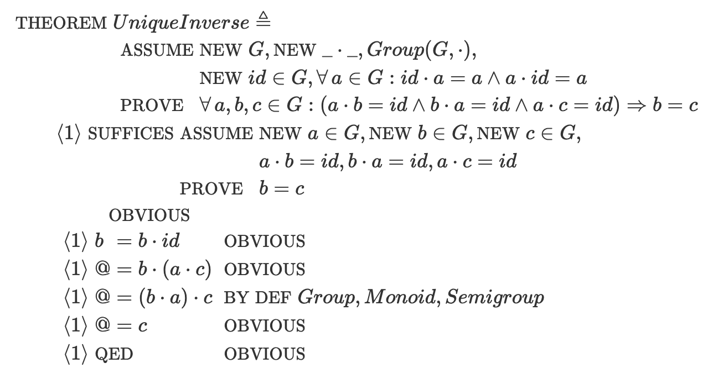
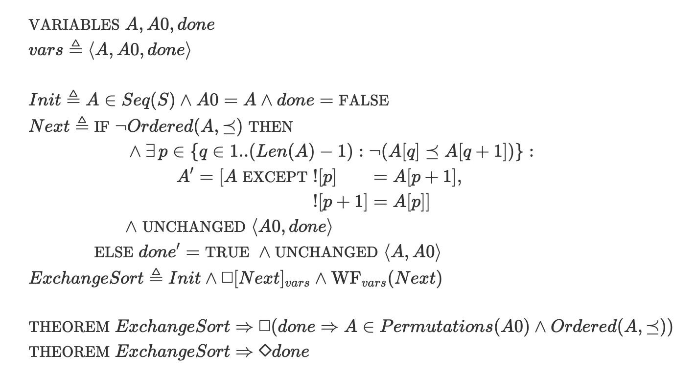
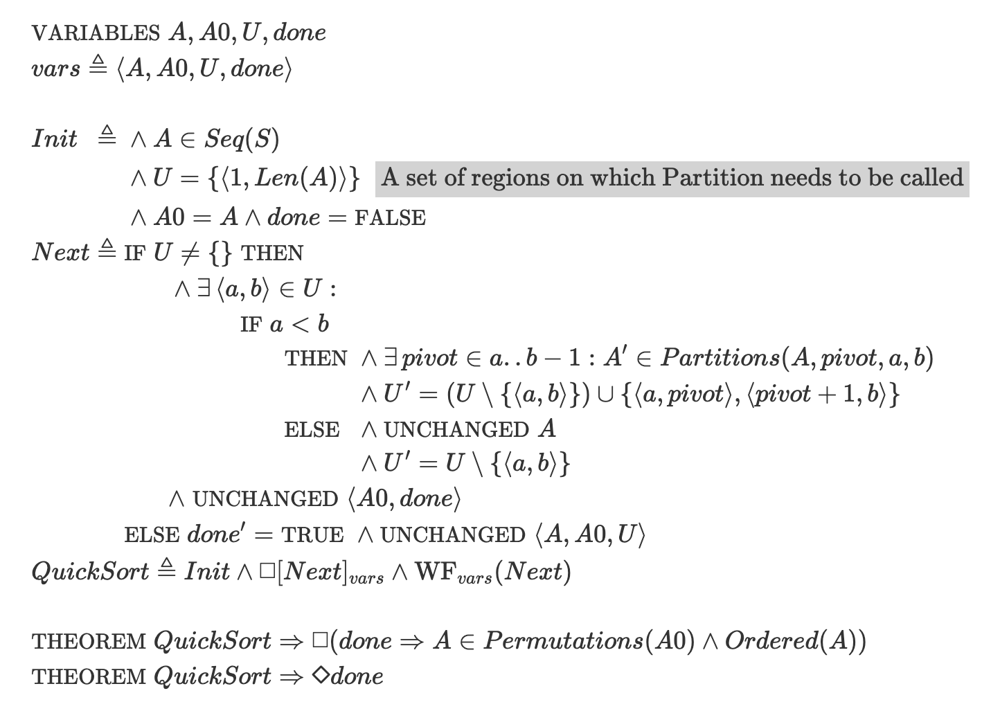
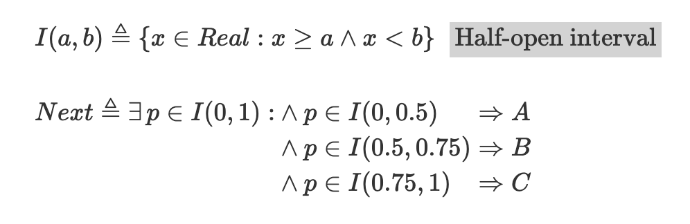
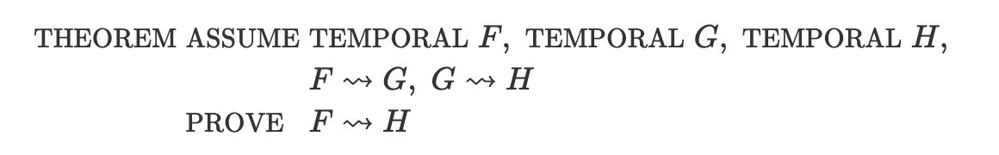
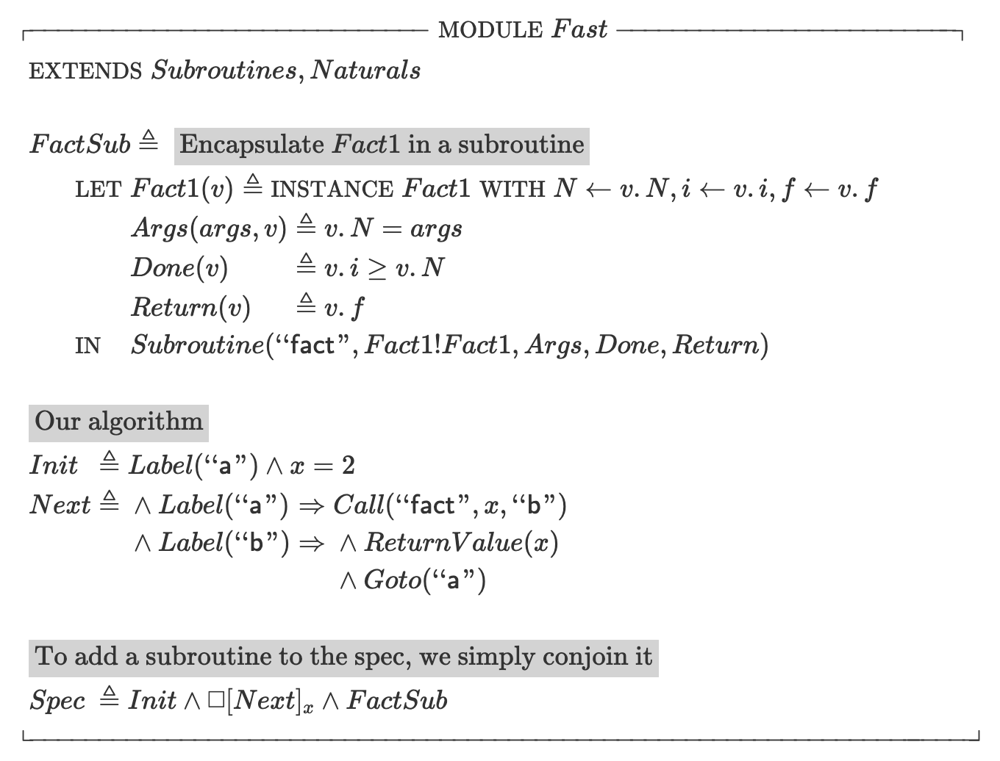
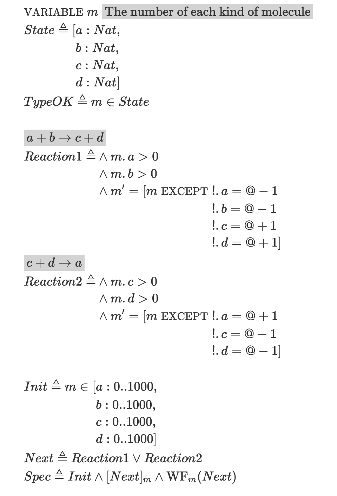

- https://pron.github.io/posts/tlaplus_part1
  collapsed:: true
	- *思考并不能保证我们不会犯错，但不思考则肯定会犯错。*
		- 莱斯利·兰波特（Leslie Lamport）：为什么我们应该像建造房屋一样构建软件
	- *思路清晰很难，我们能得到的所有帮助都会很有用。*
		- 莱斯利·兰波特，《系统规范》
	- ## **介绍**
		- TLA是一种用于设计、规格说明、推理和验证复杂现实生活中的算法和软件或硬件系统的正式化语言。TLA已经被Intel、Compaq和Microsoft用于硬件系统的设计，并且最近在大型软件系统中也开始得到应用，例如Microsoft、Oracle和最著名的亚马逊，工程师们使用TLA来为许多AWS服务进行规格说明和验证。
		- 我很快就会解释什么是形式化规格和验证语言，以及它如何帮助创建更优质、更健壮的算法和数字系统。但在此之前，我想澄清一下这四篇关于TLA + 的博客系列的重点。我把这个系列命名为“TLA + 在实践与理论中的应用”，但它几乎全是理论内容，这里的“理论”有两层含义——数学理论和设计理论。虽然我会详细介绍TLA + 的几乎所有内容，但这并不是一个教程，尽管它可能有助于补充其他教程。我将尝试澄清一些在学习TLA + 时可能难以理解的概念——尽管TLA + 很小且简单，但它包含一些可能需要一段时间才能完全理解的想法。然而，这些内容绝不是学习TLA + 或编写优质、有用规格的必要条件，阅读这些帖子也不会教你如何编写好的规格。因此，这个系列既不是学习TLA + 的必要条件，也不是充分条件，但对于理解TLA + 来说，我认为它是必要的和充分的。
		- 我希望让您了解TLA + 的目的、它为何以这种方式设计以及其设计和数学理论与其他形式化方法方法的比较。最重要的是，我希望传达这样一个信息：对于我们设计和构建的系统而言，（几乎）普通的数学是多么强大的推理工具。本系列文章面向对形式化方法或编程语言感兴趣的人（尽管TLA + 根本不是一种编程语言），他们可能会对TLA + 的理论方法和务实设计感兴趣，以及那些已经了解TLA + 但希望更深入了解其理论的人。
		- TLA + 有很多优秀的入门教程。TLA + 富文本书是由TLA + 的发明者Leslie Lamport编写的完整的、全面的、实践性很强的教程，如果你想开始在实践中应用TLA + ，这可能是最好的入门方式。你应该预期在两周内完成超书的学习，并具备足够的能力来为现实世界的系统指定和验证规格。Lamport的《Specifying Systems》是另一本较老的书籍，虽然不如超书那么实践性强，但更深入，更注重理论。这两本书都可以免费下载。最近，Lamport还制作了一系列在线TLA + 视频课程，其中两节关于Paxos的课程也可以作为快速学习TLA + 的速成课程。这个教程专注于PlusCal（一种类似于伪代码的语言，可以编译为TLA + ），适合那些希望在几小时内开始对规格进行模型检查，而不太关心理论的人。额外的补充学习材料是Dr. TLA系列讲座，涵盖了各种算法及其在TLA中的规格说明，以及可以在此GitHub存储库中找到的TLA示例集。
		- 关于TLA + 理论的论文也不在少数。莱斯利·兰波特(Leslie Lamport)和斯蒂芬·默茨(Stephan Merz)都出版了关于TLA + 的学术论文集，还有其他人也出版了相关论文集。然而，这些论文都是技术性的，主要面向研究人员，通常假定读者具备一定的先验知识。
		- 系列的下一三篇文章将深入探讨该语言本身及其背后的理论，但该语言的设计选择只有在特定的背景下才能被理解。本文将以一般性介绍的形式，为您提供理解TLA的动机、历史和设计原则所需的背景信息，并对其与其他方法进行比较。
	- ## **TLA +   in Practice **
		- 任何对TLA理论的探讨都必须从对其实践的概述开始，因为TLA的设计理念首先是基于实践的需要。
		- 这是一份名为《在亚马逊网络服务中使用形式方法》（《ACM通讯》，2015年4月）的技术报告，详细描述了亚马逊工程师在AWS设计中使用TLA+的经验，这首次引起了我对TLA+作为设计和验证复杂软件的实用工具的关注。以下是该报告的一些摘录，将作为TLA+在工业界使用的概览：
			- 高复杂度会增加设计、代码和操作中人为错误的概率。系统核心中的错误可能导致数据丢失或损坏，或违反我们客户所依赖的其他接口契约。因此，在启动这样的服务之前，我们需要对系统的核心是正确的有极高的信心。我们发现工业上的标准验证技术是必要的，但不是充分的。我们使用深度设计评审、代码评审、静态代码分析、压力测试、故障注入测试等技术，但仍然发现了复杂并发容错系统中隐藏的细微错误。
			- 人的易错性意味着一些更微妙、更危险的bug最终变成了设计上的错误;代码忠实地实现了预期的设计，但设计未能正确处理特定的` 罕见`场景。我们已经发现，测试代码作为一种发现设计中细微错误的方法是不充分的。
			- 为了找到系统设计中微妙的bug，有必要对该设计有一个精确的描述。编写精确的设计至少有两个主要好处;作者被迫更清晰地思考，这有助于消除“看似合理的挥手”，并且可以应用工具来检查设计中的错误，即使是在编写过程中。相比之下，传统的设计文档由散文、静态图，也许还有用一种临时的不可测试语言编写的伪代码组成。这样的描述很不精确;它们通常是模棱两可的，或者忽略了关键的方面……另一方面，最终的可执行代码是明确的，但包含了大量的细节。我们需要能够在几百行精确的描述中捕捉到设计的本质。由于我们的设计不可避免地复杂，我们需要一种高度表达性的语言，远远高于代码的水平，但具有精确的语义。这种表达能力必须涵盖现实世界的并发和容错。而且，由于我们希望快速构建服务，我们需要一种易于学习和应用的语言，避免深奥的概念。我们也非常希望有一个现有的工具生态系统。总而言之，我们在寻找一种具有高投资回报率的现成方法。我们在TLA + 中找到了我们想要的。
			- 在行业中，正式方法需要大量的培训和努力来验证一小段相对简单的代码，因此投资回报率只有在安全关键领域才合理，如医疗系统和航空电子设备。我们对TLA + 的经验表明，这种看法是非常错误的。…工程师从入门级到校长都能够从头开始学习TLA + ，并在2到3周内获得有用的结果，而无需帮助或培训。执行管理层现在正积极鼓励团队为新功能和其他重大设计变化编写TLA + 规范。在年度计划中，经理们现在分配工程时间来使用TLA + 。
		- 现在我们知道了一点TLA + 的用途，让我从实用的角度解释一下它是什么。形式规格说明语言和编程语言一样，是一种形式系统(一种具有精确语法和语义规则的语言)，但它侧重于程序应该做什么，而不是它应该如何做。例如，规范可能会说子例程必须返回它的输入排序-这是什么-而没有说如何返回，这意味着使用哪种算法进行排序。这样的描述应该立即引起这样的反对:任何子系统所做的事情构成了它的超级系统的方式，或者用编程的话说，更高的抽象层的方式是什么。例如，在指定如何查找列表中中位数元素的算法时，第一步可能是对列表进行排序，尽管使用哪种算法排序仍然无关紧要。
		- 因此，通用的规范语言应该能够描述“是什么”和“如何做”，或者更好的是，在任何期望的细节级别上描述任何抽象层的操作。TLA + 理论的核心是通过抽象/精化关系赋予了一个精确的数学意义，即在某个光谱上什么是两个抽象层次之间的关系，以及如何是这种关系。
		- 这也表明一种通用的规范语言也可以作为一种编程语言，因为它能够描述如何做和做什么。但是我们会看到编程语言的需求可能与我们想从规范语言得到的东西不一致，所以可能有充分的理由不让规范语言承担双重职责。
		- 有不同类型的规范语言。它们的本质差异(至少用户的感觉)与其说是由于数学理论的选择，不如说是由于目标的差异。第一种是作为契约嵌入到主流编程语言中的规范语言，要么作为编程语言本身的一部分，要么作为注释。这些规范语言的例子包括Java的JML、C的ACSL或VCC、c\#的spec\#和clojure。支持Clojure、Eiffel、Dafny、while和SPARK。这种规格说明描述了单个程序单元(如函数和类)的预期行为，可以使用自动随机测试生成、混合测试、模型检查、使用SMT求解器的自动证明和使用证明助手的手动证明等工具来验证单元的行为。虽然这样的规范非常有用，但它们的作用范围有限，因为它们不能轻易地指定程序的全局正确性属性。例如，很难编写——更不用说验证——代码级别的约定，规定程序最终必须响应每个用户的请求，程序永远不会响应包含其他用户信息的用户的任何请求，或者程序实现的数据库是一致的，或者它永远不会丢失数据。
		- 另一种规格说明语言是专门设计的，或者经过一些努力，可以作为编程语言承担双重职责。这些语言包括通用的证明辅助语言，如Isabelle, Coq和Lean，更针对软件的规格说明和证明语言，如WhyML，以及基于依赖类型理论的实验编程语言，如ATS, Agda和Idris (F*语言可能属于这一组和前一组之间的某个地方)。这些语言有一个非常清晰、独特和强大的优势:它们允许所谓的端到端验证，即能够从最高级别的全局属性到编译器发出的机器指令来指定和验证程序的行为，确保可执行程序符合规范。然而，这种能力的代价是非常高的:这些语言极其复杂，需要数月的学习和数年的掌握。出于这个原因，它们只被专家使用，在工业界很少使用，而且几乎从来没有没有学术专家的支持。到目前为止，还没有人能够以这种方式验证大型程序的所有有趣属性。所有成功的端到端验证实例都是相对较小的程序或程序组件，并且通常需要的工作量远远超出了高可靠性软件的能力。
		- 最后，还有一些独立的规范语言，它们不作为完整的编程语言，但可能(也可能不)允许使用某些编程语言生成代码。包括Z、VDM、B-method、Event-B、PVS、ACL2、ASM和TLA + 。英国Altran使用Z方法创建软件的高级规格说明(他们也使用SPARK在代码级别进行规格说明)，B方法用于铁路部门;NASA使用PVS(实际上它使用的理论与Isabelle/HOL和Coq等工具更相似)。
		- 在其专注于工业使用和用户友好性方面，TLA + 与Z、B-Method和ASM(以及一些理论方面)有共同的目标，而在其专注于计算的通用数学形式化方面，它与Isabelle和Coq有共同的目标。
	- ##  **意识形态与美学**
		- 因为没有一种完美的形式主义——没有一种适用于所有目的的形式主义——每一种都是围绕一系列意识形态或美学选择构建的，指出这些选择很重要，这样我们就可以明确辩论中关于优选形式主义的哪些部分——而且正如程序员所知，关于形式主义的辩论很常见——属于美学范畴。
		- 大约在1994年，Leslie Lamport 发明了 TLA+，这是他在形式方法上大约二十年工作的高潮 —— 这些技术采用基于形式系统的精确属性的正式推理来分析系统。对于 Lamport 来说，他对并发和分布式算法理论做出了开创性的贡献，形式方法始终是首要的实际必需品，是一种工具，没有这种工具就无法设计复杂或微妙的算法，因为一个没有经过正式证明正确的复杂或微妙的算法很可能是错误的。在评论他1977年写的第一篇验证论文时，Lamport 写道，他对算法验证的兴趣：
			- 这一直是一个非常实际的兴趣。我想验证我编写的算法。一种我认为在日常使用中不实用的方法对我来说没有吸引力。
		- Lamport 非常关心工程师们如何应用和思考形式方法，他的理论首先和最主要是由实用性驱动的：
			- 我们的动力不是抽象的优雅理念，而是关于真实算法的推理的实际问题。严格的推理是避免微妙错误的唯一途径……我们希望通过使基础形式化方法简单来使推理尽可能简单。
		- 实用性是一个理想，其实现取决于仔细决定该形式主义服务于何种用途（以及不服务于何种用途），以及其目标受众（以及不包括哪些受众）。TLA+是为工业界工程师和工业界或学术界的算法设计师设计的；它不是为数学家、逻辑学家或编程语言理论家设计的。它旨在满足对真实系统和算法的规格和验证的需求。它不是作为一种编程语言而设计，也不是作为探索新颖逻辑和数学思想的工具而设计。
		- 实用性——考虑到明确的受众和预期用途——包含两个要求：简单性，以便工程师能够快速学习和使用该语言；可扩展性，以便将该形式应用于具有相当复杂性和规模的实际软件或硬件，以及可选的通用性，以便将相同的形式应用于工程师可能遇到的各种类型的算法和系统。
		- 但是，虽然可扩展性可以比较容易地进行测试，而普遍性是形式主义的数学属性，但简单性（作为一种认知度量）往往取决于个人的审美观点。由于我的目标是比较和对比TLA + 理论的基石与其他方法，我想描述一种在过去几十年中在编程语言理论界流行的程序分析方法，该方法与TLA + 形成了鲜明对比。
		- 编程语言理论采取的程序分析方法，与函数式编程理论也有关联，基于两种美学选择，这两种选择源于一种历史观和一种科学使命。第一种是将计算与函数（部分）等同；第二种是试图将建设性数学——一种部分源自对数学的严格哲学观点的数学实践的重新思考——与编程统一。这种尝试导致了一个猜想，即数学与编程的统一也可能反过来实现，也就是说，用设计来编程建设性数学的同一形式框架对计算机程序进行数学推理是一个好主意，即数学的机械化（或程序化）的目标与编程的数学化是一回事。这一论点在关于Lean证明助手的论文引言中明确提出，Lean证明助手是一个旨在“支持数学推理和复杂系统推理”的工具：
			- 在实践中，验证一段数学定理和验证一个系统的正确性之间并没有明显的界限：形式化验证要求用数学术语描述硬件和软件系统，在此基础上，证明其正确性就变成了定理证明的一种形式。相反，证明一个数学定理可能需要进行冗长的计算，在这种情况下，验证定理的正确性就需要验证计算是否按预期进行。
		- 虽然“在实践中”这些引言词起到了正当化的作用，但并没有实际的证据来支持这一论点，尽管它很有趣，但目前仅限于理论层面。“计算数学”确实很有趣，但我们作为开发人员而不是逻辑学家，更关心的是相反的问题：如何用数学来表示计算，而不是如何用计算来表示数学。
		- 有充分的理由相信，这个论点——计算数学是进行关于计算的数学推理的正确工具——是错误的。在构造性数学中，最常见的计算对象是构造性（或可计算）函数。从算法的角度来说，可计算函数对应于一个序列算法。但是，大多数软件工程师构建和想要进行推理的系统和算法并不是序列的，而是交互式或并发的。在构造性数学中，最有趣和最常见的算法在软件中却最不常见，反之亦然。这并不是说不能在这种形式化体系下对通用算法进行推理，完全不是，但在函数形式化体系下一般性地对任意算法进行推理可能相当复杂，而且无论如何，它们的处理方式与序列算法完全不同。看来，虽然数学机械化和编程数学化在理论上相似，但在实践中实现这些目标需要不同的设计。
		- TLA+设计中的美学选择则截然相反：对于程序，我们应该精确地（即数学上）进行推理——因为数学是精确性的语言——而不应该使用一种旨在用编程语言表达奇特数学的正式化方法。相反，我们应该使用普通的数学来表达和推理我们的程序，最好以一种统一的方式来处理各种算法；换句话说，用普通数学来描述程序。Lamport写道：
			- 很长一段时间以来，我一直对计算机科学中对语言的强调感到困扰……我认为，编写更好程序的最好方法是教程序员如何更好地思考。思考并不是操纵语言的能力；而是操纵概念的能力。计算机科学应该关注概念，而不是语言。但是，如何在不被表达这些概念的语言分散注意力的情况下教授概念呢？我的答案是使用其他科学和工程分支所使用的同一种语言——即数学。
			- 对语言的迷恋是试图统一计算机科学不同部分的一大障碍。如果只从语言的角度思考问题，语言差异会掩盖根本的相似性。
		- Lamport 指出，编程语言是复杂的，而普通的经典数学则是简单的。编程语言需要能够机械地翻译成与硬件和操作系统交互的高效机器代码，并且它们用于构建长达数百万行代码的程序，然后需要由庞大且经常变化的工程师团队维护多年。这些要求对编程语言的设计施加了限制，使得它们必然复杂，但这种复杂性对于推理规格来说并不必要；规格比代码短几个数量级，推理不需要生成有效的可执行文件。如果能够将编程和推理分离成各自简单的语言——或者至少尽可能简单——采取这种方法可能会有很大的收益。
		  Lamport 写道：
			- 编程语言的主要目标是执行效率和编写大型程序的便利性。算法语言的主要目标是使算法更易于理解并帮助检查其正确性。执行实现算法的程序时，效率很重要。算法通常比程序短得多，一般只有几十行而不是几千行。算法语言不需要像对象或复杂的类型系统这样的复杂概念，这些是为编写大型程序而开发的。
		- 两种方法之间的差异——在编程语言本身中对程序进行推理，或者使用普通数学对程序进行推理——可以通过以下类比来解释。考虑一名电气工程师设计一个模拟电路，以及一名机械工程师设计一个由齿轮、滑轮和弹簧组成的装置。他们可以使用标准的数学方法，使用描述组件功能及其互动的方程式，或者发明一个电子组件的代数或机械组件的代数，并直接用电容器和电阻器（一个电容器加一个电阻器等）或齿轮和弹簧的语言进行推理。Lamport 的方法类似于前者，而编程语言理论的方法类似于后者。当然，为了方便，“标准数学”方法需要足够灵活，以便可以模块化地定义和组合具体的领域对象——比如电阻器。
		- 编程语言（或硬件语言）的建设性方法，如程序员（或硬件工程师）所实践的，与物理学家所实践的数学的描述性方法之间的差异是一个必须跨越的哲学鸿沟，这在学习 TLA+ 时是必需的，因为这正是赋予 TLA+ 其力量的原因。在硬件或软件中构建系统时，它由多个组件组成，每个组件都必须足够详细以实现高效的实现。在数学上描述系统时，我们通常选择完全描述一些组件，而只部分描述其他组件，因为后者的细节对我们理解的目标来说并不重要。这有两个实际用途：它使规格更简短、更清晰，并且还使验证——无论是通过模型检查还是正式证明——更加经济。
		- 此外，TLA+ 以任何方式都没有将计算与函数等同起来。相反，它将计算直接表示为离散动力系统，就像常微分方程（ODEs）用来描述连续的自然现象一样。正如我们将在本系列的第3部分和第4部分中看到的，这意味着 TLA+ 具有非常强大的通用性。批处理、交互式、顺序、并发、并行、分布式、实时和混合（又称为网络物理：与物理世界互动并具有离散和连续组件的系统）算法，都是使用同一种简单的形式主义表达的。此外，我们关心的所有程序属性——从正确性到性能——同样也是自然表达的，而且对于所有种类的算法，证明它们都使用相同的证明方法。虽然以这种方式表示计算的选择仍然是一种审美选择，但这种对不同类型的系统和不同属性的统一通用性表明它是一种自然的选择。Lamport 写道：
			- 物理学家不必在每次研究一种新的系统时都修改微分方程的理论，计算机科学家也不必在遇到一种新的系统时改变他们的形式。
		- 同样，TLA + 中的组分组成不是函数组成。我们将在第4部分中详细探讨组合，但为了激起您的好奇心，考虑一下组件对系统的行为施加了某些约束，因为它遵循一些规则运行。它还与它的环境交互- -无论是用户、网络、操作系统或其他组件- -它没有强加任何规则;环境对组件来说是不确定的。那么，多个组件的组合，就是所有组件施加的约束的交集，或者，用逻辑术语来说，是描述它们的公式的合取。因此，TLA + 是简单的逻辑连接词(“and”or /\\)。
		- 最重要的是，这种表示的选择不需要从抽象到计算的能力到任何期望的水平;恰恰相反，它提供了非常优雅的抽象。
		- 然而，语言方法有一些优势，例如能够进行端到端验证。由于统一语言可以机械地编译为高效的可执行程序，假设编译过程本身是经过验证的，我们可以确定从顶层规范一直到机器指令的流水线中都没有出现错误。如果一种编程语言的语义定义良好，并且组合规则简单且一致，那么我们就可以直接对程序代码进行形式化推理，并轻松地在抽象层次上上下移动，以验证不同抽象层次上性质的正确性。不幸的是，事实并非如此。
		- 在实践中，端到端验证是非常昂贵的，并且没有迹象表明在可预见的将来会发生巨大的变化。目前，端到端验证仍然保留给非常专业的软件，或者非常小的、大型系统的安全核心，因此形成了它自己的位置。幸运的是，很少有软件系统真正需要端到端验证，而那些需要验证的软件系统要么很小，要么只需要对一个或两个小的内部组件进行强有力的保证。
		- 如果我们可以用它来换取其他优势，放弃一个目前大多数软件都无法以可承受的代价实现或要求实现的目标是非常合理的让步; 这些优势包括简单性、通用性和可扩展性，使其适用于广泛的软件和广泛的用户。当然，没有什么可以阻止我们用代码级规范工具来补充这种方法，我们可以用它来验证局部正确性属性，比如特定代码单元的属性，而不是整个系统。
		- 无论你的审美选择是否与Lamport的一致，我认为这种与编程语言理论完全不同的意识形态值得考虑，如果它确实导致了更实用的验证方法。
	- ## **TLA+的历史**
		- Leslie Lamport以其对并发和分布式算法理论的主要贡献而闻名，他在20世纪70年代末开始研究形式化方法，正如我们所看到的，他是从实用主义的角度出发的。他的工作与托尼·霍尔(Tony Hoare)和罗宾·米尔纳(Robin Milner)的工作大致相同，但从一开始就采取了与他们在过程演算方面的代数/语言学工作不同的道路。他对验证并发/交互/非终止计算的理论做出了一些重要贡献，特别是通过细化规范和安全性和活跃性(他创造的术语)的概念。这些作为TLA+基础的数学思想早于形式主义本身多年就已经形成。这将TLA+与基于编程语言理论的规范语言区分开来，在编程语言理论中，在许多情况下，形式主义先出现，语义后出现。
		- Lamport写道:“Pnueli在1977年引入了时间逻辑，这导致了为并发系统的指定和推理寻找新逻辑的尝试激增。每个人都在寻找解决这个领域问题的灵丹妙药……我也不能幸免。”但在看到同事们“花了几天时间试图指定一个简单的FIFO队列——争论他们列出的属性是否足够”后，他对它的实用性感到失望。我意识到，尽管它在美学上很有吸引力，但将规范作为时间属性的结合在实践中是行不通的。”
		- 这导致他在80年代后期发明了行为的时间逻辑，这是一种逻辑形式主义，尽管它的名字，但它试图尽可能减少时间推理的使用(它借鉴了一些运算符)，而是依赖于一个称为行为的概念。Lamport写道:“TLA第一次给了我一种形式主义，在这种形式主义中，无需添加额外的形式语义层，就可以写出完全的形式证明。”
		- 在1991年访问牛津期间，Lamport探索了在那里开发的Z规范语言中添加TLA的可能性。但是“托尼·霍尔在牛津，并发在牛津意味着CSP。Z社区只对Z与CSP的结合感兴趣——这就像谓词逻辑与c++的结合一样自然。”
		- 所以在1993年Lamport发明了TLA+，一个围绕TLA建立的完整的规范形式。Lamport的这篇短文总结了他是如何从算法的形式描述中删除编程结构，并将算法提炼成数学本质的过程中创建TLA+的。
		- 虽然TLA+最初设计时并没有考虑到任何形式的机械验证，但在1999年，袁宇为TLA+编写了一个名为TLC的模型检查器，2008年，INRIA的一个团队为TLA+构建了一个名为TLAPS的机械验证检查器。2009年，Lamport推出了PlusCal，一种看起来像伪代码但却完全正式的“算法语言”，并被编译成可读的TLA+。最近，研究已经开始为TLA+建立一个更先进的模型检查器。
	- ## **The Feel of TLA+**
		- TLA+规范在某些选定的细节级别上描述系统。它可以是一些全局属性的列表，算法的高级描述，算法的代码级描述，甚至是CPU数字电路的描述，因为它们正在计算算法-任何您感兴趣的抽象级别或级别。
		- Lamport写道:
			- 我相信编写规范的最佳语言是数学。数学是极其强大的，因为它有有史以来最强大的抽象机制——定义。对于编程语言，不同类型的系统需要不同的语言结构——通信系统的消息传递原语，实时系统的时钟原语，混合系统的黎曼积分。对于数学，不需要特殊用途的构造;我们可以定义我们需要什么。
			- 也许用数学来指定的最大优点是，它允许我们用我们想要的方式来描述系统，而不受特定语言结构的约束。规范的数学操作可以产生新的见解。
		- TLA+不是一种编程语言。它没有内置IO的概念，没有内置线程或进程的概念，没有堆，没有堆栈——实际上，根本没有内存的概念——甚至没有子例程。然而，任何软件或硬件系统，以及几乎任何类型的算法，都可以简洁而优雅地用TLA+编写。通过对算法或系统而不是程序进行推理(在第3部分中，我们将探讨两者之间的区别)，我们获得了强大和简单;作为交换，我们放弃了机械地将算法转换为有效的可执行文件的能力。一旦您在您认为最重要的抽象级别指定了您的算法或系统，您就可以手动将算法转换为您选择的编程语言。如果您正在设计一个算法，那么TLA+规范将与代码非常相似，或者至少处于相同的抽象级别。然而，大多数时候，工程师使用TLA+来设计和推理完整的系统，在这种情况下，规范将处于比代码更高的抽象级别。Lamport将TLA+的使用比作设计房屋
		- 在任何抽象级别上，系统或算法都用TLA+表示为单个逻辑公式(显然，如果它是非平凡的，我们将其组成更易于管理的部分)，可以像任何数学公式一样操作。对于程序员来说，这听起来很可怕，但这种体验与编程非常相似，程序员可以比大多数编程语言更快地学习。数学让人感觉很像编程。TLA+是一种罕见的简单、优雅、多功能性和强大功能的结合，至少在我看来，它唤起了我多年前学习Scheme时的印象。除了它的证明语言——它是由其他设计目标引导的——它也相当简约。TLA+当然不是完美的，但对我来说，它感觉像Scheme或标准ML一样优雅和精细。
		- 计算机科学家和程序员喜欢讨论抽象。关于 TLA+，我最喜欢的一点是它给抽象概念提供了一个精确的数学定义，并允许我们直接对其进行推理：在 TLA+ 中，抽象/实现关系通过简单熟悉的逻辑蕴含来表达：
		- X ⇒ Y
		- 这个命题意味着 X 实现了 Y，或者相反，Y 抽象了 X。
		- 代码级规格语言——无论是基于契约还是类型——都清楚地区分了算法（表达在子例程的主体中，例如实现快速排序的例程）和算法属性（例如，“子例程返回一个排序过的列表”），这些属性表达为契约或类型。即使是允许在表达属性时完全使用编程语言的契约系统或类型系统（例如依赖类型）仍然做出了这种明确区分：在语义上，属性与算法是不同的。TLA+ 不做这种区分。属性“算法进行排序”，以及算法快速排序，只是不同细节级别、不同抽象级别的两个规格，而 X ⇒ Y 因此还意味着规格 X 具有属性 Y。
		- 正如我上面提到的，TLA+可以很容易地自然表达许多不同类型的算法:顺序的、交互的、并发的、并行的等等。然而，有一个明显的遗漏:虽然TLA+允许指定概率算法，但逻辑缺乏对它们进行推理的能力，比如指定算法产生正确答案的概率为0.75;然而，这个缺点可能很容易在该语言的未来版本中得到纠正。很容易指定诸如最坏情况时间或空间复杂性之类的性质，甚至诸如“系统最终将收敛于三个吸引子之一”之类的性质。
		- 但是，除了优雅、通用和强大之外，使用TLA+时感受到的最大实际影响(以及TLA+与其他一些规范工具之间最大的实际区别)是模型检查器的可用性。模型检查器可以区分实际节省开发时间的正式方法和可能昂贵得令人望而却步的方法。但是，最重要的是，有了证明助手，你可以证明一个算法只有在它确实是正确的情况下才是正确的，如果你指定的是一个复杂的算法或系统，那么它很可能不是正确的。只要按一下按钮，模型检查器就会给您一个反例，它会准确地显示出哪里出了
		- TLA+可以看到由三部分组成，这是一个指导本系列文章组织的分类:
		- 其核心是TLA——行动的时间逻辑——在某些方面类似于常微分方程。但ode用于描述连续动力系统，TLA用于描述任意离散动力系统。此外，TLA容纳了在分析程序时特别有用的推理，最重要的是断言推理和精化，后者是对算法之间抽象和实现关系的概念的精确数学定义(例如，并行归并排序实现，即精化，一般归并排序)。虽然TLA包含了一些线性时间逻辑，尽管它的名字，但TLA的主要设计目标实际上是尽可能地减少对时间逻辑和时间推理的依赖，因为虽然比许多替代方法更简单，但它并不是完全“普通的数学”。我们将在第3部分和第4部分深入探讨TLA。
		- 就像常微分方程（ODEs）描述了某个相空间中连续系统的演化，变量在某个域上取值一样，TLA+ 也需要某种状态空间（但不规定特定的状态空间），在这个状态空间中，系统的状态，即变量的值，在任何时间点都是定义的。TLA+ 中的“+”使用基于 ZFC 的正式集合论，允许 TLA 变量取多种类型的值（如数字和字符串这样的原子，有限和无限序列，集合，记录和函数）。我们将在第二部分讨论 TLA+ 的这一“静态”部分。
		- 最后，TLA+ 有一个模块系统，允许信息隐藏和精细的抽象/实现或等价关系。我们将在第四部分讨论模块系统和组合。
		- TLA+ 软件包包含一个名为“工具箱”的 IDE，一个 LATEX 美化打印机，以及 TLC 模型检查器，它让你能够在有限状态实例上，仅通过按一个按钮，验证用 TLA+ 的一个有用子集编写的算法的属性。证明系统 TLAPS 可以单独下载，但与工具箱完全集成，允许与证明系统进行交互式工作，以验证证明。TLAPS 不是一个独立的证明助手，而是 TLA+ 证明语言的前端，它使用自动求解器和证明助手 Isabelle 作为后端来履行证明义务。由于本系列重点在理论上，我将不讨论 TLA+ 工具的使用，尽管它们在实际上极为重要。我链接的学习材料涵盖了它们的使用。
		- 虽然TLA逻辑是通用的(除了前面提到的概率算法)，但TLA+是一种作业工具，而作业是从业者对现实世界的算法和大型软件系统的正式规范和验证。像所有优雅的工具一样，它可以用来做更多的事情，但这并不意味着它可以针对它没有设计的任务进行优化。语言的人体工程学以及当前的工具意味着它不是所有情况下的最佳选择。例如，它可以用于机械地证明一般的数学定理，但为该特定任务设计的交互式定理证明器可能会做得更好。它也可用于指定编程语言，但由于缺乏易于嵌入不同语言的语法结构，其他工具可能会更好地处理该任务。模型检查器和证明系统的局限性是这样的，对于探索数值和统计算法，我建议使用专门的语言，如Matlab、Octave或Julia。即使逻辑本身是普遍的，这并不意味着它总是最好的形式主义来推导出关于一个系统的任何见解。不同的形式可能提供不同的见解。
	- ## **关于TLA+的一些误解**
		- 我想谈谈我在网上发现的关于TLA+的一些有趣的误解。
		- 首先，TLA+只是一个验证分布式系统的工具。的确，现如今，TLA+主要是在分布式系统和并发算法的背景下被人所知。这有几个原因:1)Lamport的算法工作是并行和分布式算法，计算机科学的巴尔干化本质限制了思想在其始祖已知的领域之外的影响。2)很少有其他通用软件验证形式能够像TLA+一样优雅地处理并发，因此这正是它在比较中闪耀的地方。3)当工程师编写的软件系统过于复杂或微妙，无法明显正确，因此可以从正式验证中受益时，通常会涉及到并发或分布式算法。然而，没有什么本质上限制TLA+专门为并发和分布式算法。事实上，TLA+根本没有特殊的并发结构——比如消息传递或进程。
		- 另一个是actor模型的发明者卡尔·休伊特的评论:
			- TLA+错误地将状态视为全局的，这在科学上是不正确的，而且对工程来说是灾难性的。
		- 这里的错误在于将数学符号与其描述的系统混淆了。如果我们使用数学来描述 \(n\) 个粒子在一个维度上的位置，我们可能定义一个向量 \(x\)，其分量为 \(x_1, \ldots, x_n\)，每个分量代表一个单独粒子的位置（或状态）。这种符号（在 TLA+ 中写作 \(x[i]\) 而非 \(x_i\)）对粒子的实际物理相互作用没有任何说明。它只是一种符号，它处理状态的全局性并不比向量 \(x\) 的数学符号更多或更少。我们有一个向量 \(x\) 的符号，并不真正意味着每个粒子都瞬间知道其他所有粒子的位置。TLA+ 和数学通常并不“将状态视为全局的”；它们只是允许用符号表示某种全局的状态概念，而实际描述的系统并没有这种状态。
		- 有人可能会问，为什么我们要允许非物理可实现交互的规范，答案是，在一种将可表达的内容限制为物理可实现的内容的形式主义中工作，会使其变得更复杂，更不一般。另一个原因是，我们可能希望将非物理行为定义为高级抽象，以便指定和证明某些属性。例如，如果我们为分布式事务指定一个算法，我们非常希望我们的系统表现得好像分布式事务是即时的。在这种情况下，我们会指定我们可实现的，物理上真实的算法，然后我们会指定不可实现的抽象行为，然后我们会展示我们的低级算法实现了高级行为。如果我们甚至不被允许描述抽象的行为，我们将无法证明该算法具有这种期望的性质。
		- 那么问题就变成了我们是否应该使用软件组件本身不可用的信息(比如全局状态)来推断它们的行为。在这一点上，兰波特写道:
			- 断言方法……对全局状态进行推理。因此，我得出结论，这些方法不适合对分布式系统进行推理……我试图找出如何在不对全局状态进行推理的情况下编写正式证明，但我不能……我决定除了编写断言证明之外别无选择。我知道写这样的证明是没有问题的，但我预料到，由于它依赖于任意的全局状态，证明将是丑陋的。令我惊讶的是，我发现证明是相当优雅的。哲学上的考虑告诉我，我不应该对全球状态进行推理，但这次经历表明，这种推理很有效。我总是更依赖于经验而不是哲学，所以从那时起，我就一直在写分布式系统的断言证明。(其他更倾向于哲学的人花了几十年时间寻找对分布式系统进行推理的特殊方法。)
		- 另一个(相当技术性的)误解是TLA+“不是高阶”，因此不能指定一些高阶算法。在接下来的三期中，我们将深入到形式主义的细节，并检查其精确的“顺序”，这将使这种断言的错误变得清晰可见，但在这一点上，我想指出的是，这种说法的措辞是兰波特所谓的“沃尔夫综合症”的一个例子——在萨皮尔-沃尔夫假设之后，假设我们使用的语言塑造了我们的思想也就是说，语言与现实的混淆，或能指与所指的混淆，或形式主义与它所形式化的东西的混淆。术语“高阶”是系统的正式描述的一个属性，而不是系统本身。
		- 例如，命题“每个自然数集合都包含一个最小元素”在以自然数为结构或讨论领域的逻辑中是高阶的，但在以 ZFC 集合论的集合为结构的逻辑中是一阶的。另一个例子是表示为常微分方程（ODE）的连续动力系统。如果我们想指定一个系统，其一阶导数本身是另一个动力系统，我们可以使用高阶ODE，如下所示：  
		  \[
		  \ddot{x} = -x
		  \]
		  。但动力系统通常被写为一阶ODE，且没有丢失表达性或便利性，我们会将同样看似“高阶”的系统写为一阶ODE，如下所示：
		- $$
		  \begin{cases}
		  \dot{x}_1 = x_2 \\
		  \dot{x}_2 = -x_1
		  \end{cases}
		  $$
		- 当程序员说一个程序是高阶的，他们的意思是它由另一个程序参数化。但是，两个程序或算法之间的这种交互只有在我们选择用函数组合在我们的语言中建模交互时才是高阶的；还有其他表达这种关系的方式。
		- 因此，“高阶”和“一阶”的构成取决于话语领域和/或构成方式。两者都是形式主义的特征，而不是形式化的“现实”的特征。我们会看到，TLA+表达的行为在某些形式中可能是一阶的。
		- 总的来说，Lamport对比较形式主义是这样说的:
			- 在完全不同的形式主义之间进行比较往往会引起很大的混淆。形式主义A的支持者经常声称形式主义B是不够的，因为用A写的规范的基本概念不能用B来表达。这样的论点是误导性的。一种形式的目的不是表达用另一种形式编写的规范，而是指定某类计算机系统的某些方面。用两种不同的形式化编写的同一系统的规范可能在形式上是不可比较的……直接比较形式化而不考虑这些形式化如何用于指定实际系统的论证是无用的。
		- 最后，这在兰波特的一次演讲中得到了表达:
			- 用高级语言编写代码可以帮助一个人更清晰地思考，就像编写自然语言或绘制蓝图一样……我们现在有编程语言，而不仅仅是规范语言，它们可以在构建高级规范原型、编写可执行规范，甚至将其演变成实际程序方面非常有用……我要感谢Leslie Lamport，他是一位伟大的计算机科学家和程序员。但他应该学学Haskell。
		- 这个误解很有趣，因为评论者对于应该指定什么的期望是由他最喜欢的编程语言的特定能力所塑造的（我应该指出，从TLA+提供的灵活抽象或具体性水平来看，所有编程语言在表达范围上看起来几乎同样受限）。我挑战那位评论者在他最喜欢的编程语言中指定一些非常重要且合理的程序属性——在TLA+中可以轻松、自然且清晰地指定的属性，例如：“每个用户请求最终都会得到服务器的回应”，或“在构建对用户请求的回应时，数据库中不会读取属于其他用户的信息”，或“交易看起来是瞬间发生的（即，它们是线性化的）”，或“这种排序函数的最坏情况复杂度是 \(5n\log n\)”。正如我已经提到的，确实有一些研究型编程语言允许表达此类属性，但它们自身也做出了非平凡的权衡。
		- 兰波特对这个问题是这样说的:
			- “在用编程语言实现程序之前，我们是否需要用高级语言来指定程序？设计编程语言的人可能会说不，他们的语言让程序的功能非常明显，不需要更高级的描述。我认为第一个相信这是正确的编程语言是FORTRAN。但事实并非如此，我认为对于任何现有的通用编程语言来说都不是这样。”
	- ## **论形式方法的优点**
		- 作为工程师，我们应该使用能够帮助我们以最低成本构建符合需求的软件的工具。正式的方法，事实上，所有的软件验证方法——包括许多形式的测试——取决于它们所需要的努力和它们所提供的信心，我们应该选择那些与我们正在构建的系统的需求相匹配的方法。现在准确地说TLA+对软件开发有多大帮助，以及哪些问题从它中受益最多还为时过早，但我相信——像亚马逊的经验似乎支持这一点——大量的软件系统可以从像TLA+这样的工具中显著受益。
		- 对正式规范的一个怀疑是它要求太多。并不是所有的软件都需要正式的说明和推理。对琐碎或不重要的事情进行正式的说明确实没有什么用处。但是，软件中那些复杂的、微妙的、重要的部分将受益于仔细的思考，而正式的规范可以帮助您进行思考。对正式规范的反对，即使在可能从中受益的情况下，在这篇文章的评论中表达了:
			- 即使你有一个完美的证据证明一个程序满足规范，我们如何验证规范是正确的呢?很难相信一个一开始就写不出正确程序的程序员能神奇地写出完美正确的规范。有数学逻辑经验的人都知道，即使是相对简单的组合事实，要用逻辑语言精确地编码我们想要证明的东西是多么困难和技术。我并不是说编写一个正确的规范是不可能的，但这比首先编写一个正确的程序要困难得多。
		- Lamport在1979年的一篇论文《关于日历程序正确性的证明》中提出了这样的观点，这篇论文是对另一篇论文的回应，该论文声称有些软件——比如日历程序——很难正确地指定。在论文中，Lamport提出了这个反对意见:
			- 我们相信，如果一个人真正理解一个程序应该做什么，那么他就能以一种可理解的方式精确地指定它。
		- 像TLA+这样的高级形式化被设计为允许对软件(或硬件)系统进行精确的描述，允许对其假设和操作进行足够清晰和简洁的陈述，以至于规范的正确性比程序的正确性更有可能。至于程序员编写这种规范的能力问题，如果您能够将非正式的需求转换为程序——这只是一个相当低层次的正式规范——并且如果您足够了解您的程序，那么您也能够在更高层次上正式地指定它，以一种显示它如何以及为什么工作的方式。实际上，这是一个相对较短的训练和一些练习的问题。像亚马逊这样的公司使用TLA+的实际成功经验表明，它既有用又易于使用。
		- 其他批评者可能会声称，正确的编程语言、正确的编程风格(如面向对象编程或函数式编程)或正确的规程(如测试驱动开发)是创建优秀软件所需的全部条件。在1979年的同一篇论文中，兰波特写道:
			- 编程方法学的拥护者倾向于认为他们的方法学会自动生成好的程序。编程方法学不能替代对算法及其复杂性的智能推理，而且它本身也不能导致一个好的解决方法。“结构化编程”不会帮助欧几里得发现他的算法。
		- Amazon的经验表明，明智地使用形式化方法可以补充其他方法，并降低开发成本。
		- 在那些声称形式推理无效的人的另一端，有一些不切实际的期望。c\#的代码级规范语言spec\#的作者报告说:
			- 我们从与开发者的互动中得出的一个结论是，真正的开发者确实欣赏契约……不幸的是，我们也看到了对静态检查的不合理迷恋。当程序员看到我们的演示时，他们常常会产生一种与验证现实不符的浪漫热情。当他们在尝试验证自己的程序时遇到困难，随后可能会出现安装后的沮丧情绪。
		- 现实是在中间的某个地方:我们可以可行地验证某些系统的某些属性，一般来说，程序越复杂或越大，属性越棘手，或者我们希望对验证过程的准确性越有信心，需要做的工作就越多。必须始终根据软件需求做出一些合理的妥协。我相信TLA+在它所做的妥协中达到了一个最佳点，它在选择规范中所需的细节或抽象级别方面的通用性使用户可以自由地选择实用性和工作量方面的有用点。TLA+提供了简单性、通用性和可扩展性，它通过做出两个让步来实现:不是一种编程语言，也不想成为学习理论的通用工具。前者在很大程度上牺牲了端到端验证，这对几乎所有普通软件来说既不可行也没有必要;后者牺牲了与TLA+的预期目标无关的能力:一个对系统和算法的行为(尤其是正确性)进行推理的工具，而不是对理论的研究。
		- 此外，TLA+还很好地补充了静态分析器等价格合理的代码级正式工具。TLA+放弃了代码级形式化方法的100%置信度，而静态分析器放弃了验证复杂的全局属性。
		- 最后，在TLA+中指定最终是用数学指定。但是数学并不能让你免于思考;它只是帮助你组织你的想法。无论您选择何种形式来帮助您仔细地对程序进行推理，这都是正确的。思考是最重要也是最难的部分。在一次视频采访中，兰波特说:
			- 我的感觉是，人们在数学中寻找灵丹妙药，有一件奇妙的事情……不知怎么地，你发现了正确的数学，数学就能为你解决问题。事情不是这样发生的。当你理解了某件事，你就能找到数学来表达你的理解。数学不能提供理解。
			- 很多人……正在解决和我一样的问题——规范和验证——正在寻找这些新的数学抽象……我在20年前就放弃了这种寻找。例如，我发现，要证明并发算法的正确性，有一种基本方法是有效的——证明一个不变量。你可以用任何你想要的方式来包装它但是没有什么能使证明变得更简单。所以我所做的就是把这个方法尽可能直接地从问题转化为数学，这很简单，因为我用数学来描述算法，它已经在数学里了，所以我不需要任何语义来把我描述的算法转化为数学。所以我不需要什么新奇的数学方法来简化这个过程。
			- 我的预感是，人们会发现所有这些新的数学方法并不能真正解决问题。
		- 良好的数学形式化是对程序进行推理的必要条件，但它并不能使回答所有问题成为可能，更不用说容易了(请参阅正确性和复杂性)。这是数学的一个著名特性，当它描述由非常简单的部分组成的事物时，它可以提出很难回答的问题。
		- 除此之外，每一种形式主义都会引入一些“偶然的复杂性”，这些困难来自于对形式主义本身的选择，而不是问题本身。TLA+也不能幸免，尽管它在这方面做得很好。这些偶然的困难可能会使回答特定类型的问题变得更加困难。这意味着我们不可能有一种单一的形式主义是最适合所有用途的;在计算机科学中是如此，在数学中也是如此。
		- 您会发现，无论选择哪种形式，在TLA+或Coq中实际的工作都是相似的。能够以数学的方式思考，也就是精确地思考，是使用任何形式主义的先决条件，但这种能力会随着实际工作而提高。TLA+对于练习数学思维非常有用，因为它比其他用于推理程序的一般形式简单得多。它可以帮助你用最简单的数学和最简单的逻辑来练习逻辑和数学思维，让你尽可能少地把注意力集中在问题上，而不影响它的表现力和推理能力。即使你被类型论和直觉逻辑等理论所吸引，也许是出于美学或实用主义的原因，在试图解决那些更复杂的形式主义之前，掌握正式的普通数学和经典逻辑也会有所帮助。
		- 在同一段视频采访中，兰波特说：
			- 程序员们有这样一种想法，认为编程语言很简单，但数学却是困难的、复杂的。这真是荒谬！数学比任何最简单的编程语言都要简单得多，但人们却在不知不觉中对数学产生了恐惧……人们开始使用 [TLA+] —— 它教会他们数学……它使得使用数学变得和编程一样有趣。
		- 在我看来，在某种意义上，大多数编程技术和范式——从TDD到新的编程语言——都希望减少程序员思考的需要。但是，在图灵的计算机学会自我编程的梦想实现之前，没有任何技术能成为消除对仔细思考的需要的灵丹妙药。思考仍将是编程中最重要的部分。TLA+不会告诉你如何编程;它是一种帮助你清晰、精确和仔细思考的工具。克里斯·纽科姆(Chris Newcombe)是亚马逊的首席工程师，也是TLA+案例研究的作者，他在TLA+邮件列表中写道:
			- TLA+是我在职业生涯中学到的最有价值的东西。它改变了我的工作方式，给了我一个非常强大的工具来发现系统设计中的细微缺陷。它改变了我的思维方式，通过给我一个构建新型心智模型的框架，通过揭示正确性属性和系统设计之间的精确关系，通过允许我在软件开发过程的早期从“似是而非的散文”转向精确的陈述。
		- 我十分同意。
- https://pron.github.io/posts/tlaplus_part2
  collapsed:: true
	- 在第一部分中，我们讨论了TLA+设计的动机、用途以及指导原则。现在，我们将转向研究这种语言的细节。我们将从用于描述计算的静态状态的语言元素开始，即程序的数据和数据操作，这些是计算的基本构建块。我们将这部分TLA+称为数据逻辑。
	- ## **使用数学描述数据和操作**
	  collapsed:: true
		- TLA+采用Action的时序逻辑（TLA），来描述计算作为一个离散动态系统，这与使用[[常微分方程]]描述连续系统类似。
			- 就像[[常微分方程]]定义在一个状态空间上，其中变量可以在实数R中取值一样。
			- TLA公式的状态空间是某种逻辑结构（我们将准确了解这意味着什么），该结构包含了TLA变量在任何时间点可以取得的值。
		- 在TLA+中，集合构成了这种结构，而描述该结构中元素的逻辑理论基于[[一阶逻辑]]和策梅洛-弗兰克尔集合论（[[ZFC]]）——普通数学的标准形式。
		- 这意味着我们将使用形式数学来描述我们的软件，或者，就目前而言，仅描述它们的数据结构和基本操作。
		- “形式”简单地意味着在一个系统（一个“形式系统”或一个“形式体系”）中工作，该系统具有精确的规则，包括句法规则——如何构建表达式，以及语义规则——表达式的含义。
		- TLA+的这个静态组成部分占据了TLA+语言的大部分，如果你对规格语言和证明助手不熟悉，理解它将教会你在计算机上进行形式数学的所有基本知识。
			- 但从理论角度看，这是TLA+中最不有趣且最不重要的部分（TLA，动态组成部分是有趣且必需的部分），尽管从设计和可用性的角度看它很重要，因为它被设计得尽可能简单和熟悉。
			- 然而，这也是TLA+中最有争议的方面。
				- 这是因为Lamport选择了一个无类型的数学形式主义，而大多数规格语言选择了一个有类型的形式主义。
		- 除了关于正确性或生产力等指标的有争议的声明（无论是辩论的哪一方）之外，大多数人都同意编程语言中的类型具有以下优势：
			- 它们帮助编译器（特别是[[AOT编译器]]）生成高效的机器代码，并通过提供某种形式的最新文档来帮助组织代码，鼓励对子程序进行合理的关注。
			- 它们还有辅助工具进行自动完成和自动重构。
		- 然而，这些较不具争议的优势对于像TLA+这样的规格语言来说并不适用，因为它不会被编译成可执行文件，而且由于规格说明的长度比程序代码短得多，因此几乎不会从旨在帮助大型程序员团队维护大型代码库的功能中受益。
			- 因此，规格语言——或一般的数学——在类型化和无类型形式主义之间的权衡与编程语言的权衡不同，这一点在Lamport和Larry Paulson（证明助手Isabelle的作者）共同且平衡的论文中有很好的覆盖，论文题为《您的规格语言应该是类型化的吗？》
		- Lamport的选择是由他对TLA+预期受众的简单性愿望（正如他所看到的）推动的，即工程师，可能还因为他作为一名经典数学家的背景。
		- [[集合论]]具有熟悉而强大的优势，Lamport表示，他确实相信在实践中对工程师来说使用集合论来规定系统更简单。
		- 其他规格语言可能需要类型系统，因为它们用途不仅仅是软件或硬件规格的定义。Lamport写道：
			- 编写一个集合，如 {1, {2,3}}，并没有什么好的理由，让其无法编写似乎是个不错的主意。然而，我发现没有简单的方法可以让这种集合无法编写，而不同时也使得编写有用的集合变得不可能。这意味着，[[Coq]] 并不简单……这并不表示 Coq 有什么问题；它只是意味着它不适合普通工程师。例如，如果你查看一本数学文本，你可能会发现，符号 + 在一个段落中被用来表示几个不同的意思。要在 TLA+ 中形式化这些数学内容，你需要为这些不同的含义使用不同的符号。这会让数学家感到疯狂。Coq 允许你为所有这些含义使用同一个符号。所以，正如 George Gonthier 会告诉你的，你需要像 Coq 这样的东西来形式化严肃的数学。由于系统构建者和算法设计师不使用那种数学，他们不需要处理像 Coq 这样的语言的复杂性。
		- TLA+ 的静态组成部分是 Lamport 称之为 ZFM 的形式集合论，ZF 代表数学中的 ZF，他在这篇短文中解释了这一点（连同与类型化形式主义的比较）。
			- https://pron.github.io/assets/lamport-types-not-harmless.pdf
		- 逻辑学家可能会发现 TLA+ 的形式主义太普通；甚至可能觉得枯燥。数学家 G.H. Hardy 曾经写道：“‘真正的’数学家的‘真正的’数学……几乎完全是‘无用的’……是那些乏味且基础的部分……不管好坏，都是这些起作用。”但 TLA+ 不是一个用于探索数学秘密或新颖逻辑的工具，而是一个供工程师们用来指定“有效工作”的系统的工具。就普通数学而言，TLA+ 是一个清晰、简单且强大的形式主义，具有方便自然的语法。
		- TLA+ 使用形式数学来指定软件系统。正如你将看到的，它对程序员来说并不像一开始听起来那么可怕。编程是将非正式要求转化为软件的低级形式规格——程序。如果你能够做到这一点，如果你理解为什么你的程序可以工作，或者至少，它应该如何工作，你也可以编写一个高级的数学规格。这只需要一些练习。在《指定系统》的引言中，Lamport写道：
			- 我们使用的数学比你从小接触的数学更加形式化......大多数数学家和科学家编写的数学并不是真正精确的。它在小范围内精确，但在大范围内不精确。每个方程都是一个精确的声明，但你必须阅读伴随的文字才能理解方程之间是如何相关的，以及定理的确切含义是什么。逻辑学家已经开发出了消除这些文字并使数学完全形式化的方法，因此，完全精确......[M]数学家和科学家认为没有文字的形式数学是冗长且乏味的。他们错了。普通数学可以在一个精确的、完全形式化的语言中紧凑地表达。在 DifferentialEquations 模块中定义一个任意微分方程的解只需要大约二十几行......但是很少有规格需要如此复杂的数学。大多数只需要简单应用几个标准的数学概念。
		- 我必须再次提醒你，这不是一个教程，而且覆盖的许多材料并不是编写良好的 TLA+ 规格所必需的。虽然我会介绍基础知识，并希望这篇文章中的示例能让你体验到形式数学规格是什么，以及它与编程的相似之处，但我的重点是 TLA+ 背后的数学理论和设计原则。对于 TLA+ 的好的动手教程，请参考我在第一部分中提到的那些。
	- ## **什么是逻辑？**
	  collapsed:: true
		- TLA+ 使用逻辑来指定算法及其数据结构。对于那些数学逻辑可能有些生疏的人来说，这里是一个复习。
		- ### 逻辑基础
		  collapsed:: true
			- 形式逻辑、符号逻辑或数学逻辑是一种形式系统或形式主义。
			- 它是一种精确的语言，用于讨论事物，或者至少是易于精确的事物。
				- 像任何语言一样，它具有语法，可以被视为形成句子的语法规则，以及语义或含义——语言讨论的内容。
				- 但是，作为精确的语言，它具有精确的语法和精确的语义。
					- 语法定义了如何形成语言中合法（格式良好）表达式的规则，语义通过将这些表达式与精确定义的数学对象连接起来来定义这些表达式的含义。
					- 语义使我们能确切地知道语言中任何短语的含义，语法使我们能够以这样一种方式操纵短语，即我们确切地知道其对含义的影响。
			- 逻辑的语法由一些内置的连接词组成——通常是
				- ∧表示合取（“和”），
				- ∨表示析取（“或”），
				- ¬或有时∼表示否定（“不”），
				- ⇒或→表示蕴含（“如果-那么”），
				- ≡或⇔表示等价（当且仅当，或 iff），
				- 一组变量（x，y，...）——我们用来指代对象的名称——以及一个签名，它是一组具有特定元数（符号接受的参数数量）的符号，如 5（0元），=（2元），<（2元），*（2元）或 -（一元负号）。
					- 例如，表达式 x∗5<−y∧¬(x<5) 是我举例的逻辑中的一个合法表达式。
				- 逻辑还可以有量词，最常见的是全称量词∀（“对于所有”）和存在量词∃（“存在”）。
					- 量词通常绑定变量。例如，∀x…，意味着“对于所有这样的对象 x ...”，或∃x…，意味着“存在这样的对象 x ...”。
			- 一个格式良好的表达式称为术语（语言的术语），因此语法通常被认为是所有术语的集合——语言中所有可能的格式良好的表达式。
			- 公式是一个布尔值表达式，即一个要么为真要么为假的表达式。在公式中未绑定出现的变量称为自由变量。没有自由变量的公式称为句子或封闭公式。
			- 逻辑也有一个结构，这是逻辑的论域——逻辑所讨论的内容——它为签名提供意义或语义。
				- 为逻辑分配一个特定结构称为解释。
			- 像 2 这样的 0元符号的含义通常称为常数，而高元符号的含义通常称为关系（例如，小于关系，<）或函数。
			- 变量的含义也由结构定义，尽管这里逻辑的“阶”很重要。我们稍后会讨论这个主题，但在一阶逻辑中，变量可以指结构定义的可能值的集合中的任何值；该集合被称为逻辑的宇宙。
			- 模型是语法与语义之间的关系：一个公式的模型是满足该公式的结构，即对变量赋值使得公式为真（真实是一种语义属性）。表示“满足”的常用符号是“$\models$”。在左边是使得右边的公式为真的结构——一个公式的模型。例如，我们逻辑的结构可以是整数集合，包括乘法、否定和小于关系。那么表达式 $x < 2$ 的一个模型可以是 $x = -5$。一个公式 $A$ 的所有模型的集合构成其形式语义，通常写作 $[[A]]$。我会通俗地称这些模型的集合——公式的语义——简单地为公式的模型，并说 $x < 2$ 的模型是任何给 $x$ 赋值小于 2 的数，或者更简单地，所有小于 2 的数。我们可以说这个公式指定了所有小于二的数字。在所有解释下为真的公式被称为有效的，我们写作 $\models A$（左边没有结构）。公式 $\text{TRUE}$ 被所有解释满足，而公式 $\text{FALSE}$ 根本没有模型。
			- 各种逻辑运算符以特定方式与模型交互。公式 $A \land B$ 的模型是 $A$ 的模型与 $B$ 的模型的交集，或者 $[[A \land B]] = [[A]] \cap [[B]]$。公式 $A \lor B$ 的模型是 $A$ 的模型与 $B$ 的模型的并集，或者 $[[A \lor B]] = [[A]] \cup [[B]]$。公式 $\neg A$ 的模型是 $A$ 模型的补集，或者 $[[\neg A]] = [[A]]^c$。这些正是用韦恩图熟悉定义的逻辑运算符。
			- 当我们使用逻辑时，我们通常在特定的逻辑理论中工作，该逻辑理论是一组被认为等同于 TRUE 的公式集，称为公理。
				- 一个理论的模型是满足该理论所有公理的结构；换句话说，理论描述或规定了一个模型。
				- 因此，逻辑通常不是用结构来定义的，而是用理论来定义的，这个理论随后描述了所有合适的结构。
				- 例如，皮亚诺公理就是描述自然数及其熟知的算术运算的逻辑理论。我们熟知的自然数及其算术运算，就是皮亚诺算术的一个模型。
			- 当然，一个逻辑公式，甚至一个完整的逻辑理论，可以在不同的结构上有多种解释。
				- 例如，公式 $x > 2$ 在实数集上的解释与在自然数集上的解释是不同的。
				- 句子 $\exists x. (x > 0 \land \forall y. (y > 0 \Rightarrow y \geq x))$ 在整数集上是真的，但在实数集上是假的。
			- 逻辑通常也有一个演算系统，这是一个从其他表达式推导表达式的语法系统，如自然演绎。
				- 如果公式 $C$ 可以通过对公式 $A$ 和 $B$ 应用一系列推理规则推导出来，我们写作 $A, B \vdash C$，并说 $A$ 和 $B$ 证明或蕴含了 $C$，其中 $A$ 和 $B$ 是假设，$C$ 是它们的结论。
				- 可证性是语义真实性的语法对应物。
				- 如果一个公式 $A$ 仅由理论的公理蕴含，没有其他假设，我们写作 $\vdash A$，并说 $A$ 是一个重言式。
				- 如果 $\vdash A$ 且 $A$ 不是一个公理，我们说 $A$ 是一个定理。
				- 如果我们想要证明定理 $A$ 但尚未做到，我们称 $A$ 为一个命题。
			- 根据大多数逻辑的公理，如果 $A, B \vdash C$，那么 $\vdash (A \land B) \Rightarrow C$，反之亦然。即，$A$ 和 $B$ 蕴含或证明 $C$ 当且仅当 $A \land B$ 蕴含 $C$。
			- 有两个重要的公理塑造了逻辑的一般属性。
				- 第一个称为[[爆炸原理]]，它声明对于任何公式 $A$，$\vdash \neg (A \land \neg A)$，或等价地，$A \vdash \neg \neg A$。
				- 第二个称为[[排中律]]，它声明对于任何公式 $A$，$\vdash A \lor \neg A$，或等价地，$\neg \neg A \vdash A$。
				- 具有这两个公理的逻辑被称为经典逻辑或标准逻辑。
				- 具有[[爆炸原理]]但没有[[排中律]]的逻辑被称为[[直觉逻辑]]或[[构造逻辑]]（其中，如果 $A$ 已知不为假，我们不能得出它必须为真的结论）。
				- 具有[[排中律]]但没有[[爆炸原理]]的逻辑被称为[[悖论逻辑]]（其中，如果 $A$ 为真，我们不能得出它可能也不为假的结论）。
				- 构造逻辑和悖论逻辑都有有趣且有用的应用。
					- 如果没有这两个公理，我们无法将否定和肯定的陈述联系起来，这等同于根本没有否定的逻辑。
					- 在TLA+中使用的所有逻辑都是经典逻辑。
			- 请注意，在经典逻辑中（但非经典逻辑中不是这样！），存在量词和全称量词可以通过对方来定义：
			- $$\exists x. A \equiv \neg \forall x. \neg A$$
			  $$\forall x. A \equiv \neg \exists x. \neg A$$
			- 简单来说，我们说 $\exists \equiv \neg \forall \neg$ 和 $\forall \equiv \neg \exists \neg$。
			- 逻辑，像所有语言一样，表达意义。
				- 但是逻辑陈述的意义并不总是完全被其形式语义所捕获。
				- 逻辑学家戈特洛布·弗雷格指出，逻辑陈述可能具有两种意义：意指和指称（后者有时也称为命名）。
					- 例如，句子 $3 > 2$ 具有语义值 TRUE，因此指向值 TRUE。
					- 句子 $2 > 1$ 也指向值 TRUE，因此与 $3 > 2$ 等价。
					- 然而，这两个句子具有不同的意指，因为它们表达了不同的想法（一个关于3和2的关系，另一个关于2和1的关系）。
				- 意指和指称之间的区别是完全理解所有逻辑（实际上是所有语言）所需的关键哲学观察，并且某些非经典逻辑——特别是直观逻辑——可以明确地指涉这两种意义（使用不同的等价概念，一个称为外延的，是对指称/命名的等价，另一个称为内涵的，可以看作是对意指的等价）。
				- 但我们将只处理经典逻辑，所以这个重要的哲学观点没有实际意义。
		- ### 一阶逻辑与其他阶逻辑
		  collapsed:: true
			- [[一阶逻辑]]（或称 FOL）包含所有常规的逻辑连词（$\land$、$\neg$ 等），以及全称量词 $\forall$ 和存在量词 $\exists$。在 FOL 中，变量可以表示宇宙的简单值：如果宇宙是自然数，那么一个变量——无论是自由的还是量化的（即绑定的）——代表一个自然数。如果我们想要量化更丰富的结构，比如自然数的集合、自然数的函数等，我们需要通过扩展我们的理论将它们加入到宇宙中。
			- 在二阶逻辑（或称 SOL）中，一个变量可以代表宇宙的一个元素或一个元素集。
				- 将这个集合看作一个谓词更为简单；一个谓词 $p(x)$ 为真当且仅当值 $x$ 在集合 $p$ 中。
				- 因此，虽然在 FOL 中所有的谓词必须是“恒定的”并且在签名中给出，在 SOL 中我们可以对它们进行量化，并且可以说，
				- 例如，$\forall_1 x \exists_2 p \forall_1 y . p(y) \equiv (y = x)$（符号 $\equiv$ 代表双向蕴含，或者当且仅当，我已经用下标来区分一阶和二阶量化；通常这种区分从上下文中就可以明确），或者用话语表达就是，“对于任何 $x$，存在一个谓词 $p$，对于参数 $y$ 为真当且仅当 $y = x$”。
			- 类似地，三阶逻辑允许我们量化值的集合的集合等。更高阶的逻辑，或称为 HOL（高阶逻辑），允许我们量化任何阶的变量，通常只在类型化的形式系统中使用。
				- 类型的原始概念是由伯特兰·罗素创造的，正是为了区分阶：
					- 不同阶的对象属于不同的类型，即如果我们的“基础”值是第一类型，那么这些值的集合是第二类型，集合的集合是第三类型等。
				- 类型在语法上和语义上都具有重要意义：
					- 如果 x 和 y 属于不同的类型，那么表达式 x=y 不是假的，而是格式不正确的，意味着它根本不是一个合法的表达式。
					- 类似于我上面使用的下标，HOL 中的量词通过类型来区分；我们写作 $\exists x : T$（而不是 $\exists_T x$），意思是“存在一个类型为 T 的 x”。
			- 在所有逻辑理论中，最重要的定理之一是：在一阶逻辑中（仅限一阶逻辑！），语义真实性和句法可证明性是一致的，即 $\vdash A$ 当且仅当 $\models A$，或者说，$A$ 是重言式当且仅当它是有效的。换句话说，如果一个公式 $A$ 是有效的——被所有解释（也满足该理论的公理）满足——那么它可以被证明，反之亦然。类似地，$A \vdash B$ 当且仅当 $[[A]] \models B$。这是[[哥德尔的完备性定理]]。然而，请注意，这并不意味着一阶逻辑中的每一个句子都可以被证明或反驳。如果你的理论足够丰富，总会有一些既不能被证明也不能被反驳的句子（在一阶逻辑的情况下，意味着这样的理论将有多个模型，在某些模型中句子为真，在其他模型中为假）。这是另一个著名结果的后果，即[[哥德尔的第一不完备性定理]]。这个定理不仅适用于一阶逻辑，而且适用于任何形式主义，因为它是[[停机定理]]的直接结果（尽管停机定理是几年后才证明的）。
			- 由于 TLA+ 中的“静态”或数据逻辑和时间逻辑只允许一阶公式，我们可以使用符号 $\vdash$ 来表示有效性和可证明性（除非我们特别想谈论左边的语义结构）。但是由于第一不完备性定理适用于 ZFC，不是每个 TLA+ 句子都可以被证明或反驳。
			- 因为 TLA+ 允许自由变量，我想指出在阅读含有蕴含（$\Rightarrow$）和自由变量的公式时可能遇到的一个混淆源：公式 $x > 4 \Rightarrow x > 2$ 是一个定理，即 $\vdash x > 4 \Rightarrow x > 2$，并被所有对 $x$ 的赋值满足，而 $\forall x : x > 4 \Rightarrow x > 2$ 也是一个定理。另一方面，虽然 $\forall x : x > 2 \Rightarrow x > 4$ 等价于 FALSE，即 $\vdash \neg (\forall x : x > 2 \Rightarrow x > 4)$，但公式 $x > 2 \Rightarrow x > 4$ 确实有一个模型：它被所有小于等于 2 或大于 4 的数满足。这意味着我们必须知道我们是将 $x > 2 \Rightarrow x > 4$ 当作一个命题——等同于询问它是否有效，或者被所有对 $x$ 的赋值满足——在我们的案例中不是真的，或者不是，在这种情况下，它指定了一个模型。如上所述描述 $A \Rightarrow B$ 的模型并不有趣，但从语义角度来看命题 $\vdash A \Rightarrow B$ 则是：$\vdash A \Rightarrow B$ 当且仅当 $[[A]] \subseteq [[B]]$。
			- 现在，请注意，一个一阶逻辑（FOL）公式的模型，比如说 $x > 2$，总是来自宇宙的值的集合（在这个例子中，所有大于 2 的数字）。因此，一个 FOL 公式的模型总是一个二阶对象。但如果公式的含义是一个集合，一个二阶对象，那么我们如何编写一个通用的公理，比如 $\vdash A \lor \neg A$，其中 $A$ 不代表一个特定的公式，而是任何公式？我们不能写 $\forall A. A \lor \neg A$，因为我们不能对公式进行量化（正如我们刚才看到的，公式代表集合，或者说是二阶值），也不能出于同样的原因将它们当作自由变量处理。答案是我们不这么做。我们说这样的公理是一个公理模式，它指的是逻辑中的无数个公理，每一个可能的公式 $A$ 都对应一个。因此，用来编写模式的语言并不是逻辑本身，而是我们逻辑的元逻辑或元语言。
			- 从理论角度来看，这是可以的，但对于机械证明软件来说，这并不令人满意。在证明一个定理时，我们经常需要证明一些中间引理，我们希望能够陈述和证明可以在许多证明中重用的通用引理，这样的通用二阶引理可能非常有用。
			- 因此，一种解决方案是采用高阶逻辑。但保持逻辑为一阶在简单性、模型检查算法、一般定理方面具有一些优势（如果我们知道一个公式是一阶的，基于其句法结构更容易陈述关于公式含义的定理）——最后一点对于 TLA+ 中的时间逻辑部分 TLA 更为相关，我们将在后续内容中详细介绍。但事实证明，我们可以两全其美。我们可以保持所有公式为一阶，但允许以形式 $A \vdash B$ 编写二阶命题，这些命题本身并不是公式（因此它们没有模型）。我们基本上是在提供对元语言的访问。这是 TLA+ 采用的解决方案，我们将在关于证明的章节中详细看到。
			- 顺便说一下，因为我提到了模型检查，我想借此机会澄清关于模型检查器的一个可能的误解。
				- 模型检查器的名称来自我们刚刚在逻辑上下文中学到的“模型”的定义。
				- 它是一个程序，接受一个逻辑结构的描述 $M$ 和一个逻辑公式 $\varphi$，并检查 $M$ 是否是 $\varphi$ 的模型，或者说 $M \models \varphi$。
			- 除了一阶逻辑（FOL）的理论和实际优势外，它还有一些理论上的缺点。例如，一阶理论有非标准模型（比如，存在具有不可数多个数字的一阶皮亚诺公理的模型）。然而，鉴于TLA+的预期用途和受众，这根本不是一个问题。兰波特（Lamport）写道：“我当然不担心因为工程师实现了一个非标准的整数模型而发生错误。”
	- ## **逻辑公式和表达式**
	  collapsed:: true
		- 我们现在将开始学习TLA+的具体内容。如果你熟悉标准的数学符号，你会发现TLA+的语法大部分是直观且易于阅读的。然而，由于TLA+是完全形式化的，每一个表达式的含义都必须被精确定义，没有任何含糊或直觉的余地。这使得描述看起来有些过分执着，但正是这种精确性使得逻辑的机械分析成为可能。因为TLA+是无类型的，并试图模仿熟悉的非正式数学符号，尽管是以正式的方式，其细节对那些通常对证明助手感兴趣但习惯于使用类型化形式主义的人而言，可能具有特别的兴趣。
		- ### 逻辑连接词与量词
		  collapsed:: true
			- TLA+ 中的静态数据逻辑是带有等式的一阶逻辑。逻辑常数有 `TRUE` 和 `FALSE`。我们使用熟悉的运算符：$\land$ 表示合取，$\lor$ 表示析取，$\neg$ 表示否定，$\Rightarrow$ 表示蕴含，以及 $\equiv$ 表示等价。$\land$ 和 $\lor$ 具有相同的优先级，因此表达式 $a \land b \lor c$ 由于优先级歧义而是一个语法错误，需要使用括号来解决。蕴含的优先级较低，所以 $A \land B \Rightarrow C$ 等同于 $(A \land B) \Rightarrow C$。
			- $\exists$ 和 $\forall$ 是常规的一阶存在量词和全称量词，用于引入绑定变量。在 TLA+ 语法中，我们在量词后使用冒号 `:` 而不是更常见的单点，用以界定绑定变量的范围，并读作“使得”。例如：
			- $$
			  \forall x : P(x) \Rightarrow \exists y : R(x, y)
			  $$
			- 量词绑定它们的变量在一个范围内，该范围“尽可能地远”，即直到一个闭合括号或当前表达式的结束。因此，$\forall x : P(x) \Rightarrow \exists x : Q(x)$ 是非法的，因为它被解析为 $\forall x : (P(x) \Rightarrow \exists x : Q(x))$，所以存在量词引入的变量 $x$ 已经被全称量词绑定。然而，$(\forall x : P(x)) \Rightarrow \exists x : Q(x)$ 是格式正确的。
			- 此外，TLA+ 还包含了一些受编程语言启发的特殊结构。其中的结构
			- $$
			  \text{IF } p \text{ THEN } x \text{ ELSE } y
			  $$
			- 当 \( p \) 是一些逻辑谓词，以及 \( x \) 和 \( y \) 是值时，如果 \( p \) 为 `TRUE` 则取值 \( x \)，否则取值 \( y \)。另一个结构
			- $$
			  \text{CASE } p_1 \rightarrow e_1 \square \ldots \square p_n \rightarrow e_n \square \text{OTHER} \rightarrow e
			  $$
			- 等同于某个 \( e_i \)，其中 \( p_i \) 为真（如果存在的话），否则如果存在 `OTHER` 子句，它的值等于 \( e \)；如果没有 `OTHER` 子句，表达式的值是未定义的（我们将在下一节中详细讨论这意味着什么）。更精确地说：
			- 
			- 如果多于一个谓词为真，表达式的值将是其中之一，但该语言并不承诺具体是哪一个。`IF/THEN` 和 `CASE` 都是基于我们稍后将看到的 `CHOOSE` 操作符来定义的。
			- 如果有多个谓词为真，表达式的值将是其中之一，但语言不承诺是哪一个。IF/THEN 和 CASE 都是根据我们稍后将看到的 CHOOSE 运算符定义的。
			- 由于在 TLA+ 中，算法和系统的规范是以公式的形式书写的，因此需要一些人体工程学技巧来编写长公式，使其易于阅读。Lamport 在《如何编写长公式》中设计了这样一种方案。它通过对连接词和析取词的对齐来代替括号，如下所示：
				- {:height 144, :width 120}
			- 其中 a, b, c 和 d 代表任意子公式。注意前缀连接词，它开始了析取和连接的列表。隐含的括号从开始该行的连接词后面的表达式延伸，直到在某个与开头连接词对齐的新行中遇到另一个同类型的连接词。因此，上述表示与以下表示意义相同（在 TLA+ 中也是允许的）：
				- $$
				  (a) \lor ((b \land c) \land (d)) \lor (e)
				  $$
			- 因此，尽管变量 x 被两个不同的量词绑定，以下形式仍然是良构的，
				- {:height 103, :width 162}
			- 因为它被解析为
				- $$
				  (\forall x : P(x)) \lor (\exists x : Q(x))
				  $$
		- ### CHOOSE运算符和未定义的含义
			- 在基本运算符的全景中，一个不可或缺的是 [[CHOOSE]]，即希尔伯特的ε（epsilon）运算符。
			- CHOOSE x: P(x) — 其中 P(x) 是可能包含 x 的某个谓词 — 等于逻辑讨论领域（即值的宇宙）中满足谓词 P 的某个值，如果存在的话。CHOOSE 遵循以下两条规则：
				- 
			- 第一条规则展示了如何以 CHOOSE 来定义量词 ∃（因此也可以定义 ∀）；下一段将解释原因。
			- 第二条规则有时被称为右唯一性或外延性模式，意味着给定等效的谓词，CHOOSE 总是指定相同的值（尽管这个值不是由逻辑决定或可确定的）；尽管选择总是相同的，我们不知道也不关心它是什么，只知道它是满足谓词 P 的某个值。
				- 换句话说，CHOOSE 是确定性的，尽管具体选择不是预设的；这在新的 TLA+ 用户中是一个常见的误解。
				- 这必须如此，因为在数学中，e = e 对任何表达式 e 成立，因此，(CHOOSE x: P(x)) = (CHOOSE x: P(x)) 无论 P 是什么。
			- 如果没有任何值满足谓词 P，则 CHOOSE x: P(x) 的值是未定义的（*undefined*），这意味着它等于我们值的宇宙中的某个值（我们将在下一节遇到值，但可能的值包括 42、{3, {4, 5}} 或 "hello"），我们无法确定（即在逻辑中证明）。
				- 换句话说，“未定义”意味着“我们不知道也不关心。”
				- 虽然没有所谓未定义的“值”，但如果我们要给它标注一些符号，一个好的选择可能是 ¯_(ツ)_/¯。
			- 这个定义解释了“未定义”这一非正式概念——它可能意味着没有值——作为未指定（即，有某个值，但我们不知道是哪个）。你可能会觉得这种解释在哲学上有些困扰，但请放心，这对数学的严谨性并无影响。
			- 需要强调的是，尽管 **CHOOSE** 被命名为一个动词——我认为这对程序员来说是一个令人困惑的选择——它并不暗示任何算法，或确实任何动态的过程来找到一个值。它描述的是某物是什么，而不是如何找到它。例如 **CHOOSE x: x ∈ Int ∧ x % 2 = 0** 意味着“某个偶数整数”，而不是“找到一个偶数整数”。这种区别确实主要是哲学上的，但必须提醒程序员，此时我们只是在处理数学定义，而不是某种“运行”的算法。
			- 同样重要的是要记住，**CHOOSE** 只是选择值，它不构造值；你不能 **CHOOSE** 一个在值的宇宙中不存在的值，即其存在没有被逻辑理论的公理假设的值，这一点我将在章节“集合”中介绍。
			- TLA+ 中的 **IF/THEN/ELSE** 和 **CASE** 构造实际上是通过 **CHOOSE** 来定义的：
				- 
			- 我们现在可以看到 **CHOOSE** 是多么基础。我们迄今为止看到的所有 TLA+ 构造——除了命题逻辑的联结词之外的量词、**IF/THEN/ELSE** 和 **CASE**——都可以用它来定义。
			- 对于一个值未定义，不必须在其定义中使用 **CHOOSE**。正如我们将在 **CONSTANT** 部分看到的，当特定值无法通过公理和定义确定时，就可能出现未定义的值。
		- ### 定义（Definitions）
		  collapsed:: true
			- 定义是 TLA+ 中的主要构建块——事实上几乎是唯一的构建块，另一个则是模块，我们将在第四部分学习它。在非正式地编写定义时，数学家们使用许多不同的、希望是直观的但规定不明确的符号。另一方面，一阶逻辑的简约语言只允许我们以公理的形式编写定义，这可能会比较繁琐。例如，绝对值函数（|⋅|）在一阶逻辑中，假设解释在实数上，会像这样定义：
				- {:height 84, :width 227}
			- 在 TLA+ 中，我们可以用一种精确且正式的符号写出定义，这种符号看起来与熟悉的非正式定义类似。定义的格式如下：
			- $$
			  \text{Name} \triangleq e
			  $$
			- 其中 \( \text{Name} \) 是我们定义的名称，而 \( e \) 是一个 TLA+ 表达式。
			- 定义可以是参数化的，在这种情况下，它们被称为运算符（我们稍后会讲到 TLA+ 中的数字，但现在假设数字和算术运算符是可用的）：
			- $$
			  Double(x) \triangleq 2 * x
			  $$
			- 运算符不是函数；函数有其精确的含义，我们稍后将学习这种区别。运算符可以是二阶的：
			- $$
			  ApplyTwice(Op(\_), x) \triangleq Op(Op(x))
			  $$
			- 还支持定义一些符号运算符：
			- $$
			  a \preceq b \triangleq a \% b = 0
			  $$
			- 与其他一些语言不同，TLA+ 只允许使用预定列表中的符号来定义符号运算符，这些符号的元数、位置（前缀/中缀/后缀）和优先级是固定的。我们可以使用符号名称作为运算符参数，如下面这个中缀运算符的例子：
			- $$
			  Foo(x, y, \_ \prec \_) \triangleq \text{IF } x \prec y \text{ THEN } x \text{ ELSE } y
			  $$
			- 也允许递归运算符：
				- {:height 80, :width 531}
			- 匿名操作符可以使用 \(\text{LAMBDA}\) 内联定义，例如 \(ApplyTwice(\text{LAMBDA } x: x^2, 3)\)。
			- 定义的范围是其被定义的模块（我们将在第四部分学习模块），并且定义必须在其使用之前。局部于表达式的定义是用 LET..IN 构造引入的：
				- {:height 110, :width 469}
				-
			- LET 定义可以在任何表达式内进行。
			- 在 TLA+ 中，您不能命名已在作用范围内绑定的变量（或定义），也不允许使用与其他不同元数的运算符名称重载。
			- 名称绑定是通过顶层定义或声明引入的（我所说的声明是指我们稍后将看到的 **CONSTANT** 和 **VARIABLE** 构造），其绑定延伸到其被定义的模块的末尾，通过运算符的参数引入，其作用范围延伸到运算符定义的末尾，通过 **LET** 构造中的定义引入，其延伸到 **IN** 子句中的表达式的末尾，以及通过量化变量引入，其绑定延伸到量词作用域的末尾，如上所述。因此，以下是不允许的：
				- {:height 94, :width 236}
			- 这也是不允许的：
				- {:height 108, :width 247}
			- 但以下是允许的，因为在定义 **Foo** 时 **x** 不在作用域内：
				- {:height 91, :width 225}
			- 除非一个操作符是递归的，这种情况下它的名字会通过 \(\text{RECURSIVE}\) 声明引入到作用域中，在定义体内部左侧的定义尚未进入作用域。这就是为什么我们可以，而且常常会写 \(x \triangleq \text{CHOOSE } x : P(x)\)。使用相同变量名在定义的左侧和右侧没有特殊意义，这等同于 \(x \triangleq \text{CHOOSE } z : P(z)\)。
			- 逻辑的值是其结构的对象。正如我们马上会看到的，TLA+中描述算法静态数据的数据逻辑是一种集合论，因此逻辑的所有值都是集合。运算符本身不是值，我们不能对其进行量化。例如，我们不能写：
				- {:height 51, :width 441}
			- 运算符通过语法替换工作；从实际的角度来看，它们的行为类似于编程语言中的卫生宏（Hygienic Macros），但它们必须计算出一个值。因此，我们不能定义以下运算符，因为 `LAMBDA` 表达式是一个运算符，不是一个值：
				- {:height 64, :width 332}
			- 然而，这可以通过函数来轻松实现——在逻辑中，函数是值——我们稍后会看到。
			- 从逻辑的角度来看，运算符是二阶对象，或元语言的对象。TLA+允许将它们作为表示二阶对象的自由变量来处理，这是通过我们将在下一部分学习的 `CONSTANT` 构造以及在证明语言中实现的。因此，虽然上述使用对运算符进行量化的表达式是非法的，但其意图可以在 TLA+ 中表达，我们很快就会看到。
			- 尽管 TLA+ 被认为是无类型的，它的语法不仅仅强制执行其一阶逻辑的格式正确性（比如拒绝形式不正确的表达式如 \(A \land \land B\)），TLA+ 还在语法上强制执行操作符的元数，使用与其定义不符的参数数量的操作符是一个语法错误。在第三部分和第四部分中，我们将看到一些由 TLA+ 语法强制执行的其他属性，这本质上是通过类型推断机制完成的。
		- ### 自由变量和未解释变量：CONSTANT
		  collapsed:: true
			- 值或操作符可以在不被定义（使用 \(\triangleq\)）的情况下声明；相反，它们的含义可以通过使用公理来指定。在逻辑中，那些没有直接以其他形式定义但通过公理确定其交互方式的符号常被称为未解释符号。在第四部分中，我们将看到这些声明也可以被视为输入或参数，当我们学习模块和模块实例化时。
			- 在 TLA+ 中，自由变量/未解释符号使用关键字 \(\text{CONSTANT}\)（或其同义词 \(\text{CONSTANTS}\)）声明，关于它们的假设 — 即公理性地断言为真的公式 — 使用关键字 \(\text{ASSUME}\)（或其同义词 \(\text{AXIOM}\)）引入。例如，如果 \(P\) 和 \(Q\) 是一些谓词，我们可以写：
				- {:height 95, :width 197}
			- 假设也可以命名（\(\text{ASSUME } A1 \triangleq \ldots\)），以便在证明中引用它们，其中它们被视为公理。实际上，关键词 \(\text{AXIOM}\) 与 \(\text{ASSUME}\) 是同义的（小的区别在于，模型检查器 TLC 检查用 \(\text{ASSUME}\) 声明的假设，但不检查用 \(\text{AXIOM}\) 声明的假设，这就是为什么 \(\text{ASSUME}\) 在 TLA+ 规范中更常见）。
			- 从形式逻辑的角度来看，常量只是自由变量。关于 \(A\) 和 \(B\)，我们所知的只是 \(P(A)\) 和 \(Q(B)\)。如果我们在一个定理中使用 \(A\)，我们因此必须为任何满足 \(P(A)\) 的 \(A\) 的值证明该定理。此外，\(Q(A)\) 或 \(F(A)\)（对于任何不仅仅用 \(P\) 定义的操作符 \(F\)）的值——即任何表达式的值，其值不能从我们关于 \(A\) 的公理中确定——是未定义的，这与关于 \(\text{CHOOSE}\) 部分解释的完全相同。
			- 虽然 \(\text{CHOOSE } x: P(x)\) 和
				- {:height 88, :width 245}
			- 虽然初看起来这两种构造非常不同——前者讨论某个使 \(P(x)\) 成立的 \(x\) 的值，而后者讨论任何使 \(P(x)\) 成立的 \(x\)——但在两种情况下证明关于 \(x\) 的定理是相同的：我们必须为每一个使 \(P(x)\) 成立的 \(x\) 证明它，因为在任何情况下我们对 \(x\) 除了 \(P(x)\) 为真之外什么都不知道。然而，这两种构造在使用方式上有很大的不同。\(\text{CHOOSE}\) 可以用在任何表达式中，并使用涉及绑定到量词或操作符参数的变量的谓词，而 \(\text{CONSTANT}\) 可以被实例化为特定的值（我们将在第四部分学习模块时了解如何做到这一点）。
			- 由于常量不仅可以是值还可以是操作符，从技术上讲，它们是自由的二阶变量。原因是我们可以写一些类似下面的内容（我们将在讨论证明时引入 \(\text{THEOREM}\) 构造，但其含义在这里应该是直观的）：
				- {:height 82, :width 409}
			- 这个定理将 \(F\) 视为任何操作符，即作为一个自由变量，这等同于我们不能在 TLA+ 中编写的量化的二阶公式：
			- $$
			  \forall C, D, F : (C = D) \Rightarrow (F(C) = F(D))
			  $$
			- 然而，TLA+ 并没有定义这些二阶对象（即操作符）上的等式关系。编写：
			- $$
			  \text{CONSTANT } F(\_), G(\_) \\
			  \text{ASSUME } F = G
			  $$
			- 是一个语法错误。必须写成：
			- $$
			  \text{ASSUME } \forall x : F(x) = G(x)
			  $$
			- 常量是 TLA+ 允许我们陈述二阶命题的一种方式，尽管它是一阶逻辑。我们将在关于证明的部分进一步讨论这个话题。
			- “常量”这个名词仅仅意味着声明的值或运算符不是一个随时间变化的临时性质，当指定一个动态系统时。我们将在第三部分学习时间变量，届时我们将学习如何在 TLA+ 中编写算法，但重要的是要记住，在算法执行过程中，时间变量可能会变化，而常量则不会变化；但是，在不同的执行之间，常量的值是可以改变的。
	- ## **集合**
	  collapsed:: true
		- 现在我们已经有了核心逻辑，我们引入这种逻辑的话题宇宙，换句话说，就是我们将要使用的逻辑理论。数据逻辑基于 ZFC 集合论，所以 TLA+ 中的所有值从形式上来说都是集合。即使数字 1 也是一个集合，`TRUE` 是一个集合，函数 `tan` 也是一个集合。但正如我们稍后看到的，这些值如何作为集合进行编码是隐藏的，它们的内部结构对我们来说是不可访问的，它们实际上可能根本就不存在，我们可以安全地将它们当作原始值来对待。
		- 在使用集合论时，我们通常使用一阶逻辑。然而，由于宇宙的值是集合，逻辑的表达能力类似于高阶逻辑。实际上，基于 ZFC 的一阶逻辑被认为是（普通）数学的“标准”形式系统。
		- ### 集合基础
		  collapsed:: true
			- 逻辑的符号系统（除了一阶逻辑的符号外）仅包含成员关系运算符“∈”，这是一个定义在所有集合上的二元关系（即，对于任何集合 \(a\) 和 \(b\)，\(a \in b\) 是有定义的）。
				- 该理论基于具有[[选择公理]]的Zermelo-Fraenkel集合论（[[ZFC]]）的公理。
			- 然后，我们使用成员关系定义等式关系“=”为：\(a = b \triangleq \forall x: (x \in a \equiv x \in b)\)（[[外延公理]]）；
				- 因此，等式也定义在所有集合上
					- （因为等式通常被认为是逻辑讨论的宇宙中的原始关系而非由理论定义，所以[[外延公理]]可以被看作是在等式和成员关系之间定义关系的公理）。
			- 量词和“CHOOSE”操作符常常出现在对集合的限定中（例如 \(\forall x \in S: \ldots\)），在这种情况下，它们的定义如下所示：
				- {:height 99, :width 464}
			- 接下来，我们将使用集合论的公理来确定我们的宇宙中存在哪些集合。为了让这一点更加精确（并将所有内容联系起来），回想一下声明某个对象 \(S\) — 在我们的例子中，是一个集合 — 满足某个属性 \(P\) 存在，即 \(\exists S: P(S)\)，
				- 可以通过选择操作来实现：\(P(\text{CHOOSE } S: P(S))\)。
					- 以下公理都可以理解为这种形式
						- 即，它们假设对某个谓词 \(P\) 存在 \(\exists S: P(S)\)
							- 只不过它们引入了符号，用来代替写作 \(\text{CHOOSE } S: P(S)\)。
			- 常量 \(\{\}\) 是空集（[[空集公理]]），并且 \(\forall x: x \notin \{\}\)（这是 \(\forall x: \neg (x \in \{\})\) 的简写）。即 \(\{\} \triangleq \text{CHOOSE } S: \forall x: x \notin S\)，且这个集合存在。
			- 如果 \(a\) 和 \(b\) 是集合，那么 \(S = \{a, b\}\) 是另一个集合（[[配对公理]]），并且 \(\forall x: x \in \{a, b\} \equiv x = a \lor x = b\)。
			- 如果 \(S\) 是一个集合，且 \(P\) 是某个谓词，那么存在一个包含 \(S\) 中所有满足 \(P\) 的成员的集合 \(T\)，即 \(\forall x: x \in T \equiv x \in S \land P(x)\)（[[规范公理]]/[[分离公理]]）。
				- 我们引入一种便捷的语法（称为集合理解），并将集合 \(T\) 写成如下形式：\(\{x \in S : P(x)\}\)。
					- 例如，\(\{n \in \text{Nat} : n \% 2 = 0\}\) 是自然数中的偶数集合。
					- 注意，在集合理解表达式中使用冒号而不是更常见的竖线。
			- 如果 \(S\) 是一个集合，且 \(F\) 是某个表达式，那么另一种形式的理解，\(U = \{F(x) : x \in S\}\)，是通过将 \(S\) 中每个成员替换为操作符 \(F\) 下的像构成的集合（[[替换公理]]）；形式上，\(\forall x: x \in U \equiv \exists z \in S : F(z) = x\)。例如，\(\{2*n : n \in \text{Nat}\}\) 也是自然数中的偶数集合。
			- 如果 \(S\) 是一个集合，那么 \(\text{UNION} ~ S\) 是一个包含 \(S\) 中所有成员的成员的集合（[[并集公理]]），即 \(\forall x: x \in \text{UNION} ~ S \equiv \exists s \in S: x \in s\)。
				- 例如，\(\text{UNION} \{\{1, 2\}, \{2, 3\}\} = \{1, 2, 3\}\)。
			- 如果 \(S\) 是一个集合，那么 \(\text{SUBSET} ~ S\) 是 \(S\) 的幂集，即 \(S\) 的所有子集的集合（[[幂集公理]]），或者 \(\forall x: x \in \text{SUBSET} ~ S \equiv \forall z \in x: z \in S\)（注意对于任何集合 \(S\)，空集是 \(\text{SUBSET} ~ S\) 的成员，因为 \(\forall z \in \{\}: z \in S\)）。
				- 例如，\(\text{SUBSET} \{1, 2, 3\} = \{\{\}, \{1\}, \{2\}, \{3\}, \{1, 2\}, \{1, 3\}, \{2, 3\}, \{1, 2, 3\}\}\)。
			- 在TLA+中，有通常的集合运算符 \(\cup\)（并集）、\(\cap\)（交集）、\(\subseteq\)（子集或等于）、\(\subset\)（严格子集）、\(\backslash\)（集合差）等，这些都是基于上述基本操作简单定义的（例如 \(a \subseteq b \triangleq \forall x: x \in a \Rightarrow x \in b\)，以及 \(a \cap b \triangleq \{x \in a : x \in b\}\)）。
			- 上述操作基于ZFC公理定义，充分指定了我们宇宙中存在哪些集合。由于 \(\text{CHOOSE}\) 只是选择值，你不能 \(\text{CHOOSE}\) [[罗素悖论]]“集合”，因为这样的集合不存在，它不能使用任何集合构造操作来构建。因此，\(\text{CHOOSE} ~ x: \forall s: s \in x \equiv s \notin s\)（这表明 \(x\) 是所有不包含自身的集合的集合——一个悖论）的值是未定义的，因为没有这样的集合 \(x\) 存在；\(\text{CHOOSE}\) 表达式的右侧对于ZFC中的所有集合来说都是假的。
			- 让我们看一些使用集合的 TLA+ 定义的例子。这里是一个有用的运算符的例子，它表明一个集合中存在且仅存在一个成员满足某个谓词：
				- 
					- （这是逻辑中表达唯一值的常见模式；如果两个变量指向它必须相等，那么一个值是唯一的）。
			- 请注意，我们可以定义一个无界的运算符，ExistsOne0，
				- {:height 60, :width 481}
			- 然后这样定义 ExistsOne：
				- {:height 65, :width 547}
			- 现在让我们定义一些更丰富的数学概念。我们将定义 [[预序集]]（proset）、[[部分有序集]]（poset）和 [[全序集]]（toset）：
			- 
				- Reflexivity: [[自反性]]；Transitivity: [[传递性]]；Antisymmetry: [[反对称性]]；[[完全性]]：Totality
			- 这里是一些重要的代数结构，[[半群]]（Semigroup）、[[幺半群]]（Monoid）、[[群]]（Group）、[[交换群]]（[[阿贝尔群]]）（AbelianGroup）：
				- 
					- Closure: [[封闭性]]；Associativity：[[结合律]]；Identity element：[[单位元]]；Inverse element：[[逆元]]；Commutativity：[[交换律]]
			- 尽管我可以直接根据 Semigroup 定义 Group，因为我们必须重复单位元（Identity element）（或使用我们尚未学到的结构），但我想强调[[群]]是一个[[幺半群]]。[[单位元]]是唯一的，这是我们将来正式陈述和证明的定理。
			- 最后，一个集合 \( S \) 的[[商集]]（quotient set）包含了与[[等价关系]] \( \sim \)（通常写作 \( S / \sim \)）相关的[[等价类]]，可以这样定义：
				- 
			- 这里的第一个连词说的是，商集中的元素 \( x \) ——一个商集的成员 —— 其所有成员都是等价的；第二个连词表明 \( x \) 不能是空集；第三个连词说明 \( x \) 是最大的，即包含了 \( S \) 中所有与 \( x \) 中成员等价的元素；因此 \( x \) 是一个等价类。
			- 对于不习惯撰写形式化定义的人来说 —— 即便是那些习惯了的人也一样 —— 他们可能会忽略第二个或第三个连词，但是TLA+工具可以提供帮助。例如，表达式：
			- $$
			  Quotient(\{1, 2, 3, 4\}, \text{LAMBDA } a, b : a\%2 = b\%2)
			  $$
			- 指定了具有相同奇偶性的数字的等价类：\(\{\{1, 3\}, \{2, 4\}\}\)。TLA+工具箱允许你使用模型检查器TLC来计算表达式；虽然它不完全是一个REPL（交互式编程环境），但几乎是。如果你尝试在定义中省略第三个连词来计算上述表达式，你会得到 \(\{\{2\}, \{3\}, \{4\}, \{1, 3\}, \{2, 4\}\}\)，并意识到你的错误。
			- 数学概念通常有许多等效的定义方式。例如，这里有另一种定义 \(\text{Quotient}\) 的方式：
				- {:height 97, :width 503}
			- TLA+ 标准模块库中的 FiniteSets 模块定义了一些有用的集合操作符，例如 `IsFiniteSet(S)`，如果集合 \( S \) 是有限的，则该表达式为真；以及 `Cardinality(S)`，如果 \( S \) 是有限的，这代表集合 \( S \) 中元素的数量（我们稍后会自行定义 `Cardinality`）。
			- `ChooseOne` 是一个非常有用的操作符，其值仅在给定集合中恰好有一个元素满足断言时定义：
			- $$
			  ChooseOne(S, P(\_)) \triangleq \text{CHOOSE } x \in S : P(x) \land (\forall y \in S : P(y) \Rightarrow y = x)
			  $$
			- 另一个有用的操作符是 `AnyOf`，它从集合中随机选择一个元素（如果集合为空，则未定义）：
			- $$
			  AnyOf(S) \triangleq \text{CHOOSE } x \in S : \text{TRUE}
			  $$
			- 在讨论 \(\text{CHOOSE}\) 时，由于我们现在知道 TLA+ 中所有的值都是集合，且关系符 \(\in\) 和 \(=\) 在所有集合上都有定义，我们应该重新审视“未定义(undefined)”的定义，因为现在我们可以在表达式中使用一个未定义的值，但仍然可以知道一些关于表达式的值的信息。例如，\(\text{CHOOSE } x : \text{FALSE}\) 是未定义的，这意味着它是某个无法知晓的值。但由于该值是一个集合，那么例如 \(10 \in (\text{CHOOSE } x : \text{FALSE})\) 必须是 \(\text{TRUE}\) 或 \(\text{FALSE}\)（同样地，\(\text{IF } 3 \in (\text{CHOOSE } x : \text{FALSE}) \text{ THEN } 3 \text{ ELSE } 5\) 必须是3或5）。在这种情况下，我还会说表达式是未定义的，尽管已知它在某个集合中，因为逻辑不允许我们确定其确切的值。
			- 我们可以使用 \(\text{CONSTANT}\) 以及我们刚刚学到的定义如下：
			- {:height 87, :width 273}
			- 我们现在可以将 $S$ 视为具有定义在其上的偏序关系的类型参数，类似于某些函数式编程语言中的类型类，或面向对象语言中的接口。
		- ### 一些重要的集合
			- 集合 \(\text{BOOLEAN} \triangleq \{\text{TRUE}, \text{FALSE}\}\) 是 TLA+ 的一个基本组成部分。
				- 它的存在是至关重要的，因为 TLA+ 不区分这个集合的元素和逻辑真值——\(\text{TRUE}\) 和 \(\text{FALSE}\) 是普通的值，即集合，如果 \(p\) 是某个谓词（例如 \(p \triangleq a \in b\)），则 \(p \equiv (p = \text{TRUE})\) —— 因此，一个公式（和一个谓词）是任何其值为 \(\text{BOOLEAN}\) 的表达式。
					- 例如，\(\forall p \in \text{BOOLEAN} : p \lor (5 < 6)\) 是真的，我们可以写 \((3 < 4) = (8 > 2)\)，使用 \(=\) 而不是 \(\equiv\)，尽管后者是逻辑连接词而前者是集合上的关系，\((1 > 0) \in \text{BOOLEAN}\) 是真的，而不是 \((A \Rightarrow B) \land (\neg A \Rightarrow C)\)，或等价的 \((A \land B) \lor (\neg A \land C)\)，我们可以写 \(\text{IF } A \text{ THEN } B \text{ ELSE } C\)，尽管你可能记得，\(\text{IF/THEN/ELSE}\) 是根据 \(\text{CHOOSE}\) 定义的。
			- \(\text{STRING}\) 是另一个内置集合，它是所有有限字符字符串的集合。字符串是字符序列（我们将在下一节中讨论序列），字符是具有不透明编码的原始值；TLA+ 没有字符字面量的语法。
			- 模块 Naturals、Integers 和 Reals 分别定义了集合 \(\mathbb{N}\)（Nat(N)）、\(\mathbb{Z}\)（Int(Z)）和 \(\mathbb{R}\)（Real(R)），并且满足 \(\mathbb{N} \subset \mathbb{Z} \subset \mathbb{R}\)，这些模块还包括了熟悉的算术运算符（自然数和整数定义了加法、减法、乘法、整数除法 \(\div\) 和取模 \%；除法仅对实数定义），顺序关系（\(\leq\)）等。从模块中导入公共定义是通过 \(\text{EXTENDS}\) 语句完成的，如 \(\text{EXTENDS Naturals}\)。除非你导入了定义了这些运算符的模块，否则你不能在 TLA+ 规范中使用算术运算符（数字字面量是内置的）。目前，TLA+ 没有用于复数或矩阵的特殊语法，也没有包含定义有理数 \(\mathbb{Q}\) 的标准模块。
			- 特殊语法 \(a..b\) 定义了集合 \(\{n \in Int : n \geq a \wedge n \leq b\}\)，所以 \(-1..1 = \{-1, 0, 1\}\)，\(2..5 = \{2, 3, 4, 5\}\) 而 \(5..2 = \{\}\)。
			- 实数除法（在 Reals 模块中定义）可以这样定义：
			- $$
			  {a} / {b} \triangleq \text{CHOOSE } c \in Real : a = b \cdot c
			  $$
			- 这个定义通过 \(\text{CHOOSE}\) 运算符的含义立即告诉我们，\({1}/{0}\) 是未定义的，这种未定义的含义在我们讨论 \(\text{CHOOSE}\) 时已经非常明确地解释过了。
			- 有了数字、算术运算和数字上的顺序关系，我们可以开始进行更具体的数学计算。我们将从一个简单的定义开始：运算符 \(\text{Prime}\)，这是一个判断一个数是否为质数的谓词（也可以有其他定义）：
			- {:height 81, :width 561}
			- 现在让我们定义 GCD 操作符，两个自然数的最大公约数：
			- {:height 109, :width 519}
			- 注意 GCD 定义的直接性：首先我们定义了什么是除数；然后定义了一个数的除数。两个数的公共除数就是这两个数除数的交集，GCD 是其中最大的一个。
			- 我们可以使用我们之前看到的集合和一些定义来陈述几个有趣的定理：
			- 
			- 重要的是要指出，$Nat$ 是所有自然数的集合，$Int$ 是所有整数的集合，而 $Real$ 是实际的实数集合——它们数量无法计数。如果我们想要使用，比如，32位整数或64位浮点数，我们需要定义它们及其算术运算。你可能会想，考虑到程序只能表示其中一小部分，这么多实数有什么用。答案是，TLA+ 不是一种编程语言，而是一种规格说明语言，它对于指定和推理不仅仅是你程序的实际变量非常有用。例如，如果你正在指定一个数值算法，如果能够精确表达它试图近似的结果，分析其误差就更容易了。或者，如果你正在构建一个网络物理系统——一个与现实世界中的对象交互的离散系统；想想无人机、传感器或机器人——你可能也想模拟系统的环境，使用熟悉的物理方程描述它作为一个连续系统会更容易（我们将在第四部分讨论网络物理系统）。
		- ### 集合等价性
		  collapsed:: true
			- 在集合论中，所有的值都以某种形式的集合进行编码（因此数字1以某种方式编码为一个集合），正如我们所学到的，等式是定义在所有集合上的关系，并且本可以定义为：
			- \[ a = b \triangleq \forall x : (x \in a \equiv x \in b) \]
			- 但是正如我们所见，TLA+中的布尔值也是集合而不是逻辑本身的特殊常数，因此 \(\equiv\) 是根据 \(=\) 定义的，而 \(=\) 必须是原始的。
			- 当一个集合被定义时，这种编码至少在概念上是定义的一部分，所以该集合的等式也定义了。然而，比较不同集合中的值则是另外一回事。TLA+ 允许我们在模块内部隐藏编码，使其细节不逸出模块边界，并对外部模块看起来像是原语或未解释的（我们将在第四部分讨论模块），因此 \(1 \in 2\) 或 \(1 = \text{'hi'}\) 的值是未定义的（即不确定的）。由于整数和字符串分别定义，两者都不了解对方的编码；我们简单地不知道 \(1\) 和 \(\text{'hi'}\) 是否具有相同的编码，因此是否是相同的集合并相等，或者不是（我们确实知道整数 1 和实数 1 是相等的，因为实数被定义为整数的超集）。
			- 由于等式（和成员关系）在所有集合上定义为具有布尔值，我们确实知道 \(1 = \text{'hi'}\) 必须是某种布尔值，即要么是 \(\text{TRUE}\) 要么是 \(\text{FALSE}\)，但我们无法确定是哪一个。在类型化的形式系统中，表达式 \(1 = \text{'hi'}\) 简单地是非法的（格式错误）；在动态类型的编程语言中，它评估为假。但在 TLA+ 中，它简单地是无意义的——我们不能赋予它任何意义，即一个值——就像英语表达“星期四是紫色的”，这在语法上是合法的，或者说格式正确，但没有公认的意义。如果你想重新审视这种选择的利弊，我将引用我上面链接的两篇论文。
				- https://lamport.azurewebsites.net/pubs/lamport-types.pdf
				- https://pron.github.io/assets/lamport-types-not-harmless.pdf
			- 因此，我们不知道集合 \(\{1, \text{'hi'}\}\) 包含一个还是两个元素，因为我们不知道 1 是否等于“hi”，因为我们不知道“hi”是如何编码的（TLC完全禁止这样的集合，因为其元素不可比较）。那么，如果我们想要一个包含值 0、1 和 UNKNOWN 的集合，我们该怎么办呢？我们使用 \(\text{CHOOSE}\) 来定义 UNKNOWN，如下所示：
			- $$
			  \text{UNKNOWN} \triangleq \text{CHOOSE } x : x \notin \{0, 1\}
			  $$
			- 然后我们可以写出集合 \(\{0, 1, \text{UNKNOWN}\}\)，现在已知包含三个元素。
			- 因此，虽然 TLA+ 是无类型的，但它的工作方式与通常的“动态类型”的无类型编程语言不同。
		- ### 函数
			- 我们在数学和编程中处理的大多数有趣对象通常不被视为集合。TLA+ 允许我们清晰地表达标准的数学和编程对象，其中函数作为主要的构建块。
			- 通常，函数（function）被定义为单值关系，其中关系是一组对 — 换句话说，函数通过其图（graph）来定义 — 但在 TLA+ 中，函数不是定义为一组对，而是作为原语（这意味着，像数字一样，它们作为集合的编码是未知的或不透明的）。
				- 事实上，在 TLA+ 中，实际上是对（pairs）是函数，因为它们是序列（sequences）的特殊情况，而序列又是函数的特殊情况，正如我们将看到的。
				- 无论如何，在 TLA+ 中，函数不是计算；它们没有动态行为和计算复杂性。它们只是算法状态空间中的值。程序员可能最好将它们视为关联数组，尽管可能是无限大的（甚至是不可数的大）。
			- 如果 \(A\) 和 \(B\) 是集合，\[[A \rightarrow B]\] 表示从 \(A\) 到 \(B\) 的所有函数的集合。函数应用使用方括号 \(f[x]\) 表示，以便从运算符“应用”（实际上是替换）中在语法上区分开来。与运算符不同，其参数可以是宇宙中的任何值甚至是其他运算符，每个函数都有一个域——一个集合——可以通过 \(\text{DOMAIN}\) 运算符这样获得：\[\forall f \in [A \rightarrow B] : \text{DOMAIN} ~ f = A\]
			- 因为函数有一个集合域，我们不能有一个参数可以是任何集合甚至任何函数的函数（就像我们可以用运算符那样），因为这将使函数的域“太大而不能是一个集合”，即一个适当的类，这在 [[ZFC]] 中是不存在的。
			- 在我们的逻辑系统中，函数被视为（一阶）对象——它们本身就是（不透明的）集合——而运算符则不是（它们是二阶对象，或者说是元语言中的对象）。因此，我们可以像对待其他任何值一样量化函数，如下所示：$\forall f \in [A \to B] : \ldots$ 由于函数作为集合的编码是不透明的，像 $3 \in f$ 这样的语句对于某些函数 \(f\) 来说是未定义的，也没有意义。
			- 函数的像可以定义为：
			- $$
			  Image(f) \triangleq \{f[x] : x \in \text{DOMAIN}~f\}
			  $$
			- 函数的相等性是外延的，意味着对于两个函数 \(f\) 和 \(g\)，
			- $$
			  (f = g) \equiv (\text{DOMAIN}~f = \text{DOMAIN}~g \land \forall x \in \text{DOMAIN}~f : f[x] = g[x])
			  $$
			  我们可以定义一个特定的函数 \(double\) 在自然数上如下，
			- $$
			  double \triangleq \text{CHOOSE}~ f \in [Nat \to Nat] : \forall n \in Nat : f[n] = 2 * n
			  $$
			  但这样做非常笨重，因此TLA+允许我们像这样定义它：
			- $$
			  double \triangleq [n \in \text{Nat} \mapsto 2 * n]
			  $$
			- 或者像这样，
			- $$
			  double[n \in \text{Nat}] \triangleq 2 * n
			  $$
			- 后一种形式实质上是对下面定义的一种语法简化方法：
			- $$
			  double \triangleq \text{CHOOSE}~ f : f = [n \in \text{Nat} \mapsto 2 * n]
			  $$
			- 由于这个原因，以这种形式定义的函数可以是递归的：
			- $$
			  fact[n \in \text{Nat}] \triangleq \text{IF } n \leq 1 \text{ THEN } 1 \text{ ELSE } n * fact[n-1]
			  $$
			- 这其实是下面定义的简写形式：
			- $$
			  fact \triangleq \text{CHOOSE}~f : f = [n \in \text{Nat} \mapsto \text{IF } n \leq 1 \text{ THEN } 1 \text{ ELSE } n * f[n-1]]
			  $$
			- 这样定义了 \(fact\) 作为一个[固定点](https://en.wikipedia.org/wiki/Fixed_point_(mathematics))（或不动点）。为了更清楚地理解，我们可以定义：
			- $$
			  Fixpoint(F(\_)) \triangleq \text{CHOOSE}~ x : x = F(x)
			  $$
			- 然后定义：
			- $$
			  fact \triangleq Fixpoint(\text{LAMBDA } f : [n \in Nat \mapsto \text{IF } n \leq 1 \text{ THEN } 1 \text{ ELSE } n * f[n-1]])
			  $$
			- 请注意，因为递归函数实际上被指定为不动点，如果不动点不存在，它们可能会变得未定义，如下面的例子所示：
			- $$
			  f[n \in \text{Nat}] \triangleq 1 + f[n]
			  $$
			- 在这个例子中，函数 \(f\) 没有定义一个终止条件或基本情形，导致它在调用自身时会无限递归下去，从而没有一个明确的返回值。因此，在使用递归函数定义进行证明时，你可能需要证明它们确实定义了实际的函数，即证明对它们的定义域中的每一个值，它们确实匹配一个值（或者在计算机科学术语中，它们是“完全的”）。
			- 函数可以在任何集合（包括函数的集合）上定义，并且可以“返回”任何值，包括其他函数，因此我们可以定义“高阶”函数：
			- $$
			  add[x \in \text{Nat}] \triangleq [y \in \text{Nat} \mapsto y + x]
			  $$
			- 然后定义，
			- $$
			  inc \triangleq add[1]
			  $$
			- 但是，正式来说，与类型化形式主义不同，像 \(add\) 这样的函数在 TLA+ 中实际上并不是真正的高阶函数，因为所有函数——实际上所有的值——都具有相同的类型；它们都是集合宇宙中的值。
			- 现在我们可以定义一些函数的常见重要属性：[[单射]]（一对一映射）、[[满射]]（到达映射）和双射：
				- 
			- 在这里，变量 \(S\) 代表函数的陪域。请注意，我们也可以这样定义 \(Injection\)：
			- $$
			  \forall y \in Image(f) : ExistsOne(\text{DOMAIN} \ f, \ \text{LAMBDA} \ x : f[x] = y)
			  $$
			- 现在，让我们定义一个函数复合运算符（我将使用 \(\bullet\) 运算符，因为 \(\circ\)，常用于表示函数复合的符号，在 TLA+ 中通常用于序列的连接）：
			- $$
			  g \bullet f \triangleq [x \in \text{DOMAIN} \ f \mapsto g[f[x]]]
			  $$
			- 请注意，\(g \bullet f\) 只有在 \(f\) 和 \(g\) 可组合时才有定义，意味着 \(Image(f) \subseteq \text{DOMAIN} \ g\) —— 记住，在普通数学中，至少在编程意义上没有所谓的部分函数。如果我们想要定义像编程中部分函数那样工作的函数复合，我们可以定义如下：
				- 
			-
			- 不同于 \( g \bullet f \)，\( g \star f \) 总是一个函数，但它不一定是在 \( \text{DOMAIN}~f \) 上的函数，可能只是其子集上的函数，如果 \( Image(f) \cap \text{DOMAIN}~g = \emptyset \)，它甚至可能是空函数（定义在空集上的函数，对任何参数都是未定义的）。
			- 以下运算符定义了一个在任意集合上的恒等函数：
			- $$ Identity(S) \triangleq [x \in S \mapsto x] $$
			- 关于恒等函数的一个定理如下：
			- $$ \forall S: \forall x \in S: Identity(S)[x] = x $$
			- 我们还可以定义一个逆运算符 \( Inverse \) 来表示任何可逆函数的逆（定义如下：对于函数Image中的任何 \( y \)，我们选择域中映射到 \( y \) 的 \( x \)，前提是 \( x \) 是唯一映射到 \( y \) 的点）：
			- 
			- 函数可逆的条件是：对于其陪域中的每一个元素，其域中有且只有一个元素被映射到它上面，换句话说，就是这个函数是一个双射。我们想将这个情况作为一个关于函数的一般定理来陈述，但这里存在一个问题：所有函数的集合并不是一个集合（而是一个适当的类），因此我们不能写成 \( \forall f \in Function: \ldots \)（不像在类型化的函数语言中，类型 forall a b. a \rightarrow b 表示所有的函数）。然而，我们可以定义一个谓词 \( Fn \)，虽然它的定义看起来有些无聊，但当且仅当其参数是任意函数时，这个谓词才为真：
			- {:height 46, :width 378}
			- 接下来是一个定理：
			- 
			- 如下：
			- 
			- 我们可以通过各种方式处理函数。例如，如果 \( inc \) 是上面定义的函数，它将每个自然数增加一，我们当然可以定义如下函数：
			- $$ g \triangleq [x \in Nat \mapsto \text{IF } x \geq 1 \land x \leq 2 \text{ THEN } inc[x] * 10 \text{ ELSE } inc[x]] $$
			- 但是，`EXCEPT` 构造，允许我们“改变”特定函数值，使得定义更为简单：
			- $$ g \triangleq [inc ~~ \text{EXCEPT} ~~ ![1] = \text{inc}[1] \times 10, ![2] = inc[2] * 10] $$
			- 上述也可以写为：
			- $$ g \triangleq [inc ~~ \text{EXCEPT} ~~ ![1] = @ * 10, ![2] = @ * 10] $$
			- 其中 \( @ \) 指代原函数在该点的值。
			- `EXCEPT` 表达式还支持可以“嵌套”的情况（即，一个函数返回一个函数，或者一个多维数组），因此，如果我们想表达增加二维数组中（1,2）坐标的值，而不是写：
			- $$ [f ~~ \text{EXCEPT} ~~![1] = [@ ~~ \text{EXCEPT} ~~[2] = @ + 1]] $$
			- 我们可以写：
			- $$ [f ~~ \text{EXCEPT}~~ ![1][2] = @ + 1] $$
			- 我们还有语法糖可以定义和应用具有多个参数的函数。我们将在学习了元组之后讨论这个话题。
			- 定义[[非计算函数]](non-computable functions)和定义可计算的函数一样容易。这里是一个非计算函数的例子：
			- 
			- 顺便说一下，尽管初看起来非常简单自然，这个函数也是如此：
			- {:height 59, :width 444}
			- 现在让我们使用函数和我们之前见过的一些集合来正式定义一些更重要的数学概念：
			- 
				- **RealFunction**: 定义为所有实数子集到实数集的函数的集合。
				- **AbsoluteValue(a)**: 绝对值函数的定义。如果 `a` 大于或等于零，则绝对值是 `a` 本身，否则是 `-a`。
				- **OpenBall(a, e)**: 在实数集中定义了一个以 `a` 为中心，`e` 为半径的[[开球]]。这里的开球是指所有与 `a` 的绝对差值小于 `e` 的实数集合。
				- **PosReal**: 定义为所有正实数的集合。
				- **Limit(f, a)**: 描述了函数 `f` 在点 `a` 的[[极限]]的定义，使用了著名的 [[(ε, δ)]]定义。这意味着对于任何 `e` 大于 0，存在一个 `d` 大于 0，使得所有 `x` 在 `a` 的 `d`-邻域内（但不包括 `a` 本身）时，`f(x)` 落在 `f(a)` 的 `e`-邻域内。
				- **Derivative(f, a)**: 定义了函数 `f` 在点 `a` 的[[导数]]。首先选择一个正实数 `e` 使得以 `a` 为中心，`e` 为半径的开球包含于函数 `f` 的定义域中。导数定义为 `f` 在 `a` 的极限，具体为 `f(x)` 和 `f(a)` 的差除以 `x` 和 `a` 的差的极限。
			- 虽然我们可以定义任何可计算的函数（甚至许多不可计算的函数），但这些函数并不是我们在 TLA+ 中描述计算的方式。与基于函数式编程的规范语言不同，TLA+ 中的计算不是函数而是动态系统（如常微分方程）。相反，我们将函数用作数据结构（关联数组）或者像操作符一样，作为我们计算的基本操作。例如，当我们编写高层规范时，如果我们不希望模拟比如阶乘子程序的动态行为，而是将其视为原始操作，我们会将其指定为一个函数。
		- ### 序列和元组
		  collapsed:: true
			- 序列是一个有限或无限的值的有序列表。在 TLA+ 中，序列被定义为某个前缀 \( Nat \setminus \{0\} \) 上的函数，因此使用从1开始的索引，这是数学中的通常做法，但在大多数编程语言中不常见，那里通常使用从0开始的索引。
			- 所有偶数的升序序列可以表示为\[ [n \in Nat \setminus \{0\} \mapsto 2 \times (n-1)] \]，而介于2到200之间的所有偶数的序列为\[ [n \in 1..100 \mapsto 2 \times n] \]。
			- Sequences 模块包含了几个用于处理序列的实用定义。\(Seq(S) \) 是集合 \( S \) 上所有有限序列的集合（无限序列的集合则为 \( [Nat \setminus \{0\} \rightarrow S] \)），定义如下：
			- $$Seq(S) \triangleq \text{UNION} \{ [1..n \rightarrow S] : n \in \text{Nat} \} $$
			- \( \text{Len}(s) \) 操作符表示序列的长度（可以定义为 \( \text{CHOOSE} ~n \in \text{Nat} : \text{DOMAIN} ~s = 1..n \)）；\( \circ \) 操作符连接两个序列；\( \text{Append}(seq, x) \) 操作符将值 \( x \) 添加到序列 \( seq \) 的末尾；\( \text{Head}(seq) \) 操作符是序列的第一个元素（\( seq[1] \)）；\( \text{Tail}(seq) \) 是尾部（\[ [i \in 1..\text{Len}(seq)-1 \mapsto seq[i+1]] \]）；\( \text{SubSeq}(seq, i, j) \) 是序列 \( seq \) 从 \( i \) 到 \( j \)（包括 \( j \)）的子序列；\( \text{SelectSeq}(seq, P(\_)) \) 是过滤后的序列，仅包含满足 \( P(x) \) 为真的元素 \( x \)。
			- 由于字符串只是字符的序列，因此 Sequences 模块的 \( \circ \) 操作符也用于连接字符串，\( \text{SubSeq} \) 用于选择子字符串等。
			- 在序列上定义熟悉的函数式编程中的 map 操作很简单：
			- $$ Map(F(\_), seq) \triangleq [i \in \text{DOMAIN} ~ seq \mapsto F(seq[i])] $$
			- flatmap 需要更多的工作，并使用递归操作符（需要内部辅助操作符，因为 TLA+ 不允许带有操作符参数的递归操作符）：
			- 
			- 在 TLA+ 中，有一种特殊的语法用于表示有限序列字面量，这也被称为元组（或者如果您愿意，也可以称为列表）。元组 \(\langle 10, \text{‘‘hi"}, [x \in N \mapsto x+1] \rangle\) 实际上是以下构造的语法糖：
			- 
			- 如果 \( A \) 和 \( B \) 是集合，那么 \( A \times B \) 是它们的笛卡尔积，即 \(\{ \langle a, b \rangle : a \in A, b \in B \}\)。类似地，\( A \times B \times C = \{ \langle a, b, c \rangle : a \in A, b \in B, c \in C \}\) 等等。在 TLA+ 中，笛卡尔积不是结合的，所以 \( A \times B \times C \neq (A \times B) \times C \neq A \times (B \times C) \)，因为 \( \langle a, b, c \rangle \neq \langle \langle a, b \rangle, c \rangle \neq \langle a, \langle b, c \rangle \rangle\)（因此 \( \times \) 不是普通的二元中缀运算符——尽管它的行为几乎像一个——而是一个特殊的构造）。
			- 为了方便，元组可以用作量化变量：代替写 \( \exists ~pair \in A \times B : pair[1] > pair[2] \)，我们可以写 \( \exists \langle a, b \rangle \in A \times B : a > b \)。
			- 接受多个参数的函数是以元组为基础定义的语法糖。我们可以写：
			- $$ [x \in \text{Nat}, y \in \text{STRING} \mapsto x + Len(y) ] $$
			- 这只是语法糖，其实等同于
			- $$[\langle x, y \rangle \in \text{Nat} \times \text{STRING} \mapsto x + Len(y)] $$
			- 同样，我们可以定义相同的函数为
			- $$ foo[x \in \text{Nat}, y \in \text{STRING}] \triangleq x + Len(y) $$
			- 我们可以用表达式 \( foo[3, \text{‘‘hi"}] \) 来应用这样的函数，这只是语法糖，实际上等同于 \( f[\langle 3, \text{‘‘hi"} \rangle] \)。
		- ### 记录（Records）
		  collapsed:: true
			- 记录
			- $$
			  [a \mapsto 10, b \mapsto 20, c \mapsto 30]
			  $$
			- 是下面这个函数的语法糖，
			- $$
			  [f \in \{'a', 'b', 'c'\} \mapsto \text{CASE} \ f = 'a' \rightarrow 10 \ \Box \ f = 'b' \rightarrow 20 \ \Box \ f = 'c' \rightarrow 30]
			  $$
			- 并且 \( r.a \) 是 \( r['a'] \) 的语法糖。EXCEPT 也有专门针对记录的特殊语法，所以一个等于 \( r \) 但其“字段” \( b \) 是 200 的记录，可以用 $$[r \ \text{EXCEPT}~ !.b = 200]$$（或者用$$[r \ \text{EXCEPT} ~ !.b = @ * 10]$$）来创建。嵌套结构也同样适用（例如，$$[r \ \text{EXCEPT} ~!.a.k = @ + 1]$$）。最后，我们有专门针对记录集的特殊语法：
			- $$
			  [name: \text{STRING}, id: \text{Nat}]
			  $$
			- 是所有具有字段 name 和 id 的记录的集合，其中 name 字段是一个字符串，id 是一个自然数。
		- ### 运算符与值
		  collapsed:: true
			- 你应该将数学函数表达为 TLA+ 函数还是作为运算符？类似地，你应该将关系表达为一对对的集合还是作为二元运算符？这完全取决于你。将它们表达为理论中的对象，即作为函数或集合，“具体化”它们，允许选择它们或对它们进行量化，这可能在你的规范中是必要的也可能不是必要的。使用运算符在语法上可能更方便（例如，\(x \preceq y\) 看起来比 \(\langle x, y \rangle \in \text{OrderRel}\) 更美观）。有时，选择由你想在验证规范时使用的工具的能力决定。例如，机械化证明系统 TLAPS 目前不支持递归运算符定义，但它支持递归函数（这只是 CHOOSE 的语法糖）。此外，运算符可以表达函数所不能表达的东西。例如，序列长度运算符或集合基数运算符（我们稍后将看到）无法定义为函数，因为它们在集合论中不是函数，因为它们的定义域不是一个集合，而是“太多”的集合(set)（即一个Collection，一个在 ZFC 中无法构造为一个集合(set)的类(class)）。
	- ## **综合起来**
	  collapsed:: true
		- 我们学到的逻辑使我们能够定义计算机程序操作的数据的任何信息。
		- ### 更复杂的定义
		  collapsed:: true
			- 现在我们利用已经学到的知识来定义基数运算符 \( Cardinality(S) \)，它表示有限集合 \( S \) 中元素的数量（该运算符由标准模块 FiniteSets 提供）。
			- 我们可以使用计算机科学中的递归定义，基于这样一个观察：一个有限集的基数是去掉一个任意元素后的集合的基数加1。
			- 
			- 我们也可以选择更“数学化”的定义。我们将通过找到一个从自然数范围到集合的双射来定义基数。
			- 我们可以通过使用以下数学定义来展示一些其他的 TLA+ 特性，该定义找到最大的自然数 \( n \)，使得存在从 \( 1..n \) 到 \( s \) 的单射（一对一映射）：
			- 
		- ### 描述数据的属性
		  collapsed:: true
			- 我们用所有这些知识做什么呢？我们使用TLA+值来定义程序在执行的任何步骤中的数据，以及我们的计算在一步中可以执行的原始操作。
				- 数据结构可以使用我们学到的对象轻松定义：
					- 数组和列表可以被建模为序列；
					- 结构可以被建模为记录；
					- 映射可以被建模为函数，
					- 集合则可以，嗯，作为集合。
			- 那么像堆和栈这样的东西呢？进程或线程又如何呢？在TLA+中，你可以选择抽象级别。
				- 如果你愿意，你可以在较低的层面上模拟内存，作为包含字节的数组（比如，作为0到255之间的自然数），并编写像malloc和free这样的内存分配和释放操作的定义，以及处理编码和解码构造（如字符串、数组、浮点数等）到字节的定义。
				- 然而，在大多数情况下，你更可能选择纯粹抽象地模拟这些构造，而不用担心它们的内存布局，或者你可以选择找到某种中间地带，其中内存是在对象中分配和释放的，但不用担心较低层次的表示，而是模拟处理共享指针的有趣技术，如分离逻辑。
				- 至于进程，我们将在第三部分看到它们是如何被模拟的。
			- 我们在指定实际软件系统时看到的非可计算函数或运算符（如 $Inverse$ 或 $dirichlet$）有什么用呢？就此而言，即使定义是可计算的，它也可能不暗示一种可行（易处理）的计算方式，这同样糟糕。正如我们将在接下来的内容中看到的，这样的定义可以是实际可执行算法的便捷抽象表示。它们指定了我们的程序或其某小部分的‘什么’而非‘如何’，然后我们可以选择定义‘如何’并验证它是否符合‘什么’，或者选择就此打住，不担心实现。
			- 例如，在指定依赖于排序函数的一些复杂算法时，我们可能知道我们已经有了一个高效的排序子程序库，我们对其实现的细节不感兴趣。因此，我们可以选择仅定义其行为，而不是将排序子程序指定为算法或以模仿高效实现的方式定义它：
			- 
		- ### 数据细化和归纳数据类型
		  collapsed:: true
			- 为了使事情更具体化，让我们考虑链接列表的一个规格说明。假设我们决定将列表模型化为链接节点，但我们选择不涉及实际的指针运算，因此我们不会直接模型化内存。
			- 虽然在TLA+中不是必需的，我们可以从指定我们的链接列表节点的“类型”开始，这里的类型我指的是节点的一般结构（不涉及内存布局）。我们列表的元素可以是集合 S 中的任何成员。
			- 我们可能会被诱惑去定义列表的“类型”——即所有列表的集合，像这样：
			- 
			- 然而，与任何递归（即自我引用）定义一样，存在一些微妙之处，因为递归意味着一个固定点方程，但许多递归有多个解决方案，而TLA+并不承诺特定的一个。上面定义的最后两行可以对应以下一行：
			- 
			- 由于 CHOOSE 选择任何满足方程的集合，上面的行可能代表所有有限链接列表的集合，或者所有有限和无限链接列表的集合，这是另一个解决方案。如果我们想要具体一点，例如，只表示有限列表的集合，我们可以改为定义：
			- 
			- 实际上，我们可以将这个想法推广：
			- 
			- 然后：
			- 
			- 注意，LAMBDA 中的 $List$ 不是我们正在定义的集合，即左侧的 $List$，而仅仅是 LAMBDA 参数的名称。
			- 另一种更“集合论”的方式定义归纳数据类型是通过精确指定我们想要的递归方程的解决方案。在列表的情况下，如果我们只想允许有限列表，我们需要最小的或者说是最小的解决方案。我们可以一般性地定义如下：
			- {:height 87, :width 602}
			- 我们选择一个满足条件C的集合T，但附加条件是T没有也满足C的子集。然后我们可以这样定义所有有限列表的集合：
			- 
			- 换句话说，集合 \( List \) 是最小的集合，它包含 \( \text{EMPTY} \) 并且对于添加一个新头部到列表是封闭的（即，对于任何在 \( List \) 中的列表，通过添加一个值为 \( x \) 的元素作为头部得到的列表也在 \( List \) 中）。这最后一个使用 \( Least \) 的定义对于非逻辑学家来说太抽象了，显得不那么直观。实际上，正如我们在第四部分将看到的，通常不鼓励以如此抽象的方式来指定程序，因为它很快会变得非常复杂。TLA+ 提供了替代方法。
			- 稍后我们在定义链表上的算法时，可以使用这个定义来展示列表的类型是被保留的。这将熟悉的类型概念转变为我们可以指定和验证的另一个相对简单的属性。例如，\( x \in List \) 就是另一个命题，就像 \( a + b = 0 \) 一样。
			- 现在，我们来定义一个视图，将链表展示为一个序列。为了简化，我们假设只允许有限的列表。记住，有限序列只是一个从 1 到 n 的函数：
			- 
			- 操作符 $ListAsSeq$ 和 $SeqAsList$ 允许我们在两个抽象层次之间转换，并编写像这样的定理：
			- {:height 63, :width 567}
			- 然后我们可以在模型检查器中证明这个定理或在有限模型上检查它，以验证我们的具体列表实现行为是否像一个抽象序列。这是一种非常简单的称为规约关系的规格之间的关系；特别是，这是一种数据规约，因为它涉及到数据结构。在第3部和第4部中，我们将了解规约（refinement）的确切含义，以及我们如何使用算法的规约关系。
			- 我希望现在可以清楚地理解为什么我一开始说这是TLA+最不必要的部分：任何其他用于定义数据及其操作的系统都可以做到。例如，我们可以使用[[HOL]]而不是[[ZFC]]，这会有一些不同的权衡，虽然在实际工作中，它们的相似性会大于差异；毕竟，数学就是数学。TLA+的有趣和独特之处来自于TLA，这是用来定义算法的逻辑，我们将在即将到来的分期中介绍它。然而，TLA+选择的数据形式主义对工程师来说既强大又相对熟悉，大多数工程师都在离散数学课程中学习了集合和函数。
			- 实际上，这个系统已经足够强大，我们不真正需要其他任何东西。我们可以将计算定义为随时间改变状态的离散动态过程，通过将（离散的）时间建模为无限序列的索引。然而，这不是TLA+所采取的路径，它提供了一种更加结构化和便捷的方式来描述使用动作的时态逻辑的算法和计算。
	- ## **证明（Proofs）**
	  collapsed:: true
		- 使用 TLA+（或任何其他规范语言）时最重要的技能是能够用数学语言精确地表达你的想法。如果你选择的语言有自动验证工具——例如 TLA+ 的 TLC 模型检查器——这通常就是你所需要的全部。然而，逻辑在作为一种精确语言的服务之外，最重要的能力是使用句法操作规则——通常称为推理规则、演绎规则或证明演算——来编写证明，使用逻辑的句法来达到真理。
		- TLA+ 的证明语言比我见过的任何语言都更易读，因此我将介绍其主要特性，因为从设计（如果不是理论）的角度来看，这些特性很重要。证明语言是 TLA+ 相对较晚的添加，于 2008 年加入，同时加入了 TLAPS 的早期版本，即机械证明系统。证明语言的设计原则及其与其他证明语言的比较，在其引言论文中有所涵盖。使用细节在 TLA+2 初步指南的第7章详细介绍，一个很好的教程，包括使用机械证明系统的教程，可以在超级书籍的“TLA+ 证明轨迹”中找到。关于 TLAPS 的更多信息可以在其网站上找到。TLAPS 可以机械验证 TLA+ 证明和规范的一个有用子集。TLAPS 不是一个独立的证明助手，而是一个前端，使用多个自动求解器和 Isabelle 证明助手作为后端。它甚至可以检查并认证 Isabelle 中的自动证明器（目前只有 Zenon，但计划认证 SMT 求解器）。你可能会对阅读一些解释 TLAPS 操作的论文感兴趣，可以在这里和这里找到。最近，一个实时操作系统内核调度器的真实世界规范已经通过 TLAPS 机械证明。
		- 在实际编写真实规范时，你会发现使用模型检查器比编写证明有更高的投资回报（高出一个数量级）。模型检查器不仅可以节省你大量的努力，而且你只能证明真实的事情，而很多时候，你可能会做出错误的断言。模型检查器会准确地告诉你为什么你的断言是错误的；纠结于证明可能会让你发现错误，但这需要相当大的努力。
		- 尽管如此，有时你可能会发现编写证明是有用的。TLA+ 拥有一个基于 Lamport 对结构化证明系统的有趣想法的丰富的结构化和声明式证明语言，这些想法旨在帮助数学证明的可读性和严谨性。这个系统在《如何写一个21世纪的证明》（以及早期的讨论《如何写证明》）中有详细介绍，无论你是否对 TLA+ 感兴趣，这都是一篇有趣的阅读。Lamport 最早在1991年发表了关于结构化证明的想法的演讲。这并没有受到好评：
			- 很多人因为我试图把数学的乐趣去掉而对我进行了抨击。他们反应的强烈表明我触动了他们的神经。也许他们真的认为如果他们想知道发表的论文中的定理是否真正正确，必须自己重新创造证明，并且必须努力理解证明中的某个步骤为什么成立，这是有趣的。
		- 二十年后，态度发生了变化，尽管实践没有：
			- 这次演讲比我早期的演讲平静得多，数学家们愿意考虑我可能对写证明有一些有趣的看法。也许在过去的20年里，我学会了更有说服力，或者观众中的数学家们只是变得更老更平和了。无论如何，他们仍然没有准备好尝试改变他们自己写证明的方式。
		- TLA+ 的证明语言包含了许多旨在使人们更容易阅读和编写证明的构造，并且一旦你了解 TLA+，可以在一两天内学会。这种证明语言与 TLA+ 其余部分的相对简约主义有所偏离，更多地关注于尽可能唤起散文式证明的可读性，使用广泛的关键词选择——超过25个——其中许多是同义词和语法糖。我不会覆盖它们所有，但只强调核心元素。
		- 该论文介绍的证明语言说明如下：
			- 该语言的目标是让没有关于证明如何被检查的知识的人也能轻松地读写证明。这导致了一种主要是声明性的语言，其构建在断言的使用和证明周围，而不是围绕证明搜索策略的应用。
		- 虽然形式证明是逻辑推理规则应用的一系列（或树状）操作，但以这种方式编写证明是不可行的，因为这些规则太原始，每一步向目标前进的速度太慢。因此，机械化证明助手通常具有更高级别的证明语言。一些助手，如 Coq，有一个命令式的证明语言，其中通过连接策略来构建证明。你可以将策略视为原始推理规则的宏。其他一些，如 TLA+，拥有声明性的证明语言（而 Isabelle 则同时拥有命令式和声明性的证明语言）。声明性证明旨在易于人类阅读，并且类似于人类编写证明的方式。在证明的每一步，它们只列出那些证明当前语句所需的事实——公理、其他引理或定理以及之前的证明步骤，而不解释如何证明。它们基本上列出了某些演绎步骤链的输入和输出，留给工具来推导实际的步骤。然而，这意味着合法证明和有用证明之间存在差异。例如，以下是 TLA+ 中的（可能）一个形式证明：
		- {:height 101, :width 546}
		- 但是，这当然不会说服任何数学家，也肯定不会说服机械化证明系统，因为它无法从输入到输出推导出步骤。然而，下面这个：
		- 
		- 可能是也可能不是一个有效的证明，因为我们不知道哥德巴赫猜想是否是一个定理，如果是，皮亚诺公理是否足以证明它。
		- 一个有用的证明是指可以相对容易地由人类读者和/或机械化证明系统验证的证明。
			- 这是指当证明目标（定理/引理或证明步骤）显然由其证明中列出的事实所蕴含时。
				- "显然"的含义当然取决于验证证明的人或算法的能力，
					- 其中“验证”最终意味着确信（甚至可能提供一个正式的证书——将假设与结果连接起来的一长串原始推理规则），即目标确实由列出的事实所蕴含。
		- 命令式和声明式证明语言各有优缺点（两者都相当繁琐）。
			- 命令式证明
				- 难以阅读到几乎对人类来说毫无意义；
				- 另一方面，它们让你确切知道验证器在每一步中知道什么，因此相对而言，它们更容易编写。
			- 声明式证明
				- 易于阅读，
				- 但编写它们往往是一种尝试和错误的过程，你需要提供更多细节并希望这能奏效，而你得到的反馈只是验证器是否已经能够从所提供的事实中证明目标。
		- TLA+证明语言不假定验证者（无论是人类还是机械）具有任何特定的能力，而是允许通过将每一个证明步骤层次化细化，使其成为自身的证明目标，并递归地将其分解为另一个希望更简单的证明步骤序列，如此反复，直到最终我们得到每个对于验证者来说足够明显的证明步骤。
			- 这是Lamport结构化层次证明背后的思想。
		- 在 TLA+ 的证明中的任何时刻，都有一个当前的证明义务，它声称证明目标是由一组事实（其他定理公理或证明步骤）和称为上下文的定义所蕴含的。
			- 证明目标是任何需要证明的东西。
				- 它可以是用关键字 \( \text{THEOREM} \)（或其同义词 \( \text{LEMMA} \), \( \text{COROLLARY} \), \( \text{PROPOSITION} \)）引入的定理，或者是一个定理的递归证明步骤。
				- 一个（声明式）证明可以被省略（使用 \( \text{OMITTED} \) 子句），声明为 \( \text{OBVIOUS} \) 如果它是逻辑推理规则和其他内置公理的直接结果，这些公理不需要进一步的假设，或者在 \( \text{BY} \)（或可选的 \( \text{PROOF BY} \)）子句中提供，列出所有可以从中推导出义务的事实以及义务所依赖的任何定义，这些定义必须被检查（“展开”）。
		- 定理可以用两种方式陈述。
			- 它可以是给定为公式的逻辑命题（如 \( \forall r, s, t : r \subseteq s \land s \subseteq t \Rightarrow r \subseteq t \) 或上述费马大定理的陈述），
			- 或者作为更强大、更通用的 \( \text{ASSUME}/\text{PROVE} \) 对，其中 \( \text{ASSUME} \) 子句列出了一些假设，如果这些假设为真，则会蕴含 \( \text{PROVE} \) 子句中的后果。\( \text{ASSUME}/\text{PROVE} \) 对基本上意味着 \( (\text{ASSUME} \text{ clause}) \vdash (\text{PROVE} \text{ clause}) \)。例如：
		- {:height 132, :width 517}
		- 或者：
		- {:height 212, :width 384}
		- 关键词 \( \text{NEW} \) 用于引入新变量，如同“设 P 是任意的……”。
			- 单独的 \( \text{NEW} \) 是 \( \text{NEW CONSTANT} \)，或仅 \( \text{CONSTANT} \) 的缩写，表示该变量是常量而不是临时变量，临时变量在算法的不同时间可以指向不同的值；这里的 \( \text{CONSTANT} \) 正如我们在上文“常量”部分学到的那样确切的意义。
			- 如果是无界的，它意味着任何值或任何（非临时的）运算符或公式。它是一个二阶自由变量。\( \text{ASSUME} ~A ~ \text{PROVE} ~ B \) 是一个命题，但它不是一个 TLA+ 公式；它在 TLA+ 逻辑中没有模型，因此该逻辑的公式仍然都是一阶的。有关此设计背后的原因，请参阅接下来的讨论，以及“一阶逻辑和其他阶”的部分。
		- 例如，以下定理展示了一个有界的 \( \text{NEW} \)，同时引入了参数化公式：
		- {:height 222, :width 389}
		- 注意我们是如何在嵌套的 $\text{ASSUME}/\text{PROVE}$ 中假设一个定理（一个真实的命题）的存在。
		- 能够编写二阶定理在证明系统中非常重要，因为它允许用户制作通用的、可重用的引理以用于证明。例如，一个重要的定理（由 TLAPS 提供的 NaturalsInduction 模块导出）可以在许多情况下使用，它定义了自然数上的归纳：
		- {:height 189, :width 439}
		- 与上面的 \( \forall n \in \text{Nat} : P(n) \Rightarrow P(n+1) \) 相比，我们可以使用嵌套的 \( \text{ASSUME NEW} \, n \in \text{Nat}, P(n) \, ~ \text{PROVE} \, ~ P(n+1) \)。
		- 我们可以使用该定理来证明以下（有些无聊的）定理：
		- {:height 125, :width 390}
		- “显然”（OBVIOUS）在这种情况下已足够，无论是对于人类读者还是对于TLAPS，我们可以将定理更简单地表述为公式：\[\forall x \in \text{Nat} : x = 0 \lor x-1 \geq 0\]。注意，实际上没有必要定义一个形式为 \( P(n) \) 的运算符；从公式 \( x = 0 \lor x-1 \geq 0 \) 中可以自动推断出它可以被理解为一个以 \( x \) 为参数的运算符。
		- 我们所见的此类定理可以被引入作为公理，以定义新逻辑连接词（例如，用于诸如分离逻辑之类的东西）的推理规则。然而，内置的公理不能被移除（因此我们不能移除[[排中律]]作为公理以确保我们的推理是建设性的）。公理用关键字 `AXIOM` 或 `ASSUME` 声明，这是我们在有关常量部分所讨论的结构。
		- 虽然 TLAPS 被设计为完全与后端无关，但在使用它时，你可能有时会发现有必要使用特定的求解器功能。例如，$\text{BY}  ~Z3$ 可以告诉 TLAPS 使用 Z3 SMT 求解器来处理（验证）特定的证明，你甚至可以（虽然不推荐，而且在实践中你不太可能需要它）使用 Isabelle 策略。实际上，上面提供的 $NatInduction$ 定理的证明是 $\text{BY} ~ IsaM('' (intro ~ natInduct, auto) '')$。
		- 让我们来看一个需要在证明中展开定义的例子。TLAPS 求解器足够强大，可以直接从我们在“集合基础”部分定义的代数结构的定义证明下列定理，无需任何额外帮助：
		- 
		- BY DEF（依据定义）说明证明依赖于Monoid的定义，除非我们明确说明，否则不使用任何事实或扩展任何定义（在长证明中——我们马上就会讲到——有旨在减少在多个证明步骤中重复提及事实或定义的人体工程学构造）。第二个定理需要检查在Group定义中使用的Monoid和Semigroup的内部定义，因为它需要Semigroup中定义的结合律属性。
		- 更有趣的定理不能仅仅通过一个BY子句令人满意地得到证明，必须分解成更小的证明步骤。每个证明步骤都陈述一个命题，并需要通过BY子句证明（或OMITTED），或者，递归地，通过一系列嵌套的证明步骤，从而形成树状层次结构。每个步骤都标有“⟨depth⟩name.”，其中depth是步骤在层次结构中的深度，name是步骤的可选标签，通常只是序列中步骤的索引。命名的步骤可以在BY子句中被引用为一个事实，就像它是一个命名的定理一样。任何层级的证明步骤序列都必须以一个QED步骤结束，其目标是序列的父命题，称为当前目标。下面是一个证明结构的示例：
		- {:height 398, :width 354}
		- 请注意，证明中可能包含具有相同名称的多个步骤（例如，概述上述中 $⟨2⟩1、⟨2⟩2、⟨2⟩3$ 都出现了两次），然而，当引用步骤时不会有歧义，因为您只能引用同一序列中之前出现的步骤或更高层次的步骤。分层证明的理念是，每个嵌套序列提供了如何证明其目标（即父命题）的详细信息，直到叶节点足够明显。如果作为读者，你对细节不感兴趣或者步骤足够明显而不需要更详细的步骤，你可以在 TLA+ 工具箱中折叠这棵树。这种层次结构结果在非常可读的证明，因为你可以轻松掌握证明的概要，然后如果你愿意，可以深入了解更多细节。
		- 证明语言中有一些构造，允许更自然地表达证明（类似于散文证明中的常见技术），或者提高可读性。
			- 区别于列出一组应该包含目标的事实和定义，关键字 $\text{USE}$ 引入事实和定义，然后这些事实和定义被隐式地添加到同一步骤序列中的所有后续步骤。
			- 匹配的 $\text{HIDE}$ 关键字则相反，它移除考虑中的隐式事实。
			- 因为 $\text{USE}$ 不引入一个命题，它通常写在一个未命名的步骤中（例如 $⟨2⟩$ 而不是说 $⟨2⟩5$），因为从未有理由去引用它。
		- 一个更有趣的人体工程学构造是SUFFICES（足以证明）。
		  id:: 661b7327-10e5-4c93-ac90-c78b0c03317d
			- 假设A，我们想要证明C，我们可以通过先证明 \( A \vdash B \) 然后 \( B \vdash C \) 来完成。
			- 有时候，为了引导读者理解证明的意图，先证明 \( B \vdash C \) 再证 \( A \vdash B \) 更为方便。
			- 在散文式证明中，我们通常会说“足以证明B，因为……”然后继续证明B。
			- 我们可以在TLA+中使用SUFFICES构造做同样的事情。
				- 当在一个未命名的步骤中使用时，它会改变当前目标，如下面从超级书（hyperbook）中摘录的例子所示，这个例子演示了SUFFICES的使用，并且给你展示了一个真实证明的样子。
				- 该例子证明了一些关于我们在“一些重要集合”一节中定义的GCD运算符的定理，这些定理可以通过TLAPS机械地检查：
		- 
		- **CASE** 构造有助于分情况写证明。例如，
		- {:height 245, :width 400}
		- 可以这样写：
		- {:height 230, :width 282}
		- 最后，我们来看看PICK构造。如果我们有形式为 \( \exists x : P(x) \) 的假设，我们可以通过PICK一个新的变量 \( x \) 来使用它，假设 \( P(x) \) 成立（这与 NEW \( x, P(x) \) 的工作方式类似）。这里是一个从TLAPS文档中改编的例子。除了PICK，它还使用了SUFFICES，并且展示了一个矛盾证明的例子：
		- 
		- 这里有许多其他的结构可以捕捉常见的证明技巧；你可以在[这里](https://tla.msr-inria.inria.fr/tlaps/content/Documentation/Tutorial/Other_proof_constructs.html)找到它们的列表（如你所见，它们的含义通过我们已经讨论过的更基本的结构得到了精确定义）。还有一些结构允许在证明中添加局部定义，一种允许命名和引用公式部分的方案，以及一种通过一系列等式或不等式编写证明的便捷语法。
		- 例如，如果TLAPS无法自动证明定理 **UniqueInverse** ——或者即使机械证明器认为证明显而易见，但人类读者不这么认为——我们可以通过编写以下详细证明来帮助系统或读者，其中@代表前一步提到的关系的右侧：
		- 
		- 《如何编写21世纪的证明》的附录包含了一个简单的微积分定理的完整的、机械验证的TLA+证明，以及所有必要的定义。
		- 虽然TLA+可以用来证明一般数学定理，但它并非为此任务设计。
			- 对形式化证明感兴趣的数学家更适合使用为该任务设计的工具，如Isabelle或Coq。
			- 选择编写形式化证明的工程师被鼓励不要浪费时间证明数学定理，而是应使用TLAPS附带的已证明的数学定理库，或者仅仅陈述一个数学定理并省略证明。
			- 他们应该专注于证明他们的算法或系统设计的正确性。
				- 在第三部分我们将看到如何做到这一点。
	- ## **结论**
	  collapsed:: true
		- 使用形式化数学来精确定义对象及其属性是相当直接的，工程师可以轻松学会，而这构成了TLA+工作的核心，实际上，在任何规范语言或证明助手中都是如此。
		- 你通常会使用TLA+模型检查器TLC来自动验证你的断言。另一方面，形式化证明相当费力——尤其是如果我们希望它们能被机械检查——即使是用像TLA+这样相对友好的证明语言编写，即使在使用SMT求解器由TLAPS来分担一些负担时也是如此。
		- 虽然我们甚至还没有开始探索TLA+的任何有趣理论，但这一部分几乎涵盖了它的所有语法；实际上，我们也几乎涵盖了标准模块库中的所有定义。定义动态系统的整个逻辑仅包含少数额外的操作符——′, □, ENABLED, 和 ∃ ——应用于我们学到的数据逻辑。
		-
- https://pron.github.io/posts/tlaplus_part3
	- 在第二部分中，我们学习了如何指定数据及其操作。在这篇文章中，我们将最终学习如何在TLA+中指定和推理过程或动态系统 — 特别是算法 — 以及如何检查它们的正确性。虽然还有很少的语法需要学习，但我们对将程序作为数学对象表示的理论的研究才刚刚开始。我们的大部分讨论不会特别关注TLA+，而是关注TLA，即Lamport的动作时序逻辑（Lamport’s Temporal Logic of Actions.）。
	- 这篇文章是迄今为止系列中最长的一篇。深入探讨一个数学理论——即使是一个相对简单的理论——用于推理计算，这不是轻松的阅读。但我将重复我在第一部分中的警告：如果只是想使用TLA+来指定和验证现实世界的软件，这里展示的理论及其背景的很小一部分是必须的。
	- ## **一点历史背景**
		- 在计算历史的早期，人们就认识到需要用数学方法来推理非平凡程序。可能最早尝试对程序进行数学推理的方法——第一个形式方法——是由艾伦·图灵在其论文《检查大型程序》中提出，并于1949年的一次演讲中展示，有趣的是，他使用了一种类似的符号，即使用带撇号的变量来表示程序步骤之后变量的值，这与Lamport的TLA非常相似。不幸的是，像图灵的许多工作一样，那次演讲当时似乎被忽略了，可能并未对后来的思想产生影响（这在一定程度上是图灵自己的错，当他在黑板上倒过来写数字时，他失去了听众，就像他在曼彻斯特计算机编程时习惯的那样。）。罗伯特·弗洛伊德在1967年发明了一种非常相似但稍有扩展的方法，随后托尼·霍尔在1969年以更正式的方式提出，现在被称为弗洛伊德-霍尔逻辑（或仅称霍尔逻辑）（Floyd-Hoare logic (or just Hoare logic).）。
		- 图灵的论文是这样开始的：
			- 如何检查一个程序以确保其正确性？
			- 为了不让检查者的任务过于艰巨，程序员应该做出一些明确的声明，这些声明可以单独检查，并且从中可以轻松推断出整个程序的正确性。
		- 图灵、弗洛伊德和霍尔的方法使用了所谓的“断言推理”（assertional reasoning）；其主要思想是——在程序的每一点上列出关于程序状态的哪些事实、断言在那一点上是正确的。
		- 拉姆波特在1977年开始研究将弗洛伊德和霍尔的技术扩展到并发程序上，他是程序验证理念的早期信徒。1979年，他写信给《ACM通讯》的编辑，关于他们最近引入的发布算法的规则：
			- 多年来，我们不知道有比测试程序以查看其是否有效更好的方法……但弗洛伊德和其他人的工作为我们提供了另一种方式。他们教我们程序是一个数学对象，所以我们可以应用数学的推理方法来推导其属性……在欧几里得之后，一个定理不能仅仅基于绘图提供的证据而被接受。在弗洛伊德之后，程序也不应该仅仅基于它在几个测试案例上的表现而被接受。没有证明其正确性的程序就和猜想一样——我们认为可能是定理的陈述。一个猜想必须非常有趣才值得发表。未经验证的程序也应该是异常的才能被发表……ACM应该要求程序员像数学家必须相信彼此的定理正确性一样，说服我们他们发布的程序的正确性。数学家做这些不是通过“提供足够多样的测试案例来运行所有主要功能”，计算机科学家也不应该这样做。
		- 拉姆波特与当时从更多语言学角度研究程序推理的其他人，如托尼·霍尔和罗宾·米尔纳之间的一个争论点是关于程序控制状态的表示，即程序计数器和（如果适用）调用栈。那些从事编程语言理论的人至今仍坚决不愿明确表示程序控制的状态，而拉姆波特声称这使得关于并发的推理显著更容易。
		- Amir Pnueli 将时序逻辑引入计算机科学，这在软件验证领域可谓是一个分水岭时刻，不仅产生了一个图灵奖，而且产生了两个：一个颁给了 Pnueli，另一个颁给了 Clarke、Emerson 和 Sifakis，以表彰他们发明时序逻辑模型检查器。Pnueli 的逻辑提出了“一种统一的程序验证方法……适用于顺序程序和并行程序。”需要注意的是，“并行程序”还涵盖了非终止的交互式程序，在这种程序中，将用户视为一个并发过程是有用的。
		- Lamport 对时序逻辑印象深刻，但当他看到同事们“花了几天时间试图指定一个简单的 FIFO 队列——争论他们列出的属性是否足够时”，他对其实际应用感到幻灭。他意识到，尽管时序逻辑具有美学吸引力，但在实践中以时序属性的合取形式编写规范根本行不通。
		- 动作的时序逻辑（[Temporal Logic of Actions](http://research.microsoft.com/pubs/64074/lamport-actions.pdf)）（TLA），构成 TLA+ 的核心，是在 80 年代末发明的，是 Lamport 关于如何推理算法以及软件或硬件系统的思想的高潮。TLA 与早期使用时序逻辑的方法有两个重要的不同之处。第一个是 Lamport，一个坚信普通数学力量的人，使 TLA 将对时序推理的需求限制到最低限度：
			- TLA 与其他时序逻辑不同，因为它基于这样一个原则：时序逻辑是一种必要的恶，应尽可能避免。时序公式比普通一阶逻辑的公式更难理解，时序逻辑的推理比普通的数学……推理更复杂。
		- 另一个区别是，时序逻辑通常用于推理用某种编程语言编写的程序，而 TLA 是一种通用的数学符号，其中算法及其声称的属性都以同一逻辑中的公式形式编写。这使 TLA 成为一种程序逻辑，而且是一种特别强大的逻辑。Lamport 写道：
			- 经典的程序验证，由 Floyd 和 Hoare 开始，使用两种语言。程序用编程语言编写，程序的属性用某种逻辑的公式语言编写。属性从程序文本通过特殊的证明规则推导出来，从其他属性通过逻辑内的推理推导出来……程序逻辑用单一语言表达程序和属性。如果且仅如果程序 Π 满足属性 P，则 Π ⇒ P 是逻辑中的有效公式。
	- ## **算法与程序**
		- 由于TLA中对算法的描述与常规编程中的描述大不相同，这是一个很好的时机来探讨一个问题：什么是[[算法]]（algorithm）？
		- 在1979年写给CACM编辑的信中，Lamport解释了他眼中算法（algorithm）和程序（program）的区别：
			- “算法”这个词通常指的是计算某事的一般方法，而“程序”则指可以在计算机上执行的代码。
		- 编程语言理论家Bob Harper不同意这种看法，他写道：
			- 算法就是程序。所谓的区别只是因为极其糟糕的编程语言才出现的。
		- 让我们来审视一下Harper的说法。假设我们在Wikipedia上读到了Tony Hoare著名的快速排序算法的描述——我们将在本文后面正式定义这一算法——并尝试用BASIC和Pascal来实现它。这两个程序是否编码了相同的算法？如果我们认为它们确实如此，那么Harper的声明可以解释为“算法是程序的某种等价物”，但这需要我们定义什么是程序的等价，或者“本质上相同”，而这种等价——肯定远非琐碎——才是捕捉算法的本质，而不是特定的程序。实际上，我将在第四部分简要讨论的一篇论文，正是以这种方式精确地定义了算法，即程序上的等价关系，并显示出结果的“商（quotient）”捕捉了我们说算法时更重要的本质。另一方面，如果我们不认为这两个程序是同一算法——可能是因为两种语言在实现上有些差异，比如关于数组如何在内存中表示，我们认为这些差异重要——那么同一个Lisp程序可能实际上编码了几种不同的算法，这取决于我们用来运行它的编译器或解释器的版本，不同版本可能具有与Pascal和BASIC一样不同的实现细节。
		- 举个例子，考虑欧几里得算法，用于计算两个自然数的最大公约数。我选择这个例子是因为该算法是已知历史最悠久且仍在使用的算法之一（据维基百科，它公布于公元前300年），它非常简单，同时这也是Leslie Lamport在他的TLA+教程和讲座中喜欢用的一个例子。
			- 算法如下：
				- 如果两个数字相等，那么它们等于它们的GCD；
				- 否则，我们考虑由两个数字中较小的一个和这两个数字之间的差值组成的一对数字，并重复此过程。
		- 现在，这里有一个简单的问题，它呼应了一些在线编程论坛中的热议话题：欧几里得算法是命令式的还是纯函数式的？我们无法回答这个问题，因为该算法没有讨论特定的内存操作，没有说明变量的作用域和变化规则，也没有指示或禁止在编程时使用函数抽象。尽管如此，它无疑是一个实际的算法。我们甚至可以对其进行推理和证明其正确性——因此我们完全理解它的含义及其工作原理——但它留下了这个特定的细节未说明，这个细节对于理解算法如何及为何有效来说是无关紧要的。这种缺乏细节并不是一个缺陷，更不是因为欧几里得选择了一个极其糟糕的语言来描述他的算法造成的（尽管个人而言，希腊语不会是我的首选）。
		- 算法提供一些细节，而留下其他细节未指定；我们认为，一个算法只要能够实现其声称的功能，不论我们如何填补描述中的空白，就可以说这个算法是有效的。
			- 程序是算法的描述，以（形式化的）编程语言呈现，它是在由该语言严格定义的特定细节水平上的描述。它既不能提供超出该语言所需的细节，也不能少于该语言所需的细节。
				- Python程序无法精确定义其数据如何在内存中布局，而在编写归并排序算法时，它不能省略它是顺序执行还是并行执行的细节（某些语言可能提供更多的灵活性，但即便如此，它们也有一定的固定细节范围）。
				- 当欧几里得算法在某种编程语言中实现时，我们通常很容易确定算法是命令式的还是纯函数式的，然而，不论答案如何，我们也能轻松判断出程序是否真正实现了欧几里得算法。
				- 那些在编程讨论和无休止的辩论中看似至关重要的特性，对于我们的程序最终执行的算法来说，都是无关紧要的细节。
		- 为了更好地说明这一点，让我们再次考虑快速排序算法。根据维基百科，该算法的步骤如下：
			- 1. 从数组中挑选一个元素，称为枢轴。
			- 2. 分割：重新排列数组，使得所有小于枢轴的元素都在枢轴前面，所有大于枢轴的元素都在枢轴后面（相等的值可以放在任意一边）。在这次分割后，枢轴处于其最终位置。这称为分割操作。
			- 3. 递归地对具有较小值的子数组和具有较大值的子数组分别应用上述步骤。
		- 我声称，这个算法的任何步骤几乎都无法在任何知名的编程语言中直接表达。第一步要求从数组中挑选一个元素；但是挑选哪个元素，如何挑选？有许多不同的选择。第二步要求对数组元素进行重新排序，但有许多不同的排序方式可以满足分割要求。第三步要求对两个子数组递归地应用步骤，但并未说明以何种顺序，或是否按照任何顺序进行；也许我们可以并行处理这两个子数组。
		- 没有这些细节，我们根本无法编写实现快速排序的程序。然而，这些细节并不是算法缺失的部分，算法本身是完整的；它们实际上并不重要，或者换句话说，它们的具体情况并未被假设。无论我们选择哪个元素作为枢轴，该算法都能工作；只要是合适的分区，无论我们选择哪种特定的重新排序，它都能工作；无论我们以何种顺序执行递归步骤，甚至是否并行运行，它都能工作。事实上，任何填补这些细节的描述——任何快速排序**程序**——都不可能完全描述快速排序，而只是其许多可能实现中的一种。
		- 这不是某一特定编程语言的限制，也不是因为它极其糟糕。**这是所有编程语言的限制，因为这些语言是为了编程确定性计算机而设计的**，而算法通常最好是以非确定性的方式指定——就像快速排序的情况一样。编程语言中各种隐含的非确定性（例如并发）不足以表达我们用来描述算法的非确定性，甚至旨在明确表达非确定性的编程语言（如Prolog）也在此失败，因为它们仍必须描述一个确定性的可执行文件，才能作为编程语言，并且在不改变算法的核心属性（即其计算复杂性）的情况下，不可能在确定性机器上模拟任意非确定性。
		- 如果我们能描述一般的快速排序算法，我们就能验证它是正确的（即它能对输入进行排序）。一旦我们做到了这一点，我们就不再需要证明某个特定实现的算法是正确的——我们只需要证明它确实是该算法的一个实现。TLA+正是允许进行这种形式的验证，即验证某个高级规范是否保持某些属性，然后验证一个低级规范是否实现了高级规范。
		- 现在，你可能会认为，作为一个程序员，而不是在科学期刊上发表算法的研究人员，你不关心算法与程序之间的区别，因为你无论如何只对程序感兴趣。但这种想法是错误的。你可能需要设计大型软件系统，而不仅仅是编写孤立的子程序，而系统更像是一个算法而不是一个程序。在设计系统时，你不关心将使用哪种文本搜索产品，将选择哪种消息队列，哪个数据库将存储你的数据，以及哪个MVC框架将在客户端使用。你可能确实对它们的某些属性感兴趣——例如，消息队列是否可能丢失消息，数据库的一致性保证，搜索的性能等——但还有许多其他细节你并不关心。尽管如此，你仍需要知道，无论选择哪个组件（只要它满足你关心的要求），系统都将满足其要求。因此，**你需要测试一个设计的正确性，该设计不能详细到足以实际运行，并且它也不应该如此**：如果它过于详细，其行为可能会偶然地依赖于某些数据库的怪癖，而这些怪癖在下一个版本中可能突然消失。即使你的所有组件都提前选定，并且你确信它们不会改变，正如我在第一部分所说，验证一个非常详细的规范，从代码级到高级架构，目前在实践中是不可行的。在不提供低级细节的情况下指定和验证高级设计的能力，对于一种形式方法的扩展是必要的。
		- TLA（Temporal Logic of Actions）为“算法是什么”这个问题提供了一个相当令人满意的答案（以及不同详细层级的算法如何相互关联）：算法实际上就是其所有实现的集合（an algorithm is quite literally the collection of all its implementations）。换一种说法，算法是它所有实现中的共同元素（an algorithm is the common element among all of its implementation）；再换一种说法，算法是其实现的抽象（abstraction）——一种较不详细的描述（a *less* detailed description）——也是其自身实现的算法的细化（of its implementations and a refinement）——一种更详细的描述（a *more* detailed description），即它自己的抽象。这在所有算法之间建立了一种偏序关系（[partial-order relation](https://en.wikipedia.org/wiki/Partially_ordered_set#Formal_definition)），称为抽象/细化关系（abstraction/refinement relation）。
		- 一些包含规格说明机制的编程语言（如Eiffel、SPARK和Clojure）也允许你用某种特定于语言的详细层级来指定算法的功能，这些规格说明也表示所有可能实现的集合，但它们仍然在规格说明和程序之间做出了非常明确的区分，后者是唯一可执行的事物。在使用依赖类型作为规格语言的高级研究编程语言（如Agda和Idris）中也是如此。尽管类型定义（如规格合同）允许充分使用语言的语法，但在规格说明——一种类型——它可以是相对灵活的详细层级，与程序或子程序——一个类型的居民——其详细层级由语言的特定语义预先确定之间，存在一个明确的、二元的区分。即使在依赖类型的语言中，类型及其居民也是两个不同的语义类别。你不能执行一个类型，也不能让一个子程序直接作为另一个子程序的规格说明。TLA不做这种区分；一个算法可以实现另一个算法，运行一个算法意味着检查其所有可能的行为，无论它们是很少（如在一个程序中）还是很多（如在一个非详细算法中）。
		- 因此，算法是比程序更一般的东西。每个程序都是一个算法，但并不是每个算法都是一个程序。尽管如此，在理论上，程序和算法之间没有区别；它们的差异在于度量（measure）而非质量（quality），而构成足够详细以符合程序的标准取决于选择的编程语言。实际上，就像一个算法可以通过增加更多细节来实现另一个算法，一个程序可以实现一个算法，一个程序也可以实现另一个程序，尽管这通常要求两个程序用不同的语言编写。例如，两个不同的Lisp编译器产生两个不同的机器码程序，都实现了同一个Lisp程序。因此，我将在使用术语算法和程序时，除非从上下文明确只适用其中一个，否则它们会有些可互换地使用。
		- TLA+ 教会我们的一个好处是将算法视为一个抽象概念。
			- 这里没有计算机（除非你想模拟它），没有编译 —— 只有数学描述，这和物理系统的数学模型类似。
			- 这让你可以仔细思考算法的本质是什么，或者它真正做了什么，但你可以选择用何种详细程度来描述它，哪个详细程度能够捕捉到算法的精髓。
				- 如果你愿意，你可以说，“这个算法进行排序”，不添加任何额外信息；
				- 如果你愿意，你还可以描述从逻辑门到处理器及其功耗所需发生的一切。
			- 这为我们提供了一个很好的关注点分离：
				- **你可以分开思考一个算法或系统的工作方式与如何清晰组织实现它的代码**。
		- 尽管有这么长的引言，我还是没有说清楚算法是一种什么样的东西。
			- 即使我们忘记将算法表达为程序的困难，并假设有其他一些精确的方式来描述算法，这仍然没有告诉我们算法是什么。
				- 尽管几乎每个故事都可以从其原始语言翻译成英语，然后用黑色墨水打印在白纸上，但说故事就是打印在白纸上的黑色英文字母会显得非常简化。
				- 同样，说故事是印刷故事、口述故事和表演故事的共同元素也是不令人满意的。
					- 一个故事有一些基本元素，算法也是如此，那么让我们开始列举它们。
			- 显然，算法不是一个函数，因为冒泡排序和归并排序计算相同的函数，但我们认为它们是不同的算法。
			- 算法是一些步骤的序列——我们可以称之为过程或行为——这些步骤随时间发生。
				- 它不必是实际的物理时间，但步骤彼此依赖并受因果关系制约（causality），所以我们可以称与因果关系相关的维度为“时间（time）”。
				- 但是，算法不一定描述单一过程。
					- 例如，对两个不同列表进行冒泡排序会产生两种不同的行为或步骤序列。
				- 所以，如果没有其他的话，我们可以肯定地说，算法是一种或多种行为。事实证明，这种简单的表征可以让我们走得很远。
	- ## **时间在计算中的作用**
		- 在这个系列中，我的目标之一是将TLA+的数学理论与其他计算和编程的数学理论进行比较。在编程语言研究者和爱好者中，备受讨论的一种编程数学理论是函数式编程理论。在其核心，纯函数式编程选择忽略计算中的时间概念，而是将程序表示为函数的组合。这与TLA形成了鲜明对比，TLA非常明确地表示了（逻辑）时间的流逝。正是由于这种时间的表示，具有副作用的程序、纯计算程序、批处理程序、交互式程序、顺序程序、并发程序、并行程序、分布式程序 — 任何想象得到的程序类型 — 都以完全相同的方式表示，而且对所有类型的程序的推理也以相同的方式进行。事实上，在TLA中，无法正式区分进行纯计算的程序和有大量副作用的程序。实际上，在TLA中也无法正式区分顺序程序、并发程序和并行程序。它们之间的区别完全在于我们如何解释TLA公式。
		- 我相信，编程背景下对时间的第一个彻底、正式的处理是由约翰·麦卡锡（Lisp的发明者）在1963年的论文《情境、行动与因果法则》中引入的情境演算，作为他的人工智能研究的一部分。他写道：
			- 直观地说，一个情境是某一时刻的完整状态。系统的运动定律决定了从一个情境到所有未来情境的转变。因此，情境对应于物理学中相空间中的一个点的概念。在物理学中，定律以微分方程的形式表达，这些方程描述了相空间中的点的完整运动。
		- 与此同时，亚瑟·普赖尔也在研究时间逻辑，这是一种比麦卡锡的形式主义更简单的形式主义，后来由阿米尔·普努埃利在其论文《程序的时间逻辑》中引入到计算机科学中。普努埃利将他的形式主义描述为“事件的时间依赖性是基本概念”。TLA还要简单些。
		- 尽管我在第一部分指出，对不同形式主义的偏好往往是一种审美品味的问题，但所有类型的计算都以一种简单的方式在TLA中表达 — 由于时间的处理 — 副作用或并发问题不仅不构成任何严重困难，而且完全是非问题，以及对不同类型的程序的推理可以以完全相同的直接方式进行，至少表明TLA是一种以非常“自然”的方式描述计算的形式主义，意味着形式主义与其试图建模的内容之间的摩擦很小。正如我们将看到的，这种和谐并不以我们讨论程序的非常抽象或非常具体的方式为代价。
	- ## **简介 TLA**
		- TLA（时间逻辑的算法）并不将算法描述为某种编程语言中的程序，而是将它们视为数学对象，这些对象脱离了任何特定的语法表达。
			- 就像数字四无论是用阿拉伯数字4还是罗马数字IV表示，都代表同一个数学对象一样。
		- TLA将算法和计算视为离散动态系统，并形成了一个通用的逻辑框架，用于推理这类离散系统，这在某些方面类似于普通微分方程用于模拟连续动态系统，但包含了对计算机科学家特别感兴趣的构造。
		- 在《动作的时态逻辑》中，Lamport写道：
			- > 一个算法通常是用程序来指定的。算法的正确性意味着程序满足期望的属性。我们提出了一种更简单的方法，其中算法和属性都通过单一逻辑中的公式来指定。算法的正确性意味着指定算法的公式蕴含指定属性的公式，其中的蕴含是普通的逻辑蕴含。
			- > 我们的动机不是出于对优雅抽象的理想，而是由于需要推理现实中的算法这一实际问题。严谨的推理是避免微妙错误的唯一方法……我们希望通过使底层形式主义尽可能简单来使推理尽可能简单。
		- TLA本身并不指定数据及其上的原始操作如何定义，而只关注描述程序的动态行为，假设我们有某种方式定义数据和数据操作。因此，TLA需要一个“数据语言（data language）”或“数据逻辑（data logic）”。在第二部分中，我们看到了TLA+提供的数据逻辑。
		- 现在让我们看看欧几里得算法如何在TLA+中表达。注意，我们可以使用欧几里得算法来定义一个GCD（最大公约数）运算符，正如我们在第二部分学到的那样，像这样：
			- {:height 125, :width 423}
		- 但这并不描述一个在TLA+中的算法；它只是最大公约数的另一种数学定义，并不是一个很好的定义，因为它并不清楚正在定义的对象是最大公约数。相反，这是TLA+中的欧几里得算法：
			- {:height 184, :width 410}
		- 假设我们将 `x` 或 `y` 视为算法终止时的“输出”（这里有一些遗漏的细节，比如如何将 `Init` 和 `Next` 组合成一个单一的公式，以及如何建模终止的重要细节，但这在道义上是正确的，事实上，你需要这些就足以在TLC模型检查器中尝试该算法了）。
		- 你首先可能会反对说，与我原来的英文算法描述不同，在这个描述中，你可以看出该算法是命令式的，因为它包含了表达式 $x^′=x−y$，这看起来像是命令式赋值。但这并不是。它仅仅意味着，在下一个程序步骤中，变量（即名称）$x$ 将引用值 $x−y$。如果你看一下算法的纯函数式实现，你会发现同样的情况：
			- {:height 154, :width 495}
		- 程序执行中，变量 `x` 和 `y` 代表不同的值，但不涉及命令式赋值。
		- 另一个反对意见可能是，就像程序一样，上述规范只是算法的一种特定描述，可以选择其他描述。例如，我可以使用一个分配了一对值的单个变量，而不是两个分开的变量 `x` 和 `y`。然而，这种看似不同的描述实际上与上面的描述等价；它仍然是同一个算法的非常精确的表述。TLA 定义了一个等价关系，根据这个关系，非正式描述同一算法的两个公式也正式描述同一算法。上述规范是欧几里得算法，或者说，它描述的是算法这一数学对象；它等同于所有其他描述同一算法的描述，但不等同于计算 GCD 的不同算法（在第四部分我们将学习如何精确定义不同算法是相同还是不同的意义）。
		- 算法的属性可以是像“返回一个正的偶数整数”、或“运行在 O(n log n)”时间复杂度、或“找到最大公约数”这样的。在我上面提到的编程语言中，属性通常在合约中描述（如 Eiffel, SPARK, Clojure）或作为类型描述（如 Agda, Idris）。但在 TLA 中，正如一个算法可以通过更抽象、更少细节的描述来指定另一个算法一样——换句话说，一个算法可以是一个“类型”——类型也可以描述一个算法；正如我们将看到的，TLA 中算法与算法属性之间没有区别。
		- TLA 描述顺序、并发、并行甚至量子算法——及其属性——都使用一种简单的形式主义，这种形式主义建立在指定数据及其操作/关系（我们在第二部分中看到的那样）的逻辑之上，其中只有等于 `=` 是 TLA 严格要求的。它只有四个构造——`′`、`□`、`ENABLED`、`∃` —— 其中只有 prime（`′`）在实践中绝对必要，如果你只想指定程序并在 TLC 模型检查器中检查其正确性的话。这种极简主义是逻辑力量和优雅的证明。
	- ## **标准模型、安全性与活性（The Standard Model, Safety and Liveness）**
		- 我们将分两个阶段描述TLA：首先是Lamport称之为“原始”TLA（“raw” TLA），或rTLA的简单但幼稚版本，然后，在描述了rTLA的问题之后，我们将进入修正这些问题的TLA。
		- TLA（包括rTLA）是一种逻辑，逻辑包括语法（syntax）和语义（semantics）。我将从语义开始，或者更确切地说，从将构成逻辑语义的概念框架开始。这是一个自然的起点，因为这也是TLA背后的思想发展的时间顺序。
		- ### 计算作为一个离散动态系统（Computation As a Discrete Dynamical System）
			- 描述计算的方法有很多种。一种方法是将计算描述为一个数学函数。但这种描述太不精确了。
				- 例如，冒泡排序算法和归并排序算法都计算相同的函数（比如，从一个整数列表到同一整数的排序列表），但如果我们的形式主义将计算与函数等同，我们将无法区分这两者，而我们知道两者具有不同的属性——比如它们的计算复杂性——我们可能对此感兴趣，并且一个通用的形式主义必须能够对此进行推理。
				- 此外，将诸如交互式和并发系统这样的重要算法类别建模为函数是不便的，需要对顺序计算进行不同的处理。
					- 例如，尽管即使是最复杂的编译器也可以描述为从输入到输出的单一函数，但一个不断显示时间的简单时钟程序则不能。
			- 相反，我们将计算描述为一个离散动态过程。
				- 动态过程是某种随时间变化的量。
					- 如果时间是连续的，我们说这个动态过程是连续的；
					- 如果时间是离散的（因此很可能表示某种逻辑时间而非物理时间），过程就是离散的。
				- 连续过程可以用一个正实数时间参数的函数来数学表达。离散过程是一个正整数参数的函数，或者简单来说，是一个序列（sequence），通常称为行为（behavior）或轨迹（trace）。
			- 但是，究竟是什么的序列呢？我们有几个选择。
				- 我们可以有程序在每一步所做的事情的序列；
					- 这将使其成为一个事件的序列（通常，用“动作（*action*）”这个词代替“事件（event）”，但我将使用“事件”以避免与TLA中的不同概念“动作”混淆）。
					- 事件可以被认为是程序发出的某种输出或它消耗的输入；它可以被认为是一种效果。
				- 另一种选择是将计算描述为程序状态的序列。
				- 还有一种选择是将其描述为状态和事件的序列（每个事件发生在两个连续状态之间的过渡时）。
			- 过程演算（如π-演算或CSP）使用事件轨迹来描述计算。
				- 这种选择是因为过程演算使用基于语言的或代数方法来进行规范，而编程语言不喜欢明确提及程序的状态，其中包括控制信息，如程序计数器（下一个要执行的指令的索引）。
				- 但这种选择在推理上有一个主要缺点。考虑以下两个流程图，描述了两个程序（分支表示非确定性选择）：
				- {:height 349, :width 458}
			- 两个程序生成相同的两个可能轨迹：{ a → b, a → c }，所以从某种意义上说，它们是相似的，但从另一个角度来看，它们显然是不同的。这意味着一个算法不能仅通过其可能的轨迹集来唯一定义，因此我们将需要一些其他的——更复杂的——等价概念。毕竟，任何数学对象的定义都必须包括一个等价概念，用以定义何时两个该类对象是相同的。
			- 这使我们只能将计算表示为状态序列或状态和事件的序列。我们注意到，状态和事件的序列
				- {:height 69, :width 232}
			- 可以轻松地仅表示为这样的状态序列：
				- {:height 47, :width 324}
			- 因此，我们将选择更简单的选项，使用状态序列。这也与连续系统类似，连续系统也是从时间到状态的函数。
		- ### 标准模型
			- 我们定义计算 —— 一种算法的执行 —— 为一种行为（*behavior*）。行为是状态（*state*）的无限序列，而状态是变量对值的赋值或映射。变量可以取什么值是由我们将要称之为数据逻辑的内容单独定义的；在第二部分我们已经看到，在TLA+的数据逻辑中，一个值是ZFC集合论的任何一个集合。尽管行为总是无限的，我们称达到某个前缀中的终止状态之后再也不改变的行为为终止行为。一个抽象系统是行为的集合。这就是Lamport所说的标准模型。
			- 在这篇文章中，我们将宽松地使用“集合（set）”这个词，并且与“集合（collection）”可以互换使用，但要注意，行为的集合可能在集合论的意义上是或不是一个正式的集合，这取决于数据逻辑。例如，在TLA+中，由于一个变量可以取任何集合作为值，一个行为的集合可能“太大而无法成为一个集合”，在ZFC中，意味着它可能不是可以使用ZFC公理构建的集合，而是一个适当的类。
			- 算法是一种抽象系统，因为我们可以将其视为生成不同行为、不同执行的东西。
				- 注意，并不是每一个抽象系统（即，一组行为）都可以合理地称为算法，
					- 因为我们要求算法具有某种有限的描述，并且通过一个简单的基数论证，存在的行为集合远多于可能的有限长度字符串。
					- 此外，还可能有其他限制（例如可计算性），这取决于我们的数据逻辑允许什么操作。但这只是一个起点。
					- 我们将逐步细化算法的概念，使其既符合我们的直觉，也符合其他定义。
			- 算法是如何生成不止一种行为的？因为算法允许非确定性，这简单地意味着规范允许程序的某些步骤存在多个状态。
				- 非确定性的来源是什么？
					- 环境输入是其中一个来源。
						- 注意，我们没有以任何参数化的方式定义算法，比如“一个整数参数的函数”。
						- 如果算法是一个具有单一整数参数的确定性子程序，比如称为 x，那么在我们的标准模型中，算法将是该例程所有行为的集合，每一个可能的整数值 x 都对应一种行为。
					- 非确定性的另一个来源可能是操作系统在调度进程时的行为。
						- 在任何步骤中，操作系统可能执行应用程序的一个线程或另一个线程的指令。
					- 然而，非确定性最重要的来源是我们自己对细节层次的选择。
						- 我们可以选择将算法规定到机器指令的层面，或者我们可以留下一些未指定的细节。
					- 最重要的洞见是，所有这些类型的非确定性实际上都是同一种类型——最后一种。
						- 当我们指定任何东西时，我们只描述它行为的某些方面；非确定性是所有其他部分。
			- 行为的一个属性（*property*）是任何行为的集合。
				- 例如，“x 变量是一个介于 3 到 5 之间的自然数”是 x 变量始终介于 3 到 5 之间的行为集合。
			- 现在，算法或系统的属性是什么？如果行为的属性是行为的集合，那么系统的属性应该是系统的集合，即行为集合的集合。然而 —— 这是TLA设计和理论中的一个关键点 —— 如果我们愿意限制我们允许的算法属性的类型，我们可以极大地简化事情。
				- 如果我们仅允许讨论那些当且仅当它们对所有行为都为真时才为真的属性 —— 那些说明算法在每次执行中必须做什么或不得做什么的属性 （普遍属性）
					- 那么我们可以将算法的属性也定义为仅仅是行为的集合。
					- 算法满足一个属性当且仅当它 —— 即其行为的集合 —— 是该属性的一个子集。这里没有歧义。
			- 我们如何执行这种限制？通过使我们的逻辑为一阶逻辑。正如我们在第二部分所见，在一阶逻辑中，任何公式的模型都是逻辑结构中的对象集合。这给我们带来了什么好处？
				- 这意味着行为的属性、算法、算法的属性都是同一种对象 —— 行为的集合。
				- 这是一个极其强大的想法。具有依赖类型的研究编程语言的一个卖点是，它们指定的算法属性 —— 它们的类型 —— 可以充分利用语言语法。然而，在语义上，类型和程序是完全不同的：你不能运行一个类型，你也不能将程序作为属性使用（至少在TLA的同一意义上不行）。这种分离对于编程语言来说是有意义的，因为它确保程序在适合高效执行的水平上被指定，但统一程序和程序属性使得推理的形式化变得更简单。
		- ### 安全性与活性
			- 现在让我们定义两种属性：安全性和活性。我们不需要说明我们是在讨论行为的属性还是算法的属性，因为在我们的框架中这两者是相同的。直观来说，安全性属性指定了行为绝不应该做的事情。例如，“x 总是偶数”，如果 x 曾经不是偶数，那么这个安全性属性就被违反了。活性属性指定了行为最终必须做什么。例如，“x 最终将大于100”。在顺序算法中，部分正确性，即如果程序终止则其结果将是预期结果的断言，是一种安全属性。顺序算法唯一有趣的活性属性是终止性，意味着程序最终将终止的断言。然而，交互式和并发程序可能有许多有趣的活性属性，例如，“每个请求最终将得到响应”，或“每个可运行的进程最终将运行”。最坏情况的计算复杂度，无论是时间还是空间，都是一种安全属性，因为它规定算法绝不能消耗超过某个特定数量的时间或内存。最坏情况时间复杂度的安全属性似乎显然意味着终止的活性属性，但实际上，它是否意味着如此取决于所使用的具体数学框架（要看到它可能不是这样的，考虑在时间复杂度的上下文中行为中的一个状态与构成程序步骤的内容之间可能有不同的关系，或者行为中的状态到时间的不同映射方式；但我们稍后会讨论这些）。
			- 在软件验证的背景中，“安全性”和“活性”这两个名称是由Lamport在他1977年的论文《证明多进程程序的正确性》中首次提出的，而它们有趣的拓扑属性则是由Bowen Alpern和Fred Schneider在他们1987年的论文《识别安全性和活性》中发现的。这部分在TLA+理论的实际应用中是最不重要的部分之一，但我个人认为，从我们现在将要探索的视角来看计算是极其有趣的。
			- 注意安全性和活性属性的以下特点：因为安全性属性表明任何“坏事”都不应该发生，一个行为只有在其某个有限前缀（记住，行为总是无限的）违反了属性时才算违反了属性，因为“坏事”必须在某个有限的时间点发生，才能算作违反了属性。相比之下，活性属性 —— 某些“好事”最终必须发生 —— 具有这样的特质：任何行为的有限前缀都可以通过添加最终满足属性的适当状态来扩展，以符合属性。
			- 如果 $\sigma$ 是某个行为，我们将让 $\sigma_n$ 表示行为的长度为 $n$ 的前缀。如果我们有一个无限序列的行为，$\sigma_1, \sigma_2, \ldots$ 我们将说行为 $\sigma$ 是它们的极限，即 $\sigma = \lim_{i \to \infty} \sigma_i$ 或只是 $\sigma = \lim \sigma_i$，如果直观上，行为的前缀收敛于 $\sigma$。更精确地说，$\sigma = \lim \sigma_i$ 如果对于每个 $n \geq 0$ 存在 $m \geq 0$ 使得 $i > m \Rightarrow \sigma_n^i = \sigma_n$。如果 $S$ 是一组行为，我们说行为 $\sigma$ 是 $S$ 的极限点，如果存在元素 $\sigma_1, \sigma_2, \ldots$ 在 $S$ 中使得 $\sigma = \lim \sigma_i$。
			- 这个极限的定义允许我们将行为的宇宙转化为一个拓扑空间，通过定义一组行为 $S$ 为闭合的，如果它包含了所有的极限点。然后我们定义任何行为集 $S$ 的闭包，记为 $\overline{S}$，为 $S$ 的所有极限点的集合。$\overline{S}$ 是 $S$ 的最小闭合超集，而 $S$ 是闭合的当且仅当 $S = \overline{S}$。我们将说一组行为 $S$ 是密集的，如果在空间中的任何行为都是 $S$ 的极限点。
			- 回到安全性和活性属性：设 \( P \) 为某个安全性属性（即一组行为）。如果一个行为 \( \sigma \) 不满足 \( P \)，即 \( \sigma \notin P \)，则该属性为行为的某个有限前缀所违反。假设违反行为的第一个状态位于索引 \( n \)。根据收敛的定义，如果某个子集 \( \sigma_i \subseteq P \) 收敛于 \( \sigma \)，则 \( \sigma_i \) 序列中的所有元素从某个索引开始需要与 \( \sigma_n \) 一致，但这意味着从该索引之后的所有元素都不再属于 \( P \)，从而产生矛盾。这意味着任何 \( \sigma \notin P \) 不能是 \( P \) 的极限点，这意味着 \( P \) 包含所有其极限点；因此安全性属性是一个闭集。实际上，这种情况也适用于反向情况：每个闭集都可以由一个有限前缀来区分，因此每个闭集是一个安全性属性。现在，设 \( L \) 为某个活性属性，让 \( \sigma \) 是任何行为。正如我们所说，任何行为的任何有限前缀都可以通过添加更多状态来扩展，使其属于 \( L \)。这意味着对于 \( \sigma \) 的任何有限前缀 \( \sigma_i \)，我们可以创建一个行为 \( \hat{\sigma_i} \)，使得 \( \hat{\sigma_i} \in L \)，但 \( \hat{\sigma_i} \) 长度为 \( i \) 的前缀等于 \( \sigma_i \)，即 \( \hat{\sigma_i}_i = \sigma_i \)。这意味着 \( \sigma = \lim \hat{\sigma_i} \)。但由于 \( \sigma \) 是完全任意的，这意味着整个空间中的每个行为都是 \( L \) 的极限点；活性属性是一个密集集。这种情况也适用于反向情况：如果 \( L \) 是某个密集集，而 \( S \) 是任何集合，\( S \) 中行为的每个有限前缀都可以通过添加状态来扩展，使其位于 \( L \) 中；密集集是一个活性属性。
			- 有一个定理表明，拓扑空间中的每个集合都等于某个闭集和某个密集集的交集。这意味着任何系统，因此任何算法，都是安全性属性（指明哪些“坏事”绝不应发生）和活性属性（指明哪些“好事”最终必须发生）的交集。
		- ### 时态公式
			- 现在让我们转向逻辑的语法。TLA（及其简化版本rTLA，我们将从这个版本开始）是一种时态逻辑，属于模态逻辑的一种。在我们在第二部分见到的普通非模态逻辑中，一个模型是对变量的赋值，使得公式为真。而在模态逻辑中，存在多种模态或世界，变量在不同的世界中可以取不同的值；例如在一个世界中 `x = 1`，而在另一个世界中 `x = 2`。在不同模态中可以有不同值的变量被称为灵活变量。在所有模态中都必须取相同值的变量被称为刚性变量。在时态逻辑中，不同的模态代表不同的时间点。例如，某一时刻 `x = 1`，而在另一时刻 `x = 2`。
			- 时态逻辑有两种基本类型。第一种被称为线性时态逻辑（LTL），视时间为线性，时间模态是线上的点。第二种，计算树逻辑（CTL），视时间为向许多可能的未来分支，时间模态是树的节点。有趣的是，LTL和CTL是不可比较的，这意味着有些东西可以在一个逻辑中表达而在另一个中不能。然而，普遍认为LTL更易使用，可能也更有用，而TLA是一种线性时间逻辑（尽管它只借用了LTL的一个构造），因为这符合我们将计算视为行为的观点，这些行为是序列而不是树。
			- 我将我们逻辑中的灵活变量称为时态变量，并且像刚性变量一样——用关键词 `CONSTANT` 声明或通过量词 `∀` 和 `∃` 引入——时态变量是用关键词 `VARIABLE`（或其同义词 `VARIABLES`）声明的，或者通过时态量词引入的。一个时态变量在计算的每个状态可能有不同的值，即它可能在单个行为中改变——算法的执行。然而，需要记住的关键是，尽管 `CONSTANT` 在行为过程中不会改变，它们在不同的行为中可能是不同的。
			- 在普通逻辑中，一个公式的模型是对变量的赋值，使得该公式得到满足。而对于一个时态公式来说，其模型是在所有模态下，即在行为的所有状态中对变量的赋值。因此，一个时态公式的模型、含义或形式语义就是满足该公式的行为集合。我们将通过从不同类型的简单表达式构建起来，来解释如何构建一个时态公式。
			- 我们的表达式有四个语法层级。不引用任何时态变量（无论是直接引用还是通过某些定义引用）的表达式被称为常量表达式（第0级）。引用时态变量的表达式，无论是直接引用还是通过定义（且不包含我们尚未讨论的运算符）被称为状态函数（第1级），因为它是状态的某种函数（记住，状态是所有时态变量的值）。例如，如果 `x` 和 `y` 是时态变量（用 `VARIABLES` 声明），那么表达式 `x` 是一个状态函数，`x*2` 也是，`x+y` 也是。表达式 `x<y` 也是，但因为该状态函数表示一个布尔值，我们将其称为状态谓词（这只是一个表示布尔值的状态函数的名称）。
			- 一些TLA+构造，如 `ASSUME` 声明，只能是常量表达式；我们不能 `ASSUME` 一个状态谓词或任何我们将要看到的更高层级的公式。
			- 现在事情变得更有趣了。在TLA中，我们可以编写一个表达式，这不是单一状态的函数，而是两个状态的函数。一个状态是对时态变量的值进行赋值，当我们想讨论两个不同的状态时，我们需要考虑对任何变量的两个不同的赋值。我们将引用一个状态中的变量，例如 `x`，按通常方式表示，而将其在第二个状态中的值表示为 `x'`（读作“x prime”）。现在我们可以编写关于两个状态的表达式或谓词，例如 `x' > x`，这表示在标记状态中 `x` 的值大于在未标记状态中 `x` 的值。为什么我们想这么做呢？因为每个TLA表达式都与一个模态——或时间点有关。通过编写关于两个状态的表达式，我们可以描述系统在两个不同时间点的状态之间的关系，从而描述其演变。 “当前”状态总是被定义的，由于我们的时态模态被安排为一个无限序列，因此“下一个”状态也总是被定义的。未标记的变量将引用当前状态，标记的变量将引用下一个状态。如果表达式 `e` 是一个状态函数（或状态谓词），那么 `e'` 等于表达式 `e`，其中所有时态变量——以及它引用的定义——都被标记了。因此，状态函数 `e'` 的值是状态函数 `e` 在下一个状态中的值。包含标记变量或标记子表达式的表达式被称为转换函数或动作表达式，或者，如果它是谓词，则称为转换谓词（第2级）。转换谓词更广为人知的名称是动作，正是这些动作赋予了TLA其名称并构成了其核心。
			- 只有常量和状态函数（即第0级和第1级）表达式可以被标记。给已经包含标记子表达式或我们即将讨论的其他时态运算符的表达式标记，是一个语法错误，且是格式不正确的。当然，由于常量在所有状态中的值相同，对其进行标记没有效果。
			- 因此，动作或转换谓词只是两个状态的谓词，一个状态用未标记变量表示，另一个用标记变量表示。如果谓词为真，则标记状态是当前未标记状态的可能下一个状态。
			- 例如，表达式 `x' = 1` 是一个转换谓词——一个动作——它表明在下一个状态中 `x` 的值将为1。表达式 `x' = x + 1` 也是一个动作，这次它表明 `x` 的值将增加1，如同 `x' = x + y`，或者 `x' ∈ Nat ∧ x' < y'`，它表明下一个 `x` 的值将是某个小于下一个 `y` 的自然数。
			- 如果 `A` 是一个动作，`ENABLED A` 是一个状态谓词，表明存在某个满足 `A` 的下一个状态。例如，如果：
				- ```
				  A ≜ /\ x % 2 = 0 
				      /\ \/ x' = x / 2 
				         \/ x' = -x / 2
				        
				  ```
			- 那么 `A` 可以被理解为“如果当前状态下 `x` 是偶数，那么在下一个状态中，`x` 可能是 `x / 2` 或 `-x / 2`”。`A` 仅在 `x` 当前为偶数时指定下一个状态，因此，在这种情况下，`ENABLED A ≡ x % 2 = 0`。
			- 为了完整性，我还将提及动作组合运算符 `⋅`，尽管它没有被任何TLA+工具支持，且不推荐使用。如果 `A` 和 `B` 都是动作，那么 `A ⋅ B` 是对于转换 `s ⇀ t` 来说为真的动作，当且仅当存在一个状态 `u`，使得 `A` 对于 `s ⇀ u` 为真且 `B` 对于 `u ⇀ t` 为真；基本上，它是一个 `A` 步骤后跟一个 `B` 步骤合成的单个转换。
			- 到目前为止，我们一直在讨论表达式，但现在我们已经有了开始讨论公式的基本组件。如果 \( F \) 是一个公式，\( \sigma \) 是一个行为，我们将写作 \( \sigma \models F \) 如果 \( F \) 对于行为是真的，或者 \( \sigma \) 满足 \( F \)。\( F \) 的意义，或语义（我们写作 \(\llbracket F \rrbracket\)）是所有这样的行为 \( \sigma \) 使得 \( \sigma \models F \)。我将表示——与前一节不同——\( \sigma \) 的第 (i+1) 个状态为 \( \sigma_i \)，所以 \( \sigma = \sigma_0 \rightarrow \sigma_1 \rightarrow \sigma_2 \rightarrow \ldots \) 同样地，\( \sigma + n = \sigma_n \rightarrow \sigma_{n+1} \rightarrow \ldots \)，即 \( \sigma \) 的后缀，移除了其前 \( n \) 个状态。
			- 我们将递归地定义格式良好的公式。如果 \( F \) 和 \( G \) 是公式，那么 \( F \land G \) 也是一个公式，一个行为 \( \sigma \) 满足 \( F \land G \) 当且仅当它同时满足 \( F \) 和 \( G \)（形式上 \( \sigma \models (F \land G) \equiv (\sigma \models F) \land (\sigma \models G) \)）。\( \neg F \) 是一个公式，并且当且仅当 \( \sigma \) 不满足 \( F \) 时由行为 \( \sigma \) 满足。类似地，我们可以定义所有其他连接词的意义，但让我们看一下 \( \Rightarrow \)：
			  \( \sigma \models (F \Rightarrow G) \equiv (\sigma \models F) \Rightarrow (\sigma \models G) \)。这意味着如果 \( F \) 和 \( G \) 是公式，\( F \Rightarrow G \) 当且仅当每一个满足 \( F \) 的行为也满足 \( G \)，或者换句话说，由 \( F \) 定义的行为集是 \( G \) 的行为集的子集。这种关系构成了算法实现另一个或满足属性的核心含义，我们稍后将更仔细地看这个问题。
			- 现在，如果 \( P \) 是一个状态谓词，那么它也是一个公式，并且 \( \sigma \models P \) 当且仅当谓词由行为的第一个状态满足。例如，如果 \( x \) 是一个时态变量，公式 \( x = 3 \) 表示所有在第一个状态中 \( x \) 为 3 的行为。
			- 如果 \( A \) 是一个动作 — 即一个转换谓词，或者是一个两个状态的谓词 — 那么它也可以作为一个公式，而且 \( \sigma \models A \) 当且仅当动作由行为的前两个状态满足。例如，如果 \( x \) 是一个时态变量，公式 \( x = 3 \land x' = x + 1 \) 表示所有在第一个状态中 \( x \) 为 3 而在第二个状态中为 4 的行为。公式 \( x \in \mathbb{N} \land x' = x + 1 \) 表示所有在第一个状态中 \( x \) 是某个自然数并且在第二个状态增加了 1 的行为。
			- 现在让我们介绍时间算子 \( \Box \)，借用自 LTL。如果 \( F \) 是一个公式，那么 \( \Box F \) 也是一个公式，并且 \( \sigma \models \Box F \) 当且仅当对所有 \( n \)，\( \sigma + n \models F \)（即 \( \sigma \models \Box F \equiv \forall n \in \mathbb{N} : \sigma + n \models F \)）。
			- 因此，如果 \( P \) 是一个状态谓词，那么 \( \Box P \) 表示 \( P \) 在每个状态都是真的，因为 \( \sigma \models \Box P \) 当且仅当对所有 \( n \)，\( \sigma + n \models P \)，并且 \( \sigma + n \) 的第一个状态是 \( \sigma_n \)。如果 \( A \) 是一个动作，那么 \( \Box A \) 是一个表示 \( A \) 在每一对连续状态 \( \langle \sigma_i, \sigma_{i+1} \rangle \) 都为真的公式，因为 \( \sigma \models \Box A \equiv \forall n \in \mathbb{N} : \sigma^{+n} \models A \)，并且 \( \sigma^{+n} \) 的前两个状态是 \( \langle \sigma_n, \sigma_{n+1} \rangle \)。
			- 关于 \( \Box \) 算子如何作用于一般公式，以及如何快速理解时间公式，将在我们分析这个从《Specifying Systems》中取的例子时变得清晰：
			- $$ 
			  \sigma \models \Box ((x = 1) \implies \Box (y > 0))   \\
			  \hspace{4.2cm}  \equiv \forall n \in \mathbb{N} : (\sigma^{+n} \models (x = 1)) \implies (\Box (y > 0))   \\
			  \hspace{4.6cm}  \equiv \forall n \in \mathbb{N} : (\sigma^{+n} \models (x = 1)) \implies (\sigma^{+n} \models \Box (y > 0)) \\
			  \hspace{4.6cm}  \equiv \forall n \in \mathbb{N} : (\sigma^{+n} \models (x = 1)) \implies (  \forall m \in \mathbb{N} : (\sigma^{+n})^{+m} \models  (y > 0))
			  $$
			- 因此，一个行为满足公式 □((x=1) ⇒ □(y>0))当且仅当如果在某个状态 n 下 x=1，那么对于所有的 m∈Nat，在状态 m+n 下 y>0。这里的方框操作符表示“总是”或者“从此以后”，因此上述公式意味着如果 x 曾经为1，那么从那时起 y 将总是大于0。
			- 如果有一个公式 \( F \)，我们定义一个对偶的时间算子 ⋄（钻石）如下：
			  \[ \diamond F \equiv \neg \Box \neg F \]
			  这里，⋄F 意味着“不总是不 \( F \)”，或者更简单地说，最终会是 \( F \)。
			- 时间算子可以以有趣的方式组合，例如，⋄□F，或者“最终总是 \( F \)”，意味着在所有满足这个公式的行为中，\( F \) 最终将永远为真。由于终止被定义为一个永久重复的状态，这样的公式可以指定终止，例如，对于一些变量元组 \( v \)，命题
			  \[ \exists t : F \Rightarrow \diamond \Box (v = t) \]
			  声明 \( F \) 的行为会终止。
			  □⋄F，或者“总是最终 \( F \)”意味着在任何时间点 \( F \) 都将在未来的某个时刻为真，换句话说，\( F \) 会无限次地为真。或者我们可以定义一个运算符（内置于 TLA+），表示“\( F \) 导致 \( G \)”，意味着如果 \( F \) 曾经为真，那么之后的某个时刻 \( G \) 必须变为真，如下所示：
			- \[ F \rightsquigarrow G \triangleq \Box (F \Rightarrow \diamond G) \]
			  因为 □ 表示“总是”，⋄ 表示“最终”，你可能会很自然地认为 □ 仅定义安全属性，而 ⋄ 仅定义活跃属性，但如果公式包含动作，这两个想法都是错误的（这是一个需要解决的问题！），正如我们将在下一节中看到的。
			- 下列时间算子的公式对是重言式：
			- \[ \Box (F \land G) \equiv (\Box F) \land (\Box G) \]
			  \[ \diamond (F \lor G) \equiv (\diamond F) \lor (\diamond G) \]
			  \[ (\Box F) \lor (\Box G) \Rightarrow \Box (F \lor G) \]
			  \[ \diamond (F \land G) \Rightarrow (\diamond F) \land (\diamond G) \]
			  \[ \Box \diamond (F \lor G) \equiv (\Box \diamond F) \lor (\Box \diamond G) \]
			  \[ \diamond \Box (F \land G) \equiv (\diamond \Box F) \land (\diamond \Box G) \]
			  算子 □ 和 ⋄ 是对偶的，从任何时间重言式，我们可以通过替换
			- \[ \Box \leftarrow \diamond \]
			  \[ \diamond \leftarrow \Box \]
			  \[ \land \leftarrow \lor \]
			  \[ \lor \leftarrow \land \]
			  并且反转所有蕴含的方向来获得另一个重言式。
			- TLA 还有另一个很少使用的时间算子 \( +\!\!-\!\!\triangleright \)，这个算子不能直接用我们介绍的算子来定义，我们将在第四部分详细讲解。
			- 最后，就像除了用 CONSTANT 声明自由的普通变量，即刚性或常量变量一样，我们也可以用量词 ∀ 和 ∃ 引入有界的普通变量；同样的，除了用 VARIABLE 声明自由的时间变量，我们还可以用时间量词引入有界的或量化的时间变量。
			- 时间存在量词 ∃，是常规存在量化的时间类比。对于时间变量 \( x \)，表达式 \( \exists x : F \) 基本上表达的意思是“存在某个 \( x \) 的时间赋值使得 \( F \) 成立”；它不是为 \( x \) 断言一个单一的值，而是在行为的每个状态中都断言 \( x \) 的一个值的存在。
			- 对于那些对形式逻辑细节感兴趣的人来说，时间存在量词的行为类似于存在量词，因为它满足相同的引入和消除规则：
			- \[ \dfrac{[t/v]}{\exists v : F} \quad (\exists I) \]
			-
			- \[ \dfrac{F \Rightarrow G \quad (v \text{ is not fee in } G )} {(\exists v : F) \Rightarrow G} \quad (\exists E) \]
			- 还有对偶的时间全称量词 \( \forall x : F \triangleq \neg \exists x : \neg F \)。时间存在量词用于隐藏内部状态；我们将在第四部分详细讨论这个问题。时间全称量词几乎从不使用。
			- 与普通量词一样，变量的元组也可以与时间量词一起使用，所以我通常会写 \( \exists v : \ldots \) 来表示带有某个变量元组的时间存在量词的一般形式。然而，与普通量词不同，TLA+ 语法不支持有界的时间量化（例如 \( \exists x \in \text{Int} : F \) 是非法的）。
			- 在相同的脉络中，也可以定义一个时间性的 CHOOSE 操作符，但是 Lamport 表示他没有将其加入到 TLA+ 中，因为在编写规范时不是必需的。
			- 注意，四个表达式层次形成了一个线性层级。常量谓词（第0层）是状态谓词（第1层）的退化形式，状态谓词又是动作（第2层）的退化形式，它表明如果当前状态满足该谓词，则任何下一个状态都是可能的，这又是时间公式（第3层）的退化形式。TLA+（实际上是TLA）在语法层面上强制执行层次，对不适用于其定义层次的表达式应用操作是一个语法错误；这是TLA+在语法级别上强制执行的第二种属性，类似于类型语言（第一种是我们在第二部分看到的操作符元数的强制执行）。所以从技术上讲，TLA 确切地有四种类型，排列在一个单一的线性层级中。
			- 还要注意，操作符 `′` 和 `□`（以及 `⋄`）与我们在第二部分看到的“普通”逻辑操作符不同。如果变量 \( x \) 在某一时间点的值是 3，那么 \( x' \) 不同于 \( 3' \)（3 是常数，等于 3）。同样，如果 \( A \) 在某一时间点的值是 TRUE，那么 `□A` 不同于 `□TRUE`。这是模态逻辑的一个特性（称为指称不透明性），实际上属于模态逻辑所属的更大类别的逻辑，称为内涵逻辑。内涵逻辑具有很大的表达能力——即，它们可以比普通的、非内涵（或外延）逻辑更多地描述它们的讨论领域——在我们的案例中，能够在时间上讨论系统在我们选择的各个点的行为——但这种能力的代价是某些推论不可用（正如我们将在章节中看到的，不变量和证明）。
		- ### 另一种算法的理解
			- 在 TLA 中，动作（Action）和 `□` 被结合用来指定算法的方式如下。来看一个公式（假设有变量 \(x\)）：
			- \[ x = 0 \land \Box (x' = x + 1) \]
			- 这个公式定义了以下行为：在第一个状态中 \(x\) 是 0（回想一下状态谓词是如何被解释的），然后在每一步中增加 1。我们通过指定一个初始状态 \(x = 0\)，和一个转换或下一个状态关系 \(x' = x + 1\)，明确定义了一个算法。使用形式为 \( \text{Init} \land \Box \text{Next} \) 的公式，其中 \(\text{Init}\) 是初始条件，\(\text{Next}\) 是一个动作，我们定义了一个状态机！现在我们已经准备好细化以TLA表达的算法的定义：一个算法是上述形式的状态机。这个定义仍然是错误的，但我们稍后会修正它。
			- 我们将更详细地研究状态机，并看到它们定义算法的强大机制，但至关重要的是要指出，表达式 \(x' = x + 1\) 绝对不是命令式意义上的赋值，即，它不是 \(x := x + 1\)。相反，它是一种称为下一个状态关系的状态关系，我们可以用 \( \rightsquigarrow \) 表示，使得 \(s \rightsquigarrow t\) 当且仅当状态 \(t\) 可以在行为中跟随状态 \(s\)。这种关系在 TLA 中被写作一个动作，这是一个关于两个状态的谓词，给出为两组变量：未加撇号的和加撇号的。我们同样可以写作 \(x' - x = 1\)（这在 TLA+ 中并不完全正确，我们马上会看到，但它在道义上（morally）是正确的）。
			- 为了更好地说明这一点，让我再举几个例子。我们可以写一个动作 \(x' \in \{-1, 1\}\)，这意味着在下一个状态中，\(x\) 的值将是 1 或 -1，但我们也可以这样写一个等价的动作：\(x' \in \text{Int} \land (x^2)' = 1\)。这是因为根据我们对撇号操作符的定义，\((x^2)' = (x')^2\)。我们可以写动作 \(x' = x + 1 \land y' = -y\)，但我们可以等价地写为 \(\langle x, y \rangle' = \langle x + 1, -y \rangle\)。对于习惯于编程语言的人来说，这可能难以理解，但这并不是因为这里有某种聪明的绑定、解构或统一操作，而仅仅是因为 \(\langle x, y \rangle'\) 与 \(\langle x', y' \rangle\) 相同，且 \(\langle x', y' \rangle = \langle x + 1, -y \rangle\) 只是一个当 \(x' = x + 1 \land y' = -y\) 时为真的谓词。这全都只是简单的数学。
			- 上一段提到，`x' - x = 1` 不能完全替代 `x' = x + 1` 的原因在于 TLA+ 的无类型数据逻辑（因此这超出了我们当前讨论的范围，但我认为这里值得多加一段说明，因为它可能是真实 TLA+ 规格中的一个混淆源）。这与普通算术中的等式 \(y = ax\) 不等同于 \(y / x = a\) 的原因相同，即使我们假设 \(x\)、\(y\) 和 \(a\) 都是实数——我们不能简单地将两边同时除以 \(x\)，因为当 \(x = 0\) 时，\(y / x\) 是未定义的。同样，在我们的案例中，\(x' = x + 1\) 与 \(x' - x = 1\) 不等价。在第一个等式中，等式总是可以使用的，因为它对所有集合都是定义的，并且我们可以假设 \(x\) 是整数，因为在初始状态中它是 0，并且通过归纳它保持为整数。然而，我们不能从两边同时减去 \(x\)，因为 \(x'\) 可能不是整数（记住，一个动作是所有可能状态对的谓词），减法可能对它不是定义的。另一种思考方式是，\(x' = \text{‘hi’}\) 可能是等式的一个解（在这种意义上，它不能被排除），因为 \(\text{‘hi’} - x\) 是未定义的，这意味着它是某个未知的值，这意味着它可能是 1。因此，要使用第二种形式正确写出一个动作，我们必须写成 \(x' \in \text{Int} \land x' - x = 1\)，这等同于 \(x' = x + 1\)（假设初始状态谓词要求 \(x = 0\)，或者更一般地，\(x \in \text{Int}\)；否则它等同于 \(x' \in \text{Int} \land x' = x + 1\)。简而言之，当编写一个动作时，它必须为所有潜在的下一个状态定义（无论它们是否可能是下一个状态，即对该动作为真的下一个状态），并确保它的意义符合我们的意图，我们必须确保动作中使用的所有操作对所有潜在的下一个状态都是定义的。确实，这里存在一个不对称性，因为我们可以仅仅依靠操作对规范中实际可能的当前状态都是定义的。
			- 动作是状态转换谓词这一点有一个重要的后果。类似于 `x := x + 1` 这样的命令式赋值语句对变量 `y` 的下一个值有何含义？这样的赋值语句意味着只有 `x` 的值发生变化，其他无变化，因此 `y` 保持不变。但是动作 `x' = x + 1` 对于 `y` 的下一个值又说明了什么呢？嗯，转换谓词对于状态转换 `[x: 1, y: 5]` ⇀ `[x: 2, y: 5]` 是成立的（而不是对 `[x: 1, y: 5]` ⇀ `[x: 3, y: 5]`），但它同样适用于 `[x: 1, y: 5]` ⇀ `[x: 2, y: -500]` 或者 `[x: 1, y: 5]` ⇀ `[x: 2, y: 'hi']`。换句话说，因为它没有说明 `y` 的下一个值是什么，任何值都是允许的。要说明 `y` 不变，我们可以写 `x' = x + 1 ∧ y' = y`。我们也可以通过写 `⟨x, y, z⟩' = ⟨x, y, z⟩` 来指定几个变量不变，但是 TLA+ 的 `UNCHANGED` 关键字让我们可以写成 `UNCHANGED y` 或者 `UNCHANGED ⟨x, y, z⟩`。
			- 如果我们想指定一个程序，该程序以初始值作为输入并从那里开始计数，该怎么办？我们可以使用参数化定义来定义我们的算法，如下所示：
			- $$
			  \text{Spec}(start) \triangleq x = start \land \Box (x' = x + 1)
			  $$
			- 但是，将环境中的输入建模为未知数或我们算法中的非确定性量更好、更有用，相反可以这样写：
			- $$
			  x \in \text{Int} \land \Box (x' = x + 1)
			  $$
			- 这仍然是一个单一的算法，但现在它有许多可能的行为，每个初始值或输入各有一个。
			- 现在我们可以做出以下声明：
			- $$
			  \text{THEOREM HourClock} \Rightarrow \text{WithinBounds}
			  $$
			- 这意味着“HourClock”算法满足“WithinBounds”属性，但你也可以从行为的角度来考虑它。"HourClock" 是所有行为的集合，其中 `h` 计数小时数，而 "WithinBounds" 是所有行为的集合，其中 `h` 在每一步都取值在 1 到 12 之间。"HourClock" 的行为是属性的所有行为，或者用集合表示为：\( [[\text{HourClock}]] \subseteq [[\text{WithinBounds}]] \)
			- 但请记住，算法的属性与算法之间实际上没有真正的区别；两者都只是行为的集合。为了帮助你更清楚地看到这一点，我们将以不同的方式定义相同的属性：
			- $$
			  \text{CrazyClock} \triangleq h \in 1..12 \land \Box (h' \in 1..12)
			  $$
			- "CrazyClock" 和 "WithinBounds" 是等价的，即：
			- $$
			  \text{WithinBounds} \equiv \text{CrazyClock}
			  $$
			- 它们指定了完全相同的行为集合——但 "CrazyClock" 的定义方式使我们更容易将其视为（非确定性的）算法：它通过非确定性地选择一个介于 1 到 12 之间的起始值，然后在每一步都选择一个介于 1 到 12 之间的新值。
			- 因此，确实有：
			- $$
			  \text{HourClock} \Rightarrow \text{CrazyClock}
			  $$
			- 但两者都是算法！我们说 "HourClock" 实现了或是 "CrazyClock" 的一个实例，并且 "CrazyClock" 是 "HourClock" 的规范，或者说 "HourClock" 细化了 "CrazyClock"，而 "CrazyClock" 是 "HourClock" 的抽象。但这一切都意味着相同的事情：所有 "HourClock" 的行为也是 "CrazyClock" 的行为。
			- 在 TLA 中，逻辑蕴含对应于实现的概念。在第四部分中，我们将更详细地探讨这一概念，并看到蕴含可以通过操纵蕴含连接符右侧的子公式来表示非常复杂的实现形式。
		- ### 两个严重问题
			- 我们定义的逻辑，rTLA，存在两个问题。假设我们想为一个同时显示小时和分钟的时钟编写一个算法（记住，出现在 □ 操作符后的连词列表，读起来就像被括号包围一样）：
			- {:height 152, :width 562}
			- 我们非常希望能够证明：
			- $$
			  ⊢ \text{Clock} ⇒ \text{HourClock}
			  $$
			- 因为一个同时显示分钟和小时的时钟，至少直观上，是一个显示小时的时钟的实例。不幸的是，在rTLA中这并不成立，因为虽然 "HourClock" 的行为在每一步都会改变 h 的值，但在 "Clock" 的行为中，h 只在每60步改变一次。
			- 还有一个稍微更具哲学性质的问题（尽管它也具有实际的意义）。我们将算法的概念与公式等同起来的方式带来了一个非常不令人满意的后果。为了看清楚这一点，让我们重新审视一下连续动力系统如何通过常微分方程（ODEs）来指定，以及离散动力系统如何在TLA中被指定的类比。
			- 以下连续动力系统，
			- $$
			  x(0) = 0 \land \dot{x} = 10
			  $$
			- 指定了一个从0开始，且以斜率10线性增长的系统。这与以下rTLA公式相似：
			- $$
			  x = 0 \land \Box(x' = x + 10)
			  $$
			  我们甚至可以通过定义操作符 \( d(v) \triangleq v' - v \) 并重写上述公式来使其更清晰：
			- $$
			  x = 0 \land \Box(d(x) = 10)
			  $$
			- 然而，ODE可以给出边界条件而不仅是初始条件。这个ODE指定了相同的系统：
			- $$
			  \dot{x} = 10 \land x(10) = 100
			  $$
			- 在rTLA中也可以做相同的事情吗？当然可以。我们将时间明确化（VARIABLES x, t）：
			- {:height 131, :width 515}
			- 这就是“边界条件”。
			- 或者，如果你更喜欢，我们可以使用等价关系 \(\Box(A \land B) \equiv \Box A \land \Box B\) 来重写公式：
			- {:height 111, :width 556}
			- 这也是“边界条件”。
			- 因此，尽管我们没有告诉我们的“算法”从哪里开始——初始条件是 \(x \in \text{Nat}\)——但它不知怎样地知道它必须从0开始，因为这是它在第10步达到100的唯一途径。
			- 虽然这种描述行为的方式可能是可行的，但这并不是我们通常所认为的算法的方式（尽管这种不确定性——被称为“天使”不确定性，因为它帮助算法做“正确的事情”——在理论计算机科学中经常被用来研究复杂性类别；事实上，NP问题正是那些可以在天使不确定性帮助下在多项式时间内解决的问题）。当我们考虑算法时，我们认为它不是一个被允许使用来自未来信息的过程。
			- 我们可以完全消除不确定性，但不确定性正是赋予规范其力量的因素，因为它允许我们准确地表达我们所知道的或我们关心的内容，并留下我们不知道的或我们不关心的细节。此外，还有一些类型的不确定性非常符合我们对算法的概念，例如不确定的输入，或操作系统的不确定调度。
			- 即使我们所看到的不确定性类型只在我们希望将某些公式视为算法而非仅仅是行为的一般属性时才构成问题。我们当然希望在表明我们的算法满足的属性中使用此类不确定性，即我们希望展示：
			- 
			- 但如果能够辨别一个公式是否是一个“合适的”算法那将会很好。
			- 我们可以将算法和属性分成两个独立的语义和可能的句法类别。实际上，这正是像 Coq 这样的规格语言所采取的路径，它使用依赖类型进行规格定义：任意的不确定性只允许存在于类型中。这对于需要能够将程序（而非其属性的规格）编译成高效机器代码的编程语言来说几乎是必需的，因此对于算法描述的语法规则施加这种约束是有意义的（即程序的主体）。
			- 但对于一个旨在用于推理而非编程的规格语言来说，这将需要一种复杂的形式主义，而我们希望保持简单，并且如果不是几乎不可能的话，这也会使显示一个算法实现另一个算法的重要能力变得更加复杂。
			- 这个问题与以下事实有关：□ 并非仅指定安全性属性，⋄ 也并非仅指定活性属性。实际上，□ 可以暗示活性属性，⋄ 也可以暗示安全性属性。例如：
			- $$
			  \Box(x' = x + 1) \Rightarrow \Diamond(x > 10)
			  $$
			- 如果
			  {:height 166, :width 514}
			- 则
			- $$
			  \text{RandomWalk} \land \Diamond(x = 10) \Rightarrow \Box(x \geq 0)
			  $$
			- 因为要在时间 t 用尽时让 x 达到 10，它必须始终递增。
			- 幸运的是，有一个简单的解决方案可以解决所有这些问题。
	- ## **停顿不变性和机器闭包**
	  collapsed:: true
		- 现在我们将看到 TLA 是如何解决我们在 rTLA 中遇到的两个问题的。这一部分的分析很大程度上来自 Martín Abadi 和 Leslie Lamport 的论文《精炼映射的存在》（1991年），尽管论文并未讨论任何形式逻辑，只讨论了抽象行为。
		- 和之前一样，我们将从语义学开始。
		- ### 在停顿下的不变性
			- 对于一个行为 $\sigma$，我们定义 $\natural \sigma$ —— $\sigma$ 的无停顿形式 —— 通过将任何连续重复状态的有限子序列替换为该状态的单一实例来获得。例如，$\natural \langle a, b, b, b, c, d, d, \dots, d, \dots \rangle = \langle a, b, c, d, d, \dots, d, \dots \rangle$。注意，无限序列 d 的尾部重复不被替换。我们现在定义一个行为上的等价关系。如果 $\natural \sigma = \natural \tau$，则行为 $\sigma$ 和 $\tau$ 在停顿下是等价的（我们写作 $\sigma \approx \tau$）。此外，对于行为集合 $S$，$\Gamma(S)$ 是所有与 $S$ 中的行为停顿等价的行为集合。如果 $\Gamma(S) = S$，即如果 $S$ 中的每个行为的所有停顿等价行为也在 $S$ 中（$\sigma \in S \land \sigma \approx \tau \Rightarrow \tau \in S$），我们说 $S$ 在停顿下是封闭的。
			- 现在来看句法。我们说一个公式 $F$ 在停顿下是不变的，当且仅当其模型——即满足它的所有行为的集合——在停顿下是封闭的。一个在停顿下不变的公式不能区分两个停顿等价的行为（意味着，它对一个是真（TRUE），对另一个是假（FALSE））。
			- 因为状态函数/谓词一次只讨论一个状态，因此它们本质上是停顿不变的，只有动作可能会打破停顿不变性。公式 $x = 1 \land \Box (x' = x + 1)$ 在停顿下不是不变的，因为它区分了 $\langle 1, 2, 3, 4, \dots \rangle$ 和 $\langle 1, 1, 1, 2, 3, \dots \rangle$，因为它接受前者而不接受后者。然而，公式 $x = 1 \land \Box (x' = x + 1 \lor x' = x)$ 并不区分，并且确实是停顿不变的。
			- 以下公式也在停顿下是不变的：
			- $$
			  x = 1 \land \Box (x' = x + 1 \lor x' = x) \land \Diamond (x' = x + 1)
			  $$
			- 因为添加的 $\Diamond$ 子句只要求 $x$ 至少在某个时刻发生一次增加，即 $x$ 不总是 1。它仍然无法区分处于停顿等价的行为。
			- 如果 $A$ 是我们迄今为止看到的那种动作，$e$ 是某个状态函数，我们将定义动作：
			- $$
			  [A]_e \triangleq A \lor e' = e \\
			  \langle A \rangle _e \triangleq A \land e' \neq e
			  $$
			- 在实践中，$e$ 几乎总是仅仅是一个变量或一组变量。在 TLA+ 规范中，定义所有时态变量的元组是常见的，例如 $vars \triangleq \langle x, y, z \rangle$，并写作 $[A]_{vars}$。
			- 现在，TLA 不再区分算法和属性的不同类别，这些区分通常会使问题复杂化，而是强制执行一种语法，确保所有 TLA 公式在停顿下是不变的，实现这一点的语法规则如下：
				- 1. 当 $\Box$ 紧跟一个动作时，该动作必须是形式为 $[A]_e$ 的动作；
				- 2. 当 $\Diamond$ 紧跟一个动作时，该动作必须是形式为 $\langle A \rangle _e$ 的动作；
			- 此外，一个动作本身不是一个格式良好的公式；它必须紧跟一个时态运算符（□ 或 ⋄）。
			- 因此，公式 $\Box (x' = x + 1)$ 在 TLA 中是格式不正确的（但在 rTLA 中是格式正确的）——这是一个语法错误。注意，$\Box (x > 0)$ 仍然是正确的，因为 $x > 0$ 不是一个动作，而是一个状态谓词（没有 $x'$ 的实例）。
			- 我们类似地改变 $\exists$ 的定义，使得 $\exists x : F$ 对于一个行为 $\sigma$ 是真的，当且仅当它对于从 $\sigma$ 通过改变 $x$ 的值并添加或移除停顿步骤获得的行为 $\tau$ 是真的。
			- 这些规则确保了以下内容：每个 TLA 公式在停顿下是不变的，因此不能区分两个停顿等价的行为。
			- 这解决了我们的第一个问题。让我们重新审视我们的时钟，并通过将动作放置在 $[...]_e$ 中来修正它们的定义，使它们成为有效的 TLA：
			- 
			- 确实，现在 `Clock` ⇒ `HourClock`（稍后我们将看到如何使用语法操作来展示类似的事实）。
			- 这里的连词（□$\Diamond$(...)）的确切意义将在稍后解释（我们还将看到一个写它们的快捷方式），但由于 $\Box [A]_e$可能意味着动作 A 从未被采取（即，初始状态永远停顿），这些连词确保了“活性”属性，即时钟将无限次地继续滴答作响。
			- 停顿不变性还为我们带来了其他的好处。如果我们将行为中的每个状态视为时间某一刻的快照，将状态之间的转换视为某种普遍时钟的滴答声，当我们指定变量 `x` 的行为时，总有空间让其他变量在 `x` 的任何变化之间发生任意（有限）次数的变化——正如我们在时钟示例中看到的那样。但这意味着我们现在可以将 TLA 规范不仅仅视为指定某些给定时态变量状态的单一系统，而是视为指定所有这些系统，我所说的所有，是指所有离散动态系统。行为中的每个状态都是对所有变量值的赋值，不仅仅是我们在公式中提到的变量。由于停顿不变性，TLA 公式不会对算法或属性相对于其他所有算法或属性施加任何速度或节奏。TLA 公式提及的只是无限时态变量集的一个小有限子集如何变化，并本质上说“我对任何其他变量一无所知”；这实际上意味着它允许对未提及的变量进行任何赋值，包括在提及的变量变化之间可能发生的对未提及变量的变化。所有系统存在于同一个逻辑宇宙中，这使我们能够以有趣的方式比较和组合它们。每个公式描述了整个宇宙行为的一小部分。其他一切都是公式的不确定性的一部分——公式没有确定的任何内容。
			- 实际上，每个 TLA 公式都指定了整个世界，包括系统及其环境。证明某个公式蕴含某个属性，保证如果世界按照规范行事，那么它展示的行为将具有该属性。一种特别的 TLA 公式，明确区分了环境和系统并明确指定它们的交互，称为“开放系统规范”，将在第四部分介绍，但所有公式无论是否在规范中明确区分，都指定了系统和环境。在指定系统（即存在于物理世界中的事物）时需要停顿不变性，而不是仅指定纯粹抽象的数学系统，Lamport 的这篇简短笔记很好地解释了这一点。
				- https://lamport.azurewebsites.net/tla/stuttering.html
		- ### 机器闭包与公平性
			- 现在，我们已经看到，形如$\Box[A]_e$ 的公式只指定了一个安全性属性，并不能蕴含一个活性属性（因为它可以永远停顿），但相反的情况——即 $\Diamond F$ 不能蕴含一个安全性属性——并不成立，这就引出了第二个问题。
			- 当我们重写我们的 rTLA 公式，类似于我们上面看到的常微分方程（ODE），以得到一个格式良好的 TLA 公式时，我们得到：
				- {:height 147, :width 307}
			- 这似乎避免了问题，因为现在，我们得到的是许多行为，而不是一个知道未来并选择正确的起始值为 `x` 的行为。其中一些行为从 `x=0` 开始，在 `t=10` 时达到 100，然后继续无限增加 `x`（或停顿），而其他行为则从其他值开始，并且在第十步之前的某个时刻必然会永远停顿。假设我们从 `x=2` 开始，当 `t=10` 时得到 `x=102`。在那时，方括号内的谓词 `[]⟨t, x⟩` 将为假，但方括号添加了一个隐含的 `∨⟨t, x⟩′=⟨t, x⟩`，这意味着行为将永远停留在 `t=10, x=102`。
			- 即使我们这样写公式也没关系:
				- {:height 136, :width 357}
			- 然而，如果我们将最后一个连词中的 □（一个安全性属性）改为 $\Diamond$，我们可以重新获得预见未来的能力：
				- {:height 127, :width 369}
			- 我们将初始条件和转换关系（即 $\Box[\text{Action}]$ 部分）——在这个案例中，是 $t=0 \land x \in \text{Nat} \land \Box[t' = t+1 \land x' = x+10]_{\langle t, x \rangle}$ — 称为规范的机器属性，任何以 $\Diamond$ 开始的连词，称为活性属性。很容易看出机器属性是一个安全属性。问题在于：虽然我们示例中的 $\Diamond(t=10 \land x=100)$ 确实是一个活性属性，即任何行为的每个有限前缀都可以被扩展以满足 $\Diamond(t=10 \land x=100)$，但并非每个满足机器属性的行为都可以在仍然遵守机器属性的情况下被扩展。这种特定的活性属性与机器属性的安全条件相冲突，并排除了即使是有限的前缀——实际上它排除了所有不是以 $x$ 表现为 $\langle 0, 10, 20, 30 \rangle$ 开始的行为。它蕴含了一个安全属性，即 $x$ 在初始状态必须是 0。当一个涉及最终会发生什么的活性属性与一个涉及必须在每个状态保持的安全属性相冲突，并排除遵守安全属性的行为时，这意味着未来的信息被允许影响现在，这不是算法应该被定义的方式。
			- 我们希望的是确保活性属性不干扰机器属性，这意味着任何满足机器属性的行为的每个有限前缀都可以被扩展，使其满足活性属性。如果我们将构成机器属性的行为集合表示为 \( M \)，将活性属性表示为 \( L \)，我们希望 \( L \) 不会指定任何由 \( M \) 已经暗示的安全属性（即一个封闭集）。我们希望的是 \(\overline{M \cap L} = M\)。如果该条件成立，我们称这对 \(\langle M, L \rangle\) 是机器闭包（*machine closed*）的，或者说 \( L \) 相对于 \( M \) 是机器闭包的（或简单地说 \( L \) 是机器闭包的，如果我们清楚是在谈论哪个机器属性）。一个相对其机器属性是机器闭包的活性属性，也被称为公平性属性（*fairness property*）。
			- 活性属性指定了最终必须发生的事情。公平性属性必须以一种不精确指定在任何特定时间允许什么状态的方式来实现这一点。这是通过让活性属性仅指定算法向前推进——取得进展——而不指定它必须向哪些目标进展来实现的。这可以直观地被认为是指定了操作系统和/或CPU的工作。公平性可以被认为是我们对操作系统如何调度我们的程序所做的假设。事实上，当我们编写程序时，我们在假设它将由操作系统调度的前提下操作，但我们也假设操作系统会公平地对待我们的程序，并保证如果可能的话，它能取得进展。在TLA中，如果我们关心活性并想证明我们的程序最终会做什么，我们必须明确这一假设，如果我们的程序是多线程的，我们必须声明我们对如何调度多个线程的假设（我们将在下一节看到如何建模线程/进程）。算法和调度器仍然可以做出非确定性的选择，但机器闭包规定这些选择绝不能受到尚未发生的事情的限制，即我们允许非确定性，但不允许天使非确定性。公平性只是保证了进展。
			- 请注意，机器闭包不再是算法模型——一组行为——的属性，而是该算法如何作为安全性和活性属性的交集被编写的属性。实际上，两个公式可以是等价的，但一个可能是机器闭合的，而另一个则不是。如果我们将规范的初始条件中的 \(x \in \text{Nat}\) 替换为 \(x = 0\)，我们将得到一个等价的规范（即，允许相同的行为集合），但现在它是机器闭合的，因为活性属性不再对安全属性施加额外的限制。这是可以预期的，因为天使非确定性的问题表明，一组行为不足以完全捕捉算法的概念。
			- 但我们如何知道我们的活性属性是一个公平性属性，以及我们的规范是机器闭合的呢？答案是我们通常不知道，但TLA+内置了两个公平性操作符，如果我们的活性属性是这些操作符的合取，则我们可以保证它是机器闭合的。这些操作符，对于弱公平性是 \( \text{WF} \) ，对于强公平性是 \( \text{SF} \)，它们以一个动作 \( A \) 为参数，并确保如果它“足够频繁”地被启用，则最终会发生。它们在“足够频繁”意味着什么上有所不同。
			- 弱公平性将确保如果从某一点开始动作 \( A \) 保持启用状态，则 \( A \) 最终会发生；换句话说，如果在某一点 \( \text{ENABLED} \langle A \rangle_e \) 保持为真而 \( \langle A \rangle_e \) 永远不发生，则违反了弱公平性条件。下面是 \( \text{WF} \) 的定义：
				- {:height 116, :width 387}
			- 强公平性要求如果 \( \text{ENABLED} \langle A \rangle_e \) 无限次为真，那么 \( \langle A \rangle_e \) 必须无限次发生，尽管它不需要持续保持启用状态：
				- {:height 128, :width 395}
			- 强公平性暗示了弱公平性，即 \( \text{SF}_e(A) \Rightarrow \text{WF}_e(A) \)。
			- 当我们指定一个顺序算法并对活性感兴趣时，公平性可以仅是 \( \text{WF}_{\text{vars}}(\text{Next}) \)，其中 \( \text{vars} \) 是我们所有时间变量的元组。在下一节，当我们学习如何模拟线程/进程时，我们将看到为什么可能需要不止一个 \( \text{WF} \) / \( \text{SF} \) 连词。直观上来说，因为 \( \text{Next} \) 动作将导致一个或多个进程的步骤，我们需要更细致地指定调度器如何调度不同的线程，即我们需要声明每个线程/进程都被公平地调度，这意味着每个线程都在取得进展。
			- 我们现在可以再次细化我们对算法的定义，并说在 TLA 中的算法——或者至少是一个可实现的算法——是任何可以用以下形式的公式来指定的东西：
				- {:height 66, :width 392}
			- 其中 \( v \) 是时间变量的一个元组，而 \( w \) 是这些变量的一个子集的元组。当然，每个组件都可以不存在（并且通常时间量词是不存在的）。这被称为 TLA 公式的正规形式。只要 \( \text{Fairness} \) 是有限数量的 \( \text{WF} \) / \( \text{SF}(A) \) 形式的合取，且满足 \( A \Rightarrow \text{Next} \)，这样的公式就保证是机器闭合的。
			- 我们可以问为什么我们会想要允许非机器闭合规范的存在。例如，在指定算法的公式中——即包含动作而不仅仅是状态谓词的那些——我们可以在语法上仅允许使用 \( \text{WF} \) / \( \text{SF} \)，不使用其他活性属性。Lamport 和其他人在一篇简短的笔记中回答了这个问题，他们说，在不需要在代码中实现的高层次上指定一个算法，往往是有益的且优雅的，其中为了展示算法是如何工作的，我们可能想要假设它可以预见未来。只有低层次的规范，那些可以直接转化为程序代码的规范需要是机器闭合的，并且，当然，我们可能想要展示一个低层次、机器闭合的规范如何实现一个高层次、非机器闭合的规范（算法之间的一般关系将在第四部分中讨论）。
			- 但是，如果我们想要以某种方式从语法上判断我们是否在指定可实现的算法，至少我们现在已经将我们的问题隔离到了活性属性，并提供了一个简单的充分条件来实现可实现性——只使用 \( \text{WF} \) / \( \text{SF} \) 作为活性条件（以及暗示 \( \text{Next} \) 的动作，但这在大多数情况下都是自然发生的，正如我们将在关于并发的部分中看到的）。
			- 还有一个涉及存在量化的活性的特点，我觉得很有趣。考虑以下规范：
				- {:height 156, :width 558}
			- 回想一下，形式为 \( \text{Init} \land \Box[\text{Next}]_v \) 的公式是安全性属性，并且因为它们还具有停顿不变性，它们不暗示任何活性属性。然而，通过存在量词，我们得到了一个具有单一自由时间变量 \( m \) 的规范，它接受所有递增 \( m \) 并最终停止的行为；换句话说，它只接受递增 \( m \) 的终止行为。形式上，\( \text{Spec} \Rightarrow \exists k : \Diamond \Box (m = k) \)。但是终止显然是一个活性属性，因此这个规范不等同于任何涉及 \( m \) 且不涉及其他变量的机器闭合规范。规范 \( m = 0 \land \Box [m' = m + 1]_m \)（只有机器属性而没有活性）与我们的规范不等同，因为它接受一个无限递增的行为，而规范 \( m = 0 \land \Box [m' = m + 1]_m \land \exists k : \Diamond \Box (m = k) \)，它等同于 \( \text{Spec} \)，不是机器闭合的，因为活性属性排除了机器属性允许的（\( m \) 无限递增的）行为。
			- 那么 \( \text{Spec} \) 将等同于以下仅提到 \( m \) 的公式：
				- {:height 55, :width 423}
			- 要理解为什么，回想一下行为上的等价是停顿不变的，因此一个停顿然后恢复递增的行为，例如 \( \langle 1, 2, 2, 2, 3, \ldots \rangle \)，等同于一个不停顿的行为，例如 \( \langle 1, 2, 3, \ldots \rangle \)，除非停顿无限地持续下去。因此，该公式允许 \( m \) 递增，只要它小于1000，但不要求它这样做；它可能在小于1000的任何值停止递增。
			- 一个仅允许在每一步从有限集合中隐藏（即绑定时间变量的）确定性选择的规范被称为具有有限不可见的非确定性（*finite invisible nondeterminism*,），或 FIN。像机器闭合一样，FIN 是关于存在称为细化映射的东西的重要结果的必要条件，我们将在第4部分学习这一点。
		- ### 活性的不合理力量
			- 我将以一个例子结束本章，展示活性属性可能有多么棘手或强大（这取决于你的观点）。考虑以下定义：
				- {:height 53, :width 496}
			- 其中 \( M \) 是一个任意公式，而 \( \text{state} \) 是一组变量的元组。注意我们使用的是普通量词，而不是时间量词，所以 \( t \) 是一个常数。你可能认为 \( \text{Halts} \) 是可疑的，因为它告诉你一个任意算法是否会停止，因此必然是不可判定的，但定义什么是停止没有任何问题，这正是定义所做的；它没有声称存在一个决定停止的算法。终止是我们可能希望为某些特定算法证明的重要属性，为了证明它，我们必须能够陈述它。单独来看，这是使用 \( \Diamond \) 的一个完美的例子。
			- 你可能担心我们可以使用 \( \text{Halts} \) 构建一个决定停止的算法，就好像它是我们可以调用的子程序一样，但这并不那么简单。\( \text{Halts} \) 是一个（参数化的）时间公式，一个三级表达式，因此根据我们的语法规则，我们不能在动作中使用它，如 \( \text{answer}' = \text{Halts}(M, \text{vars}) \)。
			- 然而，考虑一个“算法”的规范，该算法决定事物（即，回答“是”或“否”）：
				- 
			- 我们的决策器对给定集合 \( S \) 中的每个元素简单地回答“是”或“否”。它通过使用提供的运算符 \( \text{Is} \) 来实现这一点，该运算符为决策器提供答案。这看似无害，但我们的决策器并不是在一个像这样的动作中使用 \( \text{Is} \):
			- \[ \text{answer}' = \text{IF } \text{Is}(x) \text{ THEN "yes" ELSE "no"} \]
			- 相反，它在一个生命性条件中使用 \( \text{Is} \)，这个条件绝非机器封闭 —— 它完全决定了动作的非确定性选择。最后两个连词表明：\( \text{answer} \) 最终将是“是”或“否”，并且当且仅当 \( \text{Is} \) 为真时，答案将是“是”。在动作中，我们非确定性地选择“是”或“否”，但在生命性属性中，我们“拉”答案向正确的方向。这允许 \( \text{Is} \) 成为一个时间公式，绕过了在动作中使用时间运算符的限制。
			- 利用这个决策器，我们可以定义：
			- \[ H \triangleq \text{Decide}(M, \text{LAMBDA } F: \text{Halts}(F, \text{vars})) \]
			- 现在 \( H \) “决定”了 — 也就是说，形成了一个决定停机问题的“算法”。注意，在数据逻辑中我们没有使用任何非可计算的操作。这里非可计算性的唯一来源是在决策器中以非机器封闭的方式使用 \( \diamond \)。
			- 然而，公平性问题真正只对并发性专家重要。当你实际编写 TLA+ 规格时，你会发现很少使用 \( \diamond \) 运算符（在1000行规格中，看到 \( \diamond \) 或 \( \leadsto \) 出现一两次是常见的），而当你使用它时，通常是为了指定非常简单且非常自然的活性属性（例如：“当我们收到一个请求时，我们最终会发送一个响应”）。如果你只关心安全性属性，你可以完全忽略公平性。实际上，当我们使用 TLC 模型检查器来检查规范化形式的公式 \( F \) 时，如果我们只要求它检查安全性属性（即 \( \models F \Rightarrow \Box P \)），它将忽略 \( F \) 中的任何公平性连接词，因为它们对安全性没有影响。
			- 完全有可能也是合理的，不用担心活性就编写完整的大型现实世界系统的规格。事实上，关于时间公式和活性的整个讨论只出现在 Lamport 的书《Specifying Systems》的第二部分“更高级主题”中。该书甚至有一个短小的章节题为“活性的不重要性”，我将在这里复制它：
				- 在实践中，规格的活性属性并不像安全性部分那么重要。编写规格的最终目的是避免错误。经验表明，编写和使用规格的大部分好处来自于其安全性部分。另一方面，活性属性通常足够简单，可以轻松编写。它通常构成规格的不到五分之一。因此，你不妨编写活性部分。然而，在寻找错误时，你的大部分努力应该用于检查安全性部分。
			- 活性确实可能很复杂。Lamport 等人在我上面提到的关于允许非机器封闭规格的重要性的笔记中以这些话结束：
				- 任意的活性属性是“有问题的”。然而，问题在于活性的本质，而不是它的定义。
					- 不能通过定义来避免复杂性。—— Stephen Jay Gould
			- 我们现在已经完成了对 TLA 的定义，并探索了它的一些更微妙的细节（实际上除了一个，我们将在第四部分保留）。对于那些可能对这种逻辑的表达能力感兴趣的技术讨论，可以参考 Alexander Rabinovich 的《Temporal Logic of Action 的表达完整性》（1998年），以及 Stephan Merz 的《更完整的 TLA》（1999年）。
	- ## **状态机**
	  collapsed:: true
		- 现在让我们从 TLA 的深度中浮出水面，转向更平常的事物。在《Specifying Systems》一书中名为“被认为令人困惑的时态逻辑”的章节里，Lamport 写道：
			- >时态逻辑非常具有表达力，人们可以以各种方式组合其运算符来表达广泛的属性。这暗示了编写规格的以下方法：用时态公式表达系统必须满足的每个属性，然后将所有这些公式结合起来……这种方法在哲学上具有吸引力。它只有一个问题：它仅适用于最简单的规格——即使对于它们，它也很少能够很好地工作。不加限制地使用时态逻辑产生的公式难以理解。将几个这样的公式结合起来就产生了一个无法理解的规格。
		- ### 算法作为状态机
			- 在实践中，我们将 TLA+ 规格写作状态机，并检查或证明它们是否暗示了一些简单的属性，通常写作非常简单的时态公式，或者它们是否实现了同样写作状态机的其他更高级别的规格（我们将在第四部分讨论实现关系）。
			- 在《计算与状态机》（2008年）中，Lamport 写道：
				- 状态机为计算机科学的许多部分提供了一个框架。它们可以用普通的、日常的数学——也就是集合、函数和简单逻辑来描述和操作。因此，状态机提供了一种统一的方式，用简单的数学来描述计算。
			- 一个状态机——注意，我们讨论的不是有限状态机，而是可能具有无限多个状态的状态机，可以描述任何算法——由一个初始状态集、一个将当前状态与一个或多个下一个状态相关联的转换关系，以及可能的公平性属性组成，这对于展示生命性很重要，特别是在指定并发算法时。
			- 状态机在 TLA+ 中以我们已经看到的常规形式编写：
				- $$\exists w : Init \land \Box[Next]_{v} \land Fairness$$
			- 其中 `Init` 是指定初始状态的属性或条件，`Next` 动作指定下一个状态关系，`Fairness` 是公平性属性，可选的存在量词用于隐藏内部状态，我们将在第四部分看到这一点。
		- ### 非常简单的状态机
			- 编写规格的大部分努力——以及大多数代码行——都投入到书写由常规形式的 `Next` 动作表达的下一个状态关系。显然，它被分解为许多定义中的层次结构的片段——就像编程中一样——但基本构建块是简单的。
			- 正如 TLA 不关心我们的变量可以取的值，而是关心数据逻辑一样，对这些值执行的操作，即我们算法的原始操作，也是如此，即每个状态可以执行的数据转换。在 TLA+ 中，我们在第二部分了解到的任何内置或用户定义的操作符和函数都可以作为原始操作。
			- 假设 `x` 是一个时态变量。表达“如果 x 是偶数，就将其除以二”的动作，可以写作 `x%2 = 0 ∧ x' = x/2`。这是一个常见的模式。注意，它与动作 `x%2 = 0 ⇒ x' = x/2` 不同。原因在于动作是对两个状态的谓词。在第一个动作中，当且仅当 `x` 是偶数并且 `x' = x/2` 时，公式才为真——即，加撇号的状态是未加撇号的状态的下一个状态。在第二个动作中，如果 `x` 是偶数并且 `x' = x/2`，那么谓词确实为真，但如果 `x` 不是偶数并且 `x'` 是任何值，因为当其左操作数为假时，蕴含为真；这很少是我们想要的。
			- 一个动作通常是多个合取（“与”）的析取（“或”），如下所示：
				- {:height 156, :width 307}
			- 在这个特定情况下，同一个动作可以等价地写作：
				- {:height 101, :width 352}
			- 但这只是因为对于所有的 `x`，`x%2 = 0 ∨ x%2 ≠ 0` 总是成立，所以在任何时候，一个且仅有一个 `⇒` 连接符的左操作数被保证为真。
			- 当然，那个动作也可以等价地写作：
				- {:height 118, :width 403}
			- 或者写作
			- $$C \triangleq x' = \text{IF } x\%2 = 0 \text{ THEN } x/2 \text{ ELSE } 3 * x + 1$$
			- 我们现在可以用 TLA+ 写出 Collatz 猜想：
			- $$\forall n \in \text{Nat} \setminus \{0\} : (x = n \land \Box[C]_x \land \text{WF}_x(C)) \Rightarrow \Diamond (x = 1)$$
			- 在 TLA+ 中，类似于类型编程语言中的（简单）类型正确性的属性被模型化为一个简单的不变量（一个在每个状态都被断言为成立的状态谓词）。大多数 TLA+ 规格包含一个看起来像这样的定义：
				- {:height 115, :width 437}
			- 类型保持则被表述为一个简单的安全性属性：
			- $$\text{Spec} \Rightarrow \Box \text{TypeOK}.$$
		- ### 非确定性（Nondeterminism）
			- 非确定性在 TLA 中扮演着核心角色。的确，它是分析任何形式主义中程序的关键工具。它可以表达不重要的细节（x 是这些值中的一个，哪个不重要），输入输出（用户可以输入这些值中的任何一个），或并发（调度器可能安排这个或那个操作）。但它们都意味着同一件事：我们不知道或不关心某些细节。
			- 在语义层面上，非确定性简单地表现为一个规格有多于一种行为的存在。在 TLA+ 中，非确定性非常关键，以至于每个规格对于它没有提到的所有变量的值都是非确定性的；非确定性是默认的，我们必须通过写下我们所知道的内容来明确选择不使用非确定性。记住，所有规格存在于一个单一的宇宙中，它们的模型是满足提到的那些有限小集合的公式的所有可能变量的所有行为。
			- 在语法上，我们可以通过写出对一个变量的多个值都为真的命题，使用析取、集合成员资格或存在量化，来在初始条件、动作或任何属性中表达非确定性。例如，以下动作都是等效的，所有形式在真实的规格中都常见：
				- {:height 145, :width 417}
			- 当然，“表达非确定性”是一个非常糟糕的词语选择，因为这实际上完全与上述表述相反：它们限制了非确定性。空公式与 `TRUE` 相同：它允许所有行为。在 TLA 中，像在大多数逻辑中一样，你所写的任何内容只是减少了非确定性。$x' = 2$ 大大减少了非确定性 — 它使得 $x$ 的选择完全确定性，但它保留了所有其他无限变量的确定性；$x' \in \{1, 2, 3\}$ 则稍微减少了一些非确定性。动作 $[x' = x + 1 \land y' = y]_{\langle x, y \rangle}$（或 $[x' = x + 1 \land \text{UNCHANGED } y] _{\langle x, y \rangle}$）表明在下一步，$x$ 和 $y$ 要么不变，要么 $x$ 增加且 $y$ 不变。动作$[x' = x + 1] \langle x, y \rangle$，等价于$[x' = x + 1]_x$，说明在下一步，$x$ 要么不变，要么 $x$ 增加；在任何情况下，$y$（以及 $z$ 或任何其他变量）都可能是任何值。根本不提及一个变量就是完全的非确定性。一旦你提到它，就只是一个问题，即该非确定性将被限制多少。
		- ### 细节层级
			- 在第一部分中，我引用了 Lamport 的话：
				- ...对语言的迷恋是统一计算机科学不同部分的一大障碍。当人们只从语言的角度思考时，语言上的差异会掩盖基本的相似性。
			- 为了看到编程语言如何掩盖重要的相似性并强调不那么重要的细节——这些细节仅出于技术原因而必需——让我们考虑以下从《计算与状态机》（引用上述话语的论文）改编的 C/Java 示例，用于计算阶乘：
				- ```c
				  fact1(int n) { int f = 1;
				                 for (int i = 2; i <= n; i++)
				                     f = f*i;
				                 return f; }
				  
				  fact2(int n) { int f = 1;
				                 for (int i = n; i > 1; i--)
				                     f = f*i;
				                 return f; }
				  
				  fact3(int n) { return (n <= 1) ? 1 : n * fact3(n - 1); }
				  ```
			- 大多数程序员会说 fact1 和 fact2 是相似的，因为它们都是迭代的或命令式的，而 fact3 是递归的或“函数式”的。然而，这些只是表达计算方式的风格上的相似性或差异；它们并不意味着因此表达的计算是不同的。实际上，fact2 与其他两个最不相同，它之所以能得到相同的结果，仅仅是因为乘法具有交换性。我们可以通过用像减法这样的非交换操作替换乘法来看到这一点；第一个和第三个程序会得到相同的结果，而第二个则会得到一个不同的结果。
			- 在 TLA+ 中，我们会用状态机来编写算法（我将忽略公平性，它对于安全属性来说不是必需的）。由 fact2 执行的算法将是：
				- 
			- 而 fact1 和 fact3 中的算法是：
				- 
			- 当然，有人可能会反对，认为在 fact3 中使用递归并非无关紧要的细节，因为它可能会有重要的后果（比如，对内存消耗的影响），因此需要更详细的规范，就像这样：
				- 
			- 毕竟，谁来决定哪些细节是重要的，哪些是相关的？答案是你自己，这取决于你想要建模的内容，以及你想要建模的内容取决于你想要推理的系统或算法的哪些属性。无论如何，TLA+ 给出了细节的精确含义，正如我们将在第四部分看到的，**Fact3** 是 **Fact1** 的一种实现 — 它是对 **Fact1** 更详细（细化）的描述 — 但不是 **Fact2** 的。额外细节是否重要，取决于我们想要用它做什么。
			- 例如，如果我们想要讨论算法的空间复杂度，建模栈可能很重要。首先，我们需要增加一个空间复杂度的度量：
			- $\text{VARIABLE } \text{depth} \\ Space \triangleq \text{depth} = 0 \land [ \text{depth}' = \text{depth} + (\text{Len}(\text{stack})' - \text{Len}(\text{stack}))] _{\langle \text{depth}, \text{stack} \rangle}$
			- 现在我们可以对最坏情况下的空间复杂度进行一些描述：
			- $\forall n \in \text{Nat}: N = n \land \text{Fact3} \land \text{Space} \Rightarrow \Box [\text{depth} \leq n]$
			- 注意我们是如何通过与 $N = n$ 结合来限制 **Fact3** 对单个输入的单一计算，这限制了 **Fact3** 的初始条件 $N \in \text{Nat}$。
			- 尽管这已经足够，但让我们做一些更通用的事情（但可能不那么有用 — 我的目的是展示形式主义的力量，而不是教授最佳实践），这涵盖了复杂度的确切定义：
				- {:height 129, :width 618}
			- 然后，为了表达 **Fact3** 的空间复杂度是指数级的（输入大小是整数参数的对数），我们可以写成：
				- {:height 122, :width 437}
			- 然而，正如我们将在第4部分看到的，**Fact1**（因此 **Fact3** 也是）和 **Fact2** 都是以下 **FactAlg** 规范的实现：
				- 
			- 因为它们在外延上是相等的（注意，fact 不是一个算法，而是一个函数）。
			- 顺便说一下，将阶乘的规范写成以下形式会更好：
				- {:height 220, :width 390}
			- 但我选择了 **IF/THEN** 版本，以便在第4部分更容易进行一些修改。
			- 那么，状态机为我们提供了一个非常通用的、关于算法的数学推理框架。与您可能熟悉的状态机——图灵机或有限状态自动机不同——在 TLA+ 中指定的状态机在某种意义上是完全抽象的，因为一个状态可以是任何数学结构（在数据逻辑中可定义），并且一个原始步骤，定义为一个动作，可以根据我们的需求（以及数据逻辑允许的范围）有限或强大。
			- 许多其他的计算模型也可以很容易地在 TLA+ 中被描述为状态机。例如，λ演算（或任何其他抽象重写系统）通常被认为是一种状态机——其中每一步是一个β-化简——只有当与一个评估策略如按名调用或按值调用结合使用时。然而，即使没有特定的评估策略，λ演算也可以很容易地在 TLA+ 中被描述为一种与评估策略无关的非确定性状态机。实际上，我们可以这样做来证明λ表达式的合流性。
		- ### 并发性
			- 在第2部分中，我们看到了如何以不同的细节级别建模数据，在前一节中，我们看到了如果我们认为栈很重要，我们可以如何建模栈。但我们如何建模进程或线程呢？
			- 假设我们有以下两个规范：
				- {:height 247, :width 456}
			- 规范 SpecX ∧ SpecY 是什么意思？好吧，我们把它写下来，并对公式进行一些基本的操作。
				- {:height 82, :width 618}
			- 所以最初，x 和 y 都是 0。然后，每个动作都必须同时满足 \([NextX]_x\) 和 \([NextY]_y\)，因此在每一步中，x 要么增加，要么保持不变；y 也是要么增加，要么保持不变。这意味着每一步增加的是 x或y、两者都增加，或者都不增加（如果都不增加，那么就是对于 \(\langle x, y \rangle\) 的停滞步骤）。\(SpecX \wedge SpecY\) 指定了本质上是两个并发运行的过程，\(SpecX\) 和 \(SpecY\)。
			- 顺便说一下，由于 \(SpecX\) 和 \(SpecY\) 实际上是在不同变量上操作的相同过程，我们本可以这样写一个参数化的规范：
				- {:height 206, :width 513}
			- 实际上，我们可以更进一步，将这种组合推广到任意数量的过程：
				- {:height 149, :width 558}
			- 但为了简化，我们将继续使用非参数化版本，并更仔细地查看规范中的动作部分，现在重复我们之前使用语法操作所做的推理：
				- 
			- 因此，我们可以定义：
				- {:height 200, :width 537}
			- 其中 Spec 等同于 SpecX∧SpecY。
			- 我们也可以将 \(WF_x(NextX) \wedge WF_y(NextY)\) 合并成 \(WF_{\langle x, y \rangle}(Next)\) 吗？绝对不行！后者指出，如果 \(Next\) 持续被启用，它最终会发生——由于 \(Next\) 总是被启用，这意味着它会无限次地发生——这只会保证 \(x\) 或 \(y\) 中的一个会被无限次增加，但可能只有 \(x\)。如果我们的过程由一个公平的调度器调度，那么 \(x\) 和 \(y\) 都将被无限次增加，这正是 \(WF_x(NextX) \wedge WF_y(NextY)\) 所指定的。
			- 如果我们希望禁止同时改变 x 和 y，以获得一个交错的规范，我们可以从 Next 中移除第一个析取项 \(NextX \wedge NextY\)。这将导致 Spec 等同于：
			- $$SpecX \wedge SpecY \wedge \Box [x' = x \vee y' = y] _{\langle x, y \rangle}$$
			- 最后一个连词禁止了 x 和 y 的同时改变。
			- 更一般来说，如果 \(v_A\) 是代表进程 A 内部状态的状态函数（例如，A 的内部状态变量的元组），\(v_B\) 是代表进程 B 内部状态的状态函数，而 \(v_S\) 是代表它们共享状态的状态函数（模拟某些通信通道）。它们的联合规范将是：
			- \[ InitA \wedge InitB \wedge \Box [NextA] _{v_A} \wedge \Box [NextB] _{v_B} \wedge \Box [NextA \vee NextB] _{v_S} \wedge WF_{v_A}(NextA) \wedge WF_{v_B}(NextB) \]
			- 其中 \(\Box [NextA \vee NextB] v_S\) 指定共享状态只能由这些进程中的一个修改。
			- 通常我们会对一个交错的规范感兴趣，在这种规范中，A 步骤不能同时是 B 步骤。在这样的规范中，我们有 \(NextA \Rightarrow v'_B = v_B\) 和 \(NextB \Rightarrow v'_A = v_A\)，因此我们有：
				- 
			- 同样，我们得到
			- \[ \Box [NextA \vee NextB]_{\langle v_A, v_B \rangle} \wedge \Box [NextA \vee NextB]_{v_S} \equiv \Box [NextA \vee NextB]_{\langle v_A, v_B, v_S \rangle} \]
			- 这两个规范的结合，然后，表示进程的并行（parallel）组合，但它等同于看起来像是单个进程的规范，具有非确定性动作，这种动作是作为子动作的析取来指定的。
			- Lamport 写道：
				- 图灵似乎是首次提出可以通过一系列状态来描述顺序算法执行的观点。这一观点已被广泛接受，以至于大多数工程师都乐于以这种方式描述顺序算法……我认为，并发算法（或并发系统）的执行也可以通过状态序列来描述的观点，在关于并发算法的第一篇论文中已隐含其中：Dijkstra 在 1965 年关于互斥的开创性论文。这一观点并不广为人知，许多工程师需要被教授如何以这种方式描述并发系统。当他们学会如何在 TLA+ 中编写这样的描述时，他们会发现这些描述非常有用。
			- 换句话说，多个进程与具有某种非确定性的单个进程之间没有区别。这在推理算法时具有重要意义，因为这意味着我们可以对顺序和并发算法使用相同的证明技术。Lamport 的论文《进程存在于观察者的眼中》进一步探索了这一观点。
			- 在编写并发系统的规范时，我们通常不会编写每个进程的规范的合取，而是编写一个单一的 `Next` 动作，这是代表不同进程的子动作的析取。正如我们所见，这两种形式在逻辑上是等价的，但如果我们关心活性，我们必须记得为每个子动作指定弱（或强）公平性。这里有一个例子：
				- {:height 166, :width 530}
			- 注意到 \(A \Rightarrow Next\) 和 \(B \Rightarrow Next\)，因此我们的公平性条件 \(WF_{vars}(A) \wedge WF_{vars}(B)\) 满足了在“机器封闭性和公平性”部分给出的条件，保证了我们的规范是机器封闭的。
			- 通常情况下，我们会有多个实例的进程（或机器）各自运行相同的程序。我们可以这样建模：
				- {:height 215, :width 490}
			- 注意存在量词是如何被用来非确定性地选择其中一个进程的。这是有效的，因为动作是转换谓词。让我们通过一个具体的例子来看这一点：
				- {:height 225, :width 476}
			- 现在，转换 \(\langle 7, 5, 8, 19 \rangle \rightharpoonup  \langle 7, 6, 8, 19 \rangle\) 是一个可能的转换，因为存在一个 \(p \in Processes\) — 在这个案例中是 \(p = 2\) — 使得 \(x' = [x \, \text{EXCEPT} ![self] = @ + 1]\)。这个规范要求交错执行还是允许多个进程同时运行？毕竟，包含存在量词的表达式如果有多于一个元素满足谓词时可能为真。这个例子不允许多个进程同时增加它们的计数器，因为表达式 \(x' = [x \, \text{EXCEPT} ![self] = @ + 1]\) 表明序列中只有一个索引被改变，并且对于两个不同的 \(self\) 值来说不能同时为真。再次注意，对于每一个 \(p \in Processes\)，\(Run(p) \Rightarrow Next\)，因此我们的公平性条件满足“机器封闭性和公平性”中的条件，所以我们的规范是机器封闭的。
			- 一般来说，对于交错规范（这通常是我们所希望的）在正常条件下，两个规范的组合 \(A \wedge B\) 变成 \((\text{Init}A \wedge \text{Init}B) \wedge \Box[\text{Next}A \vee \text{Next}B]v \wedge (\text{WF}_{vars}(A) \wedge \text{WF}_{vars}(B))\) — 即，时态公式中的合取在动作中变成析取 — 同样地，任意数量的规范组合，\(\forall i \in Component: P(i)\)，变成 \((\forall i \in Component: \text{Init}P(i)) \wedge \Box[\exists i \in Component: \text{Next}P(i)]_v\) — 即，时态公式中的全称量化在动作中变成存在量化。
			- 并发是另一个例子，展示了编程语言在目标是高效编译时强调重要的细节差异，而这些细节对于推理来说并不重要，并且模糊了帮助算法推理的相似性。因为规范的组合等同于具有单一动作的规范，通常来说，当一个复杂系统以单一动作表达时，推理（而不是编程！）会更简单。Lemport 在他的论文《组合：让证明更困难的方法》中提出了这一论点。
			- 现在让我们考虑一个更复杂的并发示例。我们有一个生产者向 FIFO 队列添加元素，消费者则移除它们：
				- 
			- 当我们将两个规范结合时会发生什么？显然，初始条件不构成问题，因为 \( \text{ProducerInit} \wedge \text{ConsumerInit} \equiv buf = \langle \rangle \)。但是，\(\text{ProducerNext}\) 表明在每一步中，\(buf\) 必须被追加或保持不变，而 \(\text{ConsumerNext}\) 表明在每一步中，\(buf\) 必须被移除一个元素或保持不变。正式地说：
				- {:height 392, :width 448}
			- 结果是，\( \text{ProducerSpec} \wedge \text{ConsumerSpec} \) 只允许 \(buf\) 永不改变的行为。这两个规范必须更加灵活以允许彼此改变它们共享的状态。我们将进行以下调整：
				- {:height 212, :width 476}
			- 注意每个动作如何保护其自己的“私有”变量（put/get），同时允许对共享变量 \(buf\) 进行修改，前提是这些修改符合其行为，即一次添加或移除一个元素。现在
			- \[ [\text{ProducerNext1}] _{pvars} \wedge [\text{ConsumerNext1}] _{cvars} \equiv [\text{ProducerNext} \vee \text{ConsumerNext}] _{\langle get, put, buf \rangle} \]
			- 从消费者的角度（生产者的角度类似），当我们在 \(\text{ConsumerNext1}\) 中添加了析取项时，我们实际上只是用非确定性来模拟输入。我们没有对输入施加任何限制，而实际的生产者只在队列中放入整数；生产字符串的生产者也同样有效。你可以将 IO、并发和非确定性视为查看同一事物的不同方式。一个交互式算法是一个并发算法；用户行为是被建模为一个独立的过程，还是作为单一动作中的“内联”非确定性，这只是符号表示的问题。
			- Lamport 写道：
				- 对规范进行数学操作可以带来新的见解。一个生产者/消费者系统可以被写成两个公式的合取，分别代表生产者和消费者进程。简单的数学运算允许我们将同一规范重写为 n 个公式的合取，每个公式代表一个单独的缓冲元素。我们不仅可以将系统视为生产者和消费者进程的组合，还可以视为 n 个缓冲元素进程的组合。进程不是系统的基本组成部分，而是我们对其施加的抽象。这种见解是无法通过在基本组件为进程的语言中编写规范得到的。
		- ### Plotkin 的并行或（Plotkin’s Parallel Or）
			- 使用逻辑合取来表示并发组件的并行组合——或者系统组件与环境输入的组合——只是组合的一种特殊情况。我们将在第四部分更一般地探讨组合，但作为一个练习，让我们考虑以下问题：如何指定一个程序，它接受两个程序作为参数，并且当其中一个终止时才终止。这个问题被称为 Plotkin 的并行或，以 Gordon Plotkin 的名字命名，他在编程语言的规约策略上下文中研究了这一问题。一般的想法是以交错的方式模拟每个程序单步执行。
			- 即使在 TLA 中程序被表达为不透明的公式，我们也可以做到这一点，而不需要要求每个程序的“源代码”作为数据被表示，我们也没有机制（像 Lisp 的宏那样），来引用它们并访问它们的内部结构：
				- 
			- 其中 \( \text{Spec0} \) 和 \( \text{Spec1} \) 是指定两个程序的公式（为了简单起见，我们假设它们没有活性条件），而 \( \text{state0} \) 和 \( \text{state1} \) 分别是在每个程序中使用的时间变量元组（假设它们不共享变量；在第四部分我们将看到如何重命名变量，以便我们可以强制执行这一点）。引入的内部变量 \( s \)，使用时间性存在量词，用于在一个程序和另一个程序之间交替。一旦一个程序终止——即，不再改变其状态——切换机制就不能切换到另一个程序，因此就会卡住，组合程序也随之终止。
			- 我们能够不通过以任何方式引用或将代码编码为数据来实现这一点，直接源于我们选择将程序表示为动态系统而不是将输入映射到输出的选择。
			- 同时，请注意，\( \text{Alternator} \)，在其他形式主义中会是一个高阶组合子，因为它“操作”其他程序，以一种非常一阶的方式与它们组合（此外，这种组合显然是完全可交换的：我们也可以等价地写成 \( \text{Spec0} \wedge \text{Alternator} \wedge \text{Spec1} \) 或 \( \text{Alternator} \wedge \text{Spec0} \wedge \text{Spec1} \)）。在第四部分我们将看到为什么通过合取进行组合的形式如此普遍。
		- ### 更复杂的示例
			- 虽然我不会描述如何编写一个大型、复杂的规范（在第一部分我列出了一些包含教程和示例的资源）——因此你只能相信我以及我在第一部分提到的亚马逊的技术报告，TLA+ 规范可以非常优雅地扩展到大型、复杂的系统——但我确实想展示一些比我们已经看到的示例更复杂的示例，这些算法实际上做了一些有趣的事情。能够轻松阅读和理解这些规范确实需要一些练习，但我在这里的意图只是为了给出一个真实程序可以被描述为逻辑公式的感觉。
			- 我选择了由 Lamport 给出的两个示例，都是关于排序算法的。规范将使用我们在第二部分定义的一些定义，如 `Toset`、`Permutations`、`Ordered` 和 `Image`。我们将假设两个规范都以以下声明和定义为前提，这些声明和定义确定了 `S` 是一个定义了偏序的某个集合：
			  id:: 6633be6b-c568-4546-85d1-e89230621088
				- {:height 85, :width 244}
			- 第一个示例是交换排序（摘自 Lamport 的一次讲座）。非正式地说，算法是这样的：只要数组没有排序，就选择一对顺序错误的连续元素并交换它们。以下是用 TLA+ 表示的：
				- 
			- 注意我们的描述有多高层次。我们没有具体说明如何找到要交换的一对元素，也没有说明如何判断数组尚未排序。当然，我们可以添加这些细节，但这种描述水平非常清晰地捕捉到了交换排序工作的要点。
			- 下一个例子是快速排序。关于如何编写规范的逐步解释，请参考Lamport的这篇解释。这份规范也是非常高层次的，试图只描述快速排序的本质而不涉及其他。它这样描述快速排序：维持一个未排序数组区域的集合；从集合中移除一个区域，如果它不为空，就围绕某个枢轴点进行划分，使其现在包含两个子区域，左侧的元素小于或等于右侧的元素；将这两个子区域添加到集合中。
			- 对于分区操作，规范依赖于以下数学定义：所有可能的合法分区的集合，即通过对 $B[\text{low}] \ldots B[\text{hi}]$ 进行排列获得的序列集合，使得 $\text{pivot}$ 左边的子数组只包含小于右边子数组中的元素：
				- 
			- 下面是Spec：
				- 
			- 注意这个规格说明并没有提到我们熟悉的编程中的递归——即子程序自我调用、在栈上存储数据，但它确实捕捉到了本质，即围绕一个枢轴进行分区，却没有具体说明如何划分问题以达到解决。
			- 这个规格说明使用了两种不同的“忽略细节”的形式。一种是在选择要排序的区域和特定分区时使用不确定性（nondeterminism）；另一种是将分区操作作为数学定义用数据逻辑而非计算来指定。
			- 很容易看出不确定性（nondeterminism）是一种精确的细节缺失。例如，因为 \( x' = 1 \Rightarrow x' \in \{0, 1\} \)，显然 \((x = 0 \land \Box [x' = 1] _x) \Rightarrow (x = 0 \land \Box [x' \in \{0, 1\}]_ x)\)。但是，使用数学定义而非计算来“忽略细节”在何种精确意义上呢？我们将在第四部分回答这个问题。
			- 然而，您可能会正确地指出，这个规格说明并没有完全符合我在“算法和程序”章节中对快速排序的描述，因为它是顺序进行分区的，而算法本质上允许并行执行。为了精确指定算法，我们在每一步不仅仅选择一对来自 U 的元素，而是非确定性地一次选择任意多对。这样做只需要一点额外的工作，但我选择保持演示的顺序性，这样对于那些刚接触 TLA+ 的人来说阅读会更容易一些。
			- 一些算法——特别是那些在代码级别指定的算法——可能对程序员来说用 PlusCal 指定会更容易，PlusCal 是一种可以在 TLA+ 文件中的注释块内编写的类似伪代码的语言，能够自动转换为可读的 TLA+ 规格说明。虽然我稍后会展示一个 PlusCal 的小例子，但我不会详细介绍它，因为它不过是围绕 TLA+ 的语法糖。我在第一部分链接的资源教授 PlusCal（除了《规定系统》，它是在 PlusCal 开发之前编写的）。
		- ### 高阶计算
			- 一些形式主义，特别是函数式编程语言，常常使用所谓的高阶程序。在这些语言中，一个高阶子程序（或“函数”）是指接受另一个函数作为参数或返回一个函数的函数。“高阶”程序在 TLA 中是一阶的，类似于如何将“高阶”连续动力系统表达为常微分方程的一阶系统。在讨论 Plotkin 的并行或者我们已经看到了如何表达与其他计算交互和控制的计算，在第四部分我们将看到表达子程序和函数组合的一般方式，这在 TLA 中也是以一阶组合的形式表达的，就像在并行或示例中一样。然而，精确地建模子程序（也称为“函数”）——一个没有内置于 TLA+ 中的概念——及其交互并不是以简单方式在 TLA+ 中表达“高阶”计算所必需的。让我们来检查一个函数式程序员非常熟悉的高阶子程序，并看看如何在 TLA+ 中描述它。
			- 以下是在 Standard ML 中实现的熟悉的 map 函数的有些非惯用的实现（我没有使用模式匹配来使代码对不熟悉该结构的人更易读）。该函数接受一个函数 f 和一个列表 ls 作为参数，并返回一个元素列表，每个元素都是将 f 应用于输入参数 ls 中相应元素的结果。
				- 
			- 这个子程序是递归的：在每个递归步骤中，变量 ls 指向前一个递归步骤中 ls 的尾部，输出元素在栈上累积，稍后将被组装成从后到前的列表数据结构。
			- 我们应该如何在 TLA+ 中指定这个程序？程序的规格说明表示该程序的所有可能执行或行为。由于这个程序是确定性的，我们只是因不同的子程序参数 f 和 ls 获得不同的行为。不同的 ls 值对应于遍历不同的列表，但不同的 f 值会产生什么不同的行为呢？
			- f 可以代表什么取决于编程语言。在 ML 中，由于类型安全，编译器会保证如果 f 返回一个值，它将是类型 'b，并且基本上就是这样。f 可能根本不返回值——例如，它可能不会终止或可能抛出异常——并且不能保证对相同的参数返回相同的值（例如，它可以随机化其响应）。
			- 让我们在 TLA+ 中描述这个程序。我们不会先在堆栈上对输出列表的不同表示进行建模，然后再将其作为列表数据结构，并且我们将忽略异常（它们很容易模型化，但会使我们分心，偏离这个处理的核心）：
				- {:height 219, :width 504}
			- 最后一行编码了我们唯一的假设：如果函数 f 返回一个值，那么这个值将属于集合 B。注意，我们并没有假设 f 会终止，因为我们没有添加活性条件，所以我们的程序可能在任何步骤卡住。
			- 假设，然而，这个程序是用（同样，非惯用的）Haskell 写成的，如下所示：
				- 
			- 在 Haskell 中，子程序或者说“函数”与它们在 ML 中的含义不同，因为这种语言提供了更多的保证（假设它们不通过逃逸口子被规避——我们将选择忽略这种可能性，以展示一个有些不同的规格说明）。因为 Haskell 强制纯度，它保证了，虽然 f 可能抛出异常或不终止，但它在某种意义上更像一个实际的函数，即如果它返回一个值，它将总是为给定的参数返回相同的值。这个保证减少了我们规格说明中的不确定性。为了描述这种预期行为，我们将引入一个函数 $fn$，它将允许我们限制算法的行为。$fn$ 在第一步确定，然后永不改变，并用来表示 f 的函数行为，确保如果算法终止，它将为相等的输入元素产生相等的输出元素。
				- {:height 227, :width 459}
			- 需要注意的是，$fn$ 是一个函数，因此它并不代表子程序 f；它只是用来指定其行为的某些方面。这个规格说明仍然捕捉到 f 可能不终止的可能性，因为没有活性条件。
			- 如果程序是用保证 f 终止的全函数式语言编写的，我们将通过在算法上添加公平性条件来指定它。在第四部分，我们将探讨抽象/细化关系，这是 TLA 力量的核心，并且使用它我们可以证明使用函数 $fn$ 作为子程序 f 的抽象是合理的，但没有必要以这种方式考虑 $fn$（尽管抽象/细化关系提供了为什么 TLA 能够指定任何东西的深刻解释）。
	- ## **我们能指定什么以及不能指定什么**
	  collapsed:: true
		- 一旦我们有了系统规格说明，我们就会对其行为进行陈述，这些陈述通常形式如下：
		- $$ \text{THEOREM} ~ Spec \Rightarrow P $$
		- 即，\( \vdash \text{Spec} \Rightarrow P \)，其中 \( P \) 可以是我们的规格说明应该满足的属性，或者是它实现的另一个系统规格说明（我们将在第四部分详细讨论 TLA 中算法的关系）。
		- 我们想要验证哪些类型的属性？这些通常会是简单的安全属性，比如 \( \Box I \)，其中 \( I \) 是状态谓词，例如部分正确性，像 \( \Box (\text{done} \Rightarrow \text{Ordered}(A)) \) 或 \( \exists c \in \text{Nat} : \Box (x+y=c) \)。这样的属性称为不变量。我们还可以做一些更有趣的陈述。例如，\( \Box [x' > x]_x \)，这表明变量 \( x \) 的值只能增加。
		- 我们还可以编写诸如终止 $\Diamond done$ 这样的活性属性，或者“每个请求最终都会得到响应”——对于所有自然数 \( n \)：\[ \forall n \in \text{Nat} : \Box (\text{request.id} = n \Rightarrow \Diamond (\text{response.id} = n)) \]。 这可以写为： \[ \forall n \in \text{Nat} : (\text{request.id} = n \rightsquigarrow \text{response.id} = n) \] 。然而，我们可能会将 `request` 和 `response` 建模为序列，请求和响应被添加到这些序列中，所以如下所示：
			- 
		- 我们还可以表达更复杂的属性，如上所述的最坏情况复杂度。在实践中，我们会直接在规格说明中添加一个计数器变量，但由于我们在处理理论，我们可以写作：
			- {:height 82, :width 462}
		- 每当规格说明中的任何变量发生变化时，增加 `time` ，然后类似于：
			- {:height 68, :width 495}
		- 用于声明最坏情况下的时间复杂度是二次的（quadratic）（与我们上面定义的更通用的复杂度运算符进行比较）。
		- 然而，因为 TLA 是一种一阶逻辑，我们在公式中写的任何属性必须对规格说明的所有行为都是真实的。记住，\( \vdash F \)，当且仅当所有行为都满足 \( F \)。这适用于所有的安全性和活性属性，但例如，我们不能表达一个算法的平均复杂度的属性，因为那将是一个关于算法行为集的属性，而不是每一个单独的行为；换句话说，平均情况复杂度是一个二阶属性。
		- 同样地，我们不能用 TLA 公式表达这样的（错误的）声明：对于每个属性，如果两个不同的算法满足该属性，那么它们必须至少共享一个行为。这种声明对工程师是否有任何兴趣是值得怀疑的（可能没有），无论如何，我们可以将二阶命题不作为公式而是作为一个 **ASSUME/PROVE** 结构来表达（我们在第二部分已经看到，并将在下一节的 TLA 上下文中看到）。
		- 可以这样在 TLA+ 中指定一个概率机：
			- {:height 165, :width 527}
		- 其中 **A**、**B** 和 **C** 是动作。然而，不幸的是，无法指定概率属性，如“**x** 大于 0 的概率为 0.75”。我认为，这是形式主义的一个明显遗漏。根据 Zoran Ognjanović 在 2006 年的论文《离散线性时间概率逻辑：完备性、可判定性和复杂性》中的描述，通过添加一个概率运算符，似乎有可能在保持 TLA 为一阶逻辑的同时增加这种能力。
	- ## **不变量和证明**
	  collapsed:: true
		- TLA 拥有相对完整的用于处理标准形式公式的证明理论。如果 \( F \) 和 \( G \) 是这样的公式，并且 \( F \Rightarrow G \) 是有效的，即 \( \models F \Rightarrow G \)，那么如果可以证明关于 \( F \) 和 \( G \) 中的动作的必要声明——这些声明用数据逻辑书写——它可以通过 TLA 的证明规则来证明，即 \( \vdash F \Rightarrow G \)。
		- 由于 TLA 是一种时态逻辑，它受到时态逻辑的一些缺点的影响。在普通逻辑中，\( (F \vdash G) \vdash (F \Rightarrow G) \)。然而，在时态逻辑中（或者说在任何模态逻辑中）这并不成立。如果 \( F \) 是一个时态公式，则 \( \vdash F \) 当且仅当 \( F \) 对所有行为都是真实的（通过时态逻辑的完备性定理）。\( F \vdash G \) 意味着如果 \( F \) 对所有行为都是真实的，那么可以证明 \( G \) 也是如此。这意味着证明规则 \( F \vdash \Box F \) 是有效的，因为如果 \( F \) 对所有行为都是真实的，那么它对所有行为的所有后缀也是真实的（因为行为的后缀也是一个行为）。但是 \( F \nRightarrow \Box F \)，否则 \( x = 1 \Rightarrow \Box (x = 1) \)，这是不真实的。所以在时态逻辑中，\( (F \vdash G) \nvdash (F \Rightarrow G) \)。这是因为像所有逻辑连接词一样，蕴含“生活”在一个模态中，而 \( \vdash \) 讨论的是所有模态。
		- 因此，Lamport 写道：
			- [这个] 原则是所有普通数学推理的核心。它不成立意味着时态逻辑是邪恶的。不幸的是，这是一种必要的邪恶，因为它是推理活性属性的最佳方式。我所知的 TLA 是最小邪恶的时态逻辑，因为它尽可能依赖于非时态推理。
		- 与数据逻辑一样，我们可以用 **ASSUME/PROVE** 构造来编写二阶定理，作为 TLA 的证明规则。在第二部分我们了解到，**CONSTANT** 关键字（与 **NEW CONSTANT** 或仅 **NEW** 同义）引入了一个任意常量（0级）名。同样，我们可以分别用 **STATE**（或 **NEW STATE**）、**ACTION**（或 **NEW ACTION**）、**TEMPORAL**（或 **NEW TEMPORAL**）引入指向状态、动作和时态表达式的名称。记住，**CONSTANT**、**STATE**、**ACTION** 和 **TEMPORAL** 形成一个层级，其中一种类型的对象也是所有后续类型的实例。然后，我们可以声明如下的二阶定理：
			- {:height 86, :width 537}
		- 尽管 TLA 有各种证明规则，其中一些适用于活性，如上所述，但我们将不会关注证明活性，而只关注安全属性。实际上，我们将不会关心任何时态证明规则，只关注其中一个。
		- 作为一种验证工具，TLA 属于使用断言推理的方法家族，这意味着我们断言程序各个状态下某些命题是真实的。其他形式的推理包括行为推理，它对程序的整个行为作出陈述。
		- 在断言框架中进行行为推理很简单，可以通过添加一个变量来实现，该变量保存程序到目前为止的所有状态序列；在每个步骤，新状态被添加到序列中。这样的变量被称为历史变量。
		- Lamport 写道：
			- 程序接下来做什么取决于其当前状态，而不是其历史。因此，基于历史变量的证明并没有捕捉到程序有效运作的真正原因。我一直发现，不使用历史变量的证明能让你更多地了解算法。
		- 用于顺序算法的最著名的断言推理方法是 Floyd-Hoare 方法，该方法将断言附加到程序的每个控制点（行）。这些断言通常写作 Hoare 三元组 \( P C Q \)，其中 \( C \) 是一个程序语句，\( P \) 是前置条件的断言，即关于程序执行 \( C \) 前的状态的命题，而 \( Q \) 是后置条件，一个关于程序执行 \( P \) 后状态的命题。Floyd-Hoare 方法用于证明所谓的部分正确性，即当程序终止时持有的程序属性。
		- 如果 \( \vdash \text{Spec} \Rightarrow \Box P \)，那么 \( P \) 被称为程序的不变量——即在每一步都成立的东西。如我们所见，部分正确性是形式为 \( \text{Terminated} \Rightarrow P \) 的不变量。
		- 一般来说，一个 Hoare 三元组可以在 TLA 中写作 \( P \wedge C \Rightarrow Q' \)，其中 \( P \) 和 \( Q \) 分别是表示前置条件和后置条件的状态谓词，\( C \) 是一个动作。在 TLA 中，程序的控制点被明确表示，使用一个我们可以称之为 \( pc \)（代表程序计数器）的变量，该变量对应于程序的一个标签或行。如果我们的程序包含一个语句 \( c: C; d: \ldots \) 其中 \( c \) 和 \( d \) 是标签或行号，我们可以将 Hoare 三元组写作 \( (pc = c) \wedge (pc' = d) \wedge P \wedge C \Rightarrow Q' \)。从整个程序来看，所有 Hoare 三元组的集合可以表达为不变量：
			- {:height 63, :width 395}
		- 其中 \( P(c) \) 可以假定写为：
			- {:height 133, :width 421}
		- 其中断言不提及变量 \( pc \)（因为 Hoare 三元组不能提及）。
		- Floyd-Hoare 方法对于简单的编程语言是相对完备的，即如果可以证明单个断言，则也可以证明部分正确性，但对于具有过程的语言则不是相对完备的，因为部分正确性可能需要证明，而这种证明需要使用调用栈的状态，而 Floyd-Hoare 方法无法直接提及这一点。
		- Floyd-Hoare 方法已被 Owicki-Gries 方法推广用于并发程序，该方法为每个进程的每个控制点附加谓词。与 Floyd-Hoare 方法类似，Owicki-Gries 断言可以在 TLA 中写为：
			- {:height 74, :width 257}
		- 其中 \( c \) 是一个控制点，\( p \) 是一个进程（回想一下我们在上面的“并发”一节中如何模拟多个进程）。
		- 在关于他 1977 年论文《证明多进程程序的正确性》的注释中，Lamport 写道：
			- 在 70 年代中期，一些人开始考虑验证并发程序的问题。开创性的论文是 Ed Ashcroft 的《关于并行程序的断言证明》，发表于 1975 年的《计算机与系统科学杂志》。那篇文章引入了不变性的基本概念。我发现如何使用不变性的概念将 Floyd 的方法推广到多进程程序。正如通常情况下，事后看来这个想法似乎完全明显。然而，我花了一段时间才想到它。我记得，曾经有一刻，我认为证明需要对进程数量进行归纳。
			- 当我们开发我们的方法时，Owicki 和我以及大多数其他人都认为 Owicki-Gries 方法比 Ashcroft 的方法有很大的改进，因为它使用程序文本来分解证明。但我后来意识到这是个错误。更好的方式是写一个全局不变量。将不变量作为注释写下来可以隐藏一些不变量对控制状态的显式依赖。然而，即使你正在将你的算法写成程序，通常写不变量为注释而不是单一的全局不变量会使事情变得更复杂。但更糟的是，注释会让你以分离的断言而不是单一的全局不变量的方式来思考。而全局不变量才是重要的。Ashcroft 做对了。Owicki、Gries 和我只是把事情搞砸了。我花了相当长的时间才弄明白这一点。
		- 由于 TLA 允许我们全局地推理程序的状态，没有必要仅使用上述形式的不变量——这些适用于推理用编程语言编写的程序——相反，我们可以完全推广断言推理。这种推理对并发和顺序程序同样有效，因为在我们的模型中它们是同一类对象（进程取决于观察者等）。一种通用的证明方法，对许多类型的算法都很有效，是归纳不变量方法，其工作原理如下。
		- 假设我们有一个规范 \( \text{Spec} \triangleq \text{Init} \wedge \Box [\text{Next}]_v \wedge \text{Fairness} \)，并且想要证明某个不变量（安全性属性）\( P \) — 即 \( \text{Spec} \Rightarrow \Box P \) — 类似于部分正确性。我们找到一个状态谓词 \( \text{Inv} \)，使得 \( \text{Inv} \Rightarrow P \)，但也有 \( \text{Init} \Rightarrow \text{Inv} \) 和 \( \text{Inv} \wedge \text{Next} \Rightarrow \text{Inv}' \)。换句话说，\( \text{Inv} \) 在初始状态中成立，并且通过状态转换被保留。然后 \( \text{Inv} \) 被称为归纳不变量。我们使用以下证明规则：
			- {:height 97, :width 523}
		- 如果 \( \text{Init} \Rightarrow \text{Inv} \)，使用上述证明规则我们可以得出 \( \text{Init} \wedge \Box [\text{Next}]_v \Rightarrow \Box \text{Inv} \)。换句话说，如果 \( \text{Inv} \) 是一个归纳性质，那么它就是一个不变量。既然它是一个不变量并且 \( \text{Inv} \Rightarrow P \)，那么 \( P \) 也是如此，我们得出结论 \( \text{Spec} \Rightarrow \Box P \)。
		- 基于归纳不变量的正式 TLA+ 证明都具有以下结构：
			- {:height 319, :width 419}
		- 其中 PTL 代表命题时态逻辑，并意味着使用时态推理规则。具体来说，机械证明系统 TLAPS 使用一个命题时态逻辑求解器来检查通过 PTL 的证明。
		- 让我们来看一个非常简单的例子。假设我们的算法是：
			- {:height 155, :width 404}
		- 我们希望证明的安全性属性也是一个简单的：
		- $$ P \triangleq x \geq 0 $$
		- 虽然 \( P \) 是一个不变量（在这个简单的情况下我们可以通过观察得出结论），不幸的是，它不是一个归纳不变量，因为 $P \wedge \text{Next} \nRightarrow  P'$，例如当 \( x = 3 \) 时。相反，我们用来证明 \( P \) 的归纳不变量将是：
		- $$ \text{Inv} \triangleq x \in \{0, 1\} $$
		- 现在，形式化的证明（可以由 TLAPS 机械地检查）：
			- 
		- 最后，让我们考虑 Lamport 在他的笔记《教授并发性》中给出的一个简短练习：
			- 考虑编号从 0 到 N - 1 的 N 个进程，每个进程 i 执行以下操作：
			- ```plaintext
			  x[i] := 1
			  y[i] := x[(i - 1) mod N]
			  ```
			- 然后停止，其中每个 x[i] 最初等于 0。（每个 x[i] 的读写被假定为原子操作。）这个算法满足以下属性：在每个进程都停止后，至少有一个进程 i 的 y[i] 等于 1。很容易看出算法满足这个属性；最后一个写 y[i] 的进程 i 必须将其设置为 1。但是，这个进程并不是因为它是最后一个写 y 的进程而将 y[i] 设置为 1。一个进程的行为只取决于当前状态，而不取决于之前哪些进程写过它。算法之所以满足这个属性，是因为它维持了一个归纳不变量。你知道那个不变量是什么吗？如果不知道，那么你就没有完全理解为什么算法满足这个属性。
		- 因为这显然是一个代码级别的算法，用 PlusCal 来编写它会更方便，PlusCal 是一种伪代码语言，可以转换为 TLA+。这种语言应该是不言自明的，除了用于指定原子性的标签：两个连续标签之间的所有语句都是原子性执行的：
			- {:height 245, :width 382}
		- 请注意，我选择在 p2 中写入 y 之前原子性地读取 x。
		- 当在一个特殊的注释框中编写这个 PlusCal 算法时，TLA+ 工具箱会将其转换为以下 TLA+ 规范：
			- 
		- 我们希望验证的属性是 `AtLeastOne1`：
			- {:height 131, :width 447}
		- 挑战在于找到一个归纳不变量，但是 TLC 模型检查器可以协助完成这一任务。我们首先猜测一个 \( \text{Inv} \)。假设我们的算法是以标准形式编写的，\( \text{Spec} \triangleq \text{Init} \wedge [\text{Next}]_v \wedge \text{Fairness} \)，首先我们确保 \( \text{Inv} \) 真正是一个不变量，让模型检查器验证 \( \text{Spec} \Rightarrow \Box \text{Inv} \)。然后，\( \text{Inv} \) 是一个归纳不变量当且仅当 \( \text{Init} \Rightarrow \text{Inv} \)（也容易检查）和 \( \text{Inv} \wedge [\text{Next}]_v \Rightarrow \Box \text{Inv} \)。因为 \( \text{Inv} \wedge [\text{Next}]_v \) 本身就是以标准形式编写的，只有一个条件是 \( \text{Inv} \) 是初始条件，这也可以由模型检查器（TLC，TLA+ 工具中包含的模型检查器只能检查以标准形式编写的包含动作的时态公式）来检查。
		- 在我们的案例中，归纳不变量 \( \text{Inv} \) 是：
			- {:height 202, :width 480}
		- 算法确保 **AtLeastOne1** 成立的秘诀在于 **Inv** 的最后一个连词。
		- 因为 TLA 允许我们在归纳不变量中明确提到程序的控制状态（例如，控制点——程序计数器——或调用堆栈的状态），这比 Floyd-Hoare 或 Owicki-Gries 方法更方便。归纳不变量方法在证明不变量方面相对完整（即，如果关于动作的断言可以被证明，那么不变量也可以被证明）。关于归纳不变量方法的完整性以及与其他方法的比较的更深入讨论，请参见 Lamport 的《计算与状态机》。
		- 关于明确提到控制状态的实用性和必要性，Lamport 写道：
			- 过去，理论计算机科学家们对于提及程序的控制状态极其抗拒。当我第一次向 Albert Meyer 描述这项工作时，他立刻对控制谓词感到困惑。我们为此争论了一个小时——我说它们是必需的（这一点最早是由 Susan [Owicki] 在她的论文中证明的），而他则说我一定是做错了什么。我感觉我是在用逻辑必然性对抗宗教信仰，而逻辑是无法战胜宗教的。
		- 然而，在实践中，当指定复杂算法——更不用说大型且复杂的现实世界软件系统时——形式化证明变得非常昂贵，并且很少是你所需要的。找到一个复杂算法的归纳不变量并不容易。使用模型检查器可能至少便宜一个数量级，并且给你足够的信心（TLC 不仅检查安全性，还检查活性属性）。它几乎总是能带来更好的投资回报。目前，形式化证明主要由学术界使用，用于证明一种新的通用算法的正确性或者在原则上展示这种方法的可行性。在工业界，形式化证明要么用于非常小且非常关键的模块，要么（特别是在硬件中）用于整合有关模块组合正确性的结果，每个模块都通过模型检查器或其他自动方法进行验证。即使你选择编写形式化证明，你也应该先在模型检查器中检查你的定理。正如 Lamport 所说，证明某事是真的要容易得多。（it’s much easier to prove something if it’s true.）
	- ## **算法与程序再访**
		- 算法和程序都是对离散系统的规范，它们在非确定性的度量上有所不同。验证一个规范的难度——无论是使用自动化工具如模型检查器或 SMT 求解器，还是半自动化工具如交互式证明助手——直接取决于规范包含多少细节，或更准确地说，一个算法可以有多少不同的状态。这是计算复杂性理论的一个结果。
		- 一个有趣的问题是，我们是否可以从一个细节较少的规范生成一个非常详细的规范，而不是验证它。遗憾的是，这两个问题是等价的。就像程序分析中几乎所有的问题——如验证或超优化——程序生成通常是不可计算的。
		- 为了理解为什么，假设我们有一个算法，给定一个规范 \( S \)，产生一个程序 \( P \)，使得 \( P \) 实现 \( S \) ——我们将写成 \( P \Rightarrow S \) ——如果这样的程序可以存在（即，如果规范不包含某些矛盾）。但是程序也是一种规范，所以我们也可以将其作为输入。现在，给定任何程序 \( Q \)，我们给我们的算法输入规范 \( Q \wedge \text{Halts}(Q) \)。因此，能够生成程序或宣布规范是矛盾的，需要决定停机问题的能力。
		- 就像其他在一般情况下不可计算的问题一样，我们不能通过添加限制（如要求算法只在规范一致时产出输出，或以某种方式提前确保它）来在实践中令人满意地避开这一困难，原因已在本文中解释。一般来说，不可计算的问题即使在非常受限的情况下也往往是棘手的。在实践中，有各种研究工具可以从规范生成代码，但它们的实际能力并不值得大书特书，很少能超越成为一个聚会的噱头。
	- ## **结论**
		- 行动的时序逻辑构成了 TLA+ 的核心。像 TLA+ 的其他元素一样，其核心逻辑在设计时非常注重实用性，这是基于多年经验的总结。Lamport 写道：
			- TLA 与其他时序逻辑不同，因为它基于这样一个原则：时序逻辑是一种必要之恶，应尽可能避免使用。时序公式往往比普通一阶逻辑的公式更难理解，而时序逻辑推理比普通的数学（非模态）推理更为复杂。
			- 一个典型的 TLA 规范包含一个 □，……以及一些 WF 和/或 SF 公式——即使规范有数百行长。大部分规范由谓词和动作的定义组成。时序推理被减少到最低限度；它几乎专门用于证明活性属性。形式化活性证明是时序逻辑的强项。
		- 我希望现在可以清楚地看到，大多数与编程语言的形式推理讨论相关的语义问题在 TLA+ 中是无关紧要的。TLA+ 的语义非常直接，以至于它与编程语言几乎没有相似之处：时序公式意味着无限状态序列的集合（更准确地说，类）；状态谓词意味着状态的集合（类）；一个动作意味着状态上的关系。组合使用通常的命题逻辑语义（语义对象的交集、并集、包含等）。两个 TLA 公式 F 和 G 描述相同的行为集合当且仅当 ⊢ F ≡ G。在编程语言理论中长时间讨论的指称语义和操作语义、完全抽象等问题，在 TLA+ 中都是不相关的。
		- 编程语言之所以复杂，是因为它们必须如此；而用于推理程序的数学形式主义则无需如此复杂。正如常微分方程（ODEs）可用于一般推理连续系统，而不必深入其描述语言的具体细节一样，TLA也可以用来一般性地推理离散过程。这样做可以洞察不同系统之间的相似性，而不是让技术细节将它们遮蔽。能够指定算法或系统而非程序，使我们能在任何细节级别进行推理，并扩大我们能够推理的系统规模。
		- Lamport 写道：
			- 在数学方法中，程序、规范和属性之间没有区别。它们都只是数学公式……或许，使用数学进行规范的最大优势是，它允许我们按照我们希望的方式描述系统，不受特设语言结构的约束……对规范进行数学操作可以产生新的洞见。
		- 我们已经看到，TLA对时间的显式处理使得推理关于副作用的困难消失了。副作用和“纯计算”只是对计算行为的不同解释。这种对时间的视角能用于编程吗？答案是肯定的，而且有些编程语言也显式地模型化（逻辑）时间。结果表明，这些语言使得推理关于副作用的难度与推理计算一样容易，因为它们的理论——像 TLA 一样——自然地将这两者作为计算的基本特征。事实上，这些语言产生的程序在所有编程语言中是最易于正式分析的。不出所料，这种编程风格——称为同步编程，源于20世纪80年代对 Esterel 和 Statecharts 等语言的研究——在正式验证至关重要的行业中得到应用，即安全关键的实时系统。应当指出，这种风格既因其适合正式推理而开发，也因其适合非正式推理而开发，即设计的便利性和开发者间的沟通。
		- 直到最近，该编程风格主要局限于特定的小范围内，但现在已经开始缓慢地向通用编程语言领域渗透，例如在 Céu 和 Eve 等语言中。后者与 TLA+ 有更多的相似之处，因为它不仅是一种同步语言，还是一种逻辑编程语言。这并不令人意外，因为 Eve 是基于一种称为 Dedalus 的语言语义，该语义部分受到了 TLA+ 的启发。注意即使是在像 Eve 这样设计为初学者友好的语言中，表达全局正确性属性也是多么容易。同步语言自然地容纳了有趣的、符合人体工程学的高级抽象，如行为编程。我希望这种编程风格能得到更多关注，并且能够走出高保证软件的小众领域，进入主流编程，因为它可能会有重要的贡献。
		-
- https://pron.github.io/posts/tlaplus_part4
  collapsed:: true
	- 在第三部分中，我们看到了TLA（动作的时序逻辑）是如何作为一个普遍的数学框架来推理离散动态系统的，就像常微分方程是用来指定和推理连续系统的框架一样。现在，在本系列的最后一部分，我们将主要关注TLA+的那些独特功能，这些功能特别适用于推理一般工程离散系统，特别是软件。我们将讨论封装、实例化和信息隐藏，看看它们如何用于组合和指定开放系统（想想库），并引入算法之间等价性和顺序关系的重要概念。
	- 在这篇文章中，如同第三部分，我有时会松散地使用“集合（set）”一词（如状态集或行为集），这里的“集合”是指任何集合，而不是ZFC集合论中的集合。我再次提醒您，尽管内容全面，但这个系列是深入探讨TLA+的理论，而不是一个教程。理解我们所涵盖的主题并不是编写良好的TLA+规范的必要条件。
	- ## **封装**
	  collapsed:: true
		- 在编程中，封装或模块化是一种重要能力，它允许我们隐藏组件的内部实现细节。封装还可以作为一种重要的抽象形式，让我们可以用不同的参数实例化组件。在数学中，封装并不像在编程中那么重要，因为数学定理往往相对较短。虽然软件规范不像程序那么庞大，但它们可以比数学家使用的定理更加复杂，因此需要封装。从理论角度来看，封装与组件的参数化实例化也很重要，作为研究软件组合的手段。
		- ### 模块
		  collapsed:: true
			- 在我们继续探讨理论之前，我们将讨论TLA+的最后一个缺失的技术细节，即实现封装的手段：模块系统。每个TLA+定义或声明都必须位于一个模块内。模块充当（参数化的）命名空间，用于包含的定义、常量和变量声明以及定理和公理。
			- 模块的封闭方式如下：
				- 
			- 并且可以嵌套到任何深度。所有在嵌套模块之前的外围模块中的定义和声明都被导入到内部模块中。
			- 模块中的每个名称（定义或声明）默认都是导出的——也就是说，可以被其他模块访问——除非前面加上关键字 `LOCAL`。
			- 模块的第一行（且仅第一行）可能是（并且常常是）`EXTENDS M1, M2, …`，其中 `M1, M2, …` 是模块。它导入这些模块的所有导出符号，就像它们都在扩展模块中定义一样。
			- 一个模块可以在另一个模块中被实例化一次或多次，并且实例可以通过定义被赋予一个名称。实例化模块中的每个声明——常量或变量，即自由的普通或时序变量——都被视为一个参数，并且必须在 `WITH` 子句中被赋值：
				- {:height 57, :width 486}
			- 其中 `d1…dn` 是 `Foo` 模块中的声明，而 `e1…en` 是赋予它们的含义。如果在写 `INSTANCE` 的作用域中已经定义或声明了同名的符号，则不需要在 `WITH` 子句中显式提及，但默认情况下会将其赋给实例化作用域中同名的符号。
			- 如果没有为模块的所有声明赋值，则不能实例化模块（这是一个语法错误）。赋值将给定的含义替换为声明。就像参数化定义（操作符）一样，实例化是替换，只不过是在模块级别上的。从逻辑的角度看，实例化绑定了实例化模块中的自由变量（尽管它可能将它们绑定到实例化模块中的自由变量，从而使它们保持自由）。
			- 一旦模块被实例化后，就可以通过实例名称后接感叹号来访问其定义，例如 $MyFoo!Ordered(...)$（中缀运算符可以这样引用：$MyFoo!⪯(a, b)$）。对于 $MyFoo$ 中的每一个定义，$MyFoo!Def$ 与 $Foo$ 中的 $Def$ 相同，除了所有的 $Foo$ 声明都被替换为在 $WITH$ 子句中（或隐式地）赋予的含义。为了讨论的简洁，如果模块 $Foo$ 包含某个定义 $X$，有时我们可能会称替换后的定义为 $\overline{X}$，而不是 $MyInstance!X$。
			- 例如，在第三部分中，我们定义了具有常量 $S$ 和 $\_⪯\_$ 的“多态”排序算法。如果 $QuickSort$ 算法存在于 $QS$ 模块中，那么我们可以这样实例化模块（假设时间变量 $A$，$A0$，$done$ 在实例化模块中声明，因此被隐式替换）：
			- $$
			  IntegerQS \triangleq \text{INSTANCE } QS \text{ WITH } S \leftarrow \text{Int}, \preceq \leftarrow \leq
			  $$
			- 然后，$IntegerQS!QuickSort$ 将是一个针对整数序列的排序算法。
			- 我们还可以在参数化定义内部实例化一个模块，如下所示：
			- $$
			  IntQS(\preceq) \triangleq \text{INSTANCE } QS \text{ WITH } S \leftarrow \text{Int}
			  $$
			- 然后 $IntQS(\leq)!QuickSort$ 按升序排序，而 $IntQS(\geq)!QuickSort$ 按降序排序。注意我们不需要写 $WITH…, \preceq \leftarrow \preceq$，因为名称 $\preceq$ 在 $INSTANCE$ 构造的范围内存在，这种情况下作为运算符 $IntQS$ 的一个参数。
			- 接着，我们可以写出定理：
			- $$
			  \text{THEOREM } IntQS(\geq)!QuickSort \Rightarrow \Box (done \Rightarrow \text{Ordered}(A, \geq))
			  $$
			- 当我们使用`M1 ≜ INSTANCE M…`创建一个命名实例 — `M1` — 来自模块`M`时，我们也可以仅通过使用`INSTANCE M…`来创建未命名的实例。这样做的效果是将所有在`M`中的定义和声明导入到实例化模块中（通过`WITH`子句或隐式地赋予它们的含义），然后可以不加限定地访问这些定义和声明。从某种意义上说，这使得实例化模块本身变成了被实例化模块的一个实例。`LOCAL INSTANCE M…`也有相同的效果，但是`M`中的符号在实例化模块中变成局部的，并且不会被导出。当然，在另一个模块中，一个模块只能被匿名实例化一次，否则其多次实例化导入的名称会发生冲突。
			- 未命名的`INSTANCE`与`EXTENDS`类似，不同之处在于`INSTANCE`要求必须分配（或重新声明）被实例化模块中的所有声明，而`EXTENDS`则将所有声明导入，就好像它们是在扩展模块中声明的一样（例如，如果被实例化模块包含`CONSTANT C`，则使用`EXTENDS`的结果就好像`CONSTANT C`是在实例化模块中声明的，而`INSTANCE`则要求`C`必须已在实例化模块中被声明或定义）。此外，`EXTENDS`不支持替换，并且它允许一次命名多个模块。
			- 由于模块名称只能在`MODULE`、`EXTENDS`或`INSTANCE`子句中被提及，并且这些结构中只能出现模块名称，不可能将模块名称与其他名称（定义、声明）混淆，因此TLA+允许使用相同的名称用于模块和定义或声明。
			- 在TLA+中，模块不是第一类对象，意味着它们不能像编程语言ML中的模块或面向对象编程语言中的对象那样作为参数传递给运算符。然而，这种模式...
				- 
			- 这非常类似于非法的形式：$MyM2 \triangleq \text{INSTANCE } M2(M1)$。假设 $M1$ 和 $M2$ 的“签名”匹配，即 $M1$ 导出了 $M2$ 声明所需的名称。
			- 这是一个关于如何在 TLA+ 中使用模块实例的解释，其中包含了具体的公式表示。这种方式强调了模块之间依赖和调用的关系，以及TLA+在处理这些关系时的严格和规范性。
				- 
			- 现在我们将声明一个 `Vector3D` 模块，它通过使用 `VectorSpace` 的一个未命名实例来扩展 `VectorSpace`：
				- 
			- 该模块指定了维度以及构造和析构操作——出于某种原因，使用记录来编码3D向量——但它将元素加减法留作自由常数。当实例化 `Vector3D` 时，这些常数需要被指定。
			- 该模块隐藏了向量的编码方式。如果我们这样实例化它：
				- 
			- 首先，我们构建一个三维向量，记为
			- $$ v \triangleq \text{ConsVector}(\langle 4.5, 1.6, -18.99 \rangle) $$
			- 由于编码对我们来说是隐藏的（换句话说，`Vector3D` 没有导出任何定理说明它的向量是集合 \([x:S, y:S, z:S]\) 中的记录），我们无法使用 `v.x`。此外，因为我们已经将 `ConsVector` 和 `Elem` 的定义隐藏在 `LOCAL` 操作符内，所以这些定义的细节无法通过带有 `BY DEF` 的证明进行检查。
			- 如果一个模块 `Foo` 包含了假设 `ASSUME A`（对于某些假设 `A`）和一个定理 `THEOREMT`，并且用
			- $$ \text{MyFoo} \triangleq \text{INSTANCE Foo WITH …} $$
			- 实例化，那么 `MyFoo!T` 将引用定理
			- $$ \overline{A} ~  \text{PROVE} ~ \overline{T} $$
			- （记住，\(\overline{A}\) 和 \(\overline{T}\) 表示在 `WITH` 子句中提供的替代后的 `A` 和 `T`）。换句话说，当实例化时，模块中的所有假设都被添加为其定理的假设。这是因为模块中的定理依赖于模块中的所有假设，它们将这些假设视为公理。
			- 将时间变量声明赋予时间意义的任务将成为接下来理论讨论的基础。接下来的两个部分将涵盖一些关于替代的技术细节。如果你只关心整体情况，可以跳过这些部分，直接前往关于组合的章节。
		- ### 替代性的操作符
		  collapsed:: true
			- 在给常量声明赋予时间意义（涉及时间变量的表达式）的技术问题中，存在一种特殊情况。一个常量模块是指所有声明都是常量的模块（即，它不声明任何时间变量），并且其所有定义都是常量级别的，意味着它们不使用素数操作符或任何时间操作符。如果一个模块 `M` 不是常量模块，其常量声明只能被赋予常量意义——不是变量、状态函数或时间公式——并且其操作符声明必须被赋予常量级别的意义。然而，如果一个模块是常量模块，那么其常量可以被赋予非常量的意义，前提是其操作符声明被赋予的意义是莱布尼茨的（*Leibniz*）或替代的（*substitutive*），我将解释这一点。考虑以下模块：
			- 
			- 该模块是常量的，且定理是有效的（即，它是一个恒真式），但如果我们像这样实例化该模块：
			- {:height 105, :width 453}
			- 定理的含义将是 \( (x = y) \Rightarrow (x' = y') \)，这是错误的，并且我们不能允许在替换其自由变量时定理变为假，因此那样的实例化将是一个语法错误。
			- 操作符 \( F \) 被称为莱布尼茨的（可替代的），当且仅当 \( e = f \Rightarrow F(e) = F(f) \)（对于高阶运算符也是如此）。除了素数和时间操作符之外，所有内置的 TLA+ 操作符都是莱布尼茨的，所有常量级用户定义的操作符也是莱布尼茨的。
			- 非常量操作符也可能是莱布尼茨的，例如：
			  \[ G(a) \triangleq x' = [x \text{ EXCEPT } ![a] = y'] \]
			  对于一个操作符要成为非莱布尼茨的，它的一个参数必须作为非莱布尼茨操作符（如素数）的参数出现在定义中。
		- ### 替代的分配性
		  collapsed:: true
			- 现在我们来到了 TLA+ 中的另一个细微之处，这在实际应用中的重要性非常小，但由于我们正在深入探讨 TLA+ 的理论，我们应该探索其最深的角落（但如果你愿意，可以跳过这一节）。然而，这一细节为我们提供了一些关于一般程序数学操作的理解。
			- 我们探讨替代操作，或者说“禁止”，是否对各种逻辑操作具有分配性。让我用一个例子来解释我的意思。假设我们有以下模块：
				- 
			- 我们接着实例化它如下：
			- $$ M \triangleq \text{INSTANCE } M \text{ WITH } \ldots $$
			- 我们询问，\( M!A \land M!B \) 是否等同于 \( M!C \)? 换句话说，\(\overline{A} \land \overline{B} \equiv \overline{A \land B}\) 吗？如果是，我们说替换，或者说“禁止”，在 \(\land\) 上是分配的。
			- 在《行动的时间逻辑》中，Lamport 指出禁止在大多数 TLA+ 操作上都是分配的。例如，对于任何公式 \( F \) 和 \( G \)，$\overline{\Box (F \lor G)} \equiv \Box (\overline{F} \lor \overline{G})$ 。实际上，对于算法规范的标准形式，$\overline{\text{Init} \land \Box [\text{Next}]_v \land \text{Fairness}} \equiv \overline{\text{Init}} \land \Box [\overline{\text{Next}}]_{\overline{v}} \land \overline{\text{Fairness}}$
			- 然而，替换可能无法分配进入构成 `Fairness` 的公平条件中。即，$\overline{WF_v(A)} \text{ 可能不等同于 } WF_{\overline{v}}(\overline{A})$原因是弱公平性和强公平性操作符 `WF` 和 `SF` 是根据 `ENABLED` 操作符定义的。`ENABLED` 特殊在于它是一个状态谓词，但使用两个状态定义（如果存在某个状态 `t` 使得转换 \(s \rightarrow t\) 满足动作 `A`，则在状态 `s` 中 `ENABLED A` 为真），并且不一定总是有$\overline{ENABLED\langle A \rangle_v} \text{ 等同于 } ENABLED\langle \overline{A} \rangle_{\overline{v}}$
			- 例如，如果$A \triangleq (x' = x) \land (y' \neq y)$ 且 $v \triangleq \langle x, y \rangle$, 则
			  $ENABLED\langle A \rangle_v$  永远为真（因为无论  x 和  y  的当前值如何，总存在可能的下一个状态）因此它等同于 `TRUE`。如果我们的替换是$\overline{x} = z$ 和 $\overline{y} = z$
			- 那么$\overline{ENABLED\langle A \rangle_v} \equiv \overline{TRUE} \equiv TRUE$，但$ENABLED\langle \overline{A} \rangle_{\overline{v}} \equiv ENABLED\langle (z' = z) \land (z' \neq z) \rangle_z$ 总是假，这是因为替换的公式中的带撇号的变量不再是自由的，绑定它们的替换可能对它们施加约束。因此，禁止并不分配给 `ENABLED` 和使用它定义的公平性操作符。
			- 这是一个技术细节，但在实际中不是问题，因为我们可以通过非盲目替换所有变量的方式从$ENABLED\langle A \rangle_v$计算$\overline{ENABLED\langle A \rangle_v}$。计算等同于$ENABLED\langle A \rangle_v$，但不提及带撇号变量的状态谓词很容易。
			- 让我们将这个案例放入一个规范中，并分析后果。该示例还将演示为什么我们必须定义$\overline{ENABLED\langle A \rangle_v}$。使其在上述情况下仍然是 `TRUE`，而不是定义它等同于$ENABLED\langle \overline{A} \rangle_{\overline{v}}$
			- 换句话说，它将帮助理解为什么禁止不能分配给 `ENABLED`。考虑以下嵌套模块（并注意模块 `Inner` 包含在定义 `Inner` 之前的外围模块中定义的自由时间变量 `x`）：
			- 
			- 如果我们单独观察模块 `Inner`，那么显然 `P` 是一个定理。但是对于模块 `Outer` 的 `I!Spec` 呢？它指定了哪些行为？如果不存在公平条件，那么在 `x` 和 `y` 开始时相等并且永远停滞的行为将满足规范。但是我们确实有一个公平条件，因此请回顾其定义：
			- $$
			  WF_e(A) \triangleq \diamondsuit \Box ENABLED\langle A \rangle_e \Rightarrow \Box \diamondsuit \langle A \rangle_e
			  $$
			- 它意味着如果动作持续被启用，则它必须无限次发生。有一点是肯定的：动作 `Next` 不能无限次发生——甚至不能发生一次——在 `I!Spec` 中。如果替换可以分配给 `ENABLED`，那么
			- $$
			  \overline{ENABLED\langle Next \rangle \langle x, y \rangle}
			  $$
			- 将等同于
			- $$
			  ENABLED\langle \overline{Next} \rangle \overline{\langle x, y \rangle}
			  $$
			- 正如我们在上面的讨论中看到的，这在我们的“禁止”公式 `I!Spec` 中总是假的。但如果是这样的话，那么
			- $$
			  WF_{\langle x, y \rangle}(Next)
			  $$
			- 将是真的（当其左操作数为假时，蕴含是真的），这将使 `I!Spec` 为真，尽管 `Next` 动作永远不会发生；其中 `x` 和 `y` 保持不变的停滞行为会满足它。这显然不是我们想要的，更糟糕的是，如果真是这样，那么 `I!P` 不是一个定理，因为在 `x` 和 `y` 总是相等的行为中，不能最终达到一个它们不同的状态。我们不能接受替换自由变量的情况使一个定理变为假的情况。
			- 然而，如果在上述讨论中将
			- $$
			  \overline{ENABLED\langle Next \rangle \langle x, y \rangle}
			  $$
			- 定义为真（确实如此），那么公平条件
			- $$
			  WF_{\langle x, y \rangle}(Next)
			  $$
			- 将根据其定义等同于
			- $$
			  \Box \diamondsuit \langle Next \rangle \langle x, y \rangle
			  $$
			- 这在 `I!Spec` 中等同于 `FALSE`，因为 `Next` 不能发生。如果它等同于 `FALSE`，那么 `I!Spec` 也是 `FALSE`。如果 `I!Spec` 是 `FALSE`，那么 `I!P` 是空洞地真，因为 `FALSE` 蕴含任何事情。`I!Spec` 的所有行为最终都会达到不可能的状态 \( x \neq x \)，因为根本就没有这种状态！
			- 还要注意，`Spec` 是机器封闭的，但是 `I!Spec` 不是，因为它是活性属性变为假并使整个公式 `FALSE` — 这显然是一个非常强的安全属性（我们不被允许做任何事）。因此，替换可以将一个机器封闭的规范变为一个非机器封闭的规范，这是我们希望允许表达非机器封闭规范的另一个原因。
			- 替换不在 `ENABLED` 上分配的烦恼促使 Lamport 在他的短文《替换：语法与语义》中观察到，替换一般不在常见的编程结构（如顺序组合）上分配。
	- ## **组合**
	  collapsed:: true
		- 工程系统通常由多个组件构成。分别描述每个组件，然后描述它们的组合方式，是工程师处理复杂性的方法。即使一个系统由单一组件组成，它也与其环境交互——用户、物理世界（通过传感器和执行器）或其他系统——这些可以被视为另一个组件。在本章中，我们将学习如何建模组件的交互和组合。虽然 TLA 可以优雅地模拟任意形式的组合，在下一章我们将看到，其强大的“一级”抽象表示，使得组合在实践中变得不必要地复杂。
		- ### 基于模型的规范和信息隐藏
			- 我们如何指定系统或组件如何与其环境或其他组件交互？换句话说，我们如何指定一个接口？
			- 让我们考虑以下非常抽象、非常数学化的堆栈规范。但首先，作为一种技术性数学必需性（见第二部分，数据细化和归纳数据类型），我们将定义一个运算符，该运算符可以用来通过一些属性指定一个集合；它选择一些满足属性 \( C \) 的“最小”集合：
				- {:height 70, :width 516}
			- 现在，堆栈:
				- 
			- 这里发生了什么？我们通过定义其代数结构将 `Stack` 定义为堆栈的“类型”：一个堆栈可以是 `EMPTY`，所有堆栈可以通过推送元素构建，而且 `EMPTY` 不能是推送操作的结果。
			- 这种描述对于使用类型化函数式编程语言的人们来说应该非常熟悉，因为这正是代数数据类型被定义的方式。公理 A1（记住 `AXIOM` 与 `ASSUME` 同义）指定了堆栈操作的“类型”（定义为函数），公理 A2 和 A3 则指定了三种堆栈操作之间的关系。
			- 这个规范准确地捕捉了什么是堆栈的含义，而没有说明堆栈是如何实现的。的确，规范使用的是函数而不是 TLA 感觉上的算法，但我选择这样做只是为了使规范对那些熟悉类型化函数式语言中的代数规范的人来说更加易于识别。在 TLA+ 中也可以通过在公理中使用时间公式来对算法进行公理化规范。
			- 这个堆栈规范是代数规范的一个示例，而代数规范又是公理化规范的一个特例。公理化规范指定了某个系统或数据结构的外部行为——其接口——作为它必须满足的一系列属性。这种方法乍看之下非常优雅，非常抽象，非常数学化。但试试看是否可以用这种方式指定一个 FIFO 队列；或者一个 B-树；或者一个并发 B-树。对于非逻辑学家来说，弄清楚如何将一个系统指定为一系列公理是非常困难的。例如，使用 `Least` 是必要的，以排除无限堆栈，这对非逻辑学家来说可能不是显而易见的。
			- 以下是 Lamport 对公理化规范的看法：
				- 我从 80 年代初的规范工作中学到的教训是，公理化规范是行不通的。通过列出系统满足的所有属性来指定系统的想法看似完美。我们只需列出系统必须做什么和不必做什么，就能得到一个完全抽象的规范。这听起来很美好；它在实践中就是行不通。
				- 在列出一系列属性后，很难弄清楚自己写了什么。很难决定哪些额外的属性是或不是由列表所暗示的。结果，变得不可能判断规范是否说出了关于系统的所有必要信息。通过坚持不懈，人们可以编写一个简单队列的公理化规范，并说服自己这是正确的。对于任何具有相当复杂度的系统，这项任务是无望的。
			- 在实践中有效的方法——至少对于非逻辑学家的工程师来说——是通过示例来指定。我们编写一个特定的、简单的堆栈实现的规范，并声明堆栈是任何展示相同行为的东西。这种方法被称为基于模型的规范。为了使其工作，我们需要隐藏模型的实现细节，因为其他实现不需要模仿这些细节；隐藏信息是抽象的基石。
			- 这里是一个基于模型的堆栈规范（这次我们将使用算法）：
				- 
			- 然而，我们只关心 `Push`、`Pop` 和 `Top` 如何与 `in` 和 `out` 变量交互。堆栈的实现不必一定维护一个包含元素序列的 `buf` 变量。为了将我们的规范用作描述接口，我们必须隐藏我们模型实现的内部实现细节，即 `buf`。这可以通过模块实例化和时间存在量化来完成，如下所示：
				- 
			- 如果我们有一个规范 `MyStack`，语句 `MyStack ⇒ Stack` 意味着 `MyStack` 实现了 `Stack`。我们稍后将仔细研究算法实现另一个算法的含义，但现在我将解释如何使用 ∃ 来隐藏 `buf` 变量。
			- 在第三部分中，我们简要地遇到了存在性时间量化 `∃x: F`，表示“存在一个时间变量 `x`，它在每个状态下可能取不同的值，使得 `F`”。然而，将 `∃x: F` 理解为“`F` 中隐藏了 `x`”更加简单。这类似于一阶逻辑中常规的存在量化，例如 `∃y ∈ Int: y*2 = x` 使用一个隐藏的变量 `y` 来描述自由变量 `x`。绑定变量 `y` 不再是模型的一部分，模型只讨论自由变量 `x`。时间量化也是这样。
			- 注意，隐藏 `buf` 在 `Stack ≜ ∃buf: Internal(buf)!Stack` 必须在不同的模块中完成，该模块不会在 `VARIABLES` 子句中声明 `buf` 为一个自由变量，因为 TLA+ 不允许重新定义任何名称。
		- **开放系统规范**
			- 我们的规范描述了系统与其环境互动时的行为。如果公式 `M` 描述了系统的行为，而 `E` 描述了环境的行为，那么完整的规范——表示为组合——就是 `E ∧ M`（回想一下我们在第三部分看到的输入输出与并发之间的等价性，以及在实践中，仅编写一个表达环境的非确定性的单一公式更简单；但我们这里讨论的是理论）。一个开放系统规范描述了系统与环境之间的契约——想象一下库的规范。
			- 联合规范中的系统部分 `M` 作为一个开放系统规范是不够的，因为 `E ∧ M` 的正确性也依赖于 `E` 的行为；单独的 `M` 将表明，无论环境如何行动，系统都可以正确行为，换句话说，它将把 `E` 看作是 `TRUE`，意味着完全的非确定性，允许与系统进行任何形式的互动。有时这可能是可接受的，就像我们上面的堆栈示例。但有时我们可能希望指定一个库或系统，仅在外部组件——无论是其他系统还是程序的其他部分——以某种方式与它互动时才保证正确的行为。我们希望仅指定系统为了正确功能所期望或假设的环境，而不是系统加上环境作为一个整体。这种规范也被称为依赖-保证或假设-保证，意味着在某些假设下，系统可以提供某些保证的契约。这样的契约要求系统仅在环境按预期行动时才表现出正确的行为。
			- 我们可以使用 `E ⇒ M` 作为契约。然而，契约 `E ⇒ M` 对系统过于宽容。考虑一个服务器，它接收形式为偶数的请求，并返回它们除以二的值。如果请求中不包含偶数，系统对结果不作任何保证。我们可以这样指定 `E` 和 `M`（在这个规范中，系统不一定对每个请求——甚至任何请求——都做出响应，但对这个例子来说已经足够好）：
				- {:height 194, :width 506}
			- 规范 $E \Rightarrow M$ 似乎符合我们的需求，但并不完全是。假设在前九步中，环境向系统发送偶数，但在第十步中，环境发送了一个奇数。这意味着对于那种行为，公式 `E` 是假的，因此（因为如果 `A` 是假的，$A \Rightarrow B$ 对任何 `B` 都是真的），系统可能表现出任何使得公式 `M` 为假的行为。例如，在第二步设置 `y` 为 33.125！这不是我们想要的。我们想要表达的是，只要 `E` 表现正确，`M` 就会表现正确，即直到 `E` 开始表现不正常的那一步为止。
			- 特殊的时间操作符 $\overset{+}{\rightarrow}$ 表示如果 $F \overset{+}{\rightarrow} G$，那么在 `F` 变为假之前，`G` 不会“变为假”，即任何满足 `F` 直到某个有限前缀的行为，也必须满足 `G` 直到那个前缀。因此，我们的开放系统规范将是 $E \overset{+}{\rightarrow} M$。
			- 然而，在实践中，简单的蕴含（即 $E \Rightarrow M$）就足够了，因为很难编写一个规范为 `M` — 更不用说一个可实现的、机器封闭的规范 — 它预先知道如果环境将来某个时候可能表现不正常，它可能会表现不正常。
		- **组合规范**
			- 在第3部分中，我们看到了一些通过公式的合取组合而形成的规范示例。这些示例是并行组合的，但我们可以通过许多不同的方式来组合规范。
			- 数学理论有时涉及繁琐的构造，其目的仅仅是为了表明这些构造在理论上是可能的，同时这些构造是不必要的。图灵机就是一个例子。一旦通过一些繁琐的构造确定了它们的通用性，就无需重复该构造，计算机科学家可以自由地将 Python 程序视为图灵机，而无需编写 Python 编译器到图灵机的转换。我们将遵循类似的路径。我将展示如何使用 TLA+ 支持模仿编程语言构造的组合，稍后再展示为什么这些是不必要的。
			- 自从结构化编程变得流行以来，子程序一直是所有主流编程语言中，几乎在所有编程语言中分解程序的主要形式。我们可以通过编写一些定义来表达子程序的含义，从而将规范写成子程序的组合。这些构造 — 尤其是 `Subroutine` 操作符 — 比你在真实的 TLA+ 规范中可能遇到的任何东西都要复杂得多，但它们的重要性仅在于展示可以表达这种组合。
			- 
			- 我们现在可以使用这些定义来将模块封装为子程序并调用它们：
			- 
			- 通过模拟栈来添加对递归的支持是一件简单的事情；PlusCal 正是这样做的。
			- 实际上，如果 `a` 和 `b` 是某个确定性编程语言中的一些语法构造——程序术语——无论它们如何组合——无论是作为子程序，还是按顺序（如 `a; b`），并行（`a || b`），或作为某些声明性语言中的规则——那么它们的组合可以在 TLA+ 中表达为：
				- {:height 51, :width 488}
			- 其中 $F_a$ 和 $F_b$ 是指定两个组件的公式，$w$ 是组合中使用的变量元组，$F$ 是定义组合的操作符，$C_a$ 和 $C_b$ 是常量（常量可能必要的一个原因是 `∧` 是可交换的，而使用的组合——例如 `a; b`——可能不是）。
			- 这种能力意味着，至少在原理上，我们应该能够从用某种编程语言编写的程序中提取出一个精确指定它的 TLA 公式，通过直接对语法进行转换。TLA 公式——或者更确切地说，它的简单语义——将构成程序的语义。这种从程序到某个程序逻辑中的逻辑公式的转换被称为特征公式方法。
			- 然而，考虑到需要常量 \( C_a \) 和 \( C_b \)，我不确定这种翻译是否会被编程语言理论家认为是组合式的，因为术语 \( a \) 可能在两个不同的程序中被表示为 \( F(C_{a1}, F_a) \) 和 \( F(C_{a2}, F_a) \)，即使用两个不同的常量。如果没有这些常量，目标逻辑需要具有与语言相同的术语组合机制（序列、并行、函数应用、规则等），而 TLA 可以是通用的。由于其适用于顺序、交互或并发算法，以及其能够轻松表达丰富的抽象/细化和等价关系，TLA 可以是这种方法特别合适的逻辑。
			- 我承诺在第3部分提供对“并行或”问题的解决方案。那里呈现的组合假设给定的规范没有公平性条件，因为如果有的话，`Spec0` 可能需要其下一状态动作被启用时，它必须最终被采取，然而我们的组合将终止——即如果 `Spec1` 首先终止，不再采取任何 `Spec0` 的步骤。为了适应具有公平性条件的规范，我们仍然可以编写这里描述的类型的组合，以抵消两个规范的公平性条件：
				- 
			- 确实，这解决了所述问题，但可能并不完全令人满意。一个 `ParallelOr` 规范确实会在其任一给定的规范终止时终止，但如果 `Spec1` 首先终止，并且因此 `Spec0` 的 `AntiFairness` 的第二个析取项为真，那么 `Spec0` 可能会被完全忽略，而 `state0` 可能取任何值。我们可能希望创建一个更强的组合，真正地交错两个规范，直到其中一个终止。为了做到这一点——Stephan Merz 向我展示了这个解决方案——我们可以使用我们在“开放系统规范”部分学到的 `+−▹` 操作符来定义 `AntiFairness`：
				- {:height 82, :width 506}
			- 现在 `AntiFairness` 声明其操作数 `Spec` 必须保持有效，只要交替器最终将执行 `Spec` 的另一步（通过将 `s` 设置为 `Spec` 的索引；在我们的案例中为0或1）。上述公式可以解读为：“只要 `s` 最终等于 `x`，`Spec` 必须保持有效。”
			- 要理解为什么简单的逻辑合取是一种通用的组合机制，就像 TLA 中的许多事物一样，思考非确定性是有帮助的。组件的规格对系统的行为施加了某些约束。但是，组件还与其环境交互——用户、网络、操作系统或其他组件——通常，组件对环境不施加约束（除非可能作为其正确行为的要求，正如我们在讨论开放系统规格时所见）。对组件来说，环境表现为非确定性。因此，多个组件的组合是所有组件施加的约束的交集，或者在逻辑术语中，是描述它们的公式的合取。公式的合取——它们行为的交集——代表了它们施加的组合约束，并形成了规范总非确定性的减少，因为我们指定了它更多部分的行为。当我们在下一章学习到，TLA 规格通过它们的非确定性定义了一个偏序关系时，这种观察变得显而易见且精确——其中“更大”的是更抽象或更少确定性的——事实上，它们形成了一个布尔格（几乎）。最不确定的（“最大”）规格，仍然确定了 `A` 和 `B`（即，“小于” `A` 和 `B`）是它们的交点，`A∧B`。这只是表达这个简单推论的一种语义方式：
				- {:height 57, :width 506}
			- 你不应该因为我们需要做一些对程序员来说看起来很低级的事情，比如模拟一个栈，而感到困扰或觉得不符合你的审美观。因为整个机制可以隐藏在一个模块内部，从而完全被抽象化。实际上，根本不需要真正编写如此精细组合的规格。本节的全部重点是展示 TLA+ 能够表示编程语言的低级机制；现在我们知道这是可行的，重要的是要证明没有必要这样做。正如我们现在将看到的，我们可以等效地并且更容易地一次指定一个组件，抽象化所有其他组件。
	- ## **等价性、抽象和实现**
	  collapsed:: true
		- ### 等同与等价
			- 在定义某些对象的每一个数学理论中，等同关系至关重要，因为除非你也声明了理论中的两种描述何时指向同一个对象，否则你实际上并没有唯一地定义一个对象。TLA 关注的对象是离散动态系统，因此我们必须定义两个系统何时相等。如我们所学，TLA 中的公式指定了一组行为。那么，两个算法等价的条件是，它们各自的行为集合相等。在逻辑（即语法）层面上，两个公式表示相同的行为集合的条件是它们逻辑上等价（即，一个为真当且仅当另一个为真），这用简单的逻辑连接词 `≡` 表示，称为“当且仅当”或“等价”。
			- TLA 的等同是一种非常强的等价形式。有时我们可能关心较弱的等价形式。例如，我们可以对算法状态的不同部分给予不同的重要性。我们可以说，一个算法的行为是状态序列，其中每个状态是可见状态和隐藏状态的对，两个算法等价是指，只考虑状态的可观察部分时，它们表示的可观察行为集合相同。你可以将其视为沿某一维度的行为投影，该维度仅捕获可观察状态。
			- 例如，在第三部分中，我们看到了三个计算阶乘函数的算法规格，并且我提到 `Fact1` 和 `Fact3` 是等价的，即它们是相同的算法，只是 `Fact3` 包含了更多细节（栈）。让我们看看是如何做到的。我们将假设每个规格都在其自己的模块中定义，分别命名为 `Fact1`、`Fact2` 和 `Fact3`。然后我们可以在一个单独的模块中编写：
				- {:height 158, :width 384}
			- 然后
				- 
			- 这意味着如果我们忽略（隐藏）`Fact3`的变量`pc`和`stack`，将它们视为状态的隐藏部分，而将变量`N`、`f`和`i`视为状态的可见部分（我们保留它们为自由变量），那么`Fact1`和`Fact3`是等价的。这个陈述比`Fact3` ⇒ `Fact1`更强。在普通的（非模态）逻辑中，如果`G`是一个包含两个自由变量`x`和`y`的公式（为了清晰起见，我们写作`G(x, y)`），而`F`是一个只包含自由变量`x`的公式（所以我们写作`F(x)`），那么，
				- {:height 57, :width 448}
			- 但是蕴含关系不适用于相反的方向（考虑情况`F(x) = TRUE`）。
			- 我们可能关心更弱的等价形式。对于顺序程序，一个常见的弱等价形式，并且是纯函数程序理论的核心，是外延相等性，它表明如果两个程序对相同的输入产生（或在编程语言理论中说“简化为”）相同的输出，则这两个程序是等价的。这是一种模仿函数相等概念的等价关系。如果我们像在TLA中那样将计算视为行为，那么函数形式的外延相等性只比较初始（输入）和最终（输出）状态，隐藏所有中间状态。
			- 首先我将展示如何通过稍微修改原始规格来实现这一点；稍后我将展示如何在不做任何修改的情况下完成这一操作。
			- 这里是两个经过修改的规格，通过增加一个新变量`out`：
				- 
			- 现在我们将建立`Fact1`和`Fact2`的外延等价关系：
				- 
			- 通过隐藏变量`i`和`f`，我们仍然只是将状态投影到一个较低维度，但因为我们只剩下`N`——它从不改变——以及`out`，它只在最后一步改变，我们得到了一个带有重复步骤的投影，这等价于下面这个只有单一步骤的算法：
				- 
			- 我们甚至可以将这种外延视角扩展到非终止计算。还记得我们见过的那个复杂的子程序构造吗？好吧，当我们隐藏控制变量时，
				- 
			- 我们的算法等价于：
				- 
			- 这非常重要，因为这意味着如果我们对子程序的动态不感兴趣，我们在数学上有理由用代表它们外延的函数来替换子程序。如果你对编程语言理论感兴趣，这为我们提供了一个非常精确的关系，即指称语义和操作语义之间的关系。我们可以完全从指称的角度来看待阶乘，作为一个函数，或者从操作的角度来看待它，作为一个算法或子程序，二者之间的关系正好是一个带有隐藏状态的等价关系。稍后我们将看到这是抽象/细化关系的一个特殊情况。
			- 我们甚至可以进一步考虑等价性。考虑以下两个规格：
				- 
			- 这两个算法显然不相等，但它们在一个非常明确的意义上是等价的。下面是它们各自的状态图（由于停顿不变性，每个状态也都会指向自身）：
				- {:height 113, :width 485}
			- 这两个算法只在它们状态的值上有所不同 — 在程序分析理论中也称为标签 — 但它们状态转换的结构是相同的。
			- 我们可以这样表达它们的等价性：
				- 
			- 这种等价关系可以视为在状态映射下 \( Spec1 \) 和 \( \overline{Spec2} \) 的相等。在这个例子中，映射是一对一和映射到的，即一个双射，但它不必是这样。让我们回到我们的阶乘问题，这次稍微不同地做一些事情。我们现在将这样指定 `FactAlg` 模块：
				- 
			- 我们将回到我们最初的定义 `Fact1`：
				- 
			- 我们可以用类似的方法处理 `Fact2`：
				- 
			- 与其在 `Fact1` 和 `Fact2` 中隐藏变量，我们不如使用状态映射，只是这次不同于我们两状态机的示例，映射是收缩的；`Fact1`（和 `Fact2`）的多个状态被映射到 `FactAlg` 的单一状态。用替换或状态映射来代替隐藏（即，时态存在量词）的能力与我们即将讨论的一个重要定理有关。
		- ### 抽象与精细化
			- 我们已经讨论了算法之间等价的含义，也看到了如何使用隐藏或替换来定义粗略或精细的等价关系。但在计算机科学中，常常会提到某算法实现了某个接口，或某种类型或接口是一种抽象。TLA允许我们精确地讨论这些概念，因此我们将为熟悉的直观概念如实现和抽象给出精确的含义。
			- 我们有很多种方式来考虑抽象。我们可以将其视为某系统重要特征的提炼，或者我们可以将其视为识别一组事物中的共同点并将它们分离出来，或者我们可以将其视为一个遮挡不相关细节的屏幕。当人们谈论抽象时，可能还有其他方式，但从数学上我们可以描述它们所有的方式——它们都意味着同一件事——作为一个超集。有红色的苹果、红色的汽车和其他红色的物品，红色的抽象概念可以表示为包括它们所有的集合。当然，我们也可以有一个包含所有颜色的苹果的集合，代表“苹果性”的本质，或者一个包含所有小事物的集合等等。一个抽象抽象了许多事物——称为抽象的实例——一个事物可以被许多抽象所抽象。一张地图——它是一个领域的抽象——对应于所有可能描述的领域的大集合；即它们可能在许多方面不同，但在地图所表示的任何事物上都不不同。甚至还有子抽象——红色苹果，或更详细的地图——它们有自己的实例（所有大小的红苹果，原始领域集合的一个子集）和自己的子抽象（小红苹果，甚至更详细的地图）。一个子抽象，以及一个实例，总是更具体，提供比其抽象更多的细节。
			- 当我们讨论算法和程序时，我们称一个抽象的实例为实现（*implementation*）。我们还会使用程序分析中常见的另一个名称：精化（*refinement*）。正如我们在第三部分所见，TLA并不区分算法和算法属性（即一组算法），因此我们将实现和精化这两个术语交替使用。
			- 一个算法、算法属性或任何离散系统 **A**，是系统 **B** 的一个实现或精化，当且仅当 **A** 的行为集是 **B** 的行为集的子集。在这种情况下，我们说 **B** 是 **A** 的一个抽象；有时人们也称 **B** 为 **A** 的规范，但我不会使用那个词，因为它可能会引起混淆。
			- TLA中的抽象/精化关系定义了行为宇宙上的一个偏序。确实，该宇宙形成了一个有界格，精化是集合包含关系。从语法上讲，最底层元素是 **FALSE**，顶层是 **TRUE**，并且并集和交集分别是 **∨** 和 **∧**。简而言之，它形成了一个布尔代数。
			- 精化关系，**A** 实现 **B**（或 **A** 的行为集是 **B** 的子集）可以用简单的逻辑蕴含符号表示：
			- $$ A \Rightarrow B $$
			- 即使你对前一段的内容理解不多，你也可以认识到在布尔代数中，$\Rightarrow$ 是一个“小于”顺序关系：看一下它的真值表，将 0 视为假，1 视为真，你会发现它与 $\leq$ 是相同的。
			- 例如，一个发出类型为 int 的值的网络服务可以表示为：$x \in \text{Int} \land \Box [x' \in \text{Int}]_x$ 或仅为：$\Box (x \in \text{Int})$
			- 这就形成了一个发出递增整数值的服务的抽象。确实：
			- $$ (x = 0 \land \Box [x' = x + 1]_x) \Rightarrow (x \in \text{Int} \land \Box [x' \in \text{Int}]_x) $$
			- 正如我们在第三部分所见，一个同时显示小时和分钟的时钟是一个仅显示小时的时钟的精化。
			- 就像我们处理等价关系一样，我们可以说一个算法的行为有一个可见部分和一个隐藏部分，并且如果算法 **A** 的可见行为形成算法 **B** 的可见行为的子集，那么我们称算法 **A** 是 **B** 的一个精化。通过时间存在量词隐藏细节是一种非常通用的抽象形式。
			- 如果算法/系统由公式 **F** 和 **G** 表示，在TLA中抽象/精化关系变成：
			- $$ (\exists w : F) \Rightarrow (\exists v : G) $$
			- 其中 **w** 是我们希望在 **F** 中隐藏的变量的元组，而 **v** 是我们希望在 **G** 中隐藏的变量的元组。就像任何允许自由变量的逻辑中的存在量化一样，上述陈述在逻辑上等价于：
			- $$ F \Rightarrow (\exists v : G) $$
			- 通常情况下，$(\exists v : \Psi) \Rightarrow \Phi$ 。在变量 **v** 在 **Φ** 中不自由出现的条件下，等价于$$ \Psi \Rightarrow \Phi $$，直观地讲，如果仅仅存在适当的值就足以推出右侧，则每一个具体满足的赋值也能如此；例如，命题$$ (\exists x : x > 0 \land y \geq x) \Rightarrow y > 0 $$ 等价于命题$$ x > 0 \land y \geq x \Rightarrow y \geq 0 $$。使用相同的普通逻辑类比，很容易看出逆命题不成立，即，$$ \Psi \Rightarrow (\exists w : \Phi) $$ 不等同于$$  \Psi \Rightarrow \Phi $$ 。
			- 为了给上述公式一个更具体的意义，回想一下我们关于基于模型的规格说明的讨论。我们声明一个规格 **MyStack** 实现了一个栈，正如我们的模型所指定，用下面的命题表示：
			- $$ MyStack \Rightarrow (\exists buf : IStack) $$
			- 这显然是我们感兴趣的验证内容，但我们如何进行验证呢？不幸的是，TLC 模型检查器无法检查包含时间量化的公式。问题在于，一般而言，这是一个在状态数目上是 co-NP-hard 的问题，而状态数目一开始就很大，尽管可能找到一个在实践中效率较高的算法。直接证明也很困难。
			- 但请回想一下，在前一节中，我们看到了如何使用替换来表达带有隐藏变量的等价性（阶乘算法的外延等价性）。模型检查器可以检查形式为 \( F \Rightarrow \overline{G} \) 的公式，而且由于 \( F \) 和 \( G \) 都假定以正规形式的状态机书写，并逐步指定后继状态，因此证明这样的映射并不像证明使用带有时间量词隐藏状态的蕴含那样困难。1988年，Martín Abadi 和 Leslie Lamport 在他们的论文《精化映射的存在》（1991年发表）中发布了关于这个想法的重要结果。
			- 从 \( F \) 的状态到 \( G \) 状态的函数被称为精化映射。不幸的是，即使 \( F \) 按上述意义实现了 \( G \) — 即 \( F \) 的行为的可见部分是 \( G \) 的子集 — 这样的映射并不总是存在。考虑一些例子：
				- 算法 **B** 计算连续输入的数字的运行平均值，这些数字一个接一个地流入系统。**B** 通过维护一个（隐藏的、内部的）不断增长的所有输入的序列，并输出它们的平均值来实现这一点。然而，表现出相同可见行为的算法 **A** —— 输出运行平均值 —— 并不需要维护这样的列表，而是可以通过（内部）保持一个运行总和和计数来应对。从 **A** 的总和和计数的状态到 **B** 的所有先前观察到的数字列表的状态之间没有映射，因为后者需要更多信息。
				- 算法 **B** 输出一个由十个非确定性选择的数字组成的序列。**B** 通过在初始状态（内部）非确定性地选择十个数字的序列，然后逐个输出它们来实现这一点。算法 **A** 可以通过在每个状态非确定性地选择一个数字来表现出相同的可见行为。从 **A** 的状态 —— 只有当前输出的值 —— 到 **B** 的状态 —— 包含所有未来输出的状态之间没有映射。
				- 算法 **B** 指定了一个小时钟，但内部也跟踪分钟，而算法 **A** 只输出小时时间。两者具有相同的可见外部行为，但 **B** 的“运行速度更慢”。没有一个函数映射能从 **A** 的状态 —— 每小时只变化一次 —— 到表示同一小时的 **B** 的多个状态。
			- Abadi 和 Lamport 证明了，如果 **A** 是封闭机器，**B** 具有有限的不可见非确定性（这两点都在第三部分讨论过），外加关于 **B** 的另一个我们未涉及的条件，则存在从 **A** 到 **B** 的精化映射，或者从包含辅助变量的 **A** 的修改版本到 **B** 的映射，这些辅助变量可以是历史变量或预言变量——历史变量记录状态（或状态的一部分）的历史，而预言变量非确定性地选择未来的状态。换句话说，该定理表明，增加历史变量和/或预言变量足以保证任何抽象/精化的精化映射。
			- 考虑以下算法，它输出十个非确定性选择的数字：
				- {:height 270, :width 300}
			- 这里是添加了历史变量 **h** 的算法：
				- {:height 307, :width 296}
			- 这里是添加了预言变量 **p** 的算法：
				- {:height 359, :width 322}
			- 但我们如何证明添加辅助变量并不限制 **F** 的行为，并且我们的精化映射是可靠的呢？我们需要证明 \( F \Rightarrow \exists \text{aux} : F\_aux \)，这使我们回到了原始问题。
			- 使用历史变量的情况比较简单，因为如果 \( F\_h \) 是添加了历史变量的 **F**，并且我们定义：
			- $$ H \triangleq h = \text{vars} \land \Box [h' = \text{Append}(h, \text{vars})]_{\langle \text{vars}, h \rangle} $$
			- （其中 \( \text{vars} \) 是 **F** 中的变量元组），那么：
				- 
			- 但不幸的是，这种简单的分解无法用于预言变量。Lamport 和 Stephan Merz 最近发表了一篇关于 TLA+ 中辅助变量的文章，其中给出了使用预言变量的语法规则，这些规则已被证明是可靠的（即不限制行为）。
			- 精化映射是一种非常强大的验证技术，不仅在理论上，而且在实践中也是如此。有时候，用几个详细程度不同的层次来指定一个算法是有益的，比如说，**A**、**B** 和 **C**，其中 **A** 是最详细（精细）的，而 **C** 是最抽象的，然后验证对于某个属性 **P**，是否有 **C** ⇒ **P**。因为 **A** ⇒ **B** ⇒ **C**，我们得知 **A** ⇒ **P**，且 **A** 在一个足够接近代码的层级上被指定，可以容易地实现。
		- ### 抽象的意义
			- 我们已经看到的等价性和抽象/精化关系意味着很少需要组合规格说明。一个组件可以更容易地单独指定，用简单的抽象来代表它的合作组件。
			- 在 TLA+ 中定义一个精化/抽象关系，**B** ⇒ **A**，意味着 **B** 的行为都是 **A** 的行为。从一个角度看，如果 **B** 的所有行为都被 **A** 允许，或者相反，**B** 从未展示 **A** 禁止的行为，那么算法 **B** 实现了抽象 **A**。从另一个角度看，抽象——像输入和并发一样——只是非确定性。**A** 是对所有实现它的算法的非确定性描述。
			- 因此，抽象是一个描述，它的细节更少，或者非确定性更多，但它完全描绘了实现的可能行为。这是一种保守的近似，一方面比其具体实例简单，有助于推理，另一方面，与它们相比是可靠的，意味着对于抽象为真的属性必须对所有实现也为真。
			- 因此，很明显我们不希望限制我们的抽象偏离物理实现的程度，因为它们变得越抽象，证明关于它们的事情就越容易。另一方面，我们希望能够随意降低我们的抽象层次，以确保我们想要验证的内容仍然对它们有效。我们希望我们的抽象刚好足够具体，以便我们感兴趣的属性的验证是真实的，但不要更低。灵活和选择性地忽略细节的能力——这是 TLA+ 设计的核心——在形式化方法中至关重要。验证程序正确性的成本——无论是使用自动化工具还是手动进行——随着细节的增加而迅速增长。
			- 即使我们暂时不考虑形式验证的问题，形式化方法也可以通过提供洞察力来帮助理解算法的工作原理。形式证明作为完美验证的副产品，通常提供了极大的洞见。在不了解其工作原理的情况下证明某事的工作是非常困难的。但是形式证明通常代价昂贵。构建更抽象的规格说明和精化映射比形式证明提供了更多的洞见，成本更低。
			- 在下一节中，我将介绍比TLA更一般的抽象描述，使用一种称为Galois连接的东西。这可能是最通用的概念，它不依赖于任何特定的计算描述，并包含所有其他特定的抽象概念，但一般原则是：抽象就是非确定性。
			- 一旦你理解了这一点，就很容易看出，将（可靠的）数学描述应用于现实本身就是一种抽象——在这个意义上——对现实的抽象，或者说现实是对描述的精化。数学框架应该与现实多么紧密匹配的问题，仅仅变成了我们希望在哪个抽象层次上思考的问题。
	- ## **其他等价和顺序的概念**
	  collapsed:: true
		- 在学术文献中，对程序和算法有其他的等价和顺序（抽象/精化）的概念。我将提及其中的一些，并展示它们与 TLA 的关系。
		- ### 过程代数
			- 大约在 Lamport 和其他人使用时态逻辑来指定系统的同时，其他人正在研究一种称为过程演算或过程代数的代数、类似编程语言的方法，其中最著名的是 Robin Milner 和 Tony Hoare。
			- 在编程语言中，人们通常不会提及程序的状态，只提及它执行的动作。如果我们想要用类似过程代数这样的伪编程语言来推理算法，我们也需要等价和顺序的概念，但当我们不想提及状态时，情况可能会变得复杂。仅比较事件追踪的等同性或包含性会产生一个不精确的等价性。例如，以下两个状态机共享相同的动作追踪集合：$$ \{a \rightarrow b, a \rightarrow c\} $$，但它们显然非常不同：
				- {:height 331, :width 430}
			- Milner 提出的用于表示实现的顺序关系称为模拟（simulation）。给定两个事件标记的状态机 \(P\) 和 \(Q\)，在 \(\langle P, Q \rangle\) 上的一个模拟是一个关系 \(R \subseteq P \times Q\)，使得对于每个 \( \langle p, q \rangle \in R\)，如果 \(p\) 是 \(P\) 的初始状态，则 \(q\) 是 \(Q\) 的初始状态；并且如果存在 \(p \xrightarrow{a} p'\)，那么 \(q \xrightarrow{a} q'\) 并且 \( \langle p', q' \rangle \in R\)。如果存在这样的关系，我们说 \(Q\) 模拟了 \(P\)，或者说 \(P\) 类似于 \(Q\)。直观地，我们可以将模拟视为一种游戏：如果对于 \(P\) 所做的每一个行动，\(Q\) 都能用相同的行动匹配，则 \(Q\) 模拟了 \(P\)。
			- 模拟可以用来定义一种等价关系，称为双模拟（bisimulation）：如果 \(R\) 和 \(R^{-1}\)（关系对调换后的关系）都是模拟，那么 \(R\) 被称为双模拟。如果系统 \(P\) 和 \(Q\) 之间存在双模拟，那么它们被称为互模拟（bisimilar）。使用我们的游戏类比，如果在每一轮，无论谁先行，另一方都能匹配对方的行动，那么 \(P\) 和 \(Q\) 是互模拟的。注意，如果 \(P\) 模拟 \(Q\) 并且 \(Q\) 模拟 \(P\)，它们不一定是互模拟的，因为互模拟性要求相同的关系及其逆都是模拟。这就是为什么模拟是一个预排序（preorder）而不是偏序（partial order），因为它不是反对称的——如果两个过程相互模拟，它们不一定等价。
			- Milner 的模拟关系有时也被称为前向模拟（forward simulation），其对偶概念可以定义如下：一个关系 \( R \subseteq P \times Q \) 是一个后向模拟（backward simulation），如果对于每个 \( \langle p', q' \rangle \in R \)，如果存在 \( p \xrightarrow{a} p' \)，那么就存在一个 \( q \)，使得 \( q \xrightarrow{a} q' \) 并且 \( \langle p, q \rangle \in R \)。
			- 考虑以下三个状态机：
				- 
			- M1 模拟了 M2 和 M3。M2 前向模拟 M1（实际上，它们是双模拟的）但不后向模拟它，而 M3 则不前向模拟 M1 但确实后向模拟了它。
			- 这些关系与 TLA 的关系是怎样的？在将状态 D1 和 D2 映射到 D，以及将 A1 和 A2 映射到 A 的细化映射下，有 \(M2 \Rightarrow \overline{M1}\) 和 \(M3 \Rightarrow \overline{M1}\)。但反过来呢？注意 M2 实际上是 M1 加上了一个历史变量（M1 中的单一状态对应 M2 中的多个状态，当且仅当它可以有不同的历史时），所以 \(M1_h \Rightarrow M2\)（实际上，它们是等价的），而 M3 实际上是 M1 加上了一个预言变量（M1 中的单一状态对应 M3 中的多个状态，当且仅当它可以有不同的未来时），所以 \(M1_p \Rightarrow M3\)。因此，前向模拟对应于添加历史变量（如果必要的话），后向模拟则对应于添加预言变量。
			- TLA 之所以比模拟关系简单——因为模拟关系需要对过程进行一些结构分析，而不仅仅是定义它们的迹线上的关系——是因为它明确提到了状态。
		- ### 分类算法和精化演算
			- 在 2010 年的论文《向算法定义迈进》中，Noson Yanofsky 提出了一种定义算法上等价关系的另一种方法。这篇论文相当易读，但我将快速回顾一些重点内容。Yanofsky 将算法定义为程序的等价类。在论文中，他使用了一种由树构成的伪编程语言，树的节点是原始递归函数定义中的原始操作，并称这些树为程序。这些程序计算（原始递归的）函数。然后，他定义了一个多重图，其对象类似于状态，除了它们不代表计算的中间阶段，而是代表输入和输出。程序是图的边，连接输入和输出。
			- 他接着指出，这个多重图是传递的：如果有一个程序 \( f \) 连接节点 \( a \) 到节点 \( b \)，以及一个程序 \( g \) 从节点 \( b \) 到节点 \( c \)，那么必须存在一个程序 \( f \circ g \) 从 \( a \) 到 \( c \)。然而，这个多重图不是一个范畴，因为它不满足结合律：两个程序 \( h \circ (g \circ f) \) 和 \( (h \circ g) \circ f \) 由连接相同节点的边表示，但由于两个程序（即树）不相同，所以这两条边是不同的。然后他继续定义了一系列保留其本质的程序（树）上的等价关系，并展示了如果我们对程序图按照等价关系取商，我们得到了一个算法的范畴。
			- Yanofsky 的方法只涵盖了等价性，而不是顺序，但他定义的三个同心等价关系——在程序、算法和函数上——本质上创建了一个包含恰好三个层级的顺序。程序细化算法，算法细化函数，但没有一个通用的顺序关系将这三个层次放在某个连续的光谱上，就像这篇论文中的图片所示：
				- 
			- Yanofsky 需要从结构上（或内涵上）定义程序，并且只有在此基础上再将算法定义为与结构等价的程序的商，而不是从扩展上，即根据它们的行为来定义，这是因为那些将程序（或算法）视为表示函数而非离散动态过程的方法的原始错误。
			- 一个同样是结构化的方法，但确实在程序上创建了一个顺序关系的，是 Ralph-Johan Back 的精化演算和 Joakim von Wright 的精化代数。精化演算背后的想法是定义一些使程序更精细或更抽象的转换。精化代数与我们在 TLA 中看到的思想惊人地相似，只不过它表达为一种代数而非逻辑，并且它不扩展到并发算法。Back 和 von Wright 合著了一本关于他们方法的书，这本书在网上可以免费获取。精化代数/演算在某些方面与 TLA 相似（有时非常相似），但它的普遍性较低且更复杂；另一方面，它至少原则上可以直接应用于用编程语言编写的程序。这是另一个例子，展示了像 TLA 这样的简单形式主义通过放弃直接讨论编程语言可以获得多大的表达力。
		- ### 类型
			- 带类型的编程语言不仅有一种实现顺序的概念，而是有两种：子类型和类型实例（实例）。类型是其子类型以及其具体实例的抽象；相反，子类型是其超类型的精化，值是其类型的精化。虽然我们可以使用子类型创建任何抽象关系的层次结构，但我们不能直接显示一个程序（一个类型实例）实现另一个程序，即使在具有依赖类型的形式主义中也是如此；程序是顺序关系中的一个叶节点。如果我们的类型足够丰富，我们可以通过在类型级别编写我们的算法来模拟这样的关系，但那时它不再是一个程序而是一个类型。这些形式主义中的等价关系也很复杂。
			- TLA 不对类型（属性）及其居民（算法）之间做此类区分。它们都只是公式——或语义上的行为集合——并且是同一抽象/精化偏格的一部分，即蕴涵（或集合包含）的偏格。只是细节级别不同。
			- TLA 的语义过于简单，无法在表示和操作之间做出任何有用的区分——这在编程语言理论中是一个有趣的区分——但正如我们所见，隐藏我们认为与特定抽象/精化关系无关的任何细节是一件简单的事情，并选择精确的细节级别以进行比较，其中之一可能完全对应于您选择的编程语言提供的细节级别，无论是 SQL、Java、汇编还是数字电路。
			- 当然，类型通常用于指定实际可运行程序这一更难的任务，并且它们可能用于一些高级技术，如携带证明的代码。由于需要确保程序具有足够的细节以编译成高效的可执行文件，因此区分类型和其居民程序是必要的。类型除了规范之外还有其他好处（对此，我认为其他方法例如契约更合适），如辅助工具使用、维护和代码组织。
		- ### 伽罗瓦连接（Galois Connections）
			- 我们所见的所有关于抽象/实现的具体定义——TLA精化、过程模拟、子类型和类型实例——都被非常一般、非常抽象的伽罗瓦连接概念所包含。关于抽象关系作为伽罗瓦连接的清晰介绍可以在 David A. Schmidt 的《抽象和精化的二元关系》中找到。论文中的讨论（除了最后一部分，特别涉及时序逻辑）完全脱离任何特定形式主义，并有助于从抽象和数学的角度思考程序，脱离它们在任何特定形式主义中的表达。另一个关于伽罗瓦连接及其能力的介绍，虽然在算法的背景下较少，可以在 Peter Smith 的《语法与语义之间的伽罗瓦连接》中找到。我不打算深入讨论伽罗瓦连接，只是快速定义它们并展示它们在 TLA 的抽象和精化主题背景下的相关性。
			- 如果 \( \mathcal{P} = \langle P, \preceq \rangle \) 和 \( \mathcal{Q} = \langle Q, \sqsubseteq \rangle \) 是偏序集（部分有序集），并且 \( f_* : P \rightarrow Q \), \( f^* : Q \rightarrow P \) 是函数，那么对 \( \langle f_*, f^* \rangle \) 是一个伽罗瓦连接，如果对所有 \( p \in P \), \( q \in Q \) 有：\( f_*(p) \sqsubseteq q \) 当且仅当 \( p \preceq f^*(q) \)。然后 \( f_* \) 被称为下伴随（连接的左伴随），\( f^* \) 被称为上伴随（连接的右伴随）。\( f_* \) 和 \( f^* \) 互相唯一确定；设置一个强制设定另一个。
			- 在 TLA 的背景下，如果我们有一个精化映射，使得 \( F \Rightarrow \overline{G} \)，我们可以把这个映射视为对完整行为的函数，称之为 \( f \)。然后我们取 \( P \) 和 \( Q \) 为 \( F \) 和 \( G \) 的行为的幂集，定义 \( f_* \) 为一个集合上的函数，使其对集合中的每个行为逐元素应用 \( f \)。\( f_* \) 是从 \( P \) 到 \( Q \) 的函数，将 \( P \) 的元素——\( F \) 的行为的子集——映射到 \( Q \) 的元素——\( G \) 的行为的子集。我们定义 \( f^* \) 为 \( f \) 的原像。如果我们认为两个偏序集上的偏序仅仅是集合包含，我们就得到了一个伽罗瓦连接。
			- 伽罗瓦连接是抽象解释的基础，抽象解释是程序分析理论中的一个核心概念，由 Patrick 和 Radhia Cousot 在 1970 年代开发。在 TLA 术语中，抽象解释是一个过程，通过这个过程，更抽象的规范 \( G \) 是从更具体的规范 \( F \) 自动生成的。抽象解释将不同类型的程序语义放在一个抽象的光谱上，从行为到功能表示语义。程序分析中的许多思想，包括类型检查、模型检查和演绎证明，都可以被视为抽象解释的形式。在 TLA+ 中，这个想法被明确表达并形式化处理，尽管不那么通用。
			- TLA 设法以外延方式表达等价和顺序——基于程序的行为，而非其构造方式——而不是像过程演算、精化演算和 Yanofsky 的范畴那样的结构方式。然而，与类型不同的是，TLA 能够表达任意级别的细节，这得益于两个特点：它将算法视为表示行为而非函数，并且它明确地模型化状态。就顺序算法的表达能力而言，结构精化演算/代数与之相似。
	- ## **参数化与不确定性**
	  collapsed:: true
		- 在第一部分中，我提到了一个关于 TLA+ 不是高阶的说法，这表明它不能轻易描述高阶算法。虽然我认为到目前为止应该清楚 TLA+ 的普遍性，但这一点仍值得回顾，哪怕只是为了讨论 Lamport 所称的“沃尔夫症候群”——即将语言与现实混淆的现象。
		- 一个程序是否是“高阶”的，并不是关于它做什么的属性，而是如何被描述的属性；换句话说，高阶性是形式主义的属性，而非现实的属性。正如通常不会用高阶常微分方程（ODE）来表达被其他动态系统修改的连续动态系统，而是用更高状态维度的一阶ODE来表达一样，是否将被其他算法修改的算法表达为高阶构造也取决于所用的形式主义。在 TLA 中，任何算法的组合都可以表达为公式的合取（并添加变量，可能是隐藏的，来描述每个组成部分的状态；即，增加状态的维度）。
		- 让我们考虑函数式编程意义上的高阶函数。高阶函数是一个由另一个程序参数化的程序（子程序）。我们已经看到如何使用公式的合取来表达这一点，但在我们回到这一点之前，我们将先考虑将“高阶”参数抽象为一个函数——这是由一个抽象关系所证明的。
		- 这里有一个函数式编程者熟悉的 flatmap 操作的表述。通常，我们不会将如此简单的操作指定为一个算法，而是将其抽象为一个函数或操作符，但为了讨论起见：
			- 
		- （我们本可以将 \( f \) 设为模块本身的一个参数，用 \( \text{CONSTANT} \ f \) 和 \( \text{ASSUME} \ f \in [S \rightarrow \text{Seq}(T)] \) 来定义）。
		- 以下定理表达了一个非常简单的类型属性：
		- 
		- 它的表达方式类似于在类型化编程语言中的表达方式：使用输入类型的居民的全称量词。然而，我们也可以如下等价地表达这个算法和定理：
			- 
			  id:: 663e0a3e-3e68-4109-8da4-fb0426e6e2bf
		- 您可以将前一种表述视为对单一参数化计算的描述，而将后一种表述视为对所有可能计算的描述，或者作为一个非确定性算法的描述，但在这两种表述中，定理是等价的。非确定性只是参数化的另一种表达方式。
		- 从形式逻辑的角度来看，区别在于一种形式主义要求所有变量都被绑定（通过量词或 lambda 表达式），而另一种允许自由变量。例如，在后者中，可以写成 $$ \forall x \in \text{Int} \wedge x > 0 \Rightarrow -x < 0$$ （所有变量都被绑定），而不是写成$$ \forall x \in \text{Int} : x > 0 \Rightarrow -x < 0$$ 。同样，可以写成$$ x \in \text{Real} \wedge y \in \text{Real} : \wedge x > 0 \wedge y \geq x \Rightarrow y > 0$$，而不是写成 $$\forall y \in \text{Real} : (\exists x \in \text{Real} : x > 0 \wedge y \geq x) \Rightarrow y > 0$$
		- 编程语言是通常要求所有变量都被绑定的形式体系。这需要使用高阶构造，而允许自由变量的逻辑则不需要。自由变量只是非确定性在语法上的表达方式。
		- 但是你可能会反对并说，我将子程序参数抽象为函数的技巧——虽然作为一种有效的抽象是合理的——是在回避问题。在 TLA+ 中，算法（如子程序）是时态公式，而函数则是简单的值，与整数无异。虽然抽象允许我们回避“高阶”算法的问题，但理论是否能够直接处理这些问题呢？
		- 答案是肯定的。假设我们有一个由算法规范 \( G \) 参数化的规范 \( \text{Spec}(G) \triangleq F \wedge G \)，其中 \( G \) 可以是一个子程序（就像我们上面看到的），或者是一个与 \( F \) 交互的并发过程。如果在一个类型化的语言中，我们想要证明 \( \text{Spec}(G: Q) : P \)，或者说对于类型为 \( Q \) 的 \( G \)，\( \text{Spec} \) 是类型 \( P \) 的，那么在像 TLA 这样的逻辑中，我们会考虑这样表达同一个命题：
			- {:height 52, :width 422}
		- 然而，上述内容并非一个 TLA 公式：TLA+ 的数据逻辑允许我们对常量（即非时态变量）进行量化，并且 TLA 还允许我们对时态变量进行量化，但 \( G \) 既不是常量也不是时态变量——它是一个时态公式。TLA 公式的模型是一组行为，但算法（或属性）不是一个 TLA 对象，我们不能对其进行量化（也不能有一个表示一组行为的自由变量）。上述公式是一个二阶命题，因为它普遍量化了 \( G \)，一个算法（一组行为）。
		- 然而，正如我们所见，尽管所有 TLA 公式都是一阶的，TLA+ 的证明语言确实允许我们写出本身不是公式的二阶命题。因此，我们可以这样表达这个命题：
			- {:height 77, :width 423}
		- 但这既是过度处理，也无法通过 TLC 模型检查器进行检查。更重要的是，这个命题关于算法正确性的陈述非常普通且合理，理应有一个良好的形式化方法能直接将其指定为一个公式。
		- 事实证明，这很简单。因为从逻辑上讲， $$ \forall A : (A \Rightarrow B) \Rightarrow (A \Rightarrow C) $$，等同于  $$ B \Rightarrow C $$，所以上述内容等同于更简单的一阶命题：
		- $$
		  F \wedge Q \Rightarrow P
		  $$
		  我们可以将其写为一个 TLA 公式。此外，由于 \( F \) 可能是以正规形式编写的，而 \( Q \) 很可能是一个简单的安全属性，即一个不变量，\( F \wedge Q \) 可以被轻松地重写为一个单一的正规形式公式，这将允许我们使用模型检查器验证它是否满足 \( P \)。
		- 我们再次得到了非确定性的拯救。TLA 不区分算法与算法的属性（或类型）——它们都只是公式，或者从语义上讲，是行为的集合。我们不需要对所有满足属性 \( Q \) 的算法 \( G \) 进行量化；我们只需编写 \( Q \)。
	- ## **各种酷炫的东西**
		- 在结束对 TLA+ 理论和设计的讨论之前，我想展示一些使用 TLA+ 的方式，这些方式在建模“普通”软件时你可能不会遇到，但对特定类别的软件非常重要，因为它们展示了形式化方法的强大。这里不会进行详尽的处理，我只会简单展示一些可能的应用。
		- ### 实时性
			- TLA+ 可用于建模各种系统，包括实时系统。以下示例取自《Specifying Systems》。
			- 让我们回顾一下第三部分中我们对小时钟的规格说明：
				- {:height 113, :width 505}
			- 虽然这描述了小时钟的行为，可能对一些人来说细节级别足够了，但它没有说明时钟滴答之间的实际时间长度，这可能对其他人非常重要。为了模拟真实时间，我们采用科学家通常做的方法，引入一个实数变量 \( t \) 来表示它。变量 \( t \)（以秒为单位）将在时钟的滴答之间变化，但在滴答期间不变——我们假设滴答是瞬时的（这只是一个建模选择）。如果我们想在实时系统中实现我们的时钟，我们会想要指定它大约每小时滴答一次，允许一些误差，我们将这个误差称为 \( k \)。我们将引入一个变量 \( \text{elapsed} \) 来表示从上次滴答到现在的经过时间：
				- {:height 281, :width 564}
			- 我们可以使用以下方式来建模，确保滴答之间的时间不超过 \(3600 + k\) 秒的要求：
			- $$
			  MaxTime \triangleq \Box (elapsed \leq 3600 + k)
			  $$
			  我们还想要指定连续滴答之间至少有 \(3600 - k\) 秒的时间间隔：
			  $$
			  MinTime \triangleq \Box [Next \Rightarrow (t \geq 3600 - k)]_h
			  $$
			- （记住，一个操作只能在方括号 $[]_e$ 内随着永久性运算符 `□` 出现，以确保在停顿下的不变性；在这种情况下 `e` 就是 `h`，因为我们不关心不改变 `h` 值的操作）。
			- 我们现在可以编写我们的实时小时钟的规格说明：
				- 
			- 最后，我们需要指定时间 \( t \) 如何变化。只要 \( h \) 不改变（滴答是瞬时的），时间可以向前推移任意长度：
				- {:height 80, :width 321}
			- 时间规范的安全部分将是 $$ (t \in Real) \wedge \Box [TNext]_t $$ ，但活性（liveness）又如何呢？仅仅要求 \(TNext\) 无限次发生，从而确保 \(t\) 无限增长是不够的。因为 \(t\) 是一个实数变量，尽管 \(TNext\) 要求 \(h\) 保持不变，因此 \(t\) 每次增长不能超过 \(3600 + k\)，\(TNext\) 仍然可以无限次发生，且 \(t\) 可以无限增长，而不会达到 \(3600 + k\)，也不会引起时钟的任何滴答。这就是所谓的泽诺行为，来源于泽诺的阿基里斯和乌龟的悖论。为了排除这种情况，并确保 \(t\) 无限增长，我们将使用以下公平性条件：
				- {:height 59, :width 360}
			- 这等同于 $$ \forall r \in \text{Real} : \Diamond (t' > r) $$，但它明确表明这确实是一个公平性属性。我们现在可以完成规格说明中的时间流动部分：
				- {:height 121, :width 397}
			- 完整的规格说明将是：
			- $$
			  RTHourClock \triangleq RT \wedge HCTime
			  $$
			- 同时也是真的，即 $$ RTHourClock \Rightarrow HourClock $$，我们的实时钟实现了更少细节的 \(HourClock\) 规格说明，这作为实时钟的一个抽象。
			- 《指定系统》展示了我们如何定义仅两个通用的实时操作符，然后可以与非定时规格结合，创建一个实时规格。这两个操作符负责我们已经看到的两个角色：指定动作在截止时间阈值内发生，以及指定时间无限增长。关于使用 TLA+ 指定实时系统的更多信息，可以参考 Lamport 和 Abadi 的 1993 年论文《An Old-Fashioned Recipe for Real Time》，或者 Lamport 的 2005 年论文《Real Time is Really Simple》。
		- ### 网络物理系统
			- 网络物理系统（Cyber-physical systems），也称为混合系统（hybrid systems），是通过传感器和/或执行器与物理世界互动的离散系统。虽然数字系统通常作为（通常是实时的）算法进行规定，但它所交互的物理世界最好被建模为一个连续的动力系统。
			- 实现这一点的思路与我们在实时规格中使用的方法非常相似，只是这里不是用一个连续变量来表示时间，而是有其他变量代表随时间连续变化的连续量。以下例子也取自《指定系统》：
			- 考虑一个网络物理系统，其中一个离散开关影响沿单一维度移动的某个物体的行为。我们将该物体的位置表示为 \(x\)，其运动由下列方程描述：
				- {:height 48, :width 527}
			- 其中 \(c\) 和 \(k\) 是一些常数，\(f\) 是某个连续函数，\(t\) 是时间，\(\dot{x}\) 和 \(\ddot{x}\) 分别是 \(x\) 关于 \(t\) 的一阶和二阶导数。在 TLA+ 中，我们可以将其写为方程式 \(D[t, x, \dot{x}, \ddot{x}] = 0\)，其中 \(D\) 是：
				- 
			- 然后我们定义一个运算符，$$Integrate(t, D, t0, ⟨x0, …, xn−1⟩)$$，其值是时间 \(t\) 的元组 \(⟨x, \dot{x}, …, \overset{(n-1)}{x}⟩ \) 的值，这些时间导数形成了常微分方程 
			  $$D[t, x, \dot{x}, …, \overset{(n-1)}{x}] = 0$$
			  的解，而 \(⟨x0, …, x_n−1⟩\) 是这些导数在时间 \(t0\) 的值。你可以在《指定系统》第178页找到 **Integrate** 的定义。我们混合系统的部分规格（仅显示连续部分），其中 \(v\) 代表粒子速度 \(\dot{x}\)，是：
				- 
			- 要查看带有正确性证明的混合规格的示例，请参见 TLA+ 中的混合系统。
			- TLA 的一个简化版本，它不是停顿不变的，基本上是第三部分的 rTLA，已在 Coq 中实现，作为 VeriDrone 项目的一部分，以这种方式精确地推理关于四旋翼飞行器控制器。
		- ### 生物学
			- 代谢网络也可以很容易地被建模为一个非确定性状态机。例如：
				- {:height 677, :width 463}
				-
			- 然后我们可以对系统提出命题，比如说它有三个静态吸引子：
				- 
			- 当然，我们可以提出更复杂的命题，比如系统最多有两个周期小于100的周期性吸引子。
			- 有关这方面的简要提及，请参阅《复杂疾病的计算框架》中的 TLA。
	- ## **结论**
		- 本系列的目标是展示为什么相比基于编程语言的方式，使用数学规格来描述软件系统通常是一个进行系统推理的好选择，因为它既强大又相对简单。本系列还展示了如何通过 TLA+ 进行此类数学推理，以及这种推理形式如何洞察那些在编程语言中常常被掩盖的概念和算法之间的相似性。
		- 然而，我认为，仅仅选择一种普通的数学形式主义来推理算法本身并不足以让我们摆脱沃尔夫效应（Whorfian syndrome），因为这种综合症有两个组成部分。第一个是由于选择了像基于编程语言的形式主义这样有意限制性的形式，无论是出于审美还是技术原因，或者两者兼而有之。这种影响可以在一位资深工程师的博客文章中看到：
			- 多年来，我见过一些人争论说算法的概念本身就有根本的错误，因为它不适用于操作系统和交互式应用程序中所见的那种开放式循环。有些人甚至进一步提出，数学和计算机科学在本质上是不同的，因为数学无法描述这种类型的开放式现象……事实上，不仅存在着观察开放式计算的好方法，而且从数学的角度看，这些计算在范畴理论意义上与终止计算正好是对偶的。也许数学家有时会花更多时间研究事物，而计算机科学家则研究共事物。但这实际上并没有太大的区别，同一种语言可以用来讨论两者……我意识到，存在着这样一个完整的共同宇宙……
		- 在提到“共同宇宙”时，他指的是纯函数式编程（FP）模拟无限数据流和无限计算的方式。显然，“这整个共同宇宙”并非真的“存在于外部”，而是深深根植于他选择的形式主义之中，这种形式主义出于历史和审美原因，选择可计算函数作为计算的基本构件。共数据或共计算的概念，并没有真正提供对非终止计算的根本性洞见，而只是描述了在那个特定形式主义中的情况。巴托什·米莱夫斯基——一位物理学家，也是如此！——在他关于范畴理论与函数式编程的讲座中也重复了这种观点，他说，“在数学中描述时间真的很困难”。但数学在表达时间或“开放式”离散系统方面并没有任何困难，就像描述开放式连续系统一样。现在应该很清楚了，各种类型的计算都可以通过数学以无限状态序列的形式轻松而优雅地表达。难点仅在于使用明确选择忽略时间的特定形式主义时。这种简化是否有用是另一个讨论话题，但困难并不在于数学本身。
		- 形式主义很重要，但如果人们不区分形式主义对其自身操作的洞察与形式主义提供的、帮助发现现实特征的更有价值的洞察之间的差异，那么形式主义的重要性就无法得到适当的认可。一种意识形态上的、几乎是宗教式的、对特定形式主义的坚持，在大约一百年前的一些逻辑学家中似乎很常见，远在这种现象在程序员中变得普遍之前；这种意识形态视角在当时对理解数学并无多大帮助，就如同现在对理解计算一样。
		- 但沃尔夫症候群还有另一个成分，即使选择像TLA这样一个非常通用、相对简单的数学框架来推理计算，也无法避免这一成分。所有的形式主义只是对计算的描述。计算既不是一种“事物”也不是一种“共事物”；它也不是一个无限状态序列，而是一个离散的动态系统，我们可以选择用许多不同的形式主义来描述和表示它，选择对手头任务最方便的那一个。无论我们选择哪种语言来描述现实，我们都有可能将描述与现实混为一谈。理解抽象，以及它如何将现实的描述与现实本身联系起来是有帮助的，但这也需要实践。
		- 这是发往 TLA+ 邮件列表的一篇帖子，其中 Lamport 讨论了 TLA+ 中更为普遍的沃尔夫症候群。
			- 你最初写道：
			- 我的困惑与这样一个事实有关，即如果采取行动，赋值给带撇号的变量的等式将立即生效，也就是说状态转换是瞬间的。
			- 行动是一个公式。说一个公式具有立即效应是没有意义的。公式 2+3=5 有立即效应吗？没有其他人指出这一点表明，许多人并不理解数学与现实之间的区别。
			- 我桌上有一个数字时钟。如果我遮住显示器的一部分，时钟的行为如下。它显示了一种光暗区域的图案。大约一个小时内，这种图案保持相当稳定，光强的变化几乎察觉不到。然后，在几分之一秒的时间里，图案疯狂波动。之后，它达到了一个不同的稳定图案。大约一小时后，又有一段短暂的疯狂波动，随后是另一个稳定图案。如此循环。我的大脑已经学会识别这些稳定的图案作为数字，并忽略那些短暂的波动。当我说我桌上的设备是一台数字时钟时，我的意思是我可以认为它大约一个小时显示数字22，然后大约一个小时显示数字23，然后是数字0，等等。这使我能够将时钟的行为描述为一系列状态——例如，一个以 x=22 的状态开始的序列，接着是一个 x=23 的状态，等等。我可以用 TLA+ 公式描述所有这样的状态序列。
			- 同样的 TLA+ 公式可以被解释为描述其他事物。例如，我称序列中的元素为“状态”。我也可以称它们为“事件”，并将序列解释为描述一个释放一系列带有数字的热气球的系统。带有 x=22 的“事件”描述了释放一个带有数字22的气球。我也可以将状态序列解释为描述一个时钟掉入一个虚构宇宙中的黑洞，其中时钟在下落时加速，显示无限序列的数字，在到达事件视界的几秒钟内（从外部观察者的角度）。这些都是对我用来描述我的时钟的 TLA+ 公式所描述的行为的完全有效的解释。然而，它们与我的时钟规格完全无关。对于那个规格来说，唯一重要的问题是：它是否提供了对我的时钟的有用描述？而这个问题的答案取决于我想用这个描述做什么。它只对那些状态每小时变化一次的事实不重要的应用程序有用……
			- 当人们习惯以某种方式数学地描述系统时，他们往往会将数学描述与系统本身混淆。
		- 我认为物理系统的物理学家和工程师非常擅长用数学描述现实，并理解它们之间的区别。数学家不直接处理现实问题，而程序员习惯于认为他们的形式化描述创造了现实。尽管 TLA+ 通过抽象和细化以及变量隐藏的概念，提供了描述层次的方式，但仍然需要实践才能舒适地用数学建模现实。但我想不出比 TLA+ 更好的工具，来帮助程序员练习掌握这项重要技能。
		-
		-
-
-