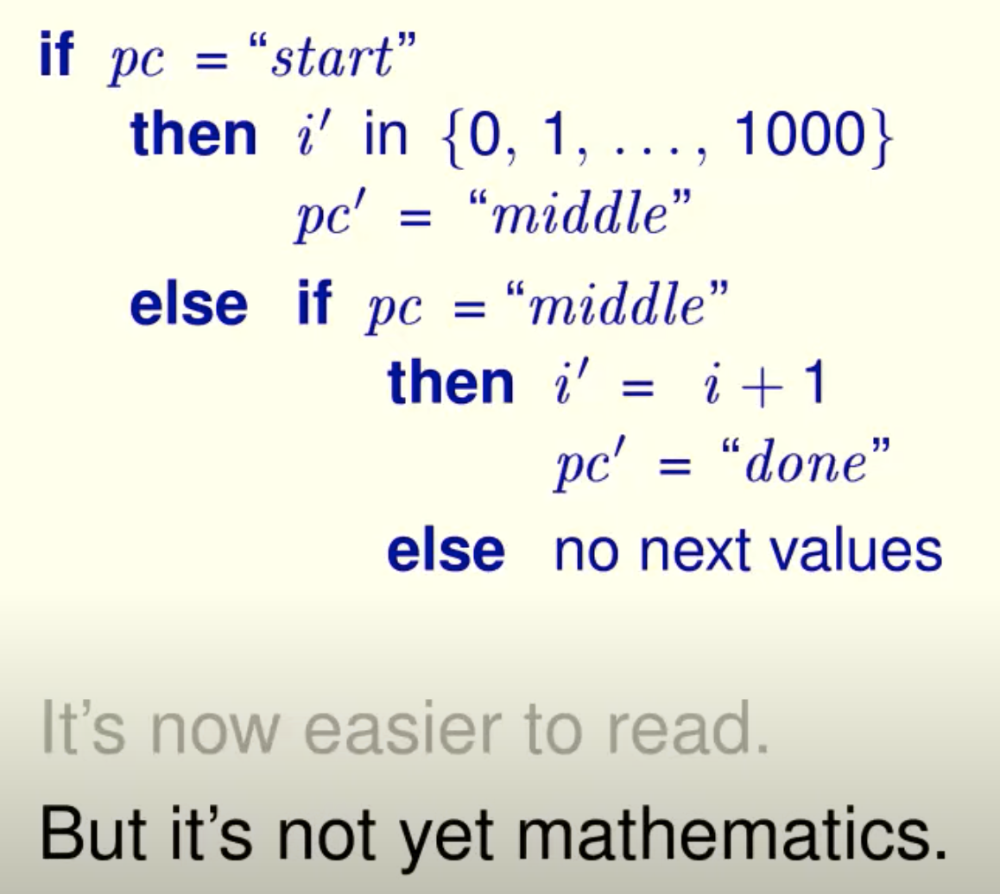
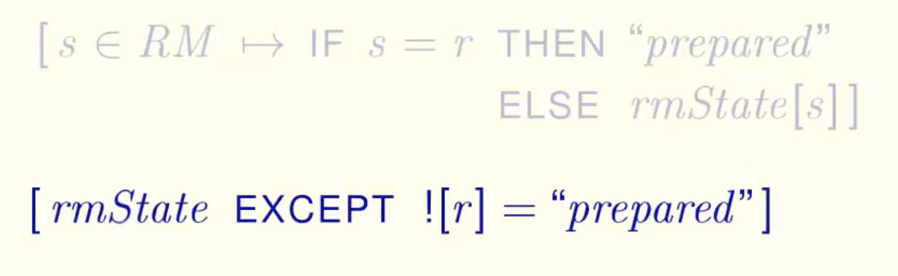
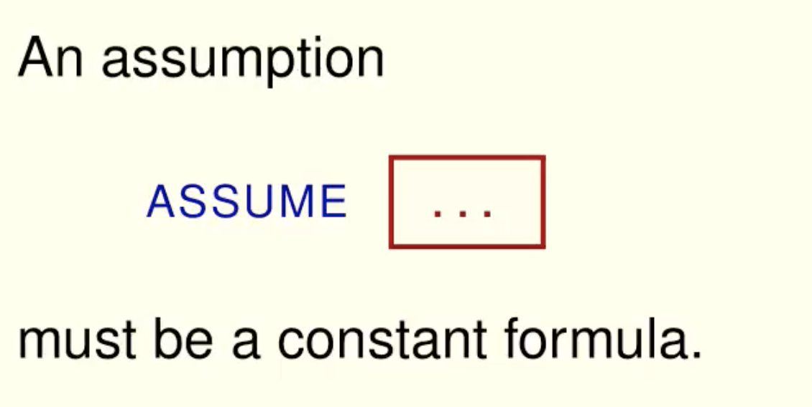
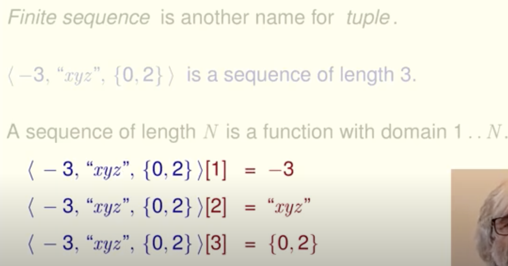
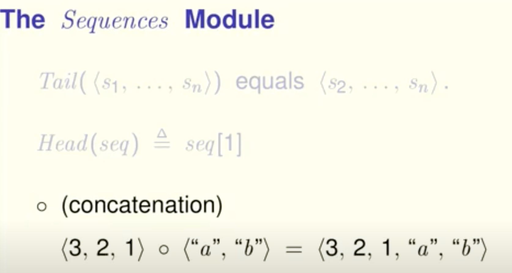
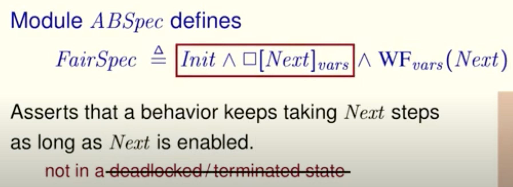

- TLA+的底层基本抽象
	- An execution of a system is represented as a sequence of discrete steps
		- 一个系统的执行被表示为一系列离散的步骤
		- sequence
		- discrete
			- Digital system
				- We can abstract its continuous evolution as a sequence of discrete events
					- 我们可以把它的 连续演变 抽象为一系列 离散事件
		- step
			- TLA+ describe a step as a state change
				- 状态变化
				- An execution is represented as a sequence of states
				- A step is the change from one state to the next
			- Science models systems by a state changing with time, usually continuously
				- 科学通过一种随时间变化的状态(通常是连续的)来模拟系统
			- As in science, TLA+ describes a state as an assignment of values to variables
				- 在科学中，TLA+将状态描述为对变量赋值
- 状态机（state machine）
	- An execution of a system is represented as a behavior
	- A behavior is a sequence of states
	- We want to specify all possible of a system
	- State Machine
		- A state machine is described by
			-
			  1. All possible initial states
			-
			  2. What next states can follow any given state
		- It halts if there is no possible next state.
		- A state is an assignment of values to variables, so a state machine is described by
			-
			  0. What the variables are.
				- 变量是什么
			-
			  1. Possible initial values of variables.
				- 变量可能的初始值。
			-
			  2. A relation between their values in the current state and their possible values in the next state
				- 它们在当前状态下的值与它们在下一状态下可能的值之间的关系
	- State machine are simpler than programs
		- In a state machine, all part of the state are represented as value of variables
			- 在状态机中，状态的所有部分都表示为变量的值
		- In programs, different parts of the state are represented differently
			- example
				- The value of variables
				- The control state
				- The call stack
				- The heap
				- ...
			- They are represented differently because they are implemented differently
				- State machine eliminate those low-level implementation details
					- They provide a single simple abstraction
	- TLA+ is an elegant, expressive language for describing state machine.
- Describing a state machine with math (用数学描述状态机)
	- 演进
		- {:height 274, :width 397}
		- 
		- {:height 322, :width 378}
		- {:height 299, :width 502}
		- {:height 365, :width 391}
		- {:height 336, :width 393}
		- 
			- The big difference between math and C :
				- Math is much more expressive
				- Programming languages weren't designed to express nondeterminism (编程语言不是为了表达非确定性而设计的)
					- They lack more than constructs for nondeterminism
						- 他们缺乏的不仅仅是对非确定性的构想
					- Programming languages don't abstract above the code level
						- 他们不会在代码层之上进行抽象
	- 记住转换后的这个是数学公式（formula），符合交换律等数学性质
		- 
		- 
	- TLA+ 完整例子
		- 
		- 
- Decomposing large specs
	- Using definitions（通过定义，来模块化，减少specs理解成本）
		- 
		- 
- Why Does TLC Report Deadlock
	- Deadlock
		- Execution stopped when it wasn't supposed to.
	- Termination
		- Execution stopped when it was supposed to.
- The TLA+ proof system
	- TLA+ has constructs for writing theorems and formal proofs of those theorems.
		- TLA+构造了定理和这些定理的形式证明。
	- TLAPS is tool for checking those proofs.
-
- Getting Started on a Spec
	- The best way
		- Write a single correct behavior. Informally
-
- In TLA+, every value is a set, But TLA+ doesn't say what their elements are.
- The TLA+ syntax for an array expression
	- 
- TLA+ Terminology
	- {:height 328, :width 480}
	- Many popular programming languages allow only index sets 0 .. n
	- Math and TLA+ allow a function to have any set as its domain -- for example, the set of all integers.
- Transaction Commit
	- {:height 485, :width 442}
	- {:height 353, :width 468}
	- {:height 163, :width 499}
- Records
	- 
	- 
	- 
	- {:height 197, :width 496}
- Two-Phase Commit
	- A popular algorithm for implementing transaction commit
	- Send Messages Spec
		- The spec must describe sending messages.
		- It should specify only what's required of message passing.
		- A simple method
			- Let *msgs* be the set of messages currently in transit
		- A simpler method
			- Let *msgs* be the set of all messages ever sent.
			- A single message can be received by multiple processes.
			- A process can receive the same messages multiple times.
			- Two-Phase commit still works
	- Spec
		- 
		- 
		- 
		- 
		- 
		- 
		- 
		- 
		- 
			- After r has aborted, no RM can ever commit; and the TM should eventually take a TMAbort step.
			- In practice, r would inform the TM that it has aborted so the TM knows it should abort the transaction.
			- But the optimization isn't relevant for implementing TCommit.
		- 
		- 
	- Model Values
		- Symmetry Sets
			- 
			- 
			- TLC will check fewer states if the model sets a symmetry set to a set of model values.
	- Correctness of Two-Phase
		- Two-phase commit doesn’t just maintain the invariance of TCConsistent.
			- 两阶段提交不仅保持了TCConsistent的不变性。
		- It implements the specification of transaction commit.
			- 它实现了transaction commit的规范。
- Paxos Commit
	- The problem with two-phase commit:
		- It can hang forever if the TM fails.
	- In math, any expression equals itself.
	- Spec
	  collapsed:: true
		- 
		- 
		- 
		- 
		- 
		- 
		- 
		- 
			- 
		- 
		- {:height 234, :width 594}
		- 
		- 
		- 
		- 
			- The LET Clause makes three definitions local to the LET IN expression
		- {:height 300, :width 682}
			- The defined identifier can be only in the expression
		- 
		- 
		- 
	- it’s ok to use elements of a symmetry set in an expression assigned to another constant if the expression is symmetric in the elements of the symmetry set.
		- 如果表达式在对称集合的元素中是对称的，那么在赋给另一个常数的表达式中使用对称集的元素是可以的。
	- There’s one additional condition for symmetry sets.
		- Elements of a symmetry set, or a constant assigned elements of a symmetry set may not appear in a CHOOSE expression.
			- 对称集还有一个附加条件。
			  对称集的元素，或对称集的常量赋值元素不能出现在CHOOSE表达式中。
	- What good is checking such small models
		- Even a very small model can catch an error in an algorithm
- Implementation
	- Preliminaries
		- Logical Implication
		  collapsed:: true
			- 
		- Ordinary Expressions
			- Module-Closed Expression
			  collapsed:: true
				- 
					- 
				- 
				- 
				- 
				- 
			- Constant Expressions
			  collapsed:: true
				- 
				- 
			- An assumption
			  collapsed:: true
				- 
			- State Expressions
			  collapsed:: true
				- 
				- 
				- 
				- 
			- Action Expression
			  collapsed:: true
				- 
				- 
			- Priming a state expression
			  collapsed:: true
				- 
		- Temporal formulas
		  collapsed:: true
			- 
			- 
			- 
			- 
			- 
			- 
			- 
			- 
			- 
			- 
			- 
			- 
			- 
			- 
			- 
	- How it works
		- The theorem
		  collapsed:: true
			- 
			- 
			- 
			- 
			- 
			- 
			- 
			- 
			- 
			- 
			- 
			-
		- Stuttering
		  collapsed:: true
			- 
			- 
			- 
			- 
			- 
			- 
			- 
			- 
			- 
			- 
			- 
				- mathematical simplicity is not an end in itself.
				  it’s a sign that we’re doing things right.
					- 数学上的简单性本身并不是目的。
					  这表明我们在做正确的事情。
			-
			-
		- Termination and stopping
		  collapsed:: true
			- 
			- 
			- 
			- 
			- 
			- 
			- 
			-
			-
			-
			-
- The Alternating Bit Protocol
	- Finite sequence 
	  collapsed:: true
		- 
		- 
		- 
		- 
		- 
		- 
		- 
	- The Cartesian Product
	  collapsed:: true
		- 
		- 
		- 
	- What the protocol should accomplish
	  collapsed:: true
		- 
		- 
		- 
		- 
		- {:height 87, :width 500}
		- 
		-
		-
	- Safety and liveness
		- Safety Formula
		  collapsed:: true
			- 
			- 
			- 
		- Liveness Formula
		  collapsed:: true
			- 
			- 
			- 
			- 
			- 
			- 
			-
		- Weak fairness
		  collapsed:: true
			- Enabled
			  collapsed:: true
				- 
				- 
				- 
			- 
			- 
			- 
				-
				-
		- Adding Liveness To a Spec
		  collapsed:: true
			- 
			- 
			- 
			- 
			- 
			- 
			- 
			- 
			- 
			- 
			-
	- The Protocol
		- The Safety Specification
		  collapsed:: true
			- 
			- 
			-
		- Liveness
		  collapsed:: true
			- 
			- 
			- 
			- 
			- 
			- 
			- 
			- 
				- 
				- 
				- 
			-
- Implement With Refinement
	- Preliminaries
		- Recursive Definitions
		  collapsed:: true
			- 
			- 
			- 
			- 
		- Simple Substitution Law
		  collapsed:: true
			- 
			- 
			- 
			- 
			- 
			-
		- The Temporal Substitution law
		  collapsed:: true
			- 
			- 
			- 
		- The General Temporal Substitution Law
		  collapsed:: true
			- 
		- The AB2 Protocol
		  collapsed:: true
			- 
			- 
			- 
			- 
			- Model Value
				- TLC assumes a model value does not equal any value that you might expect it to be different from.
			- Liveness Of AB2
				- 
				- 
				- 
				- 
				- 
	- Refinement Mappings
		- AB2 Implements AB
			- 
			- 
			- 
			- 
				- What does it mean
				  collapsed:: true
					- 
					- 
					- 
					- 
					- 
				- How do we check it
				  collapsed:: true
					- 
					- Specifying SpecH
					  collapsed:: true
						- 
						- 
						- 
						- 
						- 
						- 
						- 
					- Checking Implementation
					  collapsed:: true
						- 
						- 
						- 
						- 
					- Simplifying Refinement
					  collapsed:: true
						- {:height 307, :width 572}
						- 
						- 
						- 
						- 
						- 
						- 
						- 
						- 
						- 
						- 
						- 
						- 
						- 
						- 
						- 
						- 
						- 
						- 
						- 
						- 
				- What we did and why
				  collapsed:: true
					- 
					- 
					- 
					- 
					- 
					- 
					- 
					- 
					- 
					-
				-
		- Imaginary variables
			- 
			- 
			- 
			- 
			- 
			- 
			- 
			- 
			- 
			- 
			- 
			-
		-
		-