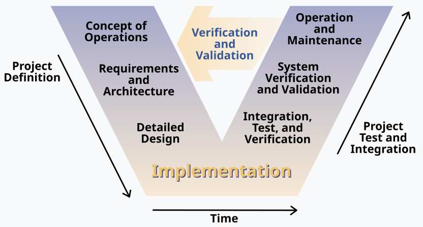

- https://en.wikipedia.org/wiki/V-model
- 
-
- V模型是系统开发生命周期的图形表示，用于创建严格的开发和项目管理模型。它主要分为三大类：
	- **德国V-Modell**：德国政府的官方项目管理方法，类似于PRINCE2但更专注于软件开发
	- **通用测试模型**：测试社区广泛使用的软件开发过程图示
	- **美国政府标准**：更详细且严格的系统开发生命周期模型
-
- 主要特点
	- V模型的结构像字母"V"：
		- 左侧代表需求分解和系统规格说明
		- 右侧代表部件集成和验证
	- 一个关键原则是左侧的工作产品必须通过右侧对应的测试活动进行验证。
-
- 确认与验证的区别
	- 该模型强调了以下区别：
		- **确认(Validation)**："你是否在构建正确的东西？" - 确保产品满足客户需求
		- **验证(Verification)**："你是否正确地构建它？" - 确保符合规格
-
- 目标
	- V模型旨在：
		- 最小化项目风险
		- 提高和保证质量
		- 降低整个系统生命周期的总成本
		- 改善利益相关者之间的沟通
-
- 应用领域
	- V模型在多种情境中使用：
		- 德国联邦行政和国防项目
		- 商业软件开发
		- 美国国防部系统工程
		- 硬件、软件和人机交互系统
-
- 优势
	- 通过变更控制委员会实现参与式维护
	- 为实施活动提供具体帮助
	- 明确定义完成工作步骤所需的事件
-
- 局限性
	- 不规范合同签订
	- 不涵盖系统运行、维护、修复或处置
	- 专注于项目级别而非组织范围的开发
-
- V模型强调需求驱动的设计和测试，确保每个设计元素和测试都可追溯到系统需求，且每个需求都由至少一个设计元素和测试来处理。
-
-
- # V模型实例应用
- ## 航空交通管制系统开发案例
  
  假设我们正在开发一个新的航空交通管制系统，以下是V模型的应用示例：
- ### 左侧（需求分解与设计）
- **用户需求规格说明**（描述用户对系统的期望和业务需求，从用户角度表达。）
	- 空管人员需要能够同时跟踪200架飞机
	- 系统必须提供冲突预警，提前5分钟发出警告
	- 界面必须允许快速路线调整
- **功能需求规格说明**（将用户需求转换为系统必须执行的具体功能，从系统角度描述行为。不涉及具体实现方式）
	- 系统应每秒更新一次雷达数据
	- 冲突检测算法必须考虑飞机速度、高度和航向
	- 用户界面需支持触摸屏和键盘输入
- **设计规格说明**（描述如何实现功能需求的技术细节和解决方案。）
	- 数据处理模块架构设计
	- 用户界面布局和流程
	- 数据库结构设计
- **编码/实现**
	- 按照设计文档进行编程
	- 组件开发
- ### 右侧（集成与验证）
- **单元测试**
	- 测试冲突检测算法准确性
	- 验证用户界面组件响应时间
- **集成测试**
	- 验证数据处理模块与雷达系统的集成
	- 测试用户界面与后端系统的交互
- **系统测试**
	- 在模拟环境中测试整个系统处理200架飞机的能力
	- 验证冲突预警功能是否正确提前5分钟发出警告
- **验收测试**
	- 空管人员在模拟环境中使用系统
	- 确认系统满足初始用户需求
- ## 验证过程示例
- **需求验证**：与空管人员一起审查需求文档，确认他们真正需要的是"提前5分钟发出冲突预警"
- **设计验证**：通过正式评审确认设计方案能满足100ms响应时间的性能需求
- **代码验证**：通过代码评审和单元测试验证冲突检测算法实现是否符合设计规格
- **系统验证**：在实验室环境中模拟200架飞机场景，验证系统能否准确预测冲突并及时报警
  
  每个左侧阶段的工作产品都会通过右侧对应阶段的测试活动进行验证，形成一个完整的"V"形结构，确保最终系统满足原始需求。
-