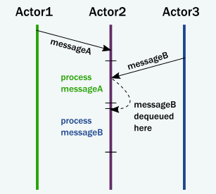

- Actor 模型如何满足现代分布式系统的需求？
	- Actor 模型抽象允许你从通信的角度来考虑你的代码
		- 在不使用锁的情况下强制封装。
		- 利用协同实体对信号作出反应、改变状态、相互发送信号的模型来驱动整个应用程序向前发展。
		- 不要担心执行机制与我们的世界观（world view）不匹配。
	- 消息传递的使用避免了锁和阻塞
	  collapsed:: true
		- Actor 不调用方法，而是互相发送消息。
			- 发送消息不会将线程的执行权从发送方传输到目标方。
			- Actor 可以发送一条消息并继续其他操作，而不是阻塞。
				- 因此，它可以在相同的时间内完成更多的工作。
		- 对于对象，当一个方法返回时，它释放对其执行线程的控制。
			- 在这方面，Actor 的行为非常类似于对象，它们对消息作出反应，并在完成当前消息的处理后执行返回。
			- 通过这种方式，Actor 实际上实现了我们设想中对象的执行方式：
				- 
		- 传递消息和调用方法之间的一个重要区别是消息没有返回值。
			- 通过发送消息，Actor 将工作委托给另一个 Actor。 正如我们在「调用栈的假象」中看到的，如果它期望返回值，那么发送 Actor 要么阻塞，要么在同一线程上执行另一个 Actor 的工作。 相反，接收 Actor 在回复消息中传递结果。
		- 我们模型中需要的第二个关键改变是恢复封装。
			- Actor 对消息的反应就像对象对调用它们的方法“反应”一样。
			- 不同之处在于，不同于多个线程“突出（protruding）”到 Actor 中并对内部状态和不变量造成严重破坏，Actor 的执行动作独立于消息的发送者，并对传入消息依次作出反应，一次一个。
			- 当每个 Actor 按顺序处理发送给它的消息时，不同的 Actor 同时工作，以便 Actor 系统可以同时处理硬件所支持的尽可能多的消息。
			- 由于每个 Actor 最多只能同时处理一条消息，因此可以不同步地保留 Actor 的不变量。这是自动发生的，不使用锁：
				- 
		- 总之，当 Actor 收到消息时会发生以下情况：
			-
			  1. Actor 将消息添加到队列的末尾。
			-
			  2. 如果 Actor 没有执行计划，则将其标记为准备执行。
			-
			  3. 一个（隐藏的）调度程序实体获取 Actor 并开始执行它。
			-
			  4. Actor 从队列前面选择消息。
			-
			  5. Actor 修改内部状态，向其他 Actor 发送消息。
			-
			  6. Actor 没有预约（unscheduled）。
		- 为了完成上面的行为，Actors 有：
			- 一个邮箱（消息结束的队列）。
			- 一个行为（Actor 的状态、内部变量等）。
			- 消息（表示信号的数据片段，类似于方法调用及其参数）。
			- 一个执行环境（一种机制，它让具有消息的 Actor 对其消息处理代码作出反应并调用它们）。
			- 一个地址（稍后将详细介绍）。
		- 消息进入 Actor 邮箱。Actor 的行为描述了 Actor 如何响应消息（如发送更多消息和/或更改状态）。执行环境协调线程池以完全透明地驱动所有这些操作。
		- 这是一个非常简单的模型，它解决了前面列举的问题：
			- 通过将执行与信号分离（方法调用转换执行权，消息传递不这样做），可以保留封装。
			- 不需要锁。
				- 修改 Actor 的内部状态只能通过消息来实现，一次处理一条消息，在试图保持不变时消除竞争。
			- 任何地方都没有使用锁，发送者也不会阻塞。
				- 数百万个 Actor 可以有效地安排在十几个线程上，从而充分发挥现代 CPU 的潜力。
				- 任务委托是 Actor 的天然执行方式。
			- Actor 的状态是本地的而不是共享的，更改和数据通过消息传播，消息是映射到现代内存架构的实际工作方式。
				- 在许多情况下，这意味着只传输包含消息中数据的缓存线，同时将本地状态和数据缓存在原始核心上。
				- 相同的模型可以完全映射到远程通信中，其中状态保存在机器的 RAM 中，更改/数据作为数据包在网络上传播。
		-
			-
		-
	- Actor 能够优雅地处理错误情况
		- 由于我们不再拥有在相互发送消息的 Actor 之间共享的调用栈，因此我们需要以不同的方式处理错误情况。
		- 我们需要考虑两种错误：
			- 第一种情况是，由于任务中的错误（通常是一些验证问题，如不存在的用户 ID），目标 Actor 上的委派任务失败。
				- 在这种情况下，由于目标 Actor 封装的服务是完整的，只有任务本身是错误的。
				- 服务 Actor 应该用一条消息回复发送者，并显示错误情况。
				- 这里没有什么特别的，错误是域的一部分，因此错误也是普通消息。
			- 第二种情况是当服务本身遇到内部故障时。
				-
	-