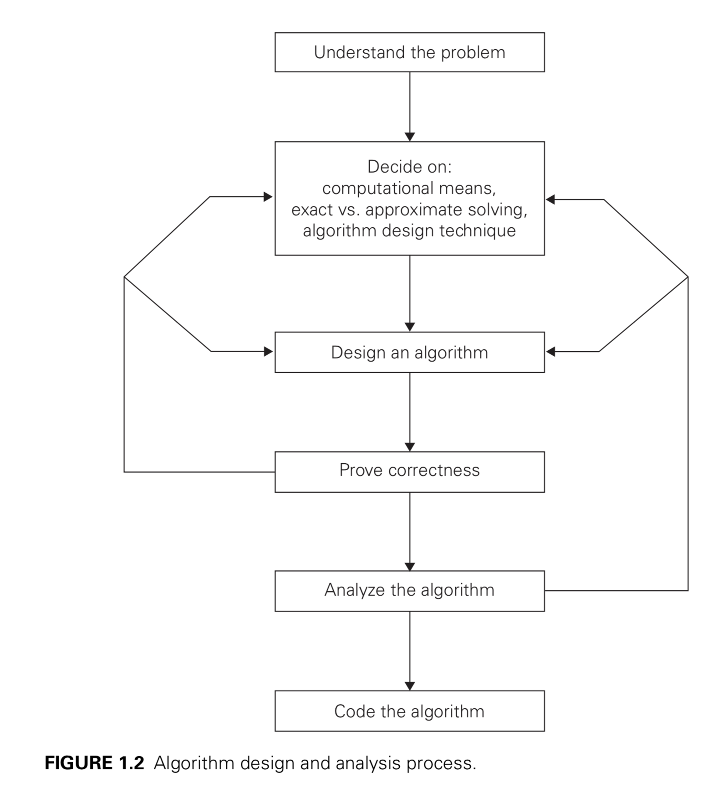

- Introduce to the design and analysis of algorithms
	- 作者提出了一种新的算法分类教学方法，不是从解决的问题种类上去分类，而是从解决问题的思路去分类，这样的教学方式能让学生更好的掌握解决问题的方式，有助于解决新问题
	- Introduction
		- 什么是 [[算法]]
			- 算法是一系列解决问题的明确指令，也就是说，对于符合一定规范的输入，能够在有限时间内获得要求的输出。
		- 算法设计与分析流程：
			- 
		- 重要的问题分类
			- 排序
			- 查找
			- 字符串处理
			- 图问题
			- 组合问题
			- 几何问题
			- 数值问题
		- 基本的数据结构
			-