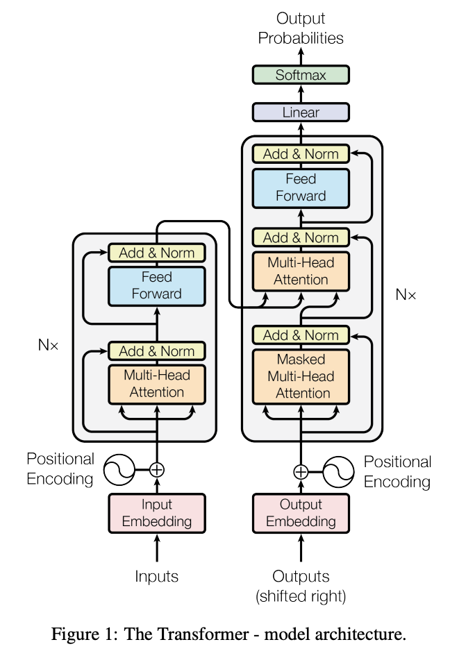
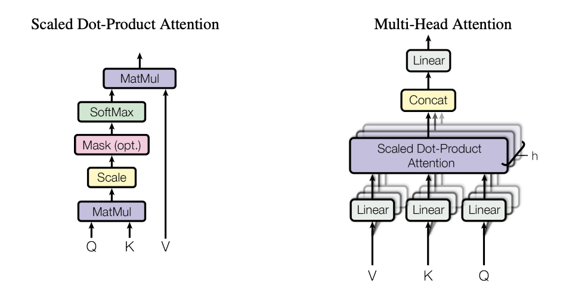
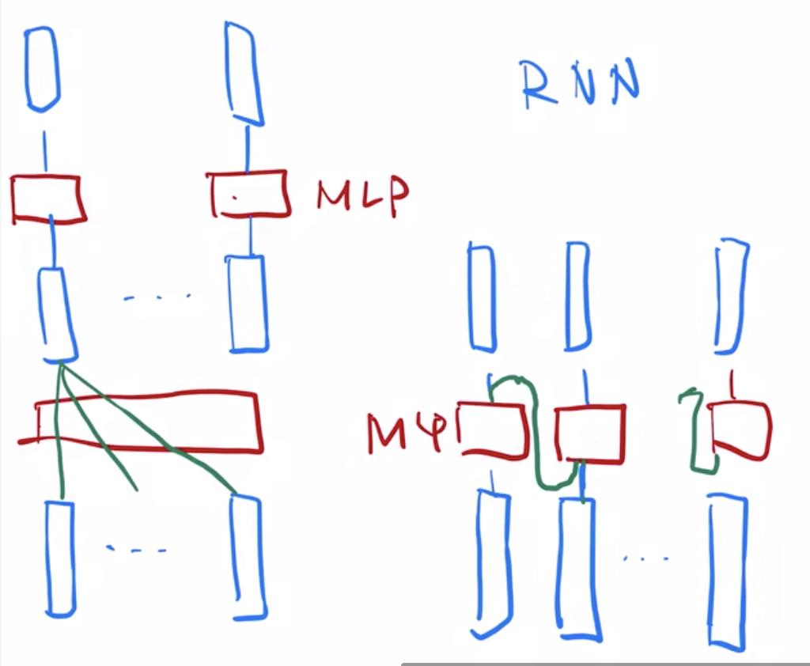
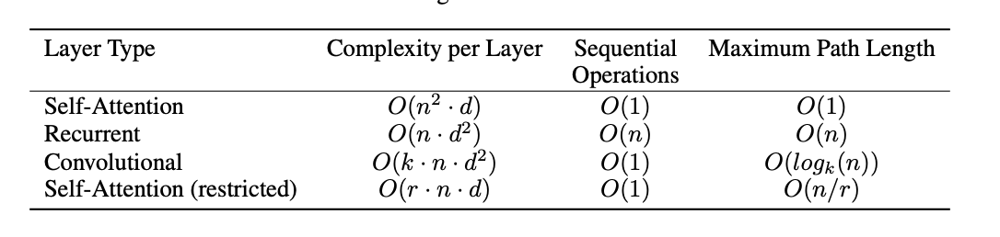
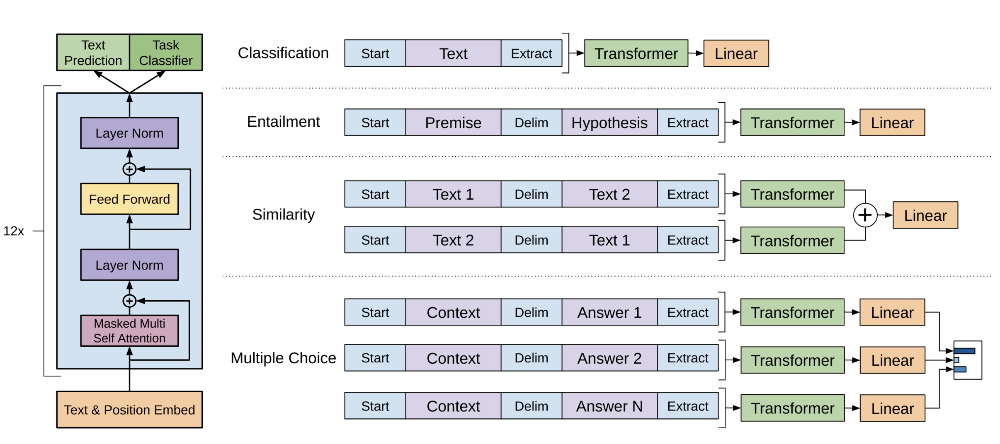

- AlexNet
	- https://papers.nips.cc/paper/2012/hash/c399862d3b9d6b76c8436e924a68c45b-Abstract.html
	- 深度神经网络的一个图片训练出来的最后那个向量，在语义空间里的表示特别好。
		- 相似的图片真的会把它放在一起
			- {:height 361, :width 485}
		- 这是一个非常好的特征，非常适合用后面的机器学习，一个简单的分类器就能做的特别好。
			- 这也是深度学习的一大强项
	- 用原始的rgp图片做输入，不需要特征提取。
		- end to end 的卖点
- Transformer
	- {:height 512, :width 365}
	- 
	- 多头注意力机制，有点像在卷积神经网络里面，有多个输出通道的感觉
	- Transfromer与RNN的对比
		- {:height 404, :width 485}
	- 时序信息编码
		- 构建表示位置的向量与输入相加
	- 计算复杂度对比
		- 
		- Attention对模型的假设做了更少，需要更大的模型，更多的数据，才能训练出来。
- GPT
	- 现在没有标号的数据上，训练一个预训练模型（语言模型）
	- 然后在有标号的数据上，微调一个模型
		- 这里是对每一个不同类型的任务，都需要微调一个模型
		- 不管输入形式怎么变，输出的构造怎么变，中间的Transfromer模型是不会变的
			- 
- GPT2
	- zero Shot
		- 不需要下游任务的
	-
	-