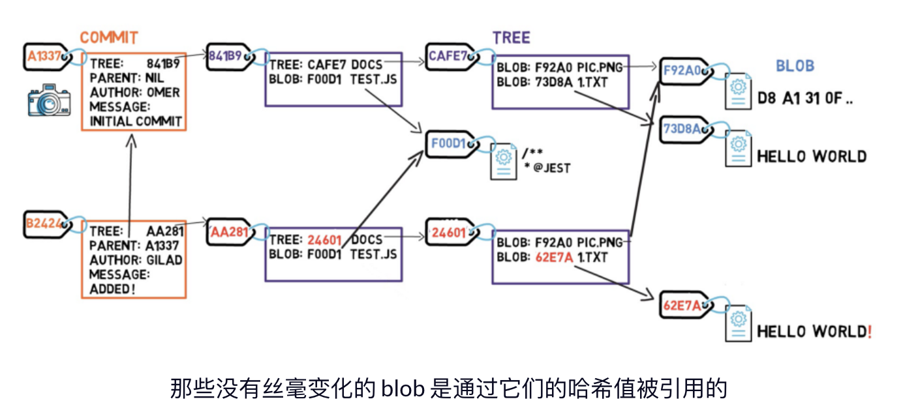

- Git 内部原理图解——对象、分支以及如何从零开始建仓库
	- 来源：
		- https://www.freecodecamp.org/chinese/news/git-internals-objects-branches-create-repo/
	- Git 对象——blob、tree 和 commit
		- 将 `git` 看成一个文件系统（尤其是该系统的实时快照）是很有用的。
			- 一个文件系统从 *根目录（root directory）* 开始（在基于 UNIX 的系统中是 `/`），通常也会包含其它的目录（例如 `/usr` 或 `/bin`）。这些目录会包含其它的目录和（或）文件（例如 `/usr/1.txt`）。
		- 在 `git` 中，文件的内容存储在一些被称为 **blob** （二进制大对象）的对象中。
			- **blob** 与文件的不同在于，
				- 文件还会包含元数据（meta-data）。例如一个文件会“记住”它的创建时间，如果你把它移动到另一个目录，它的创建时间是不会改变的。
				- 相反，**blob** 只是内容——数据的二进制流。除了内容以外，**blob** 不会记录它的创建时间、名字或任何其它东西。
			- `git` 中的 **blob** 通过 [SHA-1 哈希值](https://en.wikipedia.org/wiki/SHA-1) 唯一标识。SHA-1 哈希值由 20 个字节（byte）组成，通常表示成 40 个十六进制形式的字符。
				- 
		- 在 `git` 中，**树对象（tree）** 相当于目录。一个 **树对象** 基本上就是一个目录列表，它引用着 **blob** 和其它的 **树对象**。
			- **树对象** 也用 SHA-1 哈希值唯一标识，它通过其它对象（**blob** 或 **树对象**）的 SHA-1 哈希值引用它们。
				- 
			- 这张图相当于一个文件系统，这个文件系统有一个根目录，根目录下有一个位于 `/test.js` 的文件和一个名为 `/docs` 的目录，`/docs` 目录下有两个文件：`/docs/pic.png` 和 `/docs/1.txt`。
				- 
		- 在 `git` 中，一个快照就是一个 **提交（commit）**。
			- 即捕获该文件系统的一个快照，把那个时刻存在的所有文件连同它们的内容保存下来。
			- 一个 **提交** 对象包括一个指向主要 **树对象**（根目录）的指针和一些像 **提交者**、**提交信息** 和 **提交时间** 这样的元数据。
			- 在大多数情况下，一个 **提交** 还会有一个或多个父 **提交**——之前的快照。
			- 当然，**提交** 对象也通过它们的 SHA-1 哈希值唯一标识。
				- 这些哈希值就是我们使用 `git log` 命令时看到的那些哈希值。
			- 
		- 每个 **提交** 都持有 *完整的快照*，并不只是与之前 **提交** 之前的差异。
			- 那么它是怎么工作的呢？难道它不代表我们每次提交都必须保存很多数据吗？
			- 让我们来看看改变一个文件的内容会发生什么。
				- 
				- 
				- 
			- 几乎做好创建一个新 **提交** 对象的准备了，我们好像会再一次保存很多的数据——整个文件系统。但是真的有必要这么做吗？
				- 实际上，一些对象（尤其是 **blob** 对象）相比起之前的提交来说没有任何改变——**blob F92A0**仍然原封不动，**blob F00D1** 也一样。
			- 这就是其中的秘诀——只有对象改变了，我们才再次保存它。
				- 在这个例子中，我们不需要再次保存 **blob F92A0** 和 **blob F00b1**。我们只需要通过它们的哈希值引用它们，然后我们可以创建 **提交** 对象。
			- 由于这次 **提交** 不是第一次 **提交**，所以它有一个父节点——**commit A1337**。
				- {:height 293, :width 624}
		- 让我们思考一下这些对象的哈希值吧。
			- 如果我写了 `git is awesome!` 并从它创建了一个 **blob**。你也在自己的系统上这么做，我们会有相同的哈希值吗？
				- 答案是肯定的。因为这两个 **blob** 有相同的内容，自然也会有相同的 SHA-1 哈希值。
			- 如果我创建了一个引用 `git is awesome!` 这个 **blob** 的 **树对象** ，赋给它一个特定的名字和元数据，你也在自己的系统上重复我的操作。我们会有相同的哈希值吗？
				- 答案还是肯定的。因为这两个 **树对象** 是相同的，它们会有同样的哈希值。
			- 如果我创建了一个指向那个 **树对象** 的 **提交对象**，提交信息为 `Hello`，你也在自己的系统上重复了一遍这个操作，结果会怎样呢？我们的哈希值还会相同吗？
				- 这个时候的答案是否定的。即使我们的 **提交对象** 指向了相同的 **树对象**，它们也会有不同的 **提交详情**——时间、提交者，等等。
	- Git 中的分支
		- **分支（branch）只不过是提交对象的命名引用**。
			- 我们可以一直用 SHA-1 哈希值引用一个 **提交**，但是人们通常喜欢以其他形式命名对象。
			- **分支** 恰好是引用 **提交** 的一种方式，实际上也只是这样。
		- 在大多数仓库中，主线开发都是在一个叫做 `master` 的分支上完成的。
			- `master` 只是一个名字，它是在我们使用 `git init` 命令的时候被创建的。
			- 正因为如此，它被广泛使用。
			- 然而，它并不特别，我们可以用任何我们喜欢的名字代替它。
		- 通常，分支指向的是当前开发线上的最近一次 **提交**。
			- {:height 424, :width 449}
		- 我们通常使用 `git branch` 命令创建一个新分支，而我们实际创建的却是另一个指针（pointer）。
			- 假设我们使用 `git branch test` 命令创建了一个名为 `test` 的分支，我们实际上是创建了另一个指针，它指向当前分支上的同一 **提交**。
		-