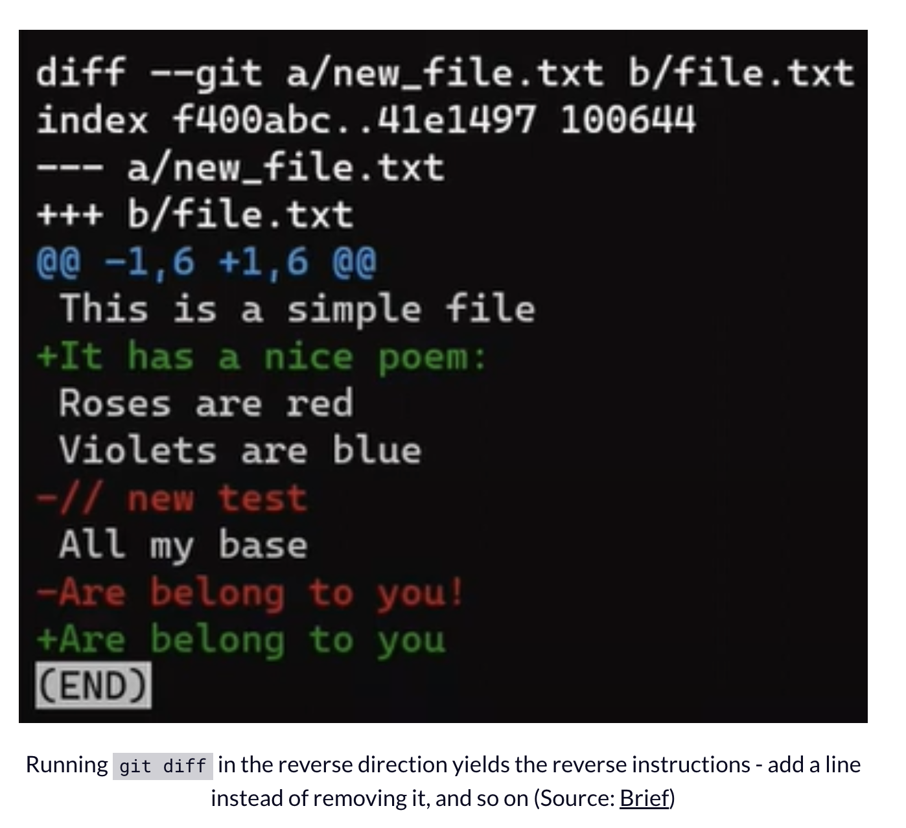

- Git 内部原理图解——对象、分支以及如何从零开始建仓库
  collapsed:: true
	- 来源：
	  collapsed:: true
		- https://www.freecodecamp.org/chinese/news/git-internals-objects-branches-create-repo/
	- Git 对象——blob、tree 和 commit
		- 将 `git` 看成一个文件系统（尤其是该系统的实时快照）是很有用的。
			- 一个文件系统从 *根目录（root directory）* 开始（在基于 UNIX 的系统中是 `/`），通常也会包含其它的目录（例如 `/usr` 或 `/bin`）。这些目录会包含其它的目录和（或）文件（例如 `/usr/1.txt`）。
		- 在 `git` 中，文件的内容存储在一些被称为 **blob** （二进制大对象）的对象中。
			- **blob** 与文件的不同在于，
				- 文件还会包含元数据（meta-data）。例如一个文件会“记住”它的创建时间，如果你把它移动到另一个目录，它的创建时间是不会改变的。
				- 相反，**blob** 只是内容——数据的二进制流。除了内容以外，**blob** 不会记录它的创建时间、名字或任何其它东西。
			- `git` 中的 **blob** 通过 [SHA-1 哈希值](https://en.wikipedia.org/wiki/SHA-1) 唯一标识。SHA-1 哈希值由 20 个字节（byte）组成，通常表示成 40 个十六进制形式的字符。
				- 
		- 在 `git` 中，**树对象（tree）** 相当于目录。一个 **树对象** 基本上就是一个目录列表，它引用着 **blob** 和其它的 **树对象**。
			- **树对象** 也用 SHA-1 哈希值唯一标识，它通过其它对象（**blob** 或 **树对象**）的 SHA-1 哈希值引用它们。
				- {:height 248, :width 658}
			- 这张图相当于一个文件系统，这个文件系统有一个根目录，根目录下有一个位于 `/test.js` 的文件和一个名为 `/docs` 的目录，`/docs` 目录下有两个文件：`/docs/pic.png` 和 `/docs/1.txt`。
				- 
		- 在 `git` 中，一个快照就是一个 **提交（commit）**。
			- 即捕获该文件系统的一个快照，把那个时刻存在的所有文件连同它们的内容保存下来。
			- 一个 **提交** 对象包括一个指向主要 **树对象**（根目录）的指针和一些像 **提交者**、**提交信息** 和 **提交时间** 这样的元数据。
			- 在大多数情况下，一个 **提交** 还会有一个或多个父 **提交**——之前的快照。
			- 当然，**提交** 对象也通过它们的 SHA-1 哈希值唯一标识。
				- 这些哈希值就是我们使用 `git log` 命令时看到的那些哈希值。
			- {:height 162, :width 654}
		- 每个 **提交** 都持有 *完整的快照*，并不只是与之前 **提交** 之前的差异。
			- 那么它是怎么工作的呢？难道它不代表我们每次提交都必须保存很多数据吗？
			- 让我们来看看改变一个文件的内容会发生什么。
				- 
				- 
				- 
			- 几乎做好创建一个新 **提交** 对象的准备了，我们好像会再一次保存很多的数据——整个文件系统。但是真的有必要这么做吗？
				- 实际上，一些对象（尤其是 **blob** 对象）相比起之前的提交来说没有任何改变——**blob F92A0**仍然原封不动，**blob F00D1** 也一样。
			- 这就是其中的秘诀——只有对象改变了，我们才再次保存它。
				- 在这个例子中，我们不需要再次保存 **blob F92A0** 和 **blob F00b1**。我们只需要通过它们的哈希值引用它们，然后我们可以创建 **提交** 对象。
			- 由于这次 **提交** 不是第一次 **提交**，所以它有一个父节点——**commit A1337**。
				- {:height 293, :width 624}
		- 让我们思考一下这些对象的哈希值吧。
			- 如果我写了 `git is awesome!` 并从它创建了一个 **blob**。你也在自己的系统上这么做，我们会有相同的哈希值吗？
				- 答案是肯定的。因为这两个 **blob** 有相同的内容，自然也会有相同的 SHA-1 哈希值。
			- 如果我创建了一个引用 `git is awesome!` 这个 **blob** 的 **树对象** ，赋给它一个特定的名字和元数据，你也在自己的系统上重复我的操作。我们会有相同的哈希值吗？
				- 答案还是肯定的。因为这两个 **树对象** 是相同的，它们会有同样的哈希值。
			- 如果我创建了一个指向那个 **树对象** 的 **提交对象**，提交信息为 `Hello`，你也在自己的系统上重复了一遍这个操作，结果会怎样呢？我们的哈希值还会相同吗？
				- 这个时候的答案是否定的。即使我们的 **提交对象** 指向了相同的 **树对象**，它们也会有不同的 **提交详情**——时间、提交者，等等。
	- Git 中的分支
	  collapsed:: true
		- **分支（branch）只不过是提交对象的命名引用**。
			- 我们可以一直用 SHA-1 哈希值引用一个 **提交**，但是人们通常喜欢以其他形式命名对象。
			- **分支** 恰好是引用 **提交** 的一种方式，实际上也只是这样。
		- 在大多数仓库中，主线开发都是在一个叫做 `master` 的分支上完成的。
			- `master` 只是一个名字，它是在我们使用 `git init` 命令的时候被创建的。
			- 正因为如此，它被广泛使用。
			- 然而，它并不特别，我们可以用任何我们喜欢的名字代替它。
		- 通常，分支指向的是当前开发线上的最近一次 **提交**。
			- {:height 424, :width 449}
		- 我们通常使用 `git branch` 命令创建一个新分支，而我们实际创建的却是另一个指针（pointer）。
			- 假设我们使用 `git branch test` 命令创建了一个名为 `test` 的分支，我们实际上是创建了另一个指针，它指向当前分支上的同一 **提交**。
				- {:height 610, :width 596}
		- `git` 是怎么知道我们当前所在的分支呢？答案是它维护了一个名为 `HEAD` 的特殊指针。
			- 通常情况下，`HEAD` 会指向一个分支，这个分支指向一个 **提交**。有时候，`HEAD` 也能直接指向一个 **提交**，不过这不是我们的重点。
				- 
			- 活动分支（active branch）指的是我们当前所在的分支，也就是 `HEAD` 指向的分支。
			- 要将活动分支切换到 `test`，我们可以使用命令 `git checkout test`。现在我们已经能猜到这条命令真正做的事情了——它只不过是把 `HEAD` 指向的分支改成了 `test`。
				- 
			- 在创建 `test` 分支之前，我们也可以使用 `git checkout -b test`，
				- 这条命令等价于先运行 `git branch test` 创建分支，
				- 再运行 `git checkout test` 使 `HEAD` 指向新的分支。
			- 如果我们做了一些改动并使用 `git commit` 创建了一个新 **提交** 呢？这个新 **提交** 会被添加到哪个分支上呢？
				- 答案是 `test` 分支，因为它是当前的活动分支（因为 `HEAD` 指向了它）。之后，`test` 指针会移动至新添加的 **提交** 上。注意 `HEAD` 仍然指向 `test`。
					- 
				- 因此，如果我们使用 `git checkout master` 回到 master 分支，我们就让 `HEAD` 的再次指向 `master` 了。
					- 
				- 如果我们现在创建一个新的 **提交**，它就会被添加到 `master` 分支，**commit B2424** 会成为新提交的父节点。
					- 
	- 如何在 Git 中记录变化
	  collapsed:: true
		- 通常，我们在 **工作目录（working dir）** 中编写源代码。
			- **工作目录** （或 **工作树（working tree）**）可以是文件系统上的任何一个目录，它关联着一个 **仓库（repository）** 。
			- 目录内不仅包含工程的文件夹和文件，还包含一个名为 `.git` 的目录。稍后我们会再讨论 `git` 这个目录。
		- 在做了一些改动之后，我们想把这些改动记录到我们的 **仓库** 中。
			- 一个 **仓库** （缩写：**repo**）就是一系列 **提交** 的集合，每个 **提交** 都是工程 **工作树** 的归档。
			- 除了我们自己机器上的提交外，仓库也会包含他人机器上的提交。
			- **仓库** 也包含除代码文件以外的其它东西，例如 `HEAD` 指针、分支等等。
				- 
		- 你可能使用过的其它和 `git` 类似工具，但是 `git` 并不会像其它工具那样直接将变化从 **工作树** 提交到 **仓库**。相反，它会先把这些变化注册到一个被称为 **索引（index）** 或 **暂存区（staging area）** 的地方。
			- 这两个术语指的都是同一个东西，它们也经常被 `git` 的文档使用，我们将会在这篇文章中交替使用它们。
		- 当我们 `checkout` 到一个分支时，`git` 会将上一次检出到工作目录中的所有文件填充到 **索引**，它们看起来就像最初被检出时的样子。之后执行 `git commit` 时， **提交** 会在当前 **索引** 的基础上创建。
		- **索引** 允许我们精心准备每次 **提交**。
			- 举个例子，自上一次 **提交** 以来，我们的 **工作目录** 中可能有两个文件发生了变化，但是我们可能只想将其中的一个添加到 **索引**（使用 `git add`），然后使用 `git commit` 记录这一个文件的变化。
				- 
		- **工作目录** 下文件的状态不外乎有两种：**已跟踪（tracked）** 或 **未跟踪（untracked）**。
			- **已跟踪文件** 是指那些 `git` 已经知道的文件。它们要么已经在上一次快照（**提交**）中，要么已经被 **暂存（staged）**（换句话说，它们已经在 **暂存区** 中）。
			- **工作目录** 中除已跟踪文件以外的所有其它文件都属于 **未跟踪文件（untracked）**，它们既没有在上次快照（**提交**）中，也没有在 **暂存区** 中。
	- 如何设置   `.git`
	  collapsed:: true
		- **一个 git 仓库有两个主要组成部分：**
			- 一组对象——**blob**、**树对象** 和 **提交对象**。
			- 一个命名这些对象的方式——称为 **引用**。
			- 一个 **仓库** 可能还包含一些其它的东西，比如 git 钩子（hooks）。
				- 不过，仓库至少必须要有对象和引用。
		- **分支** 是引用的一种，`git` 内部将 **分支** 称为 **heads**，所以我们会为它们创建一个目录 `git\refs\heads`。
		- `HEAD` 如何实现的——它只是一个文件，文件内容描述了它所指向的分支。
	- 如何创建对象
	  collapsed:: true
		- 这个 **blob** 的哈希值为 `54f6...36`， `.git\objects` 下也多出来了一个名为 `54` 的目录，目录内有一个名为 `f6..36` 的文件。
			- 所以，`git` 实际上是使用 SHA-1 哈希值的前两个字符作为目录的名字，剩余字符用作 **blob** 所在文件的文件名。
			- 为什么要这样呢？考虑一个非常大的仓库，仓库的数据库内存有三十万个对象（**blob 对象**、**树对象** 和 **提交对象**）。从这三十万个哈希值中找出一个值会花些时间，因此，`git` 将这个问题划分成了 256 份。
			- 为了查找上面的那个哈希值，`git` 会先寻找 `.git\objects` 目录下名为 `54` 的目录，然后搜索那个目录，这进一步缩小了搜索范围。`.git\objects` 目录下最多可能会有 256 个子目录（从 `00` 到 `FF`）。
		- 创建 **blob** 这个过程通常发生在我们将一些东西添加到 **暂存区** 的时候——也就是我们使用 `git add` 的时候。
		-
	- 底层命令
	  collapsed:: true
		- git hash-object
			- 获取 **blob 对象** 的 SHA-1 哈希值
				- echo "git is awesome" | git hash-object --stdin
			- 为了真的将该 **blob 对象** 写入 `git` 的对象数据库，我们可以简单地给 `git hash-object` 加一个 `-w` 开关
		- git cat-file
			- `git cat-file -t` （`-t` 代表“type”）
				- 查看对象的类型
			- `git cat-file -p` （`-p` 代表“pretty-print”）
				- 查看对象的内容
		- git update-index
			- 把文件添加到暂存区
				- git update-index --add --cacheinfo 100644 <blob-hash> <filename>
					- 注意：`cacheinfo` 是一个[git 存储的](https://github.com/git/git/blob/master/Documentation/technical/index-format.txt)十六位的文件模式，这个模式遵循 [POSIX 类型和模式](http://pubs.opengroup.org/onlinepubs/9699919799/basedefs/sys_stat.h.html) 的布局
		- git write-tree
			- 创建一个树对象，在一个 **树对象** 中记录 **索引** 的内容
		- git commit-tree
			- 创建一个引用 **树对象** 的 **提交** 对象
				- git commit-tree <tree-hash> -m <commit message>
			- 声明这个提交的 *父提交*
				- 我们用 `git commit-tree` 命令的 `-p` 开关声明父节点
			-
			-
-
- mac下模拟git hash-object
  collapsed:: true
	- ```
	  >echo -n "hello world" > test.txt
	  >git hash-object test.txt
	  95d09f2b10159347eece71399a7e2e907ea3df4f
	  >printf "blob %s\0" "$(stat -f "%z" test.txt)" | cat - test.txt | openssl dgst -sha1
	  (stdin)= 95d09f2b10159347eece71399a7e2e907ea3df4f
	  ```
- 根据hash获取文件路径
  collapsed:: true
	- ```
	  git rev-list --all --objects | grep <sha1-hash>
	  ```
- Git对象打包（Packfiles）：
  collapsed:: true
	- 为了节省空间和提高性能，Git 会定期把许多小的对象文件打包到一起，形成一个大的 "packfile"。打包后的对象不再以单独的文件形式存在于 `.git/objects/` 目录下，而是存在于 `.git/objects/pack/` 目录下的一个 packfile 中。你可以使用 `git verify-pack` 命令来查看 packfile 的内容。
	- 如果你需要查看某个具体对象的内容，你可以使用 `git cat-file` 命令，例如
		- ```
		  git cat-file -p 25fd71335b3ddbeaeedc9b869647edfc515173f7
		  ```
	- 如何查看hash在哪个packfile中
		- ```
		  for pack in .git/objects/pack/*.idx; do
		    git verify-pack -v $pack | grep 25fd71335b3ddbeaeedc9b869647edfc515173f7 && echo $pack
		  done
		  ```
	- Packfile 的原理可以分为以下几个部分：
		- **打包**：当 Git 需要创建一个新的 packfile 时（例如在执行 `git gc` 命令时），它会将许多小的对象打包成一个大的 packfile。这个过程包括查找和打包那些没有被其他 packfile 包含的对象。
		- **差分压缩**：在打包的过程中，Git 会尽量使用一种叫做 "差分压缩"（delta compression）的技术。这种技术的原理是，只存储一个对象相对于另一个对象的差异，而不是存储每个对象的完整内容。这种技术对于版本控制系统非常有效，因为在版本控制系统中，很多版本的文件都和其他版本的文件非常相似。
		- **索引**：每个 packfile 都有一个对应的索引文件（.idx 文件）。这个索引文件包含了 packfile 中每个对象的哈希值和在 packfile 中的位置。当 Git 需要查找一个对象时，它会首先查找这个对象的哈希值在哪个索引文件中，然后根据索引文件中的信息在对应的 packfile 中找到这个对象。
		- **解包**：当 Git 需要读取一个对象的内容时，如果这个对象在一个 packfile 中，Git 会首先在 packfile 的索引文件中查找这个对象的位置，然后在 packfile 中找到这个对象。如果这个对象使用了差分压缩，Git 会先找到这个对象的基对象，然后应用差异来重建这个对象的完整内容。
	- Git 的 `.idx` 文件设计得非常高效，即使在处理大量对象时也能保持高性能。有几个关键的设计选择使得 `.idx` 文件能够快速定位存储在 `.pack` 文件中的对象：
	-
		- **排序的哈希**：`.idx` 文件中的对象哈希是有序的，这允许 Git 使用二分查找算法来定位特定的对象，而二分查找是一个对数时间复杂度的操作。这意味着即使对象数量翻倍，查找时间只会增加一个常数。
		- **偏移表**：`.idx` 文件中的偏移表使得 Git 可以快速地找到对象在 `.pack` 文件中的位置。
		- **版本 2 的增强**：版本 2 的 `.idx` 文件引入了一些增强，包括对大于 4GB 的 `.pack` 文件的支持和 CRC32 校验和，这些都有助于提高 `.idx` 文件的性能和可靠性。
		- **内存映射文件**：Git 使用内存映射文件（memory-mapped files）来处理 `.idx` 文件。这意味着整个 `.idx` 文件会被映射到内存中，这使得访问 `.idx` 文件就像访问内存一样快。
-
- Git UNDO — how to rewrite Git history with confidence
  collapsed:: true
	- 来源：
		- https://medium.com/@Omer_Rosenbaum/git-undo-how-to-rewrite-git-history-with-confidence-d4452e2969c2
	- Undoing the changes
		- git reset
		  collapsed:: true
			- `git reset --soft`
				- So the very last step you did before was to `git commit`, which actually means two things — Git created a commit object, and moved `main`, the active branch.
				- To undo this step, use the command `git reset --soft HEAD~1`.
					- This command asks Git to change whatever `HEAD` is pointing to.
					- However, this command did **not **affect the state of the index or the working tree.
				- 
			- `git reset --mixed`
				- (note: `--mixed` is the default switch for `git reset`).
				- This command starts the same as `git reset --soft HEAD~1`. Meaning it takes the pointer of whatever `HEAD` is pointing to now, which is the `main` branch, and sets it to `HEAD~1`
				- Next, Git goes further, effectively undoing the changes we made to the index.
					- That is, changing the index so that it matches with the current `HEAD`, the new `HEAD` after setting it in the first step.
				- 
			- `git reset --hard`
				- Go ahead and run `git reset --hard HEAD~1`
					- Again, Git starts with the `--soft` stage, setting whatever `HEAD` is pointing to (`main`), to `HEAD~1` (“Commit 1”).
					- Next, moving on to the `--mixed` stage, matching the index with `HEAD`. That is, Git undoes the staging of `2.txt`.
					- It is time for the `--hard` step, where Git goes even further and matches the working dir with the stage of the index.
						- In this case, it means **removing `2.txt` also from the working dir.**
						- (Note: in this specific case the file is *untracked* so it won’t be deleted from the file system, it isn’t really important in order to understand `git reset` though)
							- 在Git中，"untracked file"指的是那些存在于你的工作目录中，但并未被纳入Git追踪的文件。换句话说，这些文件在你的Git仓库的历史记录中没有出现过。这可能是因为这些文件是新创建的，或者是在`.gitignore`文件中明确指定不进行追踪的。
							- 当你执行`git reset --hard`命令时，Git会重置你的工作目录和索引(index)以匹配HEAD。但是，此命令不会影响未跟踪的文件。因此，如果一个文件是"untracked"的，即使你执行了`git reset --hard`，该文件仍然会保留在你的工作目录中。
					- 
			-
		- git cherry-pick
		  collapsed:: true
			- This command takes the changes introduced in the specified revision, and apply them to the active commit.
			- It also creates a new commit object, and updates the active branch to point to this new object.
			- 
			-
			- 
			- In the example above I specified the SHA-1 identifier of the created commit, but you could also use `git cherry-pick main`, as the commit whose changes we are applying is the one `main` is pointing to.
			- Note that `git cherry-pick` actually computes the difference between the specified commit and its parent, and then applies them on the active commit.
				- This means that sometimes, Git won’t be able to apply those changes as you may get a conflict, but that’s a topic for another post.
				- Also note that you can ask Git to `cherry-pick` the changes introduced in any commit, not only commits referenced by a branch.
		- git revert
		  collapsed:: true
			- 
			- 
			- This command takes the commit you’re providing it with, compute the Diff from its parent commit, just like `git cherry-pick`, but this time it computes the reverse changes.
				- So if in the specified commit you added a line, the reverse would delete the line, and vice versa.
			- `git revert` created a new commit object, which means it’s an addition to the history.
				- By using `git revert` you didn’t rewrite history.
				- You admitted your past mistake, and this commit is an acknowledgement that you made had a mistake and now you fixed it.
					- Some would say it’s the more mature way.
					- Some would say it’s not as clean a history you would get if you used `git reset` to rewrite the previous commit.
					- But this is a way to avoid rewriting history.
		- git reflog / git log -g
		  collapsed:: true
			- While you work with Git, whenever you change `HEAD`, which you can do by using `git reset`, but also other commands like `git switch` or `git checkout`, Git adds an entry to the `reflog`.
				- 
			- So such as Git uses `HEAD~1` to get to the first parent of `HEAD`, and `HEAD~2` to refer to the second parent of `HEAD` and so on, Git uses `HEAD@{1}` to refer to the first reflog parent of `HEAD`, where `HEAD` pointed to in the previous step.
			- We can also ask `git rev-parse` to show us its value:
				- 
			- Another way to view the `reflog` is by using `git log -g`, which asks `git log` to actually consider the `reflog` :
				- 
			- So to get back to “Commit 3”, you can just use `git reset --hard HEAD@{1}` (or the SHA-1 value of “Commit 3”):
			- What would happen if I used this command again? And ran `git commit --reset HEAD@{1}`? Git would set `HEAD` to where `HEAD` was pointing before the last `reset`, meaning to “Commit 2”. We can keep going all day:
				- 
				- 每次reset都会创建一个reflog
	- The most important tool, even more important than the five tools listed in this toolbox, is **to whiteboard the current situation vs the desired one.** Trust me on this, it will make every situation seem less daunting and the solution more clear.
		- 
	-
	-
	-
-
- Git Diff and Patch - Full Handbook for Developers
  collapsed:: true
	- 来源：
		- https://www.freecodecamp.org/news/git-diff-and-patch/
	- `git diff`
		- is a command that takes two inputs, and computes the difference between them. Inputs can be commits, but also files, and even files that have never been introduced to the repository.
		- 
		- This is important – `git diff` computes the difference between two strings, which most of the time happen to consist of code, but not necessarily.
	- `patch`
		- 
		- A `diff` shows the differences between two files, or snapshots, and can be quite minimal in doing so. A `patch` is an extension of a `diff`, augmented with further information such as context lines and filenames, which allow it to be applied more widely. It is a text document that describes how to alter an existing file or codebase.
		- A `patch` consists of asymmetric instructions to get from one file to another
		- The `patch` format uses context, as well as line numbers, to locate differing file regions. This allows a `patch` to be applied to a somewhat earlier or later version of the first file than the one from which it was derived, as long as the applying program can still locate the context of the change.
		- 
	- The Structure of a Diff
		- 
	- How to Produce diffs
		- 
	- How to Apply Patches
		- Historical note
			- Actually, sharing patches used to be the main way to share code in the early days of open source. But now - virtually all projects have moved to sharing Git commits directly through pull requests (called "merge requests" on some platforms).
			- The biggest problem with using patches is that it is hard to apply a patch when your working directory does not match the sender's previous commit.
			- Losing the commit history makes it difficult to resolve conflicts. You will better understand it as you dive deeper into the process of `git apply`.
		- Understanding the Context Lines
			- By default, Git looks for `3` lines of context before and after each change introduced in the patch. If you take three lines before and after the added line, and three lines before and after the deleted line
			- You can ask Git to rely on fewer lines of context, using the `-C` argument. For example, to ask Git to look for `1` line of the surrounding context, run the following command:
				- `git apply -C1 new_patch.patch`
			-
-
- A Definitive Guide to Merging in Git
  collapsed:: true
	- What is a Merge in Git
		- Merging is the process of combining the recent changes from several branches into a single new commit that will be on all those branches.
		- In a way, merging is the complement of branching in version control:
			- a branch allows you to work simultaneously with others on a particular set of files, whereas a merge allows you to later combine separate work on branches that diverged from a common ancestor commit.
		- When you merge with Git, you merge **commits**.
			- Almost always, we merge two commits by referring to them with the branch names that point to them.
			- Thus we say we "merge branches" – though under the hood, we actually merge commits.
	- Time to Get Hands-on
		- fast-forward merge
			- 
			- In case you don't want that to happen, but rather you want Git to really perform a merge, you could either change Git's configuration, or run the `merge` command with the `--no-ff` flag.
				- 
	- How to perform a three-way merge in Git
		- The 3-way merge process includes these stages:
			- First, Git locates the common ancestor of the two branches.
				- That is, the common commit from which the merging branches most recently diverged.
				- Technically, this is actually the first commit that is reachable from both branches. This commit is then called the **merge base**.
			- Second, Git calculates two diffs:
				- one diff from the merge base to the first branch,
				- and another diff from the merge base to the second branch.
				- Git generates patches based on those diffs.
			- Third, Git applies both patches to the merge base using a 3-way merge algorithm.
				- The result is the state of the new, merge commit.
			- 
			- 
		- You can also understand why it's called a "3-way merge":
			- Git merges three different states
				- that of the first branch,
				- that of the second branch,
				- and their common ancestor.
			- This is unlike, say, the fast-forward examples we saw before.
				- The fast-forward examples are actually a case of a **two**-way merge, as Git only compares two states
	- How Git's 3-way Merge Algorithm Works
		- 
		- 
		- this is a 3-way merge
			- In general, if all versions agree on a line, then this line is used.
			- If `A` and the `merge base` match, and `B` has another version, `B` is taken.
			- In the opposite case, where the `merge base` and `B` match, the `A` version is selected.
			- If `A` and `B` match, this version is taken, whether the merge base agrees or not.
		- This description leaves one open question though: What happens in cases where all three versions disagree?
			- Well, that's a conflict that Git does not resolve automatically. In these cases, Git calls for a human's help.
	- How to Resolve Merge Conflicts
		- Git performs the same 3-way merge algorithm on a files level
			- 
		- `git log -p -–merge`
			- As a reminder, `git log` shows the history of commits that are reachable from `HEAD`.
			- Adding `-p` tells `git log` to show the commits along the diffs they introduced.
			- The `--merge` switch makes the command show all commits containing changes relevant to any *unmerged files*, on either branch, together with their diffs.
			- This can help you identify the changes in history that led to the conflicts
	-
		-
		-
-
- A Definitive Guide to Rebasing
	- How is   `git rebase`   Different than   `git merge` ?
		- you use `rebase` to take the changes that were committed on one branch – Paul's branch – and replay them on a different branch, `john_branch`.
			- 
	- `cherry-pick`   as a Basis for Rebase
		- `git cherry-pick`
			- a command takes a commit, computes the *patch* this commit introduces by computing the difference between the parent's commit and the commit itself,
			- and then `cherry-pick` "replays" this difference.
	- Beyond   `cherry-pick`   – How to Use   `git rebase`
		- You can look at `git rebase` as a way to perform multiple `cherry-pick`s one after the other – that is, to "replay" multiple commits.
			- This is not the only thing you can do with `rebase`, but it's a good starting point for our explanation.
		- To understand the process, I will provide the high level view, and then dive deeper into each step. The process of rebasing one branch on top of another branch is as follows:
			- 1. Find the common ancestor.
			- 2. Identify the commits to be "replayed".
			- 3. For every commit `X`, compute `diff(parent(X), X)`, and store it as a `patch(X)`.
			- 4. Move `HEAD` to the new base.
			- 5. Apply the generated patches in order on the target branch. Each time, create a new commit object with the new state.
	- Time to Get Hands-On with Rebase
		- 
		- ```
		  git checkout paul_branch
		  git rebase john_branch
		  ```
		- 
	- Advanced Rebasing in Git
	  collapsed:: true
		- wants it to seem as if he introduced the changes in "Commit 7" and "Commit 8" as a single commit.
			- 
			- you can use an **interactive** rebase. To do that, we add the `-i` (or `--interactive`) switch to the `rebase` command:
				- ```
				  git rebase -i main
				  ```
			- `squash`. A *squashed* commit will have its contents "folded" into the contents of the commit preceding it. So in our case, Paul would like to squash "Commit 8" into "Commit 7":
			- 
			- 
			- 
		- How to Use the   `--onto`   Switch of   `git rebase`
			- 
			- 
			- ```
			  git rebase -–onto <SHA_OF_COMMIT_11> main new_branch
			  ```
		- How to rebase on a single branch
			- 
			- 
			- ```
			  git rebase --interactive --onto <SHA_OF_COMMIT_15> <SHA_OF_COMMIT_15>
			  ```
			- 
			- 
		-
	-
-
- git-subtrac
  collapsed:: true
	- https://github.com/apenwarr/git-subtrac
	- git submodules存在的一些问题
	  collapsed:: true
		- 自Git最早的日子以来，Git submodule一直非常复杂且难以使用，而且没有太大的改进。这些复杂性源于一些主要的设计问题：
			- submodule的内容来自其他Git仓库，这些仓库可能会在没有警告的情况下移动位置，或者被rebase、delete等，导致您自己的仓库不再可用。
				- 至少，使用多个上游仓库使得fork项目并进行广泛更改变得困难：
					- 您必须为您更改的每一个子仓库fork，然后更新.gitmodules链接，告诉所有人如何获取您的更改等。
					- 结果是，submodule迫使人们集中在单个上游仓库上。
			- 在你的git仓库内部，submodule的链接是指向commit的链接，不是指向tree的链接。
				- 这个特性非常强大（"这个目录是由项目P的commit X的内容提供的"），因为它就像你把一个项目的内容复制到另一个项目的subdir中，但你仍然保留了subproject的完整历史。
				- 不幸的是，这种能力将git已经复杂的历史管理（很少有人理解）变得更为复杂。
					- subproject有（我们希望）一个始终向前移动的历史（commit总是在顶部添加）而你的主项目有一个向前发展的历史。
					- 但是你对subproject的链接可以向后移动！你可以对你的parent project进行新的commit，将subproject从commit X移动到早期的commit X-2，而不是后期的commit X+2。
					- 因此，git的所有正常fork, merge, revert, stash等算法对submodule都无效。
					- 并且，可以肯定的是，还没有人更新它们以便更好地与submodule一起工作。
			- Submodule是可选的。
				- 一个早期的设计目标是让一些访问项目的人可能无法访问所有subproject中的所有commit。
					- 为了使这个工作，所有的git都被设计成在你进行常规操作时不会干扰submodule的链接，并且在submodule链接丢失时不会中断。
					- 所以很容易犯下这样的错误，比如在你对parent project进行更改推送时忘记将你对submodule的更改也推送，从而使其他人无法再check out你的parent code。
	- How does git-subtrac work
	  collapsed:: true
		- git-subtrac借鉴了我早期的git-subtree项目的一些技巧，但在设计上更加以submodule为中心。
		- 背景知识补充
			- 你需要知道的主要事情是，
				- 与git中的所有其他类型的对象不同，git tree中的"submodule"引用并不会导致引用的对象（一个commit）被包含在git object packs中，或者与你的branch一起被推送。
					- 换句话说，当你向你的项目中添加一个文件（blob）或子目录（tree），然后将它提交到一个branch，然后推送那个branch，commit永远不会在不包含它引用的trees和blobs的副本的情况下被发送。
					- 但是，如果你的tree链接到一个commit - 这就是submodule的全部，一个tree链接到一个commit而不是到另一个tree或blob - 那么git push并不会打包subcommit或者它下面的任何东西。它假设你会自己推送那个commit。
					- 这就是所有问题的来源。
			- 你需要知道的第二件事是，
				- 如果一个commit（比如，X）被引用为另一个commit（比如，Y）的parent，那么当你将commit Y推送到某个地方时，它总会确保X也在那里（要么通过检查它是否已经存在，要么将它与Y一起打包）。
					- 这是递归的，所以如果你将你的commit历史的HEAD推送到某个地方，那么所有基于它的commit - 以及那些commit引用的所有trees和blobs - 都会跟随它一起被推送。
					- 这是正常的，当然，如果这不起作用，你会感到非常惊讶。
			- 同样相关的是，一个commit可以有多个parent commit。
				- 当你做一个merge时，你的"merge commit"至少有两个parent。这个用法并不常见，但一个单独的commit可以有任意多的parents。你可以一次性将一堆branch合并在一起。
		- 以下是我们要做的：
			- git-subtrac会浏览你的主项目中所有commit的所有tree，找到所有的submodule链接（即，链接到commit对象的链接）。
			- 然后，它会创建一个新的、平行的历史，在这个历史中，每一个commit的"parent commits"不仅包含"真实的"parent(s)，还包括那个commit的tree中引用的commit。
				- 换句话说，如果你有一个基于X的commit Y，并且Y的文件系统包含对A、B、C的submodule链接，那么我们会生成一个新的commit Y+，它的parents是X+、A、B和C。X+是通过同样的方式生成的，通过追加X引用的submodule链接。
			- 这样，当你将Y+推送到某个地方的git服务器时，它会包含A、B和C...以及它们所有的trees、files和parents，这正如你最初可能期望的那样。
	- Features of the subtrac history branch
	  collapsed:: true
		- 这里有一些微妙之处，使得结果更加出色。
			- 首先，我们生成synthetic commit的方式是完全稳定的：
				- 任何看到一个commit Y的人（并且拷贝了它的整个历史，包括所有的submodule链接以及它们的trees、blobs和历史）都能够完全复制相同的Y+，包括修改日期、parents，甚至commit hashes。
			- 但是它的扩展性更远。
				- 一个没有commit Y，但是有commit X的人，可以生成和从Y生成Y+的人完全相同的X+。（记住，Y+依赖于X+）。
				- 如果你有Y历史的一个子集，你可以生成Y+历史的一个完美子集。
				- 这非常重要：
					- 这意味着两个不同的人，给定相同的输入，总是可以重新生成相同的git-subtrac输出。
					- 只要你拥有所有的对象，删除和从头开始重新生成subtrac branch就没有危险。
			- 其次，git-subtrac尽可能地从.trac branch中剪除冗余。
				- 它只针对commit Y（基于X）生成一个新的Y+，如果submodule链接的集合与X不同。
				- 如果submodules没有改变，那么commit Y+就是X+（不是一个新的commit）。
				- 这最小化了你的.trac branch在新的commit、rebase等中的变化。
		- 因此，我们可以免费获得以下特性：
			- 如果两个人以不同的方式扩展commit X，例如在X的基础上生成commit Y和commit Z，那么他们的subtrac trees Y+和Z+都会将X+作为parent。然后当你将Y和Z合并在一起（比如说，生成commit YZ），生成的YZ+ commit也会看起来像是Y+和Z+的git merge。这个merge可以由git就像由git-subtrac一样轻松地生成。主要的结果是，你应该总是能够将新生成的.trac branch推送到upstream，而不需要使用"force push"，因为它应该总是看起来像是上一个branch的"fast forward"，尽管实际上它每次都是从头重新生成的。
			- 想象一下，我们的项目的commit X依赖于一个submodule的commit N。由于某些原因commit N的效果不太理想，在commit Y中我们将submodule回退到commit M（N之前的一个commit）以等待submodule人员修复它。在我们对submodule的fork中，我们然后意识到我们想要应用某个其他patch Q的cherry pick，所以我们forked submodule的'master' branch看起来像M+Q。如果我们将这个新的master branch推送到我们实际的submodule repo，它会产生一个令人惊讶的问题：我们的subproject的commit Y运行得很好，因为它链接到M+Q。但是如果有人然后想要回退到我们superproject的一个更早的版本（例如，使用git bisect）并再次尝试commit X，它将不能工作！submodule repo再也不包含N，因为我们回退了submodule的master branch。
				- 在这种情况下，git-subtrac帮助很大。由于X+包括N，Y+包括M+Q，所以两个submodule链接的集合都包含在.trac branch中。我们成功地跟踪了submodules的"历史的历史"。
			- 同样，使用submodules的一个常见用途是维护用于发送upstream的patch队列。
				- 也就是说，我们拉取一个submodule项目（一个库）的某个版本，并开始改进它，用我们的superproject（一个app）测试我们的patches，直到我们确定它们真的能工作。当我们感觉有信心时，我们想要将subproject rebase到最新版本，并在发送给subproject的维护者之前在顶部应用我们的patches。在传统的submodule设置中，我们必须非常小心不要在rebase submodule的master branch时丢失旧的历史。使用git-subtrac，这一切都像你希望的那样工作：当你需要它们时，旧的和新的patch历史都是可用的。
			- 现在，fork一个superproject（例如，在github上）会带着它所有的submodule历史一起，使得pull request非常容易。（如果你想通过这种方式分享你的submodule patches，我猜你可以提交一个针对.trac branch的pull request。）
	- 使用git-subtrac的注意事项
	  collapsed:: true
		- 由于submodule的奇怪行为，使用git subtrac需要禁止git submodule去莫名其妙访问远程
			- 即先git clone 后，要调整submodule.*.url=.（即调整到本地），然后再执行submodule update
			- 这样才能拉到自己没有push到submodule远程，但存在于主仓库远程的commit
-
- GIT查看对象类型
  collapsed:: true
	- git cat-file -t 9dacb64b
-
- git stash
  collapsed:: true
	- `git stash` 是用于临时保存工作目录和暂存区更改的命令，这样你就可以在同一分支上切换到不同的任务。
	- `git stash` 在有暂存区的更改和工作目录的更改时会创建两个 commit 对象：一个针对工作目录的更改，另一个针对暂存区的更改。
		- 这两个 commit 是有父子关系的，其中 "worktree commit" 是子 commit，"index commit" 是父 commit。
		- 如果只有工作目录的更改，`git stash` 则只会创建一个 commit。
	- `git stash` 默认不会处理未被追踪的文件（即那些在工作目录中新添加但未执行 `git add` 的文件）。
		- 你可以使用 `git stash -u` 或 `git stash --include-untracked` 命令来包含未被追踪的文件，或者使用 `git stash --all` 来处理所有的更改（包括未被追踪的文件和被 `.gitignore` 忽略的文件）。
	- `git stash apply` 和 `git stash pop` 都可以用于将暂存的更改应用到工作目录，
		- 但它们之间存在一个关键的区别：
			- `git stash apply` 将更改应用到工作目录，但不会从 stash 列表中删除相应的条目；
			- `git stash pop` 也将更改应用到工作目录，但它将从 stash 列表中删除相应的条目。
	- `git stash drop` 是一个命令，用于从 stash 列表中删除一个特定的 stash。
		- 如果不提供 stash 的名称，`git stash drop` 将删除最近的 stash。
		- 你也可以提供一个 stash 的名字，以删除特定的 stash。
-
- git fetch
  collapsed:: true
	- `git fetch` 命令会从远程库下载本地库中缺失的提交。这个命令将远程分支的引用下载到本地仓库，但它**不会**改变你的本地工作分支。如果你希望将这些变更合并到你的工作分支中，你需要显式地执行 `git merge` 或 `git rebase`。
	- 这个命令是安全的，你可以随时运行它，不必担心它会改变你的本地代码。
-
- git pull
  collapsed:: true
	- `git pull` 命令是 `git fetch` 和 `git merge` 的组合。它不仅会从远程库获取最新的提交，还会自动地合并到你的当前分支。当你的工作树是干净的（即，没有未提交的改动）时，这通常是一个快速更新本地分支的好方法。
	- 但是，如果你的本地有未提交的修改，或者你想要对合并有更多的控制，那么 `git pull` 可能就不是最佳选择了。在这种情况下，你可能首选 `git fetch`，然后决定如何手动合并或重构。
-
- git submodule
  collapsed:: true
	- submodule对应到.git里面，路径在.git/modules/{module}，里面的内容就是另一个完整的.git
	- 当你首次运行 `git submodule update` 命令时，尽管你使用了 `--no-fetch` 选项，Git 仍然会尝试从原始的远程仓库（origin repo）获取数据
		- 为了避免 Git 尝试从原始的远程仓库获取数据，你可以更改子模块的远程仓库 URL。这会"欺骗" Git，使其认为远程仓库的位置已经改变，从而避免不必要的数据获取。
	-
	-
-
- git 启动file协议：
  collapsed:: true
	- git config --global protocol.file.allow always
	-
	-