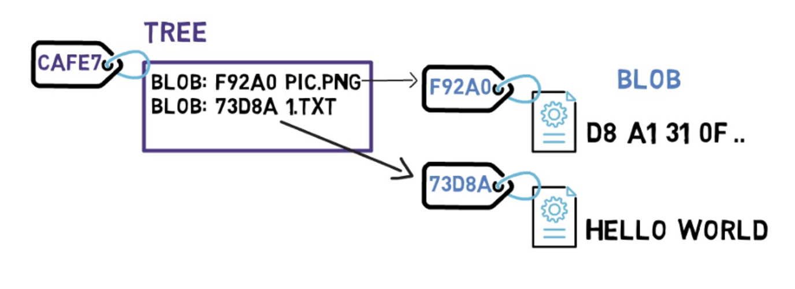

- Git 内部原理图解——对象、分支以及如何从零开始建仓库
	- 来源：
		- https://www.freecodecamp.org/chinese/news/git-internals-objects-branches-create-repo/
	- Git 对象——blob、tree 和 commit
		- 将 `git` 看成一个文件系统（尤其是该系统的实时快照）是很有用的。
			- 一个文件系统从 *根目录（root directory）* 开始（在基于 UNIX 的系统中是 `/`），通常也会包含其它的目录（例如 `/usr` 或 `/bin`）。这些目录会包含其它的目录和（或）文件（例如 `/usr/1.txt`）。
		- 在 `git` 中，文件的内容存储在一些被称为 **blob** （二进制大对象）的对象中。
			- **blob** 与文件的不同在于，
				- 文件还会包含元数据（meta-data）。例如一个文件会“记住”它的创建时间，如果你把它移动到另一个目录，它的创建时间是不会改变的。
				- 相反，**blob** 只是内容——数据的二进制流。除了内容以外，**blob** 不会记录它的创建时间、名字或任何其它东西。
			- `git` 中的 **blob** 通过 [SHA-1 哈希值](https://en.wikipedia.org/wiki/SHA-1) 唯一标识。SHA-1 哈希值由 20 个字节（byte）组成，通常表示成 40 个十六进制形式的字符。
				- 
		- 在 `git` 中，**树对象（tree）** 相当于目录。一个 **树对象** 基本上就是一个目录列表，它引用着 **blob** 和其它的 **树对象**。
			- **树对象** 也用 SHA-1 哈希值唯一标识，它通过其它对象（**blob** 或 **树对象**）的 SHA-1 哈希值引用它们。
				- 
			-
			-