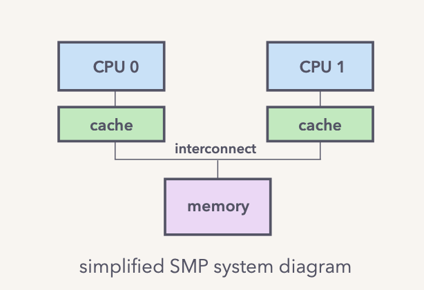
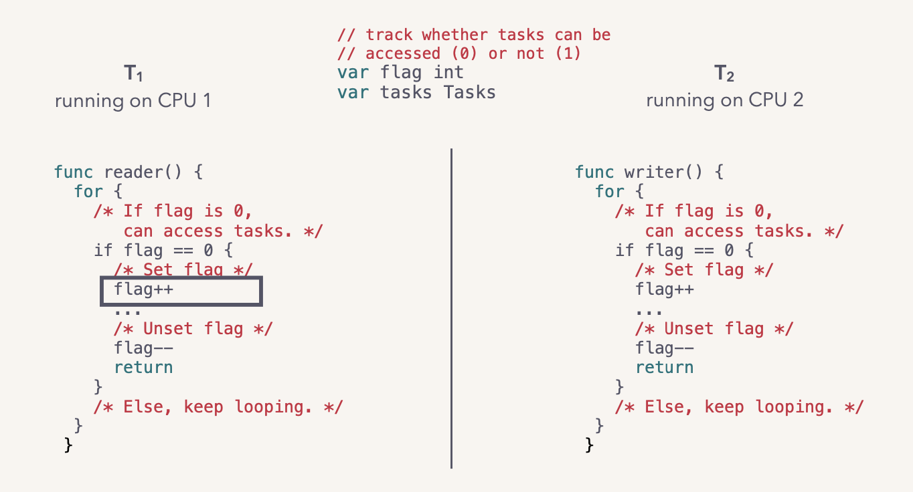
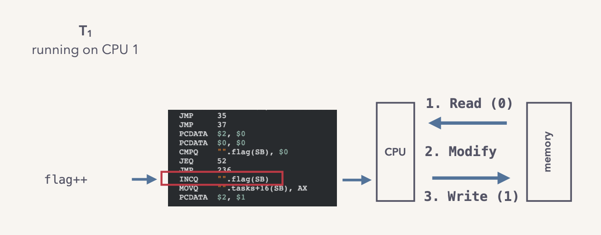
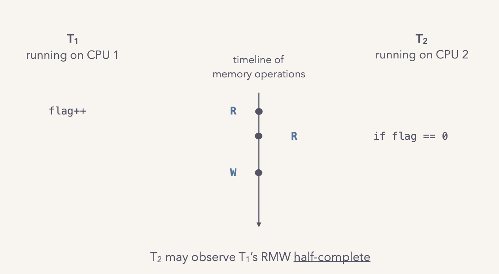
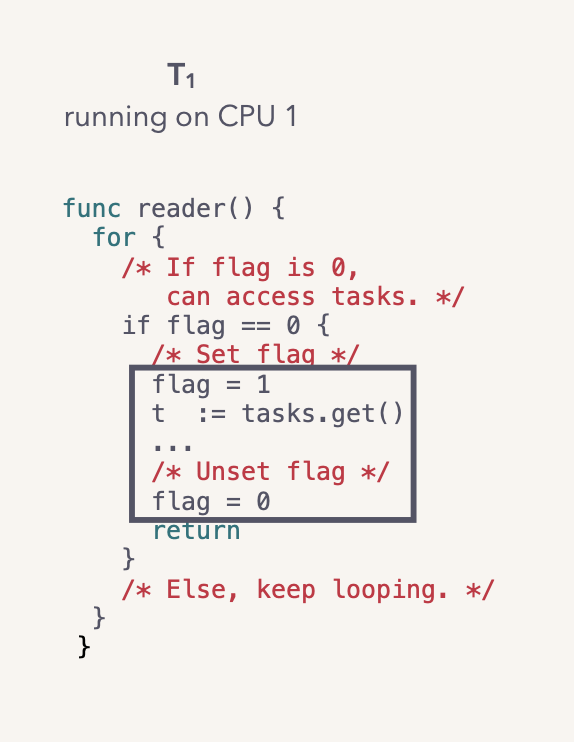
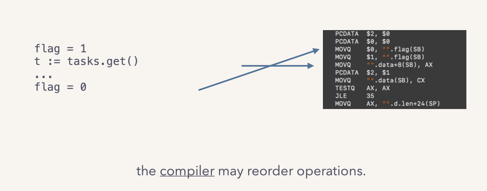
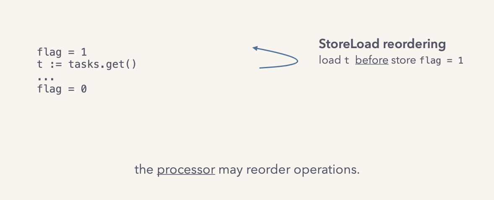

- **TAG: [[Computer Science]] **
- 相关文章
	- Let's talk locks
		- 来源：
			- https://www.infoq.com/presentations/go-locks/
		- our case-study
		  collapsed:: true
			- Lock implementations are hardware, ISA, OS and language specific:
				- We assume an **x86_64 SMP machine** running a **modern Linux**.
					- SMP System
						- {:height 263, :width 375}
				- We’ll look at the lock implementation in **Go 1.12**.
					- a brief go primer
						- The unit of concurrent execution: goroutines.
							- use as you would threads
								- ```go
								  go handle_request(r)
								  ```
							- but user-space threads:
								- managed entirely by the Go runtime, not the operating system.
							- Data shared between goroutines must be synchronized.
							- One way is to use the blocking, non-recursive lock construct:
								- ```go
								  var mu sync.Mutex
								  mu.Lock()
								  ...
								  mu.Unlock()
								  ```
				-
				-
		- let’s build a lock! (a tour through lock internals)
			- want: “[[mutual exclusion]]”
				- only one thread has access to shared data at any given time
			- use a flag?
			  collapsed:: true
				- 
				- 
				- 
			- atomicity
				- A memory operation is **non-atomic** if it can be observed half-complete by another thread.
				- An operation may be non-atomic because it:
					- uses multiple CPU instructions:
						- operations on a large data structure;
						- compiler decisions.
					- uses a single non-atomic CPU instruction:
						- RMW instructions; unaligned loads and stores.
						  collapsed:: true
							- ```
							  flag++
							  ```
				- An **atomic operation** is an “indivisible” memory access.
				- In x86_64, loads, stores that are 
 naturally aligned up to 64b.*（在x86_64中，加载、存储
自然对齐到64b）
					- guarantees the data item fits within a cache line;（保证数据项适合缓存行）
					- **cache coherency** guarantees a consistent view for a single cache line.（缓存一致性保证了单个缓存行的一致视图）
			- use a flag? nope; not atomic.
				- {:height 289, :width 222}
					- the compiler may reorder operations.
					  collapsed:: true
						- 
					- the processor may reorder operations.
					  collapsed:: true
						- 
			- memory access reordering
				- The compiler, processor can **reorder memory operations** to optimize execution.
					- The only cardinal rule is **sequential consistency for single threaded programs.**
					-
		- let’s analyze its performance! (performance models for contention)
		- let’s use it, smartly! (a few closing strategies)
			-