- **TAG: [[Computer Science]] **
- 相关文章
	- Let's talk locks
		- 来源：
			- https://www.infoq.com/presentations/go-locks/
		- our case-study
		  collapsed:: true
			- Lock implementations are hardware, ISA, OS and language specific:
				- We assume an **x86_64 SMP machine** running a **modern Linux**.
					- SMP System
						- {:height 263, :width 375}
				- We’ll look at the lock implementation in **Go 1.12**.
					- a brief go primer
						- The unit of concurrent execution: goroutines.
							- use as you would threads
								- ```go
								  go handle_request(r)
								  ```
							- but user-space threads:
								- managed entirely by the Go runtime, not the operating system.
							- Data shared between goroutines must be synchronized.
							- One way is to use the blocking, non-recursive lock construct:
								- ```go
								  var mu sync.Mutex
								  mu.Lock()
								  ...
								  mu.Unlock()
								  ```
				-
				-
		- let’s build a lock! (a tour through lock internals)
			- want: “[[mutual exclusion]]”
				- only one thread has access to shared data at any given time
			- use a flag?
			  collapsed:: true
				- 
				- 
				- 
			- atomicity
			  collapsed:: true
				- A memory operation is **non-atomic** if it can be observed half-complete by another thread.
				- An operation may be non-atomic because it:
					- uses multiple CPU instructions:
						- operations on a large data structure;
						- compiler decisions.
					- uses a single non-atomic CPU instruction:
						- RMW instructions; unaligned loads and stores.
						  collapsed:: true
							- ```
							  flag++
							  ```
				- An **atomic operation** is an “indivisible” memory access.
				- In x86_64, loads, stores that are 
 naturally aligned up to 64b.*（在x86_64中，加载、存储
自然对齐到64b）
					- guarantees the data item fits within a cache line;（保证数据项适合缓存行）
					- **cache coherency** guarantees a consistent view for a single cache line.（缓存一致性保证了单个缓存行的一致视图）
			- use a flag? nope; not atomic.
			  collapsed:: true
				- {:height 289, :width 222}
					- the compiler may reorder operations.
					  collapsed:: true
						- 
					- the processor may reorder operations.
					  collapsed:: true
						- 
			- memory access reordering
			  collapsed:: true
				- The compiler, processor can **reorder memory operations** to optimize execution.
					- The only cardinal rule is **sequential consistency for single threaded programs.**
					- Other guarantees about compiler reordering are captured by a 
 **language’s memory model**:
						- C++, Go guarantee data-race free programs will be sequentially consistent.（C++、Go保证没有数据竞争的程序将是顺序一致的。）
					- For processor reordering, by the **hardware memory model**:
						- x86_64 provides Total Store Ordering (TSO).
							- a relaxed consistency model.
							- most reorderings are invalid but StoreLoad is game;
 allows processor to hide the latency of writes.
							  collapsed:: true
								- (这是一种相对较弱的一致性模型，虽然大多数的重排序都是无效的，但是对于存储-加载这种操作是有效的。这意味着处理器可以在隐藏写入操作的延迟的同时，对其他指令进行重排序，以提高执行效率。)
									- "无效"的重排序是指处理器对指令的执行顺序进行的重排序，不会改变程序的行为，即不会导致程序的正确性受到影响。在这种情况下，重排序是被允许的。
									- "有效"的重排序是指处理器对指令的执行顺序进行的重排序，可能会导致程序的行为发生变化，即可能会导致程序的正确性受到影响。在这种情况下，重排序是不被允许的，需要通过内存模型的规则来限制。
			- use a flag? nope; not atomic and no memory order guarantees.
			  collapsed:: true
				- need a construct that provides atomicity and prevents memory reordering.
					- ...the hardware provides!
			- special hardware instructions
			  collapsed:: true
				- For **guaranteed atomicity** and to **prevent memory reordering**.
					- **guaranteed atomicity**
						- x86 example: XCHG (exchange)
					- **prevent memory reordering**
						- these instructions are called memory barriers.
						- they prevent reordering by the compiler too.
						- x86 example: MFENCE, LFENCE, SFENCE.
					- The x86 LOCK instruction prefix provides **both**.
						- 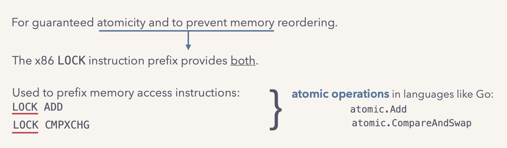{:height 172, :width 562}
					- **Atomic compare-and-swap (CAS)** conditionally updates a variable:
						- checks if it has the expected value and if so, changes it to the desired value.
					- 为什么需要LOCK前缀，不能单纯使用COMXCHG？
						- https://hackmd.io/@vesuppi/Syvoiw1f8
						- TODOThat
			- baby’s first lock: spinlocks
			  collapsed:: true
				- 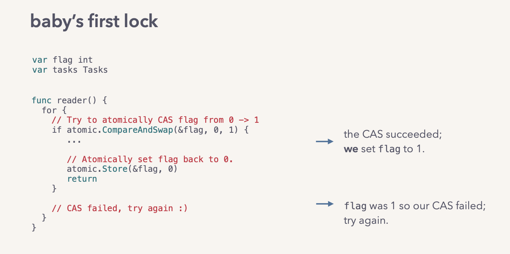
				- 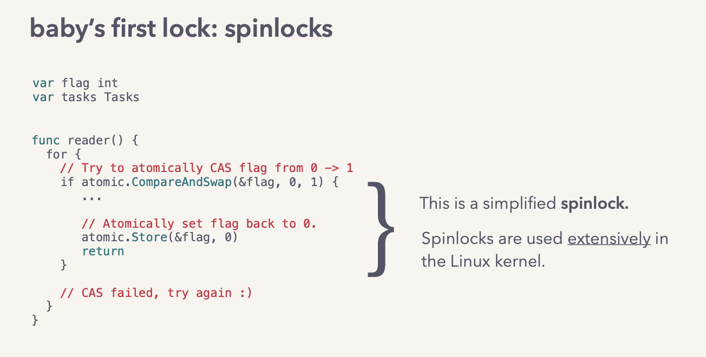
				- This is a simplified [[spinlock]].
					- Spinlocks are used extensively in
					  the [[Linux]] kernel.
				- The **atomic CAS** is the quintessence of any lock implementation.
			- cost of an atomic operation
			  collapsed:: true
				- Run on a 12-core x86_64 SMP machine.
					- Atomic store to a C _Atomic int, 10M times in a tight loop.
					- Measure average time taken per operation
				- With 1 thread: ~13ns (vs. regular operation: ~2ns)
				- With 12 cpu-pinned threads: ~110ns
					- threads are effectively serialized
			- We have a scheme for mutual exclusion that provides **atomicity and memory ordering guarantees**. ...but
			  collapsed:: true
				- spinning for long durations is wasteful; it takes away CPU time from other threads.
					- enter the operating system!
			- Linux’s futex
			  collapsed:: true
				- Interface and mechanism for userspace code to ask the kernel to suspend/ resume threads.
				  collapsed:: true
					- Interface
						- futex syscall
					- mechanism
						- kernel-managed queue
					- 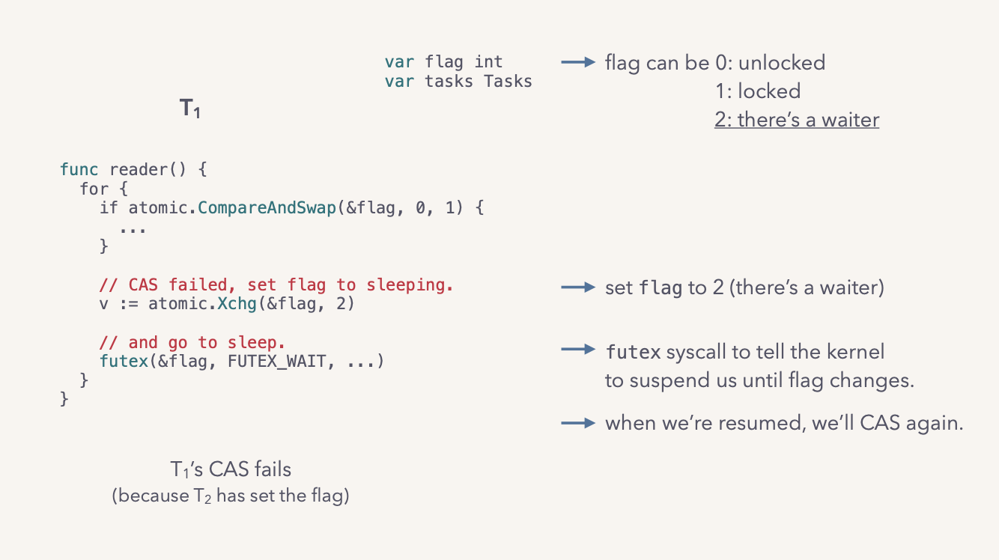
				- in the kernel:
				  collapsed:: true
					- 1. arrange for thread to be resumed in the future:
						- add an entry for this thread in the kernel queue for the address we care about
					- 2. deschedule the calling thread to suspend it.
					- 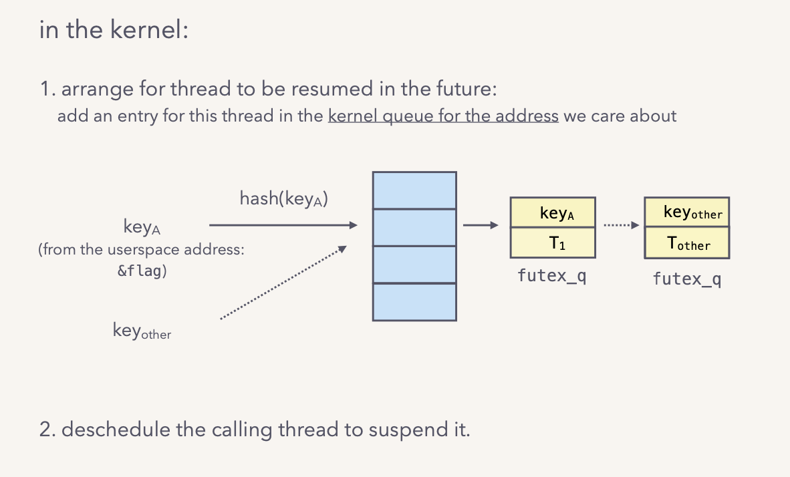
					- 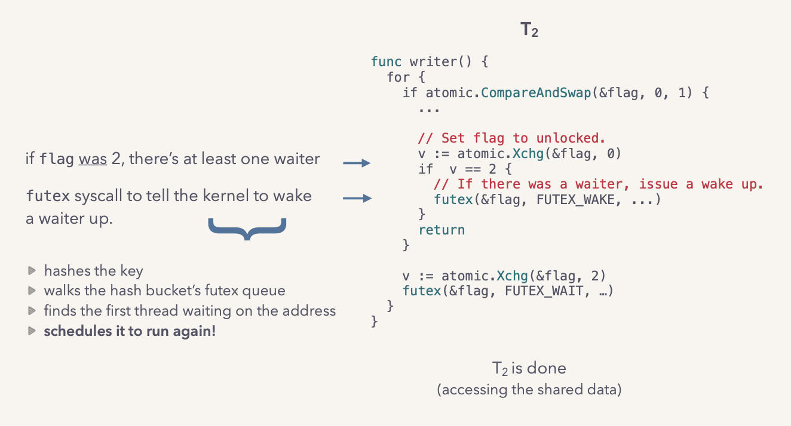
				- pretty convenient!
					- That was a hella simplified futex.
						- ...but we still have a nice, lightweight primitive to build synchronization constructs.
					- pthread mutexes use futexes.
				- cost of a futex
				  collapsed:: true
					- Run on a 12-core x86_64 SMP machine.
						- Lock & unlock a pthread mutex 10M times in loop

						  (lock, increment an integer, unlock).
						- Measure average time taken per lock/unlock pair

						  (from within the program).
					- uncontended case (1 thread): ~13ns
						- cost of the user-space atomic CAS = ~13ns
					- contended case (12 cpu-pinned threads): ~0.9us
						- cost of the atomic CAS +
						  syscall + thread context switch = ~0.9us
					- 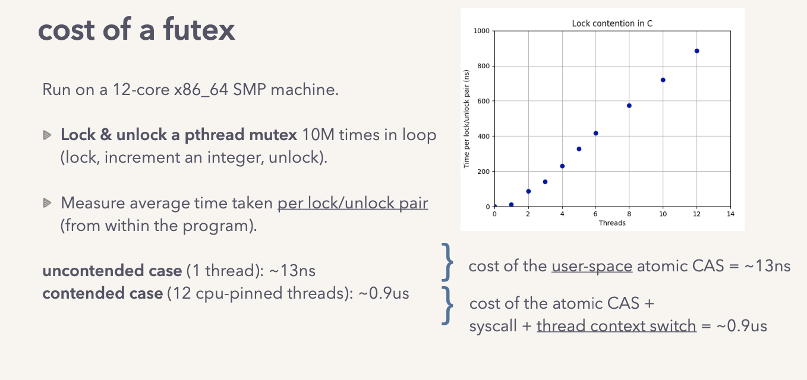
			- spinning vs. sleeping
			  collapsed:: true
				- Spinning makes sense for short durations; it keeps the thread on the CPU.
				- The trade-off is it uses CPU cycles not making progress.
				- So at some point, it makes sense to pay the cost of the context switch to go to sleep.
				- There are smart “hybrid” futexes:
					- CAS-spin a small, fixed number of times —> if that didn’t lock, make the futex syscall.
					- Examples: the Go runtime’s futex implementation; a variant of the pthread_mutex.
			- ...can we do better for user-space threads?
			  collapsed:: true
				- goroutines are user-space threads.
					- The go runtime multiplexes them onto threads.
						- 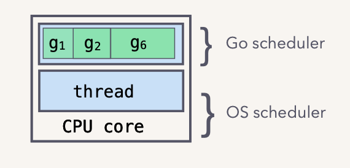{:height 160, :width 322}
					- lighter-weight and cheaper than threads:
						- goroutine switches = ~tens of ns;
						- thread switches = ~a μs.
					- we can block the goroutine without blocking the underlying thread!
						- to avoid the thread context switch cost.
				- This is what the Go runtime’s semaphore does!
					- The semaphore is conceptually very similar to futexes in Linux*, but it is used to 
sleep/wake goroutines:
						- a goroutine that blocks on a mutex is descheduled, but not the underlying thread.
						- the goroutine wait queues are managed by the runtime, in user-space.
					- 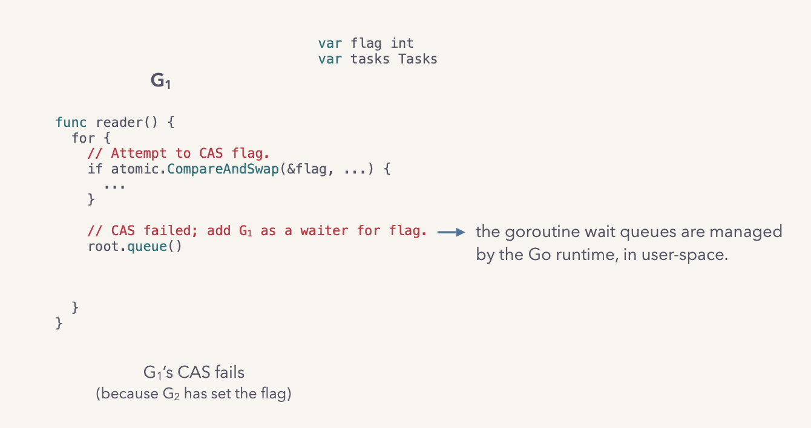
				- the goroutine wait queues
					- (in user-space, managed by the go runtime)
					- 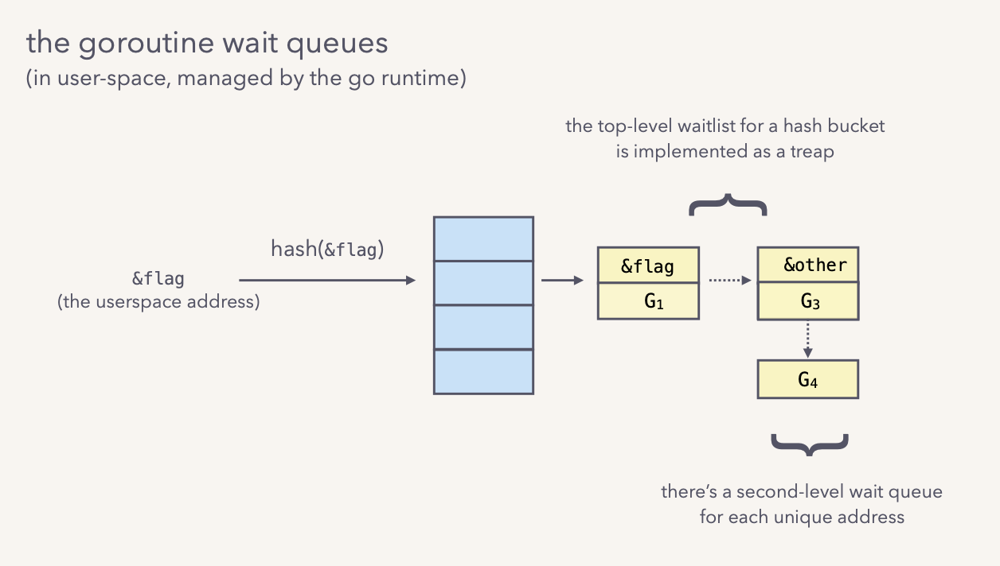
					- 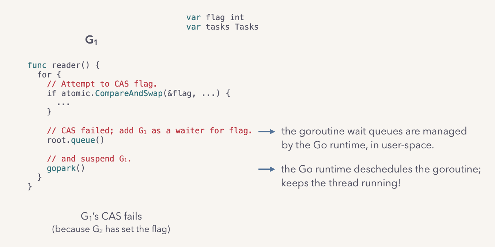
					- 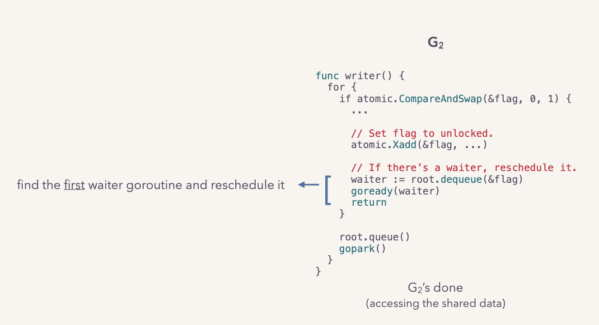
				- this is clever. Avoids the hefty thread context switch cost in the contended case,
 up to a point. but...
					- Resumed goroutines have to compete with any other goroutines trying to CAS.
						- They will likely lose:
							- there’s a delay between when the flag was set to 0 and this goroutine was rescheduled..
								- 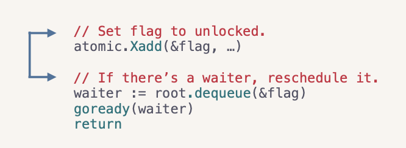
					- So, the semaphore implementation may end up:
						- unnecessarily resuming a waiter goroutine
							- results in a goroutine context switch again.
						- cause goroutine starvation
							- can result in long wait times, high tail latencies.
					- the sync.Mutex implementation adds a layer that fixes these.
				- go’s sync.Mutex
					- Is a hybrid lock that uses a semaphore to sleep / wake goroutines.
					- Additionally, it tracks extra state to:
						- prevent unnecessarily waking up a goroutine
							- “There’s a goroutine actively trying to CAS”:
								- An unlock in this case does not wake a waiter.
						- prevent severe goroutine starvation
							- “a waiter has been waiting”:
								- If a waiter is resumed but loses the CAS again, it’s queued at the head of the wait queue.
								- If a waiter fails to lock for 1ms, switch the mutex to “starvation mode”.
									- other goroutines cannot CAS, they must queue
									- The unlock hands the mutex off to the first waiter.
										- i.e. the waiter does not have to compete.
					- how does it perform?
						- Run on a 12-core x86_64 SMP machine.
							- Lock & unlock a Go sync.Mutex 10M times in loop
								- (lock, increment an integer, unlock).
							- Measure average time taken per lock/unlock pair
								- (from within the program).
						- uncontended case (1 goroutine): ~13ns
						- contended case (12 goroutines): ~0.8us
						- 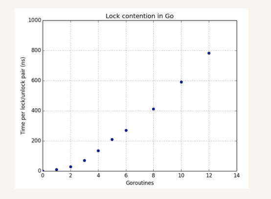{:height 314, :width 387}
						- Contended case performance of C vs. Go:
							- Go initially performs better than C
							- but they ~converge as concurrency gets high enough.
							- 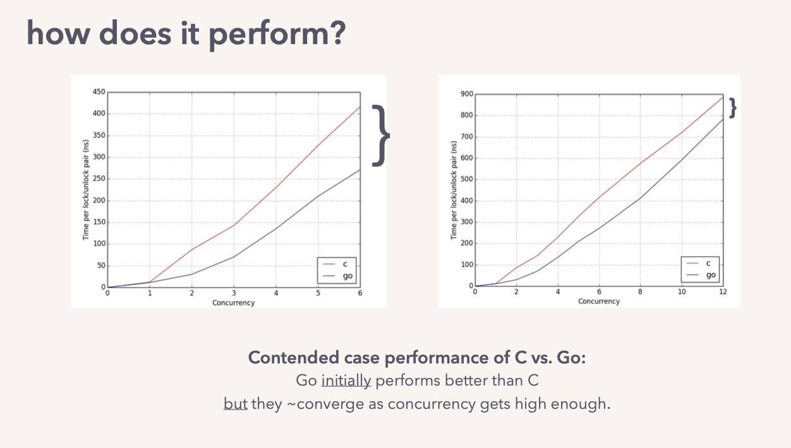
					- sync.Mutex
						- {:height 151, :width 354}
						- 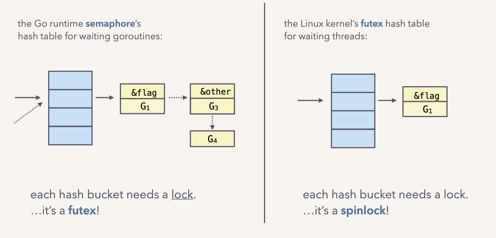
						- 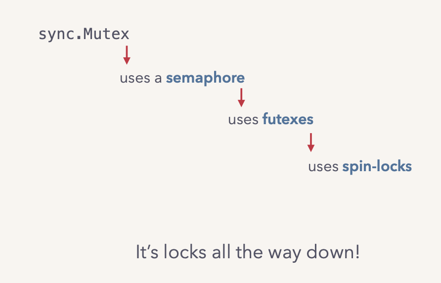
				-
					-
					-
				-
				-
		- let’s analyze its performance! (performance models for contention)
			- uncontended case
				- Cost of the atomic CAS.
			- contended case
				- In the worst-case, cost of failed atomic operations + spinning + goroutine context switch + 
 thread context switch.
					- ....But really, depends on degree of contention.
			- “How does application performance change with concurrency?”
				- how many threads do we need to support a target throughput? 
 while keeping response time the same.
				- how does response time change with the number of threads? assuming a constant workload.
				- Amdahl’s Law
					- Speed-up depends on the fraction of the workload that can be parallelized (p).
						- 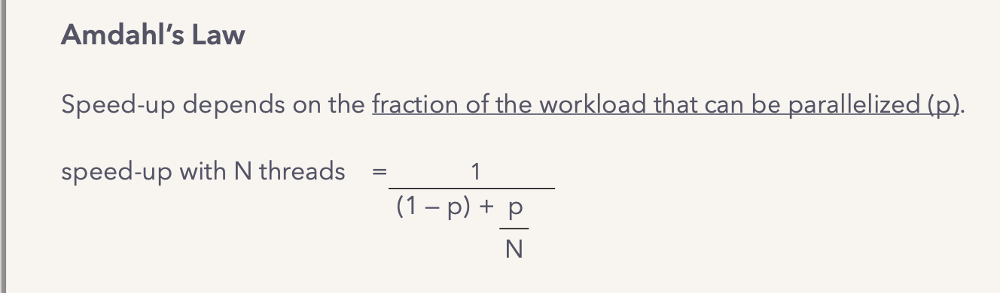
					- a simple experiment
						- Measure time taken to complete a fixed workload.
							- serial fraction holds a lock (sync.Mutex).
							- scale parallel fraction (p) from 0.25 to 0.75
							- measure time taken for number of goroutines (N) = 1 —> 12.
						-
		- let’s use it, smartly! (a few closing strategies)
			-