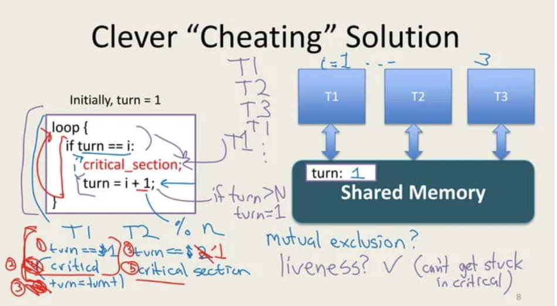
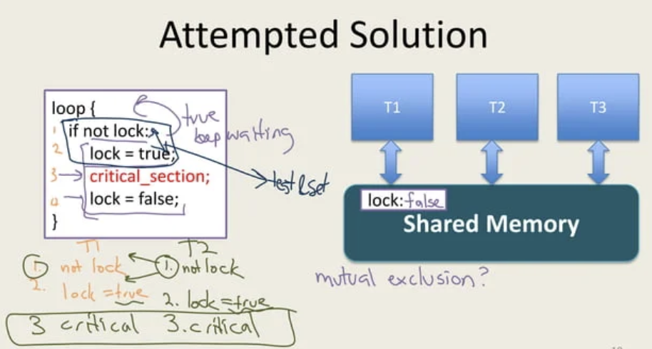
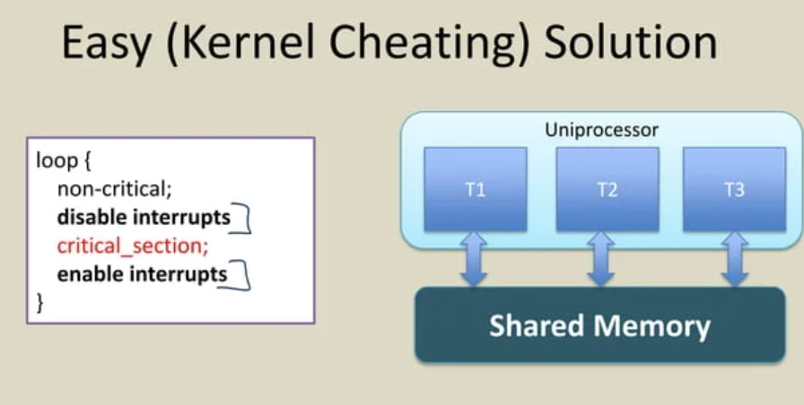
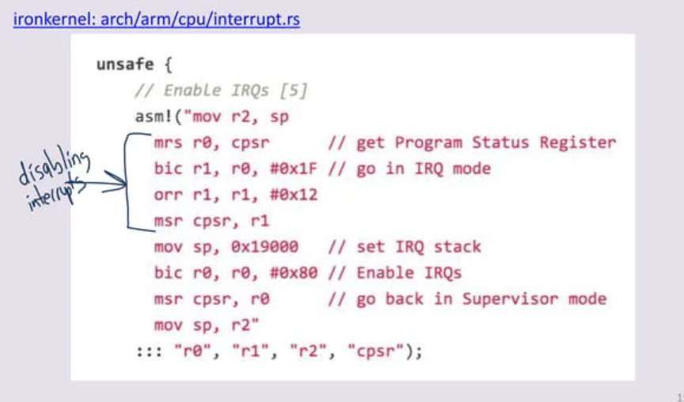
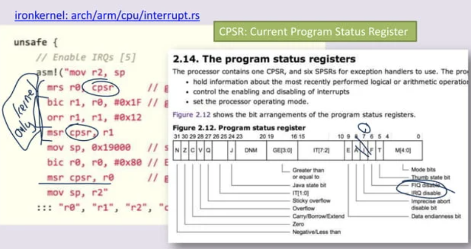
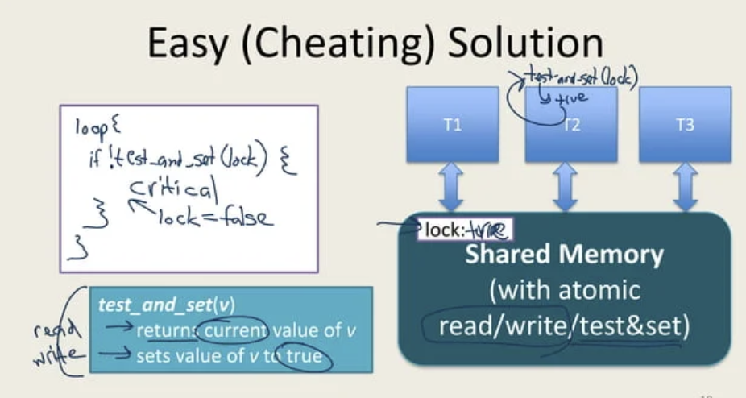
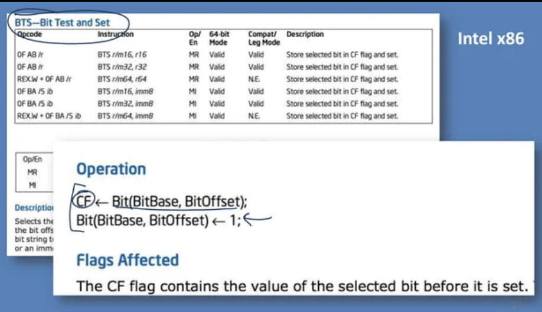
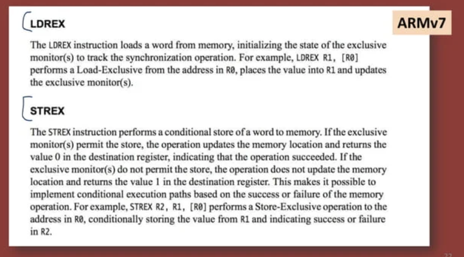

- **TAG: * [[Computer Science]] [[locks]]
- Dijkstra's Mutual Exclusion Problem（Dijkstra的互斥问题）
	- http://rust-class.org/class-20-mutual-exclusion.html
	- Requirements （它要求）
		- Only one thread may be in the critical section at any time.
		- Each must eventually be able to enter its critical section.
		- Must be symmetrical (all run same program).
		- Cannot make any assumptions about speed of threads.
		- 
	- 一些不可靠的解法
		- 问题一般出在一些操作有原子性的假设，但该假设实际不成立
		  collapsed:: true
			- 
			- 
	- 内核上的简单解法
		- 通过disable中断
		  collapsed:: true
			- 
			- 
			- 
	- 硬件解法
		- test and set
		  collapsed:: true
			- 
			- 
			- 
			-
		- 其他细节见网站
	- Dijkstra的解法
		-