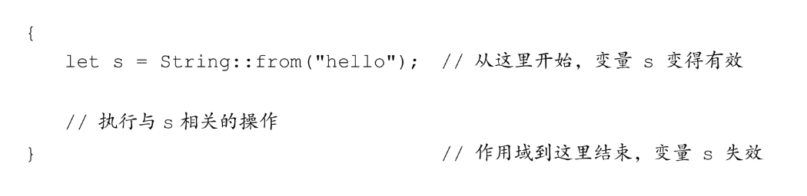
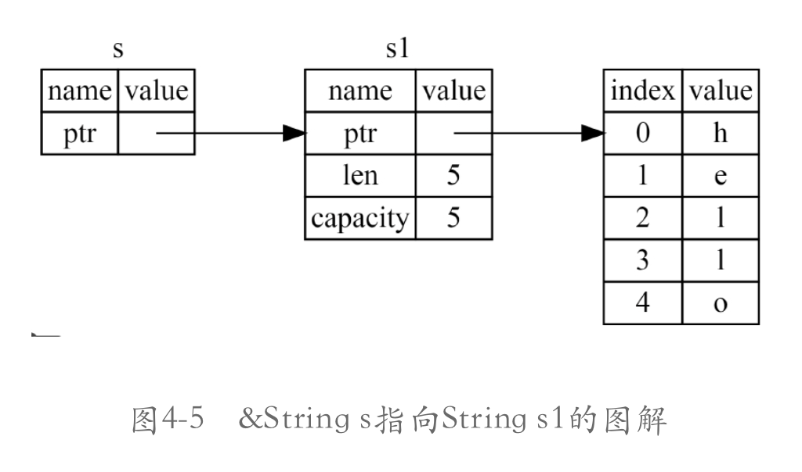
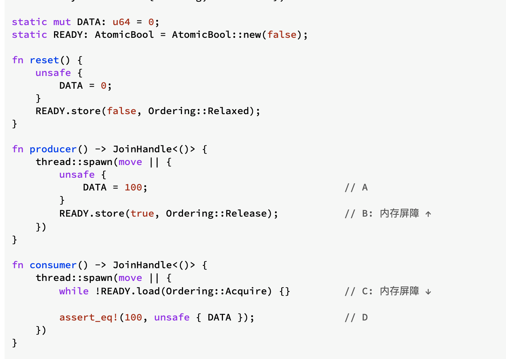

- 所有权
	- 所有权规则
		- Rust中的每一个值都有一个对应的变量作为它的所有者。
		- 在同一时间内，值有且仅有一个所有者。
		- 当所有者离开自己的作用域时，它持有的值就会被释放掉。
	- 内存与分配
		- 内存会自动地在拥有它的变量离开作用域后进行释放。
			- {:height 129, :width 562}
			-
			- Rust在变量离开作用域时，会调用一个叫作drop的特殊函数。
				- String类型的作者可以在这个函数中编写释放内存的代码。
			- 记住，Rust会在作用域结束的地方（即}处）自动调用drop函数。
			- 注意
				- 在C++中，这种在对象生命周期结束时释放资源的模式有时也被称作资源获取即初始化（Resource Acquisition Is Initialization， RAII）。
		- 变量和数据交互的方式：移动
		- 变量和数据交互的方式：克隆
	- 所有权与函数
		- 将值传递给函数在语义上类似于对变量进行赋值。将变量传递给函数将会触发移动或复制，就像是赋值语句一样。
	- 返回值与作用域
		- 函数在返回值的过程中也会发生所有权的转移。
		- 变量所有权的转移总是遵循相同的模式：
			- 将一个值赋值给另一个变量时就会转移所有权。
			- 当一个持有堆数据的变量离开作用域时，它的数据就会被drop清理回收，除非这些数据的所有权移动到了另一个变量上。
- 引用与借用
	- 这些&代表的就是引用语义，它们允许你在不获取所有权的前提下使用值。图4-5所展示的是该过程的一个图解。
		- {:height 333, :width 557}
		- 与使用&进行引用相反的操作被称为解引用（dereferencing），它使用*作为运算符。
	- 这里的&s1语法允许我们在不转移所有权的前提下，创建一个指向s1值的引用。由于引用不持有值的所有权，所以当引用离开当前作用域时，它指向的值也不会被丢弃。
	- 同理，函数签名中的&用来表明参数s的类型是一个引用。
		- ```rust
		  fn calculate_length(s: &String) -> usize { // s 是一个指向 String 的引用
		      s.len()
		  } // 到这里，s离开作用域。但是由于它并不持有自己所指向值的所有权，
		  //所以没有什么特殊的事情会发生
		  ```
		- 此处，变量s的有效作用域与其他任何函数参数一样，唯一不同的是，它不会在离开自己的作用域时销毁其指向的数据，因为它并不拥有该数据的所有权。
		- 当一个函数使用引用而不是值本身作为参数时，我们便不需要为了归还所有权而特意去返回值，毕竟在这种情况下，我们根本没有取得所有权。
	- 这种通过引用传递参数给函数的方法也被称为借用（borrowing）。
	- 引用的规则
		- 在任何一段给定的时间里，你要么只能拥有一个可变引用，要么只能拥有任意数量的不可变引用。
		- 引用总是有效的。
- 生命周期
	- 悬垂指针和生命周期
		- 生命周期的主要作用是避免悬垂引用，它会导致程序引用了本不该引用的数据
	- 借用检查
		- 为了保证 Rust 的所有权和借用的正确性，Rust 使用了一个借用检查器(Borrow checker)，来检查我们程序的借用正确性
-
- 在 Rust 中，`derive` 和 `repr` 是两个非常有用的属性（attributes），它们为类型提供了元数据，允许编译器执行一些自定义的行为。
	- ### `#[derive(...)]`
		- `derive` 属性用来自动为类型实现一些特定的 trait。
			- Trait 是 Rust 中的一种功能，它定义了方法的签名，这些方法可以实现为某种类型的行为。当你使用 `derive` 属性时，编译器会为你的类型生成这些方法的标准实现，而不需要你手动编写代码。
		- 下面是一些可以通过 `derive` 自动实现的常见 trait：
			- `Debug`: 允许实例通过 `println!("{:?}", instance);` 方式进行格式化打印，主要用于调试目的。
			- `Clone`: 生成一个对象的副本的方法。
			- `Copy`: 允许类型通过简单的内存复制来复制其值，适用于那些没有资源所有权问题的简单类型。
			- `Hash`: 允许对象计算自己的哈希值，通常用于哈希表中。
			- `PartialEq` 和 `Eq`: 允许对象比较相等性。
			- `PartialOrd` 和 `Ord`: 允许对象进行排序和比较大小。
		- 使用 `derive` 的一个示例：
			- ```rust
			  #[derive(Debug, Clone, PartialEq)]
			  struct MyStruct {
			    a: i32,
			    b: String,
			  }
			  ```
			- 在这个例子中，`MyStruct` 将自动获得 `Debug`, `Clone`, 和 `PartialEq` traits 的实现，使你能够打印、克隆对象以及比较结构体实例是否相等。
	- ### `#[repr(...)]`
		- `repr` 属性用来控制类型的内存布局。这主要在与外部系统交互（比如 FFI - 外部函数接口，或者硬件交互），或者对性能有特殊要求时使用。
		- 下面是一些 `repr` 可以指定的内存布局：
			- `C`: 使用与 C 语言结构体相同的布局策略，这在进行 FFI 调用时非常重要。
			- `packed`: 告诉编译器尽可能地压缩结构，不进行字节对齐。
			- `u8`, `u16`, `u32`, `u64`, `usize`: 对于枚举来说，指定使用固定大小的整数来表示枚举的变体。
		- 使用 `repr` 的一个示例：
			- ```rust
			  #[repr(C)]
			  struct MyCStruct {
			    a: u32,
			    b: u8,
			  }
			  ```
			- 这里的 `MyCStruct` 会有一个和 C 语言中相同的内存布局，这对于通过 FFI 与 C 代码交互时是必需的。
-
- 在 Rust 项目中，`lib.rs` 是一个特殊的文件，它作为库(crate)的根文件，定义了库的模块和公共接口。当你创建一个库项目时，`cargo` 工具会自动生成这个文件。
	- 库项目旨在创建可被其他项目引用的代码。与之相对的是二进制项目，它的入口是 `main.rs` 文件，并且编译后生成可执行文件。库不生成可执行文件，而是生成一个库文件（在 Linux 和 macOS 上是 `.so` 或 `.dylib` 文件，在 Windows 上是 `.dll` 文件），这个文件可以被其他 Rust 项目作为依赖来使用。
	- `lib.rs` 的作用包括：
		- **定义模块结构：** 你可以在 `lib.rs` 中声明模块，组织代码和功能。
		- **公开 API：** 你可以使用 `pub` 关键字来决定哪些函数、类型、常量、特性等是公开的，也就是说，它们可以被其他包引用和使用。
		- **重导出项（Re-exporting）：** 如果你希望库的使用者能够更容易地访问某些项，你可以在 `lib.rs` 中重导出它们。
		- **集成测试：** 虽然单元测试通常与它们测试的代码放在一起，但集成测试通常放在 `tests` 目录下，并依赖 `lib.rs` 中定义的公共 API。
-
-
- `-> &'static [u8; 1]` 指定了函数的返回类型，是对一个包含单个 `u8` 元素的静态数组的引用。`'static` 生命周期意味着这个引用在整个程序的执行期间都是有效的。
-
- `compare_exchange`
	- `compare_exchange`是 Rust 中 `Atomic` 类型提供的一个方法，它是原子操作中的一种，用于在多线程环境中安全地更新共享变量的值。`compare_exchange` 方法执行比较并交换操作，通常用于实现无锁编程中的同步模式。
	- 以下是 `compare_exchange` 方法的具体介绍：
		- 功能
			- `compare_exchange` 方法将某个原子变量的当前值与预期的值进行比较，只有在当前值与预期值相等时，才会将该变量更新为新的值。
			- 这整个过程是原子的，也就是说，比较和更新是作为一个不可分割的单元执行的，以此确保在并发程序中的一致性和原子性。
		- 参数
			- `compare_exchange` 方法通常接受以下参数：
			- `current`：预期的当前值。
			- `new`：如果当前值与预期值相等，将更新为这个新值。
			- `success`：当比较成功，即值被成功更改时，用于指定内存顺序（memory ordering）的参数。
			- `failure`：当比较失败，即值未被更改时，用于指定内存顺序的参数。
		- 内存顺序
			- 内存顺序参数控制操作的内存访问模式，对于并发程序的正确性和性能有重要影响。Rust 提供了多种内存顺序选项：
				- `Relaxed`：没有同步或顺序要求，可能会导致其他线程看到不一致的状态。
					- 这是最宽松的规则，它对编译器和 CPU 不做任何限制，可以乱序
				- `Acquire`：操作之前的读或写操作不能被重新排序到此操作之后。
					- 设定内存屏障，保证在它之后的访问永远在它之后，但是它之前的操作却有可能被重排到它后面，往往和`Release`在不同线程中联合使用
					- 确保当前线程看到在其他线程中释放（Release）之前的写入。
				- `Release`：操作之后的读或写操作不能被重新排序到此操作之前。
					- 设定内存屏障(Memory barrier)，保证它之前的操作永远在它之前，但是它后面的操作可能被重排到它前面
					- 确保其他线程在对应的获取（Acquire）之后能看到这个线程之前的所有写入。
					- `Release`一般用于写入
						- 在内存屏障中被写入的数据，都可以被其它线程读取到，不会有多核 CPU 缓存的问题。（Acquire与Release配合下）
							- `Release` 语义是一种内存屏障（或内存顺序）的形式，它主要用在写操作中。当你在一个原子操作上使用 `Release` 语义时，这意味着一旦原子操作完成，该操作之前的所有写入（无论是否是原子操作）都将被其他线程看到，前提是这些线程通过一个对应的 `Acquire` 操作来读取数据。
								- 这里的“被看到”意味着写入操作对其他处理器核心是可见的，确保了写入操作的结果不会仅仅保留在当前核心的缓存中。这就是“不会有 CPU 缓存的问题”的含义。
								- 来自不同线程的 `Acquire` 操作可以确保它们看到由 `Release` 操作发布的数据。如果线程 A 在原子变量上执行 `Release` 存储操作，并且随后线程 B 在同一原子变量上执行 `Acquire` 加载操作并看到了线程 A 存储的值，那么线程 B 也保证能看到线程 A 在执行 `Release` 存储之前对内存所做的所有写入。
							- 这是如何工作的：
								- **在写入方面**：当线程 A 执行一个 `Release` 操作时，它发出一个信号，表明它之前的所有写操作都必须在 `Release` 操作对其他线程可见之前完成。这防止了写操作的重排序（至少是在其他线程的视角中）。
								- **在读取方面**：当线程 B 对某个原子变量执行一个 `Acquire` 操作，并且看到了线程 A 执行的 `Release` 操作设置的值时，它接收到一个信号，表明线程 A 的所有之前的写操作都已经完成，并且结果对线程 B 是可见的。
							- 这种机制是由处理器架构和编译器内存顺序保证的，确保即使在多核处理器上，多个线程也能看到一致的内存状态。在现代处理器架构中，这通常涉及到插入特定的内存屏障指令，这些指令会阻止处理器和编译器对操作进行某些形式的重排序。
								- 具体到x86
									- 在x86架构中，内存顺序较为严格，大多数普通的存储和加载操作已经具有较强的顺序保证。x86架构的处理器自然保证了存储-加载顺序（Store-to-Load order），这意味着所有的存储（写操作）在加载（读操作）发生之前对其他处理器是可见的。因此，x86处理器在执行普通的存储和加载操作时不需要额外的内存屏障来保证顺序。
									- 但是，并发编程中的原子操作通常需要比处理器自然提供的保证更强的内存顺序保证。这时候，编译器和运行时系统会插入特定的内存屏障指令来满足这些需求。
									- 在x86上，`Release` 语义通常不需要插入任何特殊的内存屏障指令，因为x86的存储指令自然就有release语义。**然而，为了与其他架构兼容，以及为了编译器的内存模型，编译器可能还是会插入一个轻量级的内存屏障指令，比如`sfence`（存储屏障）指令，但在实际硬件层面，这通常不是必需的。**
									- 对于`Acquire` 语义，在x86上，加载指令也不需要额外的内存屏障，因为它们已经保证了新加载的值能够看到所有先前的存储。但是，**为了避免编译器重排序，通常会使用一个`lfence`（加载屏障）指令，或者更常见的是使用一个`lock`前缀的指令，如`lock addl`，来作为一个全局内存屏障（full memory barrier），它确保了指令的顺序执行。**
									- 总而言之，在x86上实现`Release` 语义不需要特别的指令，因为存储指令自然就有release语义。然而，编译器可能会插入屏障指令以满足语言级别的内存模型要求。同样地，`Acquire` 语义在x86上通过加载指令自然实现，但为了编译器层面的保证，可能会使用`lfence`或`lock`前缀的指令。实际上，x86处理器因其内存模型的保守性而常常被认为对开发者更为友好。
									-
				- `AcqRel`：同时包含 `Acquire` 和 `Release` 的含义。
					- 是 *Acquire* 和 *Release* 的结合，同时拥有它们俩提供的保证。
						- 比如你要对一个 `atomic` 自增 1，同时希望该操作之前和之后的读取或写入操作不会被重新排序
				- `SeqCst`：顺序一致性，提供最强的同步保证。
					- 所有线程的全局顺序
			- 原则上，`Acquire`用于读取，而`Release`用于写入。
				- 但是由于有些原子操作同时拥有读取和写入的功能，此时就需要使用`AcqRel`来设置内存顺序了。
				- 
				-
		- 返回值
			- `compare_exchange` 方法的返回值是一个 `Result` 类型，其 `Ok` 变体包含先前的值，如果比较成功并更新了值，则返回 `Ok`；否则返回 `Err`，包含当时实际的当前值。
		- 使用场景
			- 在无锁数据结构中，`compare_exchange` 方法能够帮助实现多个线程对共享数据的安全访问。
			- 它特别适用于那些只有在共享数据没有被其他线程修改的情况下才需要更新的场景。
		- 具体到x86
			- 在Rust中，`compare_exchange` 操作会编译成处理器特定的汇编指令，它执行原子的比较和交换操作。
				- 在x86架构上，通常会使用`cmpxchg`指令来实现这一操作。
				- 这个指令会比较累加器（例如`eax`、`rax`等）中的值与目标内存位置的值，如果它们相等，则将一个新值写入内存位置；如果不相等，则将内存位置的值加载到累加器中。
			- 这是一个高级的描述，具体来看，假设你有以下的Rust代码片段：
				- ```rust
				  use std::sync::atomic::{AtomicUsize, Ordering};
				  let value = AtomicUsize::new(0);
				  let result = value.compare_exchange(0, 1, Ordering::Acquire, Ordering::Relaxed);
				  ```
			- 在x86平台，这段代码大致对应的汇编指令可能是：
				- ```assembly
				  mov eax, 0         ; 将期望的值放入eax寄存器
				  mov edx, 1         ; 将新值放入edx寄存器
				  lock cmpxchg [rbx], edx ; rbx寄存器里是value变量的地址，cmpxchg比较eax与[rbx]的值，并在它们相等时将edx的值存入[rbx]
				  ```
			- `lock` 前缀是确保`cmpxchg`操作在多处理器环境中原子执行的关键。
				- 它会锁定总线，防止其他处理器同时访问相同的内存地址，从而确保这个比较和交换操作的原子性。（即全局内存屏障）
			- 关于内存顺序参数的影响：
				- 对于`Ordering::Acquire`，在x86处理器上通常不需要额外的指令，因为`lock`前缀的`cmpxchg`已经隐含了一个全内存屏障。
					- 但是，为了保持一致的内存模型，Rust标准库可能会采取额外的措施，比如在比较交换操作之后插入一个`lfence`指令，以禁止加载操作被重排序到原子操作之前。
				- 对于`Ordering::Relaxed`，不需要内存屏障，因为不强制要求操作之间的顺序。
		-
			-