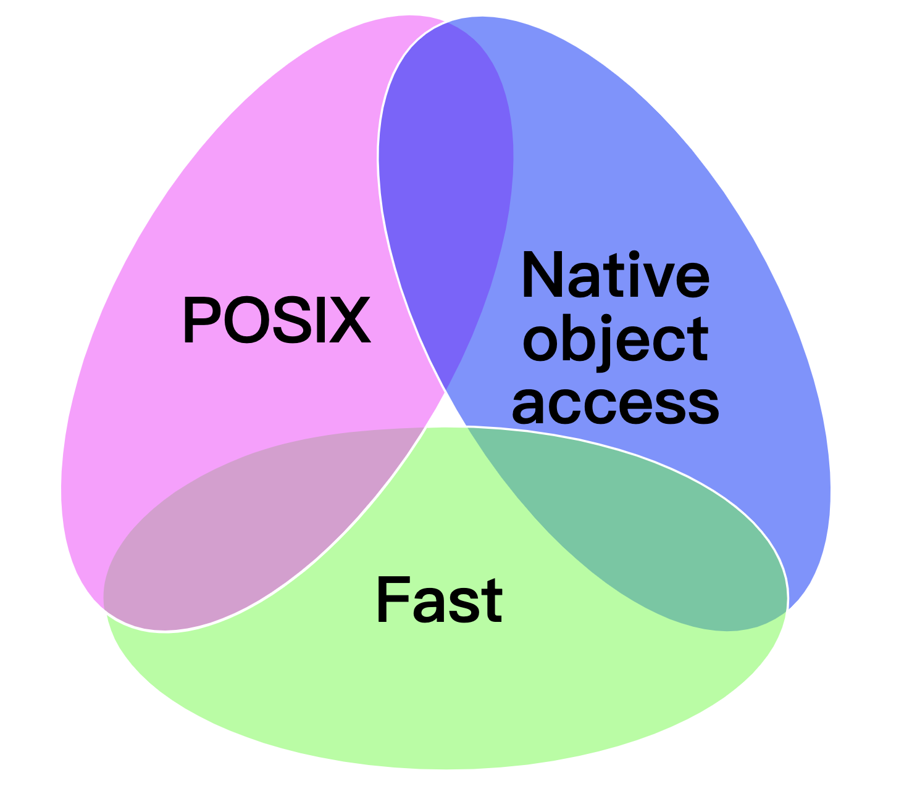
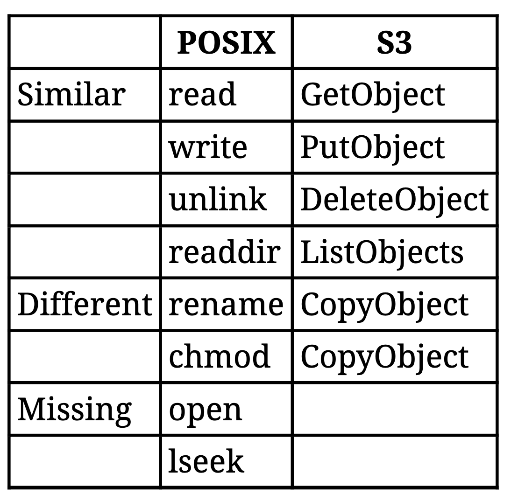
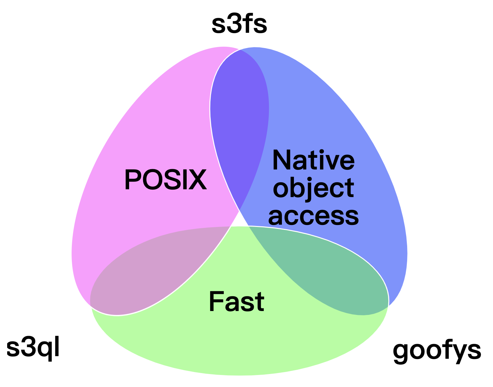
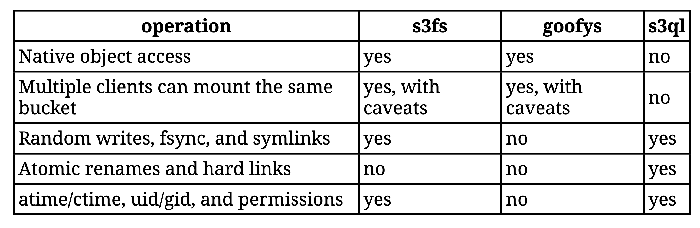
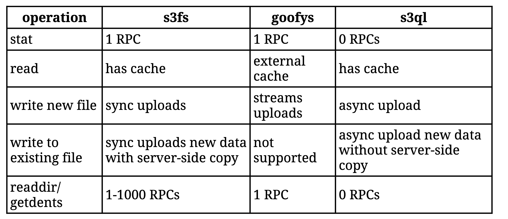

- http://gaul.org/talks/s3fs-tradeoffs/#3
- Why use an S3 file system
	- Need some degree of POSIX application compatibility（需要一定程度的POSIX应用程序兼容性）
		- Interoperate with both cloud-native and legacy applications
	- Store TBs or PBs of data cheaply with good sequential performance (以较低的成本存储TBs或PBs的数据，具有良好的顺序性能)
		- Archival, analytics, and machine learning
	- Lightweight network file system（轻量级网络文件系统）
		- Personal computer or Raspberry Pi
- Trade-offs -- pick two
	- POSIX、Native Object access、Fast
		- {:height 369, :width 423}
- FUSE
	- Filesystem in Userspace
	- Allows non-kernel file system implementations（允许非内核文件系统实现）
	- Maps POSIX system calls to FUSE operations
		- ssize_t write(int fd, void *buf, size_t count)
	- Wide variety: btfs, dbxfs, sshfs, and hundreds more
- S3
	- Amazon Simple Storage Service
	- The most popular object storage protocol
	- Object storage offers scale-out performance and lower costs
	- Many implementations: AWS, Backblaze, Ceph, GCS, Minio, and OpenStack Swift
	- Wide variety of applications and SDKs
- Comparing POSIX and S3 APIs
	- POSIX has stateful files while S3 has stateless objects
		- {:height 325, :width 319}
			- lseek: 用于显式地为一个已打开的文件设置其偏移量
				- S3没有lseek主要意味着追加写入操作比较难实现。而对于读取，则可以由GetObject带上Range: bytes=KK-NN来实现偏移量读取，不过偏移量也需要自己维护。
- s3fs
	- One of the earliest S3 file systems
	- Focus on native S3 object interoperability and POSIX compatibility（关注本地S3对象互操作性和POSIX兼容性）
		- Lacks atomic renames and hard links（缺乏原子重命名和硬链接）
	- Multiple clients can mount a bucket although caching delays updates（多个客户端可以挂载同一个桶，尽管缓存会延迟更新）
	- Lots of configuration knobs (too many?)
	- Many distribution packages: Debian, Red Hat, Ubuntu, FreeBSD, and macOS
- s3fs read example
	- Application calls read with a 128 KB buffer
	- s3fs issues 5 parallel GetObject requests for 10 MB regions
		- GET /foo HTTP/1.1
		- Range: 1-10485760
	- s3fs returns 128 KB to the client and caches the data for future reads
	- Performance is good for larger files
- s3fs write new file example
	- Application calls write
	- s3fs writes data to the local disk
	- s3fs flushes on close, fsync, or when more than 5 GB written
		- Issue CreateMultipartUpload
		- Issue multiple UploadPart to write modified data
		- Issue CompleteMultipartUpload
	- Performance is good when creating larger files
- s3fs write to existing file example
	- During flush s3fs will
		- Evaluate modified data for modified regions smaller than 5 MB
		- Issue GetObject to round up to minimum 5 MB size
		- Issue CreateMultipartUpload
		- Issue UploadPart for modified data
		- Issue UploadPartCopy for unmodified data
		- Issue CompleteMultipartUpload
	- Poor performance with random writes
		- One byte write requires several RPCs and O(file size) server-side IO!
- s3fs readdir example
	- Application calls getdents
	- s3fs issues ListObjects
		- Returns basic information like name, size, and modified time
	- s3fs issues parallel HeadObject requests for each file
		- Returns extended information like access & change time, owner, permissions, etc.
	- s3fs returns struct dirent
	- Terrible performance: one system call can turn into thousands of HTTP requests!
- s3fs caching
	- s3fs works around poor performance with a variety of caches
	- Stat cache: holds file metadata
		- Defaults to 100,000 entries cached for 15 minutes
	- Noobj cache: holds negative directory entries
	- Data cache: holds file read data
	- Only enables stat cache by default
- goofys
	- Focus on performance and large files
	- Simpler mapping from POSIX to S3 than s3fs
	- Does not support atomic renames, random writes, fsync, hard links, and symlinks
	- Fakes some metadata - atime/ctime, uid/gid, and permissions
	- Lacks native data cache but integrates with external catfs（缺乏本地数据缓存，但与外部catfs集成）
	- Sane defaults - fewer configuration knobs than s3fs
- goofys write new file example
	- Application calls write
		- goofys buffers in memory
	- goofys flushes when more than 5 MB written
		- Asynchronously issue UploadPart to write buffered data
	- Application calls close
		- goofys synchronously issues CompleteMultipartUpload
	- Performance is great when creating larger files, usually network-limited
- goofys readdir example
	- Application calls getdirents
	- goofys issues ListObjects
		- Returns basic information like name, size, and modified time
	- goofys returns struct dirent
	- Good performance: one system call issues only a single HTTP request
- s3ql
	- Focus on performance and POSIX compatibility
		- Lacks native object access
	- Very fast metadata access
		- Stored in local SQLite database and syncs to S3 every 24 hours
	- Treats object store like a block device
		- Writes data into opaque 10 MB single-part objects
	- Supports atomic renames and hard links
	- Offers deduplication and snapshots
	- One client can mount a bucket at a time
- s3ql write new file example
	- Application calls write
		- s3ql writes to local disk
	- Application calls close or fsync
		- s3ql asynchronously writes to S3
	- Performance is great, not network-limited
- s3ql readdir example
	- Application calls getdirents
		- s3ql returns struct dirent from SQLite
- Trade-offs revisited
	- {:height 451, :width 572}
- s3fs, goofys, and s3ql interoperability and compatibility
	- 
- s3fs, goofys, and s3ql performance
	- 
- Conclusion
	- Consider trade-offs that your application can tolerate
	- Use s3fs for native object access and more POSIX compatibility
	- Use goofys for native object access and good performance
	- Use s3ql for good performance and maximum POSIX compatibility
	- Prefer native S3 applications when available
-
- http://gaul.org/talks/reintroduction-to-s3fs
- s3fs overview
	- Works well for several use cases
		- But is a leaky abstraction with data consistency and performance pitfalls
- s3fs works well when
	- Some POSIX compatibility is required
		- Supports most operations but lacks hard links and atomic renames
	- Interoperating with other S3 applications
		- Uses the normal S3 object format
		- Stores UIDs, permissions, and xattr in S3 user metadata
	- Sequential reads and writes on larger files
	- Single directories have thousands of files, not millions
	- High bandwidth and low latency to S3 bucket
		- e.g., client in the same AWS region
- POSIX compatibility adds overhead
	- Mapping POSIX onto S3 is like hammering a square peg in to a round hole
		- readdir issues a HEAD request for each file
		- Random writes amplify to 5 MB (minimum S3 multipart size)
		- Updating metadata copies entire object on S3 server
	- Prefer native S3 applications when available（在可用的情况下，首选本地S3应用程序）
		- AWS CLI vs. ls or find
		- rclone vs. rsync
		- MySQL backups: xbstream vs. cp
- Primitive multi-client coordination
	- Close-to-open data consistency
	- fsync does what you expect
	- Multiple clients may cache stale data!
	- Metadata freshness relies on stat cache timeouts
		- 15 minutes by default
	- inotify does not work
- Eventual consistency
	- Traditional file systems guarantee strong consistency
	- AWS recently guaranteed strong consistency (December 2020)
	- Some S3 implementations only guarantee eventual consistency
	- Worst case tests from 2014: 1 out of 1,000 operations
		- https://github.com/gaul/are-we-consistent-yet
	- Caching can hide this behavior
	- Make sure your workload can tolerate these semantics
- Flags to tune performance
	- -o multireq_max - number of parallel HEAD requests during readdir
	- -o use_cache - cache GET requests in /tmp
	- -o parallel_count - number of parallel PUT requests
	- -o multipart_size - size of parallel PUT requests
	- -o max_dirty_data - amount of temporary data to buffer locally before flushing to S3
-
	- Defaults tuned for lower-memory devices and containers. Larger values can double write performance or more.
	-
	-