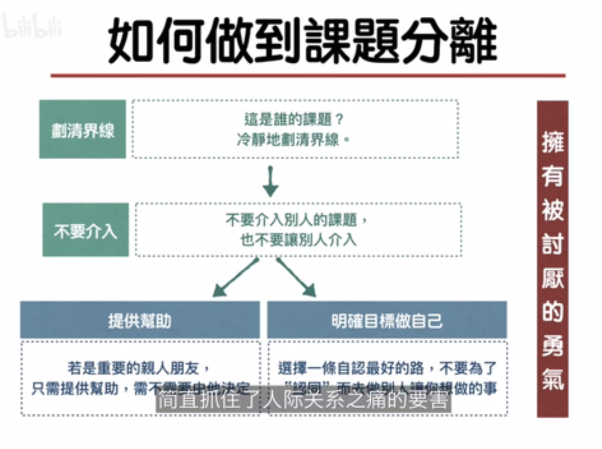

- 阿德勒理论与弗洛伊德理论的比较
	- 弗洛伊德更强调性欲和儿童时期的阴影对未来人生的重要性
		- 现在的行为是由过去的经历造成的
	- 阿德勒更强调自我的功能，人有选择的权利和能力
- 个人心理学（individual psychology）
	- 由阿德勒创办
	- 以自卑感和创造性自我为中心，并强调社会意识
	- 个人心理学是很务实，能运用到生活中的心理学
	- 例子
	  collapsed:: true
		- 
	- 重要理论
		- 整体论
			- 把个人当成不可分割的整体
				- 不强调理性/感性等二元论
		- 目的论
			- 人的一切行为都是由明确目标的
				- 不强调过去的原因，强调现在的目的
				- 有些人表现出来的异常行为，是对真实目的的掩盖
				- 要改变人行为上的问题，就要先找出他的真实目的
		- 自卑与补偿
			- 追求优越是人类行为的根本目的，他可以激发人的潜能。但没能成功的进行补偿，就可能产生自卑情结，去寻求错误的方式来追求虚假的优越感。
		- 生活风格
			- 生活风格是指一个人在生命早期，大概4-5岁的时候，在家庭环境中形成的一种已经定型的行为模式。
				- 这个会受父母教育的影响，主要是纵容和忽视
				- 如果我们能知道一个人的生活风格，我们就能预测他的未来行动
			- 阿德勒注重预防儿童心理问题的发展
			- 创造性自我
				- 虽然很小就形成了你固定的行为模式，但人还是可以通过主观能动性，人的创造性，去构建自己独特的生活风格。
		- 社会兴趣
			- 人是社会性动物，天生就具有社会兴趣的潜能
				- 就是他对别人会不会产生兴趣，会不会为了社会的进步而不是个人的利益，与他人进行合作，作出贡献
					- 父母的任务之一就是唤起和培养孩子的社会兴趣，对孩子的溺爱和忽视都会影响这个方面的发展
			- 阿德勒认为追求个人权利是在追求一个错误的目标，因为他总是将他人视为敌人，而追求对他人、对社会的贡献，才能让人拥有不朽的感觉。
	-