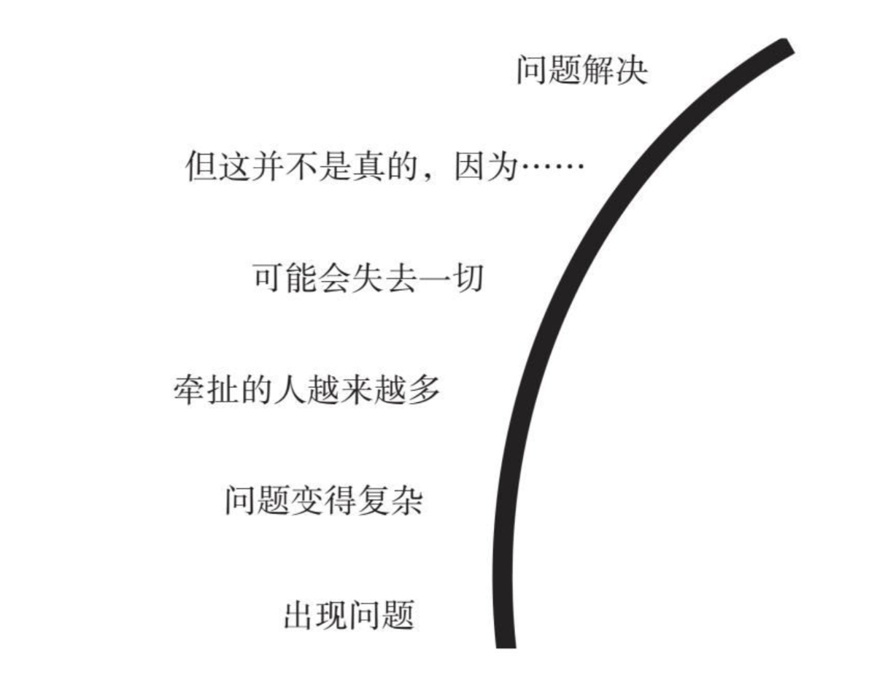
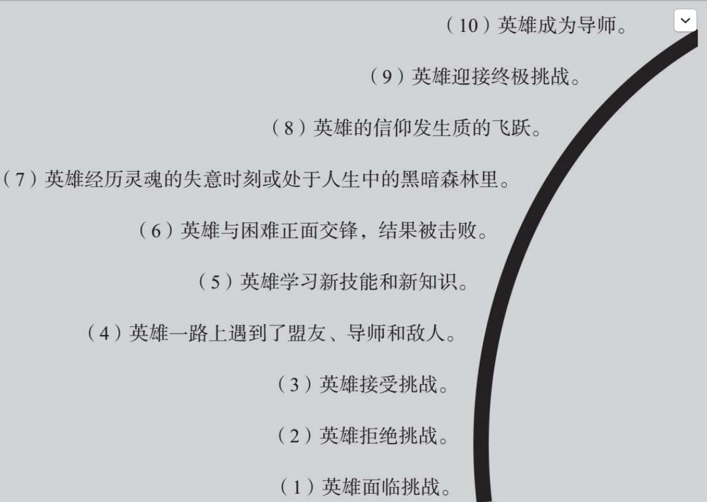

- **TAG：** [[写作]]
- 流程
	- 1 快速思考，确定主题
	  collapsed:: true
		- ║写作练习：快速思考║
		  collapsed:: true
			- 时间：最多5分钟
			- 步骤：
				- 步骤1 回答三个问题
					- 对象：这是写给谁的？（15秒）
						- 如果你不知道具体细节，那就猜一猜。
					- 问题：我的读者有什么需要解决的问题？（45秒）
						- 要尽可能具体地描述这个问题。如果你有时间，就增加一些细节。
					- 承诺：我的好主意如何解决这个问题？（30秒）
						- 弄清楚你的承诺是什么。在有限的时间内，用尽可能多的方式去表达。
				- 步骤2 回顾。
					- 无论你是独自工作还是和他人合作（见第12章），写完之后都要读一读你写的内容。挑选出最重要的词或短语。
					- 找出那三个问题的答案，你可以在后续的写作中利用它们。然后，用“读者都能得到什么”的标准进行衡量，如果有关“读者能得到什么”的陈述等级很高，那就继续向前推进；如果等级低，那就重复练习，从而获得更多的细节。
			- 不管你在什么时候需要写东西，都可以利用本书中的练习。
			  collapsed:: true
				- 我给出了有关时间限制的建议，来帮助你提高回答问题的速度，达到事半功倍的效果。找一个以秒为单位倒计时的定时器，它能测出你能进行多长时间的自由写作。
				- 限时写作能使负担重重的思考过程变得轻松一些。
				- 在自由写作时，定时器一开始倒计时，你就开始写，一直写到计时结束，中间一刻也不要停。
				- 努力回答前文中的三个问题，但不要做任何判断。
				- 想到哪儿就写到哪儿。
				- 你的任务就是抓住这些一闪而过的想法。
				- 不要考虑语法规则，也不需要写完整的句子。
				- 你可以打字或者手写，有时候一边打字一边手写也很有趣。如果你平常习惯打字，那不妨试试手写。书写的方式不同，想法可能也不太一样。
				- 大胆去尝试，关键是记录下所有的想法，哪怕你一直在写“狗屎，狗屎，狗屎……”相信我你一定会感到无聊，然后换成其他词的。
	- 2 确定 [[缆车句]]
		- 我的 _（文章类型）是关于 _（主题）的，我要说的是_（观点）。
			- 分解你的想法，然后将其填入上面这个句子，从而快速找到你的焦点，并明确你写作的主旨
		- 确定观点
		  collapsed:: true
			- 一种找出观点的方法是问你自己：“在我需要表达的内容中，什么是最重要的？”这个问题的答案会让你找到焦点。
			- ║写作练习：两分钟集中思考║
				- 这些练习我用电脑输入和手写的方式都试验过。你得到的结果可能在想法、篇幅或者质量上有差异。此外，你偏爱的方式可能并不是最有成效的，所以你两者都要尝试。你需要尽可能快地写下去，直到计时结束。
				- 步骤
					- 步骤1 设置计时器。回答问题，然后为下一个问题重置计时器。
						- 1.这篇文章要写什么？（45秒）
						- 2.为什么要告诉读者这些内容？（30秒）
						- 3.这篇文章与现实世界有怎样的联系？（20秒）
						- 4.重点是什么？（15秒）
						- 5.用一个词概括文章的内容。（10秒）
					- 步骤2 研究单个词语。
						- 无论你要写什么类型的文章，单词往往都能反映全局的情况。
						- 我在讨论会和课堂上提到过的单词都能反映出这一点：平衡、观点、重新调整、责任、生存、毅力、讽刺、激情、牺牲、变化、怀旧、价值观、混乱、想象力、旅程、采纳、同化、未解之谜。这些词语常常用来描述普遍真理，它们能让你和读者建立联系。
					- 步骤3 确定观点。
						- 用这个单词为 [[缆车句]] 确定观点。
						- 如果你总结出的词不止一个，那就为每个词写一个句子。你可能会找到能帮助你确定观点的强有力的动词。或者可能有直接可以做引导句的完整句子。
						- 记住，你不是一定要做到深刻，有时幽默或愚蠢的词也可以引起读者的强烈共鸣。事实上这个词根本不需要出现。它只是你对于这个观点的思考过程的精华。享受这个过程吧。
	- 3 确定结构
		- 结构类型
		  collapsed:: true
			- 1.原因—结果结构
				- 社论、信息报告、历史故事、学术文章、议论文、评估、意见、社会评论
			- 2.时间顺序结构
				- 历史故事、概况、营销策略、商业计划、讣告
			- 3.分类—归纳结构
				- 产品评论、企业博客、指南、咨询专栏、提议、营销计划
			- 4.比较—对比结构
				- 提议、营销策略、业绩报告、产品评论、行业评论、议论文、公司未来计划、学术论文、意见或社论、营销和销售策略
			- 5.描述性结构
				- 销售营销策略、新产品或项目研究、旅游展示、历史故事、研究结果说明、工艺研究
			- 6.倒金字塔结构
				- 新闻、通讯稿、时事简报、备忘录、产品宣传信、电子邮件
			- 7.列表—编号结构
				- 博客文章、幽默文章、社论
			- 8.问题—解决方案结构
				- 公司简介、研究报告、销售营销策略、评估、提议、博客文章、网站内容、服务信息、介绍入门知识的文章
			- 9.提问—回答结构
				- 信息摘要、报告、概况
			- 10.顺序性结构
				- 手册、说明书、营销计划、介绍入门知识的文章、销售演示、指南、用户指南
		- ║写作练习：用三种方式构思║
			- 时间：10分钟
			- 步骤
				- 步骤1 确定主题。
					- 确定一个你要写的主题，从迟来的感谢信到年度报告，什么都可以。如果篇幅很长，你可以只练习开头。
				- 步骤2 写卡片。
					- 把你想要说的每个事实、每条信息都分别尽可能简短地写在一张卡片上。
				- 步骤3 画[[故事弧]]。
					- 这一步适用于除倒金字塔结构外的所有九种结构。如果你想采用倒金字塔结构，那就画一个倒金字塔。
				- 步骤4 把主题写在故事弧（或倒金字塔）的下面。
				- 步骤5 选择一种结构。
					- 你已经知道了10种基本结构。在主题下面写下你的选择。
				- 步骤6 放置卡片。
					- 根据你使用的结构排列卡片。
				- 步骤7 重复这个过程。
					- 画另一个故事弧或倒金字塔，选择不同的结构，再次放置卡片。
			- 在你练习的过程中，注意不同的结构是如何影响卡片顺序的。
				- 当你的写作遇到困难时，这个练习是很有用的，它能够让你充分利用信息。如果你总是以特定的方式写作，那么这样的练习可以让你有机会尝试其他结构，使你的文章与主题所需要的结构相匹配。
		- [[故事弧]] or 倒金字塔 作为基础
			- 
			- 故事弧对于视觉演示有着特别的价值，能够起到锦上添花的作用。
				- 在你确定整个项目的指导思想之后，画两个弧。
					- 为什么是两个呢？你要表达的信息和这些信息的最佳视觉呈现方式是不一样的。
						- 一个是你要说的话，
						- 另一个是你要使用的对应例证。
				- 对于第一个弧，你要问自己，我的总体观点是什么？然后把它标注在第一个弧的底部。
				- 然后再问自己，强化这个观点的最佳例证是什么？可以是照片、图表，也可以是示意图。把你的选择标注在第二个弧的底部。
				- 下一个话题应该建立在第一个弧底部标注的基础上，而下一个例证也应该以第二个弧底部的标注为基础。
				- 要不停地问自己：“下一个话题是什么”“要证明这一点的最好例证是什么”。有时，在做例证标注之前，先把所有的话题都标注在弧上要容易一些，或者你也可以选择反过来。
			- ║写作练习：伤疤还是文身图案？║
			  collapsed:: true
				- 时间：15分钟
				- 步骤
					- 步骤1 伤疤还是文身图案？
						- 想想生命中你留下一道伤疤或者在身上文一个图案的时刻，选择其中一个。
					- 步骤2 在每张卡片上写下一个事实。
						- 把与这次经历有关的重要事实分别写在每张卡片上，举个例子：“我母亲警告我不要骑那辆自行车。”之后回答下面的问题，比如：“这件事发生在什么时候？清晨”“你当时在哪儿？我姑姑家”“当时谁在现场？”“你那时多大？”“是什么引起了这件事”“你或别人有什么反应”“为什么会发生这件事”。尽量简短地回答。
					- 步骤3 将事实排列成故事弧。
						- 现在把你的卡片排列在一个假想的弧上（或者在一张大纸上画一个弧）。
						- 你想用什么顺序来讲这个故事？尽管你可以从头讲起，先说“我把自行车从车库里推出来”，但其实并不一定要按照时间顺序排列。
						- 你可以从最戏剧性的一幕开始——我最后看到的是司机的脸，然后再排列剩下的卡片，让故事自然地发展到那一幕。你可以用多种方法尝试。
					- 步骤4 自由写作（5分钟）。
						- 选择你喜欢的开头，然后用定时写作的方式写你的故事。
					- 步骤5 换一种顺序（5分钟）。
						- 现在把故事弧底部的卡片换成另一张，然后相应地调整其他卡片，再进行一次5分钟的自由写作。
					- 步骤6 回顾你的文章。
						- 如果你是和搭档一同工作，那么你就可以和别人分享你的观点。你的两个故事有没有按照预期形成层层递进的故事弧？有没有某个部分让人感觉平淡无奇？你是坚持保留了已经写完的内容，还是转换了已有思路？弧的起点改变之后有什么影响？
		- 借助[[英雄之旅]]收集素材，确定讲故事的方式
			- 
			- ║写作练习：设计“英雄之旅”║
				- 在这个练习中，你要按照“英雄之旅”的故事弧组织你的素材。
				- 步骤1 收集素材。
					- 这一步可以从写草稿开始做起（行动型作者），或者从收集研究笔记开始（规划型作者），或者将二者结合（混合型作者）。
				- 步骤2 给笔记编号。
					- 通读素材，将与“英雄之旅”10个阶段相对应的部分进行编号。不要考虑太多，按照第一反应去排序，依时间顺序做出判断。开始发生了什么？接下来发生了什么？你随时可以将一大段话移到编号不同的阶段后面。遇到任何你不能迅速判断的部分，跳过就好。
				- 步骤3 画一个弧。
					- 从纸的左下角开始，向右上方画一个弧。你可以在电脑上画，也可以徒手画。不用画得很整齐。就纸张大小来说，一张8.5厘米×11厘米的纸就很合适。如果你的素材很多，那就换一张更大的画纸。把各个阶段的编号标在弧线以内，这样你就可以在弧线外留出更多的空间来写字了。
				- 步骤4 把信息标在弧上。
					- 通读笔记，把与10个阶段相对应的素材标上号。
					- 从编号的笔记中提炼出几个单词作为提示，有些人习惯用即时贴标注。如果某个阶段的内容很多，那么可以为该阶段单独设置一个弧，然后写入与之相关的所有内容。例如，找到所有符合第5阶段的素材（获得新技能），这样你就可以仔细地对比事实，并判断哪些内容对于整个故事来说是最重要的。在这个过程中，你可以再看看那些尚未标进弧内的素材。
					- 现在你可能更清楚它们属于哪个阶段了。或者，你可以先删掉这些素材，等以后需要的时候再补回来。
				- 步骤5 确定焦点。
					- 你可能发现一些阶段的素材很少。这可以在两个方面为你提供启示：也许你需要获得更多的信息，或者你应在已有的故事中确定一个焦点。如果你还没写缆车句（第3章），那么这一步可以帮到你。
				- 步骤6 选择故事顺序。
					- 你的文章不需要按时间顺序组织。
					- 现在故事弧就在你面前，你可以决定从哪个阶段开始写。从故事弧上的哪一阶段写起能让你的文章最为生动？根据你需要的写作顺序列一个大纲或者画一个弧。
					- 尝试几种不同的方式吧。这样能为你节省时间，也能减轻写第一稿和后续修改时的痛苦。
				- 步骤7 分享进度，继续前进。
					- 如果你有一个写作伙伴（第12章），那么你们可以在设置故事弧时互相讨论，再做出决定。这样可以为你的同伴提供更多的构思文章的方式。如果你独自写作，那么不妨在可能的情况下隔一天回头看看自己的决定，然后再写。这样你可以确信你所做的选择会让你的草稿条理更加清晰。
			- ║备忘单：采访英雄 ║
				- 我为人物采访设置了下面的问题，但你很容易就可以将它们转换成适用于所有类型的故事主人公的问题，比如无生命物体、社团、想法。在设置问题的时候，让你的好奇心来做决定。如果你想要知道更多，那么大多数时候读者也一样。
				- 步骤
					- 步骤1 面临挑战
						- • 是什么让你开始做某事的？
						- • 你是如何看出这个项目很重要的？
						- • 这个项目有什么地方吸引你？
					- 步骤2 拒绝挑战
						- • 起初你是不是还有其他想法？
						- • 这是你想要做的第一件事吗？
					- 步骤3 接受挑战
						- • 你是在什么情况下决定做这件事的？
						- • 你是怎么改变主意的？
						- • 是什么让你最终同意做这件事的？
					- 步骤4 遇到盟友、导师和敌人
						- • 一路上是谁在帮助你？
						- • 是谁或什么阻碍了你？
						- • 你向谁学习？
						- • 你受到了什么的影响？
					- 步骤5 获得新技能
						- • 你要学习哪些专业知识？
						- • 你犯了什么错误或做出了什么错误的假设？
						- • 你是怎么纠正的？
					- 步骤6 直面问题，结果失败
						- • 告诉我，你遇到最大挑战或遭遇最大困境的时刻。
						- • 这一切是如何发生的
						- • 是什么导致了你的失败？
					- 步骤7 灵魂的黑暗时刻
						- • 你有没有想过“这是不会成功的”？
						- • 你有没有真正怀疑过你在做的事情？
						- • 其他人有没有质疑过你？（这可能与第2阶段有关，也可能无关。）
					- 步骤8 信仰的飞跃
						- • 你是怎么战胜困难的？
						- • 发生了什么事帮你解决了问题？
						- • 你是怎么知道该怎么做的？
					- 步骤9 赢得胜利
						- • 你是什么时候知道这一切会成功的？
						- • 你在哪一刻最有成就感或是有胜利的感觉？
						- • 到最后什么发生了变化？
					- 步骤10 成为导师
						- • 你从这次挑战中学到了什么？
						- • 你会给别人讲些什么？
						- • 对于你当时不知道的事实，你现在知道了多少呢？
		- 确定具体写作结构
	- 4 编写
		- 整体修改
			- ║写作练习：两分钟集中思考升级版║
				- 时间：3分钟
				- 步骤
					- 忘记你写的所有内容。很好，坐下来，拿起计时器，回答问题。
					- 步骤1 这篇文章要写什么？（45秒）
					- 步骤2 为什么要告诉读者这些内容？（30秒）
					- 步骤3 这篇文章与现实世界有怎样的联系？（20秒）
					- 步骤4 文章的重点是什么？（15秒）
					- 步骤5 用一个词概括文章的内容。（10秒）
						- 你现在的答案可能并不是你刚开始说的那个词，那也没关系。不过你要决定哪个是你想要的。无论你前后的答案是否一致，作为一种修改技巧，我都希望你完成最后一个步骤。
					- 步骤6 最能体现这个词的内容是什么？（45秒）
						- 答案可以是一个故事、一个场景、一句解释性的话、一个让人印象深刻的问题、一个有洞察力的观点或者是一句总结性的话。
						- 现在看看你第一稿的开头，它最能体现你现在选择的那个词吗？在写第二稿的时候，不妨使用上述问题的答案来重写开头。
		- 局部修改
			- 写作问题：我完成了整体修改，但我的文章仍然苍白无力。
			- 解决方法：四大策略快速帮助你提升清晰度和说服力。
				- 复查英文动词
				- 归纳段落
					- 命名段落
						- 常见问题
							- 两个主题
							- 主题重复
							- 太啰唆
					- 检查结构
						-
		- 添加 [[指示句]]
			- 写作问题：我的文章需要在不同的主题间切换。
			- 解决方法：添加指示句，帮助读者跟上你的思路。
			- ║备忘单：过渡示例║
			  collapsed:: true
				- 1.对立过渡
					- 许多人认为荚状云的形成预示着重要的天气事件。然而，事实并非如此。
				- 2.时间过渡
					- 1956年8月9日星期四，大量妇女聚集在联邦大楼前，开始比勒陀利亚游行。
				- 3.地点过渡
					- 在夏和麦克格鲁的办公室里……
				- 4.跳跃过渡
					- 里奥吹牛说：“我的车不会被拖走的。”（跳转）在安静的街道上，一辆红色的兰博基尼被绞车慢慢地拉上拖车的斜坡。
				- 5.引语过渡
					- “无论展品早上几点到达，”金姆·潘说，“当展品进入大楼时，我都必须在现场。”
				- 6.问题过渡
					- 想要加入他们，成为一名桥梁安全检查员吗？
				- 7.事实过渡
					- 沃尔沃122系列的引擎盖下是改装过的拖拉机发动机。
					  这些产自瑞典的发动机对于所有的业余汽车修理工来说都很容易修理。
				- 8.观点过渡
					- 马塞林先生非常谨慎。
					  尽管遭遇过挫折，但肖女士仍然充满热情。
				- 9.一句话过渡
					- 我想象自己回家了，然后很有礼貌地和每个人拥抱。
					  不。
					  没人出现。
				- 10.评论过渡
					- 一排排20英尺高的货架上放着贮藏箱。
					  好多货架啊。
				- 11.压缩过渡
					- 比赛进入第四次平局加时赛。
					  在看台上，连那些正在穿外套的人都站在那儿一动不动。
				- 12.总结过渡
					- 所以，这么多年来，演讲者一直坚持自己的观点。但现在社会观念已经改变了。
		- 细微修改
		- 写作小组review
- 营销结构
	- 引言
		- 你需要写一句简短的引言。不妨在问候语之后加上一句话，说明你为什么要做这次营销。
	- 第1段 引人入胜的开头
		- 你要在第一段吸引读者的注意力。
		- 虽然你的营销对象是编辑，但这一部分应该直接针对读者。
		- 这一段类似于你文章的开头，要包含强大的引导句和3~4个观点，结尾可以写有待探讨的问题，也可以总结全文。
		- 你要尽量模仿对方出版物的风格和语气。
	- 第2段 让读者有所收获
		- 下面的模板可以作为这一段的第一句话，其中包含了最重要的信息。
			- 在我_（插入数字）字的 _（文章类型）“_”（标题和副标题）中，我会_（动态动词）_（概要）。
		- 如果你觉得这句话的结尾不好写，那么不妨问问自己“我的读者会获得哪些他们现在还没拥有的东西”。这就是让读者有所收获。
	- 第3段 相关信息
		- 在这一段你要说明为什么你比其他人更适合写这篇文章。
	- 简洁明了地写完文章
		- 让你的段落尽可能紧凑。
		- 写好第一稿之后，从头浏览一遍，把所有多余的内容都删掉。
		- 最理想的状态是，文章的每一段都能在不需要滚动鼠标的情况下，从电子邮件的窗口中完整地看到。
- 剖析文章的框架
	- ║备忘单：文章解构入门║
	  collapsed:: true
		- 从回答下面这些解构问题开始进行你的模仿。一旦你知道了答案，就能在模仿中加入你自己的想法和文字。这是一种能让你的写作快速走上正轨的方式。
		- 问题
			- 1.开头
				- • 第一句话的结构是怎样的？
				- • 第一段包含几个句子？
			- 2.字数和篇幅
				- • 整篇文章有多少字？
				- • 平均每个段落有多少字？
				- • 文章总共有多少个段落？
			- 3.标题、副标题和小标题
				- • 这篇文章有标题吗？
				- • 有副标题吗？有小标题吗？
				- • 这些标题有多长或者多短？
			- 4.段落
				- • 段落是长还是短？
				- • 有多少个段落？
			- 5.标志性句子
				- • 标志性句子是出现在每段的开头吗？
				- • 这些标志性的句子符合逻辑顺序吗？
			- 6.词的选择
				- • 动词是主动式的吗？
				- • 文章所使用的动词复杂吗？即有三个或三个以上音节的动词，比如elucidate（阐明）？还是很简短，比如point（指出）、rush（猛冲）、jog（慢跑）？
				- • 这篇文章中有行业术语、缩略语，或者某一个领域、行业或利益集团特定的用语吗？
			- 7.结尾
				- • 最后一段的结构是怎样的？
				- • 结尾有几个句子？
				- • 最后一句的结构是怎样的？
		-
	- ║写作练习：解构一切║
		- 时间：15分钟
		- 通过这个练习，你能最大限度地掌握模仿的关键细节。
		- 步骤
			- 步骤1 找一篇范例。
				- 这篇范例可以是任何你想剖析的文章。
			- 步骤2 归类。
				- 看看每个句子分别属于什么类别。在每个句子后面用下列一个或多个字母标记：
					- 趣闻（Anecdotes）/场景（Scenes）——A
					- 权威（Authorities）/消息来源（Sources）——S
					- 事实（Facts）/描述（Descriptions）——F
					- 引述（Quotes）——Q
					- 建议（Tips）——T
					- 作者观点（Writer’s Opinion）/论点（Point of View）/概括（Summary）/结论（Conclusions）——W
			- 步骤3 注意类别的数量。
				- 看看你标记出了多少个类别。如果你发现有的句子不属于任何一类，那么可以自己创造新的类别。在这个问题上没有对错。你要找到你可以模仿的套路。
				- 范例中是不是包含三个事实、一个建议和作者的五个结论？它们是以什么顺序出现的？这篇文章是不是以夹杂着引述的趣闻开头，以与之相呼应的事实结尾？
			-