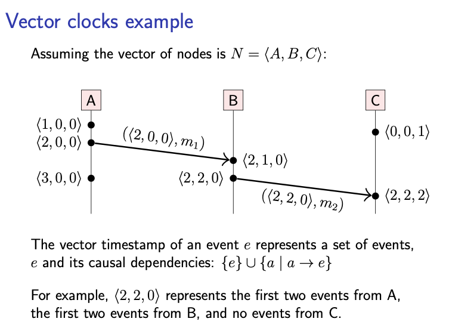

- **TAG**: [[Computer Science]]
- 相关文章
	- 分布式领域最重要的一篇论文，到底讲了什么？
	  collapsed:: true
		- 来源：https://mp.weixin.qq.com/s/FZnJLPeTh-bV0amLO5CnoQ
		- 内容：
			- [[一致性模型]]的关键在于
				- 它们定义了一个系统在分布式环境下对于读写操作的某种排序规则。
					- [[分布式系统]]内的事件排序，涉及到最深层的本质问题。
						- 图灵奖得主Lamport在1978年发表的经典论文，《Time, Clocks, and the Ordering of Events in a Distributed System》[1]，正是对这些本质问题的一个系统化的阐述。
			- 为什么这篇论文如此重要？
				- 这篇论文除了理论意义和历史价值之外，它与业界一些重要的分布式系统实践也都有紧密的联系。
					- 比如，在大规模的分布式环境下产生单调递增的时间戳是个很难的问题，
						- 而谷歌的全球级分布式数据库Spanner就解决了这个问题，甚至能够在跨越遍布全球的多个数据中心之间高效地产生单调递增的时间戳。
							- 做到这一点，靠的是一种称为TrueTime的机制，而这种机制的理论基础就是Lamport这篇论文中的[[物理时钟算法]]（两者之间有千丝万缕的联系）。
					- 再比如，这篇论文中定义的「[[Happened Before]]」关系，不仅在[[分布式]]系统设计中成为考虑不同事件之间关系的基础，而且在[[多线程]]编程模型中也是重要的概念。
					- 另外，还有让很多人忽视的一点是，利用分布式[[状态机]]来实现数据复制的通用方法（[[State Machine Replication]]，简称SMR），其实也是这篇论文首创的。
			- 分布式系统中的事件和偏序关系
				- 论文主要是讲三个基础概念：
					- [[时间]]（Time）、
					- [[时钟]]（Clock）、
					- [[事件排序]]（Ordering of Events）
				- 它们之间的关系大概是：
					- [[事件]]是一个抽象概念，根据应用场景不同，程序运行发生的任何事情都可以表示成事件
						- 比如，根据论文中举的例子，一个子程序开始执行，可以看成是一个事件；一条机器指令的执行，也可以看成一个事件。
						- 一个分布式系统由很多进程组成，而一个进程可以看成是一个事件序列。
					- [[时间]]是一个物理学上的概念。每个事件发生的时候，都对应时间的某个数值。而根据[[相对论]]，时空是不可分割的，时间必须与空间一起讨论才有意义。
					- [[时钟]]分两种，
						- 一种是[[物理时钟]]（Physical Clock），或者叫实时时钟（Real Clock）；
							- 物理时钟是对时间的一种度量；现实中的物理时钟肯定是有误差的。
						- 另一种是[[逻辑时钟]]（Logical Clock）。
							- 而逻辑时钟是跟物理时间无关的，用于对每一个发生的事件指派一个单调递增的数值，是系统执行节拍的一种内部表示。
					- 事件排序是[[偏序]]的（Partial Ordering）。
						- 两个不同的事件，可能具有先后关系，它们之间是能够排序的；
						- 也可能两个事件之间根本无法按照先后关系来排序。
				- 论文实际上是从事件开始讲起的。进程的执行被看成是一连串事件的持续发生。随后，事件之间的[[排序]]问题就很自然地被提出来了。
					- 联系我们日常的系统设计实践，我们就经常需要对分布式系统中的不同事件的发生次序进行判定。
						- 比如我们在之前的文章中讨论的各种一致性模型，主要就是给予不同读写操作（事件）一个合理的排序；
						- 再比如为了实现串行化（Serializability）的事务隔离性，也需要判定各个事务操作之间的排序。
					- 这些排序问题，可能涉及到在一个进程内部的多个事件之间排序，这通常还是比较容易的；同时还可能涉及到对发生在不同进程（位于不同节点上）上的事件进行排序，这通常就没有那么直观了
				- 如果我们说事件a在事件b之前发生，直觉上的含义大概是：事件a发生的时间比事件b发生的时间要早。
					- 然而，这种判定事件之间次序的方式，是依赖物理时间的。
					- 这要求我们必须引入物理时钟才行，而物理时钟不可能百分之百精确。
				- 因此，Lamport在定义事件之间的关系的时候特意避开了物理时间。这就是著名的「[[Happened Before]]」关系（用符号“→”来表示）。
					- 见下面进程P、Q和R的消息时空图（注意图中自下而上时间递增）：
						- 
					- 结合上图我们举例解释一下「Happened Before」关系：
						- 同一进程内部先后发生的两个事件之间，具有「Happened Before」关系。
							- 比如，在进程Q内部，*q*2表示一个消息接收事件，*q*4表示另一个消息的发送事件，*q*2排在*q*4前面执行，所以*q*2→*q*4。
						- 同一个消息的发送事件和接收事件，具有「Happened Before」关系。
							- 比如，*p*1和*q*2分别表示同一个消息的发送事件和接收事件，所以*p*1→*q*2；同理，*q*4→*r*3。
						- 「Happened Before」满足传递关系。
							- 比如，由*p*1→*q*2，*q*2→*q*4和*q*4→*r*3，可以推出*p*1→*r*3。
					- 这种「Happened Before」关系的关键在于，它是一种[[偏序关系]]。
						- 也就是说，并不是所有事件之间都具有「Happened Before」关系。比如*p*1和*q*1两个事件就是无法比较的，*q*4和*r*2也是无法比较的。
				- 这里的「Happened Before」关系定义与[[因果一致性]]中的因果顺序定义非常相似。
					- 实际上，因果一致性的概念[4]相当于将「Happened Before」关系应用在了读写操作之上。
				- Lamport在论文中是这样描述与[[因果性]]的关系的：
					- Another way of viewing the definition is to say that a→b means that it is possible for event a to causally affect event b. Two events are concurrent if neither can causally affect the other.
					- (译文：看待「Happened Before」关系的另一种方式，相当于是说，a→b意味着事件a**有可能**在因果性上对事件b产生影响。如果两个事件谁也无法影响对方，那么它们就属于并发关系。)
				- 「Happened Before」关系，几乎是分布式系统中最基础的一个概念。Lamport的论文后面的其他概念和算法，也都是以这个偏序关系为基础建立起来的。
					- 现在我们知道，「先后关系」是一个非正式的描述，而「Happened Before」才是用于描述两个事件之间关系的最规范的、也是唯一正确的概念。
						- 这个概念清晰地表达一种偏序而非全序关系，规定了哪些事件之间不可比较，哪些事件之间具有「Happened Before」关系。
			- [[逻辑时钟]]
				- 前面我们提到过，Lamport在定义事件之间的「Happened Before」关系时特意避开了物理时间。这也就意味着，对事件的「发生时间」进行度量，只能根据逻辑时钟。
				- 逻辑时钟相当于一个函数，对于每一个发生的事件，它都能给出一个对应的数值（即给这个事件打上了一个时间戳）。
					- 用符号来表示的话就是：事件a发生时对应的时钟值（时间戳）是C〈a〉。
				- 为什么要定义逻辑时钟这个概念呢？
					- 我们前面讨论过，在分布式系统中我们经常需要对不同的事件进行排序。
					- 那么，为了实现这种排序操作，我们很自然地就需要对事件的发生进行一种数值上的度量。
					- 我们希望，可以通过比较事件的时间戳数值大小，来判断事件发生的次序（即「Happened Before」关系）。
					- 这就好比我们通过看钟表上显示的数值来确定时间的流逝一样。
				- 当然，逻辑时钟在给事件打时间戳的时候，必须要满足一定条件的。
					- 这个过程必须能在一定程度上反映出事件之间的「Happened Before」关系。
					- 论文这一部分最重要的就是定义了一个时钟条件（Clock Condition），如下：
						- 对于任意的事件a和b：如果a→b，那么必须满足C〈a〉 < C〈b〉。
				- 如图，在图上用蓝色字体在方括号中标注了一些数字，而且在每个消息收发事件旁边都标了一个。这些数字表示某个逻辑时钟给对应的事件打的时间戳。
					- 
				- 如果仔细检查的话，会发现图中标注的逻辑时钟是符合前面的时钟条件的。举几个例子：
					- 考察进程Q内部的两个事件，*q*2→*q*4，而C〈*q*2〉 = 52 < C〈*q*4〉 = 54。
					- 再考察同一个消息的发送事件和接收事件，*p*1→*q*2，而C〈*p*1〉 = 40 < C〈*q*2〉 = 52。
				- 但我们需要尤其注意的是，逻辑时钟的时钟条件，是一个单向的条件，反过来是不成立的。比如：
					- 我们有C〈*p*3〉 = 53 < C〈*q*4〉 = 54，但不能说明*p*3→*q*4成立。
						- 也就是说，虽然对任意两个事件来说，它们各自对应的时间戳在数值上都可以比较大小，但据此并不能得到两个事件之间存在「Happened Before」关系。
						- 从本质上看，时钟条件的这种单向推导逻辑，是由「Happened Before」关系的偏序特性所决定的。
			- 为什么又需要[[全局排序]]？
				- 我们简单回顾一下前一个章节的思路。
					- 最开始，我们引入逻辑时钟，是希望可以通过比较事件的时间戳数值大小，来帮助我们判断事件之间的「Happened Before」关系。
					- 然而，最后由于时钟条件的单向推导逻辑的限制，我们发现，不能根据两个事件对应的时间戳在数值上的大小来推断出它们之间是否存在「Happened Before」关系。
					- 真是一个矛盾的结果！
						- 导致这个矛盾的原因，还是在于「Happened Before」的偏序性。对于不具有「Happened Before」关系的两个事件来说，它们对应的时间戳数值比较大小，是没有意义的。
						- 但是，确实可以根据两个时间戳的大小，来为两个事件「指定」一个次序。这个次序是人为指定的，并不是客观上要求的。
							- 还是拿前面的消息时空图来举个例子：*p*3和*q*4这两个事件，它们之间不存在「Happened Before」关系。
								- 但是，我们发现C〈*p*3〉 = 53，C〈*q*4〉 = 54，而53 < 54，所以我们人为指定一个次序，即认为*p*3是在*q*4之前发生的。
								- 实际上，由于这两个事件之间不存在「Happened Before」关系，我们不管是认为*p*3在*q*4之前发生，还是认为*q*4在*p*3之前发生，都没有大碍。
				- 现在，我们就引入了另外一个问题：如果我们按照逻辑时钟给出的时间戳从小到大把所有事件都排成一个序列，那么就得到了分布式系统中所有事件的全局排序。
					- 下面我们把前面进程P、Q和R的消息时空图中的所有事件，按照时间戳进行全局的大排序，会得到：
						- *p*1 => *r*1 => *r*2 => *q*1 => *p*2 => *q*2 => *p*3 => *q*3 => *q*4 => *q*5 => *r*3=> *p*4 => *q*6 => *r*4 => *q*7
					- 在这个排序中，所有事件之间的「Happened Before」关系都被保持住了；而本来不存在「Happened Before」关系的事件之间，我们也依据时间戳的大小，通过人为指定的方式得到了一个次序。
					- 总之，我们得到了所有事件的一种全局排序，而这种排序是和「Happened Before」关系（即因果顺序）保持一致的。
				- 那么，这样一种全局排序有什么用呢？
					- 实际上，这是实现任何[[分布式系统]]的一种通用方法。只要我们获得了所有事件的全局排序，那么各种一致性模型对于读写操作所呈现的排序要求，很自然就能得到满足。
						- 例如，[[线性一致性]]和[[顺序一致性]]所要求的，正是要把所有读写操作（对应这里的事件）重排成一个全局线性有序的序列。
				- 实际上，之所以前面设计出了[[逻辑时钟]]，最终目的就是为了得到一种事件全局排序的机制。
					- 而更近一步，事件的[[全局排序]]结合[[状态机]]复制（State Machine Replication）的思想，几乎可以为任何分布式系统的设计提供思路。
					  collapsed:: true
						- 关于这一点，Lamport曾经写下了如下的句子
							- It didn’t take me long to realize that an algorithm for totally ordering events could be used to implement any distributed system. A distributed system can be described as a particular sequential state machine that is implemented with a network of processors. The ability to totally order the input requests leads immediately to an algorithm to implement an arbitrary state machine by a network of processors, and hence to implement any distributed system.
							- (译文：我很快就意识到，对事件进行全局排序的算法，可以用于实现任何分布式系统。一个分布式系统可以被看作是一个由处理器网络实现的序列状态机。对输入请求进行全局排序的能力一旦具备，我们立即就能推导出使用处理器网络实现任意一个状态机的算法，因此可以用于实现任何分布式系统。)
			- 逻辑时钟的异常行为
				- 由于系统采用了逻辑时钟，因此处理请求B的服务器有可能为请求B打上了一个比请求A更小的时间戳。（但请求A和请求B在“真实世界”，即系统外的世界，可能是有因果关系的）
					- 对于逻辑时钟来说，这种行为属于正常情况。
						- 这是因为，一方面，逻辑时钟的定义特意避开了物理时间，系统产生的时间戳与请求的真实时间先后并没有直接关系；
						- 另一方面，在系统内部，请求A与请求B这两个事件之间，并不存在「Happened Before」关系，因此并不保证请求B的时间戳一定比请求A的时间戳更大。
				- 这种情况，Lamport在论文中称为异常行为（anomalous behavior）。
					- 可见，只是使用逻辑时钟，不能避免这种异常行为；而一个好的分布式系统设计，应该消除这种异常行为。
				- 我们看到，请求A和请求B实际上应该是存在因果关系的，因为是Alice在发出请求A之后打电话告诉了Bob，之后请求B才被发出来。
					- 但这个因果性是通过系统外部的联系方式（打电话）来体现的，系统内部并不知晓，所以没有在请求A和请求B之间构建起「Happened Before」关系。
				- 我们可以这样思考：
					- 出现异常行为的原因在于系统不知道Alice给Bob打了电话，所以才认为给请求B打一个更小的时间戳是合理的。
					- 显然，让系统知道Alice给Bob打电话这个事实，是不太可能的。
					- 但我们注意到，如果考虑一下请求A和B发出的时间先后，这个问题可能就有办法解决了。
					- 在这个例子中，Alice给Bob打电话起码要花上几分钟，也就是说请求B发生的时间比请求A要晚几分钟。对于晚了这么久的请求B，系统仍然给打了一个更小的时间戳，根本原因在于逻辑时钟是没有和真实的物理时间绑定的。
						- 因此，我们可以得到结论，仅仅使用逻辑时钟是不够的，需要使用物理时钟才行。
							- 又因为我们需要一个分布式的系统，所以物理时钟不能只有一个实例，而是最好每个进程都有自己对应的本地物理时钟。
							- 否则，运行物理时钟的进程就会成为单点，也就失去了分布式的意义。
				- 那么，物理时钟需要多精确，才能杜绝这种异常行为？
					- 现在我们假设，如果系统的物理时钟满足这样一个最苛刻的条件：
						- 即使Alice通知Bob的速度达到**光速**，系统也总是能保证对请求B打上的时间戳要大于请求A的时间戳，那么，就能保证永远不出现前面的异常行为。
					- 这样的一个时钟条件，在Lamport的论文中被称为[[Strong Clock Condition]]。具体描述如下：
						- 对于任意的事件a和b：如果a➜b，那么必须满足C〈a〉 < C〈b〉。
					- 这看起来跟前面逻辑时钟的时钟条件差不多，实则不然。这里的“➜”和“→”的含义截然不同：
						- “→”表示「Happened Before」关系；
						- 而“➜”表示由相对论定义的事件偏序关系。
			- 时空本身定义了一种偏序
				- [[相对论]]的时空概念
					- 为了表现光随着时间的流逝传播的情况，我们增加一个时间维度，得到下面的时空坐标：
						- 
						- 在这个时空坐标中，空间占两维（x和y），时间占一维，形成了一个三维时空。
							- 在这样的一个时空坐标中，在每个时刻t，光所到达的地方都会形成一个圆周（图中用绿色虚线圆周表示）。
							- 最终，光的传播所经过的时空位置构成一个向上的光锥（称为未来光锥）。
						- 在这个三维时空坐标系中，每个点都可以是一个事件。
							- 比如点P，表示在特定位置、特定时刻发生的某个事件。
							- 同理，点Q也可以表示一个事件。
							- 而原点O，可以表示在原点位置发生于时刻0的事件。
						- 根据[[相对论]]，任何信息传递的速度，最快就是光速。
							- 而一个事件要想对另一个事件产生影响，至少要在那个事件发生之前传递一定的信息到达所在的空间位置。
							- 因此，一个事件所能够影响的范围，就是以它为顶点的未来光锥内部的时空区域。
								- 以上图为例，点P在点O的未来光锥内部，因此事件P可能受到事件O的影响；
								- 而点Q在点O的未来光锥外部，因此事件Q不可能受到事件O的影响。
							- 这些事件之间可能产生的影响关系，就是我们上一章节末尾所提到的事件偏序关系“➜”。
								- 例如，对于事件O和事件P的关系，我们可以用符号表示成：O➜P。但事件O和事件Q之间就不存在O➜Q的关系。
				- 现在，我们来对前面碰到的诸多概念进行一个总结：
					- 一个事件**可能**对它的未来光锥内部的任何事件产生因果性上的影响。
					- 一个事件与它的未来光锥内部的任何事件之间，满足一个偏序关系，即“➜”。
				- 与「Happened Before」关系进行对比，我们可以认为，「Happened Before」关系是专门针对分布式系统设计出来的概念，是对相对论中的事件偏序关系的一种模拟。
					- Lamport在论文中定义完「Happened Before」的概念之后，讲了这样一段话：
						- In relativity, the ordering of events is defined in terms of messages that could be sent. However, we have taken the more pragmatic approach of only considering messages that actually are sent.
						- (译文：在相对论中，事件的排序是根据**可能**发送的消息来定义的。然而，我们这里采取了更务实的做法，仅仅考虑那些实际上已经发送过的消息。)
				- 最后我们回到物理时钟的Strong Clock Condition上来。如果每一个物理时钟都能够做到百分之百精确（跟真实时间随时保持一致），那么这个强时钟条件是显而易见满足的。
					- 为什么呢？因为由“➜”所表示的两个事件之间的偏序关系，意味着后一个事件在前一个事件的未来光锥之内，当然它的时间坐标就要大于第一个事件了。
				- 但是，物理时钟一定是有误差的，当我们从理论回到工程的现实，就需要一个时钟同步算法来保证Strong Clock Condition总是被满足。
			- [[物理时钟同步算法]]
				- 我们的目标是，通过运行一个时钟同步算法，保证时钟对于任何事件打上的时间戳都不产生前面的异常行为（anomalous behavior）。
					- 也就是说，对于任意两个有偏序关系的事件（或者说可能在因果性上产生影响的两个事件），我们的物理时钟要保证总是会为后一个事件打上一个更大的时间戳。
				- 要实现这个目标，我们面临的障碍主要来源于物理时钟的两种误差：
					- 时钟的运行速率跟真实时间的流逝速率可能有差异；
					- 任意两个时钟的运行速率有差异，它们的读数会漂移得越来越远。
				- Lamport在论文中提出的物理时钟同步算法，
					- 做的事情其实就是，将这两种时钟误差考虑在内，不断地对各个进程本地的物理时钟进行微调，把误差控制在能够满足Strong Clock Condition的范围内。
				- 我们这里说一下算法的指导思想
					- 分别考虑进程内的事件和跨进程的事件：
						- 对于进程内发生的不同事件，必须保证后发生的事件比先发生的事件时间戳要大。
							- 这实际上是要求我们保证每个物理时钟实例的读数总是单调递增的。这是比较容易实现的，我们只需要在微调时钟读数的时候，只把读数调大而不把读数调小。
						- 对于发生在两个不同进程上的事件，就比较麻烦了。
							- 我们还是再考察一下前面Alice和Bob的例子。Bob之所以感受到了异常，是因为Alice通过系统外的一种方式通知了Bob，于是在请求A和请求B这两个事件之间确立起了偏序关系。
								- 现在为了保证不出现异常行为，我们就要求，不管Alice向Bob传递信息这个过程发生的速度有多快（最快可以达到光速，但在实际系统中，由于网络延迟和缓存等原因会慢很多），请求B发生时的时钟读数都必须大于请求A发生时的时钟读数。
								- 这个要求可能没法被满足的原因，在于两边的物理时钟可能有误差。
							- 因此，就需要在不同的物理时钟之间交换信息，并借助这些信息同步时钟读数。通过这种方式，预期可以把时钟之间的误差控制在一定范围内。
								- 可以这么说，只要我们在时钟之间交换信息足够频繁，就有希望做到这一点。
									- 这是两种机制的赛跑：
										- 一方面，Alice通过系统外的方式向Bob传递信息，只要这个过程足够快，他们就有可能“看到”时钟误差造成的时钟读数减退（也就是出现了异常行为）；
										- 另一方面，物理时钟同步算法通过在时钟之间不断交换信息并按照一定规则调整时钟读数，将时钟误差控制在一定范围内。
							- 只要算法的各个参数设置得当，就能保证：即使Alice向Bob传递信息的速度达到物理极限——光速，他们也无法“看到”时钟读数的减退现象。于是，Strong Clock Condition就被满足了。
			- 小结
				- Lamport这篇论文之所以重要，在于它深入到了分布式系统的基础层面，并延伸到宇宙的本质。
				- 除了提出「Happened Before」、逻辑时钟、事件偏序等等一系列概念之外，它还划定了系统的能力边界。
					- 它告诉我们，什么样的问题可以在系统内部，遵循一个纯异步的模型（asynchronous model）框架就能解决（比如非拜占庭模型下的共识问题）；
					- 而什么样的问题，必须求诸系统的“外部”（也就是物理世界）才能得到解决（比如拜占庭模型下的共识问题、线性一致性问题等）。所有这些，都深深地影响了人们对于分布式系统的思考方式。
			-
- 相关课程
	- Distributed Systems University of Cambridge Dr. Martin Kleppmann
		- 来源：https://www.cl.cam.ac.uk/teaching/2122/ConcDisSys/dist-sys-notes.pdf
		- Time, clocks, and ordering of events
			- Clocks and time in distributed systems
			  collapsed:: true
				- Distributed systems often need to measure time, e.g.:
					- Schedulers, timeouts, failure detectors, retry timers
					- Performance measurements, statistics, profiling
					- Log files & databases: record when an event occurred
					- Data with time-limited validity (e.g. cache entries)
					- Determining order of events across several nodes
				- We distinguish two types of clock:
					- physical clocks: count number of seconds elapsed
					- logical clocks: count events, e.g. messages sent
				- note
					- Clock in digital electronics (oscillator) != clock in distributed systems (source of timestamps)
			- Physical clocks
			  collapsed:: true
				- 物理时钟以秒为单位测量时间。
				  collapsed:: true
					- 它们包括基于钟摆或类似机构的模拟/机械钟，以及基于振动石英晶体的数字钟。
					- 石英钟很便宜，但并不完全准确。
						- 由于制造上的缺陷，有些钟表走得比其他钟表略快。振荡频率随温度的变化而变化。
						- 典型的石英钟在室温下会非常稳定，但温度升高或降低会使时钟变慢。
						- 时钟走快或走慢的速率叫做漂移。
				- Quartz clock error: drift（漂移）
				  collapsed:: true
					- One clock runs slightly fast, another slightly slow
					- Drift measured in parts per million (ppm)
						- 以百万分之一(ppm)为单位测量的漂移
					- 1 ppm = 1 microsecond/second = 86 ms/day = 32 s/year
						- 1ppm = 1微秒/秒= 86毫秒/天= 32秒/年
					- Most computer clocks correct within ≈ 50 ppm
						- 大多数计算机时钟在≈50ppm范围内正确
					- Temperature significantly affects drift
						- {:height 231, :width 378}
				- 当需要更高的精度时，就使用原子钟。
				  collapsed:: true
					- 这些时钟是基于某些原子的量子力学性质，如铯或铷。
					- 事实上，在国际单位制(SI)中，一秒的时间单位被定义为铯-133原子特定谐振频率的9,192,631,770个周期。
				- 另一种高精度获取时间的方法是依赖GPS卫星定位系统，或类似的系统，如伽利略或GLONASS。
				  collapsed:: true
					- 这些系统的工作原理是让几颗卫星围绕地球运行，并以非常高的分辨率广播当前时间。
						- 每颗都装有原子钟
					- 接收器测量信号从每颗卫星到达它们所需的时间，并利用这一点计算出它们与每颗卫星的距离，从而确定它们的位置。
						- 通过卫星和接收器之间的光速延迟来计算位置
						- 校正大气效应，相对论等
					- 通过将GPS接收器与计算机连接，只要接收器能够从卫星获得清晰的信号，就有可能获得精确到几分之一微秒的时钟。
					- 在数据中心中，通常有太多的电磁干扰，无法获得良好的信号，因此GPS接收机需要在数据中心建筑物的屋顶上安装天线。
				- 以原子钟为基础的时间测量系统(国际原子时，TAI)工作良好，但它与我们日常的时间感知脱节，我们的时间感知是基于日出和日落。
				  collapsed:: true
					- 地球绕着自己的轴转一圈，所花费的时间并不完全是铯-133的共振频率的24×60×60×9,192,631,770个周期。
					- 事实上，地球的自转速度甚至不是恒定的:由于潮汐、地震、冰川融化和一些无法解释的因素的影响，它会波动。
					- 我们现在有一个问题:我们有两种不同的时间定义
						- 一种基于量子力学，
						- 另一种基于天文学
					- 而这两种定义并不完全匹配
				- 解决方案是协调世界时([[UTC]])，它以原子时间为基础，但包含了考虑地球自转变化的修正。
				  collapsed:: true
					- 在日常生活中，我们使用本地时区，它被指定为UTC的偏移量。
					- UTC和TAI之间的区别在于UTC包括闰秒，根据需要添加闰秒，以使UTC与地球的旋转大致同步。
				- Leap seconds（闰秒）
				  collapsed:: true
					- 每年，在6月30日和12月31日23:59:59协调世界时，会发生以下三种情况之一:
						- 时钟立即跳转到00:00:00，跳过一秒(负闰秒)
						- 时钟和往常一样，一秒钟后移到00:00:00
						- 一秒后时钟转到23:59:60，一秒后时钟转到00:00:00(正闰秒)
					- 这是提前几个月宣布的。
					- 由于闰秒的存在，一个小时总是3600秒，一天总是86400秒的说法并不正确。
						- 在UTC时间刻度中，由于闰秒的存在，一天可以是86,399秒、86400秒或86,401秒。这使得需要处理日期和时间的软件更加复杂。
				- How computers represent timestamps
				  collapsed:: true
					- Two most common representations:
						- Unix time: number of seconds since 1 January 1970
						  00:00:00 UTC (the “epoch”), not counting leap seconds
						- ISO 8601: year, month, day, hour, minute, second, and timezone offset relative to UTC
							- example: 2021-11-09T09:50:17+00:00
					- Conversion between the two requires:
						- Gregorian calendar: 365 days in a year, except leap years
							- (year % 4 == 0 && (year % 100 != 0 || year % 400 == 0))
						- Knowledge of past and future leap seconds. . . ?!
				- 为了正确，使用时间戳的软件需要了解闰秒。
					- 例如，如果希望计算两个时间戳之间经过了多少秒，则需要知道在这两个日期之间插入了多少闰秒。
					- 软件中最常见的方法是简单地忽略闰秒，假装它们不存在，并希望问题以某种方式消失。
						- Unix时间戳和POSIX标准采用了这种方法。对于只需要粗粒度计时的软件(例如四舍五入到最近的一天)，这是很好的，因为几秒的差异并不重要。
					- 然而，操作系统和分布式系统通常依赖于高分辨率时间戳来精确测量时间，其中一秒的差异是非常明显的。在这种情况下，忽略闰秒可能是危险的。
					  collapsed:: true
						- 例如，假设有一个Java程序两次调用System.currentTimeMillis()，间隔500毫秒，在一个正闰秒内(即时钟显示23:59:60)。这两个时间戳的区别是什么?它不能是500，因为currentTimeMillis()时钟不考虑闰秒。时钟是否停止，因此两个时间戳之间的差值为零?或者这种差异甚至可能是负的，所以时钟会倒退一小会儿?文档对这个问题只字未提。(最好的解决方案可能是使用单调时钟）
						- 2012年6月30日闰秒处理不当导致当日许多服务同时失效(幻灯片42)。由于Linux内核中的一个bug，闰秒在运行多线程进程时很有可能触发一个livelock条件[Allen, 2013, Minar, 2012]。即使重新启动也不能解决问题，但是设置系统时钟重置了内核中的坏状态。
					- 如今广泛使用的一种实用的解决方案是，当正闰秒发生时，而不是将其插入到23:59:59到00:00:00之间，而是通过故意放慢这段时间内的时钟(或在负闰秒的情况下加速)，将额外的一秒分散到该时间前后的几个小时。
						- 这种方法被称为“涂抹闰秒”，它并非没有问题。
						- 然而，对于让所有软件都意识到并健壮于闰秒来说，这是一种实用的替代方案，这可能是不可行的。
			- Clock synchronisation and monotonic clocks（时钟同步和单调时钟）
			  collapsed:: true
				- Clock synchronisation
					- 计算机使用石英钟跟踪物理时间/UTC(带电池，断电时继续运行)
					- 由于时钟漂移，时钟误差逐渐增大
					- 时钟偏差:
						- 两个时钟在同一时间点上的差异
					- 解决方案:
						- 定期从具有更准确时间源(原子钟或GPS接收器)的服务器获取当前时间
					- 协议:
						- NTP (Network Time Protocol)，
						- PTP (Precision Time Protocol)
					- 所有主流操作系统都内置了NTP客户端。
				- Network Time Protocol (NTP)
				  collapsed:: true
					- 许多操作系统供应商运行NTP服务器，配置操作系统默认使用它们
					- 时钟服务器分层排列:
						- 0层:原子钟或GPS接收机
						- 1层:直接与0层设备同步。
						- 2层:与1层同步的服务器，依此类推。
					- 可以联系多个服务器，丢弃异常值，平均休息
					- 向同一服务器发出多个请求，使用统计信息来减少由于网络延迟变化而导致的随机错误
					- 在良好的网络条件下将时钟偏差降低到几毫秒，但可能更糟!
				- Estimating time over a network（估计网络上的时间）
				  collapsed:: true
					- {:height 314, :width 414}
					- 不可预测的延迟使网络上的时间同步变得困难。网络延迟和节点的处理速度都可能有很大差异。
					- 为了减少随机变化的影响，NTP采用几个时间测量样本，并应用统计滤波器来消除异常值。
						- 我们可以通过从客户端角度计算往返时间(t4−t1)并减去服务器上的处理时间(t3−t2)来确定消息在网络中传播所花费的时间。
						- 然后我们估计单向网络延迟是总网络延迟的一半。因此，当响应到达客户端时，我们可以估计服务器的时钟将移动到t3加上单向网络延迟。
						- 然后，我们从估计的服务器时间中减去客户机的当前时间t4，以获得两个时钟之间的估计偏差。
					- 这个估计依赖于网络延迟在两个方向上大致相同的假设。
						- 如果延迟是由客户机和服务器之间的地理距离决定的，那么这个假设可能是正确的。
						- 然而，如果网络中的排队时间是延迟的一个重要因素(例如，如果一个节点的网络链路负载过重，而另一个节点的链路有大量空闲容量)，那么请求和响应延迟之间可能会有很大的差异。
						- 不幸的是，大多数网络并没有给节点任何特定数据包所经历的实际延迟的指示。
					- 一旦NTP估计了客户端和服务器之间的时钟偏差，下一步就是调整客户端时钟使其与服务器一致。
						- 用于此的方法取决于倾斜的量。
						- 客户端通过根据需要调整时钟速度来稍微快一点或慢一点地纠正小的差异，这将在几分钟内逐渐减少倾斜。
						- 这个过程被称为“调钟”。
							- 
				- 时钟可能会被NTP调整，即突然向前或向后移动，这对任何需要测量流逝时间的软件都有重要的意义。
				  collapsed:: true
					- Java有两个从操作系统的本地时钟获取当前时间戳的核心函数:currentTimeMillis()和nanoTime()。除了不同的分辨率(毫秒vs纳秒)，两者之间的关键区别在于它们在面对来自NTP或其他来源的时钟调整时的表现。
						- currentTimeMillis()是一个日时时钟(也称为实时时钟)，返回自固定参考点(在本例中为1970年1月1日的Unix epoch)以来所经过的时间。
							- 当NTP客户端步进本地时钟时，一天中的某个时间的时钟可能会跳变。
							- 因此，如果使用这样的时钟来测量流逝的时间，那么结束时间戳和开始时间戳之间的结果差异可能会比实际流逝的时间大得多(如果时钟往前走)，甚至可能是负的(如果时钟向后走)。因此，这种类型的时钟不适合测量经过的时间。
						- 另一方面，nanoTime()是一个单调时钟，它不受NTP步进的影响:它仍然计算经过的秒数，但它总是向前移动。
							- 只有它向前移动的速度可以通过NTP回转来调整。
							- 这使得单调时钟在测量流逝时间时更加健壮。
							- 缺点是单调时钟的时间戳本身是没有意义的:它测量的是自某个任意参考点以来的时间，比如自计算机启动以来的时间。
							- 当使用单调时钟时，只有来自同一节点的两个时间戳之间的差异才有意义。在不同节点之间比较单调的时钟时间戳是没有意义的。
					- 大多数操作系统和编程语言都提供了时间时钟和单调时钟，因为这两种时钟用于不同的目的。
				- Monotonic and time-of-day clocks（单调的时间时钟）
					- Time-of-day clock:
						- Time since a fixed date (e.g. 1 January 1970 epoch)
						- May suddenly move forwards or backwards (NTP stepping), subject to leap second adjustments
						- Timestamps can be compared across nodes (if synced)
						- Java: System.currentTimeMillis()
						- Linux: clock_gettime(CLOCK_REALTIME)
					- Monotonic clock:
						- Time since arbitrary point (e.g. when machine booted up)
						- Always moves forwards at near-constant rate
						- Good for measuring elapsed time on a single node
						- Java: System.nanoTime()
						- Linux: clock_gettime(CLOCK_MONOTONIC)
			- Causality and happens-before（因果关系与 [[Happened Before]] ）
			  collapsed:: true
				- Ordering of messages
					- 现在我们将继续讨论分布式系统中事件排序的问题，这与时间的概念密切相关。
					- {:height 301, :width 422}
					- 如果m1在网络中稍有延迟，C可能会在m1之前接收到m2。
					- 从C的角度来看，结果是令人困惑的:C首先看到回复，然后是它要回复的消息。
						- 看起来好像B能在A说之前就预见到未来并预测到A的陈述。
						- 在现实生活中，这种口语的重新排序是不会发生的，所以我们直觉上也不指望它会发生在计算机系统中。
					- 作为一个更技术性的例子，将m1视为一条在数据库中创建对象的指令，而m2则是一条更新同一对象的指令。
						- 如果一个节点在m1之前处理m2，它将首先尝试更新一个不存在的对象，然后创建一个随后不会被更新的对象。
						- 只有在m1先于m2处理时，数据库指令才有意义。
				- Physical timestamps inconsistent with causality
					- {:height 334, :width 432}
					- C如何确定放置消息的正确顺序?单调时钟不能工作，因为它的时间戳在节点之间没有可比性。
					- 第一个尝试可能是，当用户想要发送消息时，从一个时间时钟获取一个时间戳，并将该时间戳附加到消息上。
						- 在这种情况下，我们可以合理地期望m2的时间戳比m1晚，因为m2是对m1的响应，所以m2一定发生在m1之后。
						- 不幸的是，在部分同步系统模型中，这并不可靠。
							- 由NTP和类似协议执行的时钟同步总是会对两个时钟之间的确切倾斜留下一些剩余的不确定性，特别是如果两个方向上的网络延迟是不对称的。
							- 因此，我们不能排除以下情况:
								- A根据A的时钟发送带有时间戳t1的m1。
								- 当B接收到m1时，根据B的时钟的时间戳是t2，其中t2< t1，因为A的时钟略快于B的时钟。
								- 因此，如果我们根据来自时间时钟的时间戳对消息进行排序，我们可能再次以错误的顺序结束。
				- The happens-before relation
					- An **event** is something happening at one node (sending or receiving a message, or a local execution step).
					- We say event a **happens before** event b (written a → b) iff:
						- a and b occurred at the same node, and a occurred
						  before b in that node’s local execution order; or
						- event a is the sending of some message m, and event b is the receipt of that same message m (assuming sent messages are unique); or
							- 然后，我们通过定义在接收同一消息之前发送消息来跨节点扩展这个顺序(换句话说，我们排除了时间旅行:不可能接收尚未发送的消息)
							- 为了方便起见，我们假设每个发送的消息都是唯一的，因此当接收到消息时，我们总是清楚地知道消息是在何时何地发送的。
								- 在实践中，可能存在重复的消息，但我们可以使它们具有唯一性，例如在每个消息中包括发送方节点的ID和序列号。
						- there exists an event c such that a→c and c→b.
					- The happens-before relation is a partial order:
						- it is possible that neither a→b nor b→a.
							- In that case, a and b are concurrent (written a || b).
								- 请注意，这里的“并发”并不是字面上的“同时”，而是a和b是独立的，因为没有从一个到另一个的消息序列。
					- {:height 304, :width 416}
				- Causality（[[因果关系]]）
					- Taken from physics (relativity).
						- When a → b, then a might have caused b.
						- When a || b, we know that a cannot have caused b.
					- Happens-before relation encodes potential causality.
						- 
					- 因果关系的概念是从物理学中借来的，在物理学中，人们普遍认为信息的传播速度不可能超过光速。
						- 因此，如果你有两个事件a和b，它们在空间上相距足够远，但在时间上却很接近，那么从a发出的信号不可能在事件b之前到达b的位置，反之亦然。
							- 因此，a和b必然是因果无关的。
						- 如果事件c在空间上足够接近a，并且在时间上距离a足够长，那么事件c将在a的光锥内:
							- 也就是说，来自a的信号有可能到达c，因此a可能会影响c。
							- 在分布式系统中，我们通常使用网络上的消息而不是光束，但原理非常相似。
				-
		- Broadcast protocols and logical time（广播协议和逻辑时间）
			- 在本节课中，我们将研究广播协议(也称为组播协议)，即将一条消息传递给多个接收者的算法。
				- 这些是高级分布式算法的有用构建块。
				- 在实践中使用了几种不同的广播协议，它们的主要区别在于它们传递消息的顺序。
					- 正如我们在上一讲中看到的，排序的概念与时钟和时间密切相关。
					- 因此，我们将通过更仔细地研究时钟如何帮助我们跟踪分布式系统中的顺序来开始这节课。
			- Logical time
			  collapsed:: true
				- Logical vs. physical clocks
					- Physical clock: count number of seconds elapsed
					- Logical clock: count number of events occurred
				- Physical timestamps:
					- useful for many things, but may be inconsistent with causality.
				- Logical clocks:
					- designed to capture causal dependencies.
						- (e1 → e2) ⇒ (T(e1) < T(e2))
				- We will look at two types of logical clocks:
					- Lamport clocks
					- Vector clocks
				- Lamport clocks algorithm
					- {:height 322, :width 418}
					- Lamport clocks in words
						- 每个节点维护一个计数器t，在每个本地事件e上递增
						- 设L(e)为t增量后的值（Lamport时间戳）
						- 当消息通过网络发送时，发送方将其当前的Lamport时间戳 t 附加到该消息上
						- 当接收方收到消息时，它将其本地Lamport时钟向前移动到消息中的时间戳加1;
							- 如果接收者的时钟已经超过了消息中的时间戳，那么它只会增加。
					- Lamport时间戳本质上是一个统计已发生事件数量的整数。
						- 因此，它与物理时间没有直接关系。
						- 在每个节点上，时间都会增加，因为每个事件上的整数都会增加。
						- 该算法假设一个崩溃停止模型(或者一个崩溃恢复模型，如果时间戳保持在稳定的存储中，即磁盘上)。
					- Properties of this scheme:
						- If a→b then L(a)<L(b)
							- 如果a发生在b之前，那么b的时间戳总是大于a;
							- 换句话说，时间戳与因果关系一致。
						- However, L(a) < L(b) does not imply a → b
							- 然而，反过来就不成立了
							- 一般来说，如果b的时间戳比a大，我们知道b !→ a，但我们不知道是a→b还是a||b。
						- Possible that L(a) = L(b) for a != b
							- 两个不同的事件也可能具有相同的时间戳
								- 如果每个事件都需要唯一的时间戳，则每个时间戳都可以扩展为发生该事件的节点的名称或标识符。
								- 在单个节点的范围内，为每个事件分配了唯一的时间戳;
									- 因此，假设每个节点都有唯一的名称，则时间戳和节点名称的组合是全局唯一的(跨所有节点)。
					- {:height 297, :width 438}
					- 使用Lamport时间戳，我们可以将这个偏序关系扩展为一个全局排序。
						- 我们在(时间戳、节点名)对上使用字典顺序:
							- 也就是说，我们首先比较时间戳，如果它们相同，我们通过比较节点名来打破联系。
						- 这个全局排序≺把所有的事件按线性顺序排列
							- 对于任意两个事件a != b，我们要么有一个a≺b，要么有一个b≺a。这是一个因果顺序
								- 换句话说，≺是 偏序关系→ 的线性扩展
							- 然而，如果a||b我们可以得到a≺b或b≺a，所以这两个事件的顺序是由算法任意决定的。
					- 给定两个事件的Lamport时间戳，通常不可能判断这些事件是同时发生的，还是一个事件发生在另一个事件之前。
						- 如果我们确实想检测事件何时是并发的，我们需要一种不同类型的逻辑时间:
							- 向量时钟。
				- [[Vector clocks]]（[[向量时钟]]）
					- Lamport时间戳只是一个整数(可能附加了一个节点名)，而vector时间戳是一个整数列表，系统中的每个节点对应一个。
						- 按照惯例，如果我们将n个节点放入向量⟨N1, N2，……， Nn⟩，那么一个向量时间戳是一个类似的向量⟨t1, t2，…， tn⟩，其中ti是节点Ni对应的条目。
							- 具体而言，ti为已知发生在节点Ni的事件数。
							- 在向量T = =⟨t1,t2，…，tn⟩我们将元素ti称为T[i]，就像数组的索引一样。
					- 除了标量和向量之间的区别之外，向量时钟算法非常类似于Lamport时钟
						- 节点初始化其向量时钟以包含系统中每个节点的零。
						- 每当一个事件发生在节点Ni上，它就会增加它的向量时钟中的第i个条目(它自己的条目)。
							- (在实践中，这个向量通常实现为从节点id到整数的映射，而不是整数数组。)
						- 当消息通过网络发送时，发送方的当前向量时间戳会附加到消息上。
						- 最后，当接收到消息时，接收方通过取两个向量的元素最大值，将消息中的向量时间戳与其本地时间戳合并，然后接收方对自己的条目进行递增。
						- {:height 321, :width 428}
					- 图展示了该算法的一个实例。注意，当C从B接收到消息m2时，A的向量条目也被更新为2，因为该事件与发生在A的两个事件有间接的因果依赖关系。这样，向量时间戳反映了happens-before关系的传递性。
						- {:height 362, :width 487}
					- Vector clocks ordering
						- {:height 350, :width 435}
						- 定义向量时间戳的偏序关系
							- 如果第一个向量的每个元素都小于或等于第二个向量的相应元素，我们就说一个向量小于或等于另一个向量。
							- 如果一个向量小于或等于另一个向量，并且它们至少在一个元素上不同，则一个向量严格小于另一个向量。
							- 但是，如果一个向量在一个元素中具有较大的值，而另一个向量在另一个元素中具有较大的值，则两个向量是不可比较的。
								- 例如，T =⟨2,2,0⟩和T ' =⟨0,0,1⟩是不可比较的，因为T[1]>T '[1]但是T[3] <T[3]。
						- 向量时间戳上的偏序完全对应于happens-before关系定义的偏序。
							- 因此，向量时钟算法为我们在实践中计算happens-before关系提供了一种机制。
					- 至此，我们完成了对逻辑时间的讨论。
						- We have seen two key algorithms:
							- Lamport clocks and vector clocks, one providing a total order and the other capturing the partial order of happens-before.
						- Various other constructions have been proposed: for example, there are hybrid clocks that combine some of the properties of logical and physical clocks
			- Delivery order in broadcast protocols
			  collapsed:: true
				- Broadcast protocols
					- Broadcast (multicast) is group communication:
						- One node sends message, all nodes in group deliver it
						- Set of group members may be fixed (static) or dynamic
						- If one node is faulty, remaining group members carry on
							- 如果一个节点故障，其余成员继续工作
						- Note: concept is more general than IP multicast
							- (we build upon point-to-point messaging)
							- (我们建立在点到点消息传递的基础上)
								- 一些局域网在硬件层提供组播或广播(例如，IP组播)，但是在Internet上的通信通常只允许单播。
								- 此外，硬件级多播通常是在尽力的基础上提供的，这允许消息被丢弃;使其可靠需要类似于这里讨论的重传协议。
					- Build upon system models from lecture 2:
						- Can be best-effort (may drop messages) or reliable (non-faulty nodes deliver every message, by retransmitting dropped messages)
							- 可以是尽力而为(可能会丢弃消息)，也可以是可靠的(非故障节点通过重传丢弃的消息来传递每条消息)
						- Asynchronous/partially synchronous timing model
							- 异步/偏序同步计时模型
							- ⇒ no upper bound on message latency
								- 没有消息延迟上限
				- Receiving versus delivering
					- {:height 318, :width 427}
				- 我们将研究三种不同形式的广播。所有这些都是可靠的:
					- 每条消息都最终传递到每个非故障节点，没有时间保证。
					- 但是，它们在每个节点上传递消息的顺序不同。
						- 事实证明，这种排序上的差异对实现广播的算法有非常基本的影响。
				- Forms of reliable broadcast
					- FIFO broadcast:
						- If m1 and m2 are broadcast by the same node, and broadcast(m1) → broadcast(m2), then m1 must be delivered before m2
					- Causal broadcast:
						- If broadcast(m1) → broadcast(m2) then m1 must be delivered before m2
					- Total order broadcast:
						- If m1 is delivered before m2 on one node, then m1 must be delivered before m2 on all nodes
					- FIFO-total order broadcast:
						- Combination of FIFO broadcast and total order broadcast
				- FIFO broadcast
					- {:height 317, :width 426}
					- 最弱的广播类型被称为FIFO广播，它与FIFO链路密切相关。
					- 在这个模型中，同一节点发送的消息按照发送的顺序传递。
						- 例如，在幻灯片76中，m1必须在m3之前发货，因为它们都是a发送的。
						- 而m2可以在m1和m3之前、之间或之后的任何时间发货。
					- 图上的示例执行是有效的FIFO广播，但它违反了因果关系:
						- 节点C在m1之前交付m2，即使B在交付m1之后广播m2。
				- Causal broadcast
					- {:height 346, :width 430}
					- 因果广播提供了比FIFO广播更严格的排序属性。
					- 顾名思义，它确保消息按照因果顺序传递:
						- 也就是说，如果一条消息的广播发生在另一条消息的广播之前，那么所有节点都必须按照该顺序传递这两条消息。
						- 如果两条消息同时广播，一个节点可以以任意一种顺序传递它们。
				- Total order broadcast
					- {:height 336, :width 431}
					- {:height 345, :width 436}
					- 第三种类型的广播是全顺序广播，有时也称为原子广播。
					- 先进先出和因果广播允许不同的节点以不同的顺序传递消息，而总顺序广播强制节点之间的一致性，确保所有节点以相同的顺序传递消息。
					- 没有定义精确的交付顺序，只要所有节点上的交付顺序相同即可。
				- FIFO-total order broadcast
					- 最后，FIFO-total order broadcast类似于total order broadcast，但是附加了FIFO要求，即同一节点广播的任何消息都按照发送的顺序传递。
					- 幻灯片78和79上的例子实际上是有效的FIFO-total命令广播执行，因为在这两个例子中m1都先于m3交付。
				- Relationships between broadcast models
					- {:height 378, :width 453}
			- Broadcast algorithms
			  collapsed:: true
				- 现在我们将继续讨论实现广播的算法。
				- 粗略地说，这包括两个步骤:
					- 首先，确保每个节点都接收到每条消息;
					- 第二，以正确的顺序传递这些信息。
				- 我们将首先研究如何可靠地传播消息。
					- 我们可能尝试的第一个算法是:当一个节点想要广播一条消息时，它会使用幻灯片33中讨论的可靠链接将该消息单独发送给其他每个节点(即重传丢弃的消息)。
					  collapsed:: true
						- 但是，可能会出现消息被丢弃，发送方在重新传输之前崩溃的情况。在这种情况下，其中一个节点将永远不会接收到该消息。
						- {:height 313, :width 386}
					- 为了提高可靠性，我们可以利用其他节点的帮助。
						- 例如，我们可以说，当一个节点第一次接收到一个特定的消息时，它将该消息转发给其他每个节点(这称为急切可靠广播)。
						  collapsed:: true
							- 该算法确保即使某些节点崩溃，所有剩余的(非故障的)节点也将收到每条消息。
							- 然而，这种算法的效率相当低:在没有故障的情况下，每条消息在一组n个节点中发送O(n^2)次，因为每个节点将接收每条消息n−1次。这意味着它会使用大量的冗余网络流量。
							- {:height 272, :width 383}
						- 该算法的许多变体已经被开发出来，沿着各个维度进行优化，如容错、所有节点接收消息的时间以及所使用的网络带宽。
						  collapsed:: true
							- 一个特别常见的广播算法家族是八卦协议(也称为流行协议)。
								- 在这些协议中，希望广播消息的节点将其发送到随机选择的固定数量的小节点。
								- 在第一次接收到消息时，节点将其转发给随机选择的固定数量的节点。这类似于流言蜚语或传染病在人群中传播的方式。
								- 八卦协议并不能严格保证所有节点都会收到消息:在随机选择节点的过程中，总有一些节点会被忽略。
									- 然而，如果算法的参数选择适当，消息未被传递的概率可以非常小。
									- 八卦协议很有吸引力，因为有了正确的参数，它们对消息丢失和节点崩溃非常有弹性，同时还能保持效率。
								- {:height 280, :width 373}
							-
				- 现在我们有了可靠广播(使用急切可靠广播或八卦协议)，我们可以在其之上构建FIFO、因果广播或全局排序广播。
				- FIFO broadcast algorithm
					- {:height 284, :width 361}
					- 节点Ni发送的每条FIFO广播消息都被标记为发送节点号i和一个序列号，Ni发送的第一条消息为0，第二条消息为1，依此类推。
					- 每个节点的本地状态由序列号sendSeq(计算该节点广播的消息数量)、已发送(每个节点有一个条目的向量，计算该节点已发送的来自每个发送方的消息数量)和缓冲区(用于保留消息，直到它们准备好发送为止的缓冲区)组成。
					- 该算法检查来自任何与预期的下一个序列号匹配的发送方的消息，然后增加该数字，确保来自每个特定发送方的消息按照序列号增加的顺序发送。
				- Causal broadcast algorithm
					- {:height 338, :width 410}
					- 因果广播算法有点类似于FIFO广播;
					- 我们没有为广播的每条消息附加序列号，而是附加了一个整数向量。
						- 这种算法有时被称为向量时钟算法，尽管它与幻灯片70上的算法有很大不同。
							- 在幻灯片70中的向量时钟算法中，向量元素计算每个节点上发生的事件的数量，而在因果广播算法中，矢量元素计算来自每个发送方的已交付的消息的数量。
					- 每个节点的本地状态包括sendSeq、delivered和buffer，含义与FIFO广播算法相同。
					- 当一个节点想要广播一条消息时，我们附加发送节点编号i和deps，这是一个表示该消息因果依赖关系的向量。
					- 我们通过获取delivered的副本来构造deps，该向量计算每个发送方在此节点上已传递了多少消息。
					- 这表明在此广播之前已在本地交付的所有消息必须按因果顺序出现在广播消息之前。
					- 然后，我们将发送节点自己的这个向量的元素更新为等于sendSeq，这确保该节点广播的每条消息都与同一节点广播的前一条消息有因果依赖关系。
					- 当收到消息时，算法首先像FIFO广播一样将其添加到缓冲区，然后在缓冲区中搜索任何准备交付的消息。
					- deps≤交付的比较使用幻灯片72中定义的向量上的≤运算符。
						- 如果该节点已经按照因果顺序交付了必须在此消息之前的所有消息，则此比较是正确的。
					- 然后，将任何因因果关系而准备好的消息传递给应用程序，并从缓冲区中删除，并增加所传递向量的适当元素。
				- Total order broadcast algorithms
					- {:height 309, :width 419}
					- 最后，全局排序广播(和fifo -全局排序广播)更棘手。幻灯片86中概述了两种简单的方法，一种是基于指定的领导节点，另一种是使用Lamport时间戳的无领导算法。
					- 但是，这两种方法都不能容错:
						- 在这两种情况下，单个节点的崩溃都会阻止所有其他节点传递消息。
						- 在单领导者方法中，领导者是单点故障。我们将在第6讲回到容错全序广播的问题。
				-
					-
		-