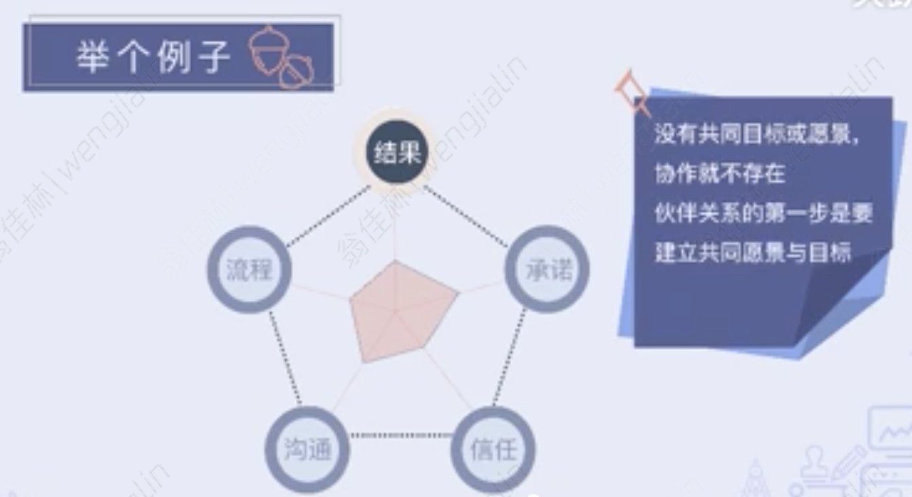
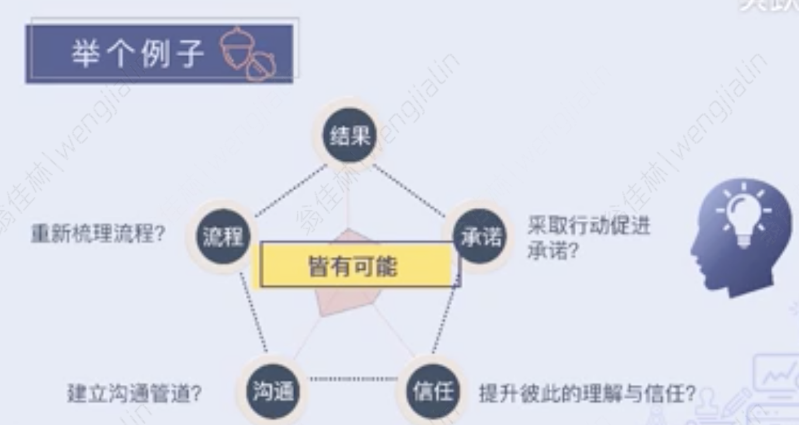

- 课程内容
	- 事半功倍，还是事倍功半
		- 伙伴关系
			- 个人或团队间，为了达到一个特定的目标而有的共同合作关系，并且需要相互负责
				- 共同愿景
				- 无分职务高低
				- 相互负责
			- 伙伴协作时的状态
				- 双赢最好，但很难
					- 目标与优先级不一样
					- 立场和价值认可不一致
			- 如何建立良好的伙伴关系
				- 谁来建立伙伴关系
					- “我”
					- 建立伙伴关系是一种能力
						- 聚集人与资源
						- 工作顺利，成果明显
						- 自身更加快乐
	- 撬动伙伴协作的“利器”
		- 伙伴关系的成功五要素
			- 结果
				- 彼此对目标有共识，共同朝着一个方向前进
			- 流程
				- 对伙伴间的协作方式有共同理解
			- 承诺
				- 说到做到，为了共同目标愿意多投入、多付出
			- 沟通
				- 能开诚布公的相互交流与分享信息
			- 信任
				- 伙伴间可以相互信赖
		- 成功五要素可以 思考及评估伙伴的合作状况，找出未来可以着力提升伙伴关系的撬动点
		- 举个例子
			- 没有共同目标或愿景，协作就不存在
				- 伙伴关系的第一步是要建立共同愿景与目标
				  collapsed:: true
					- 
				- 接下来的四要素，皆有可能
				  collapsed:: true
					- 
		- 五大要素深层含义与联动关系
			- 联动关系
				- 抽丝剥茧的思考其中的关联，我们可以找出更核心的议题，更聚焦的采取行动来改变现状。
	- 打破“本位主义”障碍
		- 阻碍伙伴关系的最大障碍是什么呢
			- 本位主义
		- 本位主义带来的问题
			- 立场、角度的不同，会导致很多项目无法有效协作
			- 即使是立意良善、满怀热情的期望想提升伙伴关系，也可能因为本位主义而功亏一篑
		- 如何解决本位主义
			- 换位思考
				- 主动采取换位思考，可以促进协作，并让对方愿意投桃报李，使协作正向循环
			- 解决本位主义的好用口诀
				- OBBASM（伙伴关系的检核要点）
					- 结果（outcome）
					  collapsed:: true
						- 表示你与你的伙伴对需要双方共同实现的目标与成果有清楚的理解
						- 结果不一致或误解，容易导致方向混乱、期限延误、信任缺乏或成果不佳
							- 如何提升对结果的共同理解，可以提以下问题协助
								- 伙伴关系的达成能够创造什么成果或带来不同结果？
									- 预期的结果
										- 创新的方案
										- 产品或服务
										- 提升组织竞争力
										- 增加流程或沟通效率
										- 共建文化
								- 成功的标准是什么？
									- 数量
									- 品质
									- 成本
									- 时间效率
								- 可以如何评估？
					- 益处（benefits）
					  collapsed:: true
						- 不仅从自己还能从伙伴的角度思考可为对方带来的好处，以突显合作的价值
						- 益处的缺失会使伙伴关系的建立有一定的难度，毕竟伙伴关系需要双赢
						- 益处上常见的雷区
							- 以已度人
								- 将自己主观的想法套到对方身上
							- 与我无关
								- 在合作中不考虑对个人自身的益处
								- WIIFM
									- What's in it for me
									- 关注对个人价值
										- 增加自己的曝光度
										- 学习更专业的技术
										- 和朋友一起奋斗
						- 未来探讨益处时的注意事项
							- 不睬雷区
								- 以己度人
								- 与我无关
							- 正确做法
								- 聚焦个人
								- 思考需求
								- 撬动合作
					- 障碍（Barriers）
					  collapsed:: true
						- 不管是在工作中或是关系上总是会某些时候遇到障碍或问题
							- 提前思考可能问题
							- 主动讨论应对计划
							- 换位思考展现同理
						- 但是，我们会习惯性的低估对方遇到的障碍，就是所谓“站着说话不腰疼”
						- 显性障碍 vs 隐性障碍
							- 显性障碍
								- 人力
								- 资源
								- 时间
								- 经费
								- 材料
								- 优先级
							- 隐性障碍
								- 缺乏信息
								- 缺乏权限
								- 对项目认同不够
								- 过去协作时有负面经历
						- 怎样辨识与找出协作的障碍
							- 过去的合作经历如何
							- 发生过什么问题
							- 是否有什么工作或个人的限制
							- 对方对这个合作有什么想法及感受
						- 开放坦诚的与伙伴询问也是很好的方式
					- 方法（Approach）
					  collapsed:: true
						- 伙伴间合作完成工作，明确彼此角色、任务、相互配合方式、期望以及如何克服障碍的方案
						- 讨论及沟通方案非常重要，它能建立灵活的机制，确保双方协作良好
							- 澄清伙伴角色与责任
							- 明确双方沟通方式与频率
							- 讨论决策及解决冲突的流程
							- 拥有必要的技能或解决方案
					- 支援（Support）
					  collapsed:: true
						- 有形资源+无形资源
							- 有形资源
								- 人、机、物、料
							- 无形资源
								- 信息、关系、陪伴
						- 内部支援+外部支援
							- 内部支援
								- 自己拥有的资源/条件
							- 外部支援
								- 提供我们所需资源的人
						- 没有必要的支持，可能会影响方案与成果的实现
						- 如何提升支援的效果
							- 主动付出、给予而非索取
							- 让对方直接感受到我们合作的诚意与善意
							- 提供实质的帮助
							- 通过陪伴、关怀来满足伙伴的其他期待
					- 评估（Measurement）
					  collapsed:: true
						- 在合作过程中设定目标、追踪与监控进度并根据状况作出必要的调整
						- 定量评估、定性评估
							- 通过建立明确的定量与定性的评估指标，帮助工作进展推进及创建良好合作关系
						- 伙伴关系良好的衡量方法
							- 评估彼此的沟通协调的状况，能否有效调解冲突
							- 彼此在工作时的灵活度与弹性，能否遵守期限和承诺
							- 专业知识与技术水平、反应速度与服务意愿
						- 评估标准的作用
							- 复盘、调整、讨论
							- 任务目标、协作关系 拧成一股绳
						-
	- 想得好，还得说得好
		- 伙伴关系建立的关键时刻
			- 互动沟通的时刻
		- 高效讨论五步骤与检核要点
			- 开启讨论（Outcome）
			- 澄清资料（Benefits、 Barriers）
			- 发展方案（Approach、Support）
			- 达成共识（Measurement）
			- 总结讨论