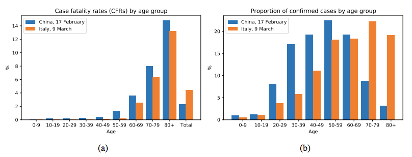
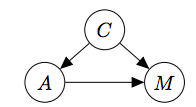
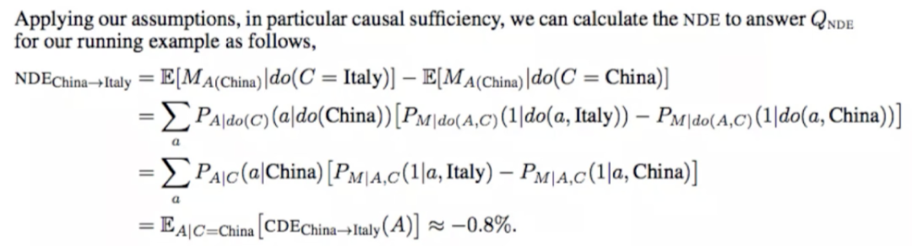
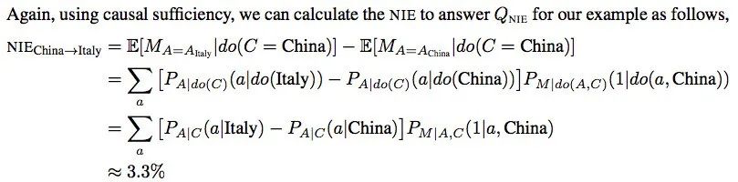
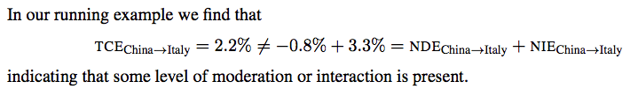
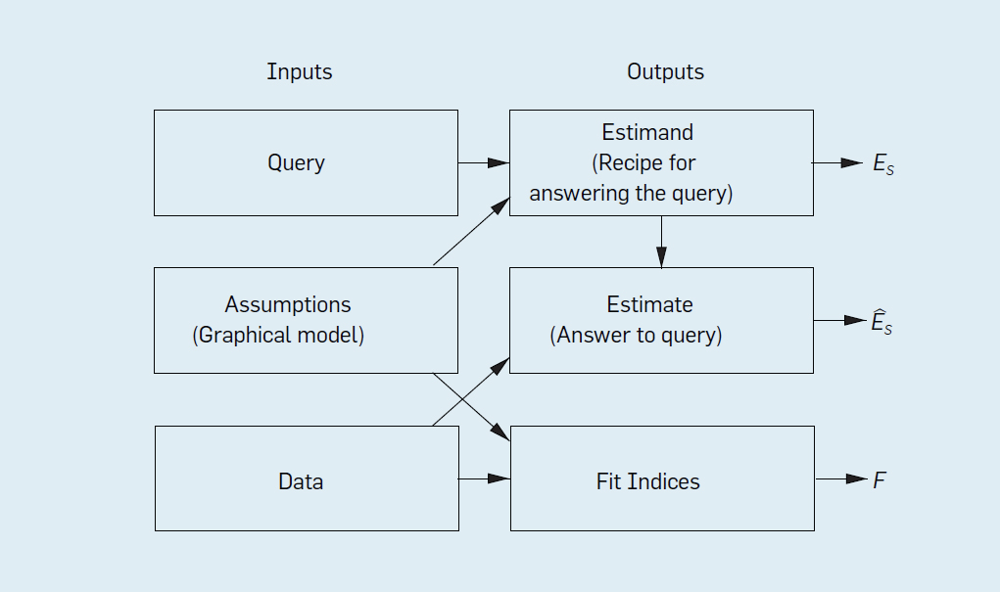
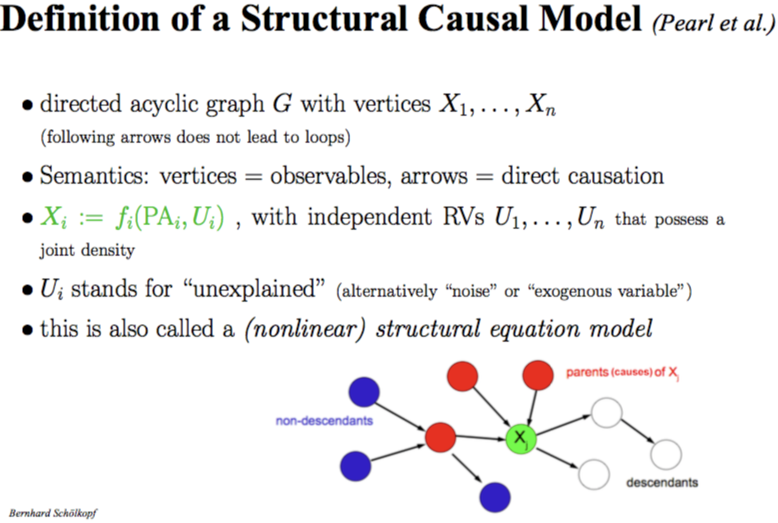
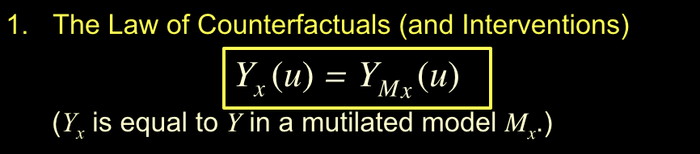

- 因果关系相关的数学、建模工具，可以方便用于各种日常归因/预测、例如司法上法律判罚等领域。
- 相关文章：
	- 因果科学：连接统计学、机器学习与自动推理的新兴交叉领域
		- 来源：
			- https://mp.weixin.qq.com/s/l-05jRYabGI-JoXedU-PLA
		- 因果科学的基本定义及其哲学基础
			- 简单来说，因果科学研究因果关系和回答因果问题的学科，
			- 那么一个最基础的问题是：什么是[[因果关系]]？
				- 一个保持通俗的定义是，在保持其他东西不变的情况下，改变 T 会引起 Y 的变化，那么就称 T 是 Y 的原因。
			- 而[[因果效应]]的定义是：
				- T 单位变化引起 Y 变化大小的度量。这种定义是哲学领域干预主义的思想，但是注意它并不是严格的数学定义。
			- 另外一个常见的考虑哲学因果思考就是[[反事实因果]]
				- 那什么是[[反事实因果]]呢？
					- 反事实因果说的是“ [[若非]]“过去某件事情 A 发生，结果 B 就可能不发生，那么 A 是 B 的原因。
					- 通过“若非”检测判定事件之间的因果关系，也就是说这种定义因果关系的方式存在漏洞
						- 比如下面的这个例子：
							- Suzy和 Billy 都在扔石头砸瓶子，他们俩都非常准，但是 Suzy 先扔了石头，瓶子碎了。如果不是 Suzy 先扔 Billy 也会打破瓶子。通俗意义上理解是 Suzy 扔了石头导致瓶子碎了的原因，但是此时 Suzy 不扔石头，瓶子同样会碎，因此“若非”没有能够识别事件 A， B之间的因果关系。
			- 对于因果，我们有时看似懂了但其实不懂。
				- 事实上相对清晰定义了因果关系的是物理学，物理学中的模型如牛顿定律、相对论等，它们是关于物理系统演化的动力学，都会包含某个**时间结构**。
					- 但是人们在使用因果思维，回答因果问题的时候通常会忽视时间，那么这样是合理的吗？
						- Bernhard Schölkopf 认为任何数据都有一个隐含时间在里面。
					- 不考虑时间，既然考虑统计模型是有意义的，那么考虑因果也是有意义的。
			- 哲学中关于因果关系讨论中，其因果的分类方法非常有启发性，把因果分成了两类
				- 一类是 Type causality ，另一类是 Actual causality
					- Type  causality 关注的是某个原因会导致什么样的结果，例如吸烟是否导致肺癌，可理解成由因推果（Forward-looking），是一种干预思维，能帮助科学家进行预测；
					- 而 Actual causality 关注某个事件发生的具体原因是什么，例如恐龙灭亡的原因是六千万年的小行星撞地球导致的吗，它是由果推因（Backward-looking），与[[反事实因果]]思维密切相关。
			- 总结一下，关于因果的定义没有严格的定义，因果只是一种思维和建模工具
		- 统计领域中的因果推断
		  collapsed:: true
			- 在现实世界中我们会有大量的数据，我们希望从若干变量的一堆数据中提取出他们之间的因果关系，这时候要做的事情就是因果推断。
			- 所有的因果问题之处就是 J. Pearl 提出的三层因果关系之梯，我们需要根据数据求解出以下三个层次。
				- 图：
				  collapsed:: true
					- 
				- 三级因果问题：
					- 第一层是关联（Association），它涉及由数据定义的统计相关性，大多数机器学习系统运行在这一层上。
					- 第二层是干预（Intervention），不仅涉及到能看到什么，还涉及一个干预或行动将会导致什么结果。典型问题是“如果我们把价格翻倍，将会发生什么？”
					- 第三层是反事实（Counterfactual），是对过去发生的事情的反思和溯因，典型问题是“如果过去作出不一样的行为，现在的结果会有何不同？”
				- Pearl 描述了一个因果推理的三级结构，把因果信息按其能够回答的类型进行分类。该分类形成了一个三层的层级结构，某层的问题，只有在获取不低于该层信息时，才能够被回答。
					- 顶层也就是反事实层是功能最强大的层次，如果我们有一个可以回答反事实问题的模型，那么我们也可以回答有关干预和观察的问题。
						- 例如，干预问题：What will happen if we double the price?
							- 可以通过反事实问题来回答：What would happen had the price been twice its current value?
					- 同样，一旦我们回答了干预问题，就可以回答关联问题。
						- 我们只是忽略了干预动作部分，而是让观测取代了。
					- 但是在相反的方向上，干预问题不能仅凭观测信息（也就是统计相关性）回答，涉及反思和溯因的反事实问题也不能仅用干预信息来回答。
			- [[反事实]]是科学思维以及法律和道德推理的基础。
				- 举个例子，在法庭判定被告是否应该负法律责任的时候，判定有罪的一个依据是 ——“[[若非]]”被告的行为，损失就很可能不会发生。
				- “[[若非]]”的计算含义要求将现实世界与被告未发生某行为[[反事实]]世界进行比较。
					- 用个更通俗的例子来讲，已知的事实是“一个人吃了药死了”，对应的一个反事实问题是“如果此人没有吃药，不死的概率是多少？”
			- 理解因果推理需要抓住一个窍门，那就是区分 seeing 和 doing 的不同
				- 一个简单例子就是某个便利店中”观测到某商品的价格翻倍“和“店主强制让某商品价格翻倍”存在区别。
			- Pearl 发明了 do 算子来数学化表示干预或行为，有了它我们能用数学公式区分 seeing 和 doing：
				- 
			- 表格中可以看到因果模型是从统计模型走向物理模型的过渡。
				- 
				- 统计模型只有关联层的信息，所以只能回答相关性问题，而不能回答干预问题和反事实问题。
				- 基于图的因果贝叶斯网络因果只有干预层的信息，所以只能回答干预和关联层的问题，而不能回答反事实问题。
				- 最后基于结构的因果模型，它的能力最接近物理模型，用函数关系表示原因和结果之间的关系，三个层级的问题都能够回答。
			- 观测数据下的因果效应估计的方法。
				- 当下因果建模有两个主要的框架，D.B  Rubin（1976）提出的 Potential Outcome Framework 和 Judea Pearl 的结构因果模型(SCM)。
				- 在统计和社会学等学科用得更多的是 Potential Outcome 框架，它相对于 SCM 更加简单直观。
					- 设想了一种与观测数据相悖的情况，所以是反事实因果。
					- 因为其基本思想是对比用药或者不用药的结果，也被称为 Experimental causality。
					- 用该框架估计因果效应的主要困难是数据缺失，在一些假定（Ignorability）下该困难可以克服。
					- 相关不是因果，因果建模的一个重要的视角如何去除因此产生的偏差，Debias 是数据科学一个核心主题。
				- 下面我们以新冠病毒为例来展示如何因果建模和 Debias。我们都知道意大利的新冠病毒死亡率高于中国，那么是否能够说明意大利的医疗水平低于中国呢？
				  collapsed:: true
					- 因果科学的第一步是定义因果问题，把问题和已知信息转化为因果图，把影响因素作为节点，连边代表因果联系，
						- 但是困难在于确定问题的影响因素，比如这个问题，表面上看只有国家和死亡率两个因素，但有很多潜在因素，比如年龄分布、性别差异等等，这里的一个基本思是 Coarse-graining，简单来说就是把问题粗粒化，留下最重要的。
							- 在这里最终选择了国家、死亡率和年龄结构三个因素，结果如下图：
								- 
									- 图中（a）是意大利和中国按年龄组汇总的Covid-19病死率快照，即：包括截至报告时的所有确诊病例和死亡病例（见图例）。
									- （b）各年龄组（a）所包括病例的比例。
										- 可以看到中国和意大利的人口分布不一样，中国是 50-59 岁这个年龄段感染的人数最多，意大利是 70-79 这个年龄段感染的人数最多，在意大利容易死的都感染了，这是直观感觉的，严格回答这个问题需要因果科学。
					- 下面来进行第二步，画出因果图。
						- 三个变量国家（Country），年龄（Age），死亡（Mortality）之间的因果模型，关注的问题是：从国家到死亡的直接因果效应是多少？
							- 我们把国家、年龄和死亡率画在下图，C代表国家，A代表年龄，M代表死亡率，分析这个图里的因果关系，国家会影响死亡率，年龄也会影响死亡率，国家会通过年龄这个中间变量影响死亡率，这里年龄起到了中介变量的作用，如果要分析国家队死亡率的影响要阻断年龄结构的影响。
								- 
					- 第三步Do-Calculus，这里的本质就是干预，我们要求单纯国家这个因素对死亡率的影响，就要把年龄这个因素控制成一样，来求不同国家对死亡率的影响，具体做法如下：
						- 
						- 结果得到：国家对死亡率的直接因果效应反而是意大利比中国少 0.8%。
					- 接下来计算国家通过年龄而不是医疗服务对死亡率的影响是：
						- 
					- 这里我们发现总的因果效应并不等于直接因果效应 + 间接因果效应。
						- 
						- 这里 NDE（Natural direct effect）代表自然的直接效应。
						- 总的因果效应并不等于直接因果效应 + 间接因果效应，但线性模型的时候：总的因果效应等于直接因果效应 + 间接因果效应。
			- Pearl 总结的七个因果推断工具：
				- Tool 1. Encoding causal assumptions in transparent and testable way.
					- 以透明和可测试的方式编码因果假设。
				- Tool 2. Predicting the effects of actions and policies.
					- 预测行动和政策的效果。
				- Tool 3. Computing counterfactuals and finding causes of effects (attribution,explanation, susceptibility).
					- 计算反事实并找出结果的原因(归因、解释、易感性)。
				- Tool 4. Computing direct and indirect effects (Mediation) (discrimination, inequities,fairness)
					- 计算直接和间接影响(调解)(歧视、不平等、公平)
				- Tool 5. Integrating data from diverse sources (external validity and selection bias).
					- 整合来自不同来源的数据(外部有效性和选择偏差)。
				- Tool 6. Recovering from missing data.
					- 从丢失的数据中恢复。
				- Tool 7. Discovering causal relations from data
					- 从数据中发现因果关系
		- Causal AI
			- 让机器学会因果推理的是实现真正人工智能一个重要步骤。
				- 当前有很多最优秀的科学家在朝着这个方向努力，其中三个代表性研究工作者是 UCLA 教授 Judea Pearl， 马普智能所所长 Bernhard Schölkopf，Mila 所长 Yoshua Bengio。简单来说 Judea Pearl 是 Causal AI 的奠基人，Bernhard Schölkopf 等人推进了 Causality for Machine Learning，Yoshua Bengio 最近提出了 System 2 deep learning 作为 Causal AI 的一个范式。
			- Judea Pearl ：让 AI 具备因果推理能力
				- Judea Pearl 提出的小图灵测试是实现真正智能的必要条件。
					- 对于小图灵测试，Pearl 认为关键的问题是，机器怎样才能以一种可以迅速访问必要信息、正确回答问题、并且像人类一样轻松的方式，来表征关于因果的知识？
					- 小图灵测试本质是如何表示和高效使用因果信息来回答因果问题。
						- 而如何让机器学会因果推理？
							- Pearl 给出了因果关系之梯来分类和识别因果问题（目前大多数机器学习系统都运行在关联层，仅仅只是曲线拟合）。
							- 提出了因果推理引擎作为回答因果的问题的范式。
								- 
								- 该推理引擎将假设（以图模型的形式）、数据和 Query 作为输入，而输出是 Estimand, Estimate 和 Fit Indices。
								- 估计式（Estimand） 是关注的查询（Query）的某个概率表达式，表示在已有模型假定下计算 Query 的一种方法；
								- Estimate 是用某种统计方法和已有数据对 Estimand 概率表达式的估计；
								  一组拟合指标（Fit Indices）用于衡量数据与假设的兼容程度。
							- 第一个输出是较难理解的，如果已有模型假定下某 Query 无法回答，也就是没有对应的 Estimand，则称该 Query 为“不可识别”，Pearl 的 do-calculus 就是判断 Query 是否可识别的一个完备的演算工具。
								- Pearl 仅用抽象的方式描述了这个推理引擎，关于该引擎如何回答因果问题，如何解决数据科学中的混杂偏差，选择偏差和迁移学习问题的细节可以参考 Elia Bareinboim 的论文《Causal Inference and Data-Fusion in Econometrics, P. Hünermund, E. Bareinboim.Dec, 2019. 》
					- 回答因果问题需要因果信息，当前存在多个回答因果问题的模型框架，但是回答反事实问题一般需要 Pearl 的结构因果模型（SCM）
						- 结构因果模型（SCM）由三个部分组成：图模型，结构方程以及反事实和干预逻辑。
						- 图模型是一种表示因果知识的语言，反事实和干预逻辑帮助他们阐明他们想知道的事情，结构方程将两者以扎实的语义联系在一起。
						- 
					- 结构因果模型（SCM）是 AI 领域中用得更多的因果建模框架，那么它和当前统计和社会学科中非常流行的 Pontential Outcome 框架有什么关系呢？
						- 关于因果的理解有些区别，
							- 结构因果模型是干预主义因果，用函数来表示因果关系；
							- Pontential Outcome 通常关注吃药或者不吃药的对比，也被称为实验主义因果。
						- SCM 是回答反事实问题的框架，而 Potential Outcome 一般回答干预层的问题。
						- 反事实基本定律 将 SCM 和 Pontential Outcome联系起来。
							- 
							- Mx干预后的模型，Yx表示反事实。SCM中使用函数关系描述因果关系是一个重大进步，避免了用条件概率表示因果关系时候的认知论上的困难，是其能回答反事实问题的关键因素。
							-
			-