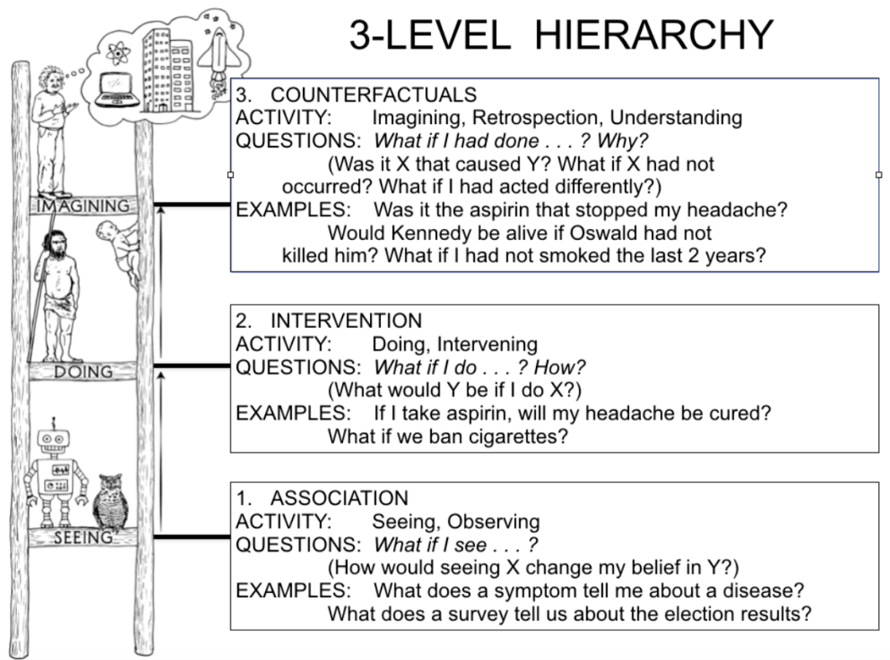
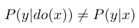
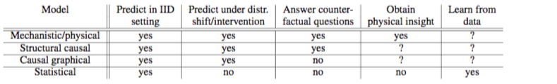

- 因果关系相关的数学、建模工具，可以方便用于各种日常归因/预测、例如司法上法律判罚等领域。
- 相关文章：
	- 因果科学：连接统计学、机器学习与自动推理的新兴交叉领域
		- 来源：
			- https://mp.weixin.qq.com/s/l-05jRYabGI-JoXedU-PLA
		- 因果科学的基本定义及其哲学基础
			- 简单来说，因果科学研究因果关系和回答因果问题的学科，
			- 那么一个最基础的问题是：什么是[[因果关系]]？
				- 一个保持通俗的定义是，在保持其他东西不变的情况下，改变 T 会引起 Y 的变化，那么就称 T 是 Y 的原因。
			- 而[[因果效应]]的定义是：
				- T 单位变化引起 Y 变化大小的度量。这种定义是哲学领域干预主义的思想，但是注意它并不是严格的数学定义。
			- 另外一个常见的考虑哲学因果思考就是[[反事实因果]]
				- 那什么是[[反事实因果]]呢？
					- 反事实因果说的是“ [[若非]]“过去某件事情 A 发生，结果 B 就可能不发生，那么 A 是 B 的原因。
					- 通过“若非”检测判定事件之间的因果关系，也就是说这种定义因果关系的方式存在漏洞
						- 比如下面的这个例子：
							- Suzy和 Billy 都在扔石头砸瓶子，他们俩都非常准，但是 Suzy 先扔了石头，瓶子碎了。如果不是 Suzy 先扔 Billy 也会打破瓶子。通俗意义上理解是 Suzy 扔了石头导致瓶子碎了的原因，但是此时 Suzy 不扔石头，瓶子同样会碎，因此“若非”没有能够识别事件 A， B之间的因果关系。
			- 对于因果，我们有时看似懂了但其实不懂。
				- 事实上相对清晰定义了因果关系的是物理学，物理学中的模型如牛顿定律、相对论等，它们是关于物理系统演化的动力学，都会包含某个**时间结构**。
					- 但是人们在使用因果思维，回答因果问题的时候通常会忽视时间，那么这样是合理的吗？
						- Bernhard Schölkopf 认为任何数据都有一个隐含时间在里面。
					- 不考虑时间，既然考虑统计模型是有意义的，那么考虑因果也是有意义的。
			- 哲学中关于因果关系讨论中，其因果的分类方法非常有启发性，把因果分成了两类
				- 一类是 Type causality ，另一类是 Actual causality
					- Type  causality 关注的是某个原因会导致什么样的结果，例如吸烟是否导致肺癌，可理解成由因推果（Forward-looking），是一种干预思维，能帮助科学家进行预测；
					- 而 Actual causality 关注某个事件发生的具体原因是什么，例如恐龙灭亡的原因是六千万年的小行星撞地球导致的吗，它是由果推因（Backward-looking），与[[反事实因果]]思维密切相关。
			- 总结一下，关于因果的定义没有严格的定义，因果只是一种思维和建模工具
		- 统计领域中的因果推断
			- 在现实世界中我们会有大量的数据，我们希望从若干变量的一堆数据中提取出他们之间的因果关系，这时候要做的事情就是因果推断。
			- 所有的因果问题之处就是 J. Pearl 提出的三层因果关系之梯，我们需要根据数据求解出以下三个层次。
				- 图：
				  collapsed:: true
					- 
				- 三级因果问题：
					- 第一层是关联（Association），它涉及由数据定义的统计相关性，大多数机器学习系统运行在这一层上。
					- 第二层是干预（Intervention），不仅涉及到能看到什么，还涉及一个干预或行动将会导致什么结果。典型问题是“如果我们把价格翻倍，将会发生什么？”
					- 第三层是反事实（Counterfactual），是对过去发生的事情的反思和溯因，典型问题是“如果过去作出不一样的行为，现在的结果会有何不同？”
				- Pearl 描述了一个因果推理的三级结构，把因果信息按其能够回答的类型进行分类。该分类形成了一个三层的层级结构，某层的问题，只有在获取不低于该层信息时，才能够被回答。
					- 顶层也就是反事实层是功能最强大的层次，如果我们有一个可以回答反事实问题的模型，那么我们也可以回答有关干预和观察的问题。
						- 例如，干预问题：What will happen if we double the price?
							- 可以通过反事实问题来回答：What would happen had the price been twice its current value?
					- 同样，一旦我们回答了干预问题，就可以回答关联问题。
						- 我们只是忽略了干预动作部分，而是让观测取代了。
					- 但是在相反的方向上，干预问题不能仅凭观测信息（也就是统计相关性）回答，涉及反思和溯因的反事实问题也不能仅用干预信息来回答。
			- [[反事实]]是科学思维以及法律和道德推理的基础。
				- 举个例子，在法庭判定被告是否应该负法律责任的时候，判定有罪的一个依据是 ——“[[若非]]”被告的行为，损失就很可能不会发生。
				- “[[若非]]”的计算含义要求将现实世界与被告未发生某行为[[反事实]]世界进行比较。
					- 用个更通俗的例子来讲，已知的事实是“一个人吃了药死了”，对应的一个反事实问题是“如果此人没有吃药，不死的概率是多少？”
			- 理解因果推理需要抓住一个窍门，那就是区分 seeing 和 doing 的不同
				- 一个简单例子就是某个便利店中”观测到某商品的价格翻倍“和“店主强制让某商品价格翻倍”存在区别。
			- Pearl 发明了 do 算子来数学化表示干预或行为，有了它我们能用数学公式区分 seeing 和 doing：
				- 
			- 表格中可以看到因果模型是从统计模型走向物理模型的过渡。
				- 
				- 统计模型只有关联层的信息，所以只能回答相关性问题，而不能回答干预问题和反事实问题。
				- 基于图的因果贝叶斯网络因果只有干预层的信息，所以只能回答干预和关联层的问题，而不能回答反事实问题。
				- 最后基于结构的因果模型，它的能力最接近物理模型，用函数关系表示原因和结果之间的关系，三个层级的问题都能够回答。
			- 观测数据下的因果效应估计的方法。
				- 当下因果建模有两个主要的框架，D.B  Rubin（1976）提出的 Potential Outcome Framework 和 Judea Pearl 的结构因果模型(SCM)。
				- 在统计和社会学等学科用得更多的是 Potential Outcome 框架，它相对于 SCM 更加简单直观。
					- 设想了一种与观测数据相悖的情况，所以是反事实因果。
					- 因为其基本思想是对比用药或者不用药的结果，也被称为 Experimental causality。
					- 用该框架估计因果效应的主要困难是数据缺失，在一些假定（Ignorability）下该困难可以克服。
					- 相关不是因果，因果建模的一个重要的视角如何去除因此产生的偏差，Debias 是数据科学一个核心主题。
				-