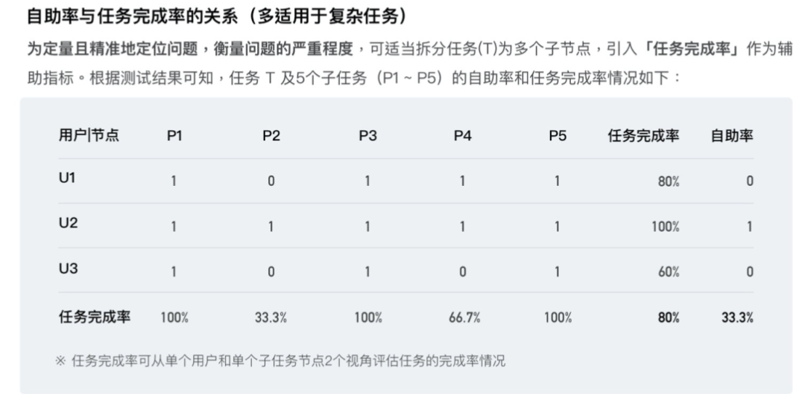
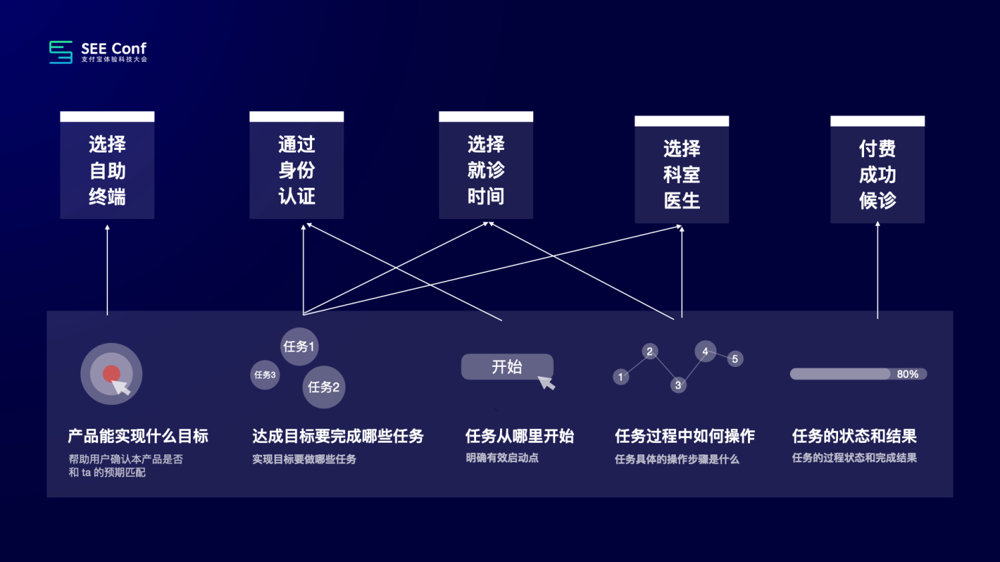
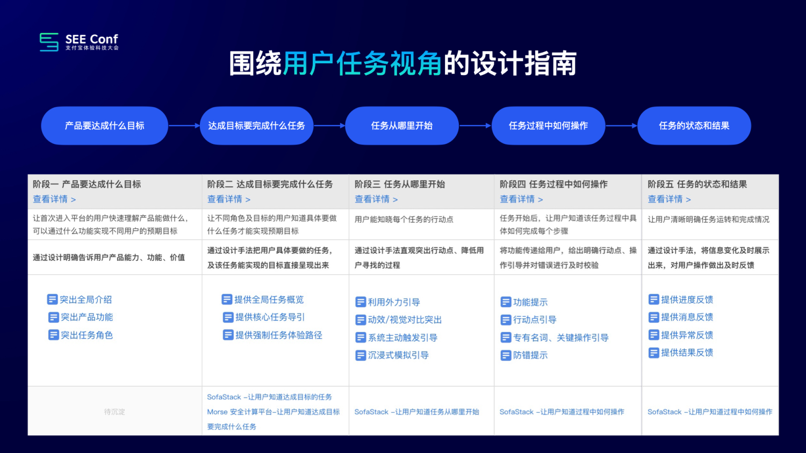
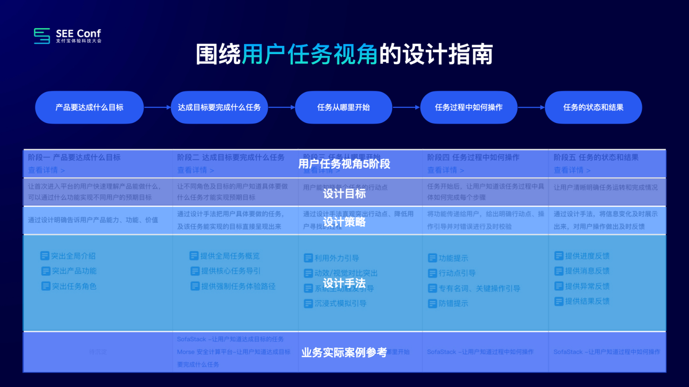

- https://www.yuque.com/seeconf/2022/hxtezl
- 什么是自助率
	- 自助完成任务的人数/完成任务的总人数*100%=自助率
- 为什么要做自助率
	- 对于业务侧
		- 如果你的产品自助率比较低的话，那么相对应的产品的NPS、满意度、易用度就可能会相对偏低，产品的答疑和技术的支持成本可能会居高不下。
	- 对于用户侧
		- 自助率低，意味着用户上手产品困难，大多数用户无法自己独立完成既定的任务，大多需要培训或者专门产品技术人员协助才能上手。
- 如何提升自助率
	- 第 1 步是发现问题
		- 发现正确的问题是设计方案成功的一半
		- 1 明确核心任务链路
			- 以自助挂号任务案例说明：我们假设核心任务链路是自助完成挂号，把任务分成五个步骤：
				- 首先，你要选对一个自助终端，你是选自助挂号机而不是自助发票机；
				- 第二步，通过身份验证；
				- 第三步，选择就诊时间；
				- 第四步，选择一个科室和医生；
				- 最后，付费成功。
		- 2 实施任务测试
			- 实施任务测试的过程中，我们要观察真实用户在完成这个任务时的具体操作的行为。
			- 然后，根据用户的反应做访谈以及记录，这是我们后续针对性地实施设计策略的关键。
		- 3 结论分析整理
			- 针对比较简单的任务，我们只是检测产品的自助率情况即可，我们判断这个任务是否可被完成，发现任务体验问题并针对性采取设计策略。
			- 当我们面向一些复杂产品，即使知道了自助率，仍然不足以明白用户问题出在哪里。
			- 如何更加精确地发现任务链路中的体验问题，于是我们引入了新的任务数据指标——任务完成率。
				- 
				- 「自助率」和「任务完成率」具体关系是什么样的呢？
					- 引入「任务完成率」，我们发现了核心任务的核心体验卡点。
	- 第 2 步是解决问题
		- 我们发现所有的B端产品本身都会有 1 条主线，即从**任务**的角度出发，每个产品都在完成任务。
		- 我们结合了《设计心理学》中关于任务的描述，把用户面向任务的行为分成了五个阶段：
			- 阶段一：产品能实现什么目标
			- 阶段二：达到目标要完成哪些任务
			- 阶段三：任务从哪里开始
			- 阶段四：任务过程中如何操作
			- 阶段五：任务的状态与结果
		- 
		- 既然所有的任务都可以分解为五个阶段，我们可以做一个大胆的假设：假设用户在这五个节点都能够顺利地完成，那么该任务的自助率就可以为100%。
		- 指南的设计经验目录
			- 
			- 
	- 第 3 步是衡量和验证
		- 衡量与验证阶段重复前述发现问题的验证方式，方便前后对照。
		- 衡量阶段其实是结束，也是开始，
			- 一方面验证我们的设计解决方案是切实有效的；
			- 另一方面，验证发现的新问题又是新一轮体验优化开始的依据。
		-