- 性能领域、性能测试、容量测试、基准测试、性能分析
- 《性能之巅》整理
  collapsed:: true
	- [[系统性能]]
		- 系统性能是对整个系统的研究，包括了所有的硬件组件和整个软件栈。
		- 所有数据路径上和软硬件上所发生的事情都包括在内。
		- 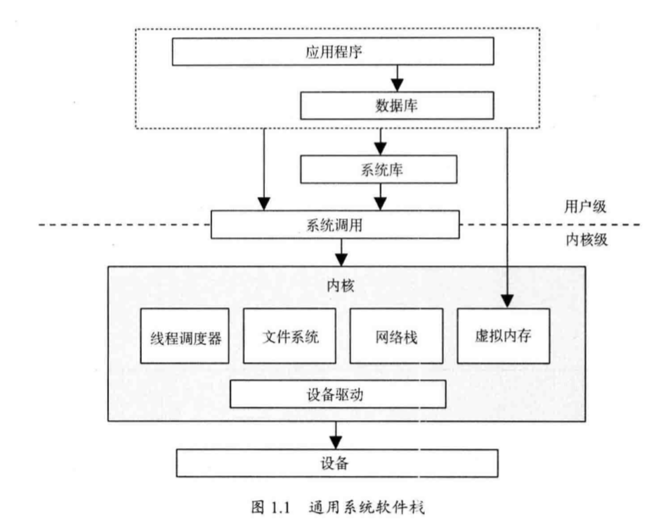{:height 341, :width 426}
	- 人员
		- 系统性能是一项需要多类人员参与的事务。
	- 事情
		- [[性能]]领域包括的事情（按理想顺序排列）
			- 1 设置性能目标和建立性能模型
			- 2 基于软件或硬件原型进行性能特征归纳
			- 3 对开发代码进行[[性能分析]](软件整合之前)
			- 4 执行软件非回归性测试 (软件发布前或发布后)
			- 5 针对软件发布版本的[[基准测试]]
			- 6 目标环境中的概念验证( Proof-of-concept )测试
			- 7 生产环境部署的配置优化
			- 8 监控生产环境中运行的软件
			- 9 特定问题的[[性能分析]]
		- 术语[[容量规划]]
			- 指的是一系列事前行动。在设计阶段，包括通过研究开发软件的资源占用情况，来得知原有设计在多大程度上能满足目标需求。在部署后,包括监控资源的使用情况，这样问题在出现之前就能被预测。
	- 视角
		- 两种性能分析的视角
			- [[负载分析]]（workload analysis）
			- [[资源分析]]（resource analysis）
		- 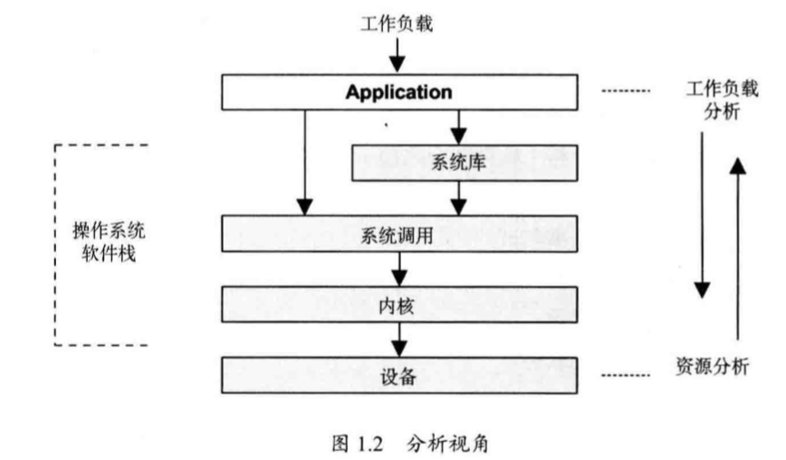{:height 264, :width 445}
		- 系统管理员作为系统资源的负责人，通常采用[[资源分析]]视角。
		- 应用程序开发人员，对最终实现的负载性能负责，通常采用[[负载分析]]视角。
	- [[性能]]是充满挑战的
		- 性能是主观的
			- 开始着手性能问题的时候，对问题是否存在的判断都有可能是模糊的，在问题被修复的时候也同样。
			- 从某种程度上说，一个给定指标是“好”或“坏”取决于应用开发人员和最终用户的性能预期。
			- 通过定义清晰的目标，可以吧主观的性能变得客观化
				- 诸如目标平均响应时间、或者对落进一定响应延时范围内的请求统计其百分比。
		- 系统是[[复杂]]的
			- 组件的互联
				- 性能问题可能出在子系统之间复杂的互联上，即使这些子系统隔离时表现得都很好。
				- 也可能由于连锁故障（cascading failure）出现性能问题，这指的是一个出现故障的组件会导致其他组件产生性能问题。
			- 问题的关联
				- 修复一个问题可能只是把瓶颈推向了系统里的其他地方，导致整体性能没有提升。
			- 生产环境负载的复杂特性
				- 实验室环境很难重现这类情况，或者只能间歇式地重现。
			- 解决复杂的性能问题常常需要全局性的方法
				- 整个系统——包括自身内部和外部的交互——都可能需要被调查研究。
		- 可能有多个问题并存
			- 真正的任务不是寻找问题，而是辨别哪些问题是最重要的
			- 性能分析必须量化问题的重要程度。
	- [[量化]]性能的指标举例
		- 延时
			- 有一个指标非常适合用来量化性能，那就是延时( latency )。
			- 延时测量的是用于等待的时间。广义来说，它可以表示所有操作完成的耗时
			- 虽然延时是一个非常有用的指标，但也不是随时随地都能获得。
				- 某些系统只有平均延时，某些系统则完全没有延时指标。
				- [[动态跟踪]]( dynamic tracing )可以从任意感兴趣的点测量延时，还可以提供数据以显示延时完整的分布情况。
	- [[动态跟踪]]
		- 动态跟踪技术把所有的软件变得可以监控，而且能用在真实的生产环境中。
		- 这项技术利用内存中的CPU指令并在这些指令之上动态构建监测数据。
			- 这样从任何运行的软件中都可以获得定制化的性能统计数据，从而提供了远超系统的自带统计所能给予的观测性。
				- 从前因为不易观测而无法处理的问题变得可以解决。
				- 从前可以解决而难以解决的问题，现在也往往可以得以简化。
		- 举例
			- DTrace
				- 在DTrace之前，系统跟踪( system tracing )常常使用静态探针( static probes) :置于内核和其他软件之上的一小套监测点。这种方法的观测是有限的，一般用起来很费时，需要配置、跟踪、导出数据以及最后分析一整套流程。
				- DTrace对用户态和内核态的软件都提供了静态跟踪和动态跟踪，并且数据是实时产生的。
	- [[云计算]]
		- 给系统性能带来影响的最新进展来自云计算和云计算的根基——虚拟技术的兴起。
		- 云计算采用的架构能让应用程序均衡分布于数目不断增多的小型系统中，这让快速扩展成为可能。
			- 这种方法还降低了对[[容量规划]]的精确程度的要求，因为更多的容量可以很便捷地在云端添加。
		- 在某些情况下，它对[[性能分析]]的需求更高了
			- 使用较少的资源就意味着系统更少。
			  id:: 621f58d3-18bb-4579-b65b-320d7cd893b7
				- 云的使用通常是按小时计费的，性能的优势可以减少系统的使用数目，从而直接节约成本。这和企业用户的情况不同，企业用户被一个支持协议锁定数年，直到合同终结都可能无法实现成本的节约。
		- [[云计算]]和[[虚拟化]]技术也带来了新的难题，这包括
			- 如何管理其他[[租户]]( tenant,有时被称作性能隔离( performance isolation) )带来的性能影响，以及如何让每个租户都能对物理系统做观测。
				- 举个例子，除非系统管理得很好，否则磁盘I/O性能可能因为同邻近租户的竞争而下降。
			- 在某些环境中，并不是每一个租户都能观察到物理磁盘的真实使用情况，这让问题的甄别变得困难。
		-
- 软件测试52讲 性能测试篇
	- 解读不同视角的软件性能与性能指标
	  collapsed:: true
		- 当我们谈及[[软件性能]]的时候，我们到底谈的是什么？
			- 目前，对软件性能最普遍的理解就是软件处理的及时性。
			- 但其实，从不同的系统类型，以及不同的视角去讨论软件性能，都会有所区别。
				- 对于不同类型的系统，软件性能的关注点各不相同
					- Web 类应用和手机端应用，一般以终端用户感受到的端到端的响应时间来描述系统的性能；
					- 非交互式的应用，比如典型的电信和银行后台处理系统，响应时间关注更多的是事件处理的速度，以及单位时间的事件吞吐量。
				- 同样地，对同一个系统来说，不同的对象群体对软件性能的关注点和期望也不完全相同，甚至很多时候是对立的。
					- 这里，不同的对象群体可以分为四大类：终端用户、系统运维人员、软件设计开发人员和性能测试人员。
		- 四个角度的软件性能
			- 终端用户眼中的软件性能
				- 从终端用户（也就是软件系统使用者）的维度来讲，软件性能表现为用户进行业务操作时的主观响应时间。
					- 具体来讲就是，从用户在界面上完成一个操作开始，到系统把本次操作的结果以用户能察觉的方式展现出来的全部时间。
						- 对终端用户来说，这个时间越短体验越好
				- 这个响应时间是终端用户对系统性能的最直观印象，包括了系统响应时间和前端展现时间。
					- 系统响应时间
						- 反应的是系统能力，又可以进一步细分为应用系统处理时间、数据库处理时间和网络传输时间等；
					- 前端展现时间
						- 取决于用户端的处理能力。
			- 系统运维人员眼中的软件性能
				- 从软件系统运维（也就是系统运维人员）的角度，软件性能除了包括单个用户的响应时间外，更要关注
					- 大量用户并发访问时的负载，
					- 以及可能的更大负载情况下的系统健康状态、并发处理能力、
					- 当前部署的系统容量、
					- 可能的系统瓶颈、系统配置层面的调优、数据库的调优，
					- 以及长时间运行稳定性和可扩展性。
			- 软件设计开发人员眼中的软件性能
				- 从软件系统开发（也就是软件设计开发人员）的角度来讲，软件性能关注的是性能相关的设计和实现细节，这几乎涵盖了软件设计和开发的全过程。
				- 在软件设计开发人员眼中，软件性能通常会包含算法设计、架构设计、性能最佳实践、数据库相关、软件性能的可测试性这五大方面。
					- [[算法]]设计包含的点
						- 核心算法的设计与实现是否高效；
						- 必要时，设计上是否采用 buffer 机制以提高性能，降低 I/O；
						- 是否存在潜在的内存泄露；
						- 是否存在并发环境下的线程安全问题；
						- 是否存在不合理的线程同步方式；
						- 是否存在不合理的资源竞争。
					- 第二，[[架构]]设计包含的内容：
						- 站在整体系统的角度，是否可以方便地进行系统容量和性能扩展；
						- 应用集群的可扩展性是否经过测试和验证；
						- 缓存集群的可扩展性是否经过测试和验证；
						- 数据库的可扩展性是否经过测试和验证。
					- 第三，性能最佳实践包含的点：
						- 代码实现是否遵守开发语言的性能最佳实践；
						- 关键代码是否在白盒级别进行性能测试；
						- 是否考虑前端性能的优化；
						- 必要的时候是否采用数据压缩传输；
						- 对于既要压缩又要加密的场景，
						- 是否采用先压缩后加密的顺序。
					- 第四，数据库相关的点：
						- 数据库表设计是否高效；
						- 是否引入必要的索引；
						- SQL 语句的执行计划是否合理；
						- SQL 语句除了功能是否要考虑性能要求；
						- 数据库是否需要引入读写分离机制；
						- 系统冷启动后，缓存大量不命中的时候，数据库承载的压力是否超负荷。
					- 第五，软件性能的[[可测试性]]包含的点：
						- 是否为性能分析（Profiler）提供必要的接口支持；
						- 是否支持高并发场景下的性能打点；
						- 是否支持全链路的性能分析。
					-
				- 需要注意的是，软件开发人员一般不会关注系统部署级别的性能，
					- 比如软件运行目标操作系统的调优、应用服务器的参数调优、数据库的参数调优、网络环境的调优等。
					- 系统部署级别的性能测试，目前一般是在系统性能测试阶段或者系统容量规划阶段，由性能测试人员、系统架构师，以及数据库管理员（DBA）协作完成。
			- 性能测试人员眼中的软件性能
				- 从性能工程的角度看，性能测试工程师关注的是算法设计、架构设计、性能最佳实践、数据库相关、软件性能的可测试性这五大方面。
				- 在系统架构师、DBA，以及开发人员的协助下，性能测试人员既要能够准确把握软件的性能需求，又要能够准确定位引起“不好”性能表现的制约因素和根源，并提出相应的解决方案。
				- 一个优秀的性能测试工程师，一般需要具有以下技能：
					- 性能需求的总结和抽象能力；
					- 根据性能测试目标，精准的性能测试场景设计和计算能力；
					- 性能测试场景和性能测试脚本的开发和执行能力；
					- 测试性能报告的分析解读能力；
					- 性能瓶颈的快速排查和定位能力；
					- 性能测试数据的设计和实现能力；
					- 面对互联网产品，全链路压测的设计与执行能力，能够和系统架构师一起处理流量标记、影子数据库等的技术设计能力；
					- 深入理解性能测试工具的内部实现原理，当性能测试工具有限制时，可以进行扩展二次开发；
					- 极其宽广的知识面，既要有“面”的知识，比如系统架构、存储架构、网络架构等全局的知识，还要有大量“点”的知识积累，比如数据库 SQL 语句的执行计划调优、JVM 垃圾回收（GC）机制、多线程常见问题等等。
				-
		- 衡量软件性能的三个最常用的指标：并发用户数、响应时间，以及系统吞吐量
			- [[并发用户数]]
				- 并发用户数，是性能需求与测试最常用，也是最重要的指标之一。它包含了业务层面和后端服务器层面的两层含义。
					- 业务层面的并发用户数，指的是实际使用系统的用户总数。
						- 但是，单靠这个指标并不能反映系统实际承载的压力，我们还要结合用户行为模型才能得到系统实际承载的压力。
					- 后端服务器层面的并发用户数，指的是“同时向服务器发送请求的数量”，直接反映了系统实际承载的压力。
				- 获取用户行为模式的方法，主要分为两种：
					- 对于已经上线的系统来说，往往采用系统日志分析法获取用户行为统计和峰值并发量等重要信息；
					- 而对于未上线的全新系统来说，通常的做法是参考行业中类似系统的统计信息来建模，然后分析。
			- [[响应时间]]
				- 通俗来讲，响应时间反映了完成某个操作所需要的时间，其标准定义是“应用系统从请求发出开始，到客户端接收到最后一个字节数据所消耗的时间”，是用户视角软件性能的主要体现。
				- 响应时间，分为前端展现时间和系统响应时间两部分。
					- 其中，前端时间，又称呈现时间，取决于客户端收到服务器返回的数据后渲染页面所消耗的时间；
					- 而系统响应时间，又可以进一步划分为 Web 服务器时间、应用服务器时间、数据库时间，以及各服务器间通信的网络时间。
				- 除非是针对前端的性能测试与调优，软件的性能测试一般更关注服务器端。
					- 但是，服务器端响应时间的概念非常清晰、直接，就是指从发出请求起到处理完成的时间，没有二义性；
					- 而前端时间的定义，在我看来存在些歧义。
						- 虽然前端时间一定程度上取决于客户端的处理能力，但是前端开发人员现在还会使用一些编程技巧在数据尚未完全接收完成时呈现数据，以减少用户实际感受到的主观响应时间。
						- 也就是说，我们现在会普遍采用提前渲染技术，使得用户实际感受到的响应时间通常要小于标准定义的响应时间
				- 严格来讲，响应时间应该包含两层含义：
					- 技术层面的标准定义和基于用户主观感受时间的定义。
					- 而在性能测试过程中，我们应该使用哪个层面的含义将取决于性能测试的类型。
			- 系统[[吞吐量]]
				- 系统吞吐量，是最能直接体现软件系统负载承受能力的指标。
				- 这里需要注意的是，所有对吞吐量的讨论都必须以“单位时间”作为基本前提。
					- 其实，我认为把“Throughput”翻译成吞吐率更贴切，因为我们可以这样理解：
						- 吞吐率 = 吞吐量 / 单位时间。
						- 但既然国内很多资料已经翻译为了“吞吐量”，所以通常情况下我们不会刻意去区分吞吐量和吞吐率，统称为吞吐量。
				- 对性能测试而言，通常用“Requests/Second”“Pages/Second”“Bytes/Second”来衡量吞吐量。
					- 当然，从业务的角度来讲，吞吐量也可以用单位时间的业务处理数量来衡量。
				- 以不同方式表达的吞吐量可以说明不同层次的问题。
					- 比如：“Bytes/Second”和“Pages/Second”表示的吞吐量，主要受网络设置、服务器架构、应用服务器制约；
					- “Requests/Second”表示的吞吐量，主要受应用服务器和应用本身实现的制约。
				- 这里需要特别注意的是：虽说吞吐量可以反映服务器承受负载的情况，但在不同并发用户数的场景下，即使系统具有相近的吞吐量，但是得到的系统性能瓶颈也会相差甚远。
					- 比如，某个测试场景中采用 100 个并发用户，每个用户每隔 1 秒发出一个 Request，另外一个测试场景采用 1000 个并发用户，每个用户每隔 10 秒发出一个 Request。显然这两个场景具有相同的吞吐量, 都是 100 Requests/second，但是两种场景下的系统性能拐点肯定不同。因为，两个场景所占用的资源是不同的。
				- 这就要求性能测试场景的指标，必然不是单个，需要根据实际情况组合并发用户数、响应时间这两个指标。
	- [[性能测试]]的基本方法与应用领域
	  collapsed:: true
		- 并发用户数、响应时间、系统吞吐量之间的关系
			- 当系统并发用户数较少时，系统的吞吐量也低，系统处于空闲状态，我们往往把这个阶段称为 “空闲区间”。
			- 当系统整体负载并不是很大时，随着系统并发用户数的增长，系统的吞吐量也会随之呈线性增长，我们往往把这个阶段称为 “线性增长区间”。
			- 随着系统并发用户数的进一步增长，系统的处理能力逐渐趋于饱和，因此每个用户的响应时间会逐渐变长。相应地，系统的整体吞吐量并不会随着并发用户数的增长而继续呈线性增长。我们往往把这个阶段称为系统的“拐点”。
			- 随着系统并发用户数的增长，系统处理能力达到过饱和状态。此时，如果继续增加并发用户数，最终所有用户的响应时间会变得无限长。相应地，系统的整体吞吐量会降为零，系统处于被压垮的状态。我们往往把这个阶段称为“过饱和区间”。
		- 常用的七种性能测试方法
			- 后端性能测试
				- 后端性能测试，是通过性能测试工具模拟大量的并发用户请求，然后获取系统性能的各项指标，并且验证各项指标是否符合预期的性能需求的测试手段。
					- 这里的性能指标，
						- 除了包括并发用户数、响应时间和系统吞吐量外，
						- 还应该包括各类资源的使用率，
							- 比如系统级别的 CPU 占用率、内存使用率、磁盘 I/O 和网络 I/O 等，
							- 再比如应用级别以及 JVM 级别的各类资源使用率指标等。
					- 由于需要模拟的并发用户数，通常在“几百”到“几百万”的数量级，所以你选择的性能测试工具，一定不是基于 GUI 的，而是要采用基于协议的模拟方式，也就是去模拟用户在 GUI 操作的过程中实际向后端服务发起的请求。
				- 根据应用领域的不同，后端性能测试的场景设计主要包括以下两种方式：
					- 基于性能需求目标的测试验证；
					- 探索系统的容量，并验证系统容量的可扩展性
			- 前端性能测试
				- 前端性能测试并没有一个严格的定义和标准
				- 通常来讲，前端性能关注的是
					- 浏览器端的页面渲染时间、资源加载顺序、请求数量、前端缓存使用情况、资源压缩等内容，
					- 希望借此找到页面加载过程中比较耗时的操作和资源，然后进行有针对性的优化，最终达到优化终端用户在浏览器端使用体验的目的。
				- 目前，业界普遍采用的前端测试方法，是雅虎（Yahoo）前端团队总结的 7 大类 35 条前端优化规则，你可以通过雅虎网站查看这些规则，以及对各规则的详细解读。
					- https://developer.yahoo.com/performance/rules.html?guccounter=1
				- 我在这里列出了其中几个最典型也是最重要的规则，来帮助你理解前端性能测试优化的关注范围。
					- 减少 http 请求次数：
						- http 请求数量越多，执行过程耗时就越长，所以可以采用合并多个图片到一个图片文件的方法来减少 http 请求次数，也可以采用将多个脚本文件合并成单一文件的方式减少 http 请求次数；
					- 减少 DNS 查询次数：
						- DNS 的作用是将 URL 转化为实际服务器主机 IP 地址，实现原理是分级查找，查找过程需要花费 20~100ms 的时间，所以一方面我们要加快单次查找的时间，另一方面也要减少一个页面中资源使用了多个不同域的情况；
					- 避免页面跳转：
						- 页面跳转相当于又打开一个新的页面，耗费的时间就会比较长，所以要尽量避免使用页面跳转；
					- 使用内容分发网络（CDN）：
						- 使用 CDN 相当于对静态内容做了缓存，并把缓存内容放在网络供应商（ISP）的机房，用户根据就近原则到 ISP 机房获取这些被缓存了的静态资源，因此可以大幅提高性能；
					- Gzip 压缩传输文件：
						- 压缩可以帮助减小传输文件的大小，进而可以从网络传输时间的层面来减少响应时间；
			- 代码级性能测试
				- 代码级性能测试，是指在单元测试阶段就对代码的时间性能和空间性能进行必要的测试和评估，以防止底层代码的效率问题在项目后期才被发现的尴尬。
				- 从实际执行的层面来讲，代码级性能测试并不存在严格意义上的测试工具，通常的做法是：改造现有的单元测试框架。
					- 最常使用的改造方法是：
						-
						  1. 将原本只会执行一次的单元测试用例连续执行 n 次，这个 n 的取值范围通常是 2000~5000；
						-
						  2. 统计执行 n 次的平均时间。如果这个平均时间比较长（也就是单次函数调用时间比较长）的话，比如已经达到了秒级，那么通常情况下这个被测函数的实现逻辑一定需要优化。
					- 这里之所以采用执行 n 次的方式，是因为函数执行时间往往是毫秒级的，单次执行的误差会比较大，所以采用多次执行取平均值的做法。
			- 压力测试
				- 压力测试，通常指的是后端压力测试
					- 一般采用后端性能测试的方法，不断对系统施加压力，并验证系统化处于或长期处于临界饱和阶段的稳定性以及性能指标，并试图找到系统处于临界状态时的主要瓶颈点。
					- 所以，压力测试往往被用于系统容量规划的测试。
					- 还有些情况，在执行压力测试时，我们还会故意在临界饱和状态的基础上继续施加压力，直至系统完全瘫痪，观察这个期间系统的行为；然后，逐渐减小压力，观察瘫痪的系统是否可以自愈。
			- 配置测试
				- 配置测试，主要用于观察系统在不同配置下的性能表现，通常使用后端性能测试的方法：
					-
					  1. 通过性能基准测试（Performance Benchmark）建立性能基线（Performance Baseline）；
					-
					  2. 在此基础上，调整配置；
					-
					  3. 基于同样的性能基准测试，观察不同配置条件下系统性能的差异，根本目的是要找到特定压力模式下的最佳配置。
				- 这里需要注意的是，“配置”是一个广义配置的概念，包含了以下多个层面的配置
					- 宿主操作系统的配置；
					- 应用服务器的配置；
					- 数据库的配置；
					- JVM 的配置；
					- 网络环境的配置；
					- …
			- 并发测试
				- 并发测试，指的是在同一时间，同时调用后端服务，期间观察被调用服务在并发情况下的行为表现，旨在发现诸如资源竞争、资源死锁之类的问题。
				- 集合点并发
					- 为了达到准确控制后端服务并发数的目的，我们需要让某些并发用户到达该集合点时，先处于等待状态，直到参与该集合的全部并发用户都到达时，再一起向后端服务发起请求。
						- 简单地说，就是先到的并发用户要等着，等所有并发用户都到了以后，再集中向后端服务发起请求。
					- 在实际项目中，我建议在要求的并发数上进行适当放大，比如要求的并发数是 100，那我们集合点并发数可以设置为 120。
			- 可靠性测试
				- 可靠性测试，是验证系统在常规负载模式下长期运行的稳定性。
					- 虽然可靠性测试在不同公司的叫法不同，但其本质就是通过长时间模拟真实的系统负载来发现系统潜在的内存泄漏、链接池回收等问题。
				- 由于真实环境下的实际负载，会有高峰和低谷的交替变化（比如，对于企业级应用，白天通常是高峰时段，而晚上则是低峰时段），
					- 所以为了尽可能地模拟出真实的负载情况，我们会每 12 小时模拟一个高峰负载，两个高峰负载中间会模拟一个低峰负载，依次循环 3-7 天，形成一个类似于“波浪形”的系统测试负载曲线。
					- 然后，用这个“波浪形”的测试负载模拟真实的系统负载，完成可靠性测试。同样地，可靠性测试也会持续 3-7 天。
		- [[性能测试]]的四大应用领域
			- 第一，能力验证
				- 能力验证是最常用，也是最容易理解的性能测试的应用领域，主要是验证“某系统能否在 A 条件下具有 B 能力”，通常要求在明确的软硬件环境下，根据明确的系统性能需求设计测试方案和用例。
				- 能力验证这个领域最常使用的测试方法，包括后端性能测试、压力测试和可靠性测试。
			- 第二，能力规划
				- 能力规划关注的是，如何才能使系统达到要求的性能和容量。
					- 通常情况下，我们会采用探索性测试的方式来了解系统的能力。
				- 能力规划解决的问题，主要包括以下几个方面：
					- 能否支持未来一段时间内的用户增长；
					- 应该如何调整系统配置，使系统能够满足不断增长的用户数需求；
					- 应用集群的可扩展性验证，以及寻找集群扩展的瓶颈点；
					- 数据库集群的可扩展性验证；
					- 缓存集群的可扩展性验证；
					- …
				- 能力规划最常使用的测试方法，主要有后端性能测试、压力测试、配置测试和可靠性测试。
			- 第三，性能调优
				- 性能调优，其实是性能测试的延伸。
					- 在一些大型软件公司，会有专门的性能工程（Performance Engineering）团队，除了负责性能测试的工作外，还会负责性能调优。
				- 性能调优主要解决性能测试过程中发现的性能瓶颈的问题，通常会涉及多个层面的调整，包括硬件设备选型、操作系统配置、应用系统配置、数据库配置和应用代码实现的优化等等。
				- 这个领域最常用的测试方法，涵盖了我在上面分享的七大类测试方法，即后端性能测试、前端性能测试、代码级性能测试、压力测试、配置测试、并发测试和可靠性测试。
			- 第四，缺陷发现
				- 缺陷发现，是一个比较直接的应用领域，通过性能测试的各种方法来发现诸如内存泄露、资源竞争、不合理的线程锁和死锁等问题。
				- 缺陷发现，最常用的测试方法主要有并发测试、压力测试、后端性能测试和代码级性能测试。
		- 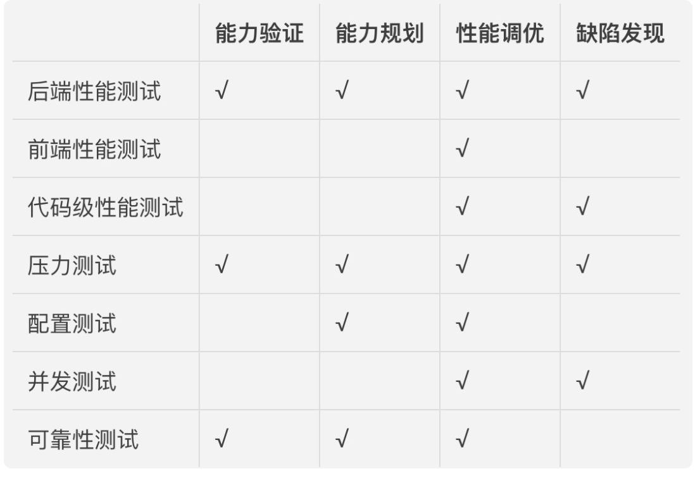{:height 300, :width 428}
	- [[性能测试]]场景设计
	  collapsed:: true
		- 测试负载组成
			- 虚拟用户脚本
			- 各个虚拟用户脚本的并发数量
			- 总的并发用户数
		- 负载策略
			- 加压策略
			- 减压策略
			- 最大负载运行时间
			- 延时策略
		- 资源监控范围定义
			- 操作系统级别的监控指标
			- 应用服务器的监控指标
			- 数据库服务器的监控指标
			- 缓存集群的监控指标
		- 终止方式
			- 脚本出错时的处理方式
			- 负载熔断机制
		- 负载产生规划
			- 压力产生器数量
			- 网络带宽要求
		- 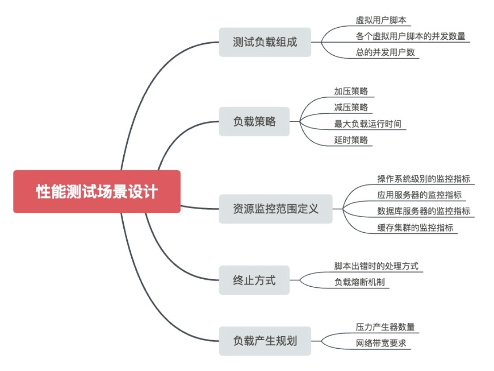{:height 364, :width 478}
		-
		-
	- 后端性能测试工具的基本原理
	  collapsed:: true
		- 后端性能测试工具首先通过**虚拟用户脚本生成器**生成基于协议的虚拟用户脚本，
		- 然后根据性能测试场景设计的要求，通过**压力控制器**控制协调各个**压力产生器**以并发的方式执行虚拟用户脚本，
		- 并且在测试执行过程中，通过**系统监控器**收集各种性能指标以及系统资源占用率，
		- 最后通过**测试结果分析器**展示测试结果数据。
- 性能工程高手课
	- 性能定律与数理基础
		- 性能工程三定律：IT业和性能优化工作的“法律法规”
			- [[帕累托法则]]
				- 它也被称为 80/20 法则、关键少数法则，或者[[八二法则]]
				- 在很多场景下，大约 20% 的因素操控着 80% 的局面。
					- 也就是说，所有的变量中，比较重要的只有 20%，是所谓的“关键少数”。剩下的多数，却没有那么重要。
				- 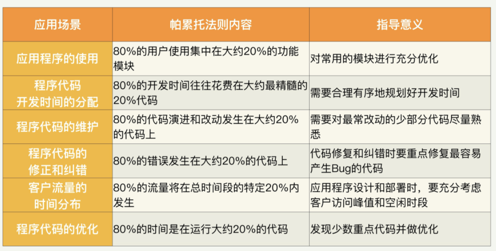
			- 阿姆达尔定律
				- [[阿姆达尔定律]]（Amdahl’s law / Amdahl’s argument）是计算机科学界非常重要的一个定律和法则。
					- 它本来用于衡量处理器进行并行处理时总体性能的提升度。
					- 但其实阿姆达尔定律可以用在很多方面
				- 用公式来讲
					- 假设一个系统的整体运行时间是 1，其中要进行优化加速的模块运行用时是 P。如果对这个模块的加速比是 N，那么新系统的处理时间可以用下面的公式来表示。
						- 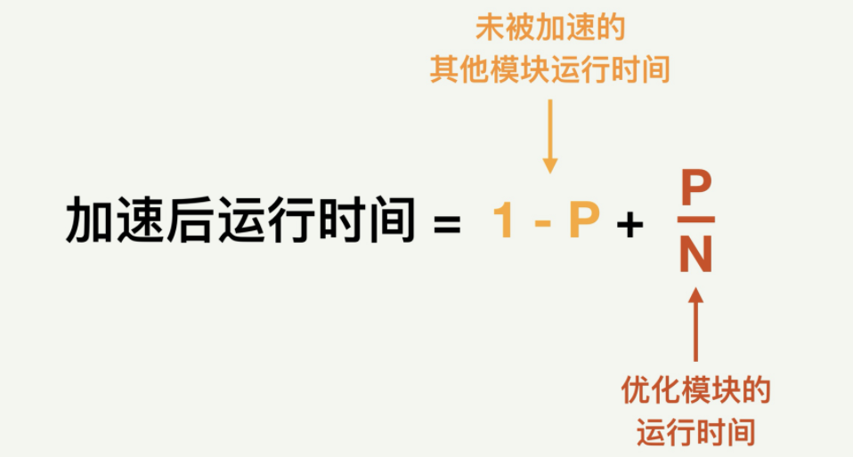{:height 224, :width 397}
						- 这里面（1-P）是未被加速的其他模块运行时间，而 N 分之 P 是优化后的模块运行时间。它们的和就是新系统的总体运行时间。
					- 相对于旧系统，运行时间的加速比就是：
						- 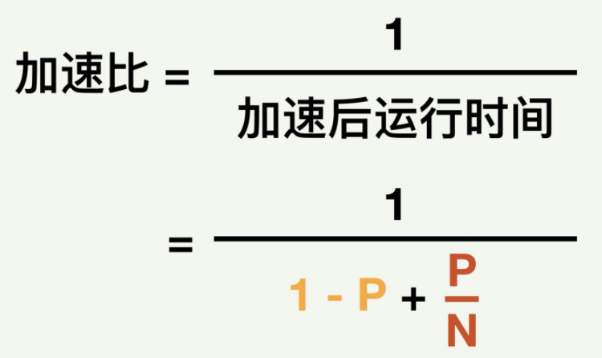{:height 221, :width 354}
				- 阿姆达尔定律对我们进行性能优化的指导意义有以下 2 点。
					- 优先加速占用时间最多的模块，因为这样可以最大限度地提升加速比。
					- 对一个性能优化的计划可以做出准确的效果预估和整个系统的性能预测。
				- 下面这张图描述了不同的并行百分比场景下分别进行并行优化的曲线。不同的曲线对应不同的并行模块百分比。横轴是并行程度，也就是多少个并行处理器。纵轴是速度提升度。
					- 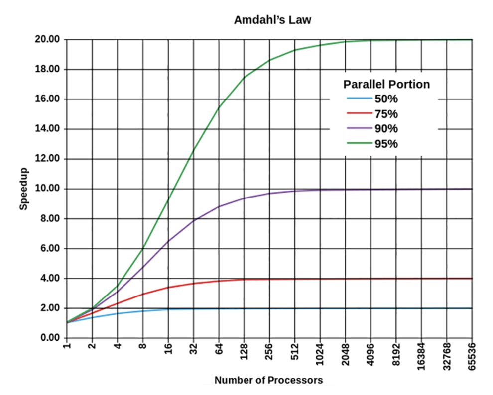{:height 310, :width 375}
				- 阿姆达尔定律其实是另外一个定律的简化版本。这个更复杂的定律叫通用扩展定律（USL, Universal Scalability Law）
			- [[利特尔法则]]
				- 利特尔法则（Little’s Law）。这个法则描述的是：在一个稳定的系统中，长期的平均客户人数（N）等于客户抵达速度（X）乘以客户在这个系统中平均处理时间（W），也就是说 N=XW。
					- 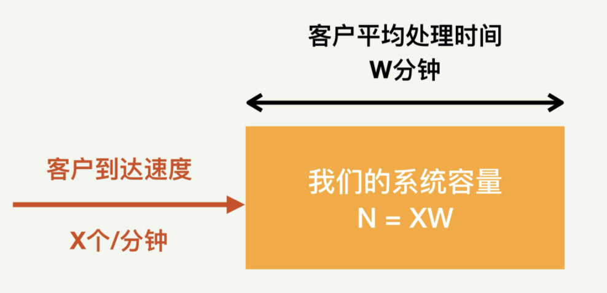{:height 213, :width 441}
				- 所以，如果这个状态稳定，也就是说，我们的系统处理速度恰恰好赶上客户到达速度的话，一方面系统没有空闲，另外一方面客户也不需要排队在系统外等待。
					- 那么在这个稳定状态下，我们的系统的总容量就恰好等于系统里面正在处理的客户数目。
					- 也就是说，N 就等于 X 和 W 的乘积。
				- 利特尔法则在性能优化工作中的两种用处：
					- 帮助我们设计性能测试的环境。
						- 性能测试的内容我们后面会详细讲到，这里简单提一下。比如当我们需要模拟一个固定容量的系统，那么性能测试的客户请求流量速度和每个请求的延时都需要仔细考虑。
					- 帮助我们验证测试结果的正确性。
						- 有时候，如果性能测试的工作没有仔细地规划，得出的测试结果会出奇得好，或者出奇得差，从而让我们抓脑壳。这时如果采用利特尔法则，就可以很快地发现问题所在之处。
				-
			- 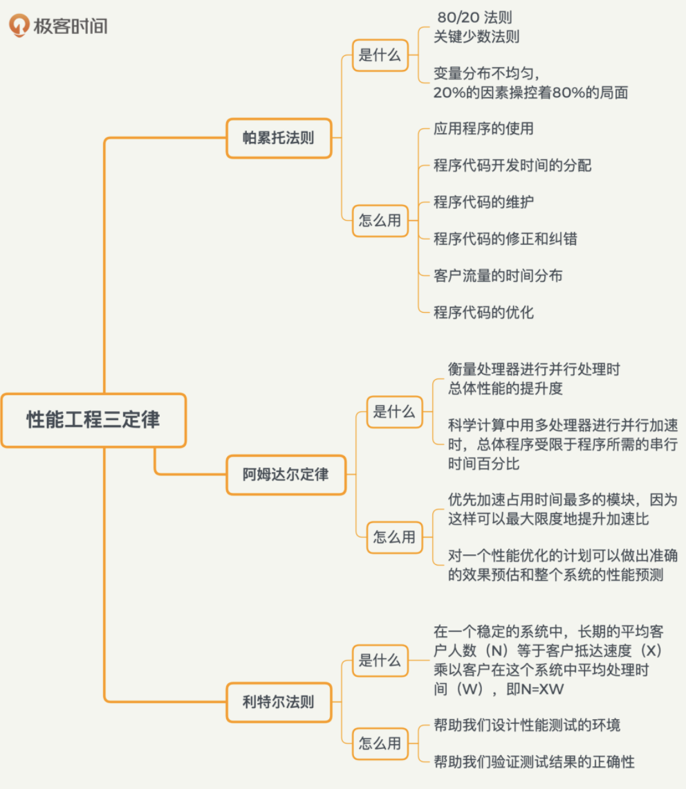{:height 460, :width 396}
			-
		- 概率统计和排队论：做性能工作必须懂的数理基础
			- 概率和置信区间
				- [[概率]]（Probability），也称几率和机率，是一个在 0 到 1 之间的实数，是对随机事件发生之可能性的度量。
				- 概率论中有一个很重要的定理，叫贝叶斯定理，我们做性能测试和分析中经常需要用到
					- [[贝叶斯定理]]（Bayes’ theorem）描述的是在已知一些条件下，某事件的发生概率。
						- 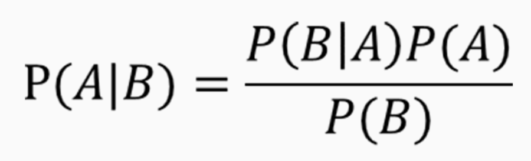{:height 154, :width 476}
						- 贝叶斯定理的一个用途在于通过已知的任意三个概率函数推出第四个。
				- 另外一个重要的概念是置信区间
					- [[置信区间]]（Confidence interval，CI）是对产生样本的总体参数分布（Parametric Distribution）中的某一个未知参数值，以区间形式给出的估计。
						- 相对于后面我们要讲到的点估计指标（比如均值，中位数等），置信区间蕴含了估计精确度的信息。
						- 置信区间是对分布（尤其是正态分布）的一种深入研究。
							- 通过对样本的计算，得到对某个总体参数的区间估计，展现为总体参数的真实值有多少概率落在所计算的区间里。
								- 比如下图是一个标准正态分布的图，阴影部分显示的是置信区间[-1.7,1.7]，占了 91% 的概率。
									- 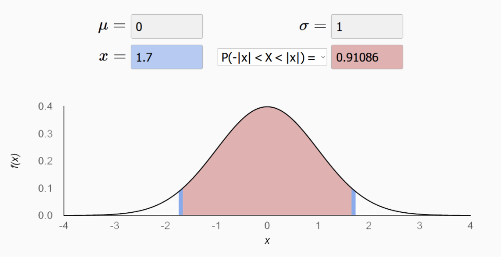
								- 不难理解，置信水平越高，置信区间就会越宽。一般来说，如果需要涵盖绝大多数的情况，置信区间一般会选择 90% 或者 95%。
			- 数理统计的点估计指标
				- 这些描述性指标通常也被称为“[[点估计]]”，相对于前面讲到的置信区间，是用一个样本统计量来估计参数值，比较容易理解。这些点估计指标分别有不同的优点和缺点。
					- 描述性统计分析是传统数据分析的基础，这个分析过程可以产生一些描述性指标，比如平均值、中位数、最大值、最小值、百分位数等。
					- 平均值：（Mean，或称均值，平均数）是最常用测度值
					  id:: 62405d3e-0e0d-446e-a023-5c4538ec7704
						- 它的目的是确定一组数据的均衡点。
						- 但不足之处是它容易受极端值影响。
						- 需要注意的是，我们有好几种不同的平均值算法。
							- 我们平时比较常用的是算术平均值，就是把 N 个数据相加后的和除以 N。但是还有几种其他计算方法，分别适用不同的情况。比如几何平均数，就是把 N 个数据相乘后的乘积开 N 次方。
					- 中位数（Median，又称中值），
						- 将数值集合划分为相等的上下两部分，一般是把数据以升序或降序排列后，处于最中间的数。
						- 它的优点是不受极端值的影响，
						- 但是如果数据呈现一些特殊的分布，比如二向分布，中位数的表达会受很大的负面影响。
					- 四分位数（Quartile）
						- 是把所有数值由小到大排列，并分成四等份，处于三个分割点位置的数值就是四分位数。
						- 从小到大分别叫做第一四分位数，第二四分位数等等。
						- 四分位数的优点是简单，固定了三个分割点位置。
						- 缺点也正是这几个位置太固定，因此不能更普遍地描述其他位置。
					- 百分位数（Percentile）
						- 可以看作是四分位数的扩展，是将一组数据从小到大排序，某一百分位所对应数据的值就称为这一百分位的百分位数，以 Pk 表示第 k 个百分位数。
						- 比如常用的百分位数是 P90，P95 等等。
						- 百分位数不容易受极端值影响，因为有 100 个位置可以选取，相对四分位数适用范围更广。
				- 还要注意的是，面对同一组数据，平均值和中位数以及百分位数这些点估计指标，谁大谁小是不一定的，这取决于这组数据的具体离散程度。
					- 方差 / 标准差（Variance，Standard Variance），描述的是变量的离散程度，也就是该变量离其期望值的距离。
			- 重要的分布模型
				- 以上的几个描述性的点估计统计指标很简单，但是描述数据的功能很有限。如果需要更加直观并准确的描述，就需要了解分布模型了。
				- 几个最重要的分布模型
					- 泊松分布（Poisson distribution）适合于描述单位时间内随机事件发生的次数的概率分布。
						- 如某一服务设施在一定时间内收到的服务请求的次数等。
						- 具体讲，如果随机变量 X 取 0 和一切正整数值，在 n 次独立试验中出现的次数 x 恰为 k 次的概率 P（X=k）就是：
							- 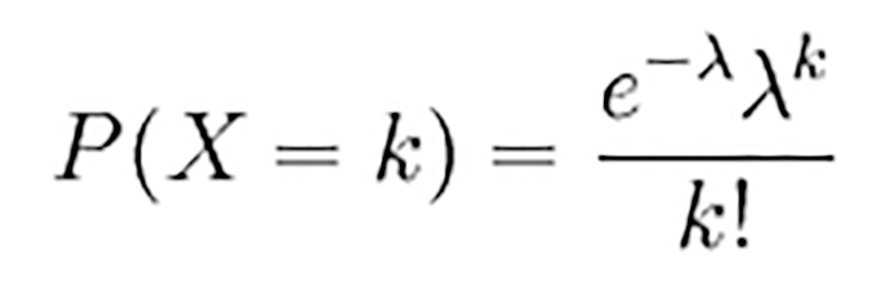{:height 113, :width 338}
						- 当 n 很大，且在一次试验中出现的概率 P 很小时，泊松分布近似二项式分布。
					- 二项分布（Binomial distribution），是 n 个独立的是 / 非试验中成功的次数的离散概率分布。
						- 这里通常重复 n 次独立的伯努利试验（Bernoulli trial）。
							- 在每次试验中只有两种可能的结果，而且两种结果发生与否互相对立，并且相互独立。
							- 也就是说事件发生与否的概率在每一次独立试验中都保持不变，与其它各次试验结果无关。
						- 当试验次数为 1 时，二项分布服从比较简单的 0-1 分布。
						- 在 n 重伯努利试验中，假设一个事件 A 成功的概率是 p, 那么恰好发生 k 次的概率为：
							- 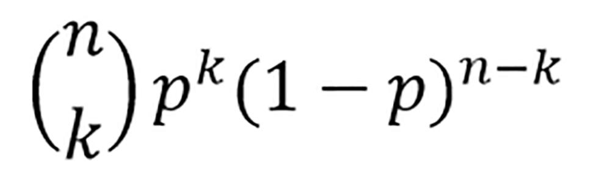{:height 146, :width 447}
					- 正态分布（Normal distribution），也叫高斯分布（Gaussian distribution）。经常用来代表一个不明的随机变量。
						- 正态分布的曲线呈钟型，两头低，中间高，左右对称，因此经常被称之为钟形曲线。
						- 一个正态分布往往记为 N(μ，σ^2)。其中的期望值μ决定了其位置，其标准差σ决定了分布的幅度。概率密度函数如下：
							- 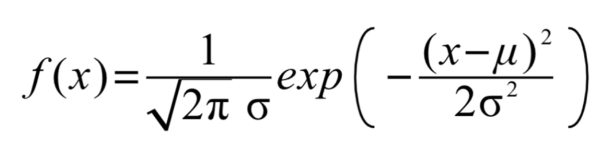
						- 正态分布的重要性在于，大多数我们碰到的未知数据都呈正态分布状。
							- 这意味着我们在不清楚总体分布情况时，可以用正态分布来模拟。
			- 排队的理论
				- 上面谈到的三个分布经常被应用到排队理论中，而排队理论在性能工程方面是非常重要的。
					- 计算机系统中的很多模块，比如网络数据发送和接收、CPU 的调度、存储 IO、数据库查询处理等等，都是用队列来缓冲请求的，因此排队理论经常被用来做各种性能的建模分析。
				- [[排队论]]（Queuing Theory），也被称为随机服务系统理论。
					- 这个理论能帮助我们正确地设计和有效运行各个服务系统，使之发挥最佳效益。
					- 排队论的系统里面有几个重要模块，比如顾客输入过程、队列、排队规则、服务机构等。几个模块之间的关系大体上可以用下面这张图来表示。
						- 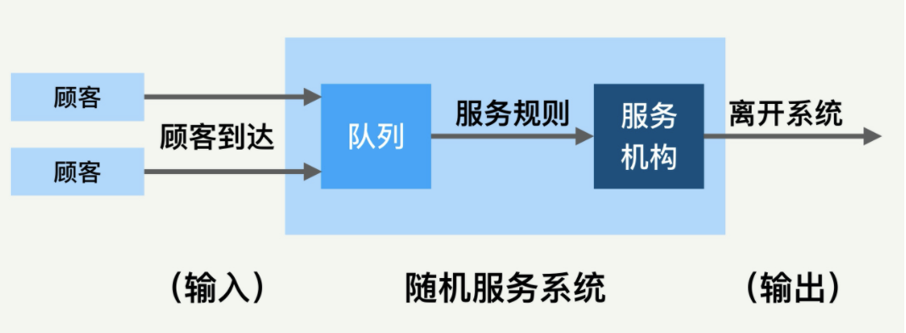
					- 主要的输入参数是到达速度、顾客到达分布、排队的规则、服务机构处理速度和处理模型等。
					- 排队系统的输出也有很多的参数，比较重要的是排队长度、等待时间、系统负载水平和空闲率等。所有这些输入、输出参数和我们进行的性能测试和优化都息息相关。
				- 排队的模型有很多，平时我们用得多的有单队列单服务台和多队列多服务台。系统里面各个模块的模型都可以变化，排队论里面还有很多延伸理论。
		- 经验总结：必须熟记的一组[[常用性能数字]]
			- 存储相关
				- 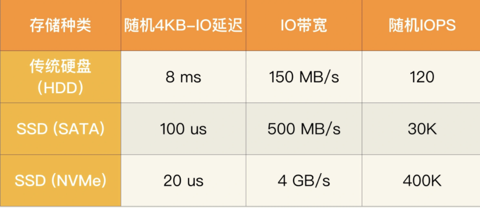{:height 198, :width 446}
			- CPU 和内存相关
				- 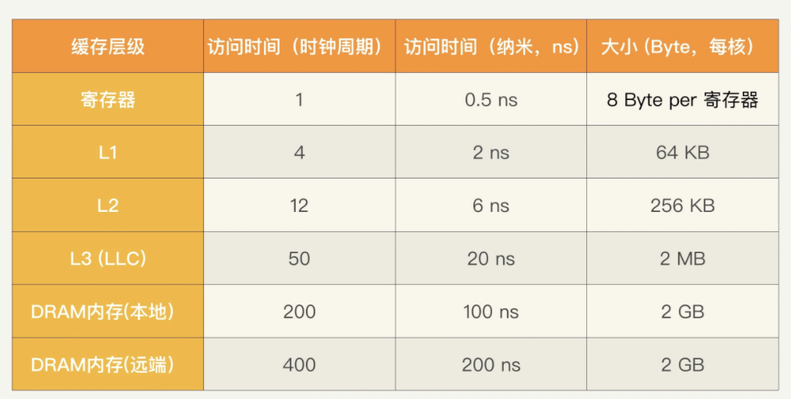{:height 245, :width 464}
				- 值得一提的是现在的 NUMA（非统一内存访问，Non-Uniform Memory Access）处理器会有本地和远端内存的区别，当访问本地节点的内存是会快一些。
			- 操作系统和应用程序相关
				- 指令分支延迟
					- 指令分支判断错误（Branch Mispredict）的时间代价是很昂贵的。如果判断预测正确，可能只需要一个时钟周期；如果判断错误，就需要十几个时钟周期来重新提取指令，这个延迟一般在 10 纳秒左右。
				- 互斥加锁和解锁
					- 互斥锁 Mutex（也叫 Lock）是在多线程中用来同步的，可以保证没有两个线程同时运行在受保护的关键区域。使用互斥锁的时候需要加锁和解锁，都是时间很昂贵的操作，每个操作一般需要几十个时钟周期，10 纳秒以上。
				- 上下文切换
					- 多个进程或线程共享 CPU 的时候，就需要经常做上下文切换（Context switch）。这种切换在 CPU 时间和缓存上都很大代价；尤其是进程切换。
					- 在时间上，上下文切换可能需要几千个时钟周期，1 微秒（1us）级别。
					- 在缓存代价上，多级 CPU 缓存和 TLB 缓存都需要恢复，所以可能极大地降低程序线程和进程性能。
				-
			- 网络相关
			  collapsed:: true
				- 网络的传输延迟是和地理距离相关的。
				- 网络信号传递速度不可能超过光速，一般光纤中速度是每毫秒 200 公里左右。
				- 如果考虑往返时间（RTT，Round Trip Time），那么可以大致说每 100 公里就需要一毫秒。
					- 北京到深圳约 2,000 公里，RTT 就是 20 毫秒；
					- 上海到乌鲁木齐或者美国的东西海岸之间距离差不多 4,000 公里，所以 RTT 是 40 毫秒左右；
					- 中国到美国（比如北京到美国西海岸旧金山）差不多 10,000 公里，RTT 就是 100 毫秒
				- 在数据中心里面，一般的传输 RTT 不超过半毫秒。如果是同一个机柜里面的两台主机之间，那么延迟就更小了，小于 0.1 毫秒。
				- 仔细想想的话，你就会发现直线距离本身还不够，因为数据是通过骨干网光纤网络传播的。如果光纤网络绕路的话，那么实际的 RTT 会超过以上估算数值。
				- 另外要注意的是，传输延迟也取决于传输数据的大小，因为各种网络协议都是按照数据包来传输的，包的大小会有影响。
					- 比如一个 20KB 大小的数据，用 1Gbps 的网络传输，仅仅网卡发送延迟就是 0.2 毫秒。
				- 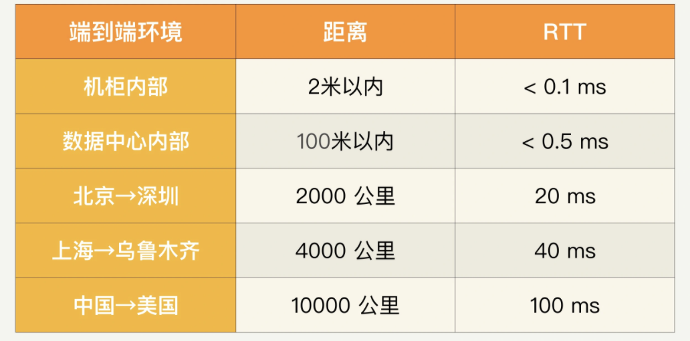{:height 245, :width 487}
				-
			- 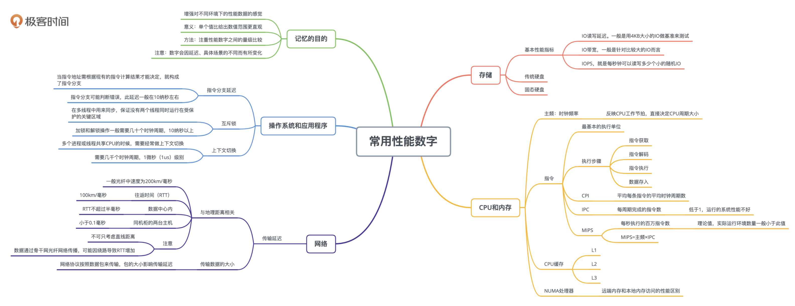
			-