- 相关资料
	- 推荐系统三十六式
		- 概念篇
			- 个性化推荐系统那些绕不开的经典问题
			  collapsed:: true
				- 推荐系统的问题模式
					- 我们知道，推荐系统的使命是为用户和物品建立连接，建立的方式是提前找出那些隐藏的连接呈现给用户，这是一个预测问题。
					- 所以推荐系统的预测问题模式，从达成的连接目标角度区分，有两大类:
						-
						  1. 评分预测;
						-
						  2. 行为预测。
					- 因为评分和行为是用户对推荐结果的两类反馈
						- 整个行为呈现一个漏斗形状，从曝光到最终消费完成。
						- 最后在用户完成消费后，产品方一般还希望他们告诉自己消费的体验，这时候就有评分了;
					- 所以不同推荐系统的任务也不同，有的直接去预测用户如果消费完之后会给多少评分，更多的推荐系统则会分层，致力于预测用户的行为。
				- 评分预测
					- 评分预测要干的事情是这样的:
						- 假如用户消费完一个物品之后会给出一个打分，比如通常是 1~5 分，或者有的网站用星星的颗数表示，也是一样。
						- 我们就想能不能提前预测一个用户对每一个物品会打多少分，找出那些他可能会打高分，但是还没消费的物品，然后装作若无其事地呈现在他面前，惊不惊喜，意不意外?
					- 说干就干，怎么干呢?
						- 一个朴素的思想是: 建立一个模型，这个模型会给用户历史上打过分的物品去预测分数。
						- 预测分数和实际分数之间会有误差，我们根据这个误差去调整模型参数，让这个误差越来越小，最后得到的这个模型理论上就可以为我们干活了。
						- 事实上，这其实就是个机器学习里面的回归问题。
					- 评分预测问题常见于各种点评类产品(如:书影音的点评)，但评分类推荐存在以下问题:
						-
						  1. 数据不易收集，我刚才说过，用户给出评分意味着他已经完成了前面所有的漏斗环节;
						-
						  2. 数据质量不能保证，伪造评分数据门槛低，同时真实的评分数据又处在转化漏斗最后一环，门槛高;
						-
						  3. 评分的分布不稳定，整体评分在不同时期会差别很大，个人评分在不同时期标准不同，人和人之间的标准差别很大。
					- 用户爸爸们给产品施舍的评分数据，我们又叫做显式反馈，意思是他们非常清晰明白地告诉了我们，他们对这个物品的态度;
					- 与之相对的还有隐式反馈，通常就是各类用户行为，也就是另一类推荐系统问题:行为预测。
				- 行为预测
					- 用户的行为通常呈现漏斗关系，我希望用户最终达成的行为可能不是那么容易得到的
					- 而推荐系统肩负的使命自然是达成用户行为，也就是连接越多越好。这也是这一类推荐系统问题的关注点。
					- 推荐系统预测行为方式有很多，常见的有两种:
						- 直接预测行为本身发生的概率
							- CTR 预估
								- CTR 意思就是 Click Through Rate，即“点击率”。把每一个推荐给用户的物品按照“会否点击”二分类，构建分类模型，预估其中一种分类的概率，就是 CTR 预估。
						- 预测物品 的相对排序
					- 行为预测说白了，就是利用隐式反馈数据预测隐式反馈的发生概率; 也因此，各家互联网产品要高度重视隐式反馈，归纳起来有以下几点原因。
						-
						  1. 数据比显式反馈更加稠密。
							- 诚然，评分数据总体来说是很稀疏的，之前 Netflix 的百万美 元挑战赛给出的数据稀疏度大概是 1.2%，毕竟评分数据是要消耗更多注意力的数据。
						-
						  2. 隐式反馈更代表用户的真实想法，
							- 比如你不是很赞成川普的观点，但还是想经常看到他 的内容(以便吐槽他)，这是显式反馈无法捕捉的。
							- 而人们在 Quora 上投出一些赞成票 也许只是为了鼓励一下作者，或者表达一些作者的同情，甚至只是因为政治正确而投， 实际上对内容很难说真正感兴趣。
						-
						  3. 隐式反馈常常和模型的目标函数关联更密切，也因此通常更容易在 AB 测试中和测试指标挂钩。
							- 这个好理解，比如 CTR 预估当然关注的是点击这个隐式反馈。
					- 用户给出较高评分的先决条件是用户要有“评分”的行为，所以行为预测解决的是推荐系统 的 80% 问题，评分预测解决的是最后那 20% 的问题
				- 几个常见顽疾
					-
					  1. 冷启动问题;
						- 关于“如何解决冷启动”本身，有伪命题的嫌疑，因为通常的解决方式就是给它加热:想办法引入数据，想办法从已有数据中主动学习(一种半监督学习)。
					-
					  2. 探索与利用问题;
						- EE 问题
							- Exploit 意为“开采”，对用户身上已经探明的 兴趣加以利用，
							- Explore 意为“探索”，探明用户身上还不知道的兴趣。
					-
					  3. 安全问题。
						- 推荐系统被攻击的影响大致有以下几个:
							-
							  1. 给出不靠谱的推荐结果，影响用户体验并最终影响品牌形象;
							-
							  2. 收集了不靠谱的脏数据，这个影响会一直持续留存在产品中，很难完全消除;
							-
							  3. 损失了产品的商业利益，这个是直接的经济损失。
				-
					-
			- 你真的需要个性化推荐系统吗?
			  collapsed:: true
				- 什么是推荐系统?
					-
					  1. 它能做什么;
						- 推荐系统可以把那些最终会在用户 (User)和物品(Item)之间产生的连接提前找出来。
					-
					  2. 它需要什么;
						- 推荐系统需要已经存在的连接，从已有的连接去预测未来的连接。
					-
					  3. 它怎么做。
						- 用已有的连接去预测未来用户和物品之间会出现的连接。
				- 你需要推荐系统吗?
					- 第一，看看产品的目的。
						- 如果一款产品的目的是建立越多连接越好，那么它最终需要一个推荐系统。
					- 第二，看看产品现有的连接。
						- 如果你的产品中物品很少，少到用人工就可以应付过来，那么用户产生的连接肯定不多，因为连接数量的瓶颈在于物品的数量，这时候不适合搭建推荐系统。
						- 关于第二点，“长尾理论”可以帮助我们理解，如何把用户和物品各种可能的连接汇总，包括用户属性、物品属性等，应该要有长尾效应才可能让推荐系统发挥效果。
			- 这些你必须应该具备的思维模式
			  collapsed:: true
				- 对关键元素重要性的认识
					- 要开发一个推荐系统产品，有这么四个关键的元素需要注意:
						-
						  1. UI 和 UE;
							- 最先优化的一定是产品的 UI 和 UE ，即人机交互设计和用户体验设计。
								- “颜值即正义”的 法则放在推荐系统中也是成立的，不能因为你的产品是具有 AI 属性的个性化推荐就不看脸 了，用户对产品的体验，视觉是否符合目标用户审美，交互逻辑是否简单明了，这些会在最 大程度上决定用户是否会持续使用。
						-
						  2. 数据;
							- 数据与 UI、UE 是几乎同等重要的元素，它是推荐系统的食材
							- 数据贯穿了产品始终，对数据的尊重就是对理性和科学的尊重。UI、UE、数据是一个产品 的基石，不论其有没有推荐系统存在都是基石。
						-
						  3. 领域知识;
							- 领域知识，与之对应的是常识和通识。
								- 可以这样说，没有哪个产品不涉及领域知识，每一个产品存在于市场上，总是有一部分价值是大多数其他产品无法替代的，这部分就涉及了领域知识。
									- 电商产品有自己的领域知识，比如普通用户更在意的是价格而不是兴趣;
									- 音乐产品也有自己的领域知识。比如一个歌手的死忠粉，你推荐给他该歌手的任意一首歌对他来说都是徒劳——因为他早 就听过了。
								- 类似这些在一个领域总结出来的普适规律，对于推荐系统的效果提升非常有用:有的是防止闹笑话自毁品牌形象，有的是大幅提高某些指标，有的是缩短模型训练周期。
						-
						  4. 算法。
							- 算法的作用没有你想象的那么大，但也一定不是可有可无。
					- 他们的重要性依次递减，权重大致是 4-3-2-1
				- 目标思维和不确定性思维
					- 我个人对于软件产品有一个粗略分类
						- 传统的软件是一个信息流通管道，从信息生产端到信 息消费端的通道，比如一款内容 App，写内容的可以正常记录，读内容的可以流畅加载， 无论多大的并发量都扛得住，这就是一个正常的产品了。
						- 但推荐系统这种产品，如果是一个产品的话，它和作为信息流通管道的本质不一样，它是一个信息过滤工具，要解决的问题不是信息流通本身，而是如何让流通更有效率。
					- 这两个本质不同的软件产品，决定了我们要以不同视角去对待推荐系统。
						- 传统的软件产品追求的是稳定和满足预期，背后思想强调的是逻辑和因果链条，软件体验上设定好行为和响应，软件设计上强调分层以应对无比复杂的操作逻辑。
							- 核心词可以表述为:逻辑、因果、分层。
						- 反观推荐系统这种信息过滤系统，追求的是指标的增长，背后思想强调是目标和不确定性:
							- 我们并不能很确定地模拟每个人将会看到什么，也不能很好地复现一些操作过程，充满了不确定性，但是在推荐系统未动的情形下，目标先行则是常识。
					- 目标思维背后是“量化一切”的价值取向。
						- 最先要量化的就是目标本身，整个团队才能知道在为什么而战，才能知道自己所做的动作是不是有意义，才能让团队自发地去寻找优化方向，一定不能停留在“感觉推荐很精准”或者“感觉推荐得很不准”这样的玄学层面。
						- 接下来要量化的是所有的优化改进动作，知道 Logo 放置位置往上移动了多少，知道文案 字数减少了多少，知道 Push 少发了几次，发给了谁，谁点进来了。
					- 量化一切的价值取向和 前面说的数据的重要性是一体两面，要量化就要收集数据，数据收集对了才能得到正确的量 化结果。
					- 盯着量化后的目标去行动后，还需要你具备另一个思维:不确定性思维。
						- 这个思维是开发传统软件类产品后较难转变形成的。
						- 不确定性思维就是:不用因果逻辑严丝合缝地提前推演，而是用概率的眼光去看结果。
					- 为什么负责推荐系统产品的人一定要有不确定性思维呢?原因有以下几个。
						-
						  1. 绝大多数推荐算法都是概率算法，因此本身就无法保证得到确切结果，只是概率上得到 好的效果;
						-
						  2. 推荐系统追求的是目标的增长，而不是一城一池的得失;
						-
						  3. 如果去花时间为了一个 Case 而增加补丁，那么付出的成本和得到的收益将大打折扣;
						-
						  4. 本身出现意外的推荐也是有益的，可以探索用户的新兴趣，这属于推荐系统的一个经典问题: EE 问题，我也会在后面的内容中专门讲。
					-
					-
			- 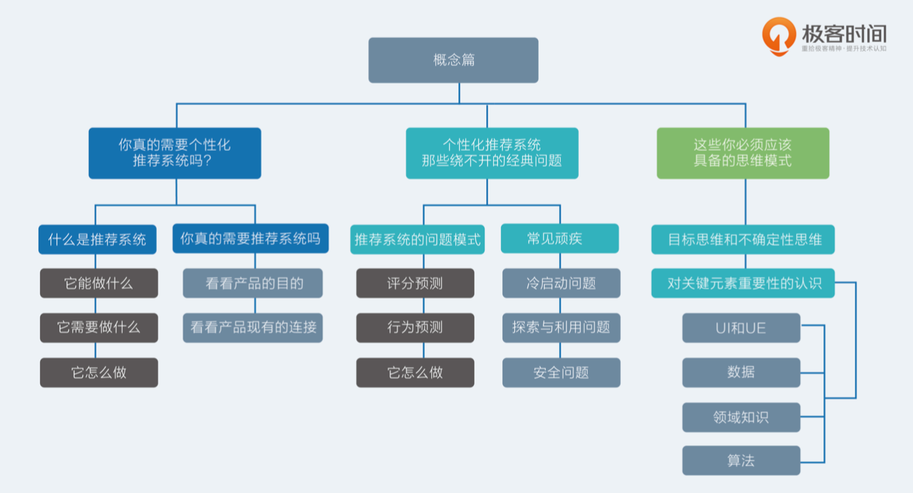
		- 工程篇
			- 【常见架构】总览推荐架构和搜索、广告的关系
			  collapsed:: true
				- 三者对比
					- 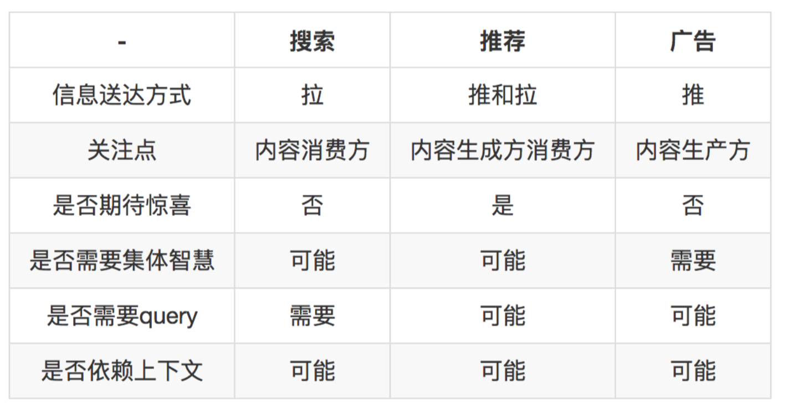
				- 架构抽象
					- 我们抽象一下三者的需求共性:本质上都是在匹配，匹配用户的兴趣和需求(看成 context)，但匹配的目标，条件和策略不尽相同。
						- 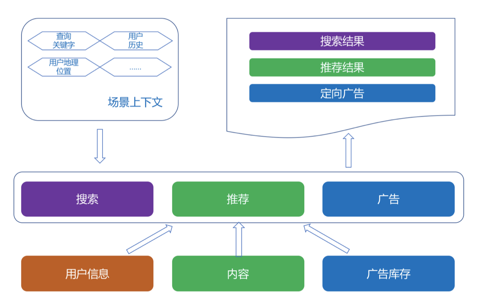
					-
					  1. 过滤候选
						- 一种离线阶段的推荐算法对应一种召回策略，为了保证高效地召回，都要建立相应的索引，这样一来，是不是搜索、广告和推荐都离不开过滤候选这一步，而过滤候选就离不开建立索引。
							- 事实上，如果你的产品已有搜索，要增加推荐功能，最快的实现方式的确就是在已有搜索的基础上开发。
					-
					  2. 排序候选
						- 候选排序这一步，对于三者来说，主要区别在于排序的目标和约束。
							- 搜索的排序目标是高相关性
								- 无论 BM25 为代表的传统排序模型，还是以 Learn to Rank 为代表的机器学习排序 皆是如此，把用户每次在搜索上花费的时间是不是更少(而不是更多)来衡量搜索的效果。
						- 推荐系统的排序则比较复杂，根据推荐系统不同的产品形式、产品目标，排序策略也不同。
							- 前面讲过，通常推荐系统用 CTR 预估来融合召回策略得到的候选集
							- 如果做得深入，还需 要考虑探索利用问题。
							- 附加的约束则是千变万化。
								- 电商中，当天买过的当天就不能再推了， 新闻推荐里，重复的新闻不能再推了。
								- 某些场景需要推荐搭配，某些场景需要推荐相似，TopN 推荐还需要考虑多样性，序列推荐 要考虑前序和后续等等。
						- 广告系统的排序更多是从经济学角度去看，CPC 广告的排序方式是结合预估 CTR、出价、 广告质量三者一起考虑。
							- 同时还要考虑很多别的因素，尤其是商业因素，平台方的要求，广 告主的要求等等，是一个纯动态的博弈。
					-
					  3. 个性化输出
						- 个性化最被推荐系统所看重，而且在某些场合，个性化一度成为推荐系统的代名词，然而个性化只是推荐系统的衡量指标之一而已，个性化的前提也一定是信息够丰富够垂直才行。
						- 搜索的个性化需求相对来说松弛一些，常见的是利用地域等人口统计学体现个性化，而且对于歧义较少的查询关键字，搜索如果太个性化既没意义又有风险。
					-
					  4. 三者的协同
						- 搜索、推荐、广告三者业务和技术上已经有很多重叠，也能够产生很多协同作用。
							- 有一部分搜索需求是无法用搜索相关性满足的
								- 比如“一个人的夜晚听什么歌”这样的 query，这就需要推荐系统去满足，交互形式可能是眼下大热的聊天机器人，也可能是流推荐等等。
								- 如果能够识别出这样的搜索请求，其实更应该交给推荐系统来响应，这类是看似搜索请求，实际上则是漫无目的。
							- 推荐系统总体上滞后于用户的即时需求，再强大的推荐系统，也要有搜索引擎来与之配合。
								- 一方面，搜索因为能够满足用户的主动寻找需求，所以能够化解一些推荐不力不及时的尴尬。
								- 另一方面，搜索可以积累用户兴趣数据; 当二者结合起来考虑时，可以避免“搜什么推什么”的窘境，整个系统能够综合考虑哪些是即时快速需求，哪些是长期兴趣。
							- 广告系统，在技术上和搜索跟推荐并无本质差异，差异在意图不同，功能不同。
								- 对用户的信息需求满足，搜索和推荐离真正得到满足之间总是有一定的鸿沟，要么是信息不足，要么是信息过载，这些鸿沟可以利用经济手段进行调配，这就是广告系统
						-
			- 【常见架构】Netflix个性化推荐架构
			  collapsed:: true
				- 架构的重要性
					- 一个好的推荐系统架构应该具有这些特质:
						-
						  1. 实时响应请求;
						-
						  2. 及时、准确、全面记录用户反馈;
						-
						  3. 可以优雅降级;
						-
						  4. 快速实验多种策略。
					- 经典架构
						- Netflix 的推荐系统架构图
							- 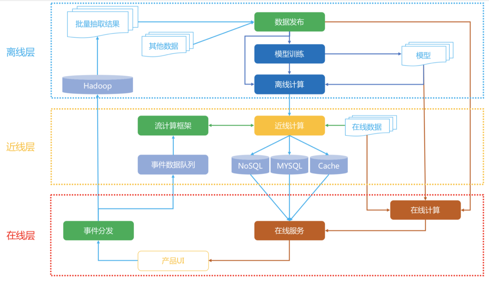
							- 在线、近线、离线。
								-
								  1. 离线:不用实时数据，不提供实时服务;
								-
								  2. 近线:使用实时数据，不保证实时服务;
								-
								  3. 在线:使用实时数据，要保证实时服务。
						-
						  collapsed:: true
						  1. 数据流
							- 用户在产品 UI 上使用产品，消费展示的内容，产生行为事件数据，**实时**地被收集走，
								- 一边进入分布式的文件系统中存储，供**离线**阶段使用，
								- 另一边流向近线层的消息队列，供**近线**阶段的流计算使用。
							- 离线存储的全量数据被抽取出来，组成离线计算所需的训练数据，这些训练数据被一个管理数据生成和发布的组件统一管理
								- 要使用数据的下游，比如模型训练会在离线数据生成时得到这个组件的通知，从而开始训练，训练得到的模型用于进一步为用户计算推荐结果。
							- **离线**阶段的推荐结果或者模型在**近线**阶段被更新，进一步在**在线**阶段被直接使用，产生最终的推荐结果，呈现给用户。
						-
						  collapsed:: true
						  2. 在线层
							- 在线层的触发时机是当用户发出请求，也就是用户进入一个推荐场景，推荐位等着展示推荐结果时，这个时候需要承担责任就是在线层。
							- 在线层就是实时响应用户请求。
								- 简单说，在线层的特点就是“使用实时数据，要保证实时服务”。
							- 在线层的优势有:
								-
								  1. 直接首次接触到大多数最新数据;
								-
								  2. 对用户请求时的上下文了如指掌;
								-
								  3. 只需计算必须的信息，不需要考虑所有的信息。
							- 在线层也有严格的制约:
								-
								  1. 严格的服务响应时间，不能超时，或者让用户等太久;
								-
								  2. 服务要保证可用性，稳定性;
								-
								  3. 传输的数据有限。
							- 在线层常常展现出的形式
								- 就是 Rest API 形式，后端则通常是 RPC 服务内部互相调用，
								- 以 用户 ID、场景信息去请求，
								- 通常就在 ms 响应时间内返回 Json 形式的推荐结果。
							- 那么哪些计算逻辑适合放在在线层呢?
								-
								  1. 简单的算法逻辑;
								-
								  2. 模型的预测阶段;
								-
								  3. 商业目标相关的过滤或者调权逻辑;
								-
								  4. 场景有关的一些逻辑;
								-
								  5. 互动性强的一些算法。
							- 在线阶段要处理的对象一般是
								- 已经预处理后的推荐结果，是少量物品集合。
									- 比如说当用户访问一个物品详情页，需要做相关推荐，
									- 那么在线阶段给在线服务的 Rest API 传入用户身份以及当前的物品 ID，
									- 实时地取出物品 ID 对应的相关物品 ID，
									- 再根据用户信息对这些物品 ID 做一些重排和过滤，就可以输出了，
									- 整个过程都是在 ms 级别完成。
							- 这个实时响应的过程中，如果发生意外，比如说这个物品 ID 就没有相关的物品，那么这时候服务就需要降级
								- 降级为取出热门排行榜返回。虽然不是个性化的相关结果，但是总比开天窗要好。这就是服务的可用性。
							- 在线阶段还要实时地分发用户事件数据，就是当用户不断使用产品过程产生的行为数据，需要实时地上报给有关模块。
								- 这一部分也是需要实时的，比如用于防重复推荐的过滤。
						-
						  collapsed:: true
						  3. 离线层
							- 离线层就是躲在推荐系统的大后方，批量、周期性地执行一些计算任务。其特点是“不用实时数据，不提供实时服务”。
							- 离线层的示意图如下:
								- 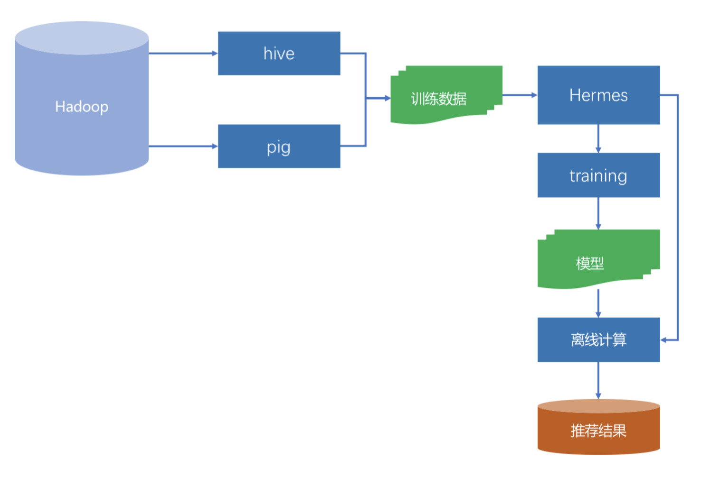
							- 离线阶段主要面对的数据源就是 Hadoop，实质上是 HDFS。收集到的所有日志都存在这里面，是一个全量的数据中心。
							- 通过 Pig 或者 Hive 等工具，从全量日志中按照算法要求抽取出不同的数据，再加上其他数据变成了不同算法所需的数据源。
							- 如果这种数据源比较多时，就需要有专门的工具统一管理起来，
								- 这个管理上要求:
									-
									  1. 数据准备好之后及时通知相关方，也就是要有订阅发布的模式;
									-
									  2. 能够满足下游不同的存储系统;
									-
									  3. 完整的监控体系，并且监控过程对于数据使用方是透明的。
								- 在 Netflix 内部，承担这个管理任务的工具叫做 Hermes，类似 Kafka，但是又有不同的内部工具。
							- 离线阶段的任务主要是两类:
								- 模型训练
									- 通常机器学习类模型，尤其是监督学习和非监督学习，都需要大量的数据和多次迭代，这类型的模型训练任务最适合放在离线阶段。
								- 推荐结果计算。
									- 举个例子，你已经知道推荐系统中会有召回和融合排序这两个阶段。
									- 通常一些推荐算法，例如协同过滤就是在离线阶段计算出每个人的推荐结果，作为线上融合排序的候选集之一，也就是示意图中的“推荐结果”。
									- 另一方面，假如融合排序模型时逻辑回归，那么逻辑回归模型的参数也通常在离线阶段就训练完成的，在线阶段也只是取出来参数用于计算而已。
							- 离线阶段有以下这么几个好处:
								-
								  1. 可以处理最大的数据量;
								-
								  2. 可进行批量处理和计算;
								-
								  3. 不用有响应时间等要求。
							- 当然坏处也是明显的:
								-
								  1. 无法及时响应前端需求;
								-
								  2. 面对的数据较静态，无法及时反应用户的兴趣变化。
							- 大多数推荐算法，实际上都是在离线阶段产生推荐结果的。离线阶段的推荐计算和模型训练，如果要用分布式框架，通常可以选择 Spark 等。
							-
							-
						-
						  collapsed:: true
						  4. 近线层
							- 近线层的特点是“使用实时数据，不保证实时服务”
							- 近线层，也叫做准实时层，所谓“准实时”，就是接近实时，但不是真的实时。
							- 从前面的架构图中也可以看出，
								- 这一层的数据来源是实时的行为事件队列，
								- 但是计算的结果并不是沿着输入数据的方向原路返回，而是进入了在线数据库中，得到用户真正发起请求时，再提供服务。
							- 一个典型的近线计算任务是这样的:
								- 从事件队列中获取最新的一个或少许几个用户反馈行为，
								- 首先将这些用户已经反馈过的物品从离线推荐结果中剔除，
								- 进一步，用这几个反馈行为作为样本，以小批量梯度下降的优化方法去更新融合模型的参数。
							- 这两个计算任务都不会也不需要立即对用户做出响应，也不必须在下一次用户请求时就产生效果，就是说当用户实时请求时，不需要去等待近线任务的最新结果，因为两者是异步的。
							  id:: 640c8421-6ece-42aa-b917-8b85d4640513
							- 近线计算任务一个核心的组件就是流计算，因为它要处理的实时数据流。
								- 常用的流计算框架 有 Storm，Spark Streaming，FLink 等，Netflix 采用的内部流计算框架 Manhattan，这 和 Storm 类似。
								- 略有区别的是 Spark Streaming，实际上并不是实时流计算，而是小批量计算。
					- 简化架构
						- 倘若你现 在刚刚接手一个新产品，要从 0 开始搭建一个推荐系统，那么可以以 Netflix 的架构作为蓝本，做一定的简化。
							- 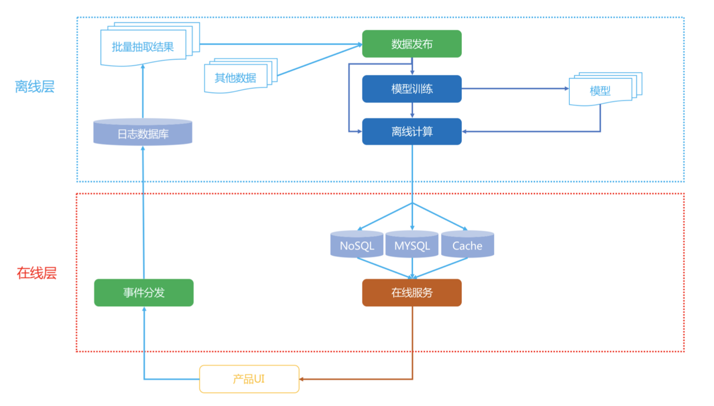
						- 关键简化有两点:
							-
							  1. 完全舍弃掉近线层;
							-
							  2. 避免使用分布式系统。
								- 其中第二点，在一个新产品的场景下， 当数据量还没有那么大时，使用分布式存储或者计算框架，非常不划算。
							- 如果性能不足，请升级单机配置。根据经验，一个几千万用户，几十万到百万的物品的协同过滤或者矩阵分解，如果充分发挥单机的性能，综合效率会远远优于在 Spark 上运行。
							- 另外在一个推荐系统刚从 0 开始的阶段，离线阶段的算法也没有那么多，很多情况甚至都 只有协同过滤结果，这时候线上融合模型也不必那么复杂，一个简单的加权融合就可以了， 因此在线层也不必复杂。
					- 总结
						- 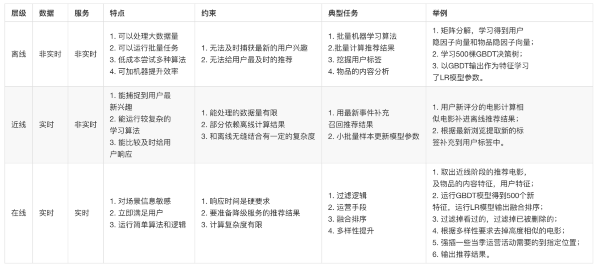
						-
						-
						-
							-
						-
			- 【关键模块】 推荐系统服务化、存储选型及API设计
				- 存储
				  collapsed:: true
					- 这里讲到的存储，专指近线或者在线部分所用的数据库，并不包括离线
					  分析时所涉及的业务数据库或者日志数据库。
					- 首先来看一下，离线阶段会产生哪些数据。按照用途来分，归纳起来一共就有三类。
						-
						  collapsed:: true
						  1. 特征。
							- 特征数据会是最多的，所谓用户画像，物品画像，这些都是特征数据，更新并不频繁。
							- 特征数据有两种，
								- 一种是稀疏的，
									- 稀疏的特征常见就是文本类特征，用户标签之类的
								- 一种是稠密的，
									- 稠密的特征则是各种隐因子模型的产出参数。
							- 特征数据又常常要以两种形态存在:
								- 一种是正排，
									- 正排就是以用户 ID 或者物品 ID 作为主键查询
									- 用途
										- 在需要拼凑出样本的特征向量时，
											- 如线下从日志中得到曝光和点击样本后， 还需要把对应的用户 ID 和物品 ID 展开成各自的特征向量，再送入学习算法中得到最终模型，这个时候就需要正排了。
									- 正排需要用列式数据库存储
										- 最典型的就是 HBase 和 Cassandra
								- 一种是倒排。
									- 倒排则是以特征作为主键查询。
									- 用途
										- 另一种是在需要召回候选集时，
											- 如已知用户的个人标签，要用个人标签召回新闻，那么久就
											  需要提前准备好标签对新闻的倒排索引。
									- 倒排索引 需要用 KV 数据库存储
										- 最典型的就是 Redis 或 Memcached。
							- 另外，对于稠密特征向量，例如各种隐因子向量，Embedding 向量，可以考虑文件存储， 采用内存映射的方式，会更加高效地读取和使用。
						-
						  collapsed:: true
						  2. 模型。
							- 尤其是机器学习模型，这类数据的特点是它们大都是键值对，更新比较频繁。
							- 模型数据也是一类重要的数据，模型数据又分为
								- 机器学习模型
									- 模型训练阶段，如果是超大规模的参数数量，业界一般采用分布式参数服务器
									- 对于达到超大规模参数的场景在中小公司不常见，可以不用牛刀。而是采用更加灵活的 PMML 文件作为模型的存储方式
										- PMML 是一种模型文件协议
								- 非机器学习模型。
									- 非机器学习模型，则不太好定义，有一个非常典型的是相似度矩阵，物品相似度，用户相似度，在离线阶段通过用户行为协同矩阵计算得到的。
										- 相似度矩阵之所算作模型，因为，它是用来对用户或者物品历史评分加权的，这些历史评分就是特征，所以相似度应该看做模型数据。
						-
						  collapsed:: true
						  3. 结果。
							- 就是一些推荐方法在离线阶段批量计算出推荐结果后，供最后融合时召回使用。任何一个数据都可以直接做推荐结果，如协同过滤结果。
							- 预先计算出来的推荐结果，或者叫候选集，这类数据通常是 ID 类，召回方式是用户ID 和策略算法名称。这种列表类的数据一般也是采用高效的 KV 数据库存储，如 Redis。
					- 另外，还要介绍一个特殊的数据存储工具:ElasticSearch。
						- 这原本是一个构建在开源搜索引擎 Lucene 基础上的分布式搜索引擎，也常用于日志存储和分析，
						- 但由于它良好的接口设计，扩展性和尚可的性能，也常常被采用来做推荐系统的简单第一版，直接承担了存储和计算的任务。
					-
					  1. 列式数据库
						- 列式数据库适合批量写入和批量查询
					-
					  2. 键值数据库
						- 键值对内存数据库，这当然首推 Redis
						- 在推荐系统的以下场景中常常见到 Redis 的身影:
							-
							  1. 消息队列，List 类型的存储可以满足这一需求;
							-
							  2. 优先队列，比如兴趣排序后的信息流，或者相关物品，对此 sorted set 类型的存储可以满足这一需求;
							-
							  3. 模型参数，这是典型的键值对来满足。
					-
					  3. 非数据库
						- 除了数据库外，在推荐系统中还会用到一些非主流但常用的存储方式。
							- 第一个就是虚拟内存映射，称为 MMAP，
								- 这可以看成是一个简陋版的数据库，
								- 其原理就是把磁盘上的文件映射到内存中，以解决数据太大不能读入内存，但又想随机读取的矛盾需求。
								- 哪些地方可以用到呢?
									- 比如你训练的词嵌入向量，或者隐因子模型，当特别大时，可以二进
									  制存在文件中，然后采用虚拟内存映射方式读取。
							- 另外一个就是 PMML 文件，专门用于保存数据挖掘和部分机器学习模型参数及决策函数 的。
								- 当模型参数还不足以称之为海量时，PMML 是一个很好的部署方法，可以让线上服务 在做预测时并不依赖离线时的编程语言，以 PMML 协议保存离线训练结果就好。
						-
						-
					-
				- API
				  collapsed:: true
					- API 有两大类，一类数据录入，另一类是推荐服务。
						- 数据录入 API，可以用于数据采集的埋点，或者其他数据录入。
							- 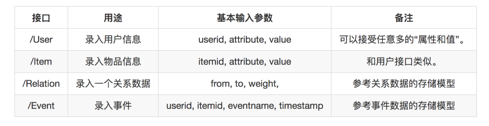
						- 推荐服务的 API 按照推荐场景来设计，则是一种比较常见的方式
						-
					-
			- 【关键模块】巧妇难为无米之炊:数据采集关键要素
				- 数据采集
					- 给推荐系统收集日志这件事，依次要讨论的是:日志的数据模型，收集哪些日志，用什么工具收集，收集的日志怎么存储。
					-
					  1. 数据模型
						- 数据模型帮助梳理日志、归类存储，以方便在使用时获取。你可以回顾一下在前面讲过的推荐算法，这些推荐算法形形色色，但是他们所需要的数据可以概括为两个字: **矩阵**。
						- 再细分一下，这些矩阵就分成了四种。
							- 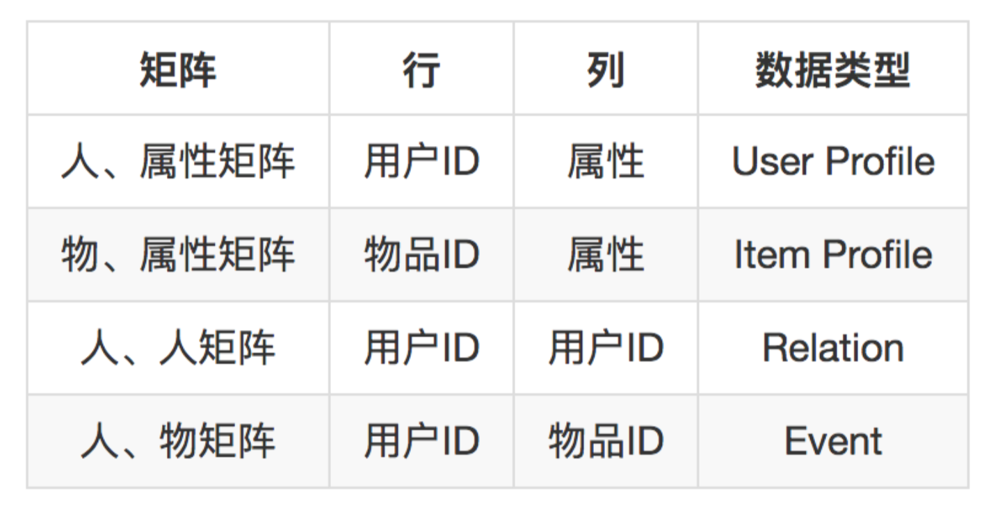{:height 206, :width 405}
						- 基于这个分析，可以给要收集的数据归纳成下面几种。
							- 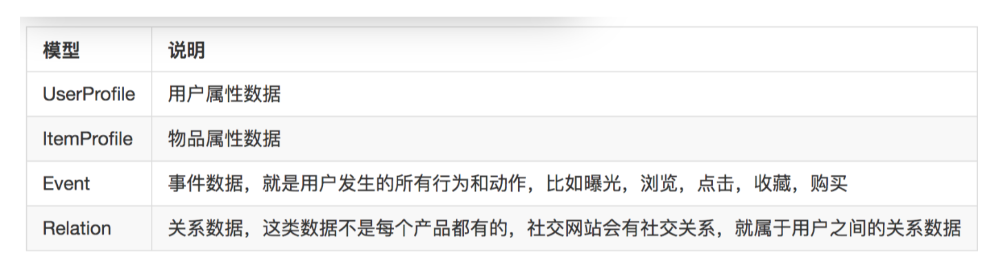
						- 有了数据模型的好处，
							- 可以很好地去梳理现有的日志，看看每一种日志属于哪一种。
							- 并且，在一个新产品上线之初，该如何为将来的推荐系统记录日志也比较清楚了。
							- 这个数据模型当然不能概括全部数据，但是用来构建一个推荐系统就绰绰有余了。
						- 接下来就是去收集数据了。收集数据，就是把散布在各个地方的数据聚拢，也包括那些还根本没有记录的数据的地方要开始记录。
					-
					  2. 数据在哪?
						- 按照前面的数据建模，我们一起来看一下要收集的数据会怎么产生。
							- 主要来自两种，
								- 一种是业务运转必须要存储的记录，例如用户注册资料，如果不在数据库中记录，产品就无法正常运转。
									- 数据源来自业务数据库，通常都是结构化存储，MySQL。
								- 另一种就是在用户使用产品时顺便记录下来的，需要埋点
									- 埋点又有几种不同方法。
									  collapsed:: true
										- 按照技术手段分
											- 第一种，SDK 埋点。
												- 这个是最经典古老的埋点方法，就是在开发自己的 App 或者网站时， 嵌入第三方统计的 SDK，App 如友盟等，网站如 Google Analytics 等。
													- SDK 在要收集的数据发生点被调用，将数据发送到第三方统计，第三方统计得到数据后再 进一步分析展示。
												- 这种数据收集方式对推荐系统的意义不大，因为得不到原始的数据而只是得到统计结果，
													- 我们可以将其做一些改动，或者自己仿造做一些开发内部数据采集 SDK，从而能够收集到鲜活的数据。
												- SDK 埋点就是复杂度高，一旦埋点有错，需要更新客户端版本
											- 第二种，可视化埋点。
												- 可视化埋点在 SDK 埋点基础上做了进一步工作，埋点工作通过可视化配置的方式完成，
													- 一般是在 App 端或者网站端嵌入可视化埋点套件的 SDK，
													- 然后再管理端接收前端传回的应用控件树，通过点选和配置，指令前端收集那些事件数据。
													- 业界有开源方案实现可参考，如 Mixpanel。
												- 可视化埋点的不足就是: 收集数据不能收集到非界面数据，例如收集了点击事件，也仅仅能收集一个点击事件，却不能把更详细的数据一并返回。
											- 第三种，无埋点。
												- 所谓无埋点不是不埋点收集数据，而是尽可能多自动收集所有数据，但是使用方按照自己的需求去使用部分数据。
										- 按照收集数据的位置分
											- 又分为前端埋点和后端埋点
											- 这两个区别是这样的，
												- 举个例子，要收集用户的点击事件，前端埋点就是在用户点击时，除了响应他的点击请求，还同时发送一条数据给数据采集方。
												- 后端埋点就不一样了，由于用户的点击需要和后端交互，后端收到这个点击请求时就会在服务端打印一条业务日志，所以数据采集就采集这条业务日志即可。
										- 埋点是一项非常复杂繁琐的事情，需要前端工程师或者客户端工程师细心处理，不在本文讨论范围内。
											- 但是幸好，国内如神策数据等公司，将这些工作已经做得很傻瓜化了，大大减轻了埋点数据采集的困扰。
										-
									- 对于推荐系统来说，所需要的数据基本上都可以从后端收集，采集成本较低，但是有两个要求:
										- 要求所有的事件都需要和后端交互
										- 要求所有业务响应都要有日志记录
										- 这样才能做到在后端收集日志
									- 后端收集业务日志好处很多，比如下面几种
										-
										  1. 实时性。由于业务响应是实时的，所以日志打印也是实时的，因此可以做到实时收集。
										-
										  2. 可及时更新。由于日志记录都发生在后端，所以需要更新时可以及时更新，而不用重新发布客户端版本。
										-
										  3. 开发简单。不需要单独维护一套 SDK。
						- 归纳一下，Event 类别的数据从后端各个业务服务器产生的日志来，Item 和 User 类型数 据，从业务数据库来，还有一类特殊的数据就是 Relation 类别，也从业务数据库来。
					-
					  3. 元素有哪些?
						- 后端收集事件数据需要业务服务器打印日志。需要打印哪些信息才算是一条完整的时间数据呢? 大致需要包含下面的几类元素。
							-
							  1. 用户 ID，唯一标识用户身份。
							-
							  2. 物品 ID，唯一标识物品。
								- 这个粒度在某些场景中需要注意，
									- 例如电商，物品的 ID 就不是真正要去区别物和物之间的不同，而是指同一类试题，
										- 例如一本书《岛上书店》，库存有很多本，并不需要区别库存很多本之间的不同，而是区别《岛上书店》和《白夜行》之间的不同。
							-
							  3. 事件名称，每一个行为一个名字。
							-
							  4. 事件发生时间，时间非常重要。
						- 以上是基本的内容，下面再来说说加分项。
							-
							  1. 事件发生时的设备信息和地理位置信息等等;
							-
							  2. 从什么事件而来;
							-
							  3. 从什么页面而来;
							-
							  4. 事件发生时用户的相关属性;
							-
							  5. 事件发生时物品的相关属性。
						- 把日志记录想象成一个 Live 快照，内容越丰富就越能还原当时的场景。
					-
					  4. 怎么收集?
						- 一个典型的数据采集架构如下图所示。
							- 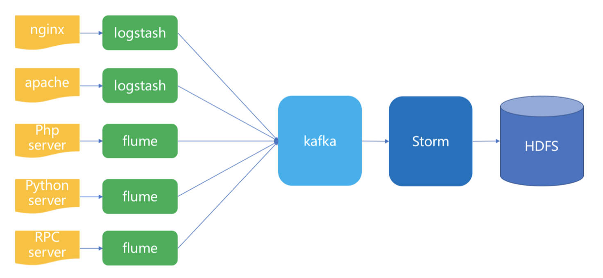
						- 最左边就是数据源，有两部分，
							- 一个是来自非常稳定的网络服务器日志，nginx 或者 Apache 产生的日志。这类日志对推荐系统的作用是什么呢?
								- 因为有一类埋点，在 PC 互联网时代，有一种事件数据收集方式是，放一个一像素的图片在 某个要采集数据的位置。
								-
						-
							-