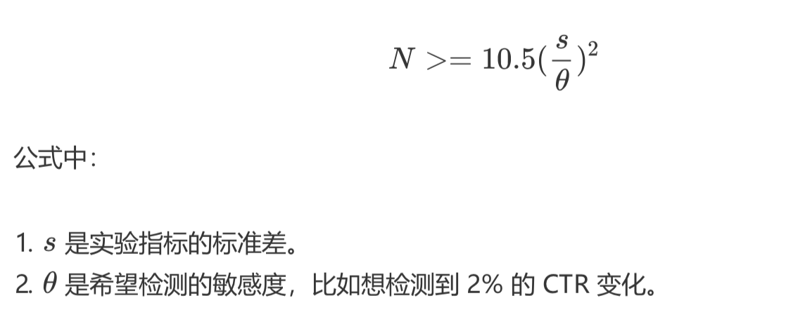

- 相关资料
	- 推荐系统三十六式
		- 概念篇
			- 个性化推荐系统那些绕不开的经典问题
			  collapsed:: true
				- 推荐系统的问题模式
					- 我们知道，推荐系统的使命是为用户和物品建立连接，建立的方式是提前找出那些隐藏的连接呈现给用户，这是一个预测问题。
					- 所以推荐系统的预测问题模式，从达成的连接目标角度区分，有两大类:
						-
						  1. 评分预测;
						-
						  2. 行为预测。
					- 因为评分和行为是用户对推荐结果的两类反馈
						- 整个行为呈现一个漏斗形状，从曝光到最终消费完成。
						- 最后在用户完成消费后，产品方一般还希望他们告诉自己消费的体验，这时候就有评分了;
					- 所以不同推荐系统的任务也不同，有的直接去预测用户如果消费完之后会给多少评分，更多的推荐系统则会分层，致力于预测用户的行为。
				- 评分预测
					- 评分预测要干的事情是这样的:
						- 假如用户消费完一个物品之后会给出一个打分，比如通常是 1~5 分，或者有的网站用星星的颗数表示，也是一样。
						- 我们就想能不能提前预测一个用户对每一个物品会打多少分，找出那些他可能会打高分，但是还没消费的物品，然后装作若无其事地呈现在他面前，惊不惊喜，意不意外?
					- 说干就干，怎么干呢?
						- 一个朴素的思想是: 建立一个模型，这个模型会给用户历史上打过分的物品去预测分数。
						- 预测分数和实际分数之间会有误差，我们根据这个误差去调整模型参数，让这个误差越来越小，最后得到的这个模型理论上就可以为我们干活了。
						- 事实上，这其实就是个机器学习里面的回归问题。
					- 评分预测问题常见于各种点评类产品(如:书影音的点评)，但评分类推荐存在以下问题:
						-
						  1. 数据不易收集，我刚才说过，用户给出评分意味着他已经完成了前面所有的漏斗环节;
						-
						  2. 数据质量不能保证，伪造评分数据门槛低，同时真实的评分数据又处在转化漏斗最后一环，门槛高;
						-
						  3. 评分的分布不稳定，整体评分在不同时期会差别很大，个人评分在不同时期标准不同，人和人之间的标准差别很大。
					- 用户爸爸们给产品施舍的评分数据，我们又叫做显式反馈，意思是他们非常清晰明白地告诉了我们，他们对这个物品的态度;
					- 与之相对的还有隐式反馈，通常就是各类用户行为，也就是另一类推荐系统问题:行为预测。
				- 行为预测
					- 用户的行为通常呈现漏斗关系，我希望用户最终达成的行为可能不是那么容易得到的
					- 而推荐系统肩负的使命自然是达成用户行为，也就是连接越多越好。这也是这一类推荐系统问题的关注点。
					- 推荐系统预测行为方式有很多，常见的有两种:
						- 直接预测行为本身发生的概率
							- CTR 预估
								- CTR 意思就是 Click Through Rate，即“点击率”。把每一个推荐给用户的物品按照“会否点击”二分类，构建分类模型，预估其中一种分类的概率，就是 CTR 预估。
						- 预测物品 的相对排序
					- 行为预测说白了，就是利用隐式反馈数据预测隐式反馈的发生概率; 也因此，各家互联网产品要高度重视隐式反馈，归纳起来有以下几点原因。
						-
						  1. 数据比显式反馈更加稠密。
							- 诚然，评分数据总体来说是很稀疏的，之前 Netflix 的百万美 元挑战赛给出的数据稀疏度大概是 1.2%，毕竟评分数据是要消耗更多注意力的数据。
						-
						  2. 隐式反馈更代表用户的真实想法，
							- 比如你不是很赞成川普的观点，但还是想经常看到他 的内容(以便吐槽他)，这是显式反馈无法捕捉的。
							- 而人们在 Quora 上投出一些赞成票 也许只是为了鼓励一下作者，或者表达一些作者的同情，甚至只是因为政治正确而投， 实际上对内容很难说真正感兴趣。
						-
						  3. 隐式反馈常常和模型的目标函数关联更密切，也因此通常更容易在 AB 测试中和测试指标挂钩。
							- 这个好理解，比如 CTR 预估当然关注的是点击这个隐式反馈。
					- 用户给出较高评分的先决条件是用户要有“评分”的行为，所以行为预测解决的是推荐系统 的 80% 问题，评分预测解决的是最后那 20% 的问题
				- 几个常见顽疾
					-
					  1. 冷启动问题;
						- 关于“如何解决冷启动”本身，有伪命题的嫌疑，因为通常的解决方式就是给它加热:想办法引入数据，想办法从已有数据中主动学习(一种半监督学习)。
					-
					  2. 探索与利用问题;
						- EE 问题
							- Exploit 意为“开采”，对用户身上已经探明的 兴趣加以利用，
							- Explore 意为“探索”，探明用户身上还不知道的兴趣。
					-
					  3. 安全问题。
						- 推荐系统被攻击的影响大致有以下几个:
							-
							  1. 给出不靠谱的推荐结果，影响用户体验并最终影响品牌形象;
							-
							  2. 收集了不靠谱的脏数据，这个影响会一直持续留存在产品中，很难完全消除;
							-
							  3. 损失了产品的商业利益，这个是直接的经济损失。
				-
					-
			- 你真的需要个性化推荐系统吗?
			  collapsed:: true
				- 什么是推荐系统?
					-
					  1. 它能做什么;
						- 推荐系统可以把那些最终会在用户 (User)和物品(Item)之间产生的连接提前找出来。
					-
					  2. 它需要什么;
						- 推荐系统需要已经存在的连接，从已有的连接去预测未来的连接。
					-
					  3. 它怎么做。
						- 用已有的连接去预测未来用户和物品之间会出现的连接。
				- 你需要推荐系统吗?
					- 第一，看看产品的目的。
						- 如果一款产品的目的是建立越多连接越好，那么它最终需要一个推荐系统。
					- 第二，看看产品现有的连接。
						- 如果你的产品中物品很少，少到用人工就可以应付过来，那么用户产生的连接肯定不多，因为连接数量的瓶颈在于物品的数量，这时候不适合搭建推荐系统。
						- 关于第二点，“长尾理论”可以帮助我们理解，如何把用户和物品各种可能的连接汇总，包括用户属性、物品属性等，应该要有长尾效应才可能让推荐系统发挥效果。
			- 这些你必须应该具备的思维模式
			  collapsed:: true
				- 对关键元素重要性的认识
					- 要开发一个推荐系统产品，有这么四个关键的元素需要注意:
						-
						  1. UI 和 UE;
							- 最先优化的一定是产品的 UI 和 UE ，即人机交互设计和用户体验设计。
								- “颜值即正义”的 法则放在推荐系统中也是成立的，不能因为你的产品是具有 AI 属性的个性化推荐就不看脸 了，用户对产品的体验，视觉是否符合目标用户审美，交互逻辑是否简单明了，这些会在最 大程度上决定用户是否会持续使用。
						-
						  2. 数据;
							- 数据与 UI、UE 是几乎同等重要的元素，它是推荐系统的食材
							- 数据贯穿了产品始终，对数据的尊重就是对理性和科学的尊重。UI、UE、数据是一个产品 的基石，不论其有没有推荐系统存在都是基石。
						-
						  3. 领域知识;
							- 领域知识，与之对应的是常识和通识。
								- 可以这样说，没有哪个产品不涉及领域知识，每一个产品存在于市场上，总是有一部分价值是大多数其他产品无法替代的，这部分就涉及了领域知识。
									- 电商产品有自己的领域知识，比如普通用户更在意的是价格而不是兴趣;
									- 音乐产品也有自己的领域知识。比如一个歌手的死忠粉，你推荐给他该歌手的任意一首歌对他来说都是徒劳——因为他早 就听过了。
								- 类似这些在一个领域总结出来的普适规律，对于推荐系统的效果提升非常有用:有的是防止闹笑话自毁品牌形象，有的是大幅提高某些指标，有的是缩短模型训练周期。
						-
						  4. 算法。
							- 算法的作用没有你想象的那么大，但也一定不是可有可无。
					- 他们的重要性依次递减，权重大致是 4-3-2-1
				- 目标思维和不确定性思维
					- 我个人对于软件产品有一个粗略分类
						- 传统的软件是一个信息流通管道，从信息生产端到信 息消费端的通道，比如一款内容 App，写内容的可以正常记录，读内容的可以流畅加载， 无论多大的并发量都扛得住，这就是一个正常的产品了。
						- 但推荐系统这种产品，如果是一个产品的话，它和作为信息流通管道的本质不一样，它是一个信息过滤工具，要解决的问题不是信息流通本身，而是如何让流通更有效率。
					- 这两个本质不同的软件产品，决定了我们要以不同视角去对待推荐系统。
						- 传统的软件产品追求的是稳定和满足预期，背后思想强调的是逻辑和因果链条，软件体验上设定好行为和响应，软件设计上强调分层以应对无比复杂的操作逻辑。
							- 核心词可以表述为:逻辑、因果、分层。
						- 反观推荐系统这种信息过滤系统，追求的是指标的增长，背后思想强调是目标和不确定性:
							- 我们并不能很确定地模拟每个人将会看到什么，也不能很好地复现一些操作过程，充满了不确定性，但是在推荐系统未动的情形下，目标先行则是常识。
					- 目标思维背后是“量化一切”的价值取向。
						- 最先要量化的就是目标本身，整个团队才能知道在为什么而战，才能知道自己所做的动作是不是有意义，才能让团队自发地去寻找优化方向，一定不能停留在“感觉推荐很精准”或者“感觉推荐得很不准”这样的玄学层面。
						- 接下来要量化的是所有的优化改进动作，知道 Logo 放置位置往上移动了多少，知道文案 字数减少了多少，知道 Push 少发了几次，发给了谁，谁点进来了。
					- 量化一切的价值取向和 前面说的数据的重要性是一体两面，要量化就要收集数据，数据收集对了才能得到正确的量 化结果。
					- 盯着量化后的目标去行动后，还需要你具备另一个思维:不确定性思维。
						- 这个思维是开发传统软件类产品后较难转变形成的。
						- 不确定性思维就是:不用因果逻辑严丝合缝地提前推演，而是用概率的眼光去看结果。
					- 为什么负责推荐系统产品的人一定要有不确定性思维呢?原因有以下几个。
						-
						  1. 绝大多数推荐算法都是概率算法，因此本身就无法保证得到确切结果，只是概率上得到 好的效果;
						-
						  2. 推荐系统追求的是目标的增长，而不是一城一池的得失;
						-
						  3. 如果去花时间为了一个 Case 而增加补丁，那么付出的成本和得到的收益将大打折扣;
						-
						  4. 本身出现意外的推荐也是有益的，可以探索用户的新兴趣，这属于推荐系统的一个经典问题: EE 问题，我也会在后面的内容中专门讲。
					-
					-
			- 
		- 工程篇
			- 【常见架构】总览推荐架构和搜索、广告的关系
			  collapsed:: true
				- 三者对比
					- 
				- 架构抽象
					- 我们抽象一下三者的需求共性:本质上都是在匹配，匹配用户的兴趣和需求(看成 context)，但匹配的目标，条件和策略不尽相同。
						- 
					-
					  1. 过滤候选
						- 一种离线阶段的推荐算法对应一种召回策略，为了保证高效地召回，都要建立相应的索引，这样一来，是不是搜索、广告和推荐都离不开过滤候选这一步，而过滤候选就离不开建立索引。
							- 事实上，如果你的产品已有搜索，要增加推荐功能，最快的实现方式的确就是在已有搜索的基础上开发。
					-
					  2. 排序候选
						- 候选排序这一步，对于三者来说，主要区别在于排序的目标和约束。
							- 搜索的排序目标是高相关性
								- 无论 BM25 为代表的传统排序模型，还是以 Learn to Rank 为代表的机器学习排序 皆是如此，把用户每次在搜索上花费的时间是不是更少(而不是更多)来衡量搜索的效果。
						- 推荐系统的排序则比较复杂，根据推荐系统不同的产品形式、产品目标，排序策略也不同。
							- 前面讲过，通常推荐系统用 CTR 预估来融合召回策略得到的候选集
							- 如果做得深入，还需 要考虑探索利用问题。
							- 附加的约束则是千变万化。
								- 电商中，当天买过的当天就不能再推了， 新闻推荐里，重复的新闻不能再推了。
								- 某些场景需要推荐搭配，某些场景需要推荐相似，TopN 推荐还需要考虑多样性，序列推荐 要考虑前序和后续等等。
						- 广告系统的排序更多是从经济学角度去看，CPC 广告的排序方式是结合预估 CTR、出价、 广告质量三者一起考虑。
							- 同时还要考虑很多别的因素，尤其是商业因素，平台方的要求，广 告主的要求等等，是一个纯动态的博弈。
					-
					  3. 个性化输出
						- 个性化最被推荐系统所看重，而且在某些场合，个性化一度成为推荐系统的代名词，然而个性化只是推荐系统的衡量指标之一而已，个性化的前提也一定是信息够丰富够垂直才行。
						- 搜索的个性化需求相对来说松弛一些，常见的是利用地域等人口统计学体现个性化，而且对于歧义较少的查询关键字，搜索如果太个性化既没意义又有风险。
					-
					  4. 三者的协同
						- 搜索、推荐、广告三者业务和技术上已经有很多重叠，也能够产生很多协同作用。
							- 有一部分搜索需求是无法用搜索相关性满足的
								- 比如“一个人的夜晚听什么歌”这样的 query，这就需要推荐系统去满足，交互形式可能是眼下大热的聊天机器人，也可能是流推荐等等。
								- 如果能够识别出这样的搜索请求，其实更应该交给推荐系统来响应，这类是看似搜索请求，实际上则是漫无目的。
							- 推荐系统总体上滞后于用户的即时需求，再强大的推荐系统，也要有搜索引擎来与之配合。
								- 一方面，搜索因为能够满足用户的主动寻找需求，所以能够化解一些推荐不力不及时的尴尬。
								- 另一方面，搜索可以积累用户兴趣数据; 当二者结合起来考虑时，可以避免“搜什么推什么”的窘境，整个系统能够综合考虑哪些是即时快速需求，哪些是长期兴趣。
							- 广告系统，在技术上和搜索跟推荐并无本质差异，差异在意图不同，功能不同。
								- 对用户的信息需求满足，搜索和推荐离真正得到满足之间总是有一定的鸿沟，要么是信息不足，要么是信息过载，这些鸿沟可以利用经济手段进行调配，这就是广告系统
						-
			- 【常见架构】Netflix个性化推荐架构
			  collapsed:: true
				- 架构的重要性
					- 一个好的推荐系统架构应该具有这些特质:
						-
						  1. 实时响应请求;
						-
						  2. 及时、准确、全面记录用户反馈;
						-
						  3. 可以优雅降级;
						-
						  4. 快速实验多种策略。
					- 经典架构
						- Netflix 的推荐系统架构图
							- 
							- 在线、近线、离线。
								-
								  1. 离线:不用实时数据，不提供实时服务;
								-
								  2. 近线:使用实时数据，不保证实时服务;
								-
								  3. 在线:使用实时数据，要保证实时服务。
						-
						  collapsed:: true
						  1. 数据流
							- 用户在产品 UI 上使用产品，消费展示的内容，产生行为事件数据，**实时**地被收集走，
								- 一边进入分布式的文件系统中存储，供**离线**阶段使用，
								- 另一边流向近线层的消息队列，供**近线**阶段的流计算使用。
							- 离线存储的全量数据被抽取出来，组成离线计算所需的训练数据，这些训练数据被一个管理数据生成和发布的组件统一管理
								- 要使用数据的下游，比如模型训练会在离线数据生成时得到这个组件的通知，从而开始训练，训练得到的模型用于进一步为用户计算推荐结果。
							- **离线**阶段的推荐结果或者模型在**近线**阶段被更新，进一步在**在线**阶段被直接使用，产生最终的推荐结果，呈现给用户。
						-
						  collapsed:: true
						  2. 在线层
							- 在线层的触发时机是当用户发出请求，也就是用户进入一个推荐场景，推荐位等着展示推荐结果时，这个时候需要承担责任就是在线层。
							- 在线层就是实时响应用户请求。
								- 简单说，在线层的特点就是“使用实时数据，要保证实时服务”。
							- 在线层的优势有:
								-
								  1. 直接首次接触到大多数最新数据;
								-
								  2. 对用户请求时的上下文了如指掌;
								-
								  3. 只需计算必须的信息，不需要考虑所有的信息。
							- 在线层也有严格的制约:
								-
								  1. 严格的服务响应时间，不能超时，或者让用户等太久;
								-
								  2. 服务要保证可用性，稳定性;
								-
								  3. 传输的数据有限。
							- 在线层常常展现出的形式
								- 就是 Rest API 形式，后端则通常是 RPC 服务内部互相调用，
								- 以 用户 ID、场景信息去请求，
								- 通常就在 ms 响应时间内返回 Json 形式的推荐结果。
							- 那么哪些计算逻辑适合放在在线层呢?
								-
								  1. 简单的算法逻辑;
								-
								  2. 模型的预测阶段;
								-
								  3. 商业目标相关的过滤或者调权逻辑;
								-
								  4. 场景有关的一些逻辑;
								-
								  5. 互动性强的一些算法。
							- 在线阶段要处理的对象一般是
								- 已经预处理后的推荐结果，是少量物品集合。
									- 比如说当用户访问一个物品详情页，需要做相关推荐，
									- 那么在线阶段给在线服务的 Rest API 传入用户身份以及当前的物品 ID，
									- 实时地取出物品 ID 对应的相关物品 ID，
									- 再根据用户信息对这些物品 ID 做一些重排和过滤，就可以输出了，
									- 整个过程都是在 ms 级别完成。
							- 这个实时响应的过程中，如果发生意外，比如说这个物品 ID 就没有相关的物品，那么这时候服务就需要降级
								- 降级为取出热门排行榜返回。虽然不是个性化的相关结果，但是总比开天窗要好。这就是服务的可用性。
							- 在线阶段还要实时地分发用户事件数据，就是当用户不断使用产品过程产生的行为数据，需要实时地上报给有关模块。
								- 这一部分也是需要实时的，比如用于防重复推荐的过滤。
						-
						  collapsed:: true
						  3. 离线层
							- 离线层就是躲在推荐系统的大后方，批量、周期性地执行一些计算任务。其特点是“不用实时数据，不提供实时服务”。
							- 离线层的示意图如下:
								- 
							- 离线阶段主要面对的数据源就是 Hadoop，实质上是 HDFS。收集到的所有日志都存在这里面，是一个全量的数据中心。
							- 通过 Pig 或者 Hive 等工具，从全量日志中按照算法要求抽取出不同的数据，再加上其他数据变成了不同算法所需的数据源。
							- 如果这种数据源比较多时，就需要有专门的工具统一管理起来，
								- 这个管理上要求:
									-
									  1. 数据准备好之后及时通知相关方，也就是要有订阅发布的模式;
									-
									  2. 能够满足下游不同的存储系统;
									-
									  3. 完整的监控体系，并且监控过程对于数据使用方是透明的。
								- 在 Netflix 内部，承担这个管理任务的工具叫做 Hermes，类似 Kafka，但是又有不同的内部工具。
							- 离线阶段的任务主要是两类:
								- 模型训练
									- 通常机器学习类模型，尤其是监督学习和非监督学习，都需要大量的数据和多次迭代，这类型的模型训练任务最适合放在离线阶段。
								- 推荐结果计算。
									- 举个例子，你已经知道推荐系统中会有召回和融合排序这两个阶段。
									- 通常一些推荐算法，例如协同过滤就是在离线阶段计算出每个人的推荐结果，作为线上融合排序的候选集之一，也就是示意图中的“推荐结果”。
									- 另一方面，假如融合排序模型时逻辑回归，那么逻辑回归模型的参数也通常在离线阶段就训练完成的，在线阶段也只是取出来参数用于计算而已。
							- 离线阶段有以下这么几个好处:
								-
								  1. 可以处理最大的数据量;
								-
								  2. 可进行批量处理和计算;
								-
								  3. 不用有响应时间等要求。
							- 当然坏处也是明显的:
								-
								  1. 无法及时响应前端需求;
								-
								  2. 面对的数据较静态，无法及时反应用户的兴趣变化。
							- 大多数推荐算法，实际上都是在离线阶段产生推荐结果的。离线阶段的推荐计算和模型训练，如果要用分布式框架，通常可以选择 Spark 等。
							-
							-
						-
						  collapsed:: true
						  4. 近线层
							- 近线层的特点是“使用实时数据，不保证实时服务”
							- 近线层，也叫做准实时层，所谓“准实时”，就是接近实时，但不是真的实时。
							- 从前面的架构图中也可以看出，
								- 这一层的数据来源是实时的行为事件队列，
								- 但是计算的结果并不是沿着输入数据的方向原路返回，而是进入了在线数据库中，得到用户真正发起请求时，再提供服务。
							- 一个典型的近线计算任务是这样的:
								- 从事件队列中获取最新的一个或少许几个用户反馈行为，
								- 首先将这些用户已经反馈过的物品从离线推荐结果中剔除，
								- 进一步，用这几个反馈行为作为样本，以小批量梯度下降的优化方法去更新融合模型的参数。
							- 这两个计算任务都不会也不需要立即对用户做出响应，也不必须在下一次用户请求时就产生效果，就是说当用户实时请求时，不需要去等待近线任务的最新结果，因为两者是异步的。
							  id:: 640c8421-6ece-42aa-b917-8b85d4640513
							- 近线计算任务一个核心的组件就是流计算，因为它要处理的实时数据流。
								- 常用的流计算框架 有 Storm，Spark Streaming，FLink 等，Netflix 采用的内部流计算框架 Manhattan，这 和 Storm 类似。
								- 略有区别的是 Spark Streaming，实际上并不是实时流计算，而是小批量计算。
					- 简化架构
						- 倘若你现 在刚刚接手一个新产品，要从 0 开始搭建一个推荐系统，那么可以以 Netflix 的架构作为蓝本，做一定的简化。
							- 
						- 关键简化有两点:
							-
							  1. 完全舍弃掉近线层;
							-
							  2. 避免使用分布式系统。
								- 其中第二点，在一个新产品的场景下， 当数据量还没有那么大时，使用分布式存储或者计算框架，非常不划算。
							- 如果性能不足，请升级单机配置。根据经验，一个几千万用户，几十万到百万的物品的协同过滤或者矩阵分解，如果充分发挥单机的性能，综合效率会远远优于在 Spark 上运行。
							- 另外在一个推荐系统刚从 0 开始的阶段，离线阶段的算法也没有那么多，很多情况甚至都 只有协同过滤结果，这时候线上融合模型也不必那么复杂，一个简单的加权融合就可以了， 因此在线层也不必复杂。
					- 总结
						- 
						-
						-
						-
							-
						-
			- 【关键模块】 推荐系统服务化、存储选型及API设计
			  collapsed:: true
				- 存储
				  collapsed:: true
					- 这里讲到的存储，专指近线或者在线部分所用的数据库，并不包括离线
					  分析时所涉及的业务数据库或者日志数据库。
					- 首先来看一下，离线阶段会产生哪些数据。按照用途来分，归纳起来一共就有三类。
						-
						  collapsed:: true
						  1. 特征。
							- 特征数据会是最多的，所谓用户画像，物品画像，这些都是特征数据，更新并不频繁。
							- 特征数据有两种，
								- 一种是稀疏的，
									- 稀疏的特征常见就是文本类特征，用户标签之类的
								- 一种是稠密的，
									- 稠密的特征则是各种隐因子模型的产出参数。
							- 特征数据又常常要以两种形态存在:
								- 一种是正排，
									- 正排就是以用户 ID 或者物品 ID 作为主键查询
									- 用途
										- 在需要拼凑出样本的特征向量时，
											- 如线下从日志中得到曝光和点击样本后， 还需要把对应的用户 ID 和物品 ID 展开成各自的特征向量，再送入学习算法中得到最终模型，这个时候就需要正排了。
									- 正排需要用列式数据库存储
										- 最典型的就是 HBase 和 Cassandra
								- 一种是倒排。
									- 倒排则是以特征作为主键查询。
									- 用途
										- 另一种是在需要召回候选集时，
											- 如已知用户的个人标签，要用个人标签召回新闻，那么久就
											  需要提前准备好标签对新闻的倒排索引。
									- 倒排索引 需要用 KV 数据库存储
										- 最典型的就是 Redis 或 Memcached。
							- 另外，对于稠密特征向量，例如各种隐因子向量，Embedding 向量，可以考虑文件存储， 采用内存映射的方式，会更加高效地读取和使用。
						-
						  collapsed:: true
						  2. 模型。
							- 尤其是机器学习模型，这类数据的特点是它们大都是键值对，更新比较频繁。
							- 模型数据也是一类重要的数据，模型数据又分为
								- 机器学习模型
									- 模型训练阶段，如果是超大规模的参数数量，业界一般采用分布式参数服务器
									- 对于达到超大规模参数的场景在中小公司不常见，可以不用牛刀。而是采用更加灵活的 PMML 文件作为模型的存储方式
										- PMML 是一种模型文件协议
								- 非机器学习模型。
									- 非机器学习模型，则不太好定义，有一个非常典型的是相似度矩阵，物品相似度，用户相似度，在离线阶段通过用户行为协同矩阵计算得到的。
										- 相似度矩阵之所算作模型，因为，它是用来对用户或者物品历史评分加权的，这些历史评分就是特征，所以相似度应该看做模型数据。
						-
						  collapsed:: true
						  3. 结果。
							- 就是一些推荐方法在离线阶段批量计算出推荐结果后，供最后融合时召回使用。任何一个数据都可以直接做推荐结果，如协同过滤结果。
							- 预先计算出来的推荐结果，或者叫候选集，这类数据通常是 ID 类，召回方式是用户ID 和策略算法名称。这种列表类的数据一般也是采用高效的 KV 数据库存储，如 Redis。
					- 另外，还要介绍一个特殊的数据存储工具:ElasticSearch。
						- 这原本是一个构建在开源搜索引擎 Lucene 基础上的分布式搜索引擎，也常用于日志存储和分析，
						- 但由于它良好的接口设计，扩展性和尚可的性能，也常常被采用来做推荐系统的简单第一版，直接承担了存储和计算的任务。
					-
					  1. 列式数据库
						- 列式数据库适合批量写入和批量查询
					-
					  2. 键值数据库
						- 键值对内存数据库，这当然首推 Redis
						- 在推荐系统的以下场景中常常见到 Redis 的身影:
							-
							  1. 消息队列，List 类型的存储可以满足这一需求;
							-
							  2. 优先队列，比如兴趣排序后的信息流，或者相关物品，对此 sorted set 类型的存储可以满足这一需求;
							-
							  3. 模型参数，这是典型的键值对来满足。
					-
					  3. 非数据库
						- 除了数据库外，在推荐系统中还会用到一些非主流但常用的存储方式。
							- 第一个就是虚拟内存映射，称为 MMAP，
								- 这可以看成是一个简陋版的数据库，
								- 其原理就是把磁盘上的文件映射到内存中，以解决数据太大不能读入内存，但又想随机读取的矛盾需求。
								- 哪些地方可以用到呢?
									- 比如你训练的词嵌入向量，或者隐因子模型，当特别大时，可以二进
									  制存在文件中，然后采用虚拟内存映射方式读取。
							- 另外一个就是 PMML 文件，专门用于保存数据挖掘和部分机器学习模型参数及决策函数 的。
								- 当模型参数还不足以称之为海量时，PMML 是一个很好的部署方法，可以让线上服务 在做预测时并不依赖离线时的编程语言，以 PMML 协议保存离线训练结果就好。
						-
						-
					-
				- API
				  collapsed:: true
					- API 有两大类，一类数据录入，另一类是推荐服务。
						- 数据录入 API，可以用于数据采集的埋点，或者其他数据录入。
							- 
						- 推荐服务的 API 按照推荐场景来设计，则是一种比较常见的方式
						-
					-
			- 【关键模块】巧妇难为无米之炊:数据采集关键要素
			  collapsed:: true
				- 数据采集
					- 给推荐系统收集日志这件事，依次要讨论的是:日志的数据模型，收集哪些日志，用什么工具收集，收集的日志怎么存储。
						-
						  collapsed:: true
						  1. 数据模型
							- 数据模型帮助梳理日志、归类存储，以方便在使用时获取。你可以回顾一下在前面讲过的推荐算法，这些推荐算法形形色色，但是他们所需要的数据可以概括为两个字: **矩阵**。
							- 再细分一下，这些矩阵就分成了四种。
								- {:height 206, :width 405}
							- 基于这个分析，可以给要收集的数据归纳成下面几种。
								- 
							- 有了数据模型的好处，
								- 可以很好地去梳理现有的日志，看看每一种日志属于哪一种。
								- 并且，在一个新产品上线之初，该如何为将来的推荐系统记录日志也比较清楚了。
								- 这个数据模型当然不能概括全部数据，但是用来构建一个推荐系统就绰绰有余了。
							- 接下来就是去收集数据了。收集数据，就是把散布在各个地方的数据聚拢，也包括那些还根本没有记录的数据的地方要开始记录。
						-
						  collapsed:: true
						  2. 数据在哪?
							- 按照前面的数据建模，我们一起来看一下要收集的数据会怎么产生。
								- 主要来自两种，
									- 一种是业务运转必须要存储的记录，例如用户注册资料，如果不在数据库中记录，产品就无法正常运转。
										- 数据源来自业务数据库，通常都是结构化存储，MySQL。
									- 另一种就是在用户使用产品时顺便记录下来的，需要埋点
										- 埋点又有几种不同方法。
										  collapsed:: true
											- 按照技术手段分
												- 第一种，SDK 埋点。
													- 这个是最经典古老的埋点方法，就是在开发自己的 App 或者网站时， 嵌入第三方统计的 SDK，App 如友盟等，网站如 Google Analytics 等。
														- SDK 在要收集的数据发生点被调用，将数据发送到第三方统计，第三方统计得到数据后再 进一步分析展示。
													- 这种数据收集方式对推荐系统的意义不大，因为得不到原始的数据而只是得到统计结果，
														- 我们可以将其做一些改动，或者自己仿造做一些开发内部数据采集 SDK，从而能够收集到鲜活的数据。
													- SDK 埋点就是复杂度高，一旦埋点有错，需要更新客户端版本
												- 第二种，可视化埋点。
													- 可视化埋点在 SDK 埋点基础上做了进一步工作，埋点工作通过可视化配置的方式完成，
														- 一般是在 App 端或者网站端嵌入可视化埋点套件的 SDK，
														- 然后再管理端接收前端传回的应用控件树，通过点选和配置，指令前端收集那些事件数据。
														- 业界有开源方案实现可参考，如 Mixpanel。
													- 可视化埋点的不足就是: 收集数据不能收集到非界面数据，例如收集了点击事件，也仅仅能收集一个点击事件，却不能把更详细的数据一并返回。
												- 第三种，无埋点。
													- 所谓无埋点不是不埋点收集数据，而是尽可能多自动收集所有数据，但是使用方按照自己的需求去使用部分数据。
											- 按照收集数据的位置分
												- 又分为前端埋点和后端埋点
												- 这两个区别是这样的，
													- 举个例子，要收集用户的点击事件，前端埋点就是在用户点击时，除了响应他的点击请求，还同时发送一条数据给数据采集方。
													- 后端埋点就不一样了，由于用户的点击需要和后端交互，后端收到这个点击请求时就会在服务端打印一条业务日志，所以数据采集就采集这条业务日志即可。
											- 埋点是一项非常复杂繁琐的事情，需要前端工程师或者客户端工程师细心处理，不在本文讨论范围内。
												- 但是幸好，国内如神策数据等公司，将这些工作已经做得很傻瓜化了，大大减轻了埋点数据采集的困扰。
											-
										- 对于推荐系统来说，所需要的数据基本上都可以从后端收集，采集成本较低，但是有两个要求:
											- 要求所有的事件都需要和后端交互
											- 要求所有业务响应都要有日志记录
											- 这样才能做到在后端收集日志
										- 后端收集业务日志好处很多，比如下面几种
											-
											  1. 实时性。由于业务响应是实时的，所以日志打印也是实时的，因此可以做到实时收集。
											-
											  2. 可及时更新。由于日志记录都发生在后端，所以需要更新时可以及时更新，而不用重新发布客户端版本。
											-
											  3. 开发简单。不需要单独维护一套 SDK。
							- 归纳一下，Event 类别的数据从后端各个业务服务器产生的日志来，Item 和 User 类型数 据，从业务数据库来，还有一类特殊的数据就是 Relation 类别，也从业务数据库来。
						-
						  collapsed:: true
						  3. 元素有哪些?
							- 后端收集事件数据需要业务服务器打印日志。需要打印哪些信息才算是一条完整的时间数据呢? 大致需要包含下面的几类元素。
								-
								  1. 用户 ID，唯一标识用户身份。
								-
								  2. 物品 ID，唯一标识物品。
									- 这个粒度在某些场景中需要注意，
										- 例如电商，物品的 ID 就不是真正要去区别物和物之间的不同，而是指同一类试题，
											- 例如一本书《岛上书店》，库存有很多本，并不需要区别库存很多本之间的不同，而是区别《岛上书店》和《白夜行》之间的不同。
								-
								  3. 事件名称，每一个行为一个名字。
								-
								  4. 事件发生时间，时间非常重要。
							- 以上是基本的内容，下面再来说说加分项。
								-
								  1. 事件发生时的设备信息和地理位置信息等等;
								-
								  2. 从什么事件而来;
								-
								  3. 从什么页面而来;
								-
								  4. 事件发生时用户的相关属性;
								-
								  5. 事件发生时物品的相关属性。
							- 把日志记录想象成一个 Live 快照，内容越丰富就越能还原当时的场景。
						-
						  collapsed:: true
						  4. 怎么收集?
							- 一个典型的数据采集架构如下图所示。
								- 
							- 最左边就是数据源，有两部分，
								- 一个是来自非常稳定的网络服务器日志，nginx 或者 Apache 产生的日志。这类日志对推荐系统的作用是什么呢?
									- 因为有一类埋点，在 PC 互联网时代，有一种事件数据收集方式是，
										- 放一个一像素的图片在某个要采集数据的位置。
										- 这个图片被点击时，向服务端发送一个不做什么事情的请求，只是为了在服务端的网络服务器那里产生一条系统日志。
										- 这类日志用 logstash 收集。
								- 左边另外的数据源就是业务服务器，这类服务器会处理具体场景的具体业务，甚至推荐系统本身也是一个业务服务器。
									- 这类服务器有各自不同的日志记录方式，例如 Java 是 Log4j，Python 是 Logging 等等， 还有 RPC 服务。这些业务服务器通常会分布在多台机器上，产生的日志需要用 Flume 汇 总。
								- 在 Kafka 后端一般是一个流计算框架，上面有不同的计算任务去消费 Kafka 的数据 Topic，流计算框架实时地处理完采集到的数据，会送往分布式的文件系统中永久存储，一 般是 HDFS。
								- 日志的时间属性非常重要。因为在 HDFS 中存储日志时，为了后续抽取方便快速，一般要 把日志按照日期分区。当然，在存储时，按照前面介绍的数据模型分不同的库表存储也能够 方便在后续构建推荐模型时准备数据。
						-
						  5. 质量检验
							- 数据采集，日志收集还需要对采集到的数据质量做监控。数据质量通常需要数据中心的同学重点关注。
							- 推荐系统作为数据的使用方，虽然不用重点关注如何保证数据质量，但是需要能
							  够发现数据质量问题，不然在错误的数据上无法训练出聪明的推荐模型的。
							- 关注数据质量，大致需要关注下面几个内容。
								-
								  1. 是否完整?
									- 事件数据至少要有用户 ID、物品 ID、事件名称三元素才算完整，才有意义。
								-
								  2. 是否一致?
									- 一致是一个广泛的概念。数据就是事实，同一个事实的不同方面会表现成不同数据，这些数据需要互相佐证，逻辑自洽。
								-
								  3. 是否正确?
									- 该记录的数据一定是取自对应的数据源，这个标准不能满足则应该属于 Bug级别，记录了错误的数据。
								-
								  4. 是否及时?
									- 虽然一些客户端埋点数据，为了降低网络消耗，会积攒一定时间打包上传数据，但是数据的及时性直接关系到数据质量。
									- 由于推荐系统所需的数据通常会都来自后端埋点，所以及时性还可以保证。
						- 推荐系统需要四种矩阵，对应四种数据
							- 
							-
							-
								-
			- 【关键模块】让你的推荐系统反应更快:实时推荐
			  collapsed:: true
				- 什么是实时推荐，实际上有三个层次
					- 第一层，“给得及时”，也就是服务的实时响应。
					- 第二层，“用得及时”，就是特征的实时更新。
						- 例如用户刚刚购买了一个新的商品，这个行为事件，立即更新到用户历史行为中，参与到下一次协同过滤推荐结果的召回中。
						- 做到这个层次，已经有实时推荐的意思了，常见的效果就是在经过几轮交互之后，用户的首页推荐会有所变化。这一层次的操作影响范围只是当前用户。
					- 第三层，“改得及时”，就是模型的实时更新。
						- 还是刚才这个例子，用户刚刚购买了一个新的商品，那需要实时地去更新这个商品和所有该用户购买的其他商品之间的相似度，
						- 因为这些商品对应的共同购买用户数增加了，商品相似度就是一种推荐模型，所以它的改变影响的是全局推荐。
				- 如何构建一个处在第三层次的实时推荐系统
					-
					  1. 架构概览
						- 处在第三层次的实时推荐，需要满足三个条件:
							-
							  1. 数据实时进来
							-
							  2. 数据实时计算
							-
							  3. 结果实时更新
						- 基本的实时推荐框图
							- 
						- 整体介绍一下这个图，
							- 前端服务负责和用户之间直接交互，不论是采集用户行为数据，还是给出推荐服务返回结果。
							- 用户行为数据经过实时的消息队列发布，然后由一个流计算平台消费这些实时数据，一方面清洗后直接入库，另一方面就是参与到实时推荐中，并将实时计算的结果更新到推荐数据库，供推荐服务实时使用。
					-
					  2. 实时数据
					-
					  3. 流计算
						- Storm 中要运行实时推荐系统的所有计算和统计任务，比如有下面几种:
							-
							  1. 清洗数据;
							-
							  2. 合并用户的历史行为;
							-
							  3. 重新更新物品相似度;
							-
							  4. 在线更新机器学习模型;
							-
							  5. 更新推荐结果。
					-
					  4. 算法实时化
					-
					  5. 效率提升
						- 当用户历史行为数据有很多时，或者物品对是热门物品时，相似度实时
						  更新就有些挑战了
							- 对此可以有如下应对办法: 剪枝，加窗，采样，缓存
								- 所谓剪枝就是，并不是需要对每一个“物品对”都做增量计算
								-
			- 【关键模块】让数据驱动落地，你需要一个实验平台
			  collapsed:: true
				- 数据驱动和实验平台
					- 数据驱动的重点是做对比实验，通过对比，让模 型、策略、设计等不同创意和智慧结晶新陈代谢，不断迭代更新。
						- 对比实验也常常被大家叫做 ABTest
					- 要讨论实验平台，先要认识实验本身。互联网实验，需要三个要素。
						-
						  1. 流量:
							- 流量就是用户的访问，也是实验的样本来源。
						-
						  2. 参数:
							- 参数就是各种组合，也是用户访问后，从触发互联网产品这个大函数，到最后返回结果给用户，中间所走的路径。
						-
						  3. 结果:
							- 实验的全过程都有日志记录，通过这些日志才能分析出实验结果，是否成功，是否显著。
					- 在设计一个实验之初，实验设计人员总是需要考虑下面这些问题。
						-
						  1. 实验的起止时间。
							- 这涉及到样本的数量，关系到统计效果的显著性，也涉及能否取出时 间因素的影响。
						-
						  2. 实验的流量大小。
							- 这也涉及了样本的数量，关系到统计效果的显著性。
						-
						  3. 流量的分配方式。
							- 每一个流量在为其选择参数分支时，希望是不带任何偏见的，也就是均匀采样，通常按照 UUID 或者 Cookie 随机取样。
						-
						  4. 流量的分配条件。
							- 还有一些实验需要针对某个流量的子集，例如只对重庆地区的用户测试，推荐时要不要把火锅做额外的提升加权。
						-
						  collapsed:: true
						  5. 流量如何无偏置。
							- 这是流量分配最大的问题，也是最难的问题。
							- 同时只做一个实验时，这个问题不明显，但是要同时做多个实验，那么如何避免前面的实验给后面的实验带来影响，这个影响就是流量偏置，
								- 意思是在前面实验的流量分配中，有一种潜在的因素在影响流量分配，这个潜在的因素不易被人察觉，潜在的因素如果会影响实验结果，那么处在这个实验后面获得流量的实验，就很难得到客观的结论。
								- 这个无偏置要求，也叫做“正交”。
				- 重叠实验架构
				  collapsed:: true
					- 所谓重叠实验，就是一个流量从进入产品服务，到最后返回结果呈现给用户，中间设置了好几个检查站，每个检查站都在测试某些东西，这样同时做多组实验就是重叠实验。
					- 前面说了，重叠实验最大的问题是怎么避免流量偏置。为此，需要引入三个概念。
						-
						  1. 域:是流量的一个大的划分，最上层的流量进来时首先是划分域。
						-
						  2. 层:是系统参数的一个子集，一层实验是对一个参数子集的测试。
						-
						  3. 桶:实验组和对照组就在这些桶中。
					- 层和域可以互相嵌套。
						- 意思是对流量划分，例如划分出 50%，这 50% 的流量是一个域， 这个域里面有多个实验层，每一个实验层里面还可以继续嵌套域，也就是可以进步划分这 50% 的流量。
						- 下面这两个图示意了有域划分和没有域划分的两种情况。
							- 
							- 图中左边是一个三层实验，但是并没有没有划分域。
							- 图中的右边则添加了域划分，也就是不再是全部流量都参与实验中，而是被
							  分走了一部分到左边域中。剩下的流量和左边的实验一样。
					- 这里要理解一点，为什么多层实验能做到重叠而不带来流量偏置呢?
						- 这就需要说桶的概念。
							- 还是上面示意图中的左图，假如这个实验平台每一层都是均匀随机分 成 5 个桶，在实际的实验平台上，可能是上千个桶，这里只是为了举例。
							- 
								- 这是一个划分域的三层实验。
									- 每一层分成 5 个桶，一个流量来了，在第一层，有统一的随 机分流算法，将 Cookie 或者 UUID 加上第一层 ID，均匀散列成一个整数，再把这个整数 对 5 取模，于是一个流量就随机地进入了 5 个桶之一。
									- 每一个桶均匀得到 20% 的流量。每一个桶里面已经决定好了为你展示什么样的 UI，流量继 续往下走。每一个桶的流量接着依然面对随机进入下一层实验的 5 个桶之一，原来每个桶 的 20% 流量都被均分成 5 份，每个桶都有 4% 的流量进入到第二层的每个桶。
									- 这样一来，第二层每个桶实际上得到的依然是总流量的 20%，而且上一层实验带来的影响 被均匀地分散在了这一层的每一个桶中，也就是可以认为上一层实验对这一层没有影响。同 样的，第三层实验也是这样。
							- 这就是分层实验最最基本的原理。
							- 在这个基础上，增加了域的概念，只是为了更加灵活地配置更多实验。
						- 关于分层实验，有几点需要注意:
							-
							  1. 每一层分桶时，不是只对 Cookie 或者 UUID 散列取模，而是加上了层 ID，是为了让层和层之间分桶相互独立;
							-
							  2. Cookie 或者 UUID 散列成整数时，考虑用均匀的散列算法，如 MD5。
							-
							  3. 取模要一致，为了用户体验，虽然是分桶实验，但是同一个用户在同一个位置每次感受不一致，会有损用户体验。
						- Google 的重叠实验架构还有一个特殊的实验层，叫做发布层，优先于所有其他的实验层， 它拥有全部流量。这个层中的实验，通常是已经通过了 ABtest 准备全量发布了。示意图如下:
							- {:height 369, :width 386}
						- 前面举例所说的对用户身份 ID 做散列的流量分配方式，只是其中一种，还有三种流量分配 方式，一共四种:
							-
							  1. Cookie+ 层 ID 取模;
							-
							  2. 完全随机;
							-
							  3. 用户 ID+ 层 ID 取模;
							-
							  4. Cookie+ 日期取模。
						- 在实验中，得到流量后还可以增加流量条件，
							- 比如按照流量地域，决定要不要对其实验，如果不符合条件，则这个流量不会再参与后面的实验，这样避免引入偏置，那么这个流量会被回收，也就是使用默认参数返回结果。
						- 在 Google 的架构中，由于层和域还可以嵌套，所以在进入某个层时，可能会遇到一个嵌套域，这时候需要按照域划分方式继续下沉，直到遇到实验或者被作为回收流量返回。
						- 整个实验平台，工作的示意图如下所示:
							- 
							- 说明如下:
								-
								  1. 图中涉及了判断的地方，虚线表示判断为假，实线表示判断为真。
								-
								  2. 从最顶端开始，不断遍历域、层、桶，最终输出一个队列 Re，其中记录对每一个系统参数子集如何处理，取实验配置的参数还是使用默认参数，其中无偏流量表示使用默认参数，也就是在那一层不参与实验，流量被回收。
								-
								  3. 拿到 Re 就得到了全部的实验，在去调用对应的服务。
						-
						-
						-
				- 统计效果
				  id:: 640d4097-30c4-4290-92e4-aac0828a73d9
					- 除了分层实验平台之外，还存在另一个问题，每一个实验需要累计获得多少流量才能得到实验结论呢?
						- 如何确定实验规模呢? Google 给出了如下公式:
							- 
						- 上面这个公式计算出来的实验规模，表示以 90% 的概率相信结果的显著性，也就是有 90% 的统计功效。
				- 对比实验的弊端
					- AB 测试实验平台，是产品要做到数据驱动必不可少的东西，但是这种流量划分的实验方式 也有自己的弊端，列举如下:
						-
						  1. 落入实验组的流量，在实验期间，可能要冒着一定的风险得到不好的用户体验，在实验结束之前，这部分流量以 100% 的概率面对这不确定性;
						-
						  2. 要得得到较高统计功效的话，就需要较长时间的测试，如果急于看到结果全面上线来说有点不能接收;
						-
						  3. 下线的实验组如果不被人想起，就不再有机会得到测试。
					- 诸如此类弊端，也可以考虑在实验平台中用 Bandit 算法替代流量划分的方式，通过 Bandit 算法选择不同的参数组合、策略，动态实时地根据用户表现给出选择策略一定程度上可以避免上面列举的弊端。
				-
					-
			- 【效果保证】道高一尺魔高一丈:推荐系统的攻防
			  collapsed:: true
				- 防护手段按照层级，可以分为下面几种。
					-
					  1. 平台级。
						- 这一层属于在推荐系统之外的防护手段，一面是提高批量注册用户的成本，从 攻击者的第一步遏制，比如弹验证码，另一方面是产品教育用户积极参与，并提供真实 的反馈，让推荐系统所用的数据真实性比例越高，越不容易被攻击，这是最根本的。
					-
					  2. 数据级。
						- 数据级别防护重点是从数据中识别出哪些数据是假的，哪些用户是被操纵的选 民，一旦识别出来就将这些数据删除。
						- 做法通常是采用机器学习思路，标注一批假用户或假反馈数据，训练分类器，在线上识别出反馈，将其延后或者排除在推荐计算之外， 通常要和反垃圾系统紧密结合。
						- 或者对用户数据聚类，假用户产生的数据一定有着和正 常用户不一样的分布，因为它目标明确，所以无监督的办法可以找出假用户群体来，一 旦确认可以删除整个群体，可以采用的有主成分分析等做法。
					-
					  3. 算法级。
						- 算法级别就是在推荐算法设计时，要根据情况做一些改进和选择。
						- 一般来说基于用户的协同过滤更容易受到攻击，因此需要对基于用户的协同过滤做改进。
							- 改进方向包括下面几种。
								- 引入用户质量，限制对于低质量的用户参与计算，或者限制新用户参与计算;
								- 限制每个用户的投票权重，即在计算用户相似度时引入较重的平滑因子，使得用户之间的相似度不容易出现过高的值，也就是变相使得投票时参与用户更多一些，提高攻击者的成本。
								- 除此之外，采用多种推荐算法最后再走模型融合之路也是一种提高推荐系统健壮性的有效做法。
				- 
				-
			- 【效果保证】推荐系统的测试方法及常用指标介绍
				- 推荐系统的测试方法
					-
					  1. 业务规则扫描
						- 首先，业务规则扫描本质上就是传统软件的功能测试。
							- 确定的业务规则会对应有确定的规则，这些规则就可以翻译成单元测试，像是运行单元测试那样，对推荐系统逐一扫描业务规则。
						- 通常这些业务规则对测试的要求也有“软的”和“硬的”两种。
							- 前者会对业务规则违反情况做一个基线规定，比如触发几率小于万分之一，在扫描测试时统计触发次数，只要统计触发几率不超过基线，就算是合格。
							- 而硬的规则，就是一票否决，例如一些业务黑名单，简直就是高压线，测试时碰不得，碰了 就是 Bug，就要想办法修正。
						- 除了业务规则，还有一些容易被人忽视的地方，比如绝大多数推荐模型都涉及了数学计算，而数学计算中也有一些潜在的规则不能违反。
							- 比如除数不能为 0，比如计算机的浮点数精度有限，经过一些指数运算后可能就出现预期之 外的结果，还可能一些连续相乘的计算要防止出现 0 的乘数，类似这些在计算中的潜在业 务规则，也需要扫描测试。
					-
					  2. 离线模拟测试
						- 通常做法是先收集业务数据，也就是根据业务场景特点，构造用户访问推荐接口的参数。
						- 这些参数要尽量还原当时场景，然后拿这些参数数据去实时访问推荐推荐，产生推荐结果日志，收集这些结果日志并计算评测指标，就是离线模拟测试。
						- 显然，离线模拟测试是失真的测试，并且评测指标也有限，因为并不能得到用户真实及时的反馈。但是仍然有参考意义。
						- 这些模拟得到的日志可以统称为曝光日志，它可以评测一些非效果类指标，例如推荐覆盖率，推荐失效率，推荐多样性等。
						- 有一种办法是，利用历史真实日志构造用户访问参数，得到带评测接口的结果日
						  志后，结合对应的真实反馈，可以定性评测效果对比。
							- 比如，可以评测推荐结果的 TopK 的准确率，或者排序效果 AUC。这些模型效果类指标， 虽然不能代表最终关注的商业指标，但是两者之间一般存在一定的相关性。
								- 通常来说 TopK 准确率高，或者 AUC 高于 0.5 越多，对应的商业指标就会越好，这是一个 基本假设。
								- 通过离线模拟评测每一天的模型效果指标，同时计算当天真实的商业指标，可以 绘制出两者之间的散点图，从而回归出一个简单的模型，用离线模型效果预估上线后真实商 业指标。
					-
					  3. 在线对比测试
						- 第三种测试方法就是真正的实战了，那就是 ABTest，即在线对比测试，分流量做真实的评 测。这需要一个支持流量正交切分的 ABTest 框架，在前面的文中已经讲到过。ABTest 在 样本充分的前提下，基本上可以定性新的推荐系统是否比老的推荐系统更加优秀。
					-
					  4. 用户访谈
						- 除了要紧紧团结在“数据驱动”这个核心思想周围，还需要深入用户，对用户做最直接的交流，
						- 对用户访谈，更重要的意义不是评测推荐系统，而是评测推荐系统的指标，设计是否合理，是否其高低反映了你预先的设定。
						- 除此之外，通过前面三种测试方法如果得知系统表现不好，那么结合直接真实的用户调查和访谈，可以为系统优化找到真实原因。
							- 这种方法类比一下就是:维修下水道时，你需要钻进下水道。
				- 常用指标
					- 实际上所有指标就是在回答两个问题:系统有多好，还能好多久?
					- 这两个问题恰恰就是推荐系统里面一个老大难问题的反映:探索利用问题。
					- 下面我分别说说这两类指标有哪些。
						-
						  1. 系统有多好?
							- 检测系统到底有多好，其实，也有两类，一类是深度类，一类是广度类。
								- 深度类指标，就是看推荐系统在它的本职工作上做得如何。
									- 还记得推荐系统的本职工作是什么吗?就是预测用户和物品之间的连接，预测的方法又有评分预测和行为预测。
									- 因此深度类指标就指在检测系统在这两个工作上是否做得到位，有针对离线模型的指标，也有在线的指标
										-
										  1. 评分准确度。通常就是均方根误差 RMSE，或者其他误差类指标，反映预测评分效果的 好坏。在讲协同过滤时已经详细说过这个指标。这里不再赘述。
										-
										  2. 排序。检测推荐系统排序能力非常重要，因为把用户偏爱的物品放在前面是推荐系统的天职。
										-