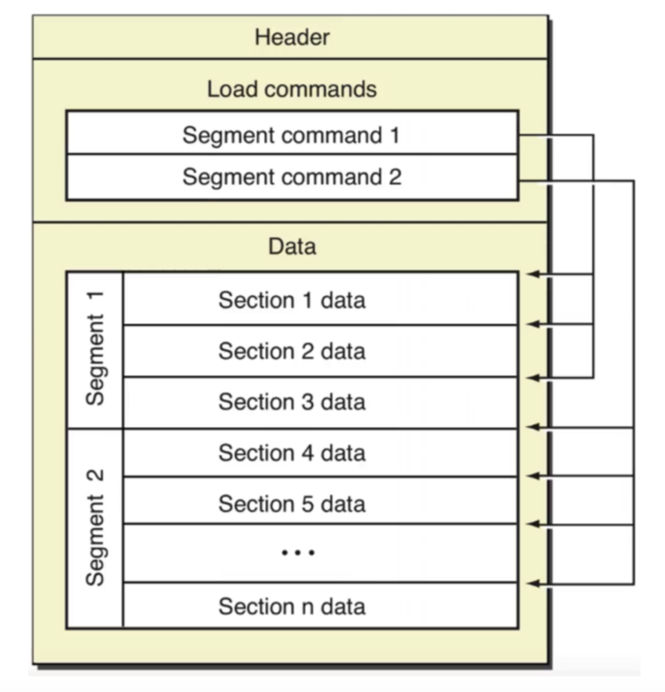

- mac下的汇编
	- 来源：
		- https://github.com/Evian-Zhang/Assembly-on-macOS
	- Mach-O文件结构
		- 在macOS上的可执行文件，都是Mach-O格式的文件
		- 关于Mach-O文件，详细可参考Apple官方文档[Mach-O Programming Topics](https://developer.apple.com/library/archive/documentation/DeveloperTools/Conceptual/MachOTopics/0-Introduction/introduction.html). 这里我们只是简单介绍一下。
			- {:height 489, :width 431}
		- Mach-O文件由头(Header)、装载指令(Load commands)和数据(Data)组成。
			- 我们可以通过[MachOView](https://github.com/fangshufeng/MachOView)软件进行查看。
		- 其中，最重要的组成部分就是Data.
			- 我们可以从图中看到，Data可以分为多个段(Segment), 每个段又可以分为多个节(Section).
			- 从逻辑角度来看，每个段内的节存储的数据都有类似的目的。
			- 如`__TEXT`段内存储的有汇编源代码、字符串等，`__DATA`段内存储非常量初始化变量等。
			- 从内存管理角度来看，每个段的大小被要求是页大小的倍数，也就是4096B的倍数。
			- 当程序加载时，就可以正好将一个段加载到一个页内。
	- 栈
		- 当程序运行时，系统会自动给这个进程分配一个栈。这里的栈的数据结构就是数据结构中所说的栈，也就是先进后出的线性表。在x86-64架构下，栈是向下生长的。也就是说，每向栈中`PUSH`一个数据，栈顶的指针就会向逻辑地址减小的方向移动。
	- ASLR
		- 从Mac OS X 10.5开始，Apple引入了地址空间配置随机加载(ASLR)机制。在每次程序执行的过程中，程序在内存中的开始地址，堆、栈、库的地址都会随机化，这样可以更好地保护不受攻击者攻击。
	- PIE
		- 在ASLR中我们可以看到，大部分变量在每次运行时的逻辑地址都不一样。那么，我们在汇编层面访问这些变量时，就不能直接访问一个固定的逻辑地址。
		- 因此，我们在汇编语言中有许多技巧可以生成位置无关代码(Position Independent Code, PIC).
			- 这些代码中没有一处会直接访问固定的逻辑地址。
			- 由位置无关代码编译生成的可执行文件称为位置无关可执行文件(Position Independent Executable, PIE).
			- 在我们在macOS上的汇编语言学习过程中，大多数编写的都是PIC.
	- 汇编器指令(Directive)
		- .section
			- mach-o可执行文件的Data部分拥有许多段(Segment), 每个段又有许多节(section). 同一个段的作用往往是类似的，同时在执行的时候一个段会被分配到一个页之中
			- 而.section最常用的格式，就是
				- .section    segname, sectname
			- 在macho中，纯代码被放在了__TEXT段的__text节中，因此，我们在文件的第二行写了
				- .section    __TEXT, __text
				- 代表之后的语句都是__TEXT段的__text节中。
		- .globl
			- 我们在由汇编语言翻译机器码的时候，得到的文件并不仅仅包含操作的指令，还需要包含一些名字和记号。比如说，C语言中，程序执行的起点是main函数。那么，这个函数的名字main就要包含在文件中，使得程序执行的时候知道执行哪个函数。
	- 指令
		- movq
			- 在汇编语言中，这种能直接翻译成机器码的指令被称作助记符(mnemonic).
			- 之前我们也提到过，在GAS语法下，一条指令是助记符+源+目的
				- 也就是说，它后面紧跟的是源操作数，然后是目的操作数。
			- 在x86-64架构下所有的可以被识别的助记符可以参考[64-ia-32-architectures-software-developer-instruction-set-reference-manual](https://www.intel.com/content/dam/www/public/us/en/documents/manuals/64-ia-32-architectures-software-developer-instruction-set-reference-manual-325383.pdf)
				- 但值得注意的是，这份官方的参考文档是用的Intel语法，我们只需要把源和目的颠倒过来看就行。
		- $0
			- 在GAS语法下，一个数字前加上`$`表示这个数本身。
			- 如果不加的话，则表示`0`这个地址里存储的数。
			- 此外，我们也可以在前面加`0x`来表示16进制数
		- %rax
			- 我们之前提到，在x86-64架构下，CPU中一共有16个64位通用寄存器
				- 它们的名字依次是rax, rbx, rcx, rdx, rdi, rsi, rbp, rsp, r8, r9, r10, r11, r12, r13, r14, r15.
				- 当我们用这些名字的时候，指的就是这16个64位通用寄存器。
				- 此外，对于前8个通用寄存器，也就是名字不是数字的寄存器，还可以用eax, ebx, ecx, edx, edi, esi, ebp, esp指代其低32位，用ax, bx, cx, dx, di, si, bp, sp指代其低16位。
				- 而对于rax, rbx, rcx, rdx这四个通用寄存器而言，还可以单独引用它低16位中的高8位和低8位，如对ax而言，ah指代其高8位，al指代其低8位。
			- 在GAS语法中，寄存器名字前面一定要跟着`%`.
		-
	- .equ定义字面量
		- 类似C语言中的\#define 定义的宏
-
	- 局部变量
		- 栈
			- 在操作系统基础中，我们谈到，在一个程序运行的时候，系统会自动给这个程序分配一个栈区。这个栈区和数据结构中所说的栈类似，也支持压栈和弹栈的操作。栈区在逻辑地址空间里是一块连续的空间，栈底是固定的，每次压栈，都会使栈顶向逻辑地址减小的方向移动。
			- rsp寄存器。从它的名字就可以看出来，stack pointer, 它存储的值永远是栈顶的地址，所以它又被叫做栈顶指针。
				- 我们可以用(%rsp)来获取栈顶存储的值，
				- 通过a(%rsp), 其中a是任何一个整数，来获取地址是rsp存储的值加a处的内存单元的值。
					- 比如说，2(%rsp)就是栈顶上方（逻辑地址增大方向）2个字节处的值，
					- -2(%rsp)就是栈顶下方（逻辑地址减小方向）2个字节处的值。
			- 在汇编语言中，压栈和弹栈的助记符分别是push和pop.
				- 这两个操作均有一个操作数。
				- push的操作是将栈顶指针向下移动（也就是将rsp内的值减小），并将移动后rsp对应位置内存区域的值赋为其操作数，而pop则相反。
				- 这里“向下移动”的距离是根据push后面跟着的字母决定的，如pushq就是把rsp内的值减8.
			- 此外，如果是想获得栈顶的值，而不弹栈，可以直接用mov来实现。
				- 如popq   %rax是将栈顶的8个字节内存储的值赋给rax, 并且栈顶指针向上移动8个字节。
				- 而movq   (%rsp), %rax则是只将栈顶的8个字节内存储的值赋给rax, 不涉及栈顶指针的移动。
				- 而如果只想弹栈却不想赋值，那么直接对rsp进行add即可。
					- 如想把栈顶的8个字节的数据弹栈，就直接addq $8, %rsp.
			- 同时，对于push而言，如果我们一下子准备把许多值压入栈内，那么可以先用sub指令减小rsp, 再用mov移动。比如说：
				- ```
				  # method 1
				  pushq	$0x114514
				  pushq	$0x1919
				  pushq	$0x810
				  
				  # method 2
				  subq	$24, %rsp
				  movq	$0x114514, 16(%rsp)
				  movq	$0x1919, 8(%rsp)
				  movq	$0x810, (%rsp)
				  ```
			- 方法一和方法二的最终效果是一样的。但是，我们建议使用方法二，也就是“先sub, 再mov”，因为这样更高效。
		- 使用局部变量
			- 使用局部变量非常简单，就是将局部变量放到栈上，然后使用的时候直接去访问栈上对应的地址空间就行。然后在返回之前，把栈恢复即可。
			- 但是，这里有一个常用的技巧。像上面的例子中写的，我们是通过对rsp中存储的地址加偏移量去访问局部变量，但是，如果我们之后又有了压栈、弹栈的操作，那么，偏移量就会改变。这种不稳定性十分不利于我们编程。
				- 因此，我们又用了另一个寄存器rbp来解决这个问题。
					- rbp, 顾名思义，base pointer, 基地址指针，一般是用来使用偏移量寻址的。
					- 我们使用的技巧是，先将rbp push进栈（之所以保留我会在后面的调用约定里说到），然后利用之前的手法对rsp sub.
					- 然后，利用rbp的偏移量来引用局部变量。
					- 最后在返回前，将rbp赋值给rsp, 此时栈顶指针指向的是最初对rbppush之后的位置，然后将栈顶pop出来给rbp，最后返回。
		- 寻址方式
			- ```
			  $偏移量(%基址，%指标，$倍数）
			  ```
				- 这个记号代表地址为 基址+指标*倍数+偏移量 处的内存单元中存储的值
					- 其中，以\$开头的都是数字（但注意我们真正写的时候不需要加上\$符号）
					- 以%开头的都是寄存器
					- 也就是说，在偏移量、倍数的位置上，不能写寄存器，在基址、指标的位置上，不能写数字。
					- 此外，倍数只能是1, 2, 4, 8中的一个
				- 这四个位置都可以省略，省略的位置将用0代替。
					- 比如说，偏移量(基址)就相当于基址+偏移量, 偏移量(, 指标, 倍数)就相当于 指标*倍数+偏移量.
				- 这样设计寻址方式是由其原因的。
					- 偏移量和基址存在的原因，就是为了解决像我们之前那样通过rsp或者rbp加上偏移量来访问栈上元素的问题。
					- 而指标存在的原因，一是在于，我们不仅可以通过寄存器+数字的方式寻址，也希望通过寄存器+寄存器的方式寻址，也就是(基址, 指标, 1)这样的方式实现寄存器+寄存器寻址
					- 此外，当我们在某些循环操作时，可以每次递减或递增指标，然后实现对一块连续内存的访问。而倍数存在的原因，则是由于存数的时候可能是占1个字节，也可能是2个，4个或8个字节。
			- 那么，有没有一种方式可以让我们获得这个复杂地址本身呢？答案是有的，使用lea.
				- lea是load effective address的简称，其拥有两个操作数。我们可以像这样使用：
					- leaq    -8(%rbp), %rax
		- 全局变量
			- 在汇编语言中，除了__TEXT段以外，还有__DATA段，用于存放数据。
			- 我们知道，当mach-o可执行文件被执行的时候，一个段对应整数个页，因此，__DATA是在逻辑地址空间中是单独的页，
				- 这里存放的数据和字面量不同，拥有自己的地址；
				- 和栈上分配的数据不同，可以被所有函数访问。
			- 在__DATA段中，
				- __data节存放所有非const的已经被初始化过的变量，
				- __bss节存放所有未被初始化的static的变量，
				- __common节存放所有未被初始化过的外部全局变量。
			- 类似于.text，
				- 我们可以用.data来代替.section   __DATA, __data,
				- 用.bss代替.section __DATA, __bss.
			- 小技巧——PC-relative寻址
				- 我们回忆一下之前在操作系统基础中提到的ASLR与PIE. macOS中程序的加载默认是使用ASLR的，也就是说，在程序执行的时候，所有数据的地址都会加上一个随机化的偏移量。
				- \_\_DATA段和__TEXT段之间的距离是没有变的。
					- 因此，无论是执行时还是汇编时，__DATA段的某个数据的地址与当前指令的地址之间的差值是不变的。我们可以利用这一点来实现PIC.
				- 汇编器也对此专门做了优化。
					- 当我们使用寻址方式标签(%rip)时，汇编器不会将其看作rip + 标签，而是会在汇编时就计算出标签距离此指令的下一条指令的地址的距离，然后用距离替换标签。
		- 标签
			- 我们通常使用的标签，定义时是以冒号:结尾的一个标识符，且开头不能是数字。
				- LBB0:, a:, _func:, _main:都是标签的定义
		- 跳转
			- 无条件跳转对应的助记符是jmp. 其操作数是标签。
			- jmp loop_begin就是跳转到loop_begin标记的位置。
			- 这里就有一个问题，这样的跳转，是不是position indenpendent的呢？答案是是的。
				- 但是和之前PC-relative的技巧不同，这里PIC的方法不是程序员做的，而是汇编器做的。
				- 汇编器会直接将jmp翻译成相对跳转的机器码，对程序员来说是透明的。
					- 所以，我们并不需要太过关心这里的PIC.
		- 条件跳转
			- 这是如何做到的呢？
			-