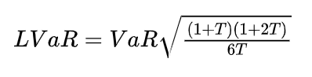

- https://mp.weixin.qq.com/s/AnvwBPo-HT4TYkabx8VtFQ
	- ## 流动性的定义
		- 流动性风险是金融风险中非常难控制的一环，至今其实都没有什么很好的办法。
			- 流动性风险的体现最直接的就是bid-ask spread(也就是中文常说的买(bid)卖(ask)价差)，
				- 例如您去银行看外汇报价，会有一个买入价一个卖出价，中间的差额就是bid-ask spread.
				- 同样股票也有类似的差额，买一和卖一之间的差价。
				- 通常交易所还可以提供五档或者Level2更深的行情。
		- ###  高频交易在玩什么?
		  collapsed:: true
			- 其实很多高频交易所面临大量的道德风险指控时，都会有一个口头禅：
				- **我们在危机时刻提供了流动性**
			- 讲到bid-ask spread我们就顺便衍生讲一下这个话题，假设现在一个资产的买卖报价如下：
				- 
			- 其中的价差很大对吧，也不利于成交吧，于是做市商通常会在这个时候去占据最优的买一和卖一，例如下图：
				- 
			- 这样子就缩小了Spread，也就是高频交易商常说的**提供流动性**，而Spread的减小也降低了交易流东西风险敞口，接下来我们就沿着这个话题展开，来讲一下交易流动性风险，也就是很多高频交易玩家需要处理的问题。
	- ## 交易流动性风险
		- 通常对于一些大型机构要进行一些大体量交易时，都会面临到这个风险 **Liquidity Trading Risk**（交易流动性风险）
			- 通常一个资产的交易指令下达后，需要以某个中间价成交，
				- 中间价的计算方法可以最简单买一、卖一求平均，当然也可根据成交量加权，例如TWAP、VWAP等等，
					- #### [[TWAP]]（Time Weighted Average Price）
						- TWAP是指在一定时间段内的加权平均价格，权重是时间。这种方法简单地计算出每个时间点的价格，然后求出这些价格的算术平均值。TWAP广泛应用于大订单的执行，以减少市场冲击。
					- #### [[VWAP]]（Volume Weighted Average Price）
						- VWAP是指在一定时间段内的成交量加权平均价格。这个计算考虑了每笔交易的价格和相应的成交量，是一个更精确的反映市场平均价格的指标。VWAP常用于评估交易的性能，比较个别交易的价格是否优于市场平均水平。
			- 除了价格以外，交易流动性风险还受另外两个因素影响，
				- 需要成交的量
				- 以及需要完成交易的时间。
		- 潜在的来看，还有一个问题就是交易标的物的**弹性(Resiliency)**，其实流动性和弹性是伴生在一起，后面我们讲到云计算流动性和弹性的时候还会详细来探讨这个话题。
			- 弹性衡量的是交易带来的冲击后返回原样的能力，例如下图:
				- 
			- 如果你需要交易的快，那么大的买单下下去，就会导致短暂的价格变动，如果量还不算太大， 可能会渐渐的恢复回来，这个恢复能力就是**价格弹性**的度量，而很多做期货的同学常说的**滑点**就是在描述这样的行为。
			- 因此有时候看到一个可以实现流动性套利机会的价格，
				- 也因为流动性的问题，只能完成一些小单子而不影响系统弹性，
					- 这也就是很多高频交易的算法容量问题。
			- 而且从交易来看，当行情从交易所更新发出后，所有的投资者都会关注到这样的机会，然后通过一系列算法进行套利，因此委托成功率很大程度上依赖于低延迟的网络和更快速的交易策略。
			- 在这一块，通常我们会认为由流动性带来的损失会将其计入为成本，所以很多期货算法上都有问交易成本的估计和滑点估计，而大型金融机构通常会根据标的物的Spread缺口和历史波动率来构建一个置信区间
				- {:height 65, :width 452}
			- 并构建相应的加权到VaR中，并成为Liquidity-Adjusted VaR，大概计算如下
				- {:height 68, :width 315}
			- 当然还有根据清仓时间定义的流动性在险价值,T为清仓时间
				- {:height 80, :width 309}
		- ## 融资流动性风险
			- 除了交易流动性风险以外，我们再来看融资流动性风险，通常一个金融机构的融资方式会很多:
				- 持有现金和国债
				- 在交易簿中很容易出售获取流动性的头寸
				- 同业拆借
				- 对于一些大的机构还可以利用高息揽储的方式
				- 资产证券化的方法获得融资
				- 直接从央行借
			- 然后巴塞尔协议III中针对08年次贷危机导致的流动性风险，还规定一些流动性指标，
				- 例如LCR
					- {:height 61, :width 328}
				- 或者NSFR(Net Stable Fuding Ratio)
					- {:height 59, :width 394}
			- 这这个计算的过程中，针对不同的资产流动性还会乘以一个系数，
				- 例如在资产负债表中， 负债表中针对ASF(Available Stable Funding),一级资本和二级资本乘数为100%，而其它一些例如长期定存都会打一些折扣。
				- 而针对需求端(Required stable fuding)中， 也需要考虑，资产表中的现金对流动性的需求自然系数为0，而黄金这些看似流动性很好的资产，RSF因子也只有50%，因为银行量大到一定程度要来找到接盘侠还是很困难的。
				- 而对于常见的居民住房抵押贷款，该因子也只有65%。
			-
			-