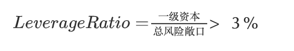

- https://mp.weixin.qq.com/s/AnvwBPo-HT4TYkabx8VtFQ
	- ## 流动性的定义
		- 流动性风险是金融风险中非常难控制的一环，至今其实都没有什么很好的办法。
			- 流动性风险的体现最直接的就是bid-ask spread(也就是中文常说的买(bid)卖(ask)价差)，
				- 例如您去银行看外汇报价，会有一个买入价一个卖出价，中间的差额就是bid-ask spread.
				- 同样股票也有类似的差额，买一和卖一之间的差价。
				- 通常交易所还可以提供五档或者Level2更深的行情。
		- ###  高频交易在玩什么?
		  collapsed:: true
			- 其实很多高频交易所面临大量的道德风险指控时，都会有一个口头禅：
				- **我们在危机时刻提供了流动性**
			- 讲到bid-ask spread我们就顺便衍生讲一下这个话题，假设现在一个资产的买卖报价如下：
				- 
			- 其中的价差很大对吧，也不利于成交吧，于是做市商通常会在这个时候去占据最优的买一和卖一，例如下图：
				- 
			- 这样子就缩小了Spread，也就是高频交易商常说的**提供流动性**，而Spread的减小也降低了交易流东西风险敞口，接下来我们就沿着这个话题展开，来讲一下交易流动性风险，也就是很多高频交易玩家需要处理的问题。
	- ## 交易流动性风险
		- 通常对于一些大型机构要进行一些大体量交易时，都会面临到这个风险 **Liquidity Trading Risk**（交易流动性风险）
			- 通常一个资产的交易指令下达后，需要以某个中间价成交，
				- 中间价的计算方法可以最简单买一、卖一求平均，当然也可根据成交量加权，例如TWAP、VWAP等等，
					- #### [[TWAP]]（Time Weighted Average Price）
						- TWAP是指在一定时间段内的加权平均价格，权重是时间。这种方法简单地计算出每个时间点的价格，然后求出这些价格的算术平均值。TWAP广泛应用于大订单的执行，以减少市场冲击。
					- #### [[VWAP]]（Volume Weighted Average Price）
						- VWAP是指在一定时间段内的成交量加权平均价格。这个计算考虑了每笔交易的价格和相应的成交量，是一个更精确的反映市场平均价格的指标。VWAP常用于评估交易的性能，比较个别交易的价格是否优于市场平均水平。
			- 除了价格以外，交易流动性风险还受另外两个因素影响，
				- 需要成交的量
				- 以及需要完成交易的时间。
		- 潜在的来看，还有一个问题就是交易标的物的**弹性(Resiliency)**，其实流动性和弹性是伴生在一起，后面我们讲到云计算流动性和弹性的时候还会详细来探讨这个话题。
			- 弹性衡量的是交易带来的冲击后返回原样的能力，例如下图:
				- 
			- 如果你需要交易的快，那么大的买单下下去，就会导致短暂的价格变动，如果量还不算太大， 可能会渐渐的恢复回来，这个恢复能力就是**价格弹性**的度量，而很多做期货的同学常说的**滑点**就是在描述这样的行为。
			- 因此有时候看到一个可以实现流动性套利机会的价格，
				- 也因为流动性的问题，只能完成一些小单子而不影响系统弹性，
					- 这也就是很多高频交易的算法容量问题。
			- 而且从交易来看，当行情从交易所更新发出后，所有的投资者都会关注到这样的机会，然后通过一系列算法进行套利，因此委托成功率很大程度上依赖于低延迟的网络和更快速的交易策略。
			- 在这一块，通常我们会认为由流动性带来的损失会将其计入为成本，所以很多期货算法上都有问交易成本的估计和滑点估计，而大型金融机构通常会根据标的物的Spread缺口和历史波动率来构建一个置信区间
				- {:height 65, :width 452}
			- 并构建相应的加权到VaR中，并成为Liquidity-Adjusted VaR，大概计算如下
				- {:height 68, :width 315}
			- 当然还有根据清仓时间定义的流动性在险价值,T为清仓时间
				- {:height 80, :width 309}
		- ## 融资流动性风险
			- 除了交易流动性风险以外，我们再来看融资流动性风险，通常一个金融机构的融资方式会很多:
				- 持有现金和国债
				- 在交易簿中很容易出售获取流动性的头寸
				- 同业拆借
				- 对于一些大的机构还可以利用高息揽储的方式
				- 资产证券化的方法获得融资
				- 直接从央行借
			- 然后巴塞尔协议III中针对08年次贷危机导致的流动性风险，还规定一些流动性指标，
				- 例如LCR
					- {:height 61, :width 328}
				- 或者NSFR(Net Stable Fuding Ratio)
					- {:height 59, :width 394}
			- 这个计算的过程中，针对不同的资产流动性还会乘以一个系数，
				- 例如在资产负债表中， 负债表中针对ASF(Available Stable Funding),一级资本和二级资本乘数为100%，而其它一些例如长期定存都会打一些折扣。
				- 而针对需求端(Required stable fuding)中， 也需要考虑，资产表中的现金对流动性的需求自然系数为0，而黄金这些看似流动性很好的资产，RSF因子也只有50%，因为银行量大到一定程度要来找到接盘侠还是很困难的。
				- 而对于常见的居民住房抵押贷款，该因子也只有65%。
			- 为了便于大家理解融资流动性，我们再来看一个话题，就是居民买房的时候，通常首套二套首付和相应的利率都是不同的， 再加上大城市的一些限购策略构成了一个流动性约束。
				- 在这个流动性约束过程中的“金融创新”就出现了， 当然这是一句黑话， 全称是：
					- “一切金融创新的出发点都是建立在绕监管和上杠杆的基础上的"，
				- 所以有某库某理这样的组织出现，然后利用信用卡额度做Roll over融资的，简而言之就是借短投长，以丧失流动性获得风险溢价，具体的手法就不多说了...假结婚假离婚获取流动性，商贷小微贷二押获取流动性等， 这些东西我接下来在“流动性管理”那一节再来详细说。
			- 接下来要说的一个话题就是流动性黑洞，其实很多炒房的人口头禅都有一句：“哪有卖不出去的资产，只有卖不出去的价格”，只可惜有种东西叫“不动产”变“不动惨”
		- ## 流动性黑洞
			- 针对银行业的流动性黑洞就是：**挤兑**。
			- 当然还有一些流动性黑洞和价格相关，
				- 例如当年的保时捷收购案和今年年初发生的Robinhood上的散户和做空基金的拉锯战等。
			- 因此任何时候都不要想到资产打个折就能卖出去，因为有一些掠夺性交易会使得你完全丧失流动性。
				- 例如某地产公司想低价卖房，然后等你卖了一栋，就开始限制你的预售证，或者通过限贷等手段等。
			- 因此获取流动性的一个最重要的方法就是再搞一个国家提倡的重资产行业来负债，显而易见的就是“造车”。
				- 这个是一个非常好讲故事又能获得大量融资流动性的产业，相对于以前地产商常玩的各种非标，这个来钱多快啊..
			- 在主体遇到流动性风险后， 流动性很快被抽干，一方面是债券价格快速下跌，而同时很多负债需要触发一些保证金条款， 然后为了满足保证金缴纳又只能卖资产然后进入一个螺旋下降的过程。
			- 另一方面是以前能够roll-over的借短资金突然也因为主体信用风险而断裂了，
				- 例如以前某库玩的多个信用卡之间roll，最后银行为了解决这样的信用风险很容易的做一些联邦学习的模型，大家一起等你这个月还完钱就给你降额了...
		- ## 流动性管理
			- 流动性管理上，大型金融机构通常会有一个大屏显示早期预警信号(EWI,Early Warning Indicator),例如债务的集中度风险、操作风险事件、核心资本充足率等，而大型金融机构流动性管理上也有很多流程。
				- 简而言之就是在流动性的提供方和流动性的消费端做好负载均衡和期限匹配。
			- 对于投资端，通常我们有丰富的投资工具可以选择， 针对金融机构而言，主要分为一些货币市场工具和一些资本市场工具，
				- 货币市场工具主要就是一些国债、大额存单、商业票据、承兑汇票、以及一些市政债券等，
				- 而资本市场工具就相对较多了， 例如某宝发行的ABS、正在出事的某企业债等。
				- 从流动性的角度来看， 这些资产的可变现能力是不同的。
			- 有可能大家认为这些不都针对金融机构么， 对自己关系没那么大。但是例如2020年出的疫情直接导致很多创业企业因为没有流动性管理意识而在业务意外中断两个月后就再也没有活过来，所以红杉等基金都会告诫投资者，你需要将公司的流动资金保持6个月的流动性，这些其实都是过来人的教训。
			- 流动性管理里最重要的基座就是资本充足率，这也是巴塞尔协议一开始就提到的第一支柱，
			- 巴塞尔协议III除了对充足率有要求以外，还对资产质量有了更高的要求，
				- 例如详细规定了一级核心资本充足率高于4.5%，
				- 加上其它一级资本充足率要求高于6%,
				- 包含一级二级资本的充足率高于8%，
				- 然后还可以适当的加了一些buffer，例如CCB(Capital Conservation Buffer)，
					- 即在一级核心资本上增加2.5%的buffer，要求一级核心资本充足率到4.5%+2.5%，
				- 同时监管机构在经济较好时还会增加一些反周期调节的buffer(CCyB,Counter cyclical Buffer)，
					- 这个是监管层动态调节的，系数在0~2.5%并要一级核心资本来覆盖，
				- 而针对一些系统性重要银行(G-SIBS, Global Systemically important banks)还需要再增加额外的1%~3.5%的资本金需求。
			- 然后在此基础上，对其资产的风险暴露也做了杠杆率的要求:
				- {:height 59, :width 374}
			- 地产商或者很多炒房的家庭并没有这样严格的杠杆率控制，特别是很多一般家庭可能就是靠国家首付和按揭审批来监管杠杆率，但是炒房团通过一些金融创新绕过了监管而已。这里给大家分享一些比较实用的流动性管理方法，自己理财也可以使用。
			- 通常我们对于流动性可以从供给端和消费端来进行区分，首先来看消费端。日常生活中我们可以根据金额和时间的不确定性分为四个象限
				- 
			- 那么针对不确定的事件， 从概率上我们可以估计出一个期望值出来，所以很多金融机构流动性管理上都有一个TSECF的指标，全称就是Term structure of expected cash flows，同时还会对它进行一个累积构成TSECCF。
				- 其实很多家庭里管钱的那位都会做类似的计算，特别是看到过一些日本的妹子每个月领完薪水就会按照开销来构建多个备用金账户，同样在国内针对金融机构也有法定准备金制度来抵御流动性风险。
			- 而资金的供给端我们按照如下方式进行区分：
				- 
			- 那么在流动性管理的过程中，一般家庭应该如何做呢？有一种极端情况就是交Liquidity-Shy，就是特别杞人忧天的担忧会出一些意外，然后留着大量的现金放活期。针对现在很多大型集团司库其实缺乏管理的，以前和一个某全球企业财务女神也聊到这个问题，其实全球的资金划拨和各国的税制及资本管制都可以很好的统筹一下。
			- 在这个过程中，我们手头**过剩**的流动性自然有了投资端的需求，通常的做法分为三种:
				- **期限转换**(Maturity Transformation) 最简单的解释就是借短投长，然后利用长期的收益率高于短期利率获得收益，例如很多炒房团用的信用卡Rollover就是这样，但是最终会面临Rollover-risk和Cliff-risk，即突发的资金链断裂
				- **流动性转换**(Liquidity Transformation) 把流动性好的资产换成流动性差的资产
				- **信用转换**(Credit Transformation) 例如将国债换成公司债，将持有的大盘蓝筹股换成小盘股，换取更高的波动率溢价， 而波动率溢价的来源也包含了流动性。
			- 但是最终你的这些投资需要反过来算一个期限结构，Term Structure of Liquidity Generation Capacity(TSLGC),而这些能力要保证你在TSECCF为负时，你有足够的能力去产生流动性。
			- 其实这些都是我们很多一般家庭理财上很不足的地方，房产上了太大的杠杆使得自己无法动弹，而社会保障有限、双方父母医保压力、小孩的读书压力，这一系列问题都产生流动性紧张，所以你会看到为什么最近几年医改、教育改革、房住不炒等根本原因就是需要慢慢的恢复普通家庭的可支配收入比率，可支配的定义其实本质上就是流动性了。
			- 当然针对企业而言，企业的司库部门还需要做好更多的应急流动性预案等...
		- ## 流动性治理
			- 从公司治理的角度来看，业务条线需要管，高级管理层也需要管，而且在金融机构的司库部门中还存在一种LTP的方法，即流动性转移定价的策略，而同时针对自己的负责情况和投资情况，还要考虑一下自己对利率变动的敞口有多大，自己对期限错配的敞口有多大，例如去年我也回答过LPR要不要转的问题。
			- 前几天阿里CTO说自己是帮CEO扫清障碍和风险的， 本质上有对也有错。现代企业ICT技术的应用的确给传统的CEO带来了很大的风险，例如信息安全的风险，信息系统业务系统建设的风险。但是真的全要CTO去做也是不现实的，毕竟CTO最大的缺陷是在Finance上，所以现代企业制度上还是需要一个CRO来从第三方的角度来评估CTO和CFO
		- ## 流动性的衍生：技术债务久期
			-
			-