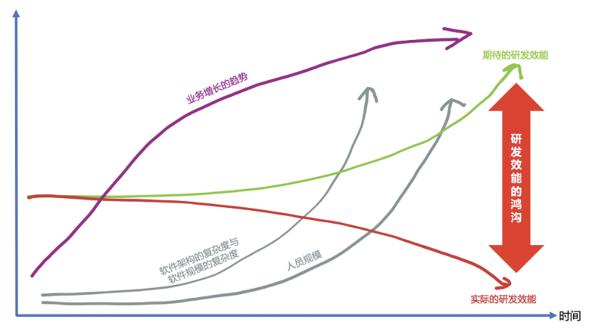
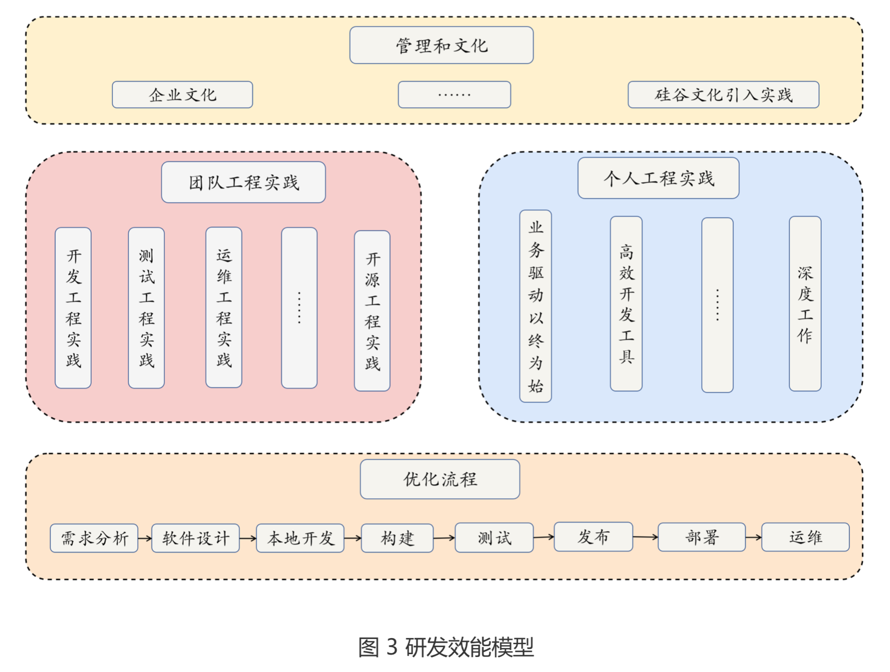

- **TAG:** [[软件工程]] [[Computer Science]]
- 一些相关文章
  collapsed:: true
	- 📋 如何用研发效能搞垮一个团队
		- 来源：https://mp.weixin.qq.com/s/09vIoG2sUGr_ioeaDGDcOQ
		- 作者：茹炳晟
		- **Highlight：**
			- 到底什么是 [[研发效能]]
				- “更高效、更高质量、更可靠、可持续地交付更优的业务价值”
				  collapsed:: true
					- 
					- 关键概念
						- 更高效：价值的流动过程必须高效顺畅，阻力越小越好。
						- 更高质量：如果质量不行，流动越快，死的也会越快。
						- 更可靠：安全性和合规性要保障好。
						- 可持续：输出不能时断时续，小步快跑才是正道，不要憋大招。
						- 更优的业务价值：这是从需求层面来说的，你的交付物是不是真正解决了用户的本质问题。
					- 在这个概念的引导下，我们引出持续开发，持续集成，持续测试，持续交付和持续运维的理念，它们是研发效能落地的必要实践。
					- 与此同时，我们还需要从流动速度，长期质量，客户价值以及数据驱动四个维度来对研发效能进行有效的[[度量]]
			- 为什么大厂都开始搞[[研发效能]]
				- 很多企业存在大量重复造轮子
					- 就像“[[中台]]“概念一样，现在很多大企业的产品线非常广，其中存在大量重复的轮子。
					  collapsed:: true
						- 如果我们关注业务上的重复轮子，那么就是业务中台；
						- 如果我们关注数据建设上的重复轮子，那么就是数据中台；
						- 如果我们关注研发效能建设上的重复轮子，那就是研效平台
					- 其实研效平台在某种程度上也可以称之为”研发效能中台“，
					  collapsed:: true
						- 其目标是实现企业级跨产品跨项目的研发能力复用，避免原来每条产品线都在做研发效能所必须的”0 到 1“，没人有精力去关注更有价值的”1 到 n“。
						- 现代化的研效平台会统一来打造组织级别通用研发能力的最佳实践平台。
				- toC 产品已经趋向饱和
				  collapsed:: true
					- 以前业务发展极快，那么用烧钱的方式（粗放式研发，人海战术）换取更快的市场占有率达到赢家通吃是最佳选择，那个时代关心的是软件产品输出，研发的效率都可以用钱填上。
					- 而现在 toC 已经逐渐走向红海，同时研发的规模也比以往任何时候都要大，是时候要勒紧裤腰带过日子了，当开源（开源节流中的开源）遇到瓶颈了，节流就应该发挥作用。
					- 这个节流就是研发效能的提升，同样的资源，同样的时间来获得更多的产出。
				- 部分企业存在“[[谷仓困局]]”
					- 从组织架构层面看，很多企业都存在“谷仓困局”（图 2），研发各个环节内部可能已经做了优化，但是跨环节的协作可能就会有大量的流转与沟通成本，从而影响全局效率。
					  collapsed:: true
						- 
					- 基于流程优化，打破各个环节看不见的墙，去除不必要的等待，提升价值流动速度正是研发效能在流程优化层面试图解决的一大类问题。
			- [[研发效能]]真的能够提高吗
				- 研发效能的绝对值随着以下因素的增长必然会变得越来越差
					- 软件架构本身的复杂度提升（微服务，服务网格等）
					- 软件规模的不断增长（集群规模，数据规模等）
					- 研发团队人员规模不断扩大引发沟通协作难度增长
				- 我们能做的不是提升研发效能的绝对值，而是尽可能减缓研发效能恶化的程度，使其下降的不至于太快，努力保持现状就是成功。
				  collapsed:: true
					- 
					-
			- 减缓[[研发效能]]恶化我们能干啥
				- 可以说研发效能的涉猎面是很广的，软件研发的每个阶段都有研发效能需要关注的问题，腾讯提出的“研发效能双流模型”可以说很好的诠释了这一概念。
					- 双流模型从软件研发的各个阶段提出了研发效能提升的各种工程实践，并且倡导需求价值流和研发工程流的自动联动。
					  collapsed:: true
						- 
						-
			- [[研发效能]]的“罗生门”
				- 国内研发效能的各种乱象
					- 迷信单点局部能力，忽略全局优化和拉通的重要性
					  collapsed:: true
						- 研发效能的单点能力其实都不缺，各个领域都有很多不错的垂直能力工具，但是把各个单点能力横向集成与拉通，能够从一站式全流程的维度设计和规划的研发效能成熟平台还是凤毛麟角。
					- 具有普适性的通用研发效能工具其实没有专属工具来的好用
					- 用“伪”工程实践和“面子工程”来滥竽充数
					  collapsed:: true
						- 国内的很多工程实践是为了做而做，为的是“政治上的正确”，而不是从本质上认可这一工程实践的实际价值。
					- 忽略研发效能工具体系的长尾效应
					  collapsed:: true
						- 很多时候管理团队希望能够打造一套一站式普遍适用的研发效能平台，希望公司内大部分业务都能顺利接入
						- 研效平台和工具往往具有非标准的长尾效应，我们很难打造一套统一的研效解决方案来应对所有的业务研发需求，各种业务研发流程的特殊性是不容忽视的。
						- 退一万步说，即使我们通过高度可配置化的流程引擎实现了统一研效解决方案，那么这样的系统会因为过于灵活，使用路径过多而易用性变得很差。
					- 盲目跟风
						- 很多时候研效工具应该被视为起点，而不是终点
					- 迷信外部专家
						- 适合自己的路子还是要靠自己走出来，拔苗助长只会损害长期利益
					- 研效[[度量]]的罪与罚
					  collapsed:: true
						- 科学管理时代我们奉行“没有[[度量]]就没有改进”，但是数字时代这一命题是否依然成立需要我们的反思
						- 现实事物复杂而多面，度量正是为描述和对比这些具象事实而采取的抽象和量化措施，从某种意义上来说，度量的结果一定是片面的，反映部分事实。
						- 当把度量变成一个指标游戏的时候，永远不要低估人们在追求指标方面“创造性”，总之我们不应该纯粹面向指标去开展工作，而应该看到指标背后更大的目标，或者是制定这些指标背后的真正动机。
						- 对于研发效能，我认为最重要的不是技术升级，而应该是思维升级，我们身处数字化的变革之中，需要转换的是自己的思维方式，我们需要将科学管理时代的思维彻底转为字节经济时代的思维。
			- [[研发效能]]的“冷思考”
				- 工具效率的提升并没有减少我们的工作时长
				  collapsed:: true
					- 新工具新平台在帮助我们提升效率的同时，也不断增加着我们学习的成本。
				- 技术的升级正在不断模糊工作和生活的边界
				  collapsed:: true
					- 随着在研发效能领域的不断投入，会有越来越多的研效工具诞生，所有这些工具都使人与工作之间的链接更加紧密，人越来越像工具，而工具越来越像人。
					- 我们之所以创造工具是想减轻我们自己的工作，但现实却很可能发展成，我们最终沦为被亲手创造的工具奴役。
			- 对于研发效能，实施的思路不对，方法不对会搞垮一个团队，我们需要的是体系化的方法论和相应的工程实践。
		- **Note:**
			-
	- 📋 研发效能度量引发的血案
		- 来源：https://mp.weixin.qq.com/s/h9zIg2e8iHn3qgxlUGObbQ
		- 作者：茹炳晟
		- **Highlight：**
			- [[度量]]失败的案例
				- 以“点击量”来度量自媒体运营的成果
					- 那么就有可能出现点击量显著提升，但是公众号的关注人数却下降的现象。
					- 原因就是使用“标题党”等手段诱骗读者打开链接，但是实际内容名不副实，几次之后读者就不会继续关注该公众号了。
				- 以“手术成功率”来考核医生
					- 医生就会刻意回避疑难杂症和重症病人，医生的“手术成功率”是提高了，但重症病人却得不到救治。
			- 时代变了，很多事物底层逻辑都变了
				- 面对变革，最重要的并不是方法和技术的升级，而应该是思维模式的升级。我们身处数字化的变革之中，需要将工业化时代科学管理的思维彻底转为字节经济时代的全新思维。
				- 但时代变了，很多事物底层逻辑都已经变了，工业化时代形成的科学管理理念在字节经济的今天是否还依然适用？值得深思。
			- [[研发效能]]到底要不要[[度量]]？
				- 现代管理学之父 Peter Drucker 说过，“没有度量就没有改进”，
					- 这一底层逻辑自始至终都没有变过，
					- 只是工业化时代的度量和字节经济时代的度量在理念和方法上会有很多不同的地方。
				- [[度量]]对于研发流程改进的意义非常明确。
					- 工业化时代的实体产品研发与生产，其中的风险是相对明显的，比较容易找到防范的方法，也分得清相关的责任。
					- 参与研发的人越多，人与人之间的沟通成本越高，产生随机偏差的概率也会越大，再加上软件研发过程本身的可视化程度很低，风险的可见性就容易被各个环节掩盖，但它最终会在看不见的地方积累起来。
					- 如果没有适当的度量体系去显性化这些风险，结果可想而知，更不用谈什么持续改进和治理了。
				- [[度量]]对于人的公平性诉求也是必须的。
					- “我虽然没有功劳，但是我也有苦劳。” 大部分人可能只关注自己的付出，但并不关心付出所获得的实际效果。
					- 作为管理者应该为“苦劳鼓掌，为功劳付钱”。
					- 而功劳和苦劳的体现也需要借助客观的度量数据来体现，否则团队中的成员会逐渐陷入碌碌无为的窘境。
			- [[研发效能]]到底能不能[[度量]]？
				- 一派是以现代管理学之父 Peter Drucker 的理论为依据，主张[[研发效能]]能够[[度量]]的；
				- 另一派是以世界级软件开发大师 Martin Fowler 为代表，主张[[研发效能]]不可[[度量]]的。
				- 在这个问题上，我的观点比较中庸，我认为能够度量，但是没有完美的度量。
				- 原因有以下几点：
					- [[度量]]本身的片面性无法避免
						- 现实事物复杂而多面，度量正是为描述和对比这些具象事实而采取的抽象和量化措施，从某种意义上来说，度量的结果一定是片面的，只能反映部分事实。
						- 管理者往往会把目标拆解为可度量的指标。
							- 但是，目标和指标常常并不是简单的全局与局部的关系。
							- 目标的拆解过程看起来很顺畅，是那么地理所当然，但是当把拆解完的指标合并起来的的时候，结果往往让人哭笑不得。
					- [[度量]]过程容易陷入局部思维
						- 指标是为了实现目标的，但是在实践过程中，指标很多时候却是与目标为敌的。
						- 管理者常常把目标拆解为指标，时间久了以后，他就只知道指标，而忘了背后更重要的目标。
					- [[度量]]数据的解读具有很强的误导性
						- 度量数据本身不会骗人，但数据的呈现和解读却有很大的空间可以利用。很多时候，同样的数据，通过不同的解读会引导出截然不同的结果，这点很容易被人为利用来达成各自的目的。
				- 我认为[[研发效能]]到底能不能[[度量]]是要基于场景的，脱离了场景去谈能不能度量没有太大意义。
			- [[研发效能]]到底如何[[度量]]？
				- 要倾听管理者的[[度量]]诉求，但是不要照着做
					- 从本质上去理解管理者想要看这些数据背后真正的动机，管理者通过这些数据到底是想解决什么样的问题。
					- 要理解管理者的深层次需求，这才是问题的本质。
				- [[度量]]应该是有层级结构的
					- 高层管理者、中层管理者和一线工程师关心的度量维度肯定是不一样的。
					- 不要试图去提供一个看似大而全的度量体系，当你的度量体系能服务于所有人的时候，恰恰意味着它什么都不能。
					- 比较理想的做法可以参考 [[OKR]] 的实践。
						- 先由高层管理者制定度量体系的总目标，然后中层管理者分解成可执行可量化的指标，最后再由一线工程师分解成工程维度的的指标。
						- 各个层级只关心当前层级的指标以及上一层级的目标，不应该出现高层过多、过细地关注下层指标。
				- [[度量]]的设计目标是要能够引导出正确的行为
					- 度量从来不是目的，而应该是实现目的的手段。
					- 度量是为目的服务的，所以好的度量设计一定对目的有正向牵引的作用，如果度量对目标的负向牵引大于正向牵引的话，这样的度量本质上就是失败的。
					- 一个好的度量，一定要为解决本质问题服务，并且要能够引导出正确的行为。
				- 切记不要基于“比较思维”而采用“追星式”的度量
					- 我们看到一个人获得了成功，就会立刻认为他过去所有的行为都是那么地有道理。
					- 我们看到一公司获得了成功，就会觉得他们采取的策略和工程实践是多么有效。
					- 这正是“比较思维”的可怕之处。实际上，没有哪家企业是通过盯住竞争对手而获得成功的。
				- 度量不要广撒网，而应该精准捕捞
					- 不要在没有任何明确改进目标的前提下开展大规模的度量，因为度量是有成本的，而且这个成本还不低。
						- 很多大型组织往往会花大成本去建立研发效能度量数据中台，指望通过研效大数据的分析来获取改进点。
						- 这种“广撒网”的策略虽然看似有效，实则收效甚微。
						- 事实证明，度量数据中台的建设成本往往会大幅度高于实际取得的效果。
					- 比较理想的做法应该是通过对研发过程的深度洞察，发现有待改定的点，然后寻找能够证实自己观点的度量集合并采取相应的措施，最后再通过度量数据来证实措施的实际价值，这种“精准捕捞”的策略往往更具实用价值。
				- 研发效能的[[度量]]指标如何选取？
					- 看看什么是错误的
						- “千行代码缺陷率”引发的血案
						- 敏捷模式下工作量估算的是是非非
				-
				-
				-
-
- 研发效率破局之道（Facebook的研发效能实践）
	- 为什么要关注研发效能
		- 是否也曾为下面这些问题感到困扰呢
		  collapsed:: true
			- 研发团队看起来人也不少，大家也很辛苦，加班也不少了，但是产品发布还是常常延 期，上线后产品问题频发。
			- 用户需求从需求分析、产品设计、开发、测试最终流到部署，但最终发布的产品与用户 需求偏差却很大。
			- 产品发布上线时出现大量提交、合并，导致最后时刻出现很多问题，团队成员集体熬夜 加班，却将大把的时间花在了等待环境、等待验证上。
			- 开发提测质量不好，大量压力聚集到测试这一步，导致代码返工率很高。引入单元测 试、代码审查，效果却都不明显。
			- 开发人员疲于应付业务，没有精力或者兴趣去精进技术，对 Git、命令行等强大工具的 使用仅限于皮毛，士气低迷、工作效率低下。
		- [[研发效能]]的完整定义应该是:
			- 团队能够持续地为用户产生有效价值的效率
			- 包括有效性(Effectiveness)、效率(Efficiency)和可持续性(Sustainability)三个方面。简单来说，就是能否长期、高效地开发出有价值的产品。
		- 经常会遇到下面这样的案例
		  collapsed:: true
			- 想通过指标度量的方式来衡量团队的效能，要求每个团队达到一定的测试覆盖率。研发 团队在产品完成后进行突击，来编写单元测试，最终达到了要求，但产品质量却没有提 高。
			- 引入业界先进工程实践，学习 Google 使用大仓，但因为基础设施不成熟，对大量二进 制文件支持很差，结果是算法团队因为有很多的二进制模型文件，每次 Git Clone 都需 要半小时，怨声载道。
			- 希望建设工程师文化来提高产出和活跃气氛，跟公司老大以及 HR 商量好几条价值观在 公司宣传推广，还组织了几次团建活动，但是收效甚微。大家真正工作起来还是老样 子。
		- 这些问题的根源都在于
			- 软件开发的灵活性决定了研发效能提升的困难性:
				- 可以关注的点太多，可以使用的方法也很多，但如果只是简单照搬业界研发实践的话，效果往往不好，有时甚至会造成负面效果。
		- 研发效能的提高，需要整个公司在研发流程、工程方法、个人效能和文化管理等方面进行精心设计。
	- 研发效能综述
		- 效能模型:如何系统地理解研发效能
		  collapsed:: true
			- 为什么要关注研发效能
				- 如果研发效能提不上去，单靠加人、加班根本不可能解决问题。
				- 注重研发效能的另一个巨大好处，是开发者能够聚焦产出价值，更容易精进自己的技术。
					- 于是，团队容易建立起好的氛围，进而又能促进生产效率的提高，形成良性循环，支撑持续的高效开发。
			- 只有深入研发活动的本质，才能提高效能
				- 提高研发效能，需要深入了解研发活动的本质，从纷乱的表象和层出不穷的方法中，看到隐藏的模型，找到根本原则，然后从这些原则出发，具体问题具体分析，找到合适的方法。
				- 在 Facebook 的时候，我们做事时都遵循一些基本原则。比如，有一个原则是“不要阻塞 开发人员”
					- 第一个应用场景是，本地构建脚本的运行速度要足够快。
					  collapsed:: true
						- 开发人员在自己的开发机器上写完 代码之后，都要运行这个脚本进行构建，把新做的改动在自己的开发机器沙盒环境上运行起 来，以方便做一些基本检查。
						- 这个操作非常频繁，所以如果它的运行时间太长，就会阻塞开发。因此，确保这个脚本的快 速运行就是内部工具团队的一个超高优先级的任务。我们对每次脚本的运行进行埋点跟踪， 当运行时长超过 1.5 分钟后，我们就会停下手中的工作，想尽一切办法给这个本地构建加 速。
					- 第二个应用场景是，商用软件的采购。
					  collapsed:: true
						- 对一定数额下的软件购买，开发人员可以自行决定， 先斩后奏。而且那个数额还蛮高的，覆盖一般的软件完全没问题。
					- 开发流程的顺畅是生产优质软件的关键因素，只有这样才能最大程度地释放开发者的创造性和积极性。
			- 研发效能的模型是什么?
				- 软件开发本质上就是一条超级灵活的流水线。
					- 
					- 另外，这条流水线的每个环节都还可以细分。比如，本地开发环节可以细分为下面几个部分:
						- 
				- 我们可以参考传统制造行业的经验来提高效能。
				- 但，和传统制造业相比， 软件开发又具有超强的灵活性，体现在以下四个方面。
					- 最终产品目标的灵活性。
					  collapsed:: true
						- 传统流水线的目标确定，而互联网产品的最终形态通常是在不 断地迭代中逐步明确，相当于是一个移动的标靶。 尤其是最近几年，这一灵活性愈发明显。
							- 比如，在精益开发实践中，常常使用 MVP(最小可行性产品，Minimal Viable Product)来不断验证产品假设，经过不断调整最终形成产品。
					- 节点之间关系的灵活性，比如流水线上的多个节点可以互相融合。
					  collapsed:: true
						- DevOps 就是在模糊节点之间的边界，甚至有一些实践会直接去掉某些环节，或者融入到其他环节当中。
					- 每个节点的灵活性。
					  collapsed:: true
						- 每一个生产环节都会不断涌现出新的生产方式 / 方法。比如测试，最近十多年就产生了测试驱动开发、Dogfood(狗粮测试)、测试前移等方法;最近又出现的测试右移，开始强调在生产环境中进行测试。
					- 每个节点上的开发人员的灵活性。
					  collapsed:: true
						- 跟传统制造业不同，流水线上的每一个工作人员，也就是开发者，都有很强的灵活性，主要表现在对一个相同的功能，可以选择很多不同的 方式、不同的工具来实现。
				- 基于这些特点，我们可以从以下四个方面去提高研发效能
					- 
			-
		- 效能度量:效果不好甚至有副作用，怎么回事?
		  collapsed:: true
			- 在和技术管理者，尤其是高层管理者聊起研发效能的时候，常常提起效能的度量这个话题。
				- 管理学大师彼得 · 德鲁克(Peter Drucker)曾经说过，“一个事务，你如果无法度量它， 就无法管理它”(If you can’t measure it, you can’t manage it)。
				- 要想提高研发效能，自然要首先解决效能的度量的问题。
			- 研发效能度量的定义和作用
				- 研发效能的度量，从应用程序开发的生命周期中获取数据，并使用这些数据来衡 量软件开发人员的工作效率。
				- 我们希望通过这样的度量，能够根据客观的数据而不是个人的 主观意见去决策，从而实现以下几点:
					- 跟踪团队的表现、提高团队的绩效。
					- 提高项目计划的精确度。
					- 了解流程是否高效，寻找需要改进的关键领域。
			- 效能度量被大量误用，问题究竟出在哪儿?
				- 研发效能难以度量的最根本原因在于，软件开发工作是一项创造性很强的知识性工作，非常 复杂且伴随有大量不确定因素。
					- 面对这样的一个复杂系统，我们不可能覆盖其全部参数。而如果这时，研发人员的利益和这个度量结果相关，那么他就很可能会通过“做数字”来欺骗度量系统。
					- 关于这个主题，美国著名学者罗伯特·奥斯汀(Robert Austin)写过一本书，叫作《衡量和 管理组织绩效》(Measuring and Managing Performance in Organizations) 。他在这本 书中给出的结论是，如果你不能度量一个事物的所有方面，那就不要去度量它。否则，你将 得到“做数字”的欺骗行为。
				- 研发效能难以度量的第二个原因，和上面提到的根本原因相关，但有其特殊性
					- 很多公司有 竖井(silo)存在，所以常常会把注意力放到某一两个竖井上，进行局部优化。但是，局部 优化并不代表全局优化，甚至会让全局恶化。
						- 上面那个中型公司推行质量方面指标的案例，就是在进行局部优化，不但没能提高产品质量，反而导致员工积极性受损，同时影响了团队之间的关系。
				- 研发效能难以度量的第三个原因在于，度量指标一般用来度量软件产品的生产过程和产品质 量，但是公司真正需要关注的是产品能否解决用户问题，也就是说能否产生用户价值。技术产品输出和用户价值输出之间的沟壑难以打通。
					- 上面案例中那家创业公司聚焦度量开发测试指标，就是犯了这样的错误。产品质量再好，没有用户价值也是白费工夫。
				- 研发效能难以度量还有一些其他原因
					- 度量数据的收集难易程度不同
						- 人们倾向拿容易收集的数据去关联效率，但事实上难以收集的数据对度量可能才真正有用。比如说代码行数容易衡量，但是用处很小。相比之下，产品用户价值的度量要困难得多，但用处却大得多。
					- 软件开发和实践有一个滞后效应。
						- 比如，在团队中引入代码审查，在刚开始实行的时候，总体效率会出现短时间的下降，一两个月后才会逐步显现正面效果。那么，你现在要怎么度量它才好呢?
				-
		-