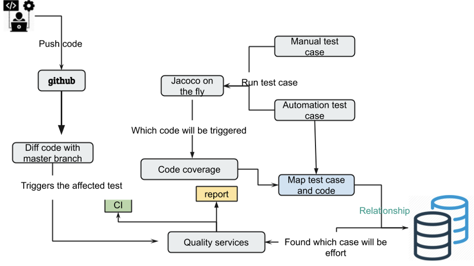
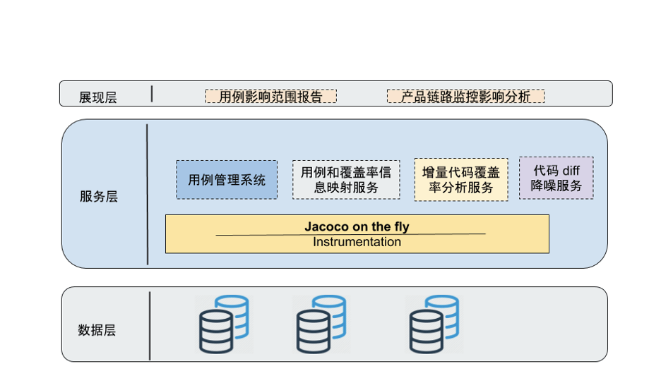
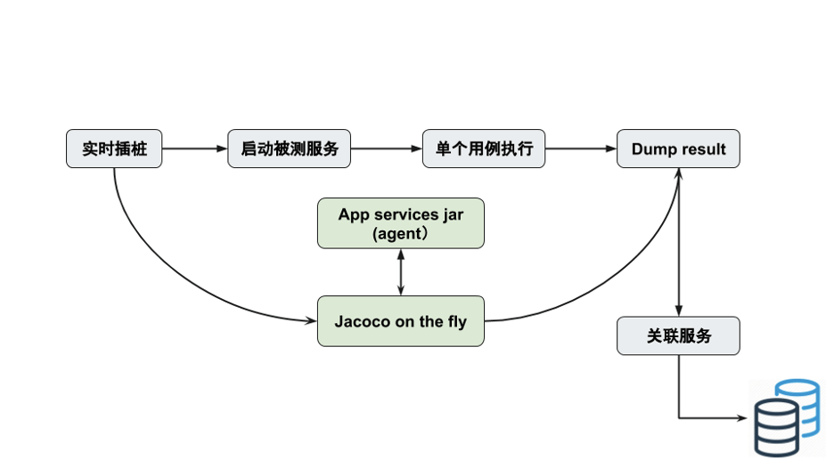
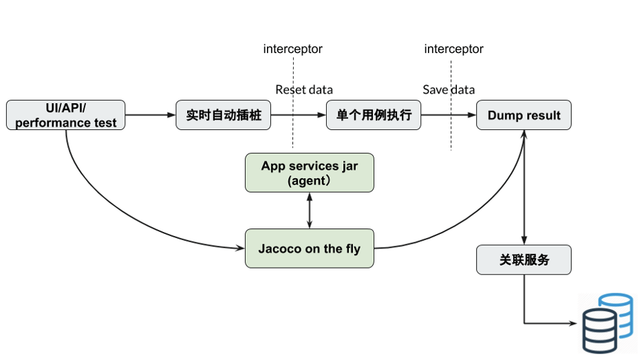
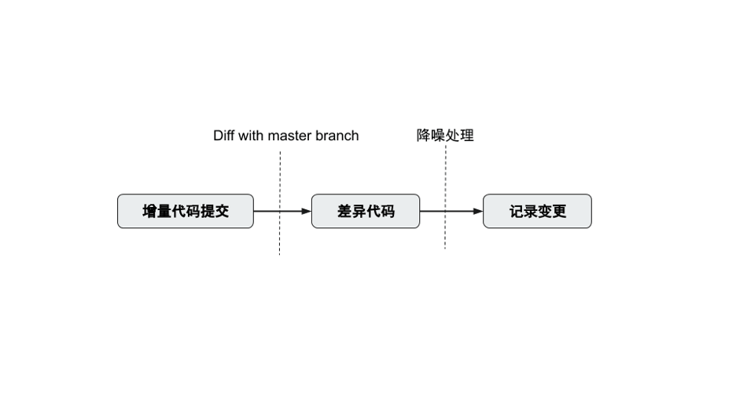

- 文章整理
	- 精准测试技术十年发展漫谈
		- 来源：https://mp.weixin.qq.com/s/UUrOD5qi1r2TBTdYXhXsog
		- 公司：星云
		- 内容
		  collapsed:: true
			- 精准测试的定义
				- 精准测试一句话概括就是：测试用例和代码之间的追溯，这是它最本质的东西。
				- 精准测试建立起了用例和代码的关系，相当于把黑盒和白盒关联起来，做黑盒测试时获取到白盒数据。
				- 另外一个层面，精准测试最本质就是线程覆盖测试。它跟白盒最大的区别是覆盖率是线程级的，也就是说我们要追溯到用例这个级别。
			- 精准测试技术发展
				- 建立一些基础理念，主要建立用例和代码相互追溯的基本技术方向和框架。
				- 用例和代码追溯、软件示波器、回归用例自动选取基本已经成型
				- SABI SASI
				- 覆盖率 MC/DC
				- 各种领域的数据采集（Java、C++、linux kernel、DSP芯片、安卓的Framework操作系统）
			- 精准测试的一分一合
				- “一分”指的是：精准测试不仅仅去统计（大范围的整体）代码覆盖率，而是要精确到用例级。
					- 比如回归用例选取、测试用例聚类分析、智能缺陷定位、开发测试的协同，所有的数据都可关联到用例级，精准测试的作用和范围就变得很大。
					- 用例级就能有高精准度的测试分析，传统的白盒并没有这种测试分析。
				- “一合”指的是：我们这个覆盖率已经不再是单元级的。
					- 以前白盒测只能用在单元，现在我们精准测试可以把它用到系统级，也就是功能测试阶段。星云可以在系统全速运转、数据量非常大的时候实时采集数据，并确保对原有系统不要进行干扰。
					- 实际应用中，还是可以继续延用黑盒测试的操作方法，动态执行用例后，可以得到大大超于白盒单元测试的多种测试数据及其分析结果，用起来十分方便。
				- 灰盒测试
					- 但它并不是让我们的测试工程师马上就懂代码开发、懂脚本开发、懂单元测试，它是非常自然的去把用例跟代码进行追溯分析，因为星云有一套静态逻辑分析，可以把测试使用难度大大降低
				- 精准测试可以给黑盒充分赋能
					- 精准测试是针对IT系统非常好的数字化、可量化、可评估、可考核、可度量、很精确的一种技术方法。
			- 精准测试体系
				- 运行架构图
					- 
				- 流程
					- 它首先会对源码进行一个编译和分析，把代码结构静态分析好后，将静态信息上传到后台对应项目版本中进行存储。
					- 再根据块的位置和类型信息进行插装，装点只有编号信息。
					- 代码插装好以后，放到被测系统里面直接动态去跑，测试人员用软件示波器点用例开始结束，就会自动把每个用例和代码的正向和反向追溯关系建立起来了。
				- 正反向追溯有两个主体功能，
					- 一个是能够让测试整体量化，使之看到所有的测试过程。
						- 测试工程师没有跑用例，就没有关联关系的数据；如果乱跑，我们分析一看功能完全不对，跑的功能和设计功能不应该聚类到一块但却聚类到一块，就认为是瞎跑的，跑的不对。什么都可以看得非常细致。
					- 另外，星云提供测试智能分析的一些算法
						- 如测试用例最小级、回归用例选取、测试用例的聚类分析、智能缺陷定位等
							- 例如回归用例选取这技术，它底层数据提取特别难，需要花费大量的时间去研究如何去真正落地实现。
								- 比如我们碰到的一些场景：给安卓的Framework代码插桩，然后拍张照片，照片渲染出来以后，整个安卓的驱动层代码到底怎么走？一瞬间就要驱动计算并且展示出来整体逻辑的运行情况，这个复杂度相当高。实现了这种技术，就可以用精准测试帮助手机厂商去节省CTS测试的时间。
				- 本质上，我们做测试就不应该忽视计算机的软件代码和功能间本质上的强关联性。
			- 商用精准测试的无损技术
				- 开源工具的困难点根源在于：它的分析和插桩全部在字节码上，但实际覆盖率的观测点却在源码上。 这就产生了一个严重的信息脱节，因为字节码是有损耗的。
					- 开源工具它能够看到你的条件覆盖百分比，但它根本不知道每个条件真和假，由于在字节码阶段，它的条件和真正的源码上的条件已经发生了变化，已经没人能搞得清上面和下边对应关系了。
				- 星云精准测试的SABI（字节码插装）和SASI（源码插装），可以实现真正的无损测试技术。
					- SABI，SouceCode Analyzer ByteCode Intrumentation，即源码分析字节码插装。就是说在源码上直接分析，观测点也还是在源码上。这个就能够完整实现无损的插桩，覆盖率100%精确规范。
						- SABI是依赖非常全面的源码静态分析后，经过校正后的数据往字节码插，而不是直接在字节码分析，往字节码插。SABI字节码技术可以满足国际规范的CDC的覆盖要求。
					- SASI（源码插装），是传统白盒最基础的技术，直接在源码插装，主要应用在对于覆盖率标准要求更高的领域。
						- 源码插装以后，经过高级语言、高级编译器的编译，直接生成最后发布包。这种是完全无损的，可以随时反查插装点，不会引起语法错误、功能错误等，可靠性更高。
			- 商用精准和开源精准的区别
				- 商用系统级精准测试有前置精准的静态分析过程。
				- 。。。
	- 【星云测试】精准测试白皮书2020版
		- 来源：https://mp.weixin.qq.com/s/ew5MXm4i3ASEhWMJvGUTDg
		- 公司：星云
		- 内容
		  collapsed:: true
			- 精准测试的基础架构介绍
				- 精准测试的技术架构
					- 流程：
						- 第一层：利用先进的前置编译器，为客户做源码静态结构分析（在客户的实际环境中，根据客户的需求进行相关的技术配合）；
						- 第二层：将处理好的系统程序放入测试环境运行，测试工程师通过人工或程序自动化的形式，开始执行用例（人工执行用例可以和测试管理平台或者Excel表格方式进行对接)，精准测试的 “软件示波器”采集运行数据并进行高速智能运算，获取精确的测试数据；
						- 第三层：根据采集的代码与对应的测试用例，在星云精准测试平台中实现用例与源码的互相追溯；
						- 第四层：通过精准测试的分析平台，可以对测试数据进行缺陷定位、用例聚类分析、回归测试用例和最小测试用例集等功能的计算，用户还可以根据需求，批量生成相应的测试报告，或进行测试数据高级分析。
					- 精准测试的双向追溯
						- 双向追溯技术正向追溯
							- 将测试用例和代码执行信息自动关联，可追溯到函数级别及代码块级别；
							- 通过正向追溯可直接把BUG定位到故障和缺陷逻辑相应的代码，并提供最后运行的时序数据；
							- 通过正向追溯自动记录产生功能对应的详细设计实现，辅助软件解耦和架构分析。
						- 双向追溯技术反向追溯
							- 将代码执行、函数、代码块级别和测试用例执行信息自动关联；
							- 通过反向追溯可直接观察代码变动所影响的测试范围；
							- 协助开发，进行代码修改后影响功能的范围评估；
							- 协助测试人员对代码修改部分所影响的测试用例进行评估。
						- 数据追溯技术-追溯测试用例的全景调用
							- 精准测试通过正向追溯把测试用例运行的代码执行进行了全景绘制，在全景图中，测试人员可以有效的观察到函数之间的整体的调用与走向，观察出被测模块与上层之间的调用关系。
				- 精准测试的核心组件与功能
					- 风险控制
						- 七种测试覆盖率
							- SC0语句块覆盖率、True覆盖率、Both覆盖率、CDC覆盖率、Branch覆盖率、MC/DC覆盖率。
						- 新增代码覆盖率
							- 敏捷模式下，因迭代频繁其存量的代码量很大，通常更关注增量覆盖度量。
							- 精准测试可以在程序新版本发布后，自动计算新增（变更）代码的范围，给出新增代码的覆盖率。覆盖率的分母中的函数都是变更和新增的函数。
							- 与此同时，基于**反向追溯**的功能，我们还可以给出新增代码对应的测试用例名称。当某个新增函数没有达到很高覆盖率的时候，我们通过反向追溯的用例，可以判定因为哪些功能范围的用例设计不充分，导致了新增代码覆盖率不高。
						- 测试覆盖率范围筛选与再统计
							- 在做精准测试或统计覆盖率时，往往测试管理者、开发人员、测试人员为了保证测试覆盖率的正确性，会对某个方法、类进行查看或在统计中把代码中一些废弃的函数、某些特殊情况下无法测试到的代码进行移除（至少是做相应备注），从而让测试代码覆盖统计率达到更加准确。
							- 星云精准测试在设计中，通过多种搜索、方法、类、模块过滤等功能，把需要统计的范围进行缩小、不需要统计的去除。根据用户的选择，进行覆盖率再统计展示。
					- 工作协同
						- 缺陷最后执行时序分析
						- 智能缺陷定位
					- 精准测试对敏捷迭代的支持
						- 敏捷迭代下多版本白盒测试数据的聚合
							- 在敏捷环境下由于版本迭代速度很快，每个不用的代码版本上通常只能采集到少量的覆盖率。一旦发布新版本，就意味着代码发生了变化，覆盖率数据就需要重新采集，但是每个版本采集的少量覆盖率，从分析层面上并没有多大的意义。
							- 针对以上问题，精准测试给出了“累计覆盖率”的计算方法。它将一系列迭代版本的覆盖率，在最新的程序版本上进行投影累加。
						- 聚类分析
						- 最小测试用例集
							- 精准测试也可以对用例集进行优化。比如用户有大量用例的情况下，尤其是自动化用例集含有长期维护的冗余用例。精准测试平台可以对很多重复用例的逻辑进行筛选和过滤，优化出满足当前总体覆盖的最小用例集。
				- 精准测试企业级方案
					- 星云测试插桩编译流程与CI集成
				- 知识库累积
					- 精准测试数据的价值
						- 星云测试采集的测试数据和插装后分析到的静态结构信息，将作为大型企业系统大数据分析的基础数据。
					- 精准测试智能回归测试用例智能选取
						- 精准测试在记录了所有用例对应的代码逻辑的基础上，在新版本发布的时候通过分析用例执行的代码路径的变更范围，就可以自动计算出来回归用例的范围。
						- 它的算法逻辑和人的分析非常相似，但可以进一步提供非常高效率、海量数据的稳定分析输出，相当于把人的脑力算力转换成了计算机算力。
			-
	- 精准测试二三谈
		- 来源：https://mp.weixin.qq.com/s/WLqDVQdI1bSv8VnYCx6eIg
		- 公司：Thoughtworks
		- 内容
			- 最近我发现几个客户在质量问题，存在一些共性，这些基于黑盒测试的项目在测试过程中存在以下几个共同的问题：
				- 大量的黑盒测试用例
					- 有的项目甚至用例数超过5w，测试工作大都是手工为主，受主观人为因素影响太大
					- 每次版本发布，QA全凭个人经验来确定改动对系统影响范围，通常情况，要么测试范围定小了，造成漏测，要么测试范围过大，付出的代价过高，造成项目不能如期按时交付。
				- 代码与测试没有数据可衡量
					- 没有单元测试，其他类型测试对代码覆盖程度，质量高低，没有数据能够衡量，
						- 例如我们说api测试覆盖率是100%，这个数据大多都是根据用例业务场景估算出的。
					- QA只能增加更多的黑盒测试，而实际功能测试覆盖率随着时间和用例增多，便会触达覆盖率的天花板，更多的是重复的无效测试。
				- 自动化测试无法发挥作用
					- 对于web/api或app 后端服务系统，测试人员对除手工测试外，我们将大量的时间与精力投放在api接口测试的实现上，随着项目的迭代，自动化用例积累越来越多
						- 整个测试ROI并不是随着用例数增多而上升，反而维护和排查问题成为QA日常工作的重担，疲于应付，没有精力将时间投入到更有用的探索性测试和分析工作中，进而造成bug频出，整个团队便对自动化失去信任，直至废弃，这也是很多传统行业无法规模化实施敏捷测试原因之一。
			- 先来谈谈什么是精准测试
				- 定义：利用技术手段对测试过程产生的数据进行采集存储，计算，汇总，可视化最终帮助团队提升软件测试的效率、并对项目整体质量进行改进和优化的这一系列操作。
				- 通俗点讲：核心基于源代码变更分析，结合分析算法，确定影响范围，提升测试效率。
				- 精准测试并没有改变传统的软件测试方法论，只不过是帮助我们将测试用例与程序代码之间的逻辑映射关系建立起来，
					- 而这个过程则是通过算法和工具去采集测试过程执行的代码逻辑及测试数据，在测试过程加入采集过程，形成正向和逆向的追溯。
						- 正向追溯，开发人员可以看到QA执行用例的代码细节，例如用例执行过程中，调用具体方法与实现类，方便进行缺陷的修复与定位。
						- 逆向追溯，测试人员通过release前的增量代码快速确定测试用例的范围，极大减少回归测试的盲目性和工作量，提升ROI，达到测试覆盖率最大化。
			- 精准测试原理
				- 运行架构图
					- 
					- 
				-
				- 这套精准测试架构既可以用作手工测试，也可用在任意自动化测试上。
				- 整个架构分为以下几部分：
					- 建立用例与代码覆盖率之间的映射关系
						- 目前建立用例与代码之间的关系通过统计调用产生的覆盖率与路径进行关联。
						  collapsed:: true
							- 对功能测试用例，
								- 我们可以通过执行单个用例，经过上述步骤后拿到该条用例影响代码的覆盖率与执行路径。在通过关联服务，将具体用例的ID与生成的覆盖率信息（类，方法，行等）建立映射关系，最后将关联数据存到数据库中保存。
								- 
							- 自动化测试关联方案
								- 
					- 影响面评估，分析识别增量与变更代码
						- 我们有了代码与用例直接的关系的映射，我们需要将之用在开发流程中，首先我们需要得知我们的改动是什么，
							- 最直接的是通过 git diff 得知具体改动代码，但过于繁重，且太多干扰例如注释，空行等，最好的方法是实现比对算法，经过降噪处理，消除干扰，进而拿到处理后变更数据。
							- 
							-
					- 测试范围评估，用例筛选，链路分析
						- 我们有了用例与代码之间的关系映射，有了提交增量代码差异记录，就可以实现逆向回溯。
						- 利用代码的差异，通过查询服务就可以在上面提到关联关系数据库中反推影响的用例，以及上层的业务。这样可以帮助QA快速划分测试范围，减少过度测试。
				-