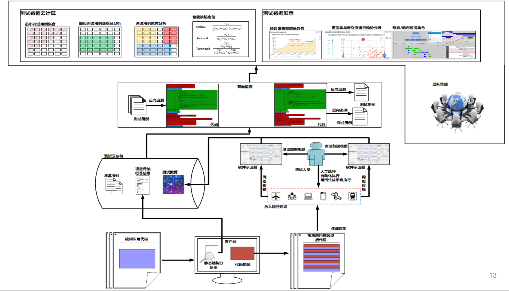

- 文章整理
	- 精准测试技术十年发展漫谈
		- 来源：https://mp.weixin.qq.com/s/UUrOD5qi1r2TBTdYXhXsog
		- 公司：星云
		- 内容
			- 精准测试的定义
				- 精准测试一句话概括就是：测试用例和代码之间的追溯，这是它最本质的东西。
				- 精准测试建立起了用例和代码的关系，相当于把黑盒和白盒关联起来，做黑盒测试时获取到白盒数据。
				- 另外一个层面，精准测试最本质就是线程覆盖测试。它跟白盒最大的区别是覆盖率是线程级的，也就是说我们要追溯到用例这个级别。
			- 精准测试技术发展
				- 建立一些基础理念，主要建立用例和代码相互追溯的基本技术方向和框架。
				- 用例和代码追溯、软件示波器、回归用例自动选取基本已经成型
				- SABI SASI
				- 覆盖率 MC/DC
				- 各种领域的数据采集（Java、C++、linux kernel、DSP芯片、安卓的Framework操作系统）
			- 精准测试的一分一合
				- “一分”指的是：精准测试不仅仅去统计（大范围的整体）代码覆盖率，而是要精确到用例级。
					- 比如回归用例选取、测试用例聚类分析、智能缺陷定位、开发测试的协同，所有的数据都可关联到用例级，精准测试的作用和范围就变得很大。
					- 用例级就能有高精准度的测试分析，传统的白盒并没有这种测试分析。
				- “一合”指的是：我们这个覆盖率已经不再是单元级的。
					- 以前白盒测只能用在单元，现在我们精准测试可以把它用到系统级，也就是功能测试阶段。星云可以在系统全速运转、数据量非常大的时候实时采集数据，并确保对原有系统不要进行干扰。
					- 实际应用中，还是可以继续延用黑盒测试的操作方法，动态执行用例后，可以得到大大超于白盒单元测试的多种测试数据及其分析结果，用起来十分方便。
				- 灰盒测试
					- 但它并不是让我们的测试工程师马上就懂代码开发、懂脚本开发、懂单元测试，它是非常自然的去把用例跟代码进行追溯分析，因为星云有一套静态逻辑分析，可以把测试使用难度大大降低
				- 精准测试可以给黑盒充分赋能
					- 精准测试是针对IT系统非常好的数字化、可量化、可评估、可考核、可度量、很精确的一种技术方法。
			- 精准测试体系
				- 运行架构图
					- 
				- 流程
					- 它首先会对源码进行一个编译和分析，把代码结构静态分析好后，将静态信息上传到后台对应项目版本中进行存储。
					- 再根据块的位置和类型信息进行插装，装点只有编号信息。
					- 代码插装好以后，放到被测系统里面直接动态去跑，测试人员用软件示波器点用例开始结束，就会自动把每个用例和代码的正向和反向追溯关系建立起来了。
				- 正反向追溯有两个主体功能，
					- 一个是能够让测试整体量化，使之看到所有的测试过程。
						- 测试工程师没有跑用例，就没有关联关系的数据；如果乱跑，我们分析一看功能完全不对，跑的功能和设计功能不应该聚类到一块但却聚类到一块，就认为是瞎跑的，跑的不对。什么都可以看得非常细致。
					- 另外，星云提供测试智能分析的一些算法
						- 如测试用例最小级、回归用例选取、测试用例的聚类分析、智能缺陷定位等
							- 例如回归用例选取这技术，它底层数据提取特别难，需要花费大量的时间去研究如何去真正落地实现。
								- 比如我们碰到的一些场景：给安卓的Framework代码插桩，然后拍张照片，照片渲染出来以后，整个安卓的驱动层代码到底怎么走？一瞬间就要驱动计算并且展示出来整体逻辑的运行情况，这个复杂度相当高。实现了这种技术，就可以用精准测试帮助手机厂商去节省CTS测试的时间。
				- 本质上，我们做测试就不应该忽视计算机的软件代码和功能间本质上的强关联性。
			- 商用精准测试的无损技术
				- 开源工具的困难点根源在于：它的分析和插桩全部在字节码上，但实际覆盖率的观测点却在源码上。 这就产生了一个严重的信息脱节，因为字节码是有损耗的。
					- 开源工具它能够看到你的条件覆盖百分比，但它根本不知道每个条件真和假，由于在字节码阶段，它的条件和真正的源码上的条件已经发生了变化，已经没人能搞得清上面和下边对应关系了。
				- 星云精准测试的SABI（字节码插装）和SASI（源码插装），可以实现真正的无损测试技术。
					- SABI，SouceCode Analyzer ByteCode Intrumentation，即源码分析字节码插装。就是说在源码上直接分析，观测点也还是在源码上。这个就能够完整实现无损的插桩，覆盖率100%精确规范。
						- SABI是依赖非常全面的源码静态分析后，经过校正后的数据往字节码插，而不是直接在字节码分析，往字节码插。SABI字节码技术可以满足国际规范的CDC的覆盖要求。
					- SASI（源码插装），是传统白盒最基础的技术，直接在源码插装，主要应用在对于覆盖率标准要求更高的领域。
						- 源码插装以后，经过高级语言、高级编译器的编译，直接生成最后发布包。这种是完全无损的，可以随时反查插装点，不会引起语法错误、功能错误等，可靠性更高。
			- 商用精准和开源精准的区别
				- 商用系统级精准测试有前置精准的静态分析过程。
				-
				-